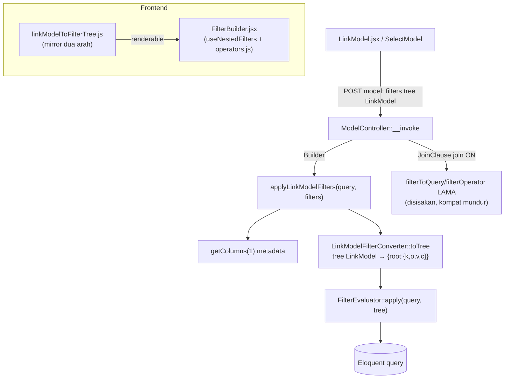

# Design Document: LinkModel Filter Converter

## Overview

`ModelController::filterToQuery`/`filterOperator` adalah engine filter "tree LinkModel" yang dipakai endpoint
model (`__invoke`) untuk komponen LinkModel & (rencananya) SelectModel. Engine ini terbatas: hanya tahu nama
kolom dari `Schema::getColumnListing()`, tanpa metadata type/relasi, sehingga **tidak punya** kapabilitas kaya
milik `FilterEvaluator` (period date/datetime, morph, column-comparison mode, formStatuses JSON-array,
whitelist operator per-type, nested whereHas multi-level).

`App\Services\Core\FilterEvaluator` sudah matang & teruji (`tests/Feature/Services/Core/FilterEvaluatorTest.php`),
mengonsumsi tree format DataTable2 `{root:{k,o,v,c}}` dengan metadata kolom dari `Model::getColumns()`.

**Solusi (Opsi A):** jalur **utama** `filterToQuery` (pada Eloquent `Builder`) di-upgrade dengan
**mengonversi** tree LinkModel → format FilterEvaluator `{root:{k,o,v,c}}`, lalu **mendelegasikan** ke
`FilterEvaluator::apply()`. Hasil: dapat seluruh kapabilitas FilterEvaluator gratis, satu sumber kebenaran.
Helper konversi dibuat terpisah (PHP + JS, dua arah) dan reusable untuk SelectModel.

**Jaminan menyeluruh (INVARIAN):** apa pun bentuk/operator/type input, hasil konversi (PHP & JS) **WAJIB
renderable di `FilterBuilder.jsx`** — setiap item `{k,o,v}` yang dihasilkan harus memakai operator yang ADA
pada `getOperators(type, ...)` (`operators.js`) untuk type kolomnya, dan value berbentuk yang diharapkan
`valueInput`-nya. Item yang tak bisa direpresentasikan dalam grammar FilterBuilder **tidak boleh dihasilkan
mentah** — harus dipetakan ke padanan yang renderable atau di-skip (dengan dev-note), tidak pernah
menghasilkan operator di luar `getOperators`.

## Kendala Penting (terverifikasi)

- `filterToQuery` punya **dua** jalur pemanggil:
  - `ModelController.php:268` → filter utama pada `Builder`. **Ini yang didelegasikan ke FilterEvaluator.**
  - `ModelController.php:259` → di dalam `join()` closure pada `JoinClause` (ON-condition). FilterEvaluator
    HANYA menerima `Builder`, **tidak bisa** menangani `JoinClause`. → engine lama `filterToQuery`/`filterOperator`
    **WAJIB tetap ada** untuk jalur join (kompatibilitas mundur).
- FilterEvaluator butuh metadata `Model::getColumns()` (type, `nameOfFunction`, `related`, `typeRelation`,
  `primaryKey`). `__invoke` saat ini hanya punya `Schema::getColumnListing()` → perlu ambil `getColumns(1)`.
- Whitelist FilterEvaluator men-**skip diam-diam** item dgn operator/kolom tak valid. Pergeseran perilaku yang
  dapat diterima (lebih aman), didokumentasikan.
- `&$with` auto-collect di `filterToQuery` lama = side-effect, BUKAN kontrak. `LinkModel.jsx:420-438` mengirim
  `with` (`_with`) **eksplisit & terpisah** dari `filters`; `__invoke` (`ModelController.php:242,276`) memuat
  `$with = $request->with` lalu `$query->with($with)`. Display relasi LinkModel ditentukan `templateLink`/`_with`.
  → jalur baru **drop auto-collect** `$with` dari filter (sama dgn FilterEvaluator di DataTable).

## Architecture



## Components and Interfaces

### 1. `app/Services/Core/LinkModelFilterConverter.php` (BARU)

Class murni (DI, tanpa Request/session). Mengubah tree LinkModel → tree FilterEvaluator `{root:{k,o,v,c}}`.

```php
class LinkModelFilterConverter {
    /** @param array<string,array<string,mixed>> $columns hasil Model::getColumns() */
    public function __construct(private array $columns) {}

    /** Konversi tree LinkModel → { root: { k:'and', c:{ <id>:node } } } */
    public function toTree(array $linkFilters, string $boolean = 'and'): array;
}
```

Reuse `FilterColumnResolver` (`new FilterColumnResolver($columns)`) untuk deteksi apakah segmen key = relasi.

**PHPDoc grammar (WAJIB)** di class docblock + `toTree()`: jelaskan grammar tree LinkModel (`@phpstan-type`
array-shape: map kolom→nilai, objek operator, key `and`/`or`, relasi dot/nested) DAN grammar output
`{root:{k,o,v,c}}`, dgn daftar operator + contoh. Sumber kebenaran grammar di sisi BE.

**Aturan konversi (rekursif):**

- Map LinkModel (`{ key: value }`, gabung AND per-level) → group `{ k:<boolean>, c:{ ...children } }`.
  Tiap entry jadi child node (item atau nested group). Id child = auto-generate.
- Key `"and"`/`"or"` → nested group; rekursi `toTree(value, key)`.
- Key relasi nested-object (`customer: { type: {...} }`) → flatten ke dot-notation: telusuri sub-tree,
  prefiks tiap key anak dgn `"<relasi>."`. Deteksi relasi via metadata (`type ∈ {relation, relations}`).
- Key kolom + value scalar → item `{ k:key, o:'=', v:value }`.
- Key kolom + value object operator (`{ ">":0, like:"x" }`) → bila >1 operator: nested group
  `{k:'and', c:[item per operator]}`; bila 1 operator: satu item. Operator `and`/`or` di dalam value →
  nested group dgn boolean tsb.

**Pemetaan operator LinkModel → FilterEvaluator:**

| LinkModel | FilterEvaluator |
|-----------|-----------------|
| (scalar shorthand) / `=` `==` `equal` | `=` |
| `!=` `not` `notEqual` | `!=` |
| `>` `>=` `<` `<=` | sama |
| `in` | `in` |
| `notIn` | `!in` |
| `between` | `between` |
| `notBetween` | `!between` |
| `like` | `matches` |
| `notLike` | `!matches` |
| pass-through `matches`/`starts_with`/`ends_with`/`has`/`!has`/`set`/`!set`/`in_period` | identitas |

**Kolom date/datetime — WAJIB dibungkus jadi `in_period`** (anti hilang-senyap + renderable).
FilterEvaluator menolak komparasi langsung pada date/datetime (`operatorsByType['date'/'datetime']` hanya
`['in_period','!in_period']`, `FilterEvaluator.php:34-35`; `isOperatorValid` skip selain itu). Frontend
`operators.js:128-135` juga HANYA merender `in_period`/`!in_period` (DateSelector). Value period terverifikasi
identik di `DateSelector.emit()` (`:380-399`) & `applyPeriod` (`FilterEvaluator.php:702-758`):

| LinkModel (kolom date) | FilterEvaluator item |
|------------------------|----------------------|
| `{">": X}` | `{o:"in_period", v:{period:"day", operator:"after",        startDate:X}}` |
| `{">=": X}` | `{o:"in_period", v:{period:"day", operator:"on-or-after",  startDate:X}}` |
| `{"<": X}` | `{o:"in_period", v:{period:"day", operator:"before",       startDate:X}}` |
| `{"<=": X}` | `{o:"in_period", v:{period:"day", operator:"on-or-before", startDate:X}}` |
| `{"=": X}` / scalar | `{o:"in_period", v:{period:"day", operator:"is",       startDate:X}}` |
| `{not: X}` | `{o:"!in_period", v:{period:"day", operator:"is",      startDate:X}}` (negate → whereNotBetween) |
| `{between:[A,B]}` | `{o:"in_period", v:{period:"day", operator:"between", startDate:A, endDate:B}}` |
| `{notBetween:[A,B]}` | `{o:"!in_period", v:{period:"day", operator:"between", startDate:A, endDate:B}}` |

Value period selalu `period:"day"`. Granularitas month/quarter/year lewat `in_period` eksplisit apa adanya.
`in`/`notIn` pada date → tak ada padanan period bersih → skip + dev-note.

**Operator tanpa padanan langsung:**
- `jsonContains`/`jsonDoesntContains` → `has`/`!has` **hanya** bila kolom `formStatuses`; selain itu skip + dev-note.
- `column` (whereColumn) → column-mode `{ kind:'column', ref:<kolom> }` op `=`; operator pembanding di dalam ikut dipetakan.
- key `raw(...)` → di luar grammar FilterEvaluator → skip (didokumentasikan).
- Value relasi by-id: FilterEvaluator `applyRelation` menerima `{id,...}`/list → value diteruskan apa adanya
  saat key bertipe `relation`/`relations` dgn operator `=`/`in`.

### 2. `app/Http/Controllers/ModelController.php` (MODIFIKASI)

- **Tambah** method privat:
  ```php
  private function applyLinkModelFilters(Builder $query, array $filters): void {
      $columns = $query->getModel()::getColumns(1);
      $tree    = (new LinkModelFilterConverter($columns))->toTree($filters);
      (new FilterEvaluator($columns))->apply($query, $tree);
  }
  ```
- **Ubah** filter utama (`ModelController.php:266-270`) → panggil `applyLinkModelFilters` (jalur `__invoke`
  selalu `Builder`). Tanpa param `&$with` (drop auto-collect).
- **Pertahankan** `filterToQuery`/`filterOperator` lama apa adanya untuk jalur `JoinClause`
  (`ModelController.php:259`).

### 3. `resources/js/lib/linkModelToFilterTree.js` (BARU)

Mirror JS. `linkModelToFilterTree(linkFilters, columns)` → tree FilterBuilder `{root:{k,c:{<id>:{k,o,v}}}}`.

- Children objek ber-id (`generateRandom(8)`, reuse `@/lib/utils`). FilterBuilder `normalizeInitialFilters`
  toleran (alias `key/operator/value` & `k/o/v`; group anak-tunggal di-collapse otomatis).
- Pemetaan operator/relasi/date **IDENTIK helper PHP** (satu spesifikasi, dua implementasi).
- Cek renderability via `getOperators(column.type, { typeRelation, hasOptions, mode })` (`operators.js`):
  operator hasil wajib ada di situ; bila tidak → petakan/skip, tak menghasilkan operator liar. Value
  relation/morph/multiselect diteruskan apa adanya (`{id,...}`/`{type,id}`/array — dipahami `ValueField`).
- **Arah balik** `filterTreeToLinkModel(tree, columns)` (untuk SelectModel rewrite §3.4): walk `{root:{k,c}}`
  rekursif; group → key `and`/`or`; item `{k,o,v}` → `{ [k]: { [opLink]: v } }` (shorthand `=` → scalar):

  | FilterEvaluator item | LinkModel |
  |----------------------|-----------|
  | `=` | scalar shorthand `{k: v}` |
  | `!=` | `{not: v}` |
  | `matches`/`!matches` | `{like}` / `{notLike}` |
  | `in`/`!in` | `{in}` / `{notIn}` |
  | `between`/`!between` | `{between}` / `{notBetween}` |
  | `>` `>=` `<` `<=` | sama |
  | `in_period` day (`after/on-or-after/before/on-or-before/is/between`) | `{">"}`/`{">="}`/`{"<"}`/`{"<="}`/scalar/`{between:[start,end]}` |
  | `!in_period` day (`is`/`between`) | `{not}` / `{notBetween}` |
  | `starts_with`/`ends_with`/`has`/`!has`/`set`/`!set` | identitas |
  | `in_period` non-day | tak ada padanan scalar → pertahankan `{in_period: v}` atau skip + dev-note |

  Round-trip `link → tree → link` setara untuk operator yang punya padanan dua arah.

- **JSDoc grammar tree (WAJIB)** di `linkModelToFilterTree.js`. Dua typedef + JSDoc fungsi, jadi sumber
  kebenaran grammar di sisi FE (selaras `.kiro/specs/select-model-rewrite/design.md` §3.3):
  - `@typedef {Object<string,*>} LinkModelFilterTree` — grammar tree LinkModel: map kolom→nilai (scalar =
    operator `=` shorthand), objek `{ <operator>: <value> }` (AND antar-operator), key `and`/`or` = grup
    boolean, key `relation.column` / `relation: {...}` = filter relasi (whereHas). Daftar operator lengkap +
    `@example` per kasus (shorthand, operator eksplisit, grup boolean, relasi, date).
  - `@typedef {{root:{k:string,c:Object}}} FilterBuilderTree` — tree `{root:{k,o,v,c}}` yang dikonsumsi
    `FilterBuilder`/`useNestedFilters`.
  - JSDoc tiap fungsi (`linkModelToFilterTree`, `filterTreeToLinkModel`) merujuk kedua typedef di
    `@param`/`@returns`, + `@see` ke `operators.js`, `FilterEvaluator.php`, `useNestedFilters.jsx`.
  - Sertakan catatan invarian renderability di JSDoc (operator hasil selalu ∈ `getOperators(type)`).

### File yang Disentuh

| File | Perubahan |
|------|-----------|
| `app/Services/Core/LinkModelFilterConverter.php` | **BARU** — konversi PHP tree LinkModel → `{root:{k,o,v,c}}` |
| `app/Http/Controllers/ModelController.php` | Tambah `applyLinkModelFilters()`; arahkan filter Builder; sisakan engine lama utk join |
| `resources/js/lib/linkModelToFilterTree.js` | **BARU** — konversi JS dua arah: tree LinkModel ↔ tree FilterBuilder |

Reuse (tanpa modifikasi): `FilterEvaluator.php`, `FilterColumnResolver.php`, `LinkModel.php::getColumns`,
`operators.js`, `useNestedFilters.jsx`, `lib/utils.js` (`generateRandom`).

## Testing Strategy

- **Backend** `tests/Feature/Services/Core/LinkModelFilterConverterTest.php` (pola `FilterEvaluatorTest.php`:
  model stub + `RefreshDatabase` + metadata kolom inline). End-to-end: tree LinkModel → konversi → apply →
  assert row di DB.
  - scalar shorthand → `=`; `not`/`notEqual` → `!=`; `notIn` → `!in`; `notLike` → `!matches`; `notBetween` → `!between`.
  - `like` → `matches`; `>` `>=` `<` `<=` `between` `in`.
  - grup `or`/`and` bersarang: `{ and:{ a:1, or:{ b:2, c:3 } } }`.
  - relasi dot `{ "category.type": {not:"x"} }`; relasi nested-object `{ category:{ type:"x" } }`;
    relasi by-id `{ category:{ in:[...] } }`.
  - formStatuses via `jsonContains` → `has`; `column` → column-mode.
  - date/datetime: `{">":X}`→`in_period`/after, `{between:[A,B]}`→`in_period`/between, `{not:X}`→`!in_period`;
    assert row terfilter + value period berbentuk DateSelector (`period:"day"`, `operator`, `startDate`).
  - operator/kolom tak valid → di-skip diam-diam (tidak error).
  - Jalankan: `php artisan test --compact --filter=LinkModelFilterConverter`.
  - Regresi: `php artisan test --compact --filter=FilterEvaluator` (tak tersentuh).
- **Frontend** (`linkModelToFilterTree`): verifikasi manual — render hasil konversi ke
  `<FilterBuilder columns value={tree}>` beragam type (string/number/date/datetime/relation/morph/formStatuses)
  + operator; pastikan semua item tampil benar (operator terpilih, value field sesuai) — bukti invarian
  renderability. Round-trip `filterTreeToLinkModel`: `link → tree → link` setara.
- **JSDoc/PHPDoc** ada & lengkap: typedef `LinkModelFilterTree` + `FilterBuilderTree` (JS), `@phpstan-type`
  (PHP), `@example` per kasus operator, `@see` cross-ref. Lolos eslint (jsdoc) + larastan bila ada rule.
- **Lint akhir** (setelah semua hijau): `vendor/bin/pint --dirty --format agent` + eslint file JS baru.

## Open Questions

[TODO: konfirmasi] granularitas date non-day (month/quarter/year) di arah-balik `filterTreeToLinkModel` —
pertahankan `{in_period: v}` apa adanya, atau skip? Default rencana: pertahankan apa adanya.
