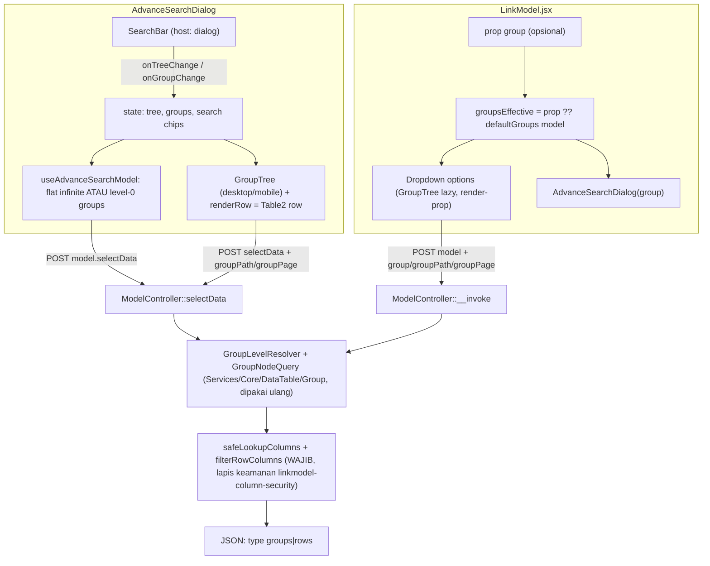

# Design Document: LinkModel Grouping & Search Bar

## Overview

Membawa dua fitur `DataTable2` ke `LinkModel`:

1. **Advance Search Dialog** ([AdvanceSearchDialog.jsx](../../../resources/js/Components/LinkModel/AdvanceSearchDialog.jsx)) — `InputGroupInput` + tombol `FilterTable2` diganti total oleh `SearchBar` (chip, saran, panel Filter Tersimpan + Group by), dan hasilnya dapat dikelompokkan bertingkat memakai `GroupTree` lazy + `GroupLevelsEditor`.
2. **Options dropdown LinkModel** — opsi dapat dikelompokkan bertingkat dengan **tree lazy gaya DataTable2** (keputusan user; bukan flat + header run-length).
3. **Prop `group` pada `LinkModel`** — urutan resolusi: prop `group` → `$defaultGroups` model (`Model::getDefaultGroups()`).

Spec rujukan (tidak diedit): [`datatable2-advanced-search`](../datatable2-advanced-search/design.md), [`datatable2-group-tree`](../datatable2-group-tree/design.md), [`datatable2-grouping`](../datatable2-grouping/design.md), [`linkmodel-advanced-search`](../linkmodel-advanced-search/design.md), [`linkmodel-column-security`](../linkmodel-column-security/design.md).

**Temuan penelusuran kode (fakta, bukan asumsi):**

| # | Temuan | Dampak |
|---|---|---|
| F1 | Advance Search memanggil `POST model.selectData` (`ModelController::selectData`, `routes/web.php:147`) yang akhirnya memanggil macro `Model::dataTable()`; macro mengembalikan array `['data' => paginator]` bila bukan Inertia. | Jalur grup Advance Search bisa memakai `GroupLevelResolver`/`GroupNodeQuery` yang sama. |
| F2 | Dropdown memakai route `model` (`ModelController::__invoke`, `ModelController.php:519`) — **tidak** memakai macro `dataTable()`: search LIKE + join + `limit` sendiri + `cacheMode`. | Grup di dropdown butuh jalur baru di `__invoke` (bukan sekadar memanggil ulang macro). |
| F3 | Macro meng-expand grup lewat `throw HttpResponseException(response()->json(...))` (`DataTableScope.php:460`), sehingga respons **melewati** `ModelController::filterRowColumns()` (penyaring kolom aman `linkable`, lapis kedua spec `linkmodel-column-security`). | Jalur grup `selectData`/`__invoke` WAJIB menerapkan `safeLookupColumns` + `filterRowColumns` sendiri pada baris `rows` dan `label` relasi. **Risiko keamanan utama spec ini.** |
| F4 | Spec group-tree menyatakan konsumen XHR macro (LinkModel) "tidak pernah terkena grouping" (`datatable2-group-tree` Req 10.3, 7.5). | Aturan itu diubah **sengaja**: grouping aktif untuk XHR hanya bila request membawa `group` eksplisit **dan** endpoint mengizinkannya (opt-in), tetap tak terpengaruh untuk konsumen lain. |
| F5 | `SearchBar` sengaja host-agnostic; spec advanced-search §10 menyebut host LinkModel cukup mengoper kolom `templateLink` sebagai `getSearchColumns` dan tree sebagai `onTreeChange`. | Adopsi tidak butuh perubahan kontrak `SearchBar`; UX chip-on-Enter vs live-as-you-type **harus diputuskan** (lihat Open Questions). |
| F6 | `useAdvanceSearchModel` sudah `useInfiniteQuery` (25/halaman, sentinel). `GroupTree` memakai paginasi per-node (`groupPage`) dan tidak infinite di desktop (hanya mobile). | Interaksi infinite scroll flat ↔ `GroupTree` perlu ditetapkan (mode grup mematikan infinite flat). |

## Architecture



Prinsip: **tidak ada mesin grup kedua.** `GroupLevels`, `GroupLevelResolver`, `GroupPath`, `GroupNodeQuery`, `GroupBucket`, `GroupKeyNormalizer`, serta FE `groupLevels.js`, `GroupTree`, `useGroupNode`, `GroupLevelsEditor`, `GroupHeaderRow` dipakai ulang; yang baru hanyalah **adapter** per host (transport + gerbang keamanan + sumber `groupable`).

## Components and Interfaces

### 1. Backend

| Area | Perubahan |
|---|---|
| `ModelController::selectData` | Terima `group` (list, dinormalkan `GroupLevels::normalize`), `groupGranularity/Range`, `groupPath`, `groupPage`. Bila level valid: jalankan `GroupNodeQuery` di atas `$query` yang SUDAH berisi `baseFilters`, `filters`, `search`, scope kolom aman; hasil `rows` disaring `filterRowColumns`; `groups` dengan `label` relasi disaring sama. Tanpa `group`/`groupPath`: jalur flat existing (byte-identik). |
| `ModelController::__invoke` | Sama untuk route `model` (dropdown): `group`/`groupPath`/`groupPage`; hormati `filters`, `search`, `keywords`, `joins`; `show` (PAGE_SIZE) per node. Tambahan flat: param `page`/`show` → paginasi + `current_page/last_page/per_page` (tanpa `page`, perilaku `limit` lama tetap untuk konsumen lain). **[TODO: konfirmasi perilaku `joins` + group — query join memakai `SELECT *` manual, konflik dgn `GroupNodeQuery` (lihat Open Questions).]** |
| Gate `groupable` | Memakai `GroupColumnGate::sanitizeColumns` apa adanya. Kolom juga HARUS lolos `safeLookupColumns` (kolom yang tidak aman/linkable tidak boleh jadi level grup — kalau tidak, `GROUP BY` membocorkan nilai distinct kolom terlarang). **[TODO: tetapkan: level grup ⊆ kolom `linkable` atau sumber templateLink.]** |
| Default grup model | Endpoint membagikan `defaultGroups` (efektif, lolos gate) di respons awal bersama `columns`, agar FE `LinkModel` dapat fallback tanpa request tambahan. `Model::getDefaultGroups()` dibaca lewat `property_exists` (sudah ada). |
| `DataTableScope` | Aturan "XHR tanpa `groupPath` mengabaikan `group`" (Req 7.5) **dipertahankan** untuk konsumen lain; jalur `selectData` membuka grup lewat flag eksplisit di controller, bukan melonggarkan macro global. **[TODO: pilih: (a) `selectData` memanggil `GroupNodeQuery` langsung, tanpa macro; (b) parameter opt-in ke macro.]** |
| Test | PHPUnit: paritas constraint (`baseFilters`+`filters`+`search`), safe-column pada `rows` & `label`, gate `groupable`∩`linkable`, `groupPath` invalid 422, zero-overhead tanpa `group`, `joins`. |

### 2. Frontend — Advance Search Dialog

- Hapus `InputGroup` (+ `InputGroupInput`, tombol `FilterTable` trigger). Ganti `SearchBar` (host-agnostic) dengan:
  - `columns` = `filterColumnMap` (semua kolom schema, sama seperti FilterTable sekarang);
  - `tree`/`onTreeChange` = `additiveFilters`/`setAdditiveFilters`; `lockedFilters` (prop `filters` LinkModel) tetap ditampilkan locked/read-only di Builder lanjutan;
  - `getSearchColumns` = kolom sumber `templateLink` (`lockedColumnNames`) — menggantikan state `search` string + `initialSearch` carry-over (**[TODO: nasib carry-over `initialSearch` dari input LinkModel — jadi chip "Cari"?]**);
  - `group`/`onGroupChange`/`groupOptions` = `GroupLevelsEditor` di panel; `model` diberikan → Filter Tersimpan aktif.
- Mode grup aktif → `GroupTree` menggantikan `Table2` flat + `InfiniteScrollSentinel` desktop; `renderRow` = baris `Table2` (`TableRow`, klik = `handlePick`); mobile: `renderRow` = tombol `templateLink` yang ada.
- `useAdvanceSearchModel` mendapat cabang level-0: `useInfiniteQuery` flat dimatikan (`enabled:false`) saat grup aktif; level-0 dimuat dengan `selectData` + `group` (halaman level-0 memakai `Pagination`/tombol lanjut — **[TODO: infinite vs pager untuk level-0 dalam dialog]**).
- `buildAdvanceSearchColumnMap` tetap membatasi kolom tampil ke "kolom aman"; `groupable` dihitung dari `filterColumnMap` ∩ gate server.

### 3. Frontend — Options dropdown (tree lazy)

- Dropdown `Command`/cmdk berisi `GroupTree` (render-prop): header grup = baris `CommandItem` non-seleksi (toggle buka/tutup), anak `rows` = `CommandItem` opsi seperti sekarang (`convertTemplateLink`), sentinel `more`/`add`/`advance_search` tetap di dasar.
- `useGroupNode` dipakai apa adanya dengan **transport adapter** (POST `route("model")` alih-alih GET index); kunci cache TanStack mencakup `model`, `filters`, `search`, `groupPath`, `groupPage`.
- **Tanpa `limit`, infinite scroll — keputusan user.** Prop `limit` dihapus dari `LinkModel` (tidak ada pemanggil yang mengoper `limit=`; diverifikasi grep). Daftar opsi (flat maupun dalam grup) dimuat per halaman `PAGE_SIZE` = 25 (sama dengan `PER_PAGE` dialog) dan halaman berikutnya ditambahkan saat `InfiniteScrollSentinel` (sudah ada di `Components/LinkModel/`) di dasar `CommandList` terlihat. Dampak:
  - Baris **"more"** dihapus (fungsinya — "ada data lain" — digantikan scroll). Baris Advance Search tetap sticky di dasar.
  - **Flat (tanpa grup):** `useLinkModelOptions` mode search pindah ke `useInfiniteQuery` (`page`/`show`); route `model` mendapat paginasi (`page`, `show`; respons tambahan `current_page`, `last_page`, `per_page`). Hook tetap menerima `limit` untuk konsumen lain (`SearchBar` live-suggestion relasi, limit 8/5) — perilaku mereka tidak berubah.
  - **Dalam pohon:** isi node memakai mode infinite `GroupTree` (sudah ada untuk mobile, `datatable2-group-tree` Req 21.4): halaman node ditambahkan di bawah, header node menampilkan "dimuat / total"; daftar level-0 juga infinite (sentinel di bawah grup terakhir). Tidak ada pager per node di dropdown.
  - **Cache mode:** seluruh data di memori; render bertahap (jendela `PAGE_SIZE` bertambah saat sentinel terlihat) agar DOM tidak membesar.
  - Keyboard cmdk: item baru yang ditambahkan infinite tidak boleh mencuri sorotan/scroll posisi; sorotan dipertahankan berdasar `value` item.
- **Search terisi (mode search) — keputusan user: pohon + auto-expand.** `search` dikirim ke setiap request node, sehingga level-0 hanya memuat grup yang punya baris cocok dan `count` = jumlah baris cocok (bukan total grup). Mengetik mereset state terbuka lalu menerapkan aturan auto-expand berikut, dihitung di FE dari `count` deskriptor level-0 (tanpa request tambahan untuk memutuskan):
  - Anggaran baris = `PAGE_SIZE` (25; `limit` sudah dihapus). Grup level-0 dibuka berurutan selama jumlah kumulatif `count` ≤ anggaran, maksimum 3 grup level-0; grup pertama selalu dibuka walau `count` > anggaran (menampilkan `show` baris + pager node).
  - Di dalam node yang terbuka dan berisi sub-grup, aturan yang sama diterapkan rekursif (anggaran tersisa), sampai node daun.
  - Grup yang tidak terbuka tetap tampil tertutup dengan `count` cocok. Baris "more" tidak ada lagi (infinite scroll); Advance Search dari baris aksi membawa `search` + grup efektif (chip "Cari" + chip Group by).
  - Highlight teks cocok hanya pada baris opsi (`convertTemplateLink(opt, search)`); header grup tidak di-highlight (search mencocokkan kolom record, bukan nilai grup).
  - User boleh menutup/membuka manual; aturan auto-expand hanya dijalankan saat `search` atau data level-0 berubah (tidak melawan toggle manual user pada data yang sama).
  - Search kosong (atau `allowSearch=false` karena ada nilai terpilih): semua grup tertutup, tanpa auto-expand.
- **Cache mode (`cache`) — keputusan user: grup dihitung di client.** Seluruh data sudah di memori (`filteredOptions`), jadi pengelompokan, `count`, dan filter `search` dihitung di client memakai `groupLevels.js`; tidak ada request grup ke server dan `selectData`/`model` tidak berubah untuk cache mode. `GroupTree` menerima sumber data lokal (adapter in-memory menggantikan `useGroupNode`); aturan auto-expand sama. Gate keamanan tetap berlaku karena data berasal dari payload cache yang sudah disaring server. **[TODO: tentukan ekspresi bucket date/number di client — dipakai ulang dari `dateGroupBucketKey`/`numberGroupBucketKey`? spec group-tree menghapusnya karena bahaya drift dengan SQL; untuk cache mode boleh dibatasi ke kolom string/relasi/boolean.]**
- Keyboard: `↑/↓/Enter` pada header grup = toggle; `Tab` autocomplete (spec `project_tab_autocomplete_select_linkmodel`) hanya berlaku pada baris opsi. **[TODO: model keyboard cmdk ↔ tree lazy (item dinamis per node) — butuh prototipe.]**
- Render ringan: indentasi depth, count, tanpa agregat (`groupAggregate` tidak relevan) — **[TODO: konfirmasi agregat ditampilkan atau tidak]**.

### 4. Prop `group` pada `LinkModel`

```jsx
<LinkModel
  model="App\\Models\\Sales\\Item"
  group={["category", { column: "created_at", granularity: "month" }]}   // opsional
/>
```

- Bentuk masukan = `normalizeGroupLevels` (string | list string | list objek | campuran).
- Prioritas: `props.group` (termasuk `[]` = eksplisit tanpa grup, menimpa default) → `defaultGroups` model → tanpa grup (jalur flat existing, zero-overhead).
- Berlaku untuk dropdown **dan** diteruskan ke `AdvanceSearchDialog` sebagai `group` awal (grup efektif yang sama: prop → `$defaultGroups`). Saat dialog dibuka, chip Group by di SearchBar langsung terisi grup itu dan `GroupTree` aktif tanpa aksi user.
  - Inisialisasi dilakukan **tiap kali dialog dibuka** (pola yang sama dengan re-init `initialSearch` saat `open` berubah), sehingga nilai prop terbaru selalu terbawa.
  - Perubahan di panel dialog (tambah/hapus/urut level, "Tidak ada") hanya mengubah state lokal dialog; tidak memengaruhi dropdown dan direset ke grup prop saat dialog dibuka lagi.
  - Prop `group={[]}` = eksplisit tanpa grup: dropdown flat, dialog juga dibuka tanpa grup (user tetap bisa mengelompokkan sendiri di panel). Ini menimpa `$defaultGroups` model.
  - Grup dari prop tetap melewati gate `groupable` ∩ kolom aman di server; level yang tidak valid dibuang diam-diam (chip hanya menampilkan level yang lolos, dari `groupMeta.levels`/`defaultGroups` respons).

## Data Models

Tidak ada migration. Kontrak `Groups` dipakai ulang. Tambahan respons: `defaultGroups` pada payload awal `selectData`/`model`; field `type: "groups"|"rows"` pada respons expand (bentuk sama `datatable2-group-tree` §Data Models, **tetapi** baris sudah tersaring kolom aman).

## Error Handling

| Skenario | Perilaku |
|---|---|
| `group` berisi kolom tak groupable / tak aman | Level dibuang diam-diam (sama `datatable2-group-tree`) |
| `groupPath` invalid | 422 `{message}` |
| Kolom hasil grup tidak lolos `safeLookupColumns` | Level dibuang; bila semua terbuang → jalur flat |
| `joins` aktif bersama `group` | **[TODO: tolak (grup diabaikan) atau dukung]** |
| Node gagal di-fetch | Baris error + "Coba lagi" di node itu saja |

## Testing Strategy

- **BE (PHPUnit):** lihat §1 Test. Wajib: bukti `filterRowColumns` terpasang di jalur `rows` & `label` (kolom non-linkable tidak muncul di JSON expand).
- **FE (Vitest):** `AdvanceSearchDialog` dengan SearchBar (chip → tree → `selectData`), mode grup (GroupTree + pick row), carry-over; `LinkModel` dropdown tree (buka grup, pilih opsi, reset saat search berubah, prop `group` vs default); `useAdvanceSearchModel` cabang grup. Tanpa `vi.useFakeTimers` (Radix/cmdk).
- **Manual (blind spot):** `npm run build`, `php artisan migrate` bila ada; MySQL `only_full_group_by` pada jalur `selectData`/`model`; keyboard dropdown; mobile dialog.

## Out of Scope (sementara)

- Agregat (`groupAggregate`) di dropdown.
- Grouping di `SelectModel`, `ChartLinkModel`, `ModelController::columns`.
- Persist state terbuka/tertutup grup.

## Open Questions (perlu konfirmasi user)

1. **UX SearchBar di dialog:** chip-on-Enter + tombol Search (staged-apply, persis DataTable2) atau live-as-you-type untuk kotak "Cari"? (spec advanced-search §10 menandai ini harus diputuskan.)
2. **Carry-over `initialSearch`:** teks yang sudah diketik di input LinkModel dibawa sebagai chip "Cari" di dialog?
3. **Keamanan grup:** level grup dibatasi ke kolom `linkable`/sumber `templateLink` saja (rekomendasi), atau semua kolom `groupable` model?
4. **`joins` + group** pada route `model`: tidak didukung (grup diabaikan) — setuju?
5. ~~**Cache mode:**~~ **Dijawab user:** dihitung di client (lihat §3). Sisa TODO: dukungan tipe kolom bucket di client.
5b. ~~**Search + grup di dropdown:**~~ **Dijawab user:** pohon + auto-expand (lihat §3).
6. **Level-0 di dialog:** pager atau infinite scroll?
7. **Dropdown tree + cmdk:** terima kompleksitas keyboard/Tab (akan diprototipe lebih dulu), atau turunkan ke opsi "flat + header" bila terlalu rumit?

## Catatan Implementasi (final)

Keputusan yang diambil saat implementasi (melengkapi/menggantikan TODO di atas):

- **Backend `selectData`:** macro `dataTable()` mendapat opt-in `groupTree=1` (level-0 + default model + `groupMeta`/`defaultGroups` untuk request XHR); aturan "XHR tanpa `groupPath` mengabaikan `group`" bagi konsumen lain TIDAK berubah. Gerbang kolom aman = `LinkModelGroupGate` (level ⊆ kolom yang lolos `safeLookupColumns`; kolom level diminta eksplisit: skalar tetap wajib `linkable`/templateLink/`forceSelect`, relasi lolos bila `visibleFor` terpenuhi). Respons expand (`HttpResponseException`) dicegat di controller, baris `rows` dan `label` relasi disaring `filterRowColumns`.
- **Backend route `model`:** `page`/`show` -> paginasi flat (`current_page`/`last_page`/`per_page`); `group`/`groupPath` -> `groupedLookupResponse()` (`GroupNodeQuery` langsung, tanpa macro); `joins`/`cacheMode` + `group` -> grup diabaikan. `groupMeta.levels` membawa `valueTrans`/`parse` kolom untuk dekode label header dropdown.
- **Frontend seam:** `fetchGroupNode`/`useGroupNode`/`useGroupNodeInfinite` menerima `fetcher` kustom (default GET index DataTable2 tak berubah); `GroupTree` menerima `fetcher`, `autoExpand {budget,maxGroups}` + `autoExpandKey`, dan memberi `pathKey` ke `renderGroupHeader`. Auto-expand: `computeAutoExpand` (murni, `groupAutoExpand.js`), level-0 lewat efek yang ditandai tanda tangan 3 grup pertama, nested lewat `autoPendingRef`.
- **Cache mode:** `localGroups.js` (`inferLevels`, `groupNodeFromRows`, `createLocalGroupFetcher`) memberi `fetcher` in-memory; hanya string/relasi/boolean. Default model tak diterapkan pada cache mode (payload cache tidak membawa `groupTree`) -- hanya prop `group`.
- **Dropdown:** `useLinkModelInfiniteOptions` (mode search) + `GroupedOptions` (header = `CommandItem` toggle, baris = `CommandItem` opsi, registri `knownRowsRef` untuk Tab-autocomplete & exact-match-on-close). Prop `limit` dan baris "more" dihapus; key i18n `core.form.linkmodel.more` DIPERTAHANKAN karena masih dipakai `InputBarcode.jsx`.
- **Dialog:** `SearchBar` + `FilterTable2` controlled (Builder), `useAdvanceSearchModel` mengirim `groupTree:true` (+ `group` eksplisit bila ada), `placeholderData: keepPreviousData`; desktop = `Table2 group={...}` (prop `fetcher`/`infinite` diteruskan), mobile = `GroupTree` kartu. Carry-over `initialSearch`: dikirim sebagai `search` sampai kolom templateLink diketahui, lalu jadi chip "Cari" (1 kolom = leaf `matches`, >=2 = grup OR). Dialog mereset tree/grup/groupSort tiap dibuka.
- **Perilaku warisan yang tidak diubah:** setelah mengetik lalu menutup dropdown tanpa memilih, `debouncedSearch` lama tetap dipakai sampai user mengetik lagi (logika `allowSearch` LinkModel yang sudah ada).
