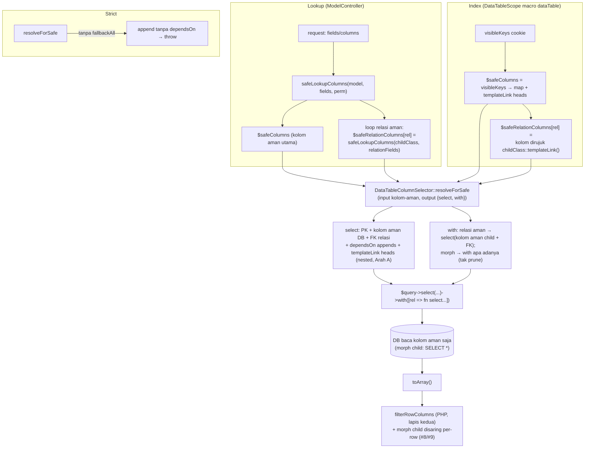

# Design Document: Lookup SELECT Pruning + DataTable2 Strict

## Overview

Saat ini endpoint lookup (`POST /model` `__invoke`, `POST /model/select-data` `selectData`) menjalankan
`SELECT *` lalu menyaring kolom di PHP (`ModelController::filterRowColumns`, spec `linkmodel-column-security`).
Aman untuk response, TAPI **DB tetap membaca kolom sensitif** (mis. `price`/`rate`/`valuation_rate`) ke memori
sebelum dibuang. Spec ini memperketat ke **SELECT level** — DB hanya membaca kolom yang diizinkan, seperti
DataTable2 (`DataTableScope` + `DataTableColumnSelector` adaptive-select).

Hasil diskusi memperluas spec dari rancangan awal menjadi **satu mesin select-resolver yang dipakai BERSAMA**
oleh lookup dan index:

1. **`resolveForSafe` — mesin tunggal kolom-aman.** Method baru di `DataTableColumnSelector` yang menerima
   **himpunan kolom aman** (bukan `visibleKeys` cookie) dan menghasilkan `select` + `with` presisi, **tanpa**
   `fallbackAll`. Dipakai oleh lookup DAN index (konvergensi penuh — `resolve()` lama dipensiun).
2. **DataTable2 strict.** Hapus `fallbackAll` (`SELECT *`). Append/accessor tanpa `dependsOn` → throw (paksa
   deklarasi). SELECT presisi di mana pun.
3. **templateLink nested (Arah A).** Resolver menelusuri rantai relasi templateLink secara **rekursif**
   (mis. `:approvalInstance.document`) via `FilterColumnResolver::resolvePath`, dengan cycle guard + depth cap.
4. **Morph aman.** Relasi `morphTo` tak bisa di-prune di SELECT (tabel berbeda per-row) → child `SELECT *`;
   tetapi **WAJIB disaring di `filterRowColumns` per-row** (ambil FQCN dari kolom `<morph>_type`). Class morph
   yang bukan model standar (tanpa `getColumns`) → **fail-closed: buang seluruh relasi morph** dari response.

> **Keputusan user (terkunci dari diskusi):** lihat tabel "Keputusan Desain" di bawah.

## Keputusan Desain (terkunci)

| # | Keputusan |
|---|-----------|
| 1 | **API**: method baru `resolveForSafe($cols, $model, $safeColumns, $safeRelationColumns, $templateLink)` → `{select, with}`, **tanpa** `fallbackAll`. `resolve()` lama dipensiun. |
| 2 | **Konvergensi penuh**: `DataTableScope` (index) DAN lookup (`ModelController`) sama-sama memakai `resolveForSafe`. |
| 3 | **Child-pruning**: lookup suplai `$safeRelationColumns` dari `safeLookupColumns(child)` (kolom aman per-permission); index suplai dari kolom yang dirujuk **templateLink child**. |
| 4 | **Strict**: hapus `fallbackAll`; accessor tanpa `dependsOn` → throw **selalu** (buang cabang produksi `Log::warning + return false`). |
| 5 | **Meta global**: `route`/`keyModel`/`thisModel` exempt (tak baca kolom DB); `appendStatus` → baseline `status` ikut SELECT **hanya jika `Schema::hasColumn(table,'status')`**, accessor tetap selalu tampil; `canDelete`/`disabledOn` → wajib `dependsOn` bila override-nya baca kolom. |
| 6 | **Arah A** — templateLink di-resolve **nested rekursif** (via `resolvePath`), dengan **cycle guard** + **depth cap = 4**. |
| 7 | **Morph SELECT-level**: tak di-prune → child `SELECT *`; relasi morph tetap di-`with` (FK + morph type di-collect). |
| 8 | **Morph filter response**: WAJIB disaring di `filterRowColumns` per-row — FQCN dari `<morph>_type` → `safeLookupColumns(class)` → saring rekursif. (Menambal celah yang sekarang bocor.) |
| 9 | **Morph class asing** (tanpa `getColumns`) → **fail-closed: buang seluruh relasi morph** dari response. |
| 10 | **Prasyarat audit** (`dependsOn` ~11 model + override `appendStatus`/`replaceStatus`/`canDelete`/`disabledOn` + templateLink nested) **tuntas SEBELUM** hapus `fallbackAll`. |
| 11 | `filterRowColumns` dipertahankan sebagai **lapis kedua** (defense-in-depth) di SEMUA jalur, plus diperbaiki untuk morph (#8/#9). |

## Status & Cakupan (verified)

| Fakta | Nilai |
|-------|-------|
| Model punya appends/attribute | **21** |
| Model punya `dependsOn` | **10** → gap **~11** |
| Model punya `forceAppend` (virtual scope join) | 1 |
| Meta global (`getArrayableAppends`, `LinkModel.php:199-208`) | `route`, `canDelete`, `keyModel`, `appendStatus`, `thisModel`, `templateLink`, `disabledOn` — ditambah ke SEMUA model |
| `DataTableScope` blast radius | global scope via `bootLinkModel` (`LinkModel.php:30`) → **semua model** kena. Macro `dataTable` (`DataTableScope.php:50-154`). RISIKO TINGGI. |
| `DataTableColumnSelector::resolve` callers | **7** di `DataTableScope.php` (lewat macro). Tes: `tests/Unit/Services/Core/DataTableColumnSelectorTest.php` |
| `safeLookupColumns` callers | **3** di `ModelController` (`__invoke`, `selectData`, `filterRowColumns`) |
| Strict throw existing | `collectAppend` (`DataTableColumnSelector.php:176-178`) **sudah throw di non-produksi**; di produksi `Log::warning + return false` → set `fallbackAll`. Strict = buang cabang produksi. |
| Morph filter saat ini | `morphTo` tak punya `$col['related']` → tak masuk `relatedModelMap` → `filterRowColumns:292` teruskan **apa adanya** (CELAH: kolom morph child lolos tanpa filter). |

**Risiko utama (strict):** `getAppendStatusAttribute` (`LinkModel.php:235-236`) membaca `$this->status`. Meta
`appendStatus` ditambah ke SEMUA model. Tanpa baseline `dependsOn:['status']` → strict throw di SEMUA model.
Maka audit `dependsOn` + baseline `status` = **prasyarat** sebelum strict diaktifkan.

## Architecture



**Data flow `resolveForSafe`:**

1. Mulai `select = [PK]`, `with = []`.
2. Untuk tiap kolom di `$safeColumns`:
   - **kolom DB nyata** → `select[] = name`.
   - **relasi (`relation`)** → `with[] = fn`; FK BelongsTo/morph → select; child select dibatasi
     `$safeRelationColumns[rel]` (kecuali morph → tanpa batas, child `SELECT *`).
   - **`forceAppend`** (virtual scope join) → skip (jangan select, jangan throw).
   - **accessor/append** → `dependsOn` wajib; tanpa `dependsOn` → **throw** (strict). Kolom sumber `dependsOn`
     ikut select; entry ber-dot → relasi + FK ikut.
3. **templateLink (Arah A)**: parse placeholder via `resolvePath`. Untuk tiap placeholder yang ujungnya kolom
   skalar → select kolom di model terdalam + `with` rantai relasinya + FK tiap segmen. Untuk placeholder yang
   ujungnya relasi non-morph → rekursi ke `childClass::templateLink()` (cycle guard + depth cap 4).
4. Return `{select: unique, with: unique-with-child-closures}`.

## Components and Interfaces

### 1. `DataTableColumnSelector::resolveForSafe()` — mesin baru

```php
/**
 * Bangun select+with presisi dari HIMPUNAN KOLOM AMAN (bukan visibleKeys cookie).
 * Dipakai lookup (kolom aman per-permission) DAN index (kolom dari templateLink).
 *
 * @param array<string,mixed>               $dataTableColumns     metadata kolom model utama (Model::getColumns(1))
 * @param Model                             $model                instance model utama
 * @param array<string,bool>                $safeColumns          kolom aman model utama (key = nama kolom)
 * @param array<string,array<string,bool>>  $safeRelationColumns  relasi => kolom aman child (key = nama kolom)
 * @param ?string                           $templateLink         template link (mis. ":approvalInstance.document")
 * @return array{select: list<string>, with: array<string,\Closure|list<string>>}
 */
public function resolveForSafe(
    array $dataTableColumns,
    Model $model,
    array $safeColumns,
    array $safeRelationColumns,
    ?string $templateLink
): array;
```

- **Tanpa `fallbackAll`** di return — strict.
- `with` memetakan relasi → closure `fn ($q) => $q->select([kolom aman child + FK])`; untuk **morph** → relasi
  di-`with` tanpa closure-select (child `SELECT *`).
- Reuse private existing: `collectRelation`, `collectAppend`, `collectDependsRelation`, `dbColumns`,
  `templateLinkHeads` (di-upgrade ke nested via `resolvePath`).

### 2. Strict — `collectAppend` + hapus `fallbackAll`

```php
// collectAppend: append tanpa dependsOn → throw SELALU
private function collectAppend(Model $model, array $col, array &$select, array &$with): void {
    $dependsOn = $col['dependsOn'] ?? null;
    if (! is_array($dependsOn) || $dependsOn === []) {
        $name = $col['name'] ?? '(unknown)';
        throw new \RuntimeException(
            "DataTable append column '{$name}' tidak punya 'dependsOn' di configColumns. "
            . 'Tambahkan dependsOn agar kolom sumbernya bisa di-SELECT presisi.'
        );
    }
    // ... proses dependsOn (lokal vs relasi) — sama seperti sekarang
}
```

- Buang `if (! app()->isProduction()) { throw } Log::warning(...) return false;` → throw tunggal.
- `resolve()` lama (return `fallbackAll`) **dihapus**; pemanggil di `DataTableScope` diarahkan ke
  `resolveForSafe`. Cabang `if ($resolved['fallbackAll']) addSelect("*")` di `DataTableScope.php:95-99` dibuang.

### 3. templateLink nested rekursif (Arah A)

Upgrade penanganan templateLink dari single-level (`templateLinkHeads` `explode('.')[0]`) ke **rantai penuh**:

```php
/**
 * Resolusi templateLink → kolom select + relasi with (rekursif, cycle-guarded).
 *
 * @return array{select: list<string>, with: array<string,...>}
 */
private function resolveTemplateLink(Model $model, ?string $templateLink, array &$visited, int $depth = 0): array;
```

- Tiap placeholder `:a.b.c` di-resolve via `FilterColumnResolver::resolvePath` → relasi `[a, a.b]` ke `with`
  + FK tiap segmen ke select + kolom akhir `c` di model terdalam.
- Placeholder yang ujungnya **relasi non-morph** → rekursi `resolveTemplateLink(childClass::templateLink())`.
- **Cycle guard**: `$visited[FQCN]` — kalau model sudah dikunjungi → berhenti.
- **Depth cap**: `$depth >= 4` → berhenti (relasi lebih dalam tak di-with).
- **Morph** di rantai → berhenti (class child tak pasti build-time; relasi morph tetap di-`with`, child `SELECT *`).

### 4. `DataTableScope` — pakai `resolveForSafe`

Macro `dataTable` (`DataTableScope.php:50-154`):
- `$visibleKeys` (cookie) → diubah jadi `$safeColumns` (map nama → true) + templateLink heads.
- `$safeRelationColumns[rel]` = kolom yang dirujuk `childClass::templateLink()` (display label). Relasi tanpa
  templateLink → child select minimal (PK + FK) — perilaku render identik (label kosong seperti sekarang).
- Ganti `->resolve(...)` + cabang `fallbackAll` → `->resolveForSafe(...)` + apply `select`/`with` (dgn closure
  child-select).
- Pertahankan: `extraKeys` (sort lokal) tetap diikutkan ke select bila kolom DB nyata.

### 5. `ModelController` — lookup pakai `resolveForSafe` + fix morph filter

`__invoke` & `selectData`:
- Setelah `$safeColumns = safeLookupColumns(...)`, bangun `$safeRelationColumns` per relasi aman:
  `safeLookupColumns(relatedClass, relationFields($fields,$rel), $perm)`.
- `resolveForSafe(...)` → `$query->select(...)->with([rel => fn select child])`.
- **Jalur join/scopeLinkModel** (`__invoke`): bila `joins`/`addSelect` ada → SELECT-level konflik → deteksi join
  → fallback filter-PHP-only (tanpa `select()` presisi) untuk jalur itu. (Jarang dipakai.)
- **Cache mode** (`isCache`): pakai `getRelationKeys` — pertahankan.

**`filterRowColumns` — fix morph (#8/#9):** saat key adalah relasi morph (tak ada di `relatedModelMap` tapi
value berisi `<morph>_type`):

```php
// dalam loop filterRowColumns, sebelum fallback $out[$key] = $value:
$morphClass = $this->morphClassFromValue($value); // FQCN dari kolom *_type row
if ($morphClass !== null) {
    if (! method_exists($morphClass, 'getColumns')) {
        continue; // #9 fail-closed: buang seluruh relasi morph
    }
    $relFields = $this->relationFields($fields, $key);
    $relSafe   = $this->safeLookupColumns($morphClass, $relFields, $perm);
    $out[$key] = $this->filterRowColumns($value, $relSafe, $this->relatedModelMap($morphClass), $perm, $relFields);
    continue;
}
```

Reuse `FilterColumnResolver::morphTypeFromValue()` untuk ekstrak FQCN.

### 6. Audit `dependsOn` + meta global (~11 model)

- **Per-model**: tiap append/accessor non-DB tanpa `dependsOn` → tambahkan (kolom sumber). ~11 model.
- **Meta global** (`getArrayableAppends`):
  - `route`/`keyModel`/`thisModel` → **exempt** (accessor murni `static::class`+`id`, tak baca kolom DB).
  - `templateLink` → ditangani `resolveTemplateLink` (Arah A) + meta accessor (di-append, tak di-select).
  - `appendStatus` → baseline `dependsOn:['status']` di trait, **conditional `Schema::hasColumn(table,'status')`**.
    Kalau model tak punya kolom `status` → `status` tak di-select; accessor tetap jalan & tampil (return `[]`).
  - `canDelete`/`disabledOn` → exempt selama override tak baca kolom; bila override (`canDelete()`/`disabledOn()`)
    baca kolom tertentu → **wajib `dependsOn`** di model itu (kalau tidak → throw).
- `replaceStatus()` override yang baca kolom lain → `dependsOn` kolom itu.

### File yang Disentuh

| File | Perubahan |
|------|-----------|
| `app/Services/Core/DataTableColumnSelector.php` | + `resolveForSafe`; + `resolveTemplateLink` (nested, Arah A); `collectAppend` throw selalu; hapus `resolve`/`fallbackAll` |
| `app/Models/Scopes/DataTableScope.php` | macro `dataTable` pakai `resolveForSafe`; buang cabang `fallbackAll`; cookie→safeColumns; child-select dari templateLink |
| `app/Http/Controllers/ModelController.php` | lookup `resolveForSafe` + `$safeRelationColumns`; `filterRowColumns` fix morph (#8/#9); + `morphClassFromValue` helper |
| `app/Traits/LinkModel.php` | baseline `dependsOn:['status']` (conditional `Schema::hasColumn`) utk `appendStatus` |
| `app/Models/**` (~11 + audit) | lengkapi `dependsOn` append/accessor + override `canDelete`/`disabledOn`/`replaceStatus` |

Reuse: `safeLookupColumns`/`filterRowColumns`/`relationFields`/`relatedModelMap` (`ModelController`),
`FilterColumnResolver` (`resolvePath`/`morphTypeFromValue`/`childColumns`), `templateLinkHeads`.

## Data Models

```
ResolveForSafeResult := {
  select: list<string>,                              // kolom DB + PK + FK (kualifikasi tabel ditambah pemanggil)
  with:   map<string, Closure|list<string>>          // relasi → child-select closure; morph → tanpa closure
}

SafeColumns         := map<string, true>             // nama kolom aman model utama
SafeRelationColumns := map<string, SafeColumns>      // relasi → kolom aman child
```

## Correctness Properties

1. **No sensitive read (relasi non-morph)**: untuk model utama & relasi non-morph, `select` TIDAK memuat kolom
   di luar `$safeColumns`/`$safeRelationColumns` (kecuali PK + FK wajib).
2. **PK selalu ada**: `select` selalu memuat `$model->getKeyName()`.
3. **FK relasi ada**: tiap relasi BelongsTo/morph di `with` punya FK (+ morph type) di `select` → relasi tak null.
4. **Strict**: append/accessor tanpa `dependsOn` ⟹ throw `RuntimeException` (tak ada `SELECT *` diam-diam).
5. **templateLink terpenuhi (nested)**: tiap kolom yang dirujuk templateLink (termasuk lewat relasi `:a.b`)
   ada di `select`/`with` sampai depth cap.
6. **Morph fail-closed**: relasi morph dgn class tanpa `getColumns` ⟹ TIDAK ada di response.
7. **Morph disaring**: relasi morph dgn class ber-`getColumns` ⟹ child di response hanya kolom
   `safeLookupColumns(class)`.
8. **Idempoten**: `select` & `with` unik (tanpa duplikat).
9. **Terminasi**: rekursi templateLink berhenti (cycle guard + depth cap) untuk graf relasi apa pun.

## Error Handling

| Scenario | Behavior |
|----------|----------|
| Append/accessor tanpa `dependsOn` | throw `RuntimeException` (strict). Wajib audit dulu. |
| `appendStatus` di model tanpa kolom `status` | `status` tak di-select (`Schema::hasColumn` false); accessor tetap jalan, tampil `[]`. |
| Relasi morph (SELECT-level) | tak di-prune → child `SELECT *`; relasi tetap di-`with` (FK+type ada). |
| Relasi morph (response) | disaring per-row via `safeLookupColumns(<morph>_type class)`. |
| Morph class tanpa `getColumns` | **buang seluruh relasi morph** dari response (fail-closed). |
| templateLink rantai bersiklus | berhenti di model yang sudah dikunjungi (cycle guard). |
| templateLink rantai > 4 level | berhenti di depth cap; relasi lebih dalam tak di-with. |
| Relasi child tanpa templateLink (index) | child select minimal (PK+FK); label kosong (perilaku identik sekarang). |
| Jalur join/`scopeLinkModel` (lookup) | deteksi join → fallback filter-PHP-only utk jalur itu. |
| Accessor butuh kolom sensitif (mis. `appendStatus`→`status`) | kolom ikut select (meta wajib), TAPI tak dikembalikan ke response (`filterRowColumns`). |

## Testing Strategy

- **Unit `DataTableColumnSelectorTest`** (extend existing):
  - `resolveForSafe` → select hanya kolom aman + PK + FK; relasi aman ter-with dgn child-select.
  - strict: append tanpa `dependsOn` → throw.
  - templateLink nested (`:a.b`) → with rantai + select kolom terdalam; cycle guard; depth cap.
  - morph → relasi di-with tanpa child-select (tak prune).
- **Feature lookup** (extend `LinkModelColumnSecurityTest`):
  - SELECT-level: assert query log tak memuat kolom non-aman (relasi non-morph); data tetap benar.
  - morph child disaring: kolom sensitif morph child TIDAK ada di response.
  - morph class asing → relasi morph hilang dari response (fail-closed).
- **Regresi DataTable2** (RISIKO TINGGI): tiap halaman index render TANPA `fallbackAll`. Audit `dependsOn`
  HARUS lengkap sebelum strict di-merge. Smoke per modul.
- **Regresi lookup**: `LinkModelColumnSecurity`, `ModelSelectData`, `ModelControllerFilter` tetap pass.
- **Lint**: `pint --dirty` + eslint (setelah semua task selesai).

## Risiko & Mitigasi

| Risiko | Mitigasi |
|--------|----------|
| Strict breaking DataTable2 (append tanpa `dependsOn` → throw) | Audit `dependsOn` LENGKAP dulu (~11 model + meta global) SEBELUM hapus `fallbackAll`. Test index tiap modul. |
| Konvergensi index ke `resolveForSafe` (global scope, semua model) | Rollout berurutan: (1) `resolveForSafe`+test, (2) audit `dependsOn`, (3) baru swap scope + hapus `fallbackAll`. |
| Meta global `appendStatus`→`status` | Baseline `dependsOn:['status']` conditional `Schema::hasColumn`; audit override per-model. |
| Relasi `with` child select tanpa FK → relasi null | `resolveForSafe` selalu sertakan FK BelongsTo/morph (pola `collectRelation`). |
| templateLink nested tak ter-load (Arah A) | `resolveTemplateLink` rekursif via `resolvePath` + cycle guard + depth cap. |
| Morph child bocor (celah saat ini) | `filterRowColumns` disaring per-row dari `<morph>_type`; class asing → fail-closed. |
| Jalur join/`scopeLinkModel` konflik SELECT-level | Deteksi join → fallback filter-PHP-only utk jalur itu. |

## Open Questions

(Tak ada yang terbuka — semua keputusan terkunci di tabel "Keputusan Desain". Detail implementasi minor —
mis. bentuk closure child-select vs `morphWith` — ditetapkan saat coding tanpa mengubah behavior.)
