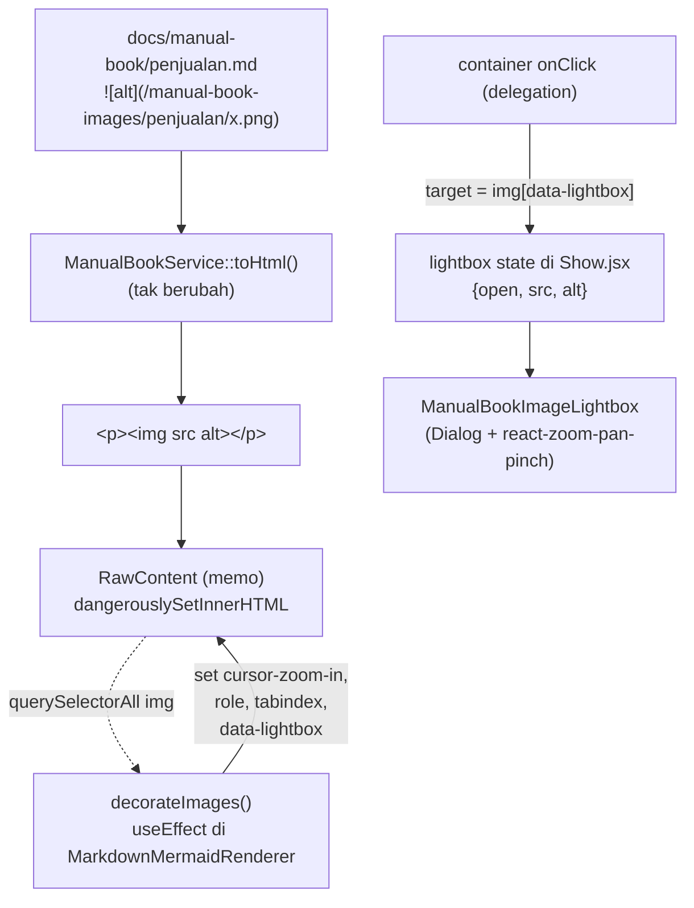

# Design — Manual Book Image Lightbox

Requirement acuan: `requirements.md` (Req 1–6).

## 1. Ringkasan Pendekatan

Konten Manual Book dirender sebagai HTML mentah lewat `dangerouslySetInnerHTML`
di `MarkdownMermaidRenderer.jsx`. Elemen `` yang dihasilkan
`GithubFlavoredMarkdownConverter` tidak punya hook React apa pun. Karena itu:

- **Deteksi & interaksi gambar** dilakukan lewat **event delegation** pada satu
  container React yang membungkus konten — bukan dengan mem-parse HTML jadi
  React elements (mahal, dan berisiko mengganggu SVG Mermaid yang di-inject
  manual). Satu listener `click` di container, cek `event.target` adalah
  `` yang memenuhi syarat.
- **Modal lightbox** adalah komponen React normal (`ManualBookImageLightbox`)
  yang hidup di pohon React `Show.jsx`, dikendalikan oleh state
  `{ open, src, alt }` yang di-set dari handler delegation.
- **Zoom/pan** memakai satu dependency kecil terfokus
  (`react-zoom-pan-pinch`) — lihat §6 untuk justifikasi & alternatif.

Tidak ada perubahan backend (`ManualBookService`, converter, config). Path
gambar, junction, dan `html_input => 'strip'` tetap.



## 2. Komponen & File yang Tersentuh

| File | Perubahan | Alasan |
|---|---|---|
| `resources/js/Components/ManualBook/ManualBookImageLightbox.jsx` | **BARU** | Komponen modal: `Dialog` + `TransformWrapper`/`TransformComponent`, toolbar zoom, handling error gambar. |
| `resources/js/Components/ManualBook/MarkdownMermaidRenderer.jsx` | Edit | Tambah `useEffect` `decorateImages()` (tandai `` konten) + `onImageActivate` callback prop + listener delegation. |
| `resources/js/Pages/Core/ManualBook/Show.jsx` | Edit | Simpan state lightbox, render `ManualBookImageLightbox`, kirim `onImageActivate` ke renderer. |
| `resources/css/app.css` | Edit | Aturan `@media print` untuk menyembunyikan overlay lightbox (jaga-jaga) + gaya afordansi hover `.prose img` di area Manual Book. |
| `package.json` / `package-lock.json` | Edit | Tambah `react-zoom-pan-pinch` (butuh persetujuan — §6). |
| `docs/manual-book/penjualan.md` | Edit sedang | Penyeragaman placeholder saja (Req 6). Tidak ada section baru. |
| `docs/manual-book/README-penulisan.md` | **BARU** | Panduan menulis untuk tim dokumentasi. Tidak didaftarkan di config → tidak dirender (Req 6.3). |
| `docs/manual-book/images/Penjualan/` → `docs/manual-book/images/penjualan/` | `git mv` | Konsistensi casing dengan folder section lain; bereskan berkas liar. |
| `docs/manual-book/retur.md` | Verifikasi | Baris 43 merujuk `/manual-book-images/penjualan/form-delivery-note.png` (sudah huruf kecil). Casing rename tidak mengubah string, jadi **tanpa** edit — hanya diverifikasi render setelah rename. |

Tidak menyentuh: `ManualBookService.php`, `config/manual_book.php`,
`ManualBookController.php`, `ManualBookToc.jsx`, `Index.jsx`.

## 3. Alur Detail Frontend

### 3.1 `decorateImages()` di `MarkdownMermaidRenderer`

`useEffect` baru, dependency `[html]`. Dijalankan setelah `RawContent` commit.

```
const container = containerRef.current
container.querySelectorAll(":scope .prose img, :scope > * img") // img di dalam konten
  → untuk tiap img yang BUKAN turunan .manual-book-mermaid & BUKAN <svg>:
      img.dataset.lightbox = "true"
      img.setAttribute("role", "button")
      img.setAttribute("tabindex", "0")
      img.classList.add("cursor-zoom-in")
      img.setAttribute("aria-label", `Perbesar gambar: ${img.alt || "screenshot"}`)
```

Catatan implementasi:
- Selector harus **mengecualikan** `` yang mungkin ada di dalam
  `.manual-book-mermaid` (Mermaid render SVG, bukan `` — tapi guard tetap
  dipasang: `img.closest(".manual-book-mermaid")` → skip). (Req 1.7)
- Idempoten: cek `img.dataset.lightbox` sebelum menandai ulang, supaya aman jika
  effect jalan dua kali (StrictMode / re-run).
- **Tidak** memodifikasi struktur DOM (tidak wrap `<figure>`, tidak pindah node)
  agar tidak memicu masalah dengan memo `RawContent` maupun replace-node Mermaid.
  Hanya set atribut/class pada `` yang sudah ada.

### 3.2 Delegation listener

Di `MarkdownMermaidRenderer`, container terluar (`<div data-diagrams-ready>`)
dapat `onClick` dan `onKeyDown`:

```
function handleActivate(e) {
  const img = e.target.closest?.("img[data-lightbox='true']")
  if (!img) return
  if (e.type === "keydown" && e.key !== "Enter" && e.key !== " ") return
  e.preventDefault()
  onImageActivate?.({ src: img.currentSrc || img.src, alt: img.alt || "" })
}
```

`onImageActivate` adalah prop baru dari `Show.jsx`. Renderer tetap tidak tahu
soal modal — hanya melapor "gambar X diaktifkan".

Kenapa delegation, bukan listener per-``:
- Konten diganti utuh saat pindah section (`html` prop berubah → `RawContent`
  re-render dengan HTML baru). Listener di container induk otomatis tetap valid
  untuk `` baru; tidak ada attach/detach per node, tidak ada kebocoran.
  (Req 4.3)

### 3.3 State & modal di `Show.jsx`

```
const [lightbox, setLightbox] = useState({ open: false, src: "", alt: "" })
const openLightbox = useCallback(({ src, alt }) => setLightbox({ open: true, src, alt }), [])
const closeLightbox = useCallback(() => setLightbox((s) => ({ ...s, open: false })), [])

<MarkdownMermaidRenderer ... onImageActivate={openLightbox} />
<ManualBookImageLightbox {...lightbox} onOpenChange={(o) => !o && closeLightbox()} />
```

`onImageActivate` di-`useCallback` supaya identitasnya stabil — penting karena
`MarkdownMermaidRenderer` sudah punya `useEffect` dengan dependency callback
(`onReadyChange`, `onHeadingsChange`). Menambah `onImageActivate` ke daftar
dependency effect delegation tidak boleh memicu re-run yang mengganggu Mermaid,
jadi effect delegation dibuat **terpisah** dari effect render Mermaid dan hanya
depend pada `[onImageActivate]` (stabil) — praktis jalan sekali.

### 3.4 `ManualBookImageLightbox.jsx`

Struktur:

```
<Dialog open={open} onOpenChange={onOpenChange}>
  <DialogContent
    hideX                      // tombol X kustom di toolbar
    align="center"
    className="max-w-[95vw] h-[92vh] p-0 bg-black/95 border-0 overflow-hidden"
  >
    <DialogTitle className="sr-only">{alt || "Gambar Manual Book"}</DialogTitle>

    {errored ? (
      <PesanGambarTidakTersedia onClose={...} />
    ) : (
      <TransformWrapper
        initialScale={1}
        minScale={1}
        maxScale={8}
        centerOnInit
        wheel={{ step: 0.15 }}
        doubleClick={{ mode: "toggle", step: 2 }}
      >
        {({ zoomIn, zoomOut, resetTransform }) => (
          <>
            <Toolbar>            // pojok atas: zoom in / out / reset / tutup
            <TransformComponent
              wrapperClass="!w-full !h-full"
              contentClass="!w-full !h-full flex items-center justify-center"
            >
               setErrored(true)}
                className="max-w-full max-h-full object-contain select-none"
                draggable={false}
              />
            </TransformComponent>
            {alt ? <Caption>{alt}</Caption> : null}   // strip bawah, teks alt
          </>
        )}
      </TransformWrapper>
    )}
  </DialogContent>
</Dialog>
```

**Fit-to-viewport vs 100% native (Req 1.3 / 1.4):**
- `` diberi `max-w-full max-h-full object-contain`. Browser otomatis:
  - gambar > area modal → diperkecil proporsional (fit). ✔ Req 1.3
  - gambar ≤ area modal → tampil pada ukuran native, tidak di-upscale
    (`object-contain` tidak memperbesar melebihi intrinsic size). ✔ Req 1.4
- `react-zoom-pan-pinch` `minScale={1}` = keadaan fit awal itu. Zoom
  memperbesar dari sana. Karena skala 1 sudah "fit", untuk mencapai **100%
  native** pada gambar besar, `maxScale` harus cukup tinggi — dipakai `8`
  (memberi ruang jauh di atas 100% native untuk detail terkecil). ✔ Req 2.1
- `resetTransform()` kembali ke skala 1 (fit). ✔ Req 2.4
- State zoom lokal di `TransformWrapper`; komponen di-unmount/remount tiap
  buka-tutup karena `Dialog` melepas subtree saat `open=false` → otomatis reset
  antar pembukaan. ✔ Req 2.5

**Zoom controls (Req 2.1–2.4):**
- Toolbar: tombol `ZoomIn`, `ZoomOut`, `Maximize`/`RotateCcw` (reset),
  `X` (tutup) — ikon `lucide-react`, konsisten dengan `Show.jsx`.
- Wheel & pinch: bawaan `react-zoom-pan-pinch`. ✔ Req 2.3
- Pan: drag pointer bawaan library saat `scale > 1`. ✔ Req 2.2

**Close (Req 3):**
- `Esc` & klik overlay: bawaan `@radix-ui/react-dialog` (`DialogOverlay` +
  `onOpenChange`). ✔ Req 3.1, 3.2
- Tombol `X` di toolbar memanggil `onOpenChange(false)`. ✔ Req 3.3
- **Focus return**: Radix Dialog otomatis mengembalikan fokus ke elemen yang
  fokus sebelum modal terbuka. Karena pemicunya adalah ``
  (via keyboard) atau klik (fokus pointer), Radix menangani ini. Untuk klik
  mouse pada ``, `decorateImages` memberi `tabindex="0"` sehingga elemen
  bisa menerima fokus balik. ✔ Req 3.4
- **Scroll lock body**: bawaan Radix Dialog (`react-remove-scroll`). ✔ Req 3.5

**Error handling (Req 5):**
- `` → `setErrored(true)` → tampilkan panel "Gambar belum
  tersedia" dengan tombol Tutup. Modal tetap bisa ditutup normal. ✔ Req 5.1
- Placeholder 1×1: `onError` **tidak** terpicu (berkas valid, hanya kecil).
  Modal terbuka menampilkan kotak 1×1 di tengah layar hitam + caption.
  Ini disengaja diterima sebagai perilaku "tidak error" (Req 5.2). Untuk
  mengurangi kebingungan: jika `naturalWidth <= 1 && naturalHeight <= 1` saat
  `onLoad`, tampilkan overlay teks "Screenshot untuk bagian ini belum
  ditambahkan." di atas gambar. (peningkatan kecil, bukan wajib — masuk task
  sebagai sub-langkah opsional).
- `alt` kosong → `DialogTitle` sr-only fallback "Gambar Manual Book", caption
  strip tidak dirender. ✔ Req 5.3

### 3.5 Interaksi dengan Mermaid & memo `RawContent`

`RawContent` di-memo pada `prev.html === next.html`. `decorateImages()` hanya
menyetel atribut/class pada node `` yang **sudah ada di DOM** — tidak
mengubah `html` string, tidak memanggil `setState` yang mengubah `html`. Maka:
- Tidak memicu re-render `RawContent` → SVG Mermaid yang di-inject manual aman.
  ✔ Req 4.2
- Effect Mermaid (`renderDiagrams`) dan effect `decorateImages` independen;
  urutan tidak kritis karena target beda (`<pre><code>` vs ``). Guard
  `img.closest(".manual-book-mermaid")` mencegah tumpang tindih walau Mermaid
  belum selesai.
- `data-diagrams-ready` tak tersentuh. ✔ Req 4.2

## 4. Print (Req 4.1)

- Radix `DialogContent` di-portal ke `document.body`. Saat `open=false`
  subtree tidak ada di DOM → tidak mungkin ikut ter-print.
- Saat `open=true` lalu user menekan Cetak: tombol Cetak di `Show.jsx`
  `disabled={!isReady}` dan modal biasanya ditutup dulu, tapi untuk aman:
  tambah di `app.css` `@media print` →
  `[data-radix-portal], [role="dialog"] { display: none !important; }`
  scoped seperlunya. Gambar inline di `.prose` tetap tercetak apa adanya.
  ✔ Req 4.1
- `.prose img` afordansi hover (`cursor-zoom-in`, ring halus) di-reset di
  `@media print` (kursor tidak relevan di kertas; ring jangan tercetak).

## 5. Perubahan CSS (`app.css`)

Tambahan minimal, di-scope ke konten Manual Book supaya tidak bocor ke `prose`
lain di app:

```css
/* Afordansi klik gambar Manual Book */
.manual-book-content .prose img[data-lightbox="true"] {
  cursor: zoom-in;
  transition: filter 0.15s ease, box-shadow 0.15s ease;
}
.manual-book-content .prose img[data-lightbox="true"]:hover {
  filter: brightness(0.97);
  box-shadow: 0 0 0 3px var(--color-ring, theme(colors.blue.400));
}
@media print {
  .manual-book-content .prose img[data-lightbox="true"] {
    cursor: default;
    filter: none;
    box-shadow: none;
  }
  [data-radix-popper-content-wrapper],
  [role="dialog"][data-state="open"] {
    display: none !important;
  }
}
```

Konsekuensi: `Show.jsx` bungkus area konten dengan
`<div className="manual-book-content">` (satu div penanda, tidak mengubah
layout — atau pakai class yang sudah ada bila memungkinkan; final dicek saat
implementasi).

## 6. Dependency Baru — `react-zoom-pan-pinch` (DISETUJUI USER)

**Kebutuhan Req 2** (zoom sampai 2–3× native, pan drag, wheel/pinch, tombol
zoom, reset) di dalam modal. Membangun ini manual = matrix transform, clamp
pan bounds, handler wheel non-pasif, pointer capture, pinch 2-jari — cukup
banyak kode berisiko bug.

**Keputusan (dikonfirmasi user):** tambah `react-zoom-pan-pinch` ke
`dependencies` di `package.json`.
- ~15 kB gzip, zero-dependency, React 18/19 kompatibel, dipakai luas.
- Menyediakan semua yang diminta Req 2 lewat `TransformWrapper` render-prop.
- Hanya di-import di `ManualBookImageLightbox`. Komponen lightbox itu sendiri
  di-`React.lazy()` dari `Show.jsx` supaya library tidak masuk bundle awal
  halaman Manual Book (pola dynamic import sudah dipakai untuk `mermaid` di
  `MarkdownMermaidRenderer`).
- Versi: pin ke rilis mayor terbaru yang stabil (`^3`). `npm install
  react-zoom-pan-pinch` lalu commit `package.json` + `package-lock.json`.

Alternatif yang ditolak (dicatat untuk konteks): CSS `transform` manual (tidak
dapat pinch/drag-pan mulus), `medium-zoom` (tanpa multi-level zoom + pan),
`yet-another-react-lightbox` (2× lebih besar, bawa fitur galeri yang Non-Goal).

## 7. Restrukturisasi `penjualan.md` & Folder Gambar (Req 6)

### 7.1 Rename folder

`git mv docs/manual-book/images/Penjualan docs/manual-book/images/penjualan`

(Di Windows case-insensitive perlu langkah dua kali atau `git mv` paksa; dicek
saat task.) Semua rujukan di `penjualan.md` sudah memakai `/manual-book-images/penjualan/...`
(huruf kecil) sehingga **tidak** perlu diubah. `retur.md:43` juga sudah kecil —
verifikasi render setelah rename.

### 7.2 Berkas liar → dipetakan atau dihapus

| Berkas sekarang | Rencana |
|---|---|
| `Langkah1.png` (1384×957) | rename → `form-sales-order.png` (ganti placeholder 1×1) **jika** memang screenshot form SO; dikonfirmasi visual saat task |
| `Langkah1 submit.png` | rename → `detail-sales-order.png` atau `konfirmasi-ajukan-so.png` |
| `Langkah2.png`, `Langkah2 - 1.png`, `Langkah2 - 2.png` | petakan ke `menu-aksi-so.png` / `form-delivery-note.png` |
| `Langkah3 - 1.png`, `Langkah3 -2.png` | petakan ke `form-sales-invoice.png` / langkah invoice |
| `Sales Order Baru.png` (78 kB) | rename → `form-sales-order.png` bila ini yang paling pas |

Keputusan final per-berkas diambil saat implementasi (perlu lihat isi gambar),
dan **dilaporkan** di ringkasan task. Berkas yang tidak cocok slot mana pun →
hapus (bukan screenshot final). Placeholder 1×1 yang belum ada penggantinya →
**tetap dibiarkan 1×1** supaya section tetap render & fitur error-guard teruji.

### 7.3 Revisi `penjualan.md` (hanya penyeragaman placeholder)

Isi panduan (Langkah 1–5, contoh, FAQ) **tidak berubah maknanya**, dan
**tidak ada section teknis baru** ditambahkan. Yang dilakukan:

- Pastikan setiap `![...]` punya deskripsi yang menjelaskan ISI layar (bukan
  "gambar 1" / "Langkah 2"), nama berkas kebab-case `.png`, path absolut
  `/manual-book-images/penjualan/`.
- Tambah placeholder di titik-titik yang jelas butuh screenshot tapi belum
  punya (dinilai saat task; jangan berlebihan — satu screenshot per langkah
  kunci sudah cukup).
- Tidak menyentuh heading, tidak menambah blockquote penanda, tidak mengubah
  urutan section. TOC otomatis tidak berubah.

### 7.4 File baru `docs/manual-book/README-penulisan.md` (panduan menulis, tidak dirender)

File markdown biasa di `docs/manual-book/`, **tidak** didaftarkan di
`config/manual_book.php` → `ManualBookService` tidak pernah membacanya, tidak
ada route ke sana. Dibaca tim dokumentasi lewat editor/GitHub.

Struktur (heading bebas — file ini tidak lewat filter `stripTechnicalNoise` /
`default_excluded_heading_patterns` karena tidak dirender):

```
# Panduan Menulis Manual Book — Menaruh Gambar

## 1. Menyiapkan folder gambar (sekali per mesin)
   - Kenapa perlu: docs/ tidak dilayani web server.
   - Junction/symlink public/manual-book-images -> docs/manual-book/images
   - Perintah Windows tanpa admin:  cmd /c "mklink /J manual-book-images ..\docs\manual-book\images"
   - Perintah Linux/macOS:          ln -s ../docs/manual-book/images manual-book-images
   - Referensi lengkap: komentar di config/manual_book.php

## 2. Menaruh berkas screenshot
   - Lokasi: docs/manual-book/images/<slug-section>/
   - <slug-section> = nama berkas .md tanpa ekstensi (penjualan, pembelian,
     inventory, keuangan, layanan, aset, helpdesk, retur, pengaturan-umum)
   - Nama berkas: kebab-case, .png, deskriptif isi layar
     (form-sales-order-terisi.png, bukan Langkah1.png / gambar2.png)

## 3. Menyisipkan gambar ke halaman
   - Sintaks: 
   - Contoh nyata (dari penjualan.md):
     
   - PATH ABSOLUT WAJIB (diawali /). Alasan: route /manual-book/{section}
     catch-all — path relatif seperti images/x.png dibaca sebagai nama section
     → 404.
   - Teks dalam kurung siku jadi alt text + judul saat gambar dibuka besar.
     Tulis deskriptif, bukan "gambar".

## 4. Cara pembaca melihat ukuran asli (otomatis)
   - Penulis TIDAK perlu markup khusus — cukup  standar.
   - Di halaman, setiap gambar bisa diklik → modal besar, resolusi penuh,
     bisa zoom (tombol / scroll / pinch) dan digeser. Esc / klik luar / X
     untuk menutup.

## 5. Mengganti placeholder 1×1 dengan screenshot asli
   - Placeholder = PNG 1×1 px (69 byte) supaya halaman tetap render.
   - Cara A: timpa berkas dengan nama sama (screenshot asli), commit.
   - Cara B: taruh berkas nama baru yang lebih deskriptif, lalu update path
     di file .md-nya.
   - Setelah itu jalankan `npm run build` (atau minta dev `npm run dev`) bila
     perubahan tidak langsung terlihat.

## 6. Checklist sebelum commit
   - [ ] Berkas ada di docs/manual-book/images/<slug>/
   - [ ] Nama kebab-case .png
   - [ ] Path di markdown absolut & cocok
   - [ ] Halaman /manual-book/<key> dibuka, gambar tampil & bisa di-klik besar
```

Memenuhi Req 6.3 (a–g) dan Req 6.4.

## 8. Testing (Req: semua)

Frontend proyek: PHPUnit untuk backend; komponen React **tidak** punya test
runner JS terpasang (cek `package.json` — tidak ada vitest/jest). Maka:

### 8.1 Backend (PHPUnit) — yang bisa diuji programatik

`tests/Feature/Core/ManualBookImageTest.php` (BARU atau tambah ke test Manual
Book yang ada bila sudah ada):

1. `test_penjualan_section_renders_img_with_absolute_manual_book_path` — GET
   route show untuk key `sales`, assert `content_html` mengandung
   `` di seluruh `docs/manual-book/*.md`, assert tiap
   berkas ada di `docs/manual-book/images/<...>` (menangkap typo path & berkas
   liar yang belum dibereskan). Meng-cover Req 6.2/6.5/6.6 secara tidak langsung.
4. `test_no_broken_folder_casing` — assert tidak ada folder
   `docs/manual-book/images/Penjualan` (kapital) tersisa (`glob` case-sensitive
   check, atau bandingkan `scandir` entry persis).

### 8.2 Frontend — verifikasi manual terdokumentasi

Karena tidak ada test runner JS, `tasks.md` mencantumkan **checklist
verifikasi manual** yang harus dijalankan & dilaporkan di checkpoint:

- Klik screenshot asli → modal terbuka, gambar tajam pada resolusi penuh.
- Zoom in sampai teks terkecil terbaca; pan dengan drag; reset.
- `Esc`, klik backdrop, tombol X → semua menutup; fokus balik ke gambar.
- Body di belakang overlay tidak bisa di-scroll.
- Pindah section (mis. ke Pembelian) → klik gambar section itu tetap jalan
  (delegation re-attach).
- Diagram Mermaid tetap render; `data-diagrams-ready` jadi `true`; tombol
  Cetak aktif.
- `window.print()` / preview cetak → tidak ada overlay; gambar inline utuh.
- Klik placeholder 1×1 → tidak error; modal (jika terbuka) bisa ditutup.
- Mobile viewport (≤768px) → gambar fit, tombol X terjangkau.

### 8.3 Lint

`vendor/bin/pint --dirty --format agent` untuk file PHP baru (test).
ESLint/Prettier untuk file JS lewat pipeline proyek yang ada. Keduanya
**setelah semua task selesai** (aturan proyek), bukan per task.

## 9. Urutan Kerja (ringkas — detail di tasks.md)

1. `npm install react-zoom-pan-pinch` + commit lockfile.
2. Rename folder gambar `Penjualan/` → `penjualan/` + bereskan berkas liar +
   verifikasi render `retur.md`.
3. `ManualBookImageLightbox.jsx` (modal + zoom) + `React.lazy` di `Show.jsx`.
4. `decorateImages` + delegation + prop `onImageActivate` di renderer.
5. Wire state di `Show.jsx` + div penanda `manual-book-content`.
6. CSS afordansi + print guard di `app.css`.
7. Penyeragaman placeholder `penjualan.md`.
8. `docs/manual-book/README-penulisan.md`.
9. Test PHPUnit (§8.1).
10. Checkpoint: full test suite + checklist manual §8.2 + konfirmasi user.
11. Lint/Pint (§8.3).

## 10. Risiko & Mitigasi

| Risiko | Mitigasi |
|---|---|
| `git mv` casing folder di Windows tidak efektif (FS case-insensitive) | Rename via nama antara: `Penjualan` → `penjualan-tmp` → `penjualan`, commit tiap langkah; verifikasi `git ls-files` menunjukkan huruf kecil. |
| Radix Dialog focus-trap bentrok dengan pan-drag library | `react-zoom-pan-pinch` beroperasi di dalam `DialogContent` (di dalam focus scope) — drag pointer tidak memindah fokus. Diverifikasi di checklist manual. |
| `img.currentSrc` kosong sebelum load | fallback `img.src`; keduanya berisi URL absolut yang sama (converter menulis path absolut). |
| Effect `decorateImages` jalan sebelum Mermaid selesai → menandai `` di dalam diagram | Diagram Mermaid = SVG, bukan ``. Guard `closest(".manual-book-mermaid")` tetap dipasang untuk berjaga. |
| `react-zoom-pan-pinch` tidak kompatibel React 19 di praktik | Verifikasi di checklist manual (§8.2) saat task 3. Jika bermasalah → fallback container `overflow:auto` + state `scale` (Req 2.2 dilonggarkan ke pan-via-scroll); dicatat sebagai perubahan design bila terjadi. |
| `README-penulisan.md` tanpa sengaja kebaca sebagai section | Test `test_readme_penulisan_is_not_registered_as_section` (§8.1). `readMarkdown()` juga sudah memvalidasi `source` harus di dalam `docs_path` tapi hanya untuk `source` yang terdaftar. |
