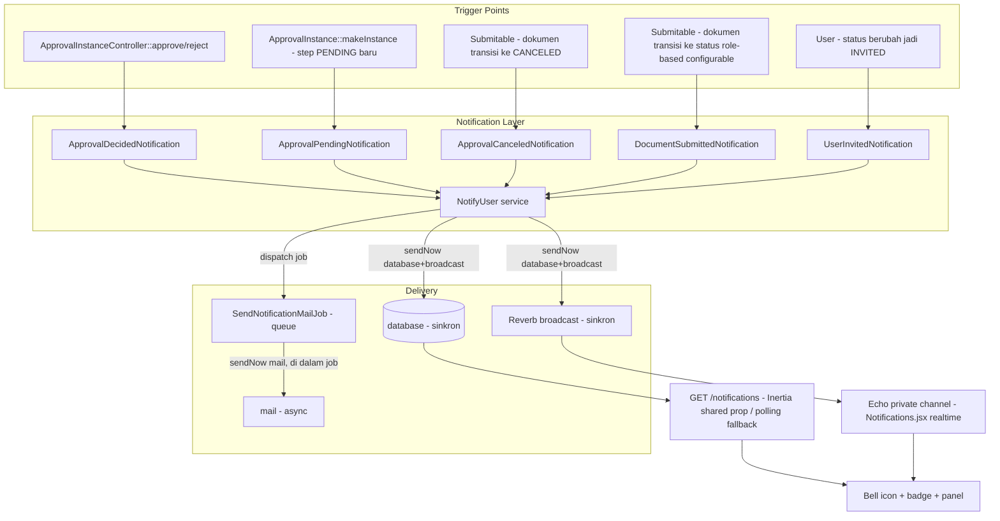

# Design Document: Notification Center

## Overview

Notification Center dibangun di atas infrastruktur `Illuminate\Notifications` standar Laravel — **bukan** override global seperti `app/Channels/DatabaseChannel.php`/`MyMailChannel.php`/`BaseNotification.php` lama (dibuang, lihat Requirement 1.2). Setiap event (approve, reject, dokumen baru untuk role tertentu, invite user) direpresentasikan sebagai satu `Notification` class dengan `toDatabase()`/`toArray()` (in-app) dan `toMail()` (email) dari data yang sama.

Poin desain paling krusial: **satu event butuh dua kecepatan delivery berbeda** — `database`+`broadcast` harus sinkron (Requirement 2.1), `mail` harus async lewat queue (Requirement 2.2), tapi keduanya berasal dari SATU notification class (bukan dua class terpisah, biar kondisi trigger tidak terdefinisi dua kali). Laravel tidak punya mekanisme bawaan untuk "queue channel ini saja" pada satu notification instance — `implements ShouldQueue` men-queue seluruh proses `via()`. Solusinya: notification class **tidak** `ShouldQueue`, dan pengiriman dipecah jadi dua panggilan eksplisit yang dibungkus satu service (`NotifyUser`):

1. `Notification::sendNow($notifiable, $notification, ['database', 'broadcast'])` — sinkron, di request yang sama.
2. `SendNotificationMailJob::dispatch($notifiable, $notification)` — job queue generik, di dalamnya baru `Notification::sendNow($notifiable, $notification, ['mail'])`.

`SendNotificationMailJob` adalah pengganti generik `MyMailChannel`/`SendEmailNotificationJob` lama — TIDAK bergantung pada property domain spesifik (`subGate`, `link`), dan tidak memakai pola `app(MailChannel::class)->send()` manual yang terbukti tidak ter-capture `Notification::fake()` (ditemukan di spec `email-template-trigger`). Job ini memakai `Notification::sendNow()` yang portable dan assertable oleh `Queue::fake()`.

Komponen yang TIDAK berubah: alur approval (`ApprovalInstanceController::approve()`/`reject()`) tetap jalan seperti sekarang — notifikasi disisipkan sebagai side-effect tambahan, urutan/perilaku existing (`onApproved()`/`onRejected()` callback, `AttachGeneratedPdfJob`) tidak diubah. Alur reset password Breeze tetap dipakai apa adanya (Requirement 6.1).

**Catatan arsitektur penting soal translasi**: `__()` backend PHP di project ini hanya resolve file lang di ROOT (`lang/{locale}/*.php`), mengikuti parsing standar Laravel (segmen pertama key selalu jadi nama FILE). Pola `lang/{locale}/core/*.php` yang luas dipakai di controller (`core.emailTemplate.xxx`, dst) TIDAK pernah benar-benar resolve lewat translator backend — nilainya selalu raw key, "aman" karena selalu dikirim ke Inertia→React yang menerjemahkannya via Vite plugin `laravel-react-i18n/vite`. Karena email/payload database notifikasi TIDAK lewat React, string notifikasi di spec ini memakai `lang/{locale}/notification.php` (ROOT, bukan subfolder `core/`) dengan key `notification.xxx` — satu-satunya cara `__()` backend benar-benar resolve.

**Perubahan arsitektur pasca-implementasi — broadcasting driver Pusher, bukan Reverb**: desain awal (dan implementasi task 1-18) memakai Laravel Reverb (self-hosted WebSocket server, `php artisan reverb:start`). Setelah task 1-18 selesai, ditemukan target deploy produksi project ini adalah **shared hosting** (cPanel, domain `ptpsn.co.id`) — Reverb butuh proses daemon long-running + bind port TCP custom, DUA HAL yang tidak didukung shared hosting mana pun. Diputuskan pindah ke **Pusher** (managed WebSocket service, `pusher.com`) yang cukup HTTP API call dari server (tidak butuh proses persisten). Dampak perubahan:
- `composer.json`: `laravel/reverb` dihapus, `pusher/pusher-php-server` ditambah langsung (sebelumnya cuma transitive dependency Reverb)
- `config/broadcasting.php`: block `'reverb'` dihapus, `'pusher'` (sudah ada dari template default Laravel, tidak perlu diubah) yang dipakai
- `.env`/`.env.example`: `REVERB_APP_ID/KEY/SECRET/HOST/PORT/SCHEME` → `PUSHER_APP_ID/KEY/SECRET/CLUSTER`; `VITE_REVERB_*` → `VITE_PUSHER_APP_KEY`/`VITE_PUSHER_APP_CLUSTER` (host/port tidak relevan lagi, Pusher pakai cluster routing)
- `resources/js/echo.js`: `broadcaster: "pusher"`, config `key`+`cluster` (bukan `wsHost`/`wsPort`/`wssPort`/`enabledTransports` ala Reverb)
- `routes/channels.php` **TIDAK berubah** — nama channel privat (`App.Models.User.User.{id}`) dan authorization callback murni soal FQCN notifiable, tidak bergantung driver broadcasting apa pun
- Task 17 (manual browser verification) TIDAK LAGI butuh proses ketiga (`php artisan reverb:start`) — cukup `npm run dev`/`composer run dev` + `php artisan queue:listen`, karena Pusher adalah layanan eksternal, bukan proses lokal yang perlu dijalankan
- Efek samping menguntungkan: instalasi `pusher/pusher-php-server` sebagai dependency LANGSUNG (bukan transitive lewat Reverb) akhirnya berhasil tanpa error permission yang sebelumnya gagal 3x berturut-turut saat lewat `laravel/reverb`

## Architecture



**Data flow — contoh approve dokumen:**

1. Approver klik "Setujui" → `ApprovalInstanceController::approve()` (existing).
2. Setelah `DB::commit()`, sejajar `AttachGeneratedPdfJob::dispatch($approval)`: resolve `$creator = $approval->document->createdBy`, panggil `NotifyUser::send($creator, new ApprovalDecidedNotification($approval, 'approved'))`.
3. `NotifyUser::send()`:
   - `Notification::sendNow($creator, $notification, ['database', 'broadcast'])` — record tersimpan ke tabel `notifications`, event broadcast ke channel privat `App.Models.User.User.{id}`.
   - `SendNotificationMailJob::dispatch($creator, $notification)` — masuk antrian.
4. Worker queue memproses job → `Notification::sendNow($creator, $notification, ['mail'])` — email terkirim (atau gagal, dicatat lewat `failed()`, tidak memengaruhi notifikasi in-app yang sudah tersimpan).
5. Browser creator (kalau online, sudah subscribe channel privatnya via Echo): terima event broadcast → badge count bertambah, tanpa reload.

## Components and Interfaces

### 1. Infrastruktur dasar (Requirement 1)

**Dihapus:**
- `app/Channels/DatabaseChannel.php`
- `app/Channels/MyMailChannel.php`
- `app/Notifications/BaseNotification.php`
- `AppServiceProvider.php` baris 5-6 (import), 28, 30 (binding `$this->app->instance(...)`)

**Ditambah (instalasi):**
- `composer require laravel/reverb` lalu `php artisan install:broadcasting` — generate `config/broadcasting.php`, `routes/channels.php`, `.env` var `REVERB_*`/`BROADCAST_CONNECTION=reverb`, dan `resources/js/echo.js` + install `laravel-echo`/`pusher-js` di `package.json`.
- `php artisan notifications:table` + `php artisan migrate` — tabel `notifications` standar (tanpa modifikasi kolom).

### 2. `App\Services\Core\Notification\NotifyUser` (baru)

Service tunggal yang membungkus dual-dispatch (Requirement 2.1-2.3), dipakai semua trigger — supaya logic "database+broadcast sinkron, mail lewat job" hanya ditulis sekali.

```php
namespace App\Services\Core\Notification;

use App\Jobs\Core\Notification\SendNotificationMailJob;
use Illuminate\Notifications\Notification;
use Illuminate\Support\Facades\Notification as NotificationFacade;

class NotifyUser {
    /**
     * Kirim satu notification ke satu/banyak notifiable: channel
     * database+broadcast sinkron, channel mail lewat queue job terpisah.
     *
     * @param  \Illuminate\Support\Collection<int, object>|object  $notifiable
     */
    public function send($notifiable, Notification $notification): void {
        NotificationFacade::sendNow($notifiable, $notification, ['database', 'broadcast']);

        if (in_array('mail', $notification->via($notifiable), true)) {
            SendNotificationMailJob::dispatch($notifiable, $notification);
        }
    }
}
```

Catatan: `$notification->via($notifiable)` dipanggil di sini murni untuk cek "apakah class ini punya channel mail" sebelum dispatch job sia-sia — bukan untuk menentukan channel mana yang jalan (itu tetap ditentukan oleh parameter eksplisit `['database', 'broadcast']`/`['mail']` di masing-masing `sendNow()` call).

### 3. `App\Jobs\Core\Notification\SendNotificationMailJob` (baru, pengganti `MyMailChannel`/`SendEmailNotificationJob` lama)

```php
namespace App\Jobs\Core\Notification;

use Illuminate\Bus\Queueable;
use Illuminate\Contracts\Queue\ShouldQueue;
use Illuminate\Foundation\Bus\Dispatchable;
use Illuminate\Notifications\Notification;
use Illuminate\Queue\InteractsWithQueue;
use Illuminate\Queue\SerializesModels;
use Illuminate\Support\Facades\Log;
use Illuminate\Support\Facades\Notification as NotificationFacade;
use Throwable;

class SendNotificationMailJob implements ShouldQueue {
    use Dispatchable, InteractsWithQueue, Queueable, SerializesModels;

    public function __construct(
        public mixed $notifiable,
        public Notification $notification,
    ) {}

    public function handle(): void {
        NotificationFacade::sendNow($this->notifiable, $this->notification, ['mail']);
    }

    public function failed(Throwable $e): void {
        Log::error('SendNotificationMailJob gagal — email notifikasi tidak terkirim', [
            'notification' => get_class($this->notification),
            'notifiable'   => get_class($this->notifiable) . ':' . ($this->notifiable->getKey() ?? ''),
            'error'        => $e->getMessage(),
        ]);
    }
}
```

`SerializesModels` menangani serialisasi `$notifiable`/`$notification` ke queue payload (keduanya Eloquent model atau `Notification` yang sudah `use SerializesModels` bawaan) — tidak perlu penanganan manual seperti `SendEmailWithPdfJob` yang serialize primitif karena `$notifiable` di sini selalu `User` Eloquent model, bukan objek anonim.

### 4. Notification classes

Semua taat pola: constructor terima data mentah, `via()` selalu `['database', 'broadcast', 'mail']` kecuali disebutkan lain, `toArray()`/`toDatabase()` untuk in-app, `toMail()` untuk email, `toBroadcast()` untuk payload realtime (biasanya sama dengan `toArray()`, dibungkus `BroadcastMessage`).

**a. `App\Notifications\ApprovalDecidedNotification`** (Requirement 3.1, 3.2)
```php
public function __construct(
    public ApprovalInstance $approval,
    public string $decision, // 'approved' | 'rejected'
    public ?string $notes = null,
) {}

public function via(object $notifiable): array {
    return ['database', 'broadcast', 'mail'];
}

public function toArray(object $notifiable): array {
    $document = $this->approval->document;
    return [
        'title'   => $this->decision === 'approved' ? __('notification.approval.approved.title') : __('notification.approval.rejected.title'),
        'message' => __("notification.approval.{$this->decision}.message", ['document' => $document->code ?? $document->name ?? '']),
        'url'     => $document->signed_url ?? route(pluralize.plural(class_basename($document)) . '.show', $document->id), // resolusi url lihat catatan di bawah
        'notes'   => $this->notes,
    ];
}
```
Catatan resolusi `url`: `Submitable` tidak punya helper generate URL show generik yang dipanggil dari backend PHP (pola route Ziggy adanya di frontend). Design memilih menyimpan `document_type`+`document_id` di payload `toArray()`, resolusi URL final dilakukan di frontend (`Notifications.jsx`) via `route()` Ziggy berdasarkan mapping `document_type` → nama route plural — konsisten dengan bagaimana `EmailSendDialog.jsx` resolve route dari nama model. Field `url` di atas TIDAK dipakai; diganti field `documentType`/`documentId` mentah.

**b. `App\Notifications\ApprovalPendingNotification`** (Requirement 3.3, 3.4) — dikirim ke tiap approver kandidat step yang baru jadi `PENDING`.
```php
public function __construct(public ApprovalInstanceStep $step) {}
```

**c. `App\Notifications\ApprovalCanceledNotification`** (Requirement 3.7) — dikirim ke approver kandidat dari step yang `PENDING`/`WAITING` saat dokumen dibatalkan.
```php
public function __construct(public ApprovalInstance $approval, public array $canceledStepSequences) {}
```

**d. `App\Notifications\DocumentSubmittedNotification`** (Requirement 4) — role-based, generik untuk semua model submitable yang dikonfigurasi.
```php
public function __construct(public Model $document, public string $role) {}
```

**e. `App\Notifications\UserInvitedNotification`** (Requirement 5) — mail-only.
```php
public function via(object $notifiable): array {
    return ['mail']; // Requirement 5.3 — tanpa database/broadcast
}
```
Karena `via()` cuma `['mail']`, `NotifyUser::send()` untuk notifikasi ini efektif langsung skip `sendNow(..., ['database', 'broadcast'])` — panggilan itu tidak error (array kosong hasil filter, `sendNow` dengan channel yang tidak match `via()` notification tidak melakukan apa-apa), tapi supaya eksplisit dan tidak membingungkan, `NotifyUser::send()` sebaiknya juga skip pemanggilan `sendNow(['database','broadcast'])` kalau irisan channel kosong — lihat pseudocode diperbarui di bawah.

### 5. Titik penyisipan trigger

| Trigger | Lokasi | Requirement |
|---|---|---|
| Approve (step terakhir) | `ApprovalInstanceController::approve()`, setelah `AttachGeneratedPdfJob::dispatch($approval)` (baris ~251) | 3.1 |
| Reject | `ApprovalInstanceController::reject()`, titik setara setelah commit | 3.2 |
| Approval instance baru / step maju | `ApprovalInstance::makeInstance()` (step pertama `PENDING`) DAN `ApprovalInstanceController::approve()` (saat `$nextPending` di-set — pola baris ~172-175 versi `runAutoApprovePass`, atau titik setara di `approve()` baris ~224-232) | 3.3, 3.4 |
| Cancel dengan approval berjalan | Observer/event pada `Submitable` — `saving`/`updated` hook mendeteksi transisi ke `FormStatus::CANCELED` sambil approval masih ada step `PENDING`/`WAITING` (lihat Requirement 3.9-3.10 — TIDAK bergantung pada perbaikan gap cascade-cancel) | 3.7 |
| Role-based submit | Observer/event pada `Submitable` — transisi status yang dikonfigurasi per model (lihat Data Models §Konfigurasi role-based) | 4 |
| Invite user | Observer pada `User` — transisi `status` ke `FormStatus::INVITED` (bandingkan `$user->getOriginal('status')` vs `$user->status` di event `updated`, atau `created` kalau langsung dibuat berstatus itu) | 5 |

**Approval trigger TIDAK memakai Observer** (beda dari role-based/invite) — disisipkan langsung sebagai pemanggilan eksplisit di `ApprovalInstanceController`/`ApprovalInstance::makeInstance()`, mengikuti pola `AttachGeneratedPdfJob::dispatch($approval)` yang sudah ada persis di titik yang sama. Alasan: titik itu sudah computed (`$approval`, `$creator`, step yang relevan) sehingga Observer generik justru akan re-query data yang sudah ada di tangan.

**Role-based dan invite MEMAKAI Observer** (`App\Observers\SubmitableStatusObserver`, `App\Observers\UserObserver`) — karena trigger-nya adalah "status berubah jadi X", pola yang sama berlaku ke banyak model berbeda, Observer generik menghindari duplikasi kode di tiap Controller/Service model submitable.

### 6. Frontend — `Notifications.jsx`

Isi ulang komponen existing (Requirement 7.1), state dan data flow:

```jsx
// Sumber data awal: shared Inertia prop (mirip pola unread_changelogs_count)
const { unread_notifications_count, recent_notifications } = usePage().props;

// Realtime: subscribe channel privat user saat komponen mount
useEffect(() => {
  const channel = window.Echo.private(`App.Models.User.User.${user.id}`);
  channel.notification((notification) => {
    setNotifications((prev) => [notification, ...prev].slice(0, 20));
    setUnreadCount((prev) => prev + 1);
  });
  return () => window.Echo.leave(`App.Models.User.User.${user.id}`);
}, [user.id]);
```

Endpoint baru (bukan Inertia page, JSON API sederhana karena dipanggil dari dalam Popover, bukan navigasi halaman):
- `GET /notifications` — daftar 20 notifikasi terbaru + `unread_count` (Requirement 7.4).
- `POST /notifications/{id}/read` — tandai satu dibaca, redirect/return `url` tujuan (Requirement 7.5).
- `POST /notifications/read-all` — tandai semua dibaca (Requirement 7.6).

`unread_notifications_count` tetap di-share lewat middleware Inertia (pola `unread_changelogs_count`) untuk render awal badge tanpa request tambahan; update selanjutnya murni dari event broadcast, bukan polling.

## Data Models

### Tabel `notifications` (standar Laravel, tanpa modifikasi)
```
id              uuid, primary
type            string          — FQCN notification class, mis. App\Notifications\ApprovalDecidedNotification
notifiable_type string
notifiable_id   string
data            json            — hasil toArray()/toDatabase()
read_at         timestamp null
created_at      timestamp
updated_at      timestamp
```

### Konfigurasi role-based notification (Requirement 4.1)

Bukan tabel baru — memakai static property di model submitable, konsisten dengan pola `$is_submitable`/`$configColumns` yang sudah ada:

```php
// contoh di SalesOrder.php
protected static array $notifyRolesOnStatus = [
    'submitted' => ['Warehouse'],
];
```

`SubmitableStatusObserver` membaca property ini dari `static::$notifyRolesOnStatus[$newStatus] ?? []`; kalau model tidak mendefinisikannya, tidak ada notifikasi role-based terkirim (default aman, Requirement 4.4 tetap terpenuhi tanpa exception karena `??` fallback ke array kosong).

### `NotifyUser::send()` — pseudocode final (memasukkan catatan skip channel kosong di atas)

```php
public function send($notifiable, Notification $notification): void {
    $channels = $notification->via($notifiable);

    $syncChannels = array_intersect($channels, ['database', 'broadcast']);
    if ($syncChannels !== []) {
        NotificationFacade::sendNow($notifiable, $notification, array_values($syncChannels));
    }

    if (in_array('mail', $channels, true)) {
        SendNotificationMailJob::dispatch($notifiable, $notification);
    }
}
```

## Correctness Properties

1. **Sinkron vs async terjaga**: untuk notification manapun dengan channel `mail` di `via()`, pemanggilan `NotifyUser::send()` SELALU menghasilkan record `database` (jika channel itu ada di `via()`) sebelum method return, dan job mail masuk queue tanpa menunggu proses mail selesai — dapat diverifikasi lewat `Queue::fake()` + assert record `database` sudah ada di `assertDatabaseHas('notifications', ...)` pada test yang sama tanpa `Queue::assertPushed` dijalankan dulu.
2. **Kegagalan mail tidak menghapus notifikasi in-app**: `SendNotificationMailJob::failed()` tidak memanggil operasi apa pun yang menyentuh tabel `notifications` — record yang sudah tersimpan dari `sendNow(['database'])` tetap ada terlepas dari hasil job mail.
3. **Tidak ada duplikasi channel**: `via()` tiap notification class dipanggil sekali oleh `NotifyUser::send()` untuk menentukan irisan channel, hasil `sendNow()` tidak pernah mengirim channel yang tidak ada di `via()` asli (dijamin oleh `array_intersect`).
4. **Broadcast selalu privat**: TIDAK ADA notification class yang override `broadcastOn()` — semua mengandalkan default `Illuminate\Notifications\Notification::broadcastOn()` (kosong), yang membuat `BroadcastNotificationCreated::broadcastOn()` (internal Laravel) auto-derive `PrivateChannel` dari FQCN+id notifiable sebenarnya (`str_replace('\\', '.', get_class($notifiable)) . '.' . $notifiable->getKey()`). Untuk `User` model (`App\Models\User\User`, HasUlids) ini menghasilkan `App.Models.User.User.{id}` — BUKAN `App.Models.User.{id}` yang mungkin terlihat intuitif dari nama folder `Models/User/`. `routes/channels.php` authorization callback didaftarkan dengan nama channel yang SAMA PERSIS (`App.Models.User.User.{id}`) agar cocok, dan HANYA mengizinkan `(string) $user->id === (string) $id`. Pendekatan default ini dipilih (bukan override manual per-class) karena sebagian notification (`ApprovalPendingNotification`, `DocumentSubmittedNotification`) punya banyak kemungkinan penerima (approver per role) — `broadcastOn()` dipanggil Laravel TANPA parameter `$notifiable`, jadi override manual tidak bisa tahu siapa penerima aktual saat itu; default Laravel sudah otomatis benar karena event `BroadcastNotificationCreated` punya akses ke `$notifiable` yang sesungguhnya.
5. **Role-based tidak melempar exception pada role kosong**: `User::whereHas('roles', ...)->get()` yang hasilnya `Collection` kosong tetap valid dioper ke `NotifyUser::send()` (Laravel `Notification::send()` terhadap collection kosong adalah no-op, bukan error).

## Error Handling

| Scenario | Behavior |
|----------|----------|
| SMTP down / mail gagal terkirim | `SendNotificationMailJob::failed()` log error (pola `SendEmailWithPdfJob::failed()`), notifikasi `database`/`broadcast` yang sudah terkirim tetap utuh. Job TIDAK retry tanpa batas — pakai default retry Laravel (`$tries` bawaan config queue) lalu masuk `failed_jobs`. |
| Reverb server down saat broadcast | `sendNow(['broadcast'])` melempar exception dari driver broadcasting — dibungkus try-catch di `NotifyUser::send()` khusus untuk sub-langkah broadcast (bukan seluruh method), supaya kegagalan broadcast tidak menggagalkan penyimpanan `database` yang sudah/akan terjadi dalam pemanggilan `sendNow` yang sama. **Catatan implementasi**: karena `sendNow(['database','broadcast'])` dipanggil sebagai SATU call dengan array channel, kegagalan salah satu channel di dalam `NotificationSender` Laravel tidak otomatis membatalkan channel lain (tiap channel di-loop dan dikirim independen oleh `NotificationSender::sendToNotifiable()`) — tidak perlu try-catch manual tambahan, ini sudah perilaku bawaan Laravel yang perlu diverifikasi lewat test (lihat Testing Strategy). |
| Role dikonfigurasi tapi tidak ada user dengan role itu | No-op, tidak ada exception (Correctness Property 5). |
| Dokumen di-cancel tapi approval sudah `APPROVED`/`REJECTED` (tidak ada step `PENDING`/`WAITING`) | Tidak ada notifikasi 3.7 terkirim — kondisi trigger (`ada step PENDING/WAITING`) tidak terpenuhi. |
| User diundang lalu statusnya diubah lagi ke `INVITED` di update berikutnya (bukan pertama kali) | Tidak mengirim ulang — observer membandingkan `getOriginal('status')` vs status baru, hanya trigger saat transisi BUKAN dari `INVITED` ke `INVITED` (mis. dari `PRE_REGISTERED`/null ke `INVITED`). |

## Testing Strategy

- **Unit test**: `NotifyUser::send()` — mock/fake `Notification` facade, assert `sendNow` dipanggil dengan channel array yang benar untuk notification dengan `via()` campuran vs mail-only vs database-only (kalaupun tidak ada kasus database-only di iterasi ini, defensif untuk Correctness Property 3).
- **Feature test per trigger** (masing-masing Requirement 3.1-3.10, 4, 5):
  - Approve dokumen sampai step terakhir → assert record `notifications` untuk `createdBy` tersimpan (`assertDatabaseHas`), assert `SendNotificationMailJob` di-push ke queue (`Queue::fake()` + `assertPushed`).
  - Reject → serupa, assert `notes` masuk payload `data`.
  - Approval instance baru dengan step pertama beranggotakan role → assert SEMUA user role tersebut punya record notifikasi (bukan cuma satu).
  - Cancel dengan approval `PENDING` → assert approver step tersebut dapat notifikasi; cancel dengan approval sudah `APPROVED` → assert TIDAK ada notifikasi baru (Error Handling row 4).
  - Role-based submit → assert user dengan role dikonfigurasi dapat notifikasi, user role lain TIDAK dapat.
  - Invite user → assert email terkirim (queue), assert TIDAK ada record `database` (Requirement 5.3, `via()` mail-only).
  - Invite user, transisi kedua ke `INVITED` → assert TIDAK ada notifikasi kedua (Error Handling row terakhir).
- **Integration test broadcast**: assert channel privat yang di-resolve `BroadcastNotificationCreated::broadcastOn()` (event internal Laravel yang membaca `$notification->broadcastOn()` — kosong/default — lalu auto-derive dari notifiable) bertipe `PrivateChannel` dengan nama `App.Models.User.User.{id}`, bukan `Channel` publik (Correctness Property 4) — cukup assert struktur objek, tidak perlu koneksi Reverb sungguhan di test.
- **Frontend**: `Notifications.jsx` — test manual browser (checkpoint terpisah, mengikuti pola task 8 spec `email-template-trigger`) karena melibatkan koneksi WebSocket sungguhan; tidak ada unit test otomatis untuk bagian Echo subscription (konsisten dengan keterbatasan testing real-time di project ini).
