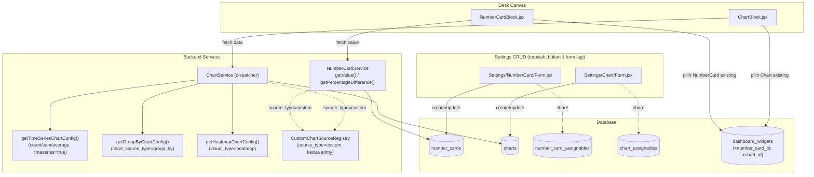

# Design Document: Number Card & Chart Redesign

## Overview

`Widget` (satu model, satu form, field `type` mencampur "sumber data" dan "tampilan visual") dipecah jadi dua entity independen — **NumberCard** dan **Chart** — mengikuti struktur ERPNext v16 (`Number Card` + `Dashboard Chart` DocType, dipelajari langsung dari source `frappe/frappe/desk/doctype/{number_card,dashboard_chart}/` di instance `frappe_docker` lokal, image `frappe/erpnext:v16.18.3`), dengan tiga penyesuaian sengaja terhadap referensi:

1. **Source `Report` di-drop** — tidak ada entity `Report`/Query Builder setara di codebase ini; membangunnya di luar scope spec ini.
2. **Source `Custom` pakai registry tertutup** (interface + daftar class terdaftar eksplisit), bukan whitelist method-path bebas ala ERPNext — permukaan serang lebih kecil (server tidak pernah invoke method dari string yang datang dari user).
3. **Model visibilitas ganda, BUKAN ganti permission Model**: `has_permission(model, Select/Read) OR is_shared_all OR assigned(user/role)`. Permission ke model target tetap gate DASAR yang selalu aktif untuk siapa saja; sharing (`is_shared_all` / assign ke User-Role spesifik, pola sama `Desk` + `DeskAssignable`) adalah jalur TAMBAHAN yang melebarkan visibility, bukan menggantikannya dan bukan `owner_id`-restrictive seperti Desk.

**Yang TIDAK berubah**: `DashboardWidget` tetap satu tabel block-placement (type `chart`/`card` sudah ada sejak desk-dashboard-builder, tidak perlu type baru), pola nesting/`parent_id`, mekanisme `PermissionChecker`/`Schema::hasColumn` whitelist di listing, konvensi `App\Traits\DataTable`/`configColumns`/`loadRelationsOnShow`.

Data existing di tabel `widgets` (6 baris dev, `type` sudah tidak cocok pilihan form sekarang) di-drop bebas — bukan data produksi, tidak perlu migration script pemetaan.

## Architecture



**Data flow (render satu block Number Card di Desk)**:
1. `DeskController` / `DashboardController::show()` load `Dashboard` → `DashboardWidget` (eager `numberCard`/`chart`/`parent`) → block tree terserialisasi ke React.
2. `NumberCardBlock` terima `block.numberCard` (objek NumberCard sudah ter-resolve, termasuk field visual: color/currency/show_full_number).
3. `NumberCardBlock` panggil `NumberCardController::getValue()` (POST, body `{filters}` override sementara kalau ada) → `NumberCardService::getValue()` → 1 query agregat.
4. Kalau `show_percentage_stats`, panggil `getPercentageDifference()` terpisah → `NumberCardService::getPercentageDifference()` → query sama + cutoff `created_at <= asOfDate` (asOfDate dari `stats_time_interval`).
5. Visibility DIBAGI enforcement 2 layer: (a) endpoint CRUD/listing NumberCard/Chart di-filter `Shareable` scope (SQL: `is_shared_all OR assignable match`) UNION baris yang lolos `PermissionChecker::can($targetModel, Select)` (PHP-side, sama pola `quickList()`); (b) endpoint `getValue()`/`getData()` **wajib** re-cek gate ini per-request (bukan percaya block config tersimpan), karena permission user bisa berubah sejak block dibuat.

## Components and Interfaces

### Backend — Models (flat, 1 file per model — konvensi existing)

```php
// app/Models/Core/NumberCard.php
class NumberCard extends Model {
    use DataTable, HasUlids, SoftDeletes, Shareable;

    public $casts = ['config' => Json::class, 'filters' => Json::class, 'is_shared_all' => 'boolean'];

    public function model() { return $this->belongsTo(Permission::class, 'model_id'); }
    public function createdBy() { return $this->belongsTo(User::class, 'created_by_id'); }
    protected function assignablePivot(): string { return NumberCardAssignable::class; }
}

// app/Models/Core/Chart.php — struktur sama, field beda (lihat Data Models)

// app/Models/Core/NumberCardAssignable.php — mirror DeskAssignable persis
class NumberCardAssignable extends Model {
    use HasUlids;
    protected $guarded = ['id'];
    public function numberCard(): BelongsTo { return $this->belongsTo(NumberCard::class); }
    public function assignable(): BelongsTo { return $this->belongsTo(Assignable::class, 'assignable_id'); }
}
// app/Models/Core/ChartAssignable.php — sama, target Chart
```

### Backend — Trait baru

```php
// app/Traits/Shareable.php
trait Shareable {
    abstract protected function assignablePivot(): string; // FQCN pivot model

    public function assignables(): HasMany {
        return $this->hasMany($this->assignablePivot());
    }

    /** Mirror DeskResolverService::firstVisible() query, generalized. */
    public function scopeVisibleByShare(Builder $query, User $user, array $roleIds): Builder {
        return $query->where('is_shared_all', true)
            ->orWhereHas('assignables', function ($q) use ($roleIds, $user) {
                $q->where(fn ($qq) => $qq->where('assignable_type', 'role')->whereIn('assignable_id', $roleIds))
                    ->orWhere(fn ($qq) => $qq->where('assignable_type', 'user')->where('assignable_id', $user->id));
            });
    }
}
```

`Desk`/`DeskResolverService` TIDAK di-retrofit ke trait ini (di luar scope, sudah jalan, tidak disentuh).

### Backend — Services (flat — masing-masing 1 tanggung jawab kohesif)

```php
// app/Services/Core/NumberCardService.php
class NumberCardService {
    public function getValue(NumberCard $card, array $filters): float { /* 1 query agregat */ }
    public function getPercentageDifference(NumberCard $card, array $filters, float $result): ?float { /* requery + cutoff created_at */ }
}

// app/Services/Core/ChartService.php
class ChartService {
    public function getData(Chart $chart, array $config): array {
        return match (true) {
            $chart->chart_source_type === 'custom'      => $this->registry->resolve($chart, $config),
            $chart->chart_source_type === 'group_by'     => $this->getGroupByChartConfig($chart, $config),
            $chart->visual_type === 'heatmap'            => $this->getHeatmapChartConfig($chart, $config),
            default                                      => $this->getTimeSeriesChartConfig($chart, $config), // logic getChartData() lama, dipindah apa adanya
        };
    }
    private function getGroupByChartConfig(Chart $chart, array $config): array { /* BARU */ }
    private function getHeatmapChartConfig(Chart $chart, array $config): array { /* BARU */ }
    private function getTimeSeriesChartConfig(Chart $chart, array $config): array { /* existing WidgetController::getChartData(), dipindah */ }
}
```

### Backend — Custom source registry (nested Feature — genuinely >1 file, tumbuh seiring waktu)

```
app/Contracts/Core/CustomChartSourceContract.php   — interface getValue(array $filters): array
app/Services/Core/CustomChartSource/CustomChartSourceRegistry.php — daftar tertutup key=>FQCN, resolve() validasi terdaftar
```

Tidak ada implementasi konkret di-ship di spec ini (belum ada use case nyata) — infrastruktur + registry kosong, siap didaftari fitur lain ke depan tanpa perlu ubah `ChartService`/`NumberCardService`.

### Backend — Controllers & Routes

```
app/Http/Controllers/Core/NumberCardController.php  — CRUD + POST number-cards/{id}/value, POST number-cards/{id}/percentage
app/Http/Controllers/Core/ChartController.php        — CRUD + POST charts/{id}/data
app/Http/Requests/Core/NumberCardRequest.php
app/Http/Requests/Core/ChartRequest.php
```

Hapus: `WidgetController.php`, `WidgetRequest.php`, route `settings.widget.*`, `get-chart`.

### Frontend

```
resources/js/Pages/Settings/NumberCard/{Form,Index,Show}.jsx   (ganti Settings/Widget/*)
resources/js/Pages/Settings/Chart/{Form,Index,Show}.jsx
resources/js/Components/NumberCardLinkModel.jsx   (ganti WidgetLinkModel.jsx)
resources/js/Components/ChartLinkModel.jsx
resources/js/Components/NumberCardDisplay.jsx     (split dari DashboardChart.jsx — TANPA import recharts sama sekali)
resources/js/Components/ChartDisplay.jsx          (recharts: line/bar/pie/donut + BARU: heatmap)
resources/js/Components/DashboardBlocks/NumberCardBlock.jsx   (ganti bagian isNumberCard dari ChartCardBlock.jsx)
resources/js/Components/DashboardBlocks/ChartBlock.jsx
```

`DashboardWidget::TYPES_WITH_WIDGET` (`['chart','card']`, [DashboardWidget.php:22](app/Models/DashboardWidget.php:22)) **TIDAK berubah** — tipe block sudah terpisah sejak desk-dashboard-builder, cuma target relasinya yang pindah dari `widget_id`→`Widget` jadi `number_card_id`→`NumberCard` (type=`card`) / `chart_id`→`Chart` (type=`chart`).

## Data Models

**Migration**: drop `widgets`; buat `number_cards`, `charts`, `number_card_assignables`, `chart_assignables`; ubah `dashboard_widgets` — drop `widget_id`, tambah `number_card_id` (nullable FK) + `chart_id` (nullable FK, mutually exclusive per row sesuai `type`).

```
number_cards
  id, label, source_type(document_type|custom), function(count|sum|average|minimum|maximum),
  aggregate_function_based_on, model_id(FK->permissions), filters(json),
  currency, color, background_color, show_full_number(bool),
  show_percentage_stats(bool), stats_time_interval(daily|weekly|monthly|yearly),
  method(nullable, key registry kalau source_type=custom),
  created_by_id, is_shared_all(bool default false), timestamps, soft_deletes

charts
  id, chart_name, chart_source_type(count|sum|average|group_by|custom),
  visual_type(line|bar|pie|donut|percentage|heatmap), model_id(FK->permissions),
  timeseries(bool), based_on, value_based_on, timespan, time_interval, from_date, to_date,
  group_by_based_on, group_by_type(count|sum|average), aggregate_function_based_on, number_of_groups,
  heatmap_year, color, currency, show_values_over_chart(bool), custom_options(json),
  method(nullable), filters(json),
  created_by_id, is_shared_all(bool default false), timestamps, soft_deletes

number_card_assignables / chart_assignables
  id, {number_card_id|chart_id}(FK), assignable_id, assignable_type(user|role)
```

## Correctness Properties

1. **Visibility OR-gate**: _Untuk setiap_ NumberCard/Chart `c` dan user `u`, `c` muncul di listing `u` **jika dan hanya jika** `PermissionChecker::can(c.model_id.model, Select) === true` ATAU `c.is_shared_all === true` ATAU ada baris `{c}_assignables` yang match role `u` atau `u` langsung. Tidak pernah kebalik (permission model TIDAK PERNAH jadi syarat wajib kalau share match, dan share TIDAK PERNAH override permission jadi lebih ketat).
2. **Group By ≠ Time Series**: _Untuk setiap_ Chart dengan `chart_source_type=group_by`, hasil `ChartService::getData()` TIDAK PERNAH memanggil `getTimeSeriesChartConfig()` — field `based_on`/`time_interval`/`timespan` tidak pernah dibaca sama sekali di jalur ini.
3. **NumberCard value tidak time-bucketed**: _Untuk setiap_ NumberCard, `getValue()` menghasilkan SATU angka dari SATU query agregat atas seluruh filter — bukan agregasi-dari-agregasi (fix gap rata-rata dari bug lama).
4. **Custom source tertutup**: _Untuk setiap_ pemanggilan source `custom`, `CustomChartSourceRegistry::resolve()` HANYA menerima key yang terdaftar eksplisit di registry — string method arbitrer dari input user TIDAK PERNAH langsung di-invoke.

**Validates**: Requirement terkait dituliskan di `requirements.md`.

## Error Handling

| Scenario | Behavior |
|---|---|
| `model_id` di NumberCard/Chart menunjuk model yang sudah tidak exists/renamed | `getValue()`/`getData()` return 404-equivalent (empty state), BUKAN 500 — cek `class_exists` sebelum query, sama pola `quickList()` |
| User kehilangan permission Select ke `model_id` setelah block ditempel di Desk | endpoint value/data re-cek `PermissionChecker` PER REQUEST → return empty state (bukan crash), block FE tampilkan "Tidak ada akses" |
| `source_type/chart_source_type=custom` tapi `method` tidak terdaftar di registry | 422 saat SAVE (validasi form), bukan baru gagal saat render |
| `group_by_based_on` kolom relasi tapi user tidak punya Select ke model relasinya | value/label kolom itu di-skip dari hasil (bukan expose data) — sama pola `PermissionChecker::can($related, Select)` di quickList() |
| Heatmap: `heatmap_year` kosong | default tahun berjalan |

## Testing Strategy

- **Unit**: `NumberCardService::getValue()` per `function` (count/sum/average/min/max); `getPercentageDifference()` dgn cutoff berbagai `stats_time_interval`; `ChartService` dispatch — assert jalur yang dipanggil per kombinasi `chart_source_type`/`visual_type`/`timeseries`; `CustomChartSourceRegistry::resolve()` menolak key tak terdaftar.
- **Feature**: CRUD NumberCard/Chart (replace `DashboardPermissionTest`-style existing pattern); visibility — user dengan Select model tapi TANPA share tetap lihat (gate dasar); user TANPA Select tapi `is_shared_all=true` tetap lihat; user TANPA Select tapi di-assign role/dirinya tetap lihat; user TANPA Select DAN tanpa share TIDAK lihat sama sekali (4 kombinasi Correctness Property 1). Group By chart hasilnya benar (bukan count-by-time lagi). Migration `dashboard_widgets` (`widget_id`→`number_card_id`/`chart_id`) tidak merusak block existing type lain (quick_list/link_card/section/dst).
- **Regresi**: seluruh 38 test `DeskDashboardBuilderTest` yang sudah ada tetap pass (block system lain tidak boleh kena dampak split ini).
