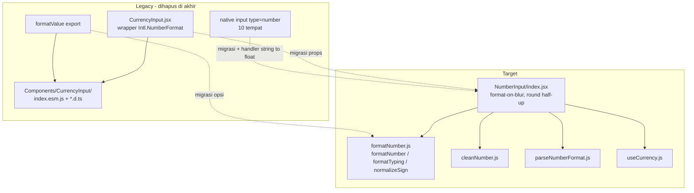

# Design Document: number-input-total-migration

## Overview

Migrasi total seluruh input & format angka legacy ke komponen + helper baru:

| Lama | Baru |
|---|---|
| `CurrencyInput` (`@/Components/CurrencyInput.jsx` — wrapper library vendored) | `NumberInput` (`@/Components/NumberInput`) |
| Native `<input type="number">` | `NumberInput` |
| `formatValue` (`@/Components/CurrencyInput`) | `formatNumber` (`@/Components/NumberInput/formatNumber`) |

**Tujuan**: konsolidasi ke satu komponen input angka + satu helper format. `NumberInput` adalah implementasi internal (pure-JS, format-on-blur, grouping realtime, round half-up tahan floating-point, sudah ada test + property-based). `CurrencyInput` adalah wrapper library compiled (`index.esm.js`) berbasis `Intl.NumberFormat` locale. Konsolidasi → konsistensi format, hapus dependensi vendored, turun bundle size.

**Hasil akhir**: 0 referensi `CurrencyInput`/`formatValue`/`type="number"` tersisa; file lama dihapus; build + test pass; docs ter-update.

**Strategi**: migrasi per-site otomatis (translate props tiap pemakaian), bukan shim kompatibilitas.

## Architecture



## Components and Interfaces

### Komponen target: `NumberInput`

**File**: `resources/js/Components/NumberInput/index.jsx`

Props utama:

| Prop | Tipe | Default | Catatan |
|---|---|---|---|
| `value` | number\|string\|null | — | controlled value (float) |
| `onValueChange` | `(float\|null, values) => void` | — | `values = { float, formatted, value }` |
| `allowDecimals` | boolean | true | false → `decimalScale` dipaksa 0 |
| `allowNegativeValue` | boolean | true | — |
| `decimalScale` | number | — | pembulatan saat blur |
| `numberFormat` | string | — | pola `#,###.##`; override grp/dec/scale |
| `groupSeparator` / `decimalSeparator` | string | — | override pemisah |
| `min` / `max` | number | — | clamp saat blur |
| `maxLength` | number\|null | 12 | batas digit (tanpa separator) |
| `prefix` / `suffix` | string | — | teks depan/belakang; `prefix` menang atas currency symbol |
| `currencyCode` | string | — | resolve symbol (atau `"default"` dari preference) |

Helper sinkron (`formatNumber.js`):
- `formatNumber(value, options)` → string terformat (round half-up).
- `formatTyping(raw, options)` → string realtime (tanpa rounding).
- `normalizeSign(str, allowNegative)` → minus normalized ke depan.

### Mapping A — `CurrencyInput` → `NumberInput`

| Prop CurrencyInput | Prop NumberInput | Aturan translate |
|---|---|---|
| `value` | `value` | pass-through |
| `onValueChange={(v) => ...}` | `onValueChange={(v) => ...}` | arg-1 scalar `float` identik → aman tanpa ubah body |
| `currencyCode` | `currencyCode` | pass-through (symbol) |
| `decimalScale` | `decimalScale` | **WAJIB eksplisit** — CurrencyInput auto-detect via locale `formatToParts`; NumberInput tidak. Set sama dengan nilai efektif sebelumnya |
| `min` / `max` | `min` / `max` | pass-through |
| `prefix` / `suffix` | `prefix` / `suffix` | pass-through |
| `className` / `readOnly` / `disabled` | sama | pass-through |
| `decimalsLimit` | `decimalScale` atau `maxLength` | translate ke padanan; tak ada `decimalsLimit` di NumberInput |
| `fixedDecimalLength` | `decimalScale` | translate |

### Mapping B — `formatValue` → `formatNumber`

`formatValue({ value, intlConfig, decimalScale, decimalSeparator, groupSeparator, prefix, suffix })` → `formatNumber(value, { numberFormat, decimalScale, groupSeparator, decimalSeparator, prefix, suffix })`.

| formatValue (lama) | formatNumber (baru) | Catatan |
|---|---|---|
| `value` (string/number) | `value` (arg-1) | pass-through |
| `intlConfig.locale` | `groupSeparator`/`decimalSeparator` atau `numberFormat` | locale "id" → grup `.` dec `,` (verifikasi vs `default_number_format`) |
| `intlConfig.currency` | `prefix` (symbol resolved) | **currency-path**: locale Intl hasilkan symbol ("Rp"); `formatNumber` tak punya locale → resolve symbol dulu, pass sebagai `prefix` |
| `decimalScale` | `decimalScale` | pass-through |
| `prefix` / `suffix` | `prefix` / `suffix` | pass-through |

#### Kasus khusus: `PrintPreview.formatData` (pure function, tanpa hook)

**File**: `resources/js/Pages/Core/Components/PrintPreview.jsx` (`formatData`, case `currency`/`number` L68-89).

`formatData` adalah pure function (bukan komponen) → **tak bisa `useCurrency` hook**.

**Precedence currency — disamakan dengan Table2 Cell** (3-level): `col.currencyCode` (utama) → `row.currency` (data yang sedang diformat, mis. `data.currency`) → `default_currency_id`. Catatan: existing hanya 2-level (`col.currencyCode || opts.defaultCurrencyCode`); migrasi **menambah** `row.currency` di tengah.

Strategi symbol resolution (sesuai keputusan user):
1. Di komponen `PrintPreview` (punya hook context), **pre-resolve symbol** untuk semua currency code unik — kumpulkan dari `col.currencyCode` DAN `data.currency.code` (rekursif relations) DAN `default_currency_id` — via `getCurrencyConfig` (sync dari cache atau await), bangun map `{ code → symbol }`. Jika `data.currency` membawa `.symbol` langsung, pakai itu tanpa fetch.
2. Pass map symbol ke `formatData` lewat `opts` (mis. `opts.currencySymbols`).
3. Di `formatData`, resolve code per precedence → `formatNumber(value, { numberFormat/decimalScale, prefix: type==="currency" ? symbols[resolvedCode] : "" })` — lookup map = **sinkron**.

`type === "number"` → tanpa symbol (sama seperti perilaku `currency: undefined` sekarang). `decimalScale` dari `col.decimalScale ?? 0`. `absoluteNumber` (Math.abs) dipertahankan.

### Mapping C — native `type="number"` → `NumberInput`

| Aspek | Native | NumberInput |
|---|---|---|
| element | `<input type="number" onChange={(e)=>set(e.target.value)} />` | `<NumberInput onValueChange={(float)=>set(float)} />` |
| nilai handler | string (`e.target.value`) | float (`onValueChange` arg-1) — **wajib sesuaikan handler** |
| integer field | `step="1"` | `allowDecimals={false}` / `decimalScale={0}` |
| min/max | `min`/`max` attr | `min`/`max` prop |

Field native (10): role `level` (0–9 int), attribute `from_range`/`to_range`/`increment`, SMTP `mail_port` (int), per-page option (int, konversi `Number()` on blur), colspan/rowspan (int min 1), unit input CSS value (`step="any"`, sudah pakai `onValueChange` custom).

### Mapping D — Table2 `Cell` type `number`/`currency`

**File**: `resources/js/Components/Table/Table2.jsx` — komponen `Cell` (L112-270).

Saat ini `switch(type)` tidak punya case `number`/`currency` → jatuh ke `default: valueCell = value` (angka mentah). Tambahkan dua case yang memformat via `formatNumber` (sinkron, tak baca preference → Cell baca preference sendiri).

Aturan resolusi (sesuai keputusan user):

| Aspek | Aturan |
|---|---|
| Symbol (currency) | `type=="currency"` → prefix symbol; `type=="number"` → tanpa symbol |
| Sumber currency (precedence) | **`colProps.currencyCode` (utama, string/object)** → `row.currency` (object) → `default_currency_id` (preferences) |
| Sumber symbol | bila currency object/`row.currency` → `.symbol` langsung (dijamin backend) tanpa fetch; bila `colProps.currencyCode` string → object-path T00 / resolve; bila tak ada → fallback default |
| decimalScale / format | `colProps.decimalScale` / `colProps.numberFormat` (jika ada) → fallback `preferences.default_number_format` |

Pseudo-pola:
```jsx
case "number":
case "currency": {
  const numberFormat = colProps.numberFormat ?? preferences?.default_number_format;
  const prefix = type === "currency"
    ? (row?.currency?.symbol ?? /* resolve default symbol */ "")
    : "";
  valueCell = formatNumber(value, {
    numberFormat,
    decimalScale: colProps.decimalScale, // numberFormat override bila ada
    prefix,
  });
  break;
}
```

Catatan: `preferences` diambil via `usePage().props.preferences` (Cell sudah pakai `usePage()` untuk `lang`). `formatNumber` di-import dari `@/Components/NumberInput/formatNumber`.

## Inventory Terdampak

| Kategori | Jumlah | Lokasi utama |
|---|---|---|
| `CurrencyInput` JSX | ~97 (21 file import) | Finances, Sales, Purchase, Inventory, Core/Print, FormTable, Table/Filter |
| `formatValue` call | 10 (4 file) | `lib/gjsRelationsTable.js`, `lib/initHandlebar.js`, `Pages/Core/PrintTemplate/utils/variableTokenUtils.js`, `Pages/Core/Components/PrintPreview.jsx` |
| native `type="number"` | 10 | `Users/Roles/FormNewRule.jsx`, `Inventory/Attributes/Form.jsx` (3), `Settings/Company.jsx` (3), `Core/PrintTemplate/Components/CustomModeHeaderEditor.jsx` (2), `Core/PrintTemplate/Components/StyleFields/UnitInputField.jsx` |
| docs | 2 file | `docs/frontend.md`, `docs/architecture.md` |

## Risiko & Verifikasi (jangan rusak fitur)

1. **decimalScale auto-detect** — CurrencyInput deteksi desimal dari locale; NumberInput tidak. → set `decimalScale` eksplisit tiap call-site agar jumlah desimal sama.
2. **onValueChange signature** — `(float, name?, values?)` → `(float, values)`. Mayoritas pakai arg-1 → aman. Cek yang pakai `name`/`values`.
3. **SPECIAL_DISPLAY_VALUES (`∞`, `-`)** — hanya CurrencyInput handle. Cek Print/PrintTemplate yang andalkan ini sebelum swap.
4. **formatValue currency-path** — `intlConfig:{locale,currency}` → symbol lokal. `formatNumber` tak punya locale Intl → resolve symbol dulu, pass `prefix`. Verifikasi output string identik (posisi & bentuk symbol).
5. **FormTable column-width** — CurrencyInput dengan `min/max/step` integer → NumberInput integer mode.
6. **Native handler value** — string → float; tiap handler harus disesuaikan (mis. `setData("mail_port", float)`).
7. **Object-path `currencyCode`** — setelah enhancement (lihat bawah), `useCurrency`/`NumberInput` menerima `currencyCode` string ATAU object. Pastikan jalur object tidak memicu fetch saat `symbol` ada, dan tidak meledak saat `symbol` kosong (fallback fetch by `code`). `row.currency.symbol` dijamin dikirim backend → Cell currency aman tanpa fetch.

## Enhancement Komponen — `currencyCode` terima string ATAU object

**File**: `resources/js/Components/NumberInput/useCurrency.js` (utama), `getCurrencyConfig.js` (opsional), `index.test.js` (test).

Saat ini `currencyCode` hanya string → `useCurrency` selalu lewat `getCurrencyConfig` (fetch `getDataModel`, kecuali cache hit). Tambah dukungan object data currency (`{ code, symbol, name, ... }`):

| Tipe `currencyCode` | Perilaku |
|---|---|
| `string` (mis. `"idr"`, `"default"`) | **jalur lama** — resolve via `getCurrencyConfig` (cache localStorage 7 hari) |
| `object` dengan `symbol` terisi | pakai `object.symbol` **langsung, sinkron, tanpa fetch** |
| `object` tanpa `symbol` (kosong/null) | **fallback** fetch pakai `object.code` (jalur `getCurrencyConfig`) |
| `null`/`undefined` | symbol null (tanpa prefix) |

Output `useCurrency` tetap `{ symbol, loading }` — konsisten kedua jalur. Object-path tidak di-cache (data sudah lengkap di tangan). `NumberInput/index.jsx` meneruskan `currencyCode` apa adanya ke `useCurrency` → minim/zero perubahan di komponen induk. Manfaat: `Cell` & call-site yang punya object currency (mis. `row.currency`) langsung pass object → symbol instan, hemat fetch.

**Strategi verifikasi akhir**:
- `grep -rn "CurrencyInput\|formatValue" resources/js` → 0 (selain file yang dihapus).
- `grep -rn 'type="number"' resources/js` → 0.
- `npm run build` sukses (Vite manifest OK).
- `npx vitest run` — test NumberInput + variableTokenUtils pass.
- Manual spot-check: 1 form Finances (SalesInvoice), 1 Print render, 1 native field (Settings/Company port).

## File Kritis

- **Baru (referensi)**: `resources/js/Components/NumberInput/{index.jsx, formatNumber.js, cleanNumber.js, parseNumberFormat.js, useCurrency.js, index.test.js}`.
- **Lama (dihapus akhir)**: `resources/js/Components/CurrencyInput.jsx`, folder `resources/js/Components/CurrencyInput/`.
- **Pola pemakaian benar yang sudah ada**: `resources/js/Components/Table/Filter/ValueField.jsx:64-80`.
