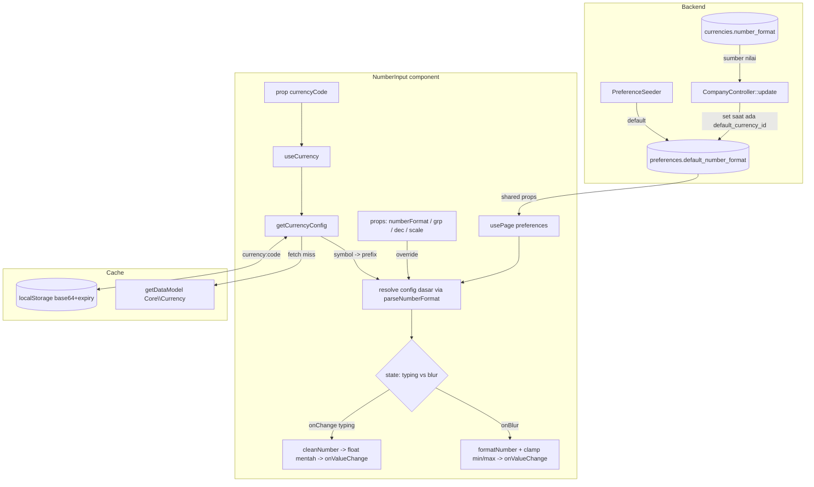

# Design Document: NumberInput

## Overview

Implementasi fresh komponen input angka/currency (`NumberInput`) + fungsi formatting standalone (`formatNumber`), menggantikan ketergantungan pada package vendored `react-currency-input-field`. Format angka bersumber tunggal dari preference `default_number_format`; `currencyCode` hanya menarik symbol.

Pemisahan tanggung jawab:

- **Fungsi murni (sinkron, testable)**: `parseNumberFormat`, `formatNumber`, `cleanNumber`.
- **I/O + cache (async)**: `getCurrencyConfig`.
- **Hook React**: `useCurrency` (membungkus `getCurrencyConfig` dengan state & race handling).
- **Komponen**: `NumberInput` (orkestrasi state typing/blur, override precedence).
- **Backend**: seed + derivasi `default_number_format` saat simpan preference.

## Architecture



## Components and Interfaces

### Backend

#### `database/seeders/PreferenceSeeder.php`

Tambah satu entri ke `$preferencesArr`:

```php
'default_number_format' => '#.###,##', // konsisten dgn default_currency_id 'idr'
```

Mekanisme `updateOrCreate` yang sudah ada membuatnya idempotent.

#### `app/Http/Controllers/Core/CompanyController.php` — `update()`

Setelah loop `Preference::updateOrCreate` (sekitar baris 48-51), masih di dalam `DB::beginTransaction`/commit yang sudah ada, tambahkan derivasi:

```php
if (isset($preferences['default_currency_id'])) {
    $currency = Currency::find($preferences['default_currency_id']);
    Preference::withoutGlobalScope(Preference::HIDE_PRIVATE_KEYS_SCOPE)
        ->updateOrCreate(
            ['key' => 'default_number_format'],
            ['value' => $currency?->number_format ?? '#,###.##'],
        );
}
```

Catatan: `Currency` sudah di-import di controller (verifikasi `use App\Models\Core\Currency;` saat eksekusi; tambahkan bila belum).

### Frontend — struktur folder

```
resources/js/Components/NumberInput/
  index.jsx
  formatNumber.js
  parseNumberFormat.js
  cleanNumber.js
  getCurrencyConfig.js
  useCurrency.js
  index.test.js
```

#### `parseNumberFormat.js`

```js
/**
 * @param {string} pattern  contoh "#,###.##"
 * @returns {{ groupSeparator: string, decimalSeparator: string, decimalScale: number }}
 */
export function parseNumberFormat(pattern) {}
```

Algoritma:
1. Fallback `{ ",", ".", 2 }` jika pattern bukan string non-kosong.
2. Cari bagian desimal: match `([^#0])([#0]+)$` → grup 1 = `decimalSeparator`, panjang grup 2 = `decimalScale`. Jika tak ada → `decimalScale = 0`, `decimalSeparator` default `.`.
3. Bagian integer = pattern sebelum decimalSeparator. Cari pemisah grup: karakter non-`#`/`0` pertama di bagian integer → `groupSeparator` (kosong jika tak ada).

#### `formatNumber.js`

```js
/**
 * @param {number|string} value
 * @param {{ numberFormat?: string, groupSeparator?: string, decimalSeparator?: string,
 *           decimalScale?: number, prefix?: string, suffix?: string, allowNegativeValue?: boolean }} [options]
 * @returns {string}
 */
export function formatNumber(value, options = {}) {}
```

Algoritma:
1. Normalisasi `value` → Number. Jika kosong/NaN → `""`.
2. Resolusi opsi: jika `numberFormat` → `parseNumberFormat` override grp/dec/scale.
3. Tangani tanda negatif (sesuai `allowNegativeValue`).
4. **Rounding round half-up** pada `decimalScale` (jika terdefinisi). Untuk menghindari error floating point, gunakan pendekatan berbasis string atau penambahan epsilon kecil sebelum `toFixed`/`Math.round`. Bagian implementasi ini diserahkan ke pembuat (lihat catatan di bawah).
5. Pecah integer & fraction; sisip `groupSeparator` tiap 3 digit integer (regex `\B(?=(\d{3})+(?!\d))`).
6. Rakit: `prefix + sign + intGrouped + (frac ? decimalSeparator + frac : "") + suffix`.

#### `cleanNumber.js`

```js
/**
 * @param {string} str
 * @param {{ groupSeparator?: string, decimalSeparator?: string, prefix?: string, suffix?: string }} [options]
 * @returns {string}  raw numeric string siap parseFloat ("" jika tak ada digit)
 */
export function cleanNumber(str, options = {}) {}
```

#### `getCurrencyConfig.js`

```js
import { getDataModel, getFromLocalStorage, saveToLocalStorage } from "@/lib/utils";

/**
 * @param {string|undefined|null} code  "default" | <currency code> | null
 * @param {string} [defaultCode]  dipakai saat code === "default"
 * @returns {Promise<{ symbol: string }|null>}
 */
export async function getCurrencyConfig(code, defaultCode) {}
```

- Key cache: `` `currency:${resolvedCode}` ``. Expiry 7 hari.
- Miss → `getDataModel("Core\\Currency", { code: resolvedCode }, { limit: 1 })` → simpan → return `{ symbol }`.

#### `useCurrency.js`

```js
import { usePage } from "@inertiajs/react";
import { useEffect, useState } from "react";
import { getCurrencyConfig } from "./getCurrencyConfig";

/** @returns {{ symbol: string|null, loading: boolean }} */
export function useCurrency(currencyCode) {}
```

- Ambil `default_currency_id` dari `usePage().props.preferences`.
- `useEffect` dgn dependency `[currencyCode]`; flag `ignore` di cleanup untuk race.

#### `index.jsx`

```js
import { forwardRef } from "react";
export { formatNumber } from "./formatNumber";
export { parseNumberFormat } from "./parseNumberFormat";
export { getCurrencyConfig } from "./getCurrencyConfig";

export default forwardRef(function NumberInput(props, ref) {});
```

State internal:
- `displayValue` (string yang tampil di input).
- Resolusi config format via `useMemo`: base `default_number_format` → override `numberFormat`/props individual.
- `symbol` dari `useCurrency(currencyCode)` → prefix efektif.

Handler:
- `handleChange`: sanitasi karakter (`0-9`, `decimalSeparator`, `-` jika `allowNegativeValue`), set `displayValue`, hitung float via `cleanNumber`, panggil `onValueChange({ float, formatted: displayValue, value })`.
- `handleBlur`: `cleanNumber` → float → clamp min/max → `formatNumber` → set `displayValue` → `onValueChange({ float, formatted, value })`.
- Sync parent: `useDidMountEffect` pada `[value]`.

## Data Models

Tidak ada migrasi baru. Hanya penambahan row di tabel `preferences`:

| key                   | value (contoh) | sumber                                   |
| --------------------- | -------------- | ---------------------------------------- |
| `default_number_format` | `#.###,##`    | seeder / derivasi dari `Currency.number_format` |

## Error Handling

- `getCurrencyConfig`: jika `getDataModel` gagal/empty → return `null` (komponen fallback ke prefix prop / kosong). Tidak melempar agar input tetap usable offline.
- `formatNumber`/`cleanNumber`: input invalid → string kosong, tidak melempar.
- Backend: currency tidak ditemukan → fallback `#,###.##` (Req 1.3).

## Testing Strategy

- **Pure functions** (vitest + fast-check) di `index.test.js`: `parseNumberFormat`, `formatNumber`, `cleanNumber`, property round-trip. Lihat acceptance Requirement 8.
- **Backend** (PHPUnit feature test): submit update preference dengan `default_currency_id` tertentu → assert `default_number_format` tersimpan sesuai `Currency.number_format`; assert fallback saat currency tak ada.
- **Manual**: render komponen dengan & tanpa `currencyCode`, verifikasi format-on-blur, clamp min/max, override decimalScale, dan cache localStorage.

## Catatan implementasi (titik keputusan untuk pembuat)

1. **Algoritma round half-up** di `formatNumber` adalah titik risiko utama (floating point). Pembuat memilih strategi: epsilon-nudge sebelum `toFixed`, atau manipulasi string digit. Harus lolos `1.005 → 1.01` dan `1.004 → 1.00`.
2. **Sanitasi karakter saat typing**: seberapa ketat (mis. mencegah dua decimalSeparator, minus di tengah). Diserahkan ke pembuat selama tidak memformat penuh.
3. **prefix eksplisit vs currency symbol**: bila keduanya ada, prop `prefix` menang (currencyCode hanya mengisi default).
