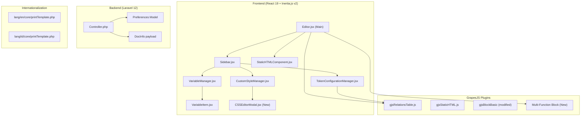

# Design Document: Print Editor Improvements

## Overview

This design covers a comprehensive set of improvements to the GrapesJS-based Print Template Editor. The changes span bug fixes, UX enhancements, token configuration refactoring, relation table improvements, new variable groups, backend data delivery, block layout replacement, CSS editing improvements, and print preview cleanup.

The editor is built with React 19 + Inertia.js v2 on the frontend, using GrapesJS as the visual template builder, Monaco Editor for code editing, and Handlebars for template token rendering. The backend is Laravel 12 with PHP 8.4.

### Key Design Decisions

1. **NestedSelect for hierarchical data** — Replace flat `Select` components with the existing `NestedSelect` cascader component for token/label/relation path fields, providing intuitive tree navigation.
2. **Consolidate relation table config** — Move column configuration from the Inspector tab into the Token Configuration Manager panel, reducing context switching.
3. **Active-only relation display** — Show only the selected relation table's config in the Token panel to reduce clutter.
4. **Modal-based CSS editing** — Move manual CSS editing into a modal dialog, keeping the Style tab as a read-only summary.
5. **Bootstrap classes for relation tables** — Use Bootstrap's `table`, `table-bordered`, and `w-100` classes for consistent print output.
6. **Multi-function container block** — Replace multiple column blocks with a single flexible container block with configurable HTML tag.

---

## Architecture



---

## Components and Interfaces

### 1. StaticHTMLComponent (Bug Fix + Modal Resize)

**File:** `resources/js/Pages/Core/PrintTemplate/Components/StaticHTMLComponent.jsx`

**Changes:**

- Add `event.stopPropagation()` on keydown for "/" key within the Monaco editor container to prevent global command palette trigger.
- Increase modal width to use `max-w-xl` breakpoint (Tailwind `--breakpoint-xl`).
- Set minimum height of 400px for both code editor and preview areas.
- Constrain modal max-height to `92svh`.

**Interface (unchanged):**

```typescript
interface StaticHTMLComponentProps {
  open: boolean;
  onOpenChange: (open: boolean) => void;
  initialHTML: string;
  onSave: (rawHTML: string, sanitizedHTML: string, warnings: string[]) => void;
}
```

### 2. TokenConfigurationManager (Major Refactor)

**File:** `resources/js/Pages/Core/PrintTemplate/Components/TokenConfigurationManager.jsx`

**Changes:**

- Replace `Select` with `NestedSelect` for labelKey, token, and relationPath fields.
- Build tree-structured options from `dataTableColumns` with `label`, `value`, and `children` properties.
- Filter token options: show only "data", "preferences", and "relation" (singular) types; exclude "relations" (many) and their children.
- Filter relationPath options: only "relations" items are selectable; "relation" items shown as disabled parents for navigation.
- Format token labels as `{{field_name}}` instead of full path format.
- Generate `{{relation doc.<name>}}` format for singular relation tokens.
- Show only the actively selected relation table's configuration (not all).
- Move column configuration UI (show/hide, reorder) from RelationsInspector into this component.
- Pass `printTemplate.default_language` to column label resolution for language-aware headers.

**New helper functions:**

```javascript
// Build tree options from flat dataTableColumns
function buildTreeOptions(columns, path = "", parentType = "data") → Option[]

// Filter options for token field (exclude "relations" and children)
function filterTokenOptions(options) → Option[]

// Filter options for relationPath (only "relations" selectable)
function filterRelationPathOptions(options) → Option[]

// Format token label for display
function formatTokenLabel(option) → string  // e.g., "{{date}}"
```

### 3. VariableManager + VariableItem (DocInfo Group + Relations Collapse)

**File:** `resources/js/Pages/Core/PrintTemplate/Components/VariableManager.jsx`

**Changes:**

- Add "docInfo" group to the variable list, sourced from `usePage().props.docInfo`.
- Display docInfo items as draggable variables generating `{{docInfo.<field>}}` tokens.

**File:** `resources/js/Pages/Core/PrintTemplate/Components/VariableItem.jsx`

**Changes:**

- For items with `type === "relations"`: hide the expand/collapse chevron and `CollapsibleContent`. The item remains draggable to create relation tables.
- Keep collapsible behavior for "relation" (singular), "data", and "preferences" types.

### 4. CustomStyleManager (Background Hidden + Class Manager + CSS Modal)

**File:** `resources/js/Pages/Core/PrintTemplate/Components/CustomStyleManager.jsx`

**Changes:**

- Add background-related property IDs to `HIDDEN_PROPERTY_IDS`: `background-image`, `background-repeat`, `background-position`, `background-size`, `background-attachment`.
- Replace inline `MonacoCSSEditor` with a read-only CSS summary block and an "Edit" button that opens a new `CSSEditorModal`.
- Add a "Class" management section: display current classes as badges, allow adding/removing classes on the selected component.
- Handle body node CSS: when the wrapper/body is selected, allow full CSS with selectors (not just declarations) and prevent double-wrapping in `body{}`.

**New Component:** `CSSEditorModal.jsx`

```typescript
interface CSSEditorModalProps {
  open: boolean;
  onOpenChange: (open: boolean) => void;
  initialCSS: string;
  isBodyNode: boolean;
  onSave: (cssText: string) => void;
}
```

### 5. Sidebar (Inspector Cleanup)

**File:** `resources/js/Pages/Core/PrintTemplate/Components/Sidebar.jsx`

**Changes:**

- Remove `RelationsInspector` import and rendering from the Inspector tab.
- Keep `StaticHTMLInspector` in the Inspector tab.

### 6. gjsRelationsTable Plugin (Bootstrap Classes + Language Headers)

**File:** `resources/js/lib/gjsRelationsTable.js`

**Changes:**

- Update `gjsRelationsTable` component type defaults to use Bootstrap classes: `table table-bordered w-100` instead of custom `.gjs-relations-table` class.
- Update `toHTML()` to output `<table class="table table-bordered w-100" ...>`.
- Accept a `locale` parameter in `buildExampleDataTable` and `getColumnLabel` to resolve `titleTrans` with the correct language.
- Update `getColumnLabel` to accept an optional locale and pass it to the translation function.

### 7. Editor.jsx (Block Replacement + i18n + DocInfo)

**File:** `resources/js/Pages/Core/PrintTemplate/Editor.jsx`

**Changes:**

- Remove `column1`, `column2`, `column3`, `column3-7` from `gjsBlockBasic` blocks array.
- Register a new "Multi-Function Container" block type with configurable HTML tag trait.
- Accept `docInfo` prop from backend and pass to template context.
- Ensure all hardcoded UI strings use `t()` from `useLaravelReactI18n`.

**Multi-Function Block registration:**

```javascript
editor.DomComponents.addType("multiContainer", {
  model: {
    defaults: {
      tagName: "div",
      droppable: true,
      traits: [
        {
          type: "select",
          name: "tagName",
          label: "HTML Tag",
          options: [
            { value: "div", name: "div" },
            { value: "section", name: "section" },
            { value: "article", name: "article" },
            { value: "aside", name: "aside" },
            { value: "header", name: "header" },
            { value: "footer", name: "footer" },
            { value: "main", name: "main" },
            { value: "nav", name: "nav" },
            { value: "span", name: "span" },
          ],
          changeProp: true,
        },
      ],
    },
  },
});
```

### 8. Controller.php (Backend Data)

**File:** `app/Http/Controllers/Controller.php`

**Changes to `print()` method:**

- Add `preferences` prop: fetch all company preferences from the database.
- Add `docInfo` prop: build object with `name` field from the model being printed.
- Wrap preference fetch in try/catch, defaulting to empty array on failure.

```php
public function print(Request $request, mixed $id, ?PrintTemplate $printTemplate = null) {
    // ... existing code ...

    $preferences = [];
    try {
        $preferences = \App\Models\Core\Preference::pluck('value', 'key')->toArray();
    } catch (\Exception $e) {
        $preferences = [];
    }

    $docInfo = [
        'name' => $data->{$data->keyBreadcrumb ?? 'name'} ?? '',
    ];

    return Inertia::render('Core/Print', [
        'doc'           => $data,
        'preferences'   => $preferences,
        'docInfo'       => $docInfo,
        'document'      => [...],
        'printTemplate' => $printTemplate->toArray(),
    ]);
}
```

### 9. Print Preview Cleanup (Static HTML Wrapper)

**File:** `resources/js/lib/gjsStaticHTML.js` (or equivalent)

**Changes:**

- In the `toHTML()` / CSS export of the staticHTML component type, exclude the editor-only styles:
  - Remove `border: 2px dashed #6366f1` from `.gjs-static-html-wrapper`
  - Remove `::before` content/display styles from `.gjs-static-html-wrapper::before`
- These styles remain active in the canvas editing mode but are stripped from exported HTML/CSS.
- In print preview rendering, add a `<style>` block that sets `.gjs-static-html-wrapper { border: none; }` and `.gjs-static-html-wrapper::before { content: none; display: none; }`.

### 10. i18n Integration

**Files:** `lang/en/core/printTemplate.php`, `lang/id/core/printTemplate.php`

**New translation keys to add:**

```php
// English
'editor' => [
    'tab_style'      => 'Style',
    'tab_layer'      => 'Layer',
    'tab_blocks'     => 'Blocks',
    'tab_variables'  => 'Variables',
    'tab_token'      => 'Token',
    'tab_inspector'  => 'Inspector',
    'token_config'   => 'Token Configuration',
    'relation_table' => 'Relation Table Token',
    'no_relation_active' => 'No relation table is active. Select a relation table on the canvas.',
    'apply_config'   => 'Apply Configuration',
    'manual_css'     => 'Manual CSS',
    'edit_css'       => 'Edit CSS',
    'class_manager'  => 'CSS Classes',
    'add_class'      => 'Add class',
    'multi_container' => 'Container',
    'select_component' => 'Select a component to edit CSS.',
    'no_tokens'      => 'No tokens on canvas yet.',
    'doc_info'       => 'Document Info',
    'select_token'   => 'Select on Canvas',
    'label_key'      => 'Label Key',
    'handlebar_token' => 'Handlebar Token',
    'variable_path'  => 'Variable Path',
    'relation_path'  => 'Relation Path',
    'columns'        => 'Columns',
    'html_tag'       => 'HTML Tag',
],
```

---

## Data Models

### Props passed to Editor page (via Inertia)

```typescript
interface EditorPageProps {
  printTemplate: PrintTemplate;
  csrfToken: string;
  dataTableColumns: DataTableColumn[];
  preferences: Record<string, string>;
  exampleData: Record<string, any>;
  docInfo: { name: string; [key: string]: any }; // NEW
}
```

### DataTableColumn (existing, for reference)

```typescript
interface DataTableColumn {
  name: string;
  title?: string;
  titleTrans?: string;
  type:
    | "data"
    | "preferences"
    | "relation"
    | "relations"
    | "currency"
    | "numeric"
    | "number";
  parentType?: string;
  columns?: DataTableColumn[];
  related?: string;
  show?: boolean;
  order?: number;
  expression?: string;
  currency?: string;
  decimalScale?: number;
  formatOptions?: { decimals?: number; currency?: string };
}
```

### NestedSelect Option (existing component interface)

```typescript
interface NestedSelectOption {
  label: string;
  value?: string;
  type?: string;
  relation?: string;
  loadable?: boolean;
  children?: NestedSelectOption[];
  disabled?: boolean; // Used for non-selectable parent nodes
}
```

### DocInfo payload (new)

```typescript
interface DocInfo {
  name: string; // Document display name
}
```

### CSSEditorModal state

```typescript
interface CSSEditorState {
  draft: string; // Current CSS text being edited
  isValid: boolean; // Whether CSS syntax is valid
  errors: MarkerData[]; // Monaco editor markers for errors
  isBodyNode: boolean; // Whether editing body-level CSS
}
```

---

## Correctness Properties

_A property is a characteristic or behavior that should hold true across all valid executions of a system—essentially, a formal statement about what the system should do. Properties serve as the bridge between human-readable specifications and machine-verifiable correctness guarantees._

### Property 1: Column label resolution follows fallback chain

_For any_ column definition with any combination of `titleTrans`, `title`, and `name` fields, and _for any_ locale, the `getColumnLabel` function SHALL return the translated value of `titleTrans` if available, otherwise `title`, otherwise `name` — never returning undefined or empty string when at least one field is present.

**Validates: Requirements 3.1, 3.3**

### Property 2: Tree structure building preserves parent-child hierarchy

_For any_ valid `dataTableColumns` array with nested `columns` properties, the `buildTreeOptions` function SHALL produce a tree where every node's `children` array contains exactly the items from the corresponding `columns` array in the source, preserving nesting depth and order.

**Validates: Requirements 6.5**

### Property 3: Token label formatting

_For any_ field name string, the token label formatting function SHALL produce output in the format `` without path prefixes, arrow separators, or "doc." prefix.

**Validates: Requirements 7.1, 7.2, 7.3**

### Property 4: Token option filtering excludes relations and their children

_For any_ `dataTableColumns` tree containing nodes of type "relations", the `filterTokenOptions` function SHALL exclude all nodes with `type === "relations"` AND all descendant nodes nested under those "relations" nodes, while retaining all nodes of type "data", "preferences", and "relation" (singular).

**Validates: Requirements 8.1, 8.2, 8.3, 8.4**

### Property 5: Relation token generation with path normalization

_For any_ variable name string representing a singular relation, the token generation function SHALL produce output in the format `{{relation doc.<name>}}`, automatically prepending "doc." if the input path does not already start with "doc.".

**Validates: Requirements 9.1, 9.4**

### Property 6: Token display simplification

_For any_ token string matching patterns `{{relation doc.<path>}}` or `{{docInfo.<path>}}` or `{{doc.<path>}}`, the simplification function SHALL produce a display string `` with the prefix removed, correctly handling nested dot-notation paths.

**Validates: Requirements 9.3, 12.1, 12.3, 15.5**

### Property 7: RelationPath option filtering

_For any_ `dataTableColumns` tree, the `filterRelationPathOptions` function SHALL mark all nodes with `type === "relations"` as selectable (disabled=false) and all nodes with `type === "relation"` as non-selectable (disabled=true), serving only as navigation parents.

**Validates: Requirements 10.1, 10.2**

### Property 8: Relation node pruning hides nodes without relations descendants

_For any_ node with `type === "relation"` in the options tree, if that node has no descendant (at any depth) with `type === "relations"`, the `filterRelationPathOptions` function SHALL exclude that node entirely from the output.

**Validates: Requirements 10.4**

### Property 9: Nested relation full path construction

_For any_ nested "relations" item located under one or more "relation" parent nodes, selecting that item SHALL produce a full dot-notation path including all ancestor relation names (e.g., selecting "items" under "branch" produces "branch.items").

**Validates: Requirements 10.5**

### Property 10: DocInfo token generation

_For any_ docInfo field name, inserting it into the canvas SHALL produce a token in the format `{{docInfo.<field_name>}}`.

**Validates: Requirements 15.4**

### Property 11: Tag change preserves child components

_For any_ multi-function container component with N child components, changing the HTML tag via the trait selector SHALL result in the component having the new tag while retaining exactly N child components with identical content and attributes.

**Validates: Requirements 17.4**

### Property 12: Relation table HTML export includes Bootstrap classes

_For any_ `gjsRelationsTable` component with at least one visible column, calling `toHTML()` SHALL produce an HTML string containing a `<table>` element with classes `table`, `table-bordered`, and `w-100`.

**Validates: Requirements 19.3**

### Property 13: CSS declaration parsing round-trip

_For any_ valid CSS declaration string (semicolon-separated `property: value;` pairs), parsing with `parseCssDeclarations` and then serializing back to text SHALL produce an equivalent set of property-value pairs (order may differ, but all pairs are preserved).

**Validates: Requirements 21.1, 21.2**

### Property 14: Invalid CSS declaration detection

_For any_ CSS declaration string containing entries with missing colons or missing values, the CSS validator SHALL flag those entries as errors while correctly parsing any valid declarations in the same input.

**Validates: Requirements 21.3**

### Property 15: Style merging with manual CSS precedence

_For any_ existing visual style object and _for any_ manual CSS declaration set, merging them SHALL produce a combined style where manual CSS values override visual style values for overlapping properties, and non-overlapping properties from both sources are preserved.

**Validates: Requirements 21.4**

### Property 16: Manual CSS cleanup preserves visual panel styles

_For any_ component with both visual panel styles and manual CSS applied, clearing all manual CSS text SHALL remove only the properties that were previously applied via manual CSS, leaving all visual panel properties unchanged.

**Validates: Requirements 21.5**

### Property 17: Body node CSS prevents double-wrapping

_For any_ CSS text saved on the body node, the stored/exported CSS SHALL never contain nested `body{body{...}}` patterns. If the input already contains a `body{}` wrapper, it SHALL not be wrapped again.

**Validates: Requirements 22.2, 22.3**

---

## Error Handling

| Scenario                               | Handling Strategy                                         |
| -------------------------------------- | --------------------------------------------------------- |
| Preferences fetch fails in Controller  | Catch exception, return empty array, continue render      |
| DocInfo field not available on model   | Return empty string for missing fields                    |
| NestedSelect fetchChildren fails       | Show error message in dropdown, keep previous state       |
| Invalid CSS in modal save              | Keep modal open, show Monaco error markers, prevent save  |
| Translation key missing                | Display the key string as fallback (i18n library default) |
| Column titleTrans has no translation   | Fall back to `title`, then `name`                         |
| Relation token with unknown path       | Still display in token list, allow manual editing         |
| Empty dataTableColumns                 | Show "no variables available" message                     |
| All relation table columns hidden      | Render empty table structure (thead with no columns)      |
| Monaco editor load failure             | Fall back to textarea-based editor                        |
| Body node CSS with malformed selectors | Show validation error, don't apply                        |

---

## Testing Strategy

### Unit Tests (Example-based)

Focus on specific UI behaviors and component rendering:

- StaticHTMLComponent: "/" key stopPropagation, modal sizing classes
- Sidebar: RelationsInspector removed from Inspector tab
- VariableItem: "relations" type hides collapsible, "relation" type shows it
- VariableManager: docInfo group renders for all template types
- TokenConfigurationManager: NestedSelect renders for all three fields, active-only relation display
- CustomStyleManager: HIDDEN_PROPERTY_IDS includes background properties, class manager renders
- CSSEditorModal: open/close behavior, draft persistence per component
- Multi-function block: correct trait options, drop creates div container
- Controller print(): preferences and docInfo props present in response
- Print preview: editor-only styles hidden

### Property-Based Tests

**Library:** [fast-check](https://github.com/dubzzz/fast-check) (JavaScript PBT library)

**Configuration:** Minimum 100 iterations per property test.

Each property test references its design document property:

1. **Feature: print-editor-improvements, Property 1: Column label resolution follows fallback chain** — Generate random column objects with optional titleTrans/title/name, verify fallback chain.
2. **Feature: print-editor-improvements, Property 2: Tree structure building preserves hierarchy** — Generate random nested column arrays, verify tree output matches structure.
3. **Feature: print-editor-improvements, Property 3: Token label formatting** — Generate random field names, verify `{{name}}` format.
4. **Feature: print-editor-improvements, Property 4: Token option filtering** — Generate random trees with mixed types, verify relations+children excluded.
5. **Feature: print-editor-improvements, Property 5: Relation token generation** — Generate random paths, verify `{{relation doc.<path>}}` format.
6. **Feature: print-editor-improvements, Property 6: Token display simplification** — Generate random tokens with various prefixes, verify simplified output.
7. **Feature: print-editor-improvements, Property 7: RelationPath option filtering** — Generate trees, verify selectable/disabled marking.
8. **Feature: print-editor-improvements, Property 8: Relation node pruning** — Generate trees with/without relations descendants, verify pruning.
9. **Feature: print-editor-improvements, Property 9: Nested relation full path** — Generate nested structures, verify path construction.
10. **Feature: print-editor-improvements, Property 10: DocInfo token generation** — Generate field names, verify `{{docInfo.<name>}}` format.
11. **Feature: print-editor-improvements, Property 11: Tag change preserves children** — Generate component trees, change tag, verify children preserved.
12. **Feature: print-editor-improvements, Property 12: Relation table export Bootstrap classes** — Generate tables with random columns, verify HTML output contains Bootstrap classes.
13. **Feature: print-editor-improvements, Property 13: CSS declaration parsing round-trip** — Generate valid CSS declarations, verify parse/serialize round-trip.
14. **Feature: print-editor-improvements, Property 14: Invalid CSS detection** — Generate invalid CSS strings, verify errors detected.
15. **Feature: print-editor-improvements, Property 15: Style merging precedence** — Generate style objects + manual CSS, verify merge behavior.
16. **Feature: print-editor-improvements, Property 16: Manual CSS cleanup** — Generate combined styles, clear manual, verify visual preserved.
17. **Feature: print-editor-improvements, Property 17: Body CSS no double-wrapping** — Generate CSS with/without body wrapper, verify no nesting.

### Integration Tests

- Locale change updates relation table headers (Requirement 3.2)
- Column config change updates canvas table (Requirement 4.3)
- Relation token preserved in HTML export (Requirement 9.2)
- Language change re-renders all UI text (Requirement 23.3)

### Backend Feature Tests (PHPUnit)

- `Controller@print` returns preferences prop with correct data
- `Controller@print` returns docInfo prop with document name
- `Controller@print` handles preference fetch failure gracefully
