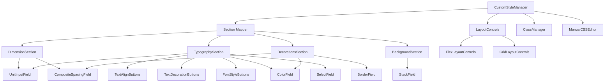
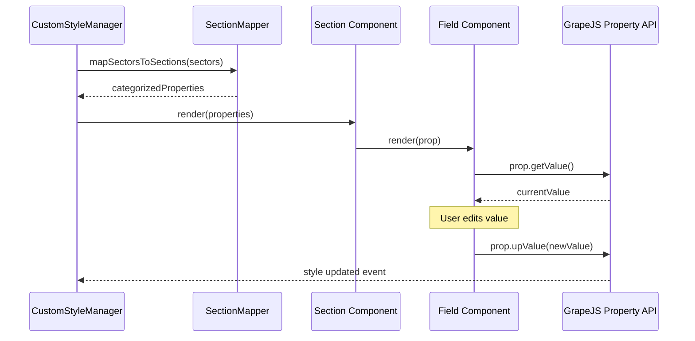
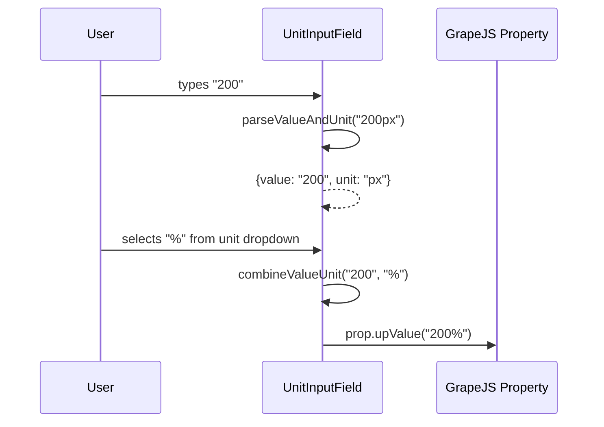

# Design Document: Print Editor Style Manager - GrapeJS Layout

## Overview

Redesain komponen `CustomStyleManager.jsx` agar mengikuti layout default GrapeJS Style Manager, dengan pengelompokan properti CSS ke dalam section yang terstruktur (Dimension, Typography, Decorations/Background) alih-alih generic sectors. Komponen UI tetap menggunakan shadcn-style components (ButtonGroup, InputGroup, Select, Accordion) untuk konsistensi visual dengan aplikasi.

Perubahan utama meliputi: reorganisasi section berdasarkan kategori CSS, penambahan unit selector pada field dimensi, penggunaan icon button groups untuk text-align/decoration/font-style, composite fields untuk margin/padding, dan border controls yang terintegrasi dalam satu baris.

## Architecture



## Sequence Diagrams

### Property Rendering Flow



### Unit Input Field Interaction



## Components and Interfaces

### Component 1: SectionMapper (utility)

**Purpose**: Mengkategorikan GrapeJS properties ke dalam section yang sesuai berdasarkan property ID/name.

```javascript
// Mapping configuration
const SECTION_MAP = {
  dimension: [
    "width",
    "height",
    "max-width",
    "min-width",
    "max-height",
    "min-height",
    "margin",
    "margin-top",
    "margin-right",
    "margin-bottom",
    "margin-left",
    "padding",
    "padding-top",
    "padding-right",
    "padding-bottom",
    "padding-left",
  ],
  typography: [
    "font-family",
    "font-size",
    "font-weight",
    "font-style",
    "letter-spacing",
    "line-height",
    "color",
    "text-align",
    "text-decoration",
    "text-shadow",
    "vertical-align",
  ],
  decorations: [
    "background-color",
    "opacity",
    "border-collapse",
    "border-radius",
    "border-top-left-radius",
    "border-top-right-radius",
    "border-bottom-left-radius",
    "border-bottom-right-radius",
    "border",
    "border-width",
    "border-style",
    "border-color",
    "box-shadow",
  ],
  background: [
    "background-image",
    "background-repeat",
    "background-position",
    "background-size",
    "background-attachment",
  ],
};

/**
 * @param {Array} sectors - GrapeJS sectors array
 * @returns {{ dimension: Property[], typography: Property[], decorations: Property[], background: Property[] }}
 */
function mapSectorsToSections(sectors) {
  /* ... */
}
```

**Responsibilities**:

- Flatten semua properties dari semua sectors
- Kategorikan berdasarkan property ID ke section yang tepat
- Handle properties yang tidak termasuk kategori manapun (masuk ke "Advanced")

### Component 2: UnitInputField

**Purpose**: Input field dengan unit selector dropdown untuk properti dimensi (width, height, margin, padding, font-size, dll).

```javascript
/**
 * @param {Object} props
 * @param {GrapeJSProperty} props.prop - GrapeJS style property
 * @param {string[]} [props.units] - Available units, default: ['px', '%', 'em', 'rem', 'vw', 'vh', 'auto']
 * @param {string} [props.placeholder] - Input placeholder
 */
function UnitInputField({ prop, units, placeholder }) {
  /* ... */
}
```

**Responsibilities**:

- Parse value dan unit dari property value (e.g., "200px" → {value: "200", unit: "px"})
- Render InputGroup dengan numeric input + unit Select dropdown
- Combine value + unit saat user mengubah salah satu
- Handle "auto" sebagai special case (disable numeric input)

### Component 3: CompositeSpacingField

**Purpose**: Render 4 field inline (Top, Right, Bottom, Left) untuk margin/padding/border-radius.

```javascript
/**
 * @param {Object} props
 * @param {GrapeJSProperty} props.prop - Composite GrapeJS property
 * @param {string[]} [props.labels] - Labels for each field, default: ['T', 'R', 'B', 'L']
 */
function CompositeSpacingField({ prop, labels }) {
  /* ... */
}
```

**Responsibilities**:

- Render 4 UnitInputField dalam satu baris horizontal
- Setiap field memiliki label kecil (T, R, B, L)
- Menggunakan sub-properties dari composite property GrapeJS

### Component 4: TextAlignButtons

**Purpose**: ButtonGroup dengan icon buttons untuk text-align (left, center, right, justify).

```javascript
/**
 * @param {Object} props
 * @param {GrapeJSProperty} props.prop - text-align property
 */
function TextAlignButtons({ prop }) {
  /* ... */
}
```

**Responsibilities**:

- Render ButtonGroup dengan 4 icon buttons (AlignLeft, AlignCenter, AlignRight, AlignJustify)
- Highlight active button berdasarkan current value
- Call prop.upValue() saat button diklik

### Component 5: TextDecorationButtons

**Purpose**: ButtonGroup dengan icon buttons untuk text-decoration (none, underline, line-through).

```javascript
/**
 * @param {Object} props
 * @param {GrapeJSProperty} props.prop - text-decoration property
 */
function TextDecorationButtons({ prop }) {
  /* ... */
}
```

### Component 6: FontStyleButtons

**Purpose**: ButtonGroup toggle untuk font-style (normal, italic).

```javascript
/**
 * @param {Object} props
 * @param {GrapeJSProperty} props.prop - font-style property
 */
function FontStyleButtons({ prop }) {
  /* ... */
}
```

### Component 7: BorderField

**Purpose**: Render border controls (width + style dropdown + color) dalam satu baris.

```javascript
/**
 * @param {Object} props
 * @param {GrapeJSProperty} props.prop - border composite property
 */
function BorderField({ prop }) {
  /* ... */
}
```

**Responsibilities**:

- Render width input (dengan unit selector), style Select, dan color picker dalam satu baris
- Menggunakan sub-properties dari composite border property

### Component 8: ColorField

**Purpose**: Color picker + hex input yang konsisten.

```javascript
/**
 * @param {Object} props
 * @param {GrapeJSProperty} props.prop - color property
 */
function ColorField({ prop }) {
  /* ... */
}
```

**Responsibilities**:

- Render color swatch (clickable) + hex text input
- Sinkronisasi antara color picker dan hex input
- Menggunakan InputGroup untuk layout

## Data Models

### Section Configuration

```javascript
/**
 * @typedef {Object} SectionConfig
 * @property {string} id - Section identifier
 * @property {string} label - Display label
 * @property {string[]} propertyIds - CSS property IDs in this section
 * @property {boolean} [defaultOpen] - Whether accordion is open by default
 */

/**
 * @typedef {Object} CategorizedSections
 * @property {SectionConfig & { properties: Property[] }} dimension
 * @property {SectionConfig & { properties: Property[] }} typography
 * @property {SectionConfig & { properties: Property[] }} decorations
 * @property {SectionConfig & { properties: Property[] }} background
 * @property {SectionConfig & { properties: Property[] }} [advanced]
 */
```

### Unit Configuration

```javascript
const DIMENSION_UNITS = ["px", "%", "em", "rem", "vw", "vh", "auto"];
const FONT_UNITS = ["px", "em", "rem", "pt", "%"];
const SPACING_UNITS = ["px", "%", "em", "rem"];

/**
 * @typedef {Object} ParsedValue
 * @property {string} numericValue - The numeric part (e.g., "200")
 * @property {string} unit - The unit part (e.g., "px")
 */
```

### Button Group Configuration

```javascript
const TEXT_ALIGN_OPTIONS = [
  { value: "left", icon: AlignLeft, label: "Align Left" },
  { value: "center", icon: AlignCenter, label: "Align Center" },
  { value: "right", icon: AlignRight, label: "Align Right" },
  { value: "justify", icon: AlignJustify, label: "Align Justify" },
];

const TEXT_DECORATION_OPTIONS = [
  { value: "none", icon: Type, label: "None" },
  { value: "underline", icon: Underline, label: "Underline" },
  { value: "line-through", icon: Strikethrough, label: "Line Through" },
];

const FONT_STYLE_OPTIONS = [
  { value: "normal", label: "A", title: "Normal" },
  { value: "italic", label: "I", title: "Italic" },
];
```

## Algorithmic Pseudocode

### Section Mapping Algorithm

```javascript
/**
 * Maps GrapeJS sectors into categorized sections.
 *
 * @param {Sector[]} sectors - GrapeJS sectors
 * @returns {CategorizedSections}
 *
 * Preconditions:
 * - sectors is a valid array of GrapeJS Sector objects
 * - Each sector has getProperties() method
 *
 * Postconditions:
 * - Every property appears in exactly one section
 * - No property is lost during categorization
 * - Section order is: dimension → typography → decorations → background → advanced
 */
function mapSectorsToSections(sectors) {
  const allProperties = sectors.flatMap((sector) =>
    sector.getProperties().filter((p) => !HIDDEN_PROPERTY_IDS.has(p.getId())),
  );

  const sections = {
    dimension: { id: "dimension", label: "Dimension", properties: [] },
    typography: { id: "typography", label: "Typography", properties: [] },
    decorations: { id: "decorations", label: "Decorations", properties: [] },
    background: { id: "background", label: "Background", properties: [] },
    advanced: { id: "advanced", label: "Advanced", properties: [] },
  };

  for (const prop of allProperties) {
    const propId = prop.getId();
    let placed = false;

    for (const [sectionKey, propertyIds] of Object.entries(SECTION_MAP)) {
      if (propertyIds.includes(propId)) {
        sections[sectionKey].properties.push(prop);
        placed = true;
        break;
      }
    }

    if (!placed) {
      sections.advanced.properties.push(prop);
    }
  }

  return sections;
}
```

### Value-Unit Parsing Algorithm

```javascript
/**
 * Parses a CSS value string into numeric value and unit.
 *
 * @param {string} rawValue - CSS value like "200px", "50%", "auto"
 * @returns {ParsedValue}
 *
 * Preconditions:
 * - rawValue is a string (may be empty)
 *
 * Postconditions:
 * - If rawValue is "auto", returns { numericValue: "", unit: "auto" }
 * - If rawValue contains a number + unit, splits correctly
 * - If rawValue is purely numeric, defaults unit to "px"
 * - numericValue contains only digits and optional decimal point
 */
function parseValueAndUnit(rawValue) {
  if (!rawValue || rawValue === "auto") {
    return { numericValue: "", unit: rawValue === "auto" ? "auto" : "px" };
  }

  const match = String(rawValue).match(
    /^(-?\d*\.?\d+)\s*(px|%|em|rem|vw|vh|pt|cm|mm|in)?$/,
  );

  if (match) {
    return {
      numericValue: match[1],
      unit: match[2] || "px",
    };
  }

  // Fallback: treat entire value as-is
  return { numericValue: rawValue, unit: "" };
}

/**
 * Combines numeric value and unit into CSS value string.
 *
 * @param {string} numericValue
 * @param {string} unit
 * @returns {string}
 *
 * Preconditions:
 * - unit is one of the valid CSS units or "auto"
 *
 * Postconditions:
 * - If unit is "auto", returns "auto" regardless of numericValue
 * - If numericValue is empty, returns empty string
 * - Otherwise returns concatenation of numericValue + unit
 */
function combineValueUnit(numericValue, unit) {
  if (unit === "auto") return "auto";
  if (!numericValue && numericValue !== "0") return "";
  return `${numericValue}${unit}`;
}
```

### Property Field Renderer Selection

```javascript
/**
 * Determines which field component to render for a given property.
 *
 * @param {GrapeJSProperty} prop
 * @param {string} sectionId - Which section this property belongs to
 * @returns {React.ComponentType}
 *
 * Preconditions:
 * - prop is a valid GrapeJS property with getType() and getId()
 *
 * Postconditions:
 * - Returns the most appropriate field component
 * - Never returns null (falls back to default Input)
 */
function resolveFieldComponent(prop, sectionId) {
  const propId = prop.getId();
  const propType = prop.getType();

  // Special cases by property ID
  if (propId === "text-align") return TextAlignButtons;
  if (propId === "text-decoration") return TextDecorationButtons;
  if (propId === "font-style") return FontStyleButtons;

  // Composite spacing (margin, padding, border-radius)
  if (propType === "composite" && isSpacingProperty(propId)) {
    return CompositeSpacingField;
  }

  // Border composite
  if (propType === "composite" && propId.startsWith("border")) {
    return BorderField;
  }

  // Color properties
  if (propType === "color") return ColorField;

  // Dimension properties with units
  if (sectionId === "dimension" || isDimensionProperty(propId)) {
    return UnitInputField;
  }

  // Font-size, letter-spacing, line-height with units
  if (["font-size", "letter-spacing", "line-height"].includes(propId)) {
    return UnitInputField;
  }

  // Select/radio properties
  if (propType === "select" || propType === "radio") return SelectField;

  // Stack properties (background layers, shadows)
  if (propType === "stack") return StackField;

  // Default: text input
  return DefaultInputField;
}
```

## Key Functions with Formal Specifications

### Function: parseValueAndUnit()

```javascript
function parseValueAndUnit(rawValue: string): ParsedValue
```

**Preconditions:**

- `rawValue` is a string (may be empty or null)

**Postconditions:**

- Returns object with `numericValue` (string) and `unit` (string)
- If input is "auto", unit is "auto" and numericValue is ""
- If input matches pattern `number + unit`, splits correctly
- If input is purely numeric, unit defaults to "px"

**Loop Invariants:** N/A

### Function: combineValueUnit()

```javascript
function combineValueUnit(numericValue: string, unit: string): string
```

**Preconditions:**

- `unit` is a valid CSS unit string or "auto"
- `numericValue` is a string (may be empty)

**Postconditions:**

- If unit is "auto", returns "auto"
- If numericValue is empty/falsy (except "0"), returns ""
- Otherwise returns `numericValue + unit` concatenation

**Loop Invariants:** N/A

### Function: mapSectorsToSections()

```javascript
function mapSectorsToSections(sectors: Sector[]): CategorizedSections
```

**Preconditions:**

- `sectors` is a valid array (may be empty)
- Each sector has `getProperties()` method returning Property[]

**Postconditions:**

- Every non-hidden property appears in exactly one section
- Total properties across all sections equals total non-hidden properties from input
- Section keys are always present (may have empty properties array)

**Loop Invariants:**

- After processing each property, the sum of all section property counts equals the number of properties processed so far

## Example Usage

```javascript
// UnitInputField usage
<UnitInputField
  prop={widthProperty}
  units={['px', '%', 'em', 'rem', 'vw', 'vh', 'auto']}
  placeholder="auto"
/>

// CompositeSpacingField for margin
<CompositeSpacingField
  prop={marginProperty}
  labels={['T', 'R', 'B', 'L']}
/>

// TextAlignButtons
<TextAlignButtons prop={textAlignProperty} />

// BorderField
<BorderField prop={borderProperty} />

// Full section rendering
<Accordion type="multiple" defaultValue={['dimension', 'typography']}>
  {Object.entries(categorizedSections)
    .filter(([, section]) => section.properties.length > 0)
    .map(([key, section]) => (
      <AccordionItem key={key} value={key}>
        <AccordionTrigger>{section.label}</AccordionTrigger>
        <AccordionContent>
          {section.properties.map(prop => {
            const FieldComponent = resolveFieldComponent(prop, key);
            return <FieldComponent key={prop.getId()} prop={prop} />;
          })}
        </AccordionContent>
      </AccordionItem>
    ))
  }
</Accordion>
```

## Error Handling

### Error Scenario 1: Property tanpa value

**Condition**: GrapeJS property returns null/undefined dari getValue()
**Response**: Field menampilkan placeholder (default value) dan tidak crash
**Recovery**: Gunakan `prop.getDefaultValue()` sebagai fallback

### Error Scenario 2: Invalid unit dalam value

**Condition**: Property value mengandung unit yang tidak dikenali (e.g., "200xyz")
**Response**: parseValueAndUnit mengembalikan raw value tanpa unit split
**Recovery**: Tampilkan value as-is di input, unit selector kosong

### Error Scenario 3: Property type tidak dikenali

**Condition**: GrapeJS property memiliki type yang tidak ada di resolveFieldComponent
**Response**: Render DefaultInputField (plain text input)
**Recovery**: Fallback component tetap fungsional dengan getValue/upValue

### Error Scenario 4: Composite property tanpa sub-properties

**Condition**: Composite property (margin/padding) tidak memiliki sub-properties
**Response**: Render single UnitInputField sebagai fallback
**Recovery**: Gunakan shorthand value langsung

## Testing Strategy

### Unit Testing Approach

- Test parseValueAndUnit dengan berbagai format CSS value
- Test combineValueUnit dengan berbagai kombinasi value + unit
- Test mapSectorsToSections dengan mock sectors
- Test resolveFieldComponent returns correct component type

### Property-Based Testing Approach

**Property Test Library**: fast-check (sudah tersedia di project)

- Round-trip property: parseValueAndUnit → combineValueUnit harus menghasilkan value yang equivalent
- Section mapping completeness: semua properties harus masuk ke tepat satu section
- No property loss: total properties in = total properties out

### Integration Testing Approach

- Render CustomStyleManager dengan mock GrapeJS editor
- Verify section accordion renders correctly
- Verify unit changes propagate ke GrapeJS property

## Performance Considerations

- Memoize section mapping dengan useMemo (sectors jarang berubah)
- Avoid re-render seluruh tree saat satu property berubah
- Gunakan React.memo pada field components yang stateless
- Debounce input changes untuk numeric fields (prevent excessive upValue calls)

## Security Considerations

- Sanitize CSS values sebelum display (prevent XSS via style injection)
- Validate unit values against whitelist sebelum combine
- Tidak ada user input yang langsung di-render sebagai HTML

## Dependencies

- `@grapesjs/react` - useEditor hook dan property API
- `lucide-react` - Icons (AlignLeft, AlignCenter, AlignRight, AlignJustify, Underline, Strikethrough, Type, Bold, Italic)
- `@/Components/ui/button-group` - ButtonGroup, ButtonGroupText
- `@/Components/ui/input-group` - InputGroup, InputGroupAddon, InputGroupInput
- `@/Components/ui/button` - Button
- `@/Components/ui/input` - Input, InputWrapper
- `@/Components/ui/accordion` - Accordion, AccordionItem, AccordionTrigger, AccordionContent
- `@/Components/Select` - Custom Select component
- `class-variance-authority` - Styling variants
- `@/lib/utils` - cn() utility

## Correctness Properties

_A property is a characteristic or behavior that should hold true across all valid executions of a system—essentially, a formal statement about what the system should do. Properties serve as the bridge between human-readable specifications and machine-verifiable correctness guarantees._

### Property 1: Value-Unit Round Trip

_For any_ valid CSS dimension value consisting of a numeric part (integer or decimal, positive or negative) and a recognized unit (px, %, em, rem, vw, vh, pt, cm, mm, in), parsing with `parseValueAndUnit` then combining with `combineValueUnit` should produce an equivalent CSS value string.

**Validates: Requirements 11.2, 11.7, 2.3, 2.4, 2.5**

### Property 2: Section Mapping Completeness

_For any_ set of GrapeJS properties (excluding hidden ones), mapping them through `mapSectorsToSections` should result in every property appearing in exactly one section, with the total count of properties across all sections equal to the input count.

**Validates: Requirements 1.1, 1.6**

### Property 3: Unit Selector Consistency

_For any_ UnitInputField with a valid numeric value and any unit from the supported set, changing only the unit should produce a new CSS value with the same numeric portion and the new unit.

**Validates: Requirements 2.4, 2.5**

### Property 4: Button Group State Reflects Property Value

_For any_ text-align property value from the valid set (left, center, right, justify), the TextAlignButtons component should have exactly one button in active/pressed state matching that value.

**Validates: Requirements 3.2, 3.4**
