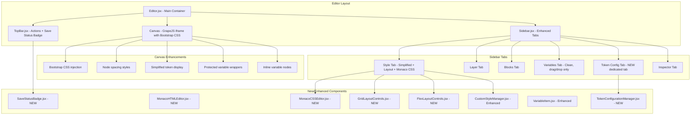
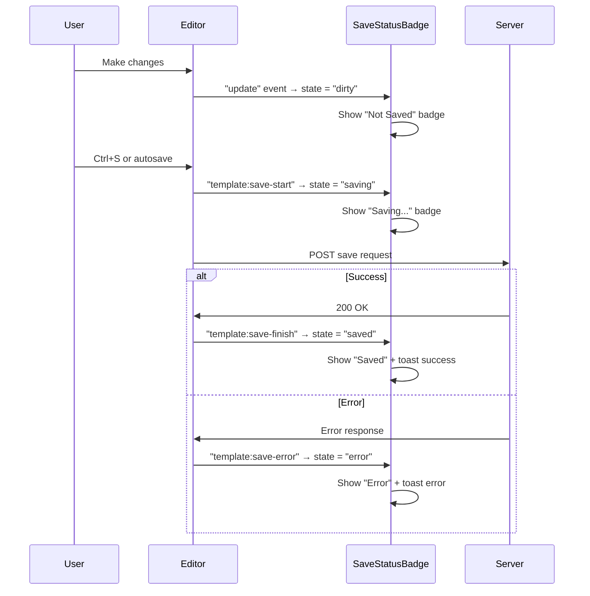
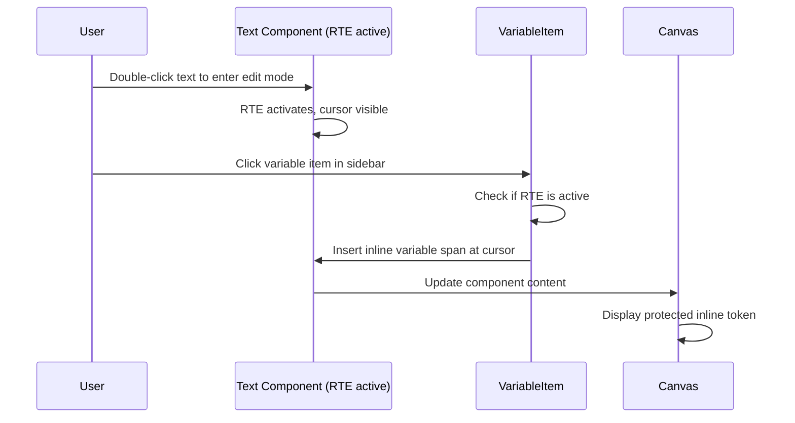

# Design Document

## Overview

### Purpose

This design document outlines the technical architecture for a set of UI/UX refinements to the Print Template Editor (GrapeJS-based) in the Laravel + Inertia React application. These refinements build upon the already-implemented `print-template-editor-enhancement` spec and focus on improving usability, canvas readability, style management, and the overall editing experience.

### Goals

1. **Cleaner Sidebar Organization**: Separate Token Configuration into its own dedicated tab, keeping the Variables tab focused on drag & drop
2. **Consistent Canvas Styling**: Add scoped Bootstrap CSS for canvas and preview to provide familiar print-document styling
3. **Accurate Preview**: Fix preview dimensions to match paper size settings from the template configuration
4. **Better Code Editing**: Replace plain textarea with Monaco Editor for Static HTML and manual CSS editing
5. **Simplified Style Management**: Remove irrelevant style properties, improve UI, add grid/flex layout controls
6. **Readable Canvas Tokens**: Display simplified, human-readable token format instead of raw Handlebar syntax
7. **Improved Editing Safety**: Wrap variable values in protected wrappers, add canvas node spacing
8. **Save Status Visibility**: Provide clear save status indicators and alerts
9. **Inline Variable Insertion**: Allow inserting variables directly into text components at cursor position
10. **Better Variable Item UX**: Separate insert action from collapsible trigger for nested variables

### Scope

**In Scope:**

- Sidebar tab restructuring (Token Configuration tab)
- Bootstrap CSS integration for canvas/preview (scoped)
- Preview modal dimension fixes
- Monaco Editor integration for Static HTML and CSS editing
- Style tab simplification and UI improvements
- Grid/Flex layout property controls
- Token display formatting in canvas
- Canvas node spacing (editor-only)
- Variable value component wrapper
- Save status badge and alerts
- Inline variable insertion in text components
- Variable item action/collapsible separation

**Out of Scope:**

- Backend API changes (no new endpoints needed)
- Database schema changes
- PDF generation modifications
- New GrapeJS component types (beyond wrapper adjustments)
- Mobile editor changes

### Key Design Decisions

1. **Monaco Editor via `@monaco-editor/react`**: Use the well-maintained React wrapper for Monaco Editor rather than building a custom code editor. This provides syntax highlighting, autocomplete, and error indicators out of the box.
2. **Scoped Bootstrap via iframe injection**: Load Bootstrap CSS only inside the GrapeJS iframe (canvas) and preview modal iframe, never in the main app frame, to avoid Tailwind conflicts.
3. **Editor-only spacing via GrapeJS canvas styles**: Apply node spacing through GrapeJS canvas frame styles that are excluded from `toHTML()` output.
4. **Token display via GrapeJS component model overrides**: Override how variable components render their content in the canvas view while preserving correct Handlebar output in `toHTML()`.
5. **Save status via editor events**: Leverage existing GrapeJS editor events (`template:save-start`, `template:save-finish`, `template:save-error`, `update`) to track save state without additional backend changes.
6. **Protected inline variable nodes**: Use GrapeJS `contenteditable=false` spans within text components for inline variables, similar to mention/tag patterns in rich text editors.

## Architecture

### System Architecture



### Component Architecture

```
PrintTemplate/
├── Editor.jsx (Enhanced: Bootstrap injection, node spacing, save status events)
├── Components/
│   ├── TopBar.jsx (Enhanced: SaveStatusBadge integration)
│   ├── SaveStatusBadge.jsx (NEW)
│   ├── Sidebar.jsx (Enhanced: new Token Config tab, conditional Style tab)
│   ├── TokenConfigurationManager.jsx (NEW: extracted from VariableManager)
│   ├── VariableManager.jsx (Simplified: only variable listing)
│   ├── VariableItem.jsx (Enhanced: separated action/collapsible, inline insert)
│   ├── CustomStyleManager.jsx (Enhanced: filtering, layout sections)
│   ├── StylePropertyField.jsx (Enhanced: better UI controls)
│   ├── GridLayoutControls.jsx (NEW)
│   ├── FlexLayoutControls.jsx (NEW)
│   ├── MonacoHTMLEditor.jsx (NEW: replaces textarea in StaticHTMLComponent)
│   ├── MonacoCSSEditor.jsx (NEW: manual CSS in Style tab)
│   ├── StaticHTMLComponent.jsx (Enhanced: uses MonacoHTMLEditor)
│   ├── PreviewModal.jsx (Enhanced: paper size dimensions)
│   └── Inspector/
│       ├── RelationsInspector.jsx
│       └── StaticHTMLInspector.jsx
└── MobileEditor.jsx
```

### Technology Additions

- **`@monaco-editor/react`** (new dependency): React wrapper for Monaco Editor, provides HTML and CSS editing with syntax highlighting, autocomplete, and inline error indicators.
- **Bootstrap CSS** (CDN/bundled): Loaded only inside GrapeJS canvas iframe and preview modal, scoped to avoid conflicts with Tailwind CSS in the main application.

## Components and Interfaces

### 1. TokenConfigurationManager (NEW)

**Purpose**: Dedicated component for the new Token Configuration tab. Extracts all token configuration logic from VariableManager into a standalone tab.

**Location**: `Components/TokenConfigurationManager.jsx`

**Features**:

- Displays selected component token details and editing form
- Unified "Token di Canvas" accordion listing both variable tokens and relation table tokens
- Clicking a token item selects the corresponding canvas node
- Uses nested select dropdowns (populated from available variables) for Label Key, Handlebar Token, and Relation Path fields
- Includes column management controls for relation table tokens (show/hide, ordering)

**Props**: None (uses `useEditor()` hook and `usePage().props`)

**State**:

```typescript
interface TokenConfigState {
  selectedConfig: VariableTokenConfig | null;
  allTokenConfigs: VariableTokenConfig[];
  relationConfigs: RelationTokenConfig[];
  formState: { labelKey: string; token: string };
}
```

**Key Behavior**:

- Listens to `component:selected`, `component:deselected`, `component:update`, `component:add`, `component:remove` events
- When a token item in the list is clicked, calls `editor.select(config.component)` to select and scroll to the canvas node
- Nested select for Label Key/Token fields renders a searchable dropdown with all available variable paths from `dataTableColumns`

### 2. SaveStatusBadge (NEW)

**Purpose**: Visual badge showing current save state (not saved / saving / saved).

**Location**: `Components/SaveStatusBadge.jsx`

**Props**: None (uses `useEditor()` hook)

**States**:

- `idle` → Badge hidden or shows "Saved" with relative time
- `dirty` → "Not Saved" badge (amber/warning color)
- `saving` → "Saving..." badge with spinner (blue/info color)
- `saved` → "Saved" badge with relative time (green/success color)
- `error` → "Save Error" badge (red/destructive color)

**Implementation**:

```typescript
// Listens to editor events:
// - "update" → mark as dirty
// - "template:save-start" → mark as saving
// - "template:save-finish" → mark as saved, record timestamp
// - "template:save-error" → mark as error, show toast alert
// - "storage:end:store" → mark as saved (autosave)
```

**Positioning**: Rendered inside TopBar, after the command buttons.

### 3. MonacoHTMLEditor (NEW)

**Purpose**: Monaco Editor wrapper configured for HTML editing, replacing the textarea in StaticHTMLComponent.

**Location**: `Components/MonacoHTMLEditor.jsx`

**Props**:

```typescript
interface MonacoHTMLEditorProps {
  value: string;
  onChange: (value: string) => void;
  height?: string; // default "300px"
  readOnly?: boolean;
}
```

**Features**:

- HTML language mode with syntax highlighting
- Line numbers and code folding
- Basic HTML tag/attribute autocomplete
- Dark/light theme matching app theme
- Minimap disabled for compact view

### 4. MonacoCSSEditor (NEW)

**Purpose**: Monaco Editor wrapper for manual CSS editing in the Style tab.

**Location**: `Components/MonacoCSSEditor.jsx`

**Props**:

```typescript
interface MonacoCSSEditorProps {
  value: string;
  onChange: (value: string) => void;
  onValidationChange?: (isValid: boolean, errors: MarkerData[]) => void;
  height?: string; // default "200px"
}
```

**Features**:

- CSS language mode with syntax highlighting
- CSS property/value autocomplete
- Inline error indicators for invalid syntax (via Monaco markers)
- Applies valid CSS to selected component on change (debounced)
- Preserves CSS when switching between components

**Behavior**:

- On component selection change: reads the component's inline styles and populates the editor
- On valid CSS change (debounced 500ms): parses CSS properties and applies them via `component.setStyle()`
- On syntax error: displays red squiggly underline via Monaco diagnostics

### 5. GridLayoutControls (NEW)

**Purpose**: Simplified grid settings panel shown when a grid component is selected.

**Location**: `Components/GridLayoutControls.jsx`

**Props**:

```typescript
interface GridLayoutControlsProps {
  component: GrapeJSComponent; // selected grid component
}
```

**Features**:

- Add column button (appends a new column to `grid-template-columns`)
- Remove column button per column
- Width/size input per column (e.g., `1fr`, `max-content`, `200px`)
- Layout properties: `justify-content`, `align-content`, `justify-items`, `align-items`, `column-gap`, `row-gap`
- Updates component CSS in real-time

### 6. FlexLayoutControls (NEW)

**Purpose**: Flex-specific layout properties panel shown when a flex component is selected.

**Location**: `Components/FlexLayoutControls.jsx`

**Props**:

```typescript
interface FlexLayoutControlsProps {
  component: GrapeJSComponent; // selected flex component
}
```

**Features**:

- Layout properties: `justify-content`, `align-content`, `align-items`, `gap` (row-gap, column-gap)
- Select dropdowns for alignment values (`flex-start`, `center`, `flex-end`, `space-between`, `space-around`, `stretch`)
- Number input with unit selector for gap values

### 7. Enhanced Sidebar (Sidebar.jsx)

**Changes**:

- Add new "Token" tab with `KeyRound` icon (or similar)
- Conditionally hide Style tab when a `staticHTML` component is selected
- If Style tab is active and staticHTML is selected, auto-switch to another tab
- Tab order: Style, Layer, Blocks, Variables, Token, Inspector

**Conditional Style Tab Logic**:

```typescript
const selectedComponent = useSelectedComponent(); // custom hook
const isStaticHTML = selectedComponent?.getType?.() === "staticHTML";

// If Style tab active and staticHTML selected → switch to "variables" tab
useEffect(() => {
  if (isStaticHTML && activeTab === "style") {
    setActiveTab("variables");
  }
}, [isStaticHTML]);
```

### 8. Enhanced CustomStyleManager

**Changes**:

- Filter out sectors/properties: Font Family, Text Shadow, Box Shadow, Transition, Transform
- Add dedicated "Layout" section at the top when grid/flex component is selected
- Render `GridLayoutControls` or `FlexLayoutControls` based on component display type
- Render `MonacoCSSEditor` at the bottom of the Style tab
- Improve property labels and grouping
- Add visual indicator (dot/highlight) for properties with non-default values

**Filtering Logic**:

```typescript
const HIDDEN_PROPERTIES = [
  "font-family",
  "text-shadow",
  "box-shadow",
  "transition",
  "transform",
];

const filteredSectors = sectors
  .map((sector) => ({
    ...sector,
    properties: sector
      .getProperties()
      .filter((prop) => !HIDDEN_PROPERTIES.includes(prop.getId())),
  }))
  .filter((sector) => sector.properties.length > 0);
```

### 9. Enhanced VariableManager (Simplified)

**Changes**:

- Remove "Konfigurasi Token" section entirely
- Remove "Token di Canvas" listing
- Remove "Token Tabel Relasi" listing
- Keep only: heading + variable list (draggable items)
- Result: clean, focused variable panel for drag & drop and click-to-insert

### 10. Enhanced VariableItem

**Changes**:

- **Separate action and collapsible trigger** (Requirement 16):
  - For items with nested children: render two distinct interactive areas
  - Left area: chevron icon button that toggles collapse (does NOT insert)
  - Right area: variable name/label that triggers insert/drag action
- **Inline insertion** (Requirement 15):
  - When a text component is in active editing mode (RTE active), clicking a variable item inserts an inline protected token at cursor position
  - Uses `editor.RichTextEditor` API to insert a non-editable span

**Layout for nested items**:

```
┌─────────────────────────────────────┐
│ [▶] │ Variable Name          [drag] │
│ collapse │    insert action area     │
└─────────────────────────────────────┘
```

### 11. Enhanced PreviewModal

**Changes**:

- Set preview container width from `printTemplate.width` + `printTemplate.unit`
- Set preview container height from `printTemplate.height` + `printTemplate.unit`
- Apply CSS `transform: scale()` to fit within viewport without horizontal scrolling
- For `is_letter_head` templates: use A4 width (210mm), dynamic height (fit content)
- Load Bootstrap CSS inside the preview container

**Dimension Calculation**:

```typescript
const unitCode = printTemplate?.unit?.code || "mm";
const pageWidth = printTemplate?.width || 210;
const pageHeight = printTemplate?.height || 297;
const isLetterHead = printTemplate?.is_letter_head;

const previewStyle = useMemo(() => {
  const width = isLetterHead ? 210 : pageWidth;
  const height = isLetterHead ? "auto" : pageHeight;

  return {
    width: `${width}${unitCode}`,
    minHeight: isLetterHead ? "auto" : `${height}${unitCode}`,
  };
}, [pageWidth, pageHeight, unitCode, isLetterHead]);

// Scale to fit viewport
const scale = useMemo(() => {
  const viewportWidth = window.innerWidth * 0.9;
  const mmToPx = 3.7795; // approximate
  const contentWidthPx = (isLetterHead ? 210 : pageWidth) * mmToPx;
  return Math.min(1, viewportWidth / contentWidthPx);
}, [pageWidth, isLetterHead]);
```

### 12. Enhanced StaticHTMLComponent

**Changes**:

- Replace `<textarea>` with `<MonacoHTMLEditor>` component
- Maintain same save/cancel workflow
- Keep sanitization preview panel alongside Monaco editor

### 13. Canvas Enhancements (Editor.jsx)

#### Bootstrap CSS Injection

```typescript
// In onEditor callback, after editor loads:
editor.on("load", () => {
  const frame = editor.Canvas.getFrameEl();
  const doc = frame.contentDocument;

  // Inject Bootstrap CSS
  const bootstrapLink = doc.createElement("link");
  bootstrapLink.rel = "stylesheet";
  bootstrapLink.href =
    "https://cdn.jsdelivr.net/npm/bootstrap@5.3.3/dist/css/bootstrap.min.css";
  bootstrapLink.id = "bootstrap-canvas-css";
  doc.head.appendChild(bootstrapLink);
});
```

#### Node Spacing (Editor-only)

```typescript
// Inject editor-only spacing styles into canvas iframe
const editorStyles = `
  [data-gjs-type]:not([data-gjs-type=""]) {
    outline: 1px dashed transparent;
    padding: 2px;
    margin: 1px 0;
    min-height: 8px;
    transition: outline-color 0.15s;
  }
  [data-gjs-type]:hover {
    outline-color: rgba(59, 130, 246, 0.3);
  }
  .gjs-selected {
    outline-color: rgba(59, 130, 246, 0.6) !important;
  }
`;
```

These styles exist only in the canvas iframe and are never included in `toHTML()` or `getCss()` output.

#### Token Display Simplification

Override the canvas rendering of variable components to show simplified tokens:

- Strip `{{label "..."}}` → show translated label text
- Strip `{{doc.xxx}}` → show `{{xxx}}` (remove "doc." prefix)
- Strip `{{doc.customer.name}}` → show `{{customer.name}}`

**Implementation**: Modify the `subGrid` component model's `init()` or use a `component:mount` event to update the visual content of label and token components in the canvas view, while `toHTML()` still outputs the correct Handlebar syntax.

```typescript
// In variableDropListener or component type definition:
editor.DomComponents.addType("subGrid", {
  model: {
    defaults: {
      /* ... existing ... */
    },
    init() {
      this.on("change:components", this.updateCanvasDisplay);
      this.listenTo(this, "add", this.updateCanvasDisplay);
    },
    updateCanvasDisplay() {
      // Update label component visual content
      const labelComp = this.find("[data-label-key]")[0];
      if (labelComp) {
        const labelKey = labelComp.getAttributes()["data-label-key"];
        // Show translated label or formatted key
        const displayText =
          t(`fields.${labelKey}`) || labelKey.split(".").pop();
        labelComp.view?.el && (labelComp.view.el.textContent = displayText);
      }
      // Update token component visual content
      const tokenComp = this.find("[data-token]")[0];
      if (tokenComp) {
        const token = tokenComp.getAttributes()["data-token"];
        // Strip "doc." prefix for display
        const simplified = token.replace(/\{\{(doc\.)/g, "{{");
        tokenComp.view?.el &&
          (tokenComp.view.el.textContent = `: ${simplified}`);
      }
    },
    toHTML() {
      /* ... existing correct Handlebar output ... */
    },
  },
});
```

#### Variable Value Wrapper

Wrap the value portion of variable nodes in a non-editable component:

```typescript
// When creating variable components, wrap the token in a span
{
  type: "text",
  tagName: "p",
  editable: false, // prevent direct editing of value
  components: [
    { type: "textnode", content: ": " },
    {
      tagName: "span",
      type: "variable-value-wrapper",
      editable: false,
      selectable: true,
      attributes: {
        "data-token": token,
        "contenteditable": "false",
      },
      content: simplifiedDisplayValue,
    }
  ]
}
```

#### Inline Variable Insertion

When a text component is in RTE (Rich Text Editor) mode and user clicks a variable item:

```typescript
const handleInlineInsert = (variable, fullKey) => {
  const rte = editor.RichTextEditor;
  const activeRte = rte?.getToolbarEl()?.parentElement; // check if RTE is active

  if (!activeRte) return false; // not in text editing mode

  const token = getFormattedHandlebarToken(variable, fullKey);
  const displayText = fullKey.replace(/^doc\./, "");

  // Insert a non-editable span at cursor position
  const inlineHTML = `<span data-variable-inline="${fullKey}" data-token="${token}" contenteditable="false" class="inline-variable-token">${displayText}</span>`;

  document.execCommand("insertHTML", false, inlineHTML);
  return true;
};
```

## Data Models

### No Database Changes Required

This refinement spec does not require any database schema changes. All modifications are frontend-only, working with the existing `print_templates` table structure and the data already provided by the backend (`dataTableColumns`, `exampleData`, `preferences`).

### New Frontend State Models

#### SaveStatus State

```typescript
type SaveState = "idle" | "dirty" | "saving" | "saved" | "error";

interface SaveStatusState {
  state: SaveState;
  lastSavedAt: Date | null;
  errorMessage: string | null;
}
```

#### Token Configuration State (moved from VariableManager)

```typescript
interface VariableTokenConfig {
  component: GrapeJSComponent;
  componentId: string;
  variablePath: string;
  variableType: string;
  token: string;
  labelKey: string;
  labelComponent: GrapeJSComponent | null;
  tokenComponent: GrapeJSComponent | null;
  previewValue: string;
}

interface RelationTokenConfig {
  component: GrapeJSComponent;
  componentId: string;
  relationPath: string;
  token: string;
  columns: ColumnDefinition[];
}
```

#### Monaco Editor CSS State

```typescript
interface CSSEditorState {
  value: string; // raw CSS text
  isValid: boolean;
  errors: Array<{ line: number; message: string }>;
  componentId: string | null; // track which component CSS belongs to
}
```

### Data Flow

#### Save Status Flow



#### Inline Variable Insertion Flow



## Correctness Properties

### Property 1: PBT Not Applicable for UI Feature

_For any_ acceptance criterion in this feature, the behavior involves UI rendering, editor interactions, or external library integration that cannot be meaningfully validated through property-based testing. All criteria are verified through example-based unit tests and integration tests instead.

This spec is entirely UI/UX focused — it involves visual editor interactions, component rendering, style management, drag/drop behaviors, and external library integration (Monaco Editor, GrapeJS, Bootstrap CSS). None of these have meaningful universal properties that vary with random input in a way that PBT would catch bugs better than targeted example-based tests.

PBT exclusion categories that apply:

- **UI rendering and layout**: React components, GrapeJS canvas rendering, Monaco Editor integration
- **Side-effect-only operations**: Applying styles, inserting HTML nodes, injecting CSS into iframes
- **External library integration**: GrapeJS editor events, Monaco validation, Bootstrap CDN loading
- **Configuration UI**: Dropdowns, inputs, toggles, tab switching

**Validates: Requirements 1.1, 2.1, 3.1, 4.1, 5.1, 6.1, 7.1, 8.1, 9.1, 10.1**

## Error Handling

### Monaco Editor Errors

**CSS Syntax Errors**: Monaco's built-in CSS language service detects syntax errors and displays them as red squiggly underlines. The `MonacoCSSEditor` component exposes validation state via `onValidationChange` callback. Invalid CSS is NOT applied to the component until errors are resolved.

**HTML Syntax Errors**: Monaco provides basic HTML validation. Combined with the existing sanitization logic, users see both syntax issues and security warnings.

### Bootstrap CSS Loading Failure

If the Bootstrap CDN fails to load (network issue), the canvas still functions normally — components just won't have Bootstrap styling. A console warning is logged but no user-facing error is shown since the editor remains fully functional.

### Save Status Error Handling

- On save error: display toast notification with error message, badge shows "Error" state
- On network timeout: badge shows "Error", toast suggests retrying
- Auto-recovery: after error state, next successful save clears the error

### Component Selection Edge Cases

- If Style tab is active and user selects a staticHTML component → auto-switch to Variables tab
- If Token Config tab is active but no variable component is selected → show instructional message
- If grid/flex controls are shown but user deselects the component → hide layout controls gracefully

## Testing Strategy

### Testing Approach

Since this feature is entirely UI/UX focused (visual editor interactions, component rendering, style management), property-based testing is **not applicable**. The testing strategy focuses on:

1. **Example-based unit tests**: Verify specific component behaviors with concrete scenarios
2. **Integration tests**: Verify component interactions within the editor context
3. **Manual testing**: Visual verification of canvas rendering, Monaco editor behavior, and drag/drop interactions

### Why PBT Does Not Apply

This feature involves:

- UI rendering and layout (React components, GrapeJS canvas)
- Visual editor interactions (drag/drop, click, selection)
- Configuration UI (dropdowns, inputs, toggles)
- Side-effect operations (applying styles, inserting HTML)
- External library integration (Monaco Editor, GrapeJS, Bootstrap)

None of these have meaningful universal properties that vary with random input in a way that PBT would catch bugs better than targeted example-based tests.

### Test Categories

#### Unit Tests (Jest/Vitest)

- `SaveStatusBadge`: verify state transitions (idle → dirty → saving → saved/error)
- `TokenConfigurationManager`: verify token list rendering, form state management
- `GridLayoutControls`: verify column add/remove logic, CSS generation
- `FlexLayoutControls`: verify layout property application
- Token display simplification: verify `doc.` prefix stripping logic
- Variable value wrapper: verify correct HTML output from `toHTML()`
- Preview dimension calculation: verify scale and size computation

#### Integration Tests

- Sidebar tab switching with staticHTML component selected
- Inline variable insertion when RTE is active vs inactive
- Monaco CSS editor applying styles to selected component
- Bootstrap CSS scoping (not leaking to main app)
- Save status badge responding to editor events

#### Manual Testing Checklist

- Canvas node spacing visible in editor, absent in output
- Monaco Editor syntax highlighting for HTML and CSS
- Preview modal dimensions matching paper size
- Token display showing simplified format in canvas
- Variable item click vs collapsible trigger separation
- Grid column add/remove visual feedback
- Save status badge transitions with autosave
