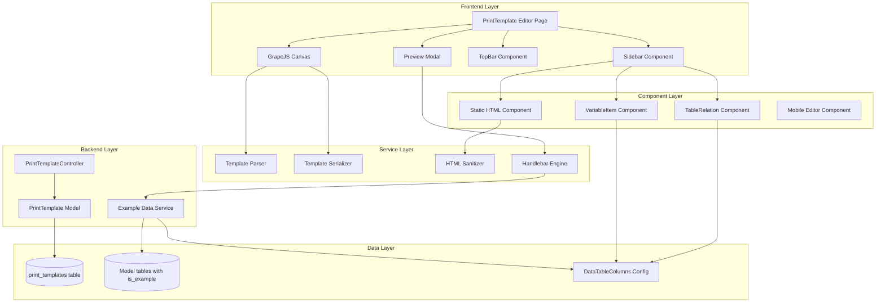
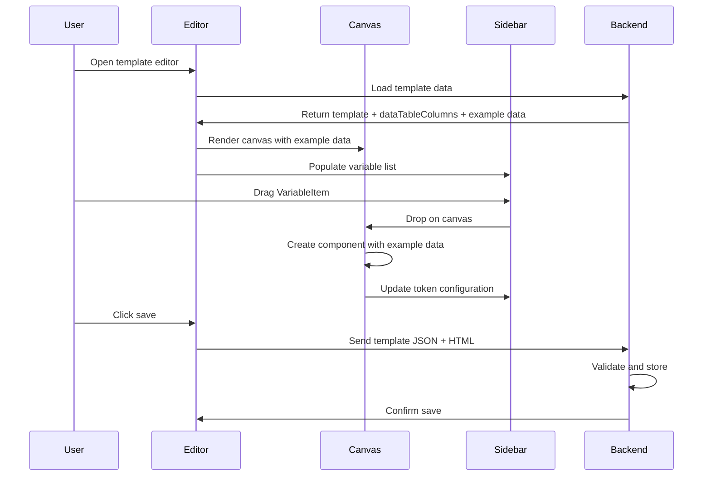
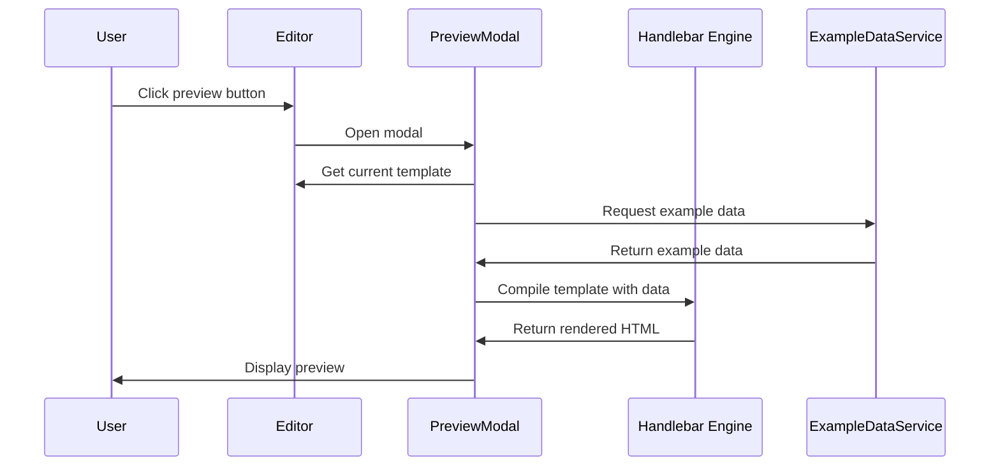
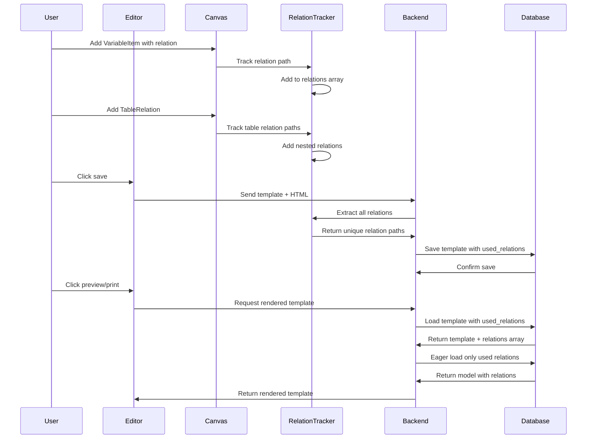

# Design Document

## Overview

### Purpose

This design document outlines the technical architecture for enhancing the PrintTemplate Editor feature in a Laravel + Inertia React application. The enhancement focuses on improving the user experience when creating and editing print templates using GrapeJS, with emphasis on intuitive drag & drop functionality, clean canvas preview using example data, improved Handlebar token structure, and comprehensive mobile support.

### Goals

1. **Enhanced User Experience**: Provide intuitive drag & drop for variables with clean canvas preview showing example data instead of Handlebar tokens
2. **Improved Token Structure**: Implement unified Label_Helper and consistent Handlebar token formatting for better maintainability
3. **Optimized Data Loading**: Track and store relations used in templates for efficient eager loading during preview and print
4. **Accurate Preview**: Display canvas preview that closely matches final print output using example data from database
5. **Mobile Support**: Enable basic editing capabilities on mobile devices with appropriate feature limitations
6. **Security**: Implement robust HTML sanitization for custom static HTML components
7. **Data Infrastructure**: Establish example data system with is_example column markers for realistic preview

### Scope

**In Scope:**

- VariableItem drag & drop enhancement with example data preview
- Unified Label_Helper for field label retrieval
- TableRelation component with proper token generation
- Relation tracking and optimized eager loading
- UI/UX consistency with application design system
- Mobile editor with limited features
- Static HTML component with security sanitization
- Canvas preview accuracy using example data
- Example data infrastructure with database seeders
- Preview modal for template verification
- Template parser and serializer

**Out of Scope:**

- PDF generation engine modifications
- Printer driver integration
- Template versioning system
- Collaborative editing features
- Template marketplace or sharing

### Key Design Decisions

1. **Example Data in Canvas**: Display example data values in canvas instead of Handlebar tokens for cleaner visual appearance, while managing tokens in Sidebar
2. **Unified Label Helper**: Replace separate `infoColumns` and `trans` helpers with single `label` helper for consistent label retrieval
3. **Relation Tracking for Performance**: Automatically extract and store all relation paths used in templates to enable optimized eager loading, preventing N+1 queries and over-loading unnecessary relations
4. **Database-Driven Example Data**: Use `is_example` column marker on tables instead of hardcoded fixtures for realistic preview data
5. **Component-Based Architecture**: Leverage React components with GrapeJS integration for maintainable and testable code
6. **Progressive Enhancement**: Provide full features on desktop, gracefully degrade to essential features on mobile
7. **Security-First HTML**: Implement whitelist-based sanitization for custom HTML components

## Architecture

### System Architecture



```

### Technology Stack

**Frontend:**
- React 19 with Inertia.js v2 for SPA experience
- GrapeJS for visual template editing
- @grapesjs/react for React integration
- Handlebars.js for template rendering
- Tailwind CSS v4 for styling
- Lucide React for icons

**Backend:**
- Laravel 12 with PHP 8.4
- Eloquent ORM for database operations
- Laravel Sanctum for authentication
- Laravel Pint for code formatting

**Testing:**
- PHPUnit 11 for backend tests
- Property-based testing for parser/serializer

### Component Architecture

#### Frontend Components Hierarchy

```

PrintTemplate/
├── Editor.jsx (Main container)
│ ├── TopBar.jsx (Actions: save, undo, redo, preview)
│ ├── Canvas (GrapeJS canvas with example data)
│ └── Sidebar.jsx (Tabs container)
│ ├── CustomStyleManager.jsx
│ ├── CustomLayerManager.jsx
│ ├── CustomBlockManager.jsx
│ ├── VariableManager.jsx (New)
│ └── Inspector/
│ ├── RelationsInspector.jsx
│ └── StaticHTMLInspector.jsx (New)
├── Components/
│ ├── VariableItem.jsx (Enhanced)
│ ├── TableRelation.jsx (Enhanced)
│ ├── StaticHTMLComponent.jsx (New)
│ └── PreviewModal.jsx (New)
└── MobileEditor.jsx (New)

```

```

#### Backend Architecture

```
app/
├── Http/
│   ├── Controllers/
│   │   └── Core/
│   │       └── PrintTemplateController.php (Enhanced)
│   └── Requests/
│       └── Core/
│           └── PrintTemplateRequest.php
├── Models/
│   └── Core/
│       └── PrintTemplate.php (Enhanced)
├── Services/
│   ├── PrintTemplate/
│   │   ├── ExampleDataService.php (New)
│   │   ├── TemplateParserService.php (Enhanced)
│   │   ├── TemplateSerializerService.php (New)
│   │   ├── HTMLSanitizerService.php (New)
│   │   └── RelationTrackerService.php (New)
│   └── Handlebar/
│       └── LabelHelperService.php (New)
└── Traits/
    ├── DataTable.php
    └── HasExampleData.php (New)

database/
└── seeders/
    └── ExampleDataSeeder.php (New)

resources/js/
└── lib/
    ├── initHandlebar.js (Enhanced)
    ├── gjsRelationsTable.js (Enhanced)
    └── htmlSanitizer.js (New)
```

### Data Flow

#### 1. Template Editing Flow



#### 2. Preview Flow



#### 3. Relation Tracking and Optimized Loading Flow



## Components and Interfaces

### Frontend Components

#### 1. VariableItem Component (Enhanced)

**Purpose**: Draggable component representing a data variable with support for nested columns and relations.

**Props:**

```typescript
interface VariableItemProps {
  name: string;
  title?: string;
  titleTrans?: string;
  type: "data" | "preferences" | "relation" | "relations" | "attribute";
  parentType?: "data" | "preferences";
  path?: string;
  columns?: ColumnDefinition[];
  related?: string; // Model class name for relations
  show?: boolean;
  order?: number;
}
```

**Key Features:**

- Displays variable name and translated label
- Shows Handlebar token in tooltip on hover
- Supports drag & drop to canvas
- Collapsible for nested columns (single relations)
- Lazy loads relation columns via API
- Distinguishes between nestedColumns (single) and relationsTable (many)

**Behavior:**

- Simple variables: Direct drag & drop, inserts token on click
- Single relations: Collapsible with nestedColumns structure
- Many relations: Uses relationsTable structure, creates table on drop
- Preferences: Uses `companyDetail` helper syntax

#### 2. TableRelation Component (Enhanced)

**Purpose**: Renders relational data as a table with proper Handlebar iteration and label helpers.

**Props:**

```typescript
interface TableRelationProps {
  relationName: string;
  columns: TableColumnDefinition[];
  dataTableColumns: DataTableColumnsConfig;
}

interface TableColumnDefinition {
  name: string;
  titleTrans?: string;
  type: "data" | "relation" | "attribute";
  show: boolean;
  order: number;
  format?: "currency" | "number" | "date";
  formatOptions?: Record<string, any>;
}
```

**Generated Structure:**

```html
<table class="gjs-relations-table">
  <thead>
    {{#label relationName}}
    <tr>
      <th>#</th>
      <th>{{label "column1"}}</th>
      <th>{{label "column2"}}</th>
    </tr>
    {{/label}}
  </thead>
  <tbody>
    {{#each relationName}}
    <tr>
      <td>{{idx}}</td>
      <td>{{this.column1}}</td>
      <td>{{relation this.column2}}</td>
    </tr>
    {{/each}}
  </tbody>
</table>
```

**Key Features:**

- Uses unified `label` helper for column headers
- Supports `{{#each}}` iteration for rows
- Handles nested relations with `{{relation}}` helper
- Applies formatting from DataTableColumns config
- Supports column reordering via inspector
- Shows/hides columns through inspector panel

#### 3. StaticHTMLComponent (New)

**Purpose**: Allows users to add custom HTML with security sanitization.

**Props:**

```typescript
interface StaticHTMLComponentProps {
  initialHTML?: string;
  onSave: (sanitizedHTML: string, warnings: string[]) => void;
}
```

**Features:**

- Code editor modal for HTML input
- Real-time sanitization preview
- Warning display for removed content
- Visual indicator in canvas for custom HTML blocks

**Sanitization Rules:**

- **Allowed tags**: div, span, p, h1-h6, table, tr, td, th, ul, ol, li, a, img, strong, em, br
- **Allowed attributes**: class, id, style, href, src, alt, title
- **Blocked tags**: script, iframe, object, embed, form, input, button
- **Blocked attributes**: onclick, onerror, onload, on\*, javascript:

#### 4. PreviewModal Component (New)

**Purpose**: Displays rendered template with example data for verification.

**Props:**

```typescript
interface PreviewModalProps {
  template: TemplateData;
  exampleData: Record<string, any>;
  dataTableColumns: DataTableColumnsConfig;
  onClose: () => void;
  onPrint?: () => void;
  onExportPDF?: () => void;
}
```

**Features:**

- Full-screen modal with rendered template
- Uses same rendering engine as final print
- Displays rendering errors and warnings
- Print and PDF export buttons
- Close button to return to editor

#### 5. MobileEditor Component (New)

**Purpose**: Simplified editor interface for mobile devices.

**Features:**

- Touch-optimized interface
- Text editing by tapping components
- Basic style panel (font size, color, alignment)
- Disabled drag & drop
- Disabled structural changes
- Informative messages for desktop-only features

**Responsive Breakpoints:**

- Mobile: < 768px (simplified interface)
- Tablet: 768px - 1024px (full interface with touch optimization)
- Desktop: > 1024px (full interface)

### Backend Services

#### 1. ExampleDataService

**Purpose**: Manages example data retrieval and generation for template preview with optimized relation loading.

**Methods:**

```php
class ExampleDataService
{
    /**
     * Get example data for a specific model
     */
    public function getExampleData(string $modelClass): ?Model;

    /**
     * Get example data with relations loaded from used_relations array
     */
    public function getExampleDataWithRelations(
        string $modelClass,
        array $relations
    ): ?Model;

    /**
     * Get example data for template (uses template's used_relations)
     */
    public function getExampleDataForTemplate(
        PrintTemplate $template
    ): ?Model
    {
        $modelClass = $template->model;
        $relations = $template->getUsedRelations();

        return $this->getExampleDataWithRelations($modelClass, $relations);
    }

    /**
     * Check if example data exists for model
     */
    public function hasExampleData(string $modelClass): bool;

    /**
     * Generate example data for model
     */
    public function generateExampleData(
        string $modelClass,
        int $count = 1
    ): Collection;
}
```

**Implementation Details:**

- Queries models with `where('is_example', true)`
- Eager loads relations based on template's used_relations array
- Returns first example record or null
- Caches results for performance
- Validates relations exist before loading

#### 2. TemplateParserService

**Purpose**: Parses GrapeJS component tree into storable JSON structure and extracts relations.

**Methods:**

```php
class TemplateParserService
{
    public function __construct(
        protected RelationTrackerService $relationTracker
    ) {}

    /**
     * Parse GrapeJS components to JSON
     */
    public function parse(array $components): array;

    /**
     * Extract Handlebar tokens from template
     */
    public function extractTokens(array $components): array;

    /**
     * Validate template structure
     */
    public function validate(array $template): ValidationResult;

    /**
     * Extract required relations from template
     */
    public function extractRelations(array $template): array
    {
        return $this->relationTracker->extractRelations($template);
    }

    /**
     * Parse template and extract relations in one operation
     */
    public function parseWithRelations(array $components): array
    {
        $parsed = $this->parse($components);
        $relations = $this->extractRelations($parsed);

        return [
            'template' => $parsed,
            'used_relations' => $relations,
        ];
    }
}
```

**Parsing Rules:**

- Preserve all component attributes including data-\* attributes
- Maintain component hierarchy and nesting
- Extract and validate Handlebar tokens
- Identify required relations for data loading using RelationTrackerService

#### 3. TemplateSerializerService

**Purpose**: Reconstructs GrapeJS component tree from stored JSON.

**Methods:**

```php
class TemplateSerializerService
{
    /**
     * Serialize JSON to GrapeJS components
     */
    public function serialize(array $template): array;

    /**
     * Format HTML with proper indentation
     */
    public function prettyPrint(string $html): string;

    /**
     * Generate HTML from template
     */
    public function toHTML(array $template): string;

    /**
     * Generate CSS from template
     */
    public function toCSS(array $template): string;
}
```

#### 4. HTMLSanitizerService

**Purpose**: Sanitizes user-provided HTML to prevent XSS and injection attacks.

**Methods:**

```php
class HTMLSanitizerService
{
    /**
     * Sanitize HTML content
     */
    public function sanitize(string $html): SanitizationResult;

    /**
     * Check if HTML is safe
     */
    public function isSafe(string $html): bool;

    /**
     * Get list of removed elements
     */
    public function getRemovedElements(string $html): array;
}

class SanitizationResult
{
    public string $sanitizedHTML;
    public array $warnings;
    public array $removedTags;
    public array $removedAttributes;
}
```

**Implementation:**

- Uses whitelist approach for tags and attributes
- Removes dangerous event handlers (onclick, onerror, etc.)
- Validates URLs in href and src attributes
- Strips javascript: protocol
- Provides detailed warnings for removed content

#### 5. LabelHelperService

**Purpose**: Unified service for retrieving field labels from DataTableColumns configuration.

**Methods:**

```php
class LabelHelperService
{
    /**
     * Get label for field path
     */
    public function getLabel(
        string $fieldPath,
        array $dataTableColumns,
        string $locale = 'en'
    ): string;

    /**
     * Get labels for multiple fields
     */
    public function getLabels(
        array $fieldPaths,
        array $dataTableColumns,
        string $locale = 'en'
    ): array;

    /**
     * Resolve nested field path
     */
    protected function resolveFieldPath(
        string $path,
        array $columns
    ): ?array;
}
```

#### 6. RelationTrackerService (New)

**Purpose**: Tracks and extracts all relations used in a template for optimized eager loading.

**Methods:**

```php
class RelationTrackerService
{
    /**
     * Extract all relation paths from template
     */
    public function extractRelations(array $template): array;

    /**
     * Extract relations from HTML content
     */
    public function extractRelationsFromHTML(string $html): array;

    /**
     * Parse Handlebar tokens to find relations
     */
    protected function parseHandlebarTokens(string $content): array;

    /**
     * Normalize relation paths (remove duplicates, sort)
     */
    public function normalizeRelations(array $relations): array;

    /**
     * Validate relation paths against model
     */
    public function validateRelations(
        string $modelClass,
        array $relations
    ): array;

    /**
     * Get nested relation depth
     */
    protected function getRelationDepth(string $relationPath): int;
}
```

**Implementation Details:**

- Scans template HTML for Handlebar tokens
- Identifies `{{relation doc.relationName}}` patterns
- Detects `{{#each relationName}}` iteration blocks
- Extracts dot notation relations (e.g., `doc.customer.address`)
- Handles nested relations up to 3 levels deep
- Returns unique, sorted array of relation paths
- Validates relations exist on the model

**Relation Detection Patterns:**

```php
// Pattern 1: {{relation doc.relationName}}
// Extracts: "relationName"

// Pattern 2: {{#each items}}
// Extracts: "items"

// Pattern 3: {{doc.customer.name}}
// Extracts: "customer"

// Pattern 4: {{relation doc.amended_from.customer}}
// Extracts: "amended_from", "amended_from.customer"

// Pattern 5: Table columns with relations
// From relationsTable columns: "items.product", "items.unit"
// Extracts: "items", "items.product", "items.unit"
```

### API Endpoints

#### Enhanced Endpoints

```php
// Load template with example data
GET /settings/printTemplates/{id}/editor
Response: {
    printTemplate: PrintTemplate,
    dataTableColumns: array,
    exampleData: object,
    preferences: object
}

// Save template
POST /settings/printTemplates
Request: {
    id: string,
    data: object,
    pagesHtml: array
}
Response: {
    id: string,
    used_relations: array, // New: Array of relation paths extracted from template
    updated_at: timestamp
}

// Get model columns (existing, enhanced)
GET /api/model/columns?model={modelClass}
Response: {
    columns: ColumnDefinition[]
}

// Preview template with example data (new)
POST /settings/printTemplates/{id}/preview
Request: {
    template: object
}
Response: {
    html: string,
    css: string,
    warnings: array
}

// Validate HTML (new)
POST /api/html/sanitize
Request: {
    html: string
}
Response: {
    sanitizedHTML: string,
    warnings: array,
    removedTags: array,
    removedAttributes: array
}
```

## Data Models

### Database Schema

#### print_templates Table (Enhanced)

```sql
CREATE TABLE print_templates (
    id CHAR(26) PRIMARY KEY,
    name VARCHAR(255) NOT NULL,
    permission_id CHAR(26) NULL,
    is_letter_head BOOLEAN DEFAULT FALSE,
    letter_head_id CHAR(26) NULL,
    name_model VARCHAR(255) NULL,
    model VARCHAR(255) NULL,
    html LONGTEXT NULL,
    css LONGTEXT NULL,
    template JSON NULL,
    used_relations JSON NULL, -- New: Stores array of relation paths used in template
    is_default BOOLEAN DEFAULT FALSE,
    default_languange VARCHAR(255) NULL,
    font_family VARCHAR(255) NULL,
    paper VARCHAR(255) NULL,
    page_number VARCHAR(255) NULL,
    orientation VARCHAR(255) DEFAULT 'portrait',
    width DOUBLE NULL,
    height DOUBLE NULL,
    margin_top DOUBLE NULL,
    margin_bottom DOUBLE NULL,
    margin_left DOUBLE NULL,
    margin_right DOUBLE NULL,
    show_absolute_values BOOLEAN DEFAULT FALSE,
    unit VARCHAR(255) NULL,
    created_at TIMESTAMP NULL,
    updated_at TIMESTAMP NULL,
    deleted_at TIMESTAMP NULL,
    UNIQUE(name, deleted_at),
    INDEX(model, is_default),
    FOREIGN KEY (permission_id) REFERENCES permissions(id) ON DELETE SET NULL,
    FOREIGN KEY (letter_head_id) REFERENCES print_templates(id) ON DELETE SET NULL
);
```

**Migration for used_relations column:**

```php
Schema::table('print_templates', function (Blueprint $table) {
    $table->json('used_relations')->nullable()->after('template');
});
```

#### is_example Column Addition (New)

**Migration Strategy:**
Add `is_example` column to all relevant model tables:

```php
Schema::table('table_name', function (Blueprint $table) {
    $table->boolean('is_example')->default(false)->after('id');
    $table->index('is_example');
});
```

**Affected Tables:**

- All models that can be used in print templates
- Examples: invoices, customers, products, orders, etc.

### Data Structures

#### DataTableColumns Configuration

```typescript
interface DataTableColumnsConfig {
  name: string;
  title?: string;
  titleTrans?: string;
  type: "data" | "preferences" | "relation" | "relations" | "attribute";
  columns?: ColumnDefinition[];
}

interface ColumnDefinition {
  name: string;
  title?: string;
  titleTrans?: string;
  type:
    | "string"
    | "number"
    | "currency"
    | "date"
    | "boolean"
    | "relation"
    | "relations";
  show: boolean;
  order: number;
  sortable: boolean;
  searchable: boolean;
  primaryKey?: string;
  related?: string; // Model class for relations
  route?: string;
  columns?: ColumnDefinition[]; // Nested columns for relations
  format?: FormatOptions;
}

interface FormatOptions {
  type: "currency" | "number" | "date";
  currency?: string; // e.g., 'IDR', 'USD'
  decimals?: number;
  dateFormat?: string; // e.g., 'DD/MM/YYYY'
  thousandsSeparator?: string;
  decimalSeparator?: string;
}
```

#### Template JSON Structure

```typescript
interface TemplateData {
  components: ComponentNode[];
  styles: StyleDefinition[];
  assets: AssetDefinition[];
}

interface ComponentNode {
  type: string;
  tagName?: string;
  attributes?: Record<string, any>;
  content?: string;
  components?: ComponentNode[];
  styles?: Record<string, string>;
  classes?: string[];
}
```

#### Handlebar Token Structures

**Simple Variable:**

```handlebars
{{doc.variableName}}
```

**Relation Variable:**

```handlebars
{{relation doc.relationName}}
```

**Preferences Variable:**

```handlebars
{{company.variableName}}
```

**Nested Object Access:**

```handlebars
{{customer.address.street}}
{{order.shipping.method}}
```

**Array Iteration:**

```handlebars
{{#each items}}
  <tr>
    <td>{{this.name}}</td>
    <td>{{this.quantity}}</td>
  </tr>
{{/each}}
```

**Conditional Rendering:**

```handlebars
{{#if isPaid}}
  <span>Paid</span>
{{/if}}

{{#unless isShipped}}
  <span>Pending Shipment</span>
{{/unless}}
```

**Unified Label Helper:**

```handlebars
{{label "customer.name"}}
{{label "items.product"}}
{{label "order.total"}}
```

**Formatting Helpers:**

```handlebars
{{formatDate date "DD/MM/YYYY"}}
{{formatCurrency amount "IDR"}}
{{formatNumber value 2}}
{{uppercase text}}
```

### Eloquent Models

#### PrintTemplate Model (Enhanced)

```php
class PrintTemplate extends Model
{
    use DataTable, HasUlids, SoftDeletes;

    protected $guarded = ['id'];

    protected $casts = [
        'template' => Json::class,
        'used_relations' => 'array', // New: Cast JSON to array
        'is_default' => 'boolean',
        'is_letter_head' => 'boolean',
        'show_absolute_values' => 'boolean',
    ];

    protected $appends = ['title', 'columns'];

    public string $keyBreadcrumb = 'name';
    public string $translateKey = 'core.printTemplate';

    // Relationships
    public function permission(): BelongsTo;
    public function letterHead(): BelongsTo;

    // Accessors
    public function title(): Attribute;
    public function columns(): Attribute;

    // Methods
    public static function templateLink(): string;
    protected static function loadRelationsOnShow(): array;

    /**
     * Get used relations for eager loading
     */
    public function getUsedRelations(): array
    {
        return $this->used_relations ?? [];
    }

    /**
     * Set used relations from template
     */
    public function setUsedRelationsFromTemplate(): void
    {
        $tracker = app(RelationTrackerService::class);
        $relations = $tracker->extractRelations($this->template ?? []);
        $this->used_relations = $relations;
    }
}
```

#### HasExampleData Trait (New)

```php
trait HasExampleData
{
    /**
     * Scope to get only example data
     */
    public function scopeExampleData(Builder $query): Builder
    {
        return $query->where('is_example', true);
    }

    /**
     * Check if this is example data
     */
    public function isExampleData(): bool
    {
        return $this->is_example === true;
    }

    /**
     * Mark as example data
     */
    public function markAsExample(): bool
    {
        return $this->update(['is_example' => true]);
    }
}
```

## Error Handling

### Frontend Error Handling

#### 1. Drag & Drop Errors

**Scenario**: Invalid drop target or incompatible component type

**Handling:**

```typescript
try {
  const result = editor.DomComponents.addComponent(component);
  if (!result) {
    toast.error("Cannot drop component here");
  }
} catch (error) {
  console.error("Drop error:", error);
  toast.error("Failed to add component");
}
```

#### 2. Template Loading Errors

**Scenario**: Corrupted template data or network failure

**Handling:**

```typescript
try {
  const response = await axios.get(`/settings/printTemplates/${id}`);
  editor.setComponents(response.data.template);
} catch (error) {
  if (error.response?.status === 404) {
    toast.error("Template not found");
    router.visit("/settings/printTemplates");
  } else {
    toast.error("Failed to load template");
    // Retry logic or fallback to empty template
  }
}
```

#### 3. Sanitization Warnings

**Scenario**: User HTML contains dangerous content

**Handling:**

```typescript
const result = await sanitizeHTML(userHTML);
if (result.warnings.length > 0) {
  showWarningDialog({
    title: "Security Warning",
    message: "Some content was removed for security:",
    warnings: result.warnings,
    onConfirm: () => applyHTML(result.sanitizedHTML),
  });
}
```

#### 4. Example Data Missing

**Scenario**: No example data available for model

**Handling:**

```typescript
if (!exampleData) {
  showInfoDialog({
    title: "No Example Data",
    message:
      "Example data is not available for this model. Preview will show placeholder values.",
    action: "Generate Example Data",
    onAction: () => generateExampleData(modelClass),
  });
}
```

#### 5. Handlebar Compilation Errors

**Scenario**: Invalid Handlebar syntax in template

**Handling:**

```typescript
try {
  const compiled = Handlebars.compile(template);
  const rendered = compiled(data);
} catch (error) {
  console.error("Handlebar error:", error);
  toast.error(`Template error: ${error.message}`);
  // Highlight problematic token in editor
  highlightError(error.location);
}
```

### Backend Error Handling

#### 1. Validation Errors

**Scenario**: Invalid template data or missing required fields

**Handling:**

```php
public function store(PrintTemplateRequest $request)
{
    try {
        $validated = $request->validated();
        $printTemplate = PrintTemplate::create($validated);
        return response()->json($printTemplate);
    } catch (ValidationException $e) {
        return response()->json([
            'message' => 'Validation failed',
            'errors' => $e->errors()
        ], 422);
    }
}
```

#### 2. Database Errors

**Scenario**: Database connection failure or constraint violation

**Handling:**

```php
try {
    DB::beginTransaction();
    $printTemplate = PrintTemplate::create($data);
    $printTemplate->logForCreated();
    DB::commit();
    return $printTemplate;
} catch (QueryException $e) {
    DB::rollBack();
    Log::error('Failed to create print template', [
        'error' => $e->getMessage(),
        'data' => $data
    ]);
    throw new \Exception('Failed to save template. Please try again.');
}
```

#### 3. Example Data Not Found

**Scenario**: No example data exists for requested model

**Handling:**

```php
public function getExampleData(string $modelClass): ?Model
{
    $example = $modelClass::where('is_example', true)->first();

    if (!$example) {
        Log::warning("No example data found for {$modelClass}");
        // Return null or generate on-the-fly
        return null;
    }

    return $example;
}
```

#### 4. Sanitization Errors

**Scenario**: Malformed HTML that cannot be parsed

**Handling:**

```php
public function sanitize(string $html): SanitizationResult
{
    try {
        $dom = new DOMDocument();
        @$dom->loadHTML($html, LIBXML_HTML_NOIMPLIED | LIBXML_HTML_NODEFDTD);

        // Sanitization logic

        return new SanitizationResult(
            sanitizedHTML: $dom->saveHTML(),
            warnings: $warnings
        );
    } catch (\Exception $e) {
        Log::error('HTML sanitization failed', ['error' => $e->getMessage()]);
        return new SanitizationResult(
            sanitizedHTML: '',
            warnings: ['Failed to parse HTML: ' . $e->getMessage()]
        );
    }
}
```

### Error Response Format

**Standard API Error Response:**

```json
{
  "message": "Error description",
  "errors": {
    "field": ["Validation error message"]
  },
  "code": "ERROR_CODE",
  "details": {}
}
```

**HTTP Status Codes:**

- 400: Bad Request (invalid input)
- 401: Unauthorized
- 403: Forbidden (insufficient permissions)
- 404: Not Found
- 422: Unprocessable Entity (validation errors)
- 500: Internal Server Error

## Testing Strategy

### Overview

This feature requires a comprehensive testing approach combining unit tests, integration tests, and snapshot tests. Property-based testing is NOT applicable for the majority of this feature because it primarily involves:

- UI rendering and layout (use snapshot tests)
- Database CRUD operations (use example-based tests)
- External library integration with GrapeJS (use integration tests)
- Configuration and setup (use example-based tests)

**Property-based testing IS applicable only for:**

- Template Parser (round-trip property)
- Template Serializer (round-trip property)
- HTML Sanitizer (safety properties)

However, these components represent a small portion of the overall feature and will be tested with focused property-based tests alongside comprehensive unit tests.

### Backend Testing

#### 1. Unit Tests

**ExampleDataService Tests:**

```php
class ExampleDataServiceTest extends TestCase
{
    public function test_gets_example_data_for_model(): void
    {
        // Arrange
        $customer = Customer::factory()->create(['is_example' => true]);
        $service = new ExampleDataService();

        // Act
        $result = $service->getExampleData(Customer::class);

        // Assert
        $this->assertNotNull($result);
        $this->assertEquals($customer->id, $result->id);
        $this->assertTrue($result->is_example);
    }

    public function test_returns_null_when_no_example_data_exists(): void
    {
        $service = new ExampleDataService();
        $result = $service->getExampleData(Customer::class);
        $this->assertNull($result);
    }

    public function test_loads_relations_with_example_data(): void
    {
        $customer = Customer::factory()->create(['is_example' => true]);
        $orders = Order::factory()->count(3)->create([
            'customer_id' => $customer->id,
            'is_example' => true
        ]);

        $service = new ExampleDataService();
        $result = $service->getExampleDataWithRelations(
            Customer::class,
            ['orders']
        );

        $this->assertNotNull($result);
        $this->assertTrue($result->relationLoaded('orders'));
        $this->assertCount(3, $result->orders);
    }
}
```

**HTMLSanitizerService Tests:**

```php
class HTMLSanitizerServiceTest extends TestCase
{
    public function test_removes_script_tags(): void
    {
        $service = new HTMLSanitizerService();
        $html = '<div>Safe</div><script>alert("xss")</script>';

        $result = $service->sanitize($html);

        $this->assertStringNotContainsString('<script>', $result->sanitizedHTML);
        $this->assertStringContainsString('<div>Safe</div>', $result->sanitizedHTML);
        $this->assertNotEmpty($result->warnings);
    }

    public function test_removes_dangerous_attributes(): void
    {
        $service = new HTMLSanitizerService();
        $html = '<div onclick="alert()">Click</div>';

        $result = $service->sanitize($html);

        $this->assertStringNotContainsString('onclick', $result->sanitizedHTML);
        $this->assertStringContainsString('<div>Click</div>', $result->sanitizedHTML);
    }

    public function test_allows_safe_tags_and_attributes(): void
    {
        $service = new HTMLSanitizerService();
        $html = '<div class="container"><p style="color: red;">Text</p></div>';

        $result = $service->sanitize($html);

        $this->assertEquals($html, $result->sanitizedHTML);
        $this->assertEmpty($result->warnings);
    }

    public function test_removes_javascript_protocol(): void
    {
        $service = new HTMLSanitizerService();
        $html = '<a href="javascript:alert()">Link</a>';

        $result = $service->sanitize($html);

        $this->assertStringNotContainsString('javascript:', $result->sanitizedHTML);
    }
}
```

**RelationTrackerService Tests:**

```php
class RelationTrackerServiceTest extends TestCase
{
    public function test_extracts_simple_relation_from_token(): void
    {
        $service = new RelationTrackerService();
        $html = '<div>{{relation doc.customer}}</div>';

        $relations = $service->extractRelationsFromHTML($html);

        $this->assertContains('customer', $relations);
    }

    public function test_extracts_nested_relation_from_dot_notation(): void
    {
        $service = new RelationTrackerService();
        $html = '<div>{{doc.customer.address.street}}</div>';

        $relations = $service->extractRelationsFromHTML($html);

        $this->assertContains('customer', $relations);
        $this->assertContains('customer.address', $relations);
    }

    public function test_extracts_relations_from_each_block(): void
    {
        $service = new RelationTrackerService();
        $html = '{{#each items}}<tr><td>{{this.name}}</td></tr>{{/each}}';

        $relations = $service->extractRelationsFromHTML($html);

        $this->assertContains('items', $relations);
    }

    public function test_extracts_nested_relations_from_table(): void
    {
        $service = new RelationTrackerService();
        $html = '{{#each items}}<td>{{relation this.product}}</td><td>{{relation this.unit}}</td>{{/each}}';

        $relations = $service->extractRelationsFromHTML($html);

        $this->assertContains('items', $relations);
        $this->assertContains('items.product', $relations);
        $this->assertContains('items.unit', $relations);
    }

    public function test_extracts_deep_nested_relations(): void
    {
        $service = new RelationTrackerService();
        $html = '<div>{{relation doc.amended_from.customer}}</div>';

        $relations = $service->extractRelationsFromHTML($html);

        $this->assertContains('amended_from', $relations);
        $this->assertContains('amended_from.customer', $relations);
    }

    public function test_normalizes_relations_removes_duplicates(): void
    {
        $service = new RelationTrackerService();
        $relations = ['customer', 'items', 'customer', 'items.product', 'items'];

        $normalized = $service->normalizeRelations($relations);

        $this->assertCount(3, $normalized);
        $this->assertContains('customer', $normalized);
        $this->assertContains('items', $normalized);
        $this->assertContains('items.product', $normalized);
    }

    public function test_validates_relations_against_model(): void
    {
        $service = new RelationTrackerService();
        $relations = ['customer', 'items', 'nonexistent'];

        // Assuming Invoice model has customer and items relations
        $validated = $service->validateRelations(Invoice::class, $relations);

        $this->assertContains('customer', $validated);
        $this->assertContains('items', $validated);
        $this->assertNotContains('nonexistent', $validated);
    }

    public function test_limits_relation_depth_to_three_levels(): void
    {
        $service = new RelationTrackerService();
        $html = '<div>{{doc.level1.level2.level3.level4}}</div>';

        $relations = $service->extractRelationsFromHTML($html);

        // Should only extract up to 3 levels
        $this->assertContains('level1', $relations);
        $this->assertContains('level1.level2', $relations);
        $this->assertContains('level1.level2.level3', $relations);
        $this->assertNotContains('level1.level2.level3.level4', $relations);
    }

    public function test_extracts_relations_from_complete_template(): void
    {
        $service = new RelationTrackerService();
        $template = [
            'components' => [
                ['content' => '{{relation doc.customer}}'],
                ['content' => '{{#each items}}<td>{{relation this.product}}</td>{{/each}}'],
                ['content' => '{{doc.amended_from.customer.name}}']
            ]
        ];

        $relations = $service->extractRelations($template);

        $this->assertContains('customer', $relations);
        $this->assertContains('items', $relations);
        $this->assertContains('items.product', $relations);
        $this->assertContains('amended_from', $relations);
        $this->assertContains('amended_from.customer', $relations);
    }
}
```

**TemplateParserService Tests (with Property-Based Testing):**

```php
class TemplateParserServiceTest extends TestCase
{
    public function test_parses_simple_component_structure(): void
    {
        $service = new TemplateParserService();
        $components = [
            [
                'type' => 'text',
                'content' => 'Hello World',
                'attributes' => ['class' => 'title']
            ]
        ];

        $result = $service->parse($components);

        $this->assertIsArray($result);
        $this->assertEquals('text', $result[0]['type']);
        $this->assertEquals('Hello World', $result[0]['content']);
    }

    public function test_extracts_handlebar_tokens(): void
    {
        $service = new TemplateParserService();
        $components = [
            ['content' => '{{customer.name}}'],
            ['content' => '{{relation order.product}}']
        ];

        $tokens = $service->extractTokens($components);

        $this->assertContains('customer.name', $tokens);
        $this->assertContains('order.product', $tokens);
    }

    /**
     * Property-based test: Round-trip parsing
     * For any valid template, parse then serialize should produce equivalent structure
     */
    public function test_parse_serialize_round_trip(): void
    {
        $service = new TemplateParserService();
        $serializer = new TemplateSerializerService();

        // Generate 100 random valid templates
        for ($i = 0; $i < 100; $i++) {
            $template = $this->generateRandomTemplate();

            $parsed = $service->parse($template);
            $serialized = $serializer->serialize($parsed);
            $reparsed = $service->parse($serialized);

            $this->assertEquals($parsed, $reparsed,
                "Round-trip failed for template: " . json_encode($template));
        }
    }

    private function generateRandomTemplate(): array
    {
        // Generate random but valid template structure
        // Varies: component types, nesting depth, attributes, content
    }
}
```

**LabelHelperService Tests:**

```php
class LabelHelperServiceTest extends TestCase
{
    public function test_gets_label_for_simple_field(): void
    {
        $service = new LabelHelperService();
        $columns = [
            [
                'name' => 'data',
                'type' => 'data',
                'columns' => [
                    ['name' => 'customer_name', 'titleTrans' => 'app.customer_name']
                ]
            ]
        ];

        $label = $service->getLabel('customer_name', $columns, 'en');

        $this->assertEquals('Customer Name', $label);
    }

    public function test_gets_label_for_nested_field(): void
    {
        $service = new LabelHelperService();
        $columns = [
            [
                'name' => 'data',
                'type' => 'data',
                'columns' => [
                    [
                        'name' => 'customer',
                        'type' => 'relation',
                        'columns' => [
                            ['name' => 'address', 'titleTrans' => 'app.address']
                        ]
                    ]
                ]
            ]
        ];

        $label = $service->getLabel('customer.address', $columns, 'en');

        $this->assertEquals('Address', $label);
    }
}
```

#### 2. Integration Tests

**PrintTemplateController Tests:**

```php
class PrintTemplateControllerTest extends TestCase
{
    use RefreshDatabase;

    public function test_editor_loads_with_example_data(): void
    {
        $user = User::factory()->create();
        $template = PrintTemplate::factory()->create();
        Customer::factory()->create(['is_example' => true]);

        $response = $this->actingAs($user)
            ->get("/settings/printTemplates/{$template->id}/editor");

        $response->assertOk();
        $response->assertInertia(fn ($page) => $page
            ->component('Core/PrintTemplate/Editor')
            ->has('printTemplate')
            ->has('dataTableColumns')
            ->has('exampleData')
            ->has('preferences')
        );
    }

    public function test_saves_template_with_validation(): void
    {
        $user = User::factory()->create();
        $template = PrintTemplate::factory()->create();

        $response = $this->actingAs($user)
            ->post('/settings/printTemplates', [
                'id' => $template->id,
                'data' => ['components' => []],
                'pagesHtml' => [['html' => '<div>Test</div>', 'css' => '']]
            ]);

        $response->assertOk();
        $this->assertDatabaseHas('print_templates', [
            'id' => $template->id,
            'html' => '<div>Test</div>'
        ]);
    }

    public function test_preview_renders_with_example_data(): void
    {
        $user = User::factory()->create();
        $template = PrintTemplate::factory()->create([
            'html' => '<div>{{customer.name}}</div>'
        ]);
        $customer = Customer::factory()->create([
            'is_example' => true,
            'name' => 'Test Customer'
        ]);

        $response = $this->actingAs($user)
            ->post("/settings/printTemplates/{$template->id}/preview", [
                'template' => $template->template
            ]);

        $response->assertOk();
        $response->assertJson([
            'html' => '<div>Test Customer</div>'
        ]);
    }
}
```

#### 3. Database Seeder Tests

**ExampleDataSeeder Tests:**

```php
class ExampleDataSeederTest extends TestCase
{
    use RefreshDatabase;

    public function test_generates_example_data_for_all_models(): void
    {
        $seeder = new ExampleDataSeeder();
        $seeder->run();

        $this->assertDatabaseHas('customers', ['is_example' => true]);
        $this->assertDatabaseHas('products', ['is_example' => true]);
        $this->assertDatabaseHas('orders', ['is_example' => true]);
    }

    public function test_example_data_has_valid_relations(): void
    {
        $seeder = new ExampleDataSeeder();
        $seeder->run();

        $customer = Customer::where('is_example', true)->first();
        $this->assertNotNull($customer);

        $orders = Order::where('customer_id', $customer->id)
            ->where('is_example', true)
            ->get();

        $this->assertGreaterThan(0, $orders->count());
    }

    public function test_example_data_has_realistic_values(): void
    {
        $seeder = new ExampleDataSeeder();
        $seeder->run();

        $product = Product::where('is_example', true)->first();

        $this->assertNotEmpty($product->name);
        $this->assertGreaterThan(0, $product->price);
        $this->assertIsNumeric($product->price);
    }
}
```

### Frontend Testing

#### 1. Component Tests

**VariableItem Component Tests:**

```typescript
describe('VariableItem', () => {
  it('renders variable name and label', () => {
    const variable = {
      name: 'customer_name',
      titleTrans: 'app.customer_name',
      type: 'data'
    };

    render(<VariableItem {...variable} />);

    expect(screen.getByText('Customer Name')).toBeInTheDocument();
  });

  it('shows handlebar token on hover', async () => {
    const variable = {
      name: 'customer_name',
      type: 'data'
    };

    render(<VariableItem {...variable} />);

    const item = screen.getByText('customer_name');
    await userEvent.hover(item);

    expect(screen.getByText('{{customer_name}}')).toBeInTheDocument();
  });

  it('expands nested columns on click', async () => {
    const variable = {
      name: 'customer',
      type: 'relation',
      columns: [
        { name: 'name', type: 'data' },
        { name: 'email', type: 'data' }
      ]
    };

    render(<VariableItem {...variable} />);

    await userEvent.click(screen.getByText('customer'));

    expect(screen.getByText('name')).toBeInTheDocument();
    expect(screen.getByText('email')).toBeInTheDocument();
  });
});
```

**PreviewModal Component Tests:**

```typescript
describe('PreviewModal', () => {
  it('renders template with example data', () => {
    const template = {
      html: '<div>{{customer.name}}</div>'
    };
    const exampleData = {
      customer: { name: 'John Doe' }
    };

    render(
      <PreviewModal
        template={template}
        exampleData={exampleData}
        onClose={() => {}}
      />
    );

    expect(screen.getByText('John Doe')).toBeInTheDocument();
  });

  it('displays error when rendering fails', () => {
    const template = {
      html: '<div>{{invalid.token}}</div>'
    };

    render(
      <PreviewModal
        template={template}
        exampleData={{}}
        onClose={() => {}}
      />
    );

    expect(screen.getByText(/error/i)).toBeInTheDocument();
  });

  it('calls onClose when close button clicked', async () => {
    const onClose = jest.fn();

    render(
      <PreviewModal
        template={{ html: '<div>Test</div>' }}
        exampleData={{}}
        onClose={onClose}
      />
    );

    await userEvent.click(screen.getByRole('button', { name: /close/i }));

    expect(onClose).toHaveBeenCalled();
  });
});
```

**StaticHTMLComponent Tests:**

```typescript
describe('StaticHTMLComponent', () => {
  it('sanitizes dangerous HTML', async () => {
    const onSave = jest.fn();

    render(<StaticHTMLComponent onSave={onSave} />);

    const input = screen.getByRole('textbox');
    await userEvent.type(input, '<script>alert("xss")</script><div>Safe</div>');

    await userEvent.click(screen.getByRole('button', { name: /save/i }));

    expect(onSave).toHaveBeenCalledWith(
      expect.not.stringContaining('<script>'),
      expect.arrayContaining([expect.stringContaining('script')])
    );
  });

  it('shows warnings for removed content', async () => {
    render(<StaticHTMLComponent onSave={() => {}} />);

    const input = screen.getByRole('textbox');
    await userEvent.type(input, '<div onclick="alert()">Click</div>');

    expect(screen.getByText(/warning/i)).toBeInTheDocument();
    expect(screen.getByText(/onclick/i)).toBeInTheDocument();
  });
});
```

#### 2. Integration Tests

**Editor Integration Tests:**

```typescript
describe('PrintTemplate Editor Integration', () => {
  it('loads template and displays in canvas', async () => {
    const template = {
      id: '123',
      name: 'Test Template',
      template: { components: [] }
    };

    server.use(
      rest.get('/settings/printTemplates/:id/editor', (req, res, ctx) => {
        return res(ctx.json({
          printTemplate: template,
          dataTableColumns: [],
          exampleData: {},
          preferences: {}
        }));
      })
    );

    render(<Editor />);

    await waitFor(() => {
      expect(screen.getByText('Test Template')).toBeInTheDocument();
    });
  });

  it('saves template on save button click', async () => {
    const onSave = jest.fn();

    server.use(
      rest.post('/settings/printTemplates', async (req, res, ctx) => {
        onSave(await req.json());
        return res(ctx.json({ success: true }));
      })
    );

    render(<Editor />);

    await userEvent.click(screen.getByRole('button', { name: /save/i }));

    await waitFor(() => {
      expect(onSave).toHaveBeenCalled();
    });
  });
});
```

#### 3. Snapshot Tests

**Component Snapshot Tests:**

```typescript
describe('Component Snapshots', () => {
  it('matches VariableItem snapshot', () => {
    const variable = {
      name: 'customer_name',
      titleTrans: 'app.customer_name',
      type: 'data'
    };

    const { container } = render(<VariableItem {...variable} />);
    expect(container).toMatchSnapshot();
  });

  it('matches TableRelation snapshot', () => {
    const props = {
      relationName: 'orders',
      columns: [
        { name: 'product', type: 'relation', show: true, order: 0 },
        { name: 'quantity', type: 'data', show: true, order: 1 }
      ],
      dataTableColumns: []
    };

    const { container } = render(<TableRelation {...props} />);
    expect(container).toMatchSnapshot();
  });
});
```

### Test Coverage Goals

**Backend:**

- Unit tests: 90%+ coverage for services
- Integration tests: All API endpoints
- Feature tests: All user workflows

**Frontend:**

- Component tests: All interactive components
- Integration tests: Critical user flows
- Snapshot tests: All presentational components

### Testing Commands

```bash
# Backend tests
php artisan test --compact
php artisan test --filter=PrintTemplate
php artisan test --coverage

# Frontend tests
npm run test
npm run test:watch
npm run test:coverage
```
