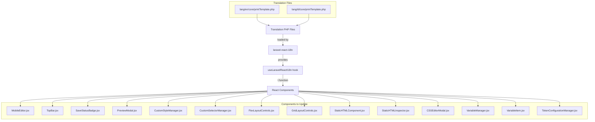

# Design Document: Print Template i18n

## Overview

This feature replaces all hardcoded user-facing strings in the PrintTemplate directory with translation keys using the existing `laravel-react-i18n` infrastructure. The project already uses `useLaravelReactI18n()` extensively across the PrintTemplate components (e.g., `CustomStyleManager`, `CSSEditorModal`, `TokenConfigurationManager`), so this work extends the same pattern to the remaining components that still contain hardcoded Indonesian or English strings.

The translation keys follow the `core.printTemplate.editor.*` namespace convention already established in the codebase. Both English (`lang/en/core/printTemplate.php`) and Indonesian (`lang/id/core/printTemplate.php`) translation files will be updated with new entries.

### Design Decisions

1. **Namespace convention**: All new keys use `core.printTemplate.editor.*` to stay consistent with existing keys like `editor.manual_css`, `editor.edit_css`, `editor.class_manager`.
2. **Flat key structure**: Keys use dot-separated flat naming (e.g., `editor.save`, `editor.preview`) rather than deeply nested arrays, matching the existing pattern.
3. **Hook placement**: Components that don't already import `useLaravelReactI18n` will add the import and destructure `t` at the top of the component function body.
4. **Relative time strings**: `SaveStatusBadge` uses a custom `formatRelativeTime` function with hardcoded Indonesian strings. These will be replaced with `t()` calls, requiring the `t` function to be passed or accessed within the formatting logic.
5. **Toast messages**: Toast strings in `SaveStatusBadge` and `PreviewModal` will use `t()` for the message content.

## Architecture



## Components and Interfaces

### Translation Hook Usage Pattern

All components follow the same pattern already established in the codebase:

```jsx
import { useLaravelReactI18n } from "laravel-react-i18n";

function MyComponent() {
  const { t } = useLaravelReactI18n();

  return <span>{t("core.printTemplate.editor.my_key")}</span>;
}
```

### Components Requiring New Hook Import

These components do not currently import `useLaravelReactI18n` and need it added:

| Component             | File Path                                      |
| --------------------- | ---------------------------------------------- |
| MobileEditor          | `PrintTemplate/MobileEditor.jsx`               |
| TopBar                | `Components/TopBar.jsx`                        |
| SaveStatusBadge       | `Components/SaveStatusBadge.jsx`               |
| CustomSelectorManager | `Components/CustomSelectorManager.jsx`         |
| FlexLayoutControls    | `Components/FlexLayoutControls.jsx`            |
| GridLayoutControls    | `Components/GridLayoutControls.jsx`            |
| StaticHTMLComponent   | `Components/StaticHTMLComponent.jsx`           |
| StaticHTMLInspector   | `Components/Inspector/StaticHTMLInspector.jsx` |

### Components Already Using the Hook

These components already import and use `useLaravelReactI18n` but have remaining hardcoded strings:

| Component                 | File Path                                  |
| ------------------------- | ------------------------------------------ |
| PreviewModal              | `Components/PreviewModal.jsx`              |
| CustomStyleManager        | `Components/CustomStyleManager.jsx`        |
| CSSEditorModal            | `Components/CSSEditorModal.jsx`            |
| VariableManager           | `Components/VariableManager.jsx`           |
| VariableItem              | `Components/VariableItem.jsx`              |
| TokenConfigurationManager | `Components/TokenConfigurationManager.jsx` |

### SaveStatusBadge Special Handling

The `formatRelativeTime` function is defined outside the component and uses hardcoded strings. Two approaches:

**Chosen approach**: Move the relative time formatting inside the component (or pass `t` as a parameter) so that `t()` calls can be used for "baru saja", "m lalu", "j lalu" strings.

```jsx
function formatRelativeTime(lastSavedAt, t) {
  if (!lastSavedAt) return "";
  const diffMs = Date.now() - lastSavedAt.getTime();
  const diffSeconds = Math.max(0, Math.floor(diffMs / 1000));
  if (diffSeconds < 60) return t("core.printTemplate.editor.time_just_now");
  const diffMinutes = Math.floor(diffSeconds / 60);
  if (diffMinutes < 60)
    return t("core.printTemplate.editor.time_minutes_ago", {
      count: diffMinutes,
    });
  const diffHours = Math.floor(diffMinutes / 60);
  return t("core.printTemplate.editor.time_hours_ago", { count: diffHours });
}
```

## Data Models

### Translation Key Structure

New keys added to the `editor` array in both translation files:

```php
'editor' => [
    // Existing keys...

    // MobileEditor
    'save'                    => 'Save',
    'preview'                 => 'Preview',
    'undo'                    => 'Undo',
    'redo'                    => 'Redo',
    'mobile_editor_title'     => 'Mobile Editor',
    'mobile_editor_desc'      => '...',
    'no_text_selected'        => '...',
    'text'                    => 'Text',
    'font_size'               => 'Font Size (px)',
    'color'                   => 'Color',
    'alignment'               => 'Alignment',
    'align_left'              => 'Align Left',
    'align_center'            => 'Align Center',
    'align_right'             => 'Align Right',
    'align_justify'           => 'Align Justify',

    // TopBar (uses same save/preview/undo/redo keys)
    'outline'                 => 'Outline',
    'code'                    => 'Code',

    // SaveStatusBadge
    'status_saving'           => 'Saving...',
    'status_not_saved'        => 'Not Saved',
    'status_save_error'       => 'Save Error',
    'status_saved'            => 'Saved',
    'status_ready'            => 'Ready',
    'time_just_now'           => 'just now',
    'time_minutes_ago'        => ':countm ago',
    'time_hours_ago'          => ':counth ago',
    'save_success'            => 'Template saved successfully.',
    'save_error_message'      => 'An error occurred while saving the template.',

    // PreviewModal
    'preview_template'        => 'Preview Template',
    'preview_description'     => '...',
    'loading_preview'         => 'Loading preview...',
    'render_error_title'      => 'Failed to render preview',
    'warnings'                => 'Warnings',
    'relation_summary_title'  => 'Table Relation Summary',
    'relation_rows_suffix'    => 'example data rows',
    'missing_data_title'      => 'Example Data Not Available',
    'missing_data_message'    => '...',
    'generate_example_data'   => 'Generate Example Data',
    'generating_data'         => 'Generating Data...',
    'close'                   => 'Close',
    'print'                   => 'Print',
    'export_pdf'              => 'Export PDF',
    'popup_blocked'           => '...',
    'example_data_success'    => '...',
    'example_data_error'      => '...',
    'template_invalid_preview'=> '...',
    'preview_iframe_title'    => 'Print Preview',

    // CustomStyleManager
    'layout'                  => 'Layout',
    'no_style_properties'     => '...',
    'no_manual_css'           => 'No manual CSS applied.',

    // CustomSelectorManager
    'selectors'               => 'Selectors',
    'select_a_component'      => 'Select a component',
    'selected'                => 'Selected:',
    'none'                    => 'None',

    // FlexLayoutControls
    'justify_content'         => 'Justify Content',
    'align_content'           => 'Align Content',
    'align_items'             => 'Align Items',
    'column_gap'              => 'Column Gap',
    'row_gap'                 => 'Row Gap',

    // GridLayoutControls
    'grid_columns'            => 'Grid Columns',
    'add_column'              => '+ Column',
    'remove'                  => 'Remove',
    'justify_items'           => 'Justify Items',

    // StaticHTMLComponent
    'custom_html_editor'      => 'Custom HTML Editor',
    'html_editor_desc'        => '...',
    'input_html'              => 'Input HTML',
    'preview_sanitized'       => 'Preview (Sanitized)',
    'preview_placeholder'     => '...',
    'security_warning'        => 'Security Warning',
    'cancel_button'           => 'Cancel',
    'save_html'               => 'Save HTML',

    // StaticHTMLInspector
    'static_html_inspector'   => 'Static HTML Inspector',
    'select_html_component'   => '...',
    'edit_html'               => 'Edit HTML',
    'raw_html'                => 'Raw HTML',
    'sanitization_warning'    => 'Sanitization Warning',
    'sanitized_preview'       => 'Sanitized Preview',
    'no_html_stored'          => '...',

    // CSSEditorModal
    'css_syntax_error'        => 'CSS Syntax Error',
    'invalid_css_declaration' => 'Invalid CSS declaration',
    'protected_selector_title'=> 'Protected selector detected',
    'protected_selector_desc' => '...',

    // VariableManager
    'document_variables'      => 'Document Variables',
    'no_variables_available'  => 'No variables available.',

    // VariableItem
    'load_columns_error'      => 'Failed to load columns.',
    'example_label'           => 'Example:',
    'relations_tooltip'       => 'Relation table (drag to create table)',
    'relation_tooltip'        => 'Relation (click to expand)',
    'loading_columns'         => 'Loading columns...',

    // TokenConfigurationManager
    'loading_latest_columns'  => 'Loading latest columns...',
],
```

### Key Naming Conventions

- Use snake_case for all keys
- Prefix status-related keys with `status_`
- Prefix time-related keys with `time_`
- Use descriptive names that indicate context
- Reuse keys across components where the same string appears (e.g., `save`, `preview`, `close`)

## Correctness Properties

_A property is a characteristic or behavior that should hold true across all valid executions of a system — essentially, a formal statement about what the system should do._

### Property 1: Translation key parity across locales

_For any_ translation key defined in `lang/en/core/printTemplate.php`, the same key SHALL exist in `lang/id/core/printTemplate.php` and vice versa, ensuring both locale files have identical key structures.

**Validates: Requirements 15.4**

## Error Handling

- If a translation key is missing, `laravel-react-i18n` returns the key itself as fallback, ensuring the UI never shows blank content.
- No new error states are introduced by this feature.
- Existing error messages (toast errors, render errors) are simply wrapped with `t()` calls.

## Testing Strategy

### Why Property-Based Testing Does Not Apply

This feature is a **UI string replacement** task — replacing hardcoded strings with `t()` function calls. It does not involve:

- Complex logic with varying inputs
- Data transformations or algorithms
- Parsers or serializers
- Business logic with universal properties

The behavior is deterministic: given a locale, a specific key always returns the same string. There is no input space to explore with property-based testing.

### Recommended Testing Approach

1. **Manual visual verification**: Render each component and verify strings display correctly in both `en` and `id` locales.

2. **Example-based unit tests**: For components with complex conditional rendering (e.g., `SaveStatusBadge` status labels, `PreviewModal` error states), write focused tests that:
   - Mock `useLaravelReactI18n` to return a mock `t` function
   - Verify the correct translation key is passed for each state
   - Verify dynamic parameters (e.g., `:count` in time strings) are passed correctly

3. **Translation file completeness check**: A simple script or test that:
   - Parses both `lang/en/core/printTemplate.php` and `lang/id/core/printTemplate.php`
   - Verifies both files have identical key structures
   - Ensures no key exists in one file but not the other

4. **Build verification**: Run `npm run build` to ensure no import errors or missing dependencies after adding the hook to new components.

### Test Scope

| Test Type   | Coverage                                                   |
| ----------- | ---------------------------------------------------------- |
| Unit tests  | SaveStatusBadge status labels, formatRelativeTime with t() |
| Integration | Component renders with mocked i18n provider                |
| Manual      | Visual check of all 14 components in both locales          |
| Lint/Build  | `npm run build` passes, no TypeScript/ESLint errors        |
