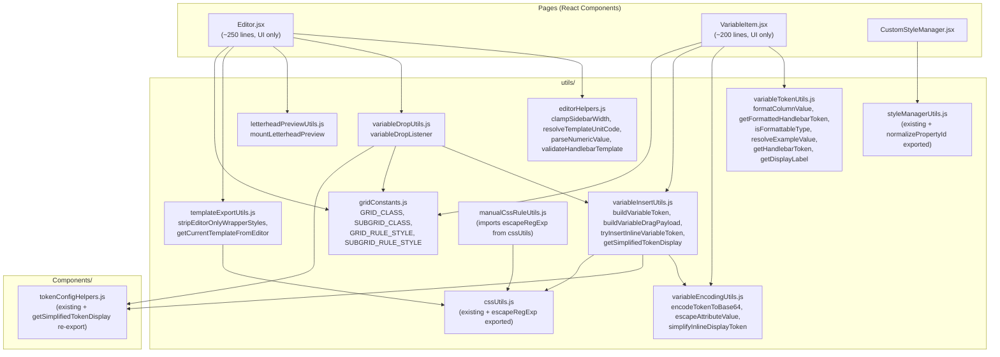

# Design Document: Print Template Refactoring

## Overview

Refactoring modul PrintTemplate untuk mengeliminasi duplikasi kode, memecah file besar menjadi modul-modul kecil yang maintainable, dan menambahkan komentar Bahasa Indonesia. Pendekatan utama adalah **extract-and-import**: memindahkan fungsi/konstanta duplikat ke modul utilitas bersama, lalu mengganti semua definisi lokal dengan import dari sumber tunggal.

Refactoring ini bersifat **behavior-preserving** — tidak ada perubahan logika bisnis, hanya reorganisasi kode. Semua public API yang ada tetap dipertahankan melalui re-export jika diperlukan.

## Architecture

### Strategi Refactoring

```
┌─────────────────────────────────────────────────────────────────┐
│                    SEBELUM (Current State)                       │
├─────────────────────────────────────────────────────────────────┤
│  Editor.jsx (~650 lines)                                        │
│    ├── clampSidebarWidth (local)                                │
│    ├── resolveTemplateUnitCode (local)                          │
│    ├── parseNumericValue (local)                                │
│    ├── validateHandlebarTemplate (local)                        │
│    ├── buildVariableToken (DUPLICATED)                          │
│    ├── mountLetterheadPreview (local)                           │
│    ├── variableDropListener (local, ~250 lines)                 │
│    │     ├── getSimplifiedTokenDisplay (DUPLICATED inline)      │
│    │     ├── GRID_CLASS / SUBGRID_CLASS (DUPLICATED)            │
│    │     └── GRID_RULE_STYLE / SUBGRID_RULE_STYLE (DUPLICATED) │
│    ├── stripEditorOnlyWrapperStyles (local)                     │
│    └── getCurrentTemplateFromEditor (local)                     │
│                                                                 │
│  VariableItem.jsx (~550 lines)                                  │
│    ├── buildVariableToken (DUPLICATED)                          │
│    ├── formatColumnValue (local)                                │
│    ├── getFormattedHandlebarToken (local)                       │
│    ├── isFormattableType (local)                                │
│    ├── resolveExampleValue (local)                              │
│    ├── getHandlebarToken (local)                                │
│    ├── getDisplayLabel (local)                                  │
│    ├── encodeTokenToBase64 (local)                              │
│    ├── escapeAttributeValue (local)                             │
│    ├── simplifyInlineDisplayToken (local)                       │
│    ├── buildVariableDragPayload (exported)                      │
│    ├── tryInsertInlineVariableToken (local)                     │
│    └── handleInsert (inline getSimplifiedTokenDisplay DUPLICATED)│
│                                                                 │
│  CustomStyleManager.jsx                                         │
│    └── normalizePropertyId (DUPLICATED from styleManagerUtils)  │
│                                                                 │
│  manualCssRuleUtils.js                                          │
│    └── escapeRegExp (DUPLICATED from cssUtils)                  │
└─────────────────────────────────────────────────────────────────┘
```

### Target Architecture (Sesudah Refactoring)



### Dependency Rules (No Circular Dependencies)

Dependency flow bersifat **unidirectional** (satu arah):

```
Level 0 (Leaf modules - no internal imports):
  ├── utils/gridConstants.js
  ├── utils/cssUtils.js
  └── utils/editorHelpers.js

Level 1 (Imports from Level 0 only):
  ├── utils/styleManagerUtils.js (existing, no changes needed)
  ├── utils/manualCssRuleUtils.js → imports from cssUtils
  ├── utils/variableEncodingUtils.js → imports from tokenConfigHelpers
  └── utils/templateFormatUtils.js (existing)

Level 2 (Imports from Level 0-1):
  ├── utils/variableTokenUtils.js (standalone helpers)
  ├── utils/variableInsertUtils.js → imports from variableEncodingUtils, tokenConfigHelpers
  └── utils/templateExportUtils.js → imports from templateFormatUtils, cssUtils

Level 3 (Imports from Level 0-2):
  ├── utils/variableDropUtils.js → imports from variableInsertUtils, gridConstants, tokenConfigHelpers
  └── utils/letterheadPreviewUtils.js (standalone, no internal imports)

Level 4 (Page components - imports from any level):
  ├── Editor.jsx
  ├── VariableItem.jsx
  └── CustomStyleManager.jsx
```

## Components and Interfaces

### New Module: `utils/gridConstants.js`

```javascript
/**
 * Konstanta CSS Grid untuk layout variabel di canvas editor.
 * @module gridConstants
 */

/** @type {string} Nama class CSS untuk container grid utama */
export const GRID_CLASS = "gjs-grid";

/** @type {string} Nama class CSS untuk sub-grid (baris variabel) */
export const SUBGRID_CLASS = "gjs-subgrid";

/** @type {Object} Style CSS untuk container grid utama */
export const GRID_RULE_STYLE = Object.freeze({
  display: "grid",
  "grid-template-columns": "max-content 1fr",
  "column-gap": "12px",
  "padding-top": "10px",
  "padding-bottom": "10px",
});

/** @type {Object} Style CSS untuk sub-grid (baris variabel) */
export const SUBGRID_RULE_STYLE = Object.freeze({
  display: "grid",
  "grid-template-columns": "subgrid",
  gap: "8px",
  "grid-column": "1 / -1",
  padding: "0px",
});
```

### New Module: `utils/editorHelpers.js`

```javascript
/**
 * Fungsi-fungsi helper murni untuk Editor PrintTemplate.
 * @module editorHelpers
 */

export function clampSidebarWidth(width) { ... }
export function resolveTemplateUnitCode(printTemplate) { ... }
export function parseNumericValue(value, fallbackValue) { ... }
export function validateHandlebarTemplate(template) { ... }
```

### New Module: `utils/variableInsertUtils.js`

```javascript
/**
 * Utilitas untuk membangun dan menyisipkan token variabel ke canvas editor.
 * Menangani tipe variabel: "company", "docInfo", "relation", dan "doc" (default).
 * @module variableInsertUtils
 */

export function buildVariableToken({ variableType, parentType, variablePath, keyName }) { ... }
export function getSimplifiedTokenDisplay(token, variablePath) { ... }
export function buildVariableDragPayload({ variable, nestedColumns, ... }) { ... }
export function tryInsertInlineVariableToken(editor, selectedComponent, token, fullKey) { ... }
```

### New Module: `utils/variableTokenUtils.js`

```javascript
/**
 * Utilitas untuk memformat dan mengelola token variabel Handlebar.
 * @module variableTokenUtils
 */

export function formatColumnValue(value, column) { ... }
export function getFormattedHandlebarToken(variable, fullKey) { ... }
export function isFormattableType(type) { ... }
export function resolveExampleValue(exampleData, path, type) { ... }
export function getHandlebarToken(variable) { ... }
export function getDisplayLabel(variable, t) { ... }
```

### New Module: `utils/variableEncodingUtils.js`

```javascript
/**
 * Utilitas encoding dan escaping untuk token variabel inline.
 * @module variableEncodingUtils
 */

export function encodeTokenToBase64(token) { ... }
export function escapeAttributeValue(value) { ... }
export function simplifyInlineDisplayToken(fullKey, token) { ... }
```

### New Module: `utils/variableDropUtils.js`

```javascript
/**
 * Listener dan handler untuk drag-and-drop variabel ke canvas GrapesJS.
 * @module variableDropUtils
 */

export function variableDropListener(editor, { t, exampleData, locale }) { ... }
```

### New Module: `utils/letterheadPreviewUtils.js`

```javascript
/**
 * Utilitas untuk menampilkan preview letterhead di canvas editor.
 * @module letterheadPreviewUtils
 */

export function mountLetterheadPreview(editor, { html, css }) { ... }
```

### New Module: `utils/templateExportUtils.js`

```javascript
/**
 * Utilitas untuk mengekstrak dan membersihkan template dari editor GrapesJS.
 * @module templateExportUtils
 */

export function stripEditorOnlyWrapperStyles(css) { ... }
export function getCurrentTemplateFromEditor(editor, fallbackTemplate) { ... }
```

### Modified Module: `utils/cssUtils.js`

```javascript
// Existing exports tetap ada, ditambah:
export function escapeRegExp(value) { ... }  // Already exported, no change needed
```

### Modified Module: `utils/styleManagerUtils.js`

```javascript
// Existing exports tetap ada, ditambah export normalizePropertyId:
export function normalizePropertyId(propertyId) { ... }  // Was internal, now exported
```

### Modified Module: `utils/manualCssRuleUtils.js`

```javascript
// Remove local escapeRegExp, import from cssUtils:
import { escapeRegExp } from "./cssUtils";
// ... rest of file unchanged
```

### Modified Component: `Components/tokenConfigHelpers.js`

```javascript
// Existing exports tetap ada
// getSimplifiedTokenDisplay sudah di-export (no change needed)
// Consumer baru (variableInsertUtils) akan import dari sini
```

## Data Models

Tidak ada perubahan data model. Refactoring ini murni reorganisasi kode frontend tanpa mengubah struktur data, API, atau state management.

### Module Export Map (Public API)

| Module                            | Named Exports                                                                                                                         |
| --------------------------------- | ------------------------------------------------------------------------------------------------------------------------------------- |
| `utils/gridConstants.js`          | `GRID_CLASS`, `SUBGRID_CLASS`, `GRID_RULE_STYLE`, `SUBGRID_RULE_STYLE`                                                                |
| `utils/editorHelpers.js`          | `clampSidebarWidth`, `resolveTemplateUnitCode`, `parseNumericValue`, `validateHandlebarTemplate`                                      |
| `utils/variableInsertUtils.js`    | `buildVariableToken`, `getSimplifiedTokenDisplay`, `buildVariableDragPayload`, `tryInsertInlineVariableToken`                         |
| `utils/variableTokenUtils.js`     | `formatColumnValue`, `getFormattedHandlebarToken`, `isFormattableType`, `resolveExampleValue`, `getHandlebarToken`, `getDisplayLabel` |
| `utils/variableEncodingUtils.js`  | `encodeTokenToBase64`, `escapeAttributeValue`, `simplifyInlineDisplayToken`                                                           |
| `utils/variableDropUtils.js`      | `variableDropListener`                                                                                                                |
| `utils/letterheadPreviewUtils.js` | `mountLetterheadPreview`                                                                                                              |
| `utils/templateExportUtils.js`    | `stripEditorOnlyWrapperStyles`, `getCurrentTemplateFromEditor`                                                                        |
| `utils/cssUtils.js`               | (existing) + `escapeRegExp` (already exported)                                                                                        |
| `utils/styleManagerUtils.js`      | (existing) + `normalizePropertyId` (newly exported)                                                                                   |

## Correctness Properties

_A property is a characteristic or behavior that should hold true across all valid executions of a system — essentially, a formal statement about what the system should do. Properties serve as the bridge between human-readable specifications and machine-verifiable correctness guarantees._

### Property 1: buildVariableToken output correctness

_For any_ valid combination of `{variableType, parentType, variablePath, keyName}`, the `buildVariableToken` function SHALL produce a token string that follows these rules:

- If `parentType === "company"` or `variableType === "company"`, output is `{{company.<keyName>}}`
- If `parentType === "docInfo"` or `variableType === "docInfo"`, output is `{{docInfo.<keyName>}}`
- If `variableType === "relation"`, output is `{{relation <normalizedPath>}}` where normalizedPath starts with `doc.`
- Otherwise, output is `` where normalizedPath starts with `doc.`

**Validates: Requirements 1.1, 1.4**

### Property 2: getSimplifiedTokenDisplay simplification correctness

_For any_ token string and variablePath combination, `getSimplifiedTokenDisplay` SHALL:

- When token is empty and variablePath has `doc.` prefix: return ``
- When token contains `formatCurrency doc.<field>` or `formatNumber doc.<field>`: return ``
- Otherwise: delegate to `simplifyTokenDisplay` which strips `doc.`, `relation doc.`, `docInfo.` prefixes

**Validates: Requirements 2.4, 2.5**

### Property 3: normalizePropertyId idempotence and correctness

_For any_ string input (including null, undefined, whitespace, mixed case), `normalizePropertyId` SHALL return a string that is:

- Equal to `String(input ?? "").trim().toLowerCase()`
- Idempotent: `normalizePropertyId(normalizePropertyId(x)) === normalizePropertyId(x)`

**Validates: Requirements 3.4**

### Property 4: escapeRegExp round-trip safety

_For any_ string input, `new RegExp(escapeRegExp(input)).test(input)` SHALL return `true` — meaning the escaped string, when used as a regex pattern, always matches the original literal string.

**Validates: Requirements 4.4**

## Error Handling

### Build Errors

- Jika circular dependency terdeteksi saat build, Vite akan menampilkan warning. Dependency graph di atas dirancang untuk menghindari ini.
- Jika import path salah setelah refactoring, `npm run build` akan gagal dengan error yang jelas menunjukkan file dan path yang bermasalah.

### Runtime Errors

- Tidak ada perubahan error handling runtime. Semua `try/catch` dan `console.error` yang ada dipertahankan.
- `console.log` debugging dihapus sesuai Requirement 12, tapi `console.error` di blok `catch` tetap ada.

### Backward Compatibility

- Jika ada consumer eksternal (di luar direktori PrintTemplate) yang mengimport dari file yang di-refactor, re-export disediakan dari lokasi asli.
- `buildVariableDragPayload` yang sebelumnya di-export dari `VariableItem.jsx` akan di-re-export dari sana setelah dipindahkan ke `variableInsertUtils.js`.

## Testing Strategy

### Property-Based Testing (PBT)

Library: Menggunakan **fast-check** (sudah tersedia di project berdasarkan file `.property.test.js` yang ada).

Setiap property test dikonfigurasi dengan minimum **100 iterasi**.

| Property                              | Test File                                    | Tag                                                                                                   |
| ------------------------------------- | -------------------------------------------- | ----------------------------------------------------------------------------------------------------- |
| Property 1: buildVariableToken        | `utils/variableInsertUtils.property.test.js` | Feature: print-template-refactoring, Property 1: buildVariableToken output correctness                |
| Property 2: getSimplifiedTokenDisplay | `utils/variableInsertUtils.property.test.js` | Feature: print-template-refactoring, Property 2: getSimplifiedTokenDisplay simplification correctness |
| Property 3: normalizePropertyId       | `utils/styleManagerUtils.property.test.js`   | Feature: print-template-refactoring, Property 3: normalizePropertyId idempotence                      |
| Property 4: escapeRegExp              | `utils/cssUtils.property.test.js`            | Feature: print-template-refactoring, Property 4: escapeRegExp round-trip                              |

### Unit Tests (Example-Based)

| Test Area             | Test File                             | Coverage                                                                                 |
| --------------------- | ------------------------------------- | ---------------------------------------------------------------------------------------- |
| editorHelpers         | `utils/editorHelpers.test.js`         | clampSidebarWidth bounds, resolveTemplateUnitCode defaults, parseNumericValue edge cases |
| variableTokenUtils    | `utils/variableTokenUtils.test.js`    | formatColumnValue currency/number, getFormattedHandlebarToken all types                  |
| variableEncodingUtils | `utils/variableEncodingUtils.test.js` | encodeTokenToBase64, escapeAttributeValue special chars                                  |
| templateExportUtils   | `utils/templateExportUtils.test.js`   | stripEditorOnlyWrapperStyles regex patterns                                              |
| gridConstants         | `utils/gridConstants.test.js`         | Verify constant values match expected                                                    |

### Integration/Smoke Tests

- **Build verification**: `npm run build` harus berhasil tanpa error
- **No duplicate definitions**: Grep/static analysis memverifikasi tidak ada definisi duplikat
- **Import consistency**: Semua import mengarah ke sumber tunggal yang benar
- **No console.log**: Grep memverifikasi tidak ada `console.log` aktif

### Existing Tests

Test yang sudah ada harus tetap passing tanpa modifikasi:

- `Editor.gridCssFix.test.js`
- `Editor.property.test.js`
- `utils/cssUtils.property.test.js`
- `utils/cssUtils.test.js`
- `utils/styleManagerUtils.property.test.js`
- `utils/styleManagerUtils.test.js`
- `utils/templateFormatUtils.test.js`
- `utils/canvasSelectionUtils.test.js`
- `Components/tokenConfigHelpers.property.test.js`
- `Components/CustomStyleManager.manualCss.test.js`

### Indonesian Comment Format

Semua file baru dan file yang dimodifikasi harus mengikuti format komentar:

```javascript
/**
 * [Deskripsi modul dalam Bahasa Indonesia - 1-3 kalimat]
 * @module [namaModul]
 */

/**
 * [Deskripsi fungsi dalam Bahasa Indonesia]
 * @param {tipe} namaParam - [Penjelasan parameter dalam Bahasa Indonesia]
 * @returns {tipe} [Penjelasan return value dalam Bahasa Indonesia]
 */
export function namaFungsi(param) {
  // Komentar inline Bahasa Indonesia untuk logika kompleks
  if (kondisi) {
    // Penjelasan percabangan dalam Bahasa Indonesia
  }
}
```
