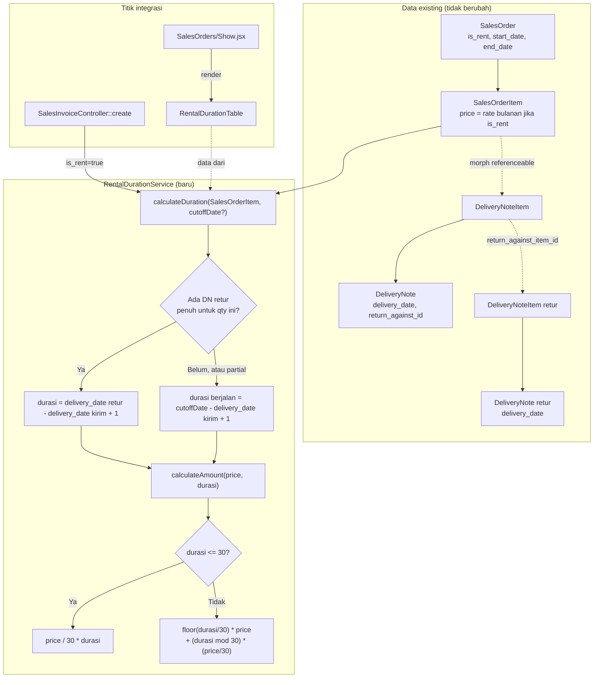

# Design Document: rental-actual-duration

## Overview

Menambahkan kalkulasi durasi sewa aktual per `SalesOrderItem` rental (dari tanggal `DeliveryNote` pengiriman sampai pengembalian, atau cut-off manual jika belum kembali), dan pakai durasi itu untuk menghitung amount dari rate bulanan (`price`) saat membuat Sales Invoice dari SO rental.

**Pattern utama:** murni service layer baru (`RentalDurationService`), **bukan** kolom generated/stored — karena durasi bergantung pada state eksternal (ada/tidaknya DN retur, cut-off manual dari user) yang tidak bisa diekspresikan sebagai SQL generated column seperti pola `basic_amount`/`tax_amount` di spec sebelumnya. Kalkulasi dilakukan on-demand (query + PHP), bukan disimpan sebagai kolom.

**Yang berubah:**
- Model `SalesOrderItem`: tambah relasi `deliveryNoteItems()` (morph balik dari `DeliveryNoteItem::referenceable`).
- Service baru `App\Services\Sales\RentalDurationService`: kalkulasi durasi aktual + amount dari rate bulanan.
- `SalesInvoiceController::create()`: saat SO sumbernya `is_rent = true`, panggil `RentalDurationService` untuk override `price` per item sebelum di-passing ke FE sebagai `defaultData` (bukan menyalin `price` SO mentah seperti sekarang).
- FE `SalesOrders/Show.jsx`: tambah komponen `RentalDurationTable` (pola sama seperti `ItemsQtyTable` yang sudah ada), menampilkan durasi + badge status per item rental.
- FE `SalesInvoice/Form.jsx` atau halaman create: perlu titik input cut-off billing manual saat SO sumbernya rental dan ada item belum dikembalikan.

**Yang TIDAK berubah:**
- `DeliveryNoteService` — mekanisme reservasi stok (`Stock::updateDetails` tipe `rents`, `rented_quantity`) sama sekali tidak disentuh (Requirement 5.1).
- `SalesOrderItem.price` tetap kolom yang sama — cuma maknanya jadi "rate bulanan" ketika parent SO `is_rent = true`. Tidak ada migration/kolom baru.
- Alur non-rental (`is_rent = false`) di SalesOrder, DeliveryNote, SalesInvoice — tidak tersentuh sama sekali.

## Architecture



**Data flow:**
1. Sales Order rental dibuat seperti biasa (`is_rent = true`, item punya `price` = rate bulanan yang disepakati) — tidak berubah dari sekarang.
2. Delivery Note dibuat dari SO (pengiriman) — `DeliveryNoteService` tetap jalan seperti sekarang (reservasi stok tidak berubah), tapi sekarang `RentalDurationService` bisa membaca `delivery_date` DN ini via relasi `referenceable`.
3. (Opsional) Delivery Note retur dibuat mereferensikan DN pengiriman lewat `return_against_id`/`return_against_item_id` — mekanisme existing, tidak berubah.
4. **Titik baru A** — `SalesOrders/Show.jsx`: untuk setiap item rental, panggil endpoint baru yang menjalankan `RentalDurationService::calculateDuration()` untuk menampilkan durasi + status berjalan.
5. **Titik baru B** — `SalesInvoiceController::create()`: ketika SO sumber `is_rent = true`, untuk tiap item rental yang belum tuntas kalkulasinya (ada quantity belum kembali), sistem meminta cut-off billing dari user (via query param atau step tambahan di FE) lalu memanggil `RentalDurationService::calculateAmount()` untuk override `price` sebelum item di-passing ke form invoice sebagai prefill.

## Components and Interfaces

### 1. Model — `app/Models/Sales/SalesOrderItem.php`

Tambah relasi baru:
```php
public function deliveryNoteItems() {
    return $this->morphMany(DeliveryNoteItem::class, 'referenceable', 'referenceable_type', 'referenceable_id');
}
```

Import tambahan: `use App\Models\Inventory\DeliveryNoteItem;`.

### 2. Service baru — `app/Services/Sales/RentalDurationService.php`

```php
namespace App\Services\Sales;

use App\Models\Sales\SalesOrderItem;
use Carbon\Carbon;

class RentalDurationService {
    /**
     * @return array{segments: array<array{quantity: float, start_date: Carbon, end_date: Carbon, duration_days: int, status: string}>, status: 'running'|'completed'|'partially_completed'}
     */
    public function calculateDuration(SalesOrderItem $item, ?Carbon $cutoffDate = null): array {
        $deliveryItems = $item->deliveryNoteItems()
            ->whereNull('return_against_item_id') // hanya DN item pengiriman, bukan retur
            ->with('deliveryNote')
            ->get();

        $segments = [];
        $anyRunning = false;
        $anyCompleted = false;

        foreach ($deliveryItems as $deliveryItem) {
            $shippedDate = $deliveryItem->deliveryNote->delivery_date;
            $returnItems = DeliveryNoteItem::where('return_against_item_id', $deliveryItem->id)->with('deliveryNote')->get();

            if ($returnItems->isEmpty()) {
                // belum ada retur sama sekali -- seluruh quantity masih berjalan
                $anyRunning = true;
                $endDate = $cutoffDate ?? Carbon::today();
                $segments[] = [
                    'quantity'      => $deliveryItem->quantity,
                    'start_date'    => $shippedDate,
                    'end_date'      => $endDate,
                    'duration_days' => $this->diffInDaysInclusive($shippedDate, $endDate),
                    'status'        => 'running',
                ];
                continue;
            }

            $returnedQty = $returnItems->sum('quantity');
            foreach ($returnItems as $returnItem) {
                $anyCompleted = true;
                $segments[] = [
                    'quantity'      => $returnItem->quantity,
                    'start_date'    => $shippedDate,
                    'end_date'      => $returnItem->deliveryNote->delivery_date,
                    'duration_days' => $this->diffInDaysInclusive($shippedDate, $returnItem->deliveryNote->delivery_date),
                    'status'        => 'completed',
                ];
            }

            $remainingQty = $deliveryItem->quantity - $returnedQty;
            if ($remainingQty > 0) {
                $anyRunning = true;
                $endDate = $cutoffDate ?? Carbon::today();
                $segments[] = [
                    'quantity'      => $remainingQty,
                    'start_date'    => $shippedDate,
                    'end_date'      => $endDate,
                    'duration_days' => $this->diffInDaysInclusive($shippedDate, $endDate),
                    'status'        => 'running',
                ];
            }
        }

        $status = match (true) {
            $anyRunning && $anyCompleted => 'partially_completed',
            $anyRunning                  => 'running',
            default                      => 'completed',
        };

        return [
            'segments' => $segments,
            'status'   => $status,
        ];
    }

    private function diffInDaysInclusive(Carbon $start, Carbon $end): int {
        return $start->startOfDay()->diffInDays($end->copy()->startOfDay()) + 1;
    }

    /**
     * Requirement 2: konversi rate bulanan (price) + durasi -> amount.
     */
    public function calculateAmount(float $monthlyRate, int $durationDays): float {
        if ($durationDays <= 30) {
            return $monthlyRate / 30 * $durationDays;
        }

        $fullMonths = intdiv($durationDays, 30);
        $remainingDays = $durationDays % 30;

        return ($fullMonths * $monthlyRate) + ($remainingDays * ($monthlyRate / 30));
    }
}
```

**Catatan implementasi:** query `DeliveryNoteItem::where('return_against_item_id', $deliveryItem->id)` dipakai langsung (bukan lewat relasi Eloquent `hasMany`) — dikonfirmasi ini konsisten dengan konvensi project: pola retur serupa di `SalesInvoiceItem`, `PurchaseInvoiceItem`, `PurchaseReceiptItem` juga **hanya punya relasi satu arah** (`belongsTo` ke item asal via `returnAgainstItem()`), tidak ada satupun yang punya relasi balik `hasMany`. Tidak perlu menambah relasi baru di `DeliveryNoteItem` untuk ini.

### 3. Controller — `app/Http/Controllers/Finances/SalesInvoiceController.php::create()`

Modifikasi blok `case 'salesOrder':` (baris 43-84 saat ini):

```php
case 'salesOrder':
    $so = SalesOrder::find($split[1]);
    if ($so) {
        // ... (kode existing tidak berubah sampai sebelum mapping items)

        $rentalDurationService = app(RentalDurationService::class);
        $cutoffDate = $request->query('rental_cutoff_date')
            ? Carbon::parse($request->query('rental_cutoff_date'))
            : null;

        $defaultData = [
            // ... field lain tidak berubah
            'items' => $so?->items->map(function ($item) use ($so, $rentalDurationService, $cutoffDate) {
                $itemData = [
                    ...$item->toArray(),
                    'id'                  => Utils::generateRandom(5),
                    'sales_order_item_id' => $item->id,
                ];

                if ($so->is_rent) {
                    $duration = $rentalDurationService->calculateDuration($item, $cutoffDate);
                    $totalDays = collect($duration['segments'])->sum('duration_days');
                    $itemData['price'] = $rentalDurationService->calculateAmount($item->price, $totalDays);
                    $itemData['rental_duration_days'] = $totalDays; // informasi tambahan untuk ditampilkan di FE
                }

                return $itemData;
            }),
            // ...
        ];
    }
    break;
```

**Keputusan UX cut-off date (dikonfirmasi pengguna): Opsi B.** `rental_cutoff_date` diterima sebagai query parameter pada request `GET /salesInvoices/create/salesOrder/{id}?rental_cutoff_date=...`, **default ke `now()` jika tidak dikirim** — tidak ada prompt/dialog blocking sebelum navigasi. Link "Buat Sales Invoice" di `SalesOrders/Show.jsx` (baris 221-231 saat ini) **tidak berubah sama sekali** — tetap redirect langsung tanpa query param tambahan. Ketentuan cut-off manual (Requirement 1.2) dipenuhi lewat field date picker di halaman/form Sales Invoice itu sendiri (lihat section 5) yang men-trigger re-fetch prefill saat diubah, bukan lewat gerbang sebelum halaman dibuka.

### 4. FE — `resources/js/Pages/Sales/SalesOrders/Show.jsx`

Tambah komponen baru mengikuti pola `ItemsQtyTable` yang sudah ada (baris 43-88):

```jsx
function RentalStatusBadge({ status }) {
  const map = {
    running: { label: "Berjalan", className: "text-blue-600" },
    completed: { label: "Selesai", className: "text-green-600" },
    partially_completed: { label: "Sebagian Selesai", className: "text-amber-600" },
  };
  const { label, className } = map[status] ?? {};
  return <span className={`text-xs font-medium ${className}`}>{label}</span>;
}

function RentalDurationTable({ items, durations }) {
  // durations: { [itemId]: { segments, status } }, dikirim dari backend sebagai prop tambahan
  if (!items?.length) return null;

  return (
    <div className="mt-4 overflow-x-auto rounded border">
      <table className="w-full text-sm">
        <thead className="bg-muted text-muted-foreground">
          <tr>
            <th className="px-3 py-2 text-left">Item</th>
            <th className="px-3 py-2 text-right">Durasi (hari)</th>
            <th className="px-3 py-2 text-right">Status</th>
          </tr>
        </thead>
        <tbody>
          {items.map((item) => {
            const duration = durations?.[item.id];
            if (!duration) return null;
            const totalDays = duration.segments.reduce((sum, s) => sum + s.duration_days, 0);
            return (
              <tr key={item.id} className="border-t">
                <td className="px-3 py-2">{item.item_name ?? item.item?.name}</td>
                <td className="px-3 py-2 text-right">{totalDays}</td>
                <td className="px-3 py-2 text-right">
                  <RentalStatusBadge status={duration.status} />
                </td>
              </tr>
            );
          })}
        </tbody>
      </table>
    </div>
  );
}
```

Dirender di `Show()`, setelah `<Form />`, kondisional pada `salesOrder?.is_rent`:
```jsx
{salesOrder?.is_rent && salesOrder?.submitted_at && (
  <RentalDurationTable items={salesOrder.items} durations={salesOrder.rental_durations} />
)}
```

**`salesOrder.rental_durations`** disediakan sebagai **accessor baru di model**, mengikuti pola `rentDate()` yang sudah ada (`app/Models/Sales/SalesOrder.php:42-53`, sebuah `Attribute::make()` yang masuk `$appends`) — bukan inject manual di controller, karena `SalesOrderController::show()` (baris 144-155 saat ini) hanya memanggil `$salesOrder->loadRelations()` lalu mengembalikan model itu sendiri, tidak ada transform/resource layer terpisah untuk SO:

```php
// SalesOrder.php
protected $appends = [
    'rent_date',
    'rental_durations', // baru
];

public function rentalDurations(): Attribute {
    return Attribute::make(
        get: function () {
            if (! $this->is_rent) {
                return null;
            }

            $service = app(RentalDurationService::class);

            return $this->items->mapWithKeys(fn ($item) => [
                $item->id => $service->calculateDuration($item),
            ]);
        },
    );
}
```

Konsekuensi: accessor ini menjalankan query per item setiap kali SO diakses — dapat menyebabkan N+1 jika tidak di-guard. Karena hanya dipanggil saat `is_rent = true` (SO non-rental langsung `return null`, tidak query sama sekali) dan hanya di halaman Show (bukan index/listing), dampaknya terbatas. **[Catatan performa untuk task, bukan blocker desain]**: pertimbangkan eager-load `items.deliveryNoteItems.deliveryNote` di `loadRelationsOnShow()` agar `RentalDurationService` tidak lazy-load per item.

### 5. FE — titik input cut-off billing manual (Opsi B, final)

**Temuan arsitektur penting saat desain**: `SalesInvoice/Form.jsx` **tidak memakai `router.reload`/`router.get` untuk re-fetch data dari server** setelah initial load — `defaultData` dari controller diisi sekali ke state client (`useFormPage`), semua interaksi berikutnya (termasuk kalkulasi `net_amount`/`tax_amount` via `useMemo`) murni client-side. Karena itu, "re-fetch prefill amount saat cut-off diubah" lewat request baru ke server **tidak sesuai pola project** — kalkulasi ulang durasi harus terjadi di client (JS), bukan round-trip ke backend.

**Resolusi:** backend mengirim data mentah yang dibutuhkan (bukan hasil akhir `price` saja) supaya FE bisa menghitung ulang tanpa reload:
- `SalesInvoiceController::create()` (section 3) tetap prefill `price` dengan cut-off default (`now()`), **ditambah** field mentah per item: `rental_shipped_date` (tanggal DN pengiriman) dan `rental_monthly_rate` (nilai `price` asli SO sebelum dikonversi) — dikirim sebagai bagian `item` di `defaultData`.
- FE `SalesInvoice/Form.jsx`: tambah field `FormInput` date picker "Tanggal Cut-off" (tampil hanya jika `data.sales_order?.is_rent`), disimpan di state lokal (mis. `data.rental_cutoff_date`, default `new Date()`).
- Tambah `useMemo`/helper JS (port dari `RentalDurationService::calculateAmount()`, murni fungsi matematis tanpa dependency Laravel — aman diduplikasi di FE) yang menghitung ulang `price` tiap item rental berdasarkan `rental_shipped_date` dan `data.rental_cutoff_date` saat ini, dipanggil ulang tiap kali cut-off date berubah.
- Item yang sudah punya tanggal retur final (status `completed`, bukan `running`) **tidak terpengaruh** perubahan cut-off — durasinya tetap dari `shipped_date` ke tanggal retur aktual, bukan dari cut-off.

Ini menjaga satu-satunya sumber kebenaran formula (`price/30 × durasi`, `floor(durasi/30) × price + ...`) tetap satu logic yang sama persis di PHP (`RentalDurationService`) dan JS (helper baru) — task implementasi wajib menjaga keduanya sinkron (idealnya lewat test yang membandingkan kedua implementasi dengan angka yang sama, lihat Testing Strategy).

## Data Models

Tidak ada perubahan skema database. Semua data yang dibutuhkan sudah tersedia:

| Sumber data | Field yang dipakai |
|---|---|
| `SalesOrderItem` | `price` (rate bulanan jika parent `is_rent`), relasi baru `deliveryNoteItems()` |
| `DeliveryNoteItem` | `referenceable` (morph ke `SalesOrderItem`), `return_against_item_id`, `quantity` |
| `DeliveryNote` | `delivery_date`, `return_against_id` |

**Struktur response kalkulasi durasi** (bukan tabel DB, format array/JSON yang dikembalikan `RentalDurationService::calculateDuration()`):
```php
[
    'segments' => [
        ['quantity' => 2.0, 'start_date' => Carbon, 'end_date' => Carbon, 'duration_days' => 5, 'status' => 'completed'],
        ['quantity' => 1.0, 'start_date' => Carbon, 'end_date' => Carbon, 'duration_days' => 12, 'status' => 'running'],
    ],
    'status' => 'partially_completed', // agregat: running | completed | partially_completed
]
```

## Correctness Properties

1. **Inklusivitas tanggal ujung:** untuk `shippedDate == returnedDate` (kirim dan kembali di hari yang sama), `duration_days == 1` — bukan 0. Formula `diffInDays + 1` menjamin ini.
2. **Non-negatif:** `duration_days >= 1` selalu, karena `returnedDate`/`cutoffDate` tidak pernah lebih awal dari `shippedDate` dalam operasional normal — namun **tidak divalidasi eksplisit** di service ini (lihat Error Handling untuk kasus data kotor).
3. **Konsistensi formula amount:**
   - `duration_days <= 30` → `amount == price / 30 * duration_days`, linear terhadap durasi.
   - `duration_days > 30` → `amount == floor(duration_days/30) * price + (duration_days % 30) * (price/30)`. Property ini harus tetap benar tepat di titik batas: `duration_days == 30` menghasilkan `amount == price` (30/30 = 1 bulan penuh) dari cabang pertama; `duration_days == 31` menghasilkan `amount == price + price/30` dari cabang kedua — kedua cabang harus **kontinu** (tidak ada lompatan nilai) di titik potong 30/31.
4. **Idempotensi kalkulasi:** memanggil `calculateDuration()` dua kali dengan state DB yang sama (tanpa perubahan DN) menghasilkan hasil identik — service ini pure read-only terhadap `SalesOrderItem`/`DeliveryNoteItem`, tidak menyimpan state.
5. **Non-interferensi dengan reservasi stok:** `RentalDurationService` tidak pernah memanggil `Stock::updateDetails()` atau menulis ke tabel `stocks`/`stock_ledger_entries` — murni read query terhadap `delivery_notes`/`delivery_note_items`.

## Error Handling

| Scenario | Behavior |
|---|---|
| Item rental belum pernah punya `DeliveryNoteItem` sama sekali (SO belum ada delivery note) | `deliveryNoteItems()` kosong → `segments` kosong, `status` tidak terdefinisi dari 3 kategori — service SHALL mengembalikan status implisit "belum dikirim" (bukan salah satu dari running/completed/partially_completed) agar FE bisa membedakan dari kasus "sudah dikirim tapi belum kembali". |
| `cutoffDate` lebih awal dari `shippedDate` (input user salah) | `diffInDaysInclusive` menghasilkan angka negatif/nol — SHALL divalidasi di titik input FE/Request (cut-off tidak boleh sebelum tanggal SO pengiriman terlambat), bukan dibiarkan masuk ke service tanpa validasi. |
| SO rental dengan banyak `DeliveryNoteItem` untuk item yang sama (pengiriman bertahap/split) | Setiap `DeliveryNoteItem` yang lolos filter `whereNull('return_against_item_id')` diperlakukan sebagai segmen pengiriman terpisah dengan durasi masing-masing — sudah tercakup oleh loop `foreach ($deliveryItems as $deliveryItem)` di pseudocode. |
| `price` (rate bulanan) bernilai 0 atau null | `calculateAmount()` mengembalikan 0 — konsisten dengan perilaku `basic_amount`/`tax_amount` existing saat `price` 0, tidak perlu penanganan khusus. |

## Testing Strategy

- **Unit Tests** (`RentalDurationServiceTest`, murni PHPUnit tanpa DB mengikuti pola `SalesOrderItemCastsTest`/`SalesDualFlowTest`):
  - `calculateAmount()`: durasi 1-30 hari (formula linear), durasi tepat 30 (harus == price), durasi 31 (harus == price + price/30), durasi 45 (contoh dari requirements: 1 bulan penuh + 15 hari), durasi 60 (2 bulan penuh tepat).
  - `diffInDaysInclusive()` (via reflection atau expose sebagai public helper untuk testability): tanggal sama → 1 hari; selisih 4 hari kalender → 5 hari inklusif (contoh dari requirements: 1-5 Agustus).
- **Feature Tests** (`RentalDurationCalculationTest`, dengan DB, mengikuti pola `InvoiceDppMigrationTest`/`InvoiceDppServiceTest` — insert manual `SalesOrder`/`SalesOrderItem`/`DeliveryNote`/`DeliveryNoteItem` via `DB::table()` untuk menghindari ketergantungan pada factory yang mungkin usang, lihat catatan di spec `invoice-dpp-adjustment`):
  - Item rental dengan 1 DN pengiriman + 1 DN retur (skenario penuh) → status `completed`, durasi sesuai selisih tanggal.
  - Item rental dengan DN pengiriman, belum ada retur, cutoff diberikan → status `running`.
  - Item rental dengan partial return (2 dari 5 unit kembali, sisanya belum) → status `partially_completed`, 2 segmen dengan status berbeda.
  - `SalesInvoiceController::create()` dari SO rental → assert `price` pada item hasil override sesuai formula, **bukan** `price` SO mentah.
  - SO non-rental (`is_rent = false`) dari `SalesInvoiceController::create()` → assert `price` **tidak** diubah sama sekali (Requirement 3.3, regression guard).
- **Regression**: jalankan ulang `tests/Feature/Sales`, `tests/Unit/Sales` setelah perubahan model `SalesOrderItem` (relasi baru) untuk memastikan tidak ada test existing yang bergantung pada struktur relasi lama.
- **Konsistensi PHP↔JS** (risiko baru dari section 5 — dua implementasi formula yang sama): buat tabel kasus uji bersama (durasi 1, 15, 30, 31, 45, 60 hari dengan `monthly_rate` tertentu) yang dijalankan di **kedua sisi** — assert `RentalDurationService::calculateAmount()` (PHPUnit) dan helper JS baru menghasilkan angka identik untuk input yang sama. Ini bukan test terintegrasi (tidak perlu Cypress/Playwright), cukup dua test terpisah yang membaca tabel kasus yang sama secara manual disinkronkan — dicatat eksplisit karena kegagalan sinkronisasi ini adalah bug diam-diam (FE dan BE akan menampilkan angka berbeda untuk kasus yang sama, tanpa error).
