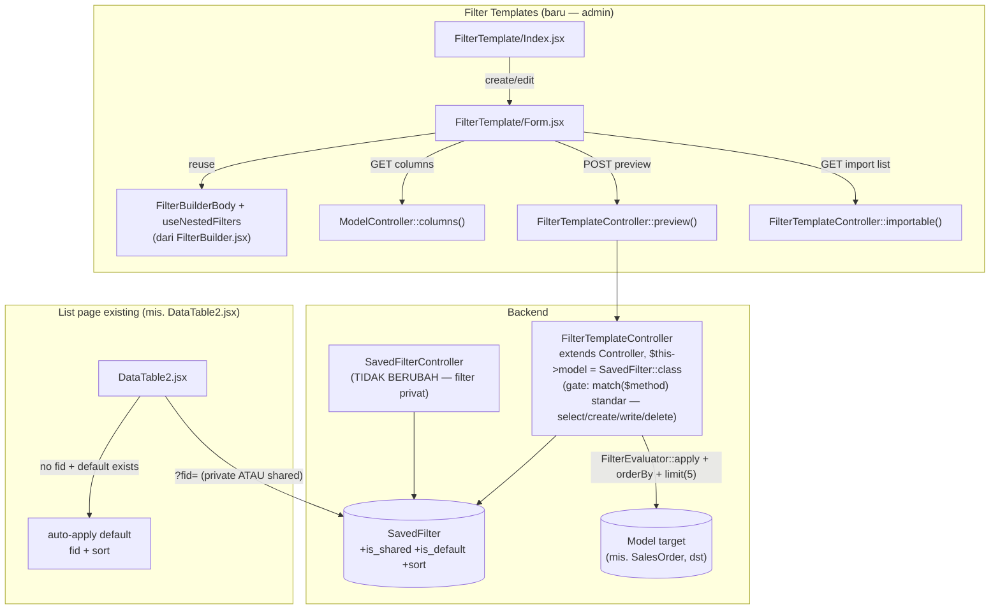

# Design Document: saved-filter-management

## Overview

Fitur ini menambah axis **shared** + **default** ke `SavedFilter` (existing, 100% private per `user_id`) dan menyediakan halaman admin **Filter Templates** di module Core untuk mengelolanya. Pattern utama:

- **Skema**: 3 kolom baru di `saved_filters` (`is_shared`, `is_default`, `sort`) — TIDAK mengubah makna `is_saved`/`is_saved=false` (ephemeral) yang sudah ada.
- **Controller baru** `FilterTemplateController` (bukan menambah method ke `SavedFilterController` yang ada) — alasan di [Components and Interfaces](#components-and-interfaces).
- **FE builder di-reuse**, bukan dibangun ulang: `FilterBuilderBody` + `useNestedFilters` (inti `FilterTable2.jsx`) dipakai standalone di `FilterTemplate/Form.jsx`, TANPA membungkus seluruh `FilterTable2` (yang punya `SavedFilterBar`/`SaveFilterControl` sendiri untuk filter privat — beda konsen dengan form admin).
- **Registry model target** memakai `MenuItem.model` yang SUDAH ada (setiap entry menu di `DeskSeeder` sudah menyimpan FQCN model-nya) — tidak perlu tabel/registry baru untuk dropdown "pilih model".
- **Preview 5-row** memakai `FilterEvaluator` + `FilterColumnResolver` yang SUDAH ada (dipakai `ModelController`/`DataTableScope`), bukan endpoint pencarian baru dari nol.
- **`SavedFilter` model adopsi `App\Traits\DataTable`** (`use DataTable, HasFactory, HasUlids;`) — SAMA seperti model admin lain (`EmailTemplate`, `PrintTemplate`, dst). Ini memberi TIGA hal sekaligus: (a) registrasi `Permission` OTOMATIS lewat `initPermissions()` (lihat bawah — TIDAK perlu seeder manual), (b) audit-trail create/update GRATIS lewat hook `bootDataTable()` (`AuditableModelSaved` event + `Log::create`) — langsung memenuhi Requirement 3 AC 4 tanpa kode audit custom, (c) kolom `is_example` (prasyarat `HasExampleData`) — `initPermissions()` sendiri yang nambahin via `Schema::table()` bila belum ada, SavedFilterTest existing sudah antisipasi ini juga (lihat setUp-nya).
- **Nama tampilan "Filter Templates" vs nama class `SavedFilter`**: AMAN didaftarkan beda — `SavedFilter::$alias = 'Filter Template'` (static property, precedented) membuat `Permission.name` otomatis jadi "Filter Templates" (di-pluralize `initPermissions()`), TANPA menyentuh nama class/tabel. TAPI ada satu titik kopling nyata yang perlu di-override manual: `getNameClass()` (dipakai breadcrumb/`DataTableScope`/`CommandSearchIndexService` utk bangun link navigasi) default-nya balik ke `savedFilter` (dari nama class) — kalau dibiarkan, link2 itu nyasar ke route `savedFilters.*` yang gak pernah didaftarkan (actual route-nya `filterTemplates.*`). Fix: override `getNameClass()` juga, PERSIS pola yang sudah dipakai `StockLedgerEntry` (`app/Models/Inventory/StockLedgerEntry.php:88-113`) untuk kasus SAMA PERSIS (nama class ≠ nama route resource). Detail lengkap di [Components](#components-and-interfaces).
- **Permission**: pola STANDAR yang sudah dipakai semua controller admin lain (`EmailTemplateController`, `PrintTemplateController`, dst) — `FilterTemplateController extends Controller` dengan `$this->model = SavedFilter::class`, permission per-action di-cek OTOMATIS oleh dispatcher `match($method)` di `app/Http/Controllers/Controller.php:143-169` (index→select, store→create, update→write, destroy→delete). Method custom (`preview`, `models`) di-map ke `read`, `setDefault` ke `write`, lewat override `enforcePermission()`.

Yang **tidak berubah**: `SavedFilterController` (CRUD filter privat per-user, dipakai `FilterTable2.jsx`), skema `is_saved`/ephemeral, mekanisme share-link `?fid=` untuk filter privat.

## Architecture



### Data Flow — Create shared filter dari Filter Templates

1. Pengelola buka `Filter Templates` → `Buat Baru` → pilih `model` (dropdown dari `MenuItem::whereNotNull('model')`).
2. FE fetch kolom model via `ModelController::columns($model)` (endpoint SUDAH ADA, dipakai `LinkModel`/lookup lain) → suntik ke `NestedFiltersProvider`.
3. (Opsional) Pengelola pilih "Import dari filter lain" → FE fetch daftar saved filter (private+shared) utk `model` itu via `SavedFilterController::index` yang sudah ada → `setFromInitial(picked.filter)`.
4. Pengelola susun tree via `FilterBuilderBody`, atur `sort` (Select kolom + toggle asc/desc), klik `Preview` → POST ke `FilterTemplateController::preview` → tabel 5-row.
5. Simpan → POST `FilterTemplateController::store` → row baru `is_saved=true, is_shared=true`.

### Data Flow — Auto-apply default di list page

1. `DataTable2.jsx` mount, baca `query?.fid` (lihat baris 170 file itu).
2. IF `fid` kosong DAN ada default shared filter utk `model` halaman itu (dikirim via Inertia props halaman, bukan request terpisah — lihat [Components](#components-and-interfaces)) → `setOptions(prev => ({...prev, fid: defaultFilter.id, sort: defaultFilter.sort ?? prev.sort}))`.
3. User pilih/ubah filter lain secara eksplisit → `fid`/`sort` berubah normal seperti sekarang, default TIDAK dipaksakan lagi (state React sudah lepas dari "belum ada filter").

## Components and Interfaces

### Backend

**Migration** `add_shared_columns_to_saved_filters_table`:
```php
Schema::table('saved_filters', function (Blueprint $table) {
    $table->boolean('is_shared')->default(false)->after('is_saved');
    $table->boolean('is_default')->default(false)->after('is_shared');
    $table->string('sort')->nullable()->after('filter');
    // is_example: prasyarat HasExampleData (dibawa trait DataTable, lihat Overview).
    $table->boolean('is_example')->default(false)->after('sort');
    $table->index(['model', 'is_shared']);
    $table->index(['model', 'is_default']);
});
```

**`app/Models/Core/SavedFilter.php`** — adopsi trait `DataTable` (lihat Overview) + scope baru, TIDAK mengubah `scopeOwnedListing` existing:
```php
use App\Traits\DataTable;
// ...
class SavedFilter extends Model {
    use DataTable, HasFactory, HasUlids;

    // Dipakai initPermissions() → Permission.name = Str::plural($alias) = "Filter Templates".
    public static string $alias = 'Filter Template';

    // Breadcrumb (Controller::setBreadcrumbs) & DataTableScope::addDataTable()
    // (link isLink kolom di DataTable2.jsx) pakai ini utk bangun nama route —
    // default-nya dari nama class ('savedFilter'), di-override krn actual route
    // resource-nya 'filterTemplate' (lihat routes/web.php). Pola SAMA PERSIS
    // StockLedgerEntry::getNameClass() (app/Models/Inventory/StockLedgerEntry.php:111).
    // CATATAN: initPermissions() SENDIRI tidak pakai method ini (pakai nama class
    // mentah langsung) — jadi kolom `permissions.route` di DB akan tetap
    // 'savedFilters', BUKAN 'filterTemplates'. Ini SAMA seperti StockLedgerEntry
    // (kolom route-nya juga "salah" secara harfiah) — dikonfirmasi TIDAK ada
    // consumer runtime yang baca `permissions.route`, jadi harmless.
    public function getNameClass() {
        return 'filterTemplate';
    }

    // Breadcrumb/page-title text (lang/{locale}/core/filterTemplate.php — BARU,
    // namespace terpisah dari core.savedFilter krn belum ada existing).
    public string $translateKey = 'core.filterTemplate';
    // ...
}

/** Listing gabungan private+shared utk dropdown filter di list page. */
public function scopeVisibleTo(Builder $query, string $userId, string $model): Builder {
    return $query->where('is_saved', true)
        ->where('model', $model)
        ->where(fn ($q) => $q->where('user_id', $userId)->orWhere('is_shared', true));
}

/** Listing admin: semua shared filter (lintas model bila $model null). */
public function scopeSharedListing(Builder $query, ?string $model = null): Builder {
    $query->where('is_shared', true);
    return $model ? $query->where('model', $model) : $query;
}

public function scopeDefaultFor(Builder $query, string $model): Builder {
    return $query->where('model', $model)->where('is_shared', true)->where('is_default', true);
}
```

**Routes** (`routes/web.php`) — pola SAMA `printTemplate`/`emailTemplate`, nama resource `filterTemplate` (cocok dgn `SavedFilter::getNameClass()` override di atas → `filterTemplates.*`, BUKAN `savedFilters.*`):
```php
Route::resourceDetail('filterTemplate', FilterTemplateController::class);
Route::post('/filterTemplates/{savedFilter}/setDefault', [FilterTemplateController::class, 'setDefault'])->name('filterTemplates.setDefault');
Route::post('/filterTemplates/preview', [FilterTemplateController::class, 'preview'])->name('filterTemplates.preview');
Route::get('/filterTemplates/models', [FilterTemplateController::class, 'models'])->name('filterTemplates.models');
```

**`app/Http/Controllers/Core/FilterTemplateController.php`** (BARU) — ikut pola STANDAR controller admin (sama seperti `EmailTemplateController`/`PrintTemplateController`), bukan gate custom:
```php
class FilterTemplateController extends Controller {
    public function __construct(Request $request) {
        parent::__construct($request, SavedFilter::class);
    }

    // Method custom (bukan salah satu key match() bawaan di Controller.php)
    // di-map manual ke permission key standar. preview/models = baca data
    // (setara 'read', selaras action show/detail lain); setDefault = mutasi
    // (setara 'write', selaras action update lain).
    protected function enforcePermission(string $method) {
        return match ($method) {
            'preview', 'models' => 'read',
            'setDefault'         => 'write',
            default              => null,
        };
    }

    public function index(Request $request): JsonResponse { /* SavedFilter::sharedListing($request->model)->with('user')->get() */ }
    public function store(StoreFilterTemplateRequest $request): JsonResponse { /* is_saved=true, is_shared=true, user_id=auth */ }
    public function update(UpdateFilterTemplateRequest $request, SavedFilter $savedFilter): JsonResponse { /* filter/name/sort */ }
    public function destroy(SavedFilter $savedFilter): JsonResponse { /* + audit log */ }
    public function setDefault(SavedFilter $savedFilter): JsonResponse { /* transaksi: unset default lama model sama, set ini */ }
    public function preview(PreviewFilterTemplateRequest $request): JsonResponse { /* lihat di bawah */ }
    public function models(): JsonResponse { /* MenuItem::whereNotNull('model')->select('model','label')->distinct()->get() */ }
}
```

`parent::__construct($request, SavedFilter::class)` mengaktifkan dispatcher permission STANDAR di `Controller::__construct` (`app/Http/Controllers/Controller.php:131-197`) — method action di-map otomatis lewat `match($method)`: `index→select, store→create, update→write, destroy→delete`. Ini PERSIS mekanisme yang sudah dipakai `EmailTemplateController`/`PrintTemplateController`, BUKAN gate satu-flag custom seperti draft sebelumnya (`Permission::Share` yang di-repurpose) — koreksi user: akses Filter Templates harus lewat jalur permission normal, bukan flag ad-hoc.

**Prasyarat: `SavedFilter` harus terdaftar di registry `Permission`.** Dispatcher di atas 403 total bila `$request->session()->get('permissions')[SavedFilter::class]` tidak ada. TIDAK perlu seeder manual baru — `database/seeders/PermissionSeeder.php` SUDAH melakukan auto-discovery: scan seluruh class di namespace `App\Models` lewat Composer classmap, dan untuk tiap class yang `use DataTable` trait, panggil `$className::initPermissions()` (`PermissionSeeder.php:119-143`). Method `initPermissions()` (`app/Traits/DataTable.php:464` dst) yang menulis row `Permission` via `updateOrCreate(['model' => static::class], ['module' => ..., 'name' => Str::plural($alias), 'route' => ..., 'permissions' => [8 key standar], ...])` — begitu `SavedFilter` adopsi trait + set `$alias`, cukup jalankan ULANG `PermissionSeeder` (`php artisan db:seed --class=PermissionSeeder`) sebagai bagian rollout fitur ini, row `Permission` ke-provision otomatis dengan `name = "Filter Templates"`. Baru SETELAH row itu ada, admin bisa grant akses ke role lewat halaman Role management (UI biasa, bukan seeder) — TIDAK perlu grant hardcoded di kode.

Precedent seeder manual seperti `NumberCardChartPermissionSeeder.php` HANYA dipakai utk kasus migrasi (pecah 1 model lama jadi 2 model baru, perlu COPY grant existing) — bukan pola default. Model baru murni (kasus `SavedFilter`) cukup lewat auto-discovery di atas.

**Preview — reuse langsung, BUKAN endpoint pencarian baru:**
```php
public function preview(PreviewFilterTemplateRequest $request): JsonResponse {
    $model   = $request->model; // FQCN, divalidasi ada di MenuItem::model registry
    $columns = $model::getColumns(1);

    $query = $model::query();
    (new FilterEvaluator($columns))->apply($query, $request->filter ?? ['root' => ['k' => 'and', 'c' => []]]);
    if ($sort = $request->sort) {
        [$col, $dir] = str_starts_with($sort, '-') ? [substr($sort, 1), 'desc'] : [$sort, 'asc'];
        $query->orderBy($col, $dir);
    }

    // Batasi kolom: hanya yang show=true di getColumns (kolom yg memang tampil
    // di list page model itu) — BUKAN full safeLookupColumns ModelController
    // (itu utk endpoint publik lintas-user; preview ini sudah di-gate permission
    // 'read' pada SavedFilter, pengelola memang boleh lihat kolom list biasa).
    $visible = collect($columns)->where('show', true)->pluck('name')->push('id')->unique();
    $rows    = $query->limit(5)->get($visible->all());

    return response()->json(['columns' => $columns, 'data' => $rows]);
}
```

### Frontend

- `resources/js/Pages/Core/FilterTemplate/Index.jsx` — tabel shared filter (grouped by model), kolom: nama, model, pembuat, updated_at, badge Default; aksi: Edit, Set Default, Delete.
- `resources/js/Pages/Core/FilterTemplate/Form.jsx` — dipakai untuk create & edit (pola sama `EmailTemplate/Form.jsx`):
  - `<Select>` model (dari `filterTemplates.models`), disabled saat edit (ubah model = ubah arti tree, lebih aman minta buat baru).
  - `<NestedFiltersProvider columns={fetchedColumns}><FilterBuilderBody /></NestedFiltersProvider>` — komponen builder DI-REUSE dari `FilterBuilder.jsx`, TANPA `AlertDialog`/`SavedFilterBar` pembungkus `FilterTable2` (itu untuk konteks dialog filter privat di list page, bukan form admin halaman penuh).
  - `ImportFromFilter` — `<Select>` sederhana: daftar saved filter (private+shared) utk model terpilih (reuse `saved-filters.index` yang sudah ada), `onChange` → `setFromInitial(tree)` (hook `useNestedFilters` sudah expose ini, dipakai persis sama di `FilterTableContent`).
  - `SortField` — `<Select kolom> + toggle asc/desc`, serialize ke string `"-kolom"`/`"kolom"` (format sama `DataTableScope`).
  - `PreviewPanel` — tombol Preview → POST `filterTemplates.preview` dgn `{model, filter: currentTree, sort}` → render tabel maks 5 row pakai kolom dari response.
- **`DataTable2.jsx`** (MODIFIKASI kecil): terima `defaultFilter` dari Inertia props halaman (di-load server-side, 1 query tambahan `SavedFilter::defaultFor($model)->first()` di controller list page — TIDAK ada request FE tambahan), auto-set `fid`+`sort` saat `!query?.fid` pada mount (lihat Data Flow di atas).

## Data Models

```php
// saved_filters (kolom baru)
is_shared  boolean default false   // shared filter: named + visible-global
is_default boolean default false   // shared filter yg auto-applied; max 1 per model (service layer)
sort       string nullable         // format "-kolom" | "kolom", null = tak override sort halaman
```

```ts
// FE — bentuk row SavedFilter (index/import/preview), superset dari yg sudah ada
type SavedFilterRow = {
  id: string;
  name: string | null;
  model: string;
  filter: FilterTree;      // { root: { k: 'and'|'or', c: {...} } } — TIDAK berubah
  sort: string | null;     // BARU
  is_shared: boolean;      // BARU
  is_default: boolean;     // BARU
  user?: { id: string; name: string }; // BARU — hanya di listing Filter Templates (creator)
};
```

## Correctness Properties

**P1 — Default tunggal per model.** _For any_ urutan operasi `setDefault(A)` lalu `setDefault(B)` pada `model` yang sama, SETELAH kedua operasi HANYA `B` yang `is_default=true` untuk `model` tsb — tidak pernah 0 atau 2 default di titik akhir yang stabil. (Validates: Req 4 AC 6, Req 1 AC 7)

**P2 — is_default menyiratkan is_shared.** _For any_ row `SavedFilter`, `is_default=true` IMPLIES `is_shared=true`. Tidak ada jalur (create/update) yang bisa menghasilkan `is_default=true, is_shared=false`. (Validates: Req 4 AC 6)

**P3 — Fork-on-edit tidak pernah menimpa shared filter asal.** _For any_ user BUKAN pengelola yang mengubah tree hasil pilih shared filter lalu Apply, row `SavedFilter` shared ASAL tetap tidak berubah (`filter`/`sort`/`updated_at` sama); yang berubah adalah row BARU milik user tsb. (Validates: Req 2 AC 3)

**P4 — Preview tidak memerlukan filter tersimpan.** _For any_ filter tree valid (termasuk tree kosong/draft), memanggil `preview` TIDAK membuat/mengubah row `SavedFilter` apa pun — murni read query. (Validates: Req 4 AC 9, Req 1 AC 3c)

**P5 — Non-pengelola tidak bisa mengubah axis shared.** _For any_ user tanpa permission `select` (baca) pada `SavedFilter` (level akses Filter Templates, dicek dispatcher standar `Controller::__construct`), akses `filterTemplates.index` mengembalikan 403 — user tanpa `create`/`write`/`delete` yang relevan mendapat 403 di action yang sesuai. TAPI user tsb tetap bisa create/update/delete filter PRIVATnya sendiri via `SavedFilterController` seperti biasa (regression check — controller itu tidak pernah memanggil `parent::__construct` dengan model, sehingga tidak pernah tersentuh dispatcher permission ini). (Validates: Req 3 AC 2, AC 3)

**P6 — Akses Filter Templates lintas-model, independen dari permission model target.** _For any_ pengelola (punya permission `select`/`create`/`write` pada `SavedFilter` via Filter Templates) dan _for any_ model `M` yang terdaftar di `MenuItem.model`, pengelola dapat memanggil `preview`/`store`/`update` untuk `M` — HASIL TIDAK BERGANTUNG pada apakah pengelola tsb punya permission apa pun atas `M` secara terpisah, karena dispatcher permission `FilterTemplateController` HANYA mengecek permission atas `SavedFilter::class` (model yang di-bind di constructor), tidak pernah mengecek `$model` (target FQCN dari body request). Uji dgn pengelola yang SENGAJA tidak diberi permission apa pun atas suatu model (mis. `AssetCategory`) — preview/store tetap sukses. (Validates: Req 3 AC 5)

## Error Handling

| Scenario | Behavior |
|----------|----------|
| User tanpa permission (`select`/`create`/`write`/`delete` sesuai action) pada `SavedFilter` akses route `filterTemplates.*` | 403 — otomatis dari dispatcher standar `Controller::__construct` (BUKAN `abort_if` custom) |
| `setDefault` dipanggil pada filter dengan `is_shared=false` | 422 validation error ("hanya shared filter bisa jadi default") |
| `preview` dgn `model` yang TIDAK ada di registry `MenuItem::model` | 422 ("model tidak dikenal/tidak terdaftar sbg menu") — cegah probing model arbitrary via FQCN string |
| `preview`/`store` dgn filter tree invalid (key kolom tak dikenal) | 422, reuse `validateTree` (FE) + `FilterEvaluator` akan skip node tak dikenal (BE, fail-open pada level query, TIDAK exception) — FE tetap wajib validasi dulu spt `FilterTable2` sekarang |
| Hapus shared filter yang sedang jadi default | `is_default` ikut hilang (row terhapus); TIDAK ada shared filter lain yang otomatis naik jadi default (lihat Req 1 AC 8) |
| `store`/`update`/`preview` dgn `model` yang pengelola SENDIRI tidak punya permission apa pun atasnya | TETAP DIIZINKAN (Req 3 AC 5, P6) — dispatcher hanya cek permission atas `SavedFilter`, bukan atas `$model` target. Satu-satunya syarat model: harus terdaftar di `MenuItem.model` (baris di atas) |

## Testing Strategy

- **Unit/Feature (PHPUnit)**:
  - `FilterTemplateControllerTest`: CRUD, permission gate standar per-action (403 tanpa `select`/`create`/`write`/`delete`/`read` sesuai method — P5; `preview`/`models` butuh `read`, `setDefault` butuh `write`), `setDefault` (P1/P2), `preview` (P4, limit 5, kolom dibatasi `show=true`), akses lintas-model pengelola tanpa permission model target (P6).
  - `SavedFilterTest` audit-trail (EXTEND): create/update shared filter menghasilkan `Log` entry via hook `bootDataTable()` (Requirement 3 AC 4) — verifikasi trait `DataTable` beneran nge-trigger, bukan asumsi.
  - `initPermissions()` test: `SavedFilter::initPermissions()` dipanggil langsung (pola sama `tests/Unit/Sales/SalesOrderItemReferenceableBillingTest.php` dkk) → assert row `Permission` ter-provision dgn `name = "Filter Templates"` (dari `$alias`), 8 permission key standar ada.
  - `getNameClass()` test: assert `SavedFilter::getNameClass() === 'filterTemplate'` — regression guard spt `StockLedgerControllerTest.php:192` (skenario SAMA: nama class ≠ nama route resource, komentarnya eksplisit soal ini).
  - `SavedFilterTest` (existing, EXTEND): `scopeVisibleTo` gabung private+shared, `scopeDefaultFor`.
  - Regression: `SavedFilterController` existing test tetap hijau tanpa modifikasi (private filter flow tak tersentuh).
- **Property-Based** (bila ada fungsi pure yang cocok, mis. parser format `sort` "-kolom"/"kolom" ke `[col, dir]`) — `fast-check`, precondition selaras validasi source (lihat aturan project soal `fc.pre`).
- **RTL (`.rtl.test.jsx`)**:
  - `FilterTemplate/Form.rtl.test.jsx`: pilih model → kolom termuat, builder reuse berfungsi, Import memuat tree, Preview menampilkan ≤5 row, submit.
  - `DataTable2.rtl.test.jsx` (EXTEND): auto-apply default saat tak ada `fid`, TIDAK override saat user sudah pilih filter lain.
