# Design Document: soft-delete-relation-context

## Overview

Solusi ini terdiri dari **tiga mekanisme independen**, satu per konteks (List, Show, Validasi) — bukan satu mekanisme generik yang dipaksakan ke semua konteks. Ini konsekuensi langsung dari temuan riset: tidak ada satu titik request-level yang membedakan "mode List" vs "mode Show" di codebase saat ini (`ModelController::__invoke()`/`selectData()` tidak punya flag semacam itu), dan constraint Requirement 4.1 melarang trait generik yang memaksa logic seragam.

**Yang berubah:**
1. `app/Models/Scopes/DataTableScope.php` — macro `dataTable()` disuntik `withTrashed()` otomatis untuk semua relasi yang di-eager-load, khusus konteks List. **Satu titik ubah, berlaku ke semua model** karena macro ini titik sentral tunggal semua query List (dikonfirmasi riset: `ModelController::selectData()` dan seluruh index route lewat `$query->dataTable($request)`).
2. `app/Traits/LinkModel.php` — `loadRelations()` ditambah parameter opsional untuk memuat relasi dengan `withTrashed()`, khusus konteks Show. Tidak ada flag runtime baru — `deleted_at` bawaan relasi sudah ikut ter-serialize apa adanya dan cukup jadi sinyal.
3. `app/Traits/LinkModel.php:78-80` (`initializeLinkModel()`) — metadata default global kolom `deleted_at` ditambah `forceSelect: true`. **Wajib**, karena tanpa ini `deleted_at` dibuang oleh dua whitelist terpisah sebelum sampai ke frontend (lihat "Gap ditemukan" di bawah).
4. `app/Models/User/Assignable.php:14-16` — hapus `'ignore' => true` dari `configColumns['deleted_at']`, supaya kolom ini ikut ter-*expose* untuk kasus lookup-by-id (histori). `scopeLinkModel()` (baris 30-33) TIDAK diubah — filter `whereNull('deleted_at')` di situ memang disengaja untuk dropdown pencarian assignee baru (jangan tawarkan opsi assignee yang sudah dihapus), konsisten dengan R2.6.
5. Custom Rule class baru `app/Rules/ExistsExcludingTrashed.php` menggantikan string rule `'exists:table,column'` di FormRequest yang menyasar model ber-SoftDeletes.
6. Frontend `resources/js/Components/LinkModel.jsx` membaca `value?.deleted_at` pada data relasi yang diterima, render badge peringatan, dan memblokir submit sampai field master-data-operasional diisi ulang.

**Gap ditemukan saat riset lanjutan (penting):** asumsi awal "`deleted_at` otomatis ikut serialize karena bukan kolom `$hidden`" **tidak cukup** untuk dua jalur nyata:
- `ModelController::safeLookupColumns()`/`filterRowColumns()` (baris 162-258, 301-356) — whitelist response-level khusus endpoint `__invoke()` (dropdown `LinkModel.jsx`) dan `selectData()`. Kolom non-relasi HANYA lolos kalau ber-`forceSelect: true` ATAU (ber-`linkable: true` DAN diminta eksplisit lewat prop `fields` dari frontend). `deleted_at` tidak masuk kategori manapun secara default → **selalu dibuang** di jalur dropdown LinkModel.
- `DataTableColumnSelector::effectiveVisibleHeads()` (`app/Services/Core/DataTableColumnSelector.php:946-974`) — SELECT-level pruning untuk model ROOT di macro `dataTable()`. Kolom hanya masuk SELECT kalau `show: true`/`forceSelect: true` atau ada di cookie `visibleKeys` user. Ada mitigasi partial: `scopeColumns()` (baris 416-435) memaksa `deleted_at` ikut SELECT untuk **relasi child** yang di-eager-load — tapi tidak untuk model ROOT itu sendiri.

Kedua whitelist ini ternyata membaca flag config yang **sama**: `forceSelect` (dikonfirmasi di `ModelController.php:235`, `DataTableColumnSelector.php:950,968`, dan sudah dipakai model lain sebagai preseden — `app/Models/Inventory/ItemVariant.php:80`). Jadi satu perubahan (poin 3 di atas) menutup kedua celah sekaligus — bukan dua titik ubah terpisah seperti dugaan awal.

**Yang TIDAK berubah:**
- Definisi relasi (`belongsTo`/`morphTo`/`belongsToMany`) di masing-masing model tetap seperti sekarang — tidak ada penambahan `withTrashed()` manual di tiap method relasi (kecuali pola existing `PurchaseRequestItem` yang tetap dipertahankan sebagai override, sesuai R4.2).
- Struktur serialisasi umum (masih model Eloquent langsung ke Inertia, bukan pindah ke API Resources — di luar scope).
- Mekanisme `withTrashed()` bawaan Laravel di level relation builder (`BelongsTo::withTrashed()`, `MorphTo::withTrashed()`) — dipakai sebagai building block, bukan diganti.

## Architecture

```mermaid
flowchart TD
    subgraph List["Konteks List (Req 1)"]
        A[Request ke Index/DataTable] --> B["DataTableScope::addDataTable() macro"]
        B --> C["Sebelum $query->with(...):<br/>bungkus tiap relasi eager-load<br/>dengan withTrashed()"]
        C --> D[Baris List tampil lengkap,<br/>termasuk nama relasi yang sudah terhapus]
    end

    subgraph Show["Konteks Show/Edit (Req 2)"]
        E[Request ke Show/Edit] --> F["Model::loadRelations([], withTrashed: true)"]
        F --> G["Load relasi dengan withTrashed()<br/>deleted_at ikut terserialize apa adanya"]
        G --> I[Serialize ke Inertia props]
        I --> J["LinkModel.jsx: baca relation.deleted_at<br/>render badge + wajib isi ulang jika draft & operasional"]
    end

    subgraph Validate["Konteks Validasi (Req 3)"]
        K[Submit form create/update] --> L["FormRequest rules()"]
        L --> M["ExistsExcludingTrashed::validate()"]
        M -->|record trashed| N[Validasi gagal, error jelas]
        M -->|record aktif| O[Validasi lolos]
    end
```



### Data Flow — Show/Edit (paling kompleks)

1. Controller model (mis. `ItemController::show()`) memanggil `$item->loadRelations([], withTrashed: true)`.
2. Method ini (lihat Components) memuat tiap relasi yang terdaftar di `loadRelationsOnShow()` model dengan `withTrashed()` — tidak ada atribut tambahan yang di-set; kolom `deleted_at` pada relasi trashed sudah otomatis berisi nilai (bukan `null`) karena relasi itu sendiri tidak lagi di-exclude query.
3. Model di-`toArray()` seperti biasa ke Inertia — `deleted_at` ikut karena memang kolom biasa, tidak ada model yang menyembunyikannya di `$hidden` (dikonfirmasi: hanya `User` punya `$hidden`, isinya `password`/`remember_token`).
4. Frontend `LinkModel.jsx` menerima data relasi apa adanya, cek `value?.deleted_at != null` untuk memutuskan render badge.
5. Kalau field relasi termasuk daftar "master data operasional" (ditentukan per Form component, lihat Data Models) DAN dokumen berstatus draft DAN `deleted_at` relasi terisi → form tidak bisa disubmit sampai field itu diisi ulang.

## Components and Interfaces

### 0. `app/Traits/LinkModel.php` + `app/Models/User/Assignable.php` — pastikan `deleted_at` selalu bisa keluar (prasyarat)

**Wajib dikerjakan lebih dulu** dari Component 1 dan 2 — tanpa ini, `withTrashed()` di titik manapun tetap percuma karena kolom `deleted_at` sudah dibuang duluan oleh whitelist kolom sebelum sampai ke response/frontend.

`app/Traits/LinkModel.php:78-80` (`initializeLinkModel()`), tambah `forceSelect`:

```php
// Sebelum:
'deleted_at' => [
    'titleTrans' => 'core.form.deleted_at',
],

// Sesudah:
'deleted_at' => [
    'titleTrans'  => 'core.form.deleted_at',
    'forceSelect' => true,
],
```

**Kenapa `forceSelect` dan bukan `linkable`/`show`:** `forceSelect` adalah flag yang sudah dipakai project untuk kasus identik — "kolom ini harus selalu ikut, terlepas dari request/cookie visibility user" (preseden: `app/Models/Inventory/ItemVariant.php:80`). Ini dibaca oleh KEDUA whitelist yang jadi gap:
- `ModelController::safeLookupColumns()` baris 235-236 — `forceSelect` lolos tanpa syarat `linkable`/`fields` dari request.
- `DataTableColumnSelector::effectiveVisibleHeads()` baris 950,968 — `forceSelect` masuk SELECT tanpa syarat cookie `visibleKeys`.

`linkable` ditolak karena masih mensyaratkan frontend mengirim `fields` secara eksplisit (baris 241 `ModelController.php`) — artinya tiap wrapper `LinkModel.jsx` (`CategoryLinkModel.jsx`, dst) harus diubah satu-satu untuk mulai mengirim `fields: ['deleted_at']`, bertentangan dengan tujuan "sedikit titik ubah, berlaku global" (R4).

`app/Models/User/Assignable.php:13-17`, hapus `ignore`:

```php
// Sebelum:
protected array $configColumns = [
    'deleted_at' => [
        'ignore' => true,
    ],
];

// Sesudah:
protected array $configColumns = [];
```

`scopeLinkModel()` (baris 30-33 file yang sama) **tidak diubah** — filternya menyaring OPSI dropdown pencarian baru (assignee yang sudah soft-deleted memang tidak boleh muncul sebagai pilihan baru), berbeda dari lookup-by-id untuk histori tersimpan yang tetap harus resolve dengan `deleted_at` terbaca (dikonfirmasi oleh komentar existing di file itu sendiri, baris 23-28).

**Audit susulan yang direkomendasikan (bukan Component wajib, tapi perlu dicek saat implementasi):** grep `'ignore'\s*=>\s*true` di seluruh `app/Models` untuk memastikan tidak ada model LAIN yang menyembunyikan `deleted_at` dengan pola sama seperti `Assignable` — riset sejauh ini hanya menemukan satu model dengan override eksplisit untuk `deleted_at`, tapi audit menyeluruh sebaiknya dilakukan sebagai bagian dari task implementasi, bukan diasumsikan lengkap dari sampling.

### 1. `app/Models/Scopes/DataTableScope.php` — macro `dataTable()` (List)

Lokasi suntik: sebelum baris `$query->with($withKeys)` (sekitar baris 147, riset menunjukkan perakitan `$with` selesai di baris 137-147).

```php
// Sebelum $query->with($withKeys) dipanggil:
$withKeys = collect($withKeys)->mapWithKeys(function ($constraints, $key) {
    // $key bisa "account" atau "account.branch" (nested) — hanya proses segmen relasi langsung
    return [$key => function ($relationQuery) use ($constraints) {
        if (is_callable($constraints)) {
            $constraints($relationQuery);
        }
        if (in_array(SoftDeletes::class, class_uses_recursive($relationQuery->getModel()))) {
            $relationQuery->withTrashed();
        }
    }];
})->all();

$query->with($withKeys);
```

**Kenapa di titik ini, bukan di definisi relasi model:** `with()` menerima closure per-relasi yang menerima `Relation|Builder` — closure ini punya akses `getModel()` untuk cek trait `SoftDeletes` tanpa tahu apa pun soal jenis relasinya (belongsTo/morphTo/belongsToMany semua punya `withTrashed()` yang sama karena berasal dari trait `SoftDeletes` pada relation class). Satu blok kode, berlaku ke seluruh model yang lewat macro ini — memenuhi R1.2 dan R4.3 (khusus konteks List).

**morphTo catatan:** relasi morphTo dengan multiple kemungkinan target class butuh penanganan `MorphTo::constrain()` per-tipe — kalau ditemukan saat implementasi bahwa closure tunggal tidak cukup untuk morphTo majemuk, fallback ke `$relationQuery->withTrashed()` tetap valid karena `MorphTo` juga extends `Relation` yang delegasikan ke masing-masing sub-query per tipe.

### 2. `app/Traits/LinkModel.php` — parameter baru pada `loadRelations()` (Show)

Tidak perlu flag runtime terpisah — kolom `deleted_at` sudah ikut ter-serialize apa adanya di `toArray()` (dikonfirmasi: tidak ada model relasi yang menyembunyikannya via `$hidden`, kecuali `User` yang hanya hide `password`/`remember_token`). Frontend cukup baca `relation.deleted_at !== null` sebagai sinyal — jadi backend cukup memuat relasi dengan `withTrashed()`, tanpa logic tambahan menandai apa pun:

```php
public function loadRelations($relations = [], bool $withTrashed = false) {
    $toLoad = static::getRelationKeys(false, $relations);

    if (! $withTrashed) {
        $this->load($toLoad);
        return;
    }

    foreach ($toLoad as $key => $constraint) {
        $this->load([$key => function ($query) use ($constraint) {
            if (is_callable($constraint)) {
                $constraint($query);
            }
            if (in_array(SoftDeletes::class, class_uses_recursive($query->getModel()))) {
                $query->withTrashed();
            }
        }]);
    }
}
```

Controller Show (mis. `AccountController::show()`, `ItemController::show()`) mengganti `$model->loadRelations()` menjadi `$model->loadRelations([], withTrashed: true)`.

**Kenapa opt-in via parameter, bukan default:** mengubah default `loadRelations()` berarti perilaku List juga bisa ikut kena kalau ada pemanggilan `loadRelations()` di luar jalur `DataTableScope` (mis. `ModelController::__invoke()` untuk dropdown lookup) — parameter eksplisit menghindari efek samping tak terduga, sesuai instruksi "hanya mengubah sedikit kode" dengan blast radius terkendali.

### 3. `app/Rules/ExistsExcludingTrashed.php` — custom Rule (Validasi)

Struktur mengikuti pola existing `app/Rules/FormatVariantValidation.php` (satu-satunya contoh `ValidationRule` di project):

```php
<?php

namespace App\Rules;

use Closure;
use Illuminate\Contracts\Validation\ValidationRule;
use Illuminate\Support\Facades\DB;

class ExistsExcludingTrashed implements ValidationRule {
    public function __construct(
        private readonly string $table,
        private readonly string $column = 'id',
    ) {}

    public function validate(string $attribute, mixed $value, Closure $fail): void {
        $exists = DB::table($this->table)
            ->where($this->column, $value)
            ->whereNull('deleted_at')
            ->exists();

        if (! $exists) {
            $fail('validation.exists')->translate();
        }
    }
}
```

Dipakai di FormRequest menggantikan string `'exists:table,column'`:

```php
// Sebelum:
'parent_account.id' => ['required', 'exists:accounts,id'],

// Sesudah:
'parent_account.id' => ['required', new ExistsExcludingTrashed('accounts')],
```

**Kenapa custom Rule, bukan `Rule::exists()->whereNull()`:** `Rule::exists('accounts', 'id')->where(fn ($q) => $q->whereNull('deleted_at'))` sebenarnya valid dan lebih pendek — tapi tersebar di 33 file/77+ baris akan menghasilkan closure berulang yang mudah lupa di-copy salah satu instance. Custom Rule class memberi satu nama yang jelas maksudnya (`ExistsExcludingTrashed`) dan satu titik untuk audit/ubah perilaku (mis. kalau nanti perlu exception untuk konteks read vs write sesuai R3.3).

**R3.3 (rule tidak berlaku di operasi baca):** custom Rule ini hanya dipasang di `rules()` FormRequest untuk endpoint `store`/`update` — endpoint baca (`show`/`index`) tidak melalui FormRequest validasi sama sekali di controller model (dikonfirmasi pola existing), jadi requirement ini otomatis terpenuhi oleh struktur routing yang sudah ada, tidak perlu logic tambahan.

### 4. Frontend `resources/js/Components/LinkModel.jsx`

Tambahan pada komponen (lokasi persis ditentukan saat implementasi, mengikuti struktur `validate()` yang sudah ada di `resources/js/lib/linkModelUtils.js:183-186`):

- Tidak ada prop baru untuk flag — komponen membaca `value?.deleted_at` langsung dari objek relasi yang sudah diterima (data yang sama seperti sekarang, tidak perlu field tambahan dikirim dari backend).
- Kalau `value.deleted_at` terisi (bukan `null`): render badge/alert visual di bawah/samping input (pola visual mengikuti komponen alert yang sudah ada di project, dicek saat implementasi).
- Prop baru (opsional) `requireReselectIfDeleted` (boolean) — dipasang oleh form parent (`FormDetail.jsx` dst) hanya pada field yang termasuk "master data operasional" (lihat Data Models), untuk mengaktifkan blocking submit.
- Kalau kombinasi `requireReselectIfDeleted` true + draft + `value.deleted_at` terisi: set `data[field] = null` secara otomatis saat mount ATAU biarkan value lama tampil dengan badge tapi blokir tombol submit form sampai user memilih ulang (opsi diputuskan saat implementasi — dua-duanya valid, dipengaruhi UX preference yang mungkin perlu dicoba langsung di browser).

## Data Models

### Sinyal soft-deleted: `deleted_at` bawaan, bukan flag baru

Tidak ada atribut/kolom baru. Kolom `deleted_at` yang sudah ada di setiap model ber-SoftDeletes otomatis terisi begitu relasi dimuat dengan `withTrashed()`. Tapi "otomatis ikut serialize" ini **tidak cukup** hanya bersandar pada `$hidden` kosong (dikonfirmasi: hanya `User` punya `$hidden`, isinya `password`/`remember_token`) — di jalur `LinkModel.jsx`/dropdown dan macro `dataTable()`, ada whitelist kolom tambahan (`safeLookupColumns`, `effectiveVisibleHeads`) yang membuang kolom non-relasi secara default kecuali `forceSelect: true`. Lihat Component 0 untuk fix prasyaratnya — setelah `forceSelect: true` dipasang di metadata global `deleted_at`, barulah asumsi "otomatis ikut serialize" ini valid di semua jalur.

```
{
  "id": 1,
  "category": { "id": 5, "name": "Elektronik", "deleted_at": "2026-07-20T10:00:00Z" },
  ...
}
```

Frontend cukup cek `category.deleted_at != null` sebagai sinyal "relasi ini sudah dihapus" — tidak ada duplikasi informasi antara backend dan frontend.

### Daftar "master data operasional" per model (untuk R2.6)

Bukan struktur data baru — daftar field mana yang termasuk kategori ini per model ditentukan di frontend (per Form component) saat memutuskan field mana yang diberi prop `requireReselectIfDeleted`. Tidak perlu tabel/konfigurasi tersentral karena scope-nya kecil per form dan sudah eksplisit di JSX masing-masing (pola sama seperti `with={["defaultUom"]}` yang sudah ada di `FormDetail.jsx:151-193`).

## Correctness Properties

**Property 0 — `deleted_at` tidak pernah tersaring hilang oleh whitelist kolom, di jalur mana pun.**
_For any_ request ke endpoint `ModelController::__invoke()`, `selectData()`, atau macro `dataTable()`, untuk model apa pun yang punya kolom `deleted_at`, THE response SHALL menyertakan kolom `deleted_at` pada tiap objek relasi yang di-load — terlepas dari isi `fields`/`with` yang diminta frontend atau isi cookie `visibleKeys`.
**Validates: Requirement 2.1, 2.2 (prasyarat)**

**Property 1 — List tidak pernah kehilangan nama relasi karena soft-delete.**
_For any_ record List/DataTable dengan relasi ke model ber-SoftDeletes yang statusnya trashed, THE hasil query `dataTable()` SHALL menyertakan data relasi tersebut (bukan null), untuk relasi apa pun (belongsTo/morphTo/belongsToMany) yang terdaftar di `$with`.
**Validates: Requirement 1.1, 1.2, 1.3**

**Property 2 — Show selalu memberi sinyal eksplisit saat relasi trashed.**
_For any_ record Show/Edit dengan relasi trashed yang di-load lewat `loadRelations([], withTrashed: true)`, THE hasil serialisasi SHALL menyertakan nilai relasi itu sendiri (bukan null) DENGAN kolom `deleted_at` terisi sebagai sinyal — tanpa atribut tambahan apa pun.
**Validates: Requirement 2.1, 2.2**

**Property 3 — Validasi menolak submit ke record trashed, konsisten di semua FormRequest yang memakainya.**
_For any_ FormRequest field yang memakai `ExistsExcludingTrashed`, submit dengan value yang mengarah ke record `deleted_at IS NOT NULL` SHALL menghasilkan validation error, terlepas dari model/tabel targetnya.
**Validates: Requirement 3.1, 3.2, 3.4**

**Property 4 — Override model spesifik tidak dirusak mekanisme global.**
_For any_ model yang mendefinisikan ulang relasinya secara eksplisit (mis. `PurchaseRequestItem::item()` dengan `withTrashed($this->status != 'draft')`), mekanisme List (macro `dataTable()`) SHALL tidak menimpa constraint kondisional itu — closure macro hanya menambahkan `withTrashed()` tanpa argumen di atas constraint yang sudah didefinisikan relasi, bukan menggantikannya.
**Validates: Requirement 4.2**

## Error Handling

| Scenario | Behavior |
|----------|----------|
| Relasi morphTo dengan target class yang model-nya TIDAK pakai SoftDeletes | Macro/loader SHALL skip `withTrashed()` untuk relasi itu (cek `class_uses_recursive` sebelum apply) — tidak error, hanya tidak diberi trashed scope. |
| Field `exists:` yang tabelnya BUKAN milik model ber-SoftDeletes (tidak ada kolom `deleted_at`) | `ExistsExcludingTrashed` dipasang HANYA pada field yang memang menyasar tabel ber-SoftDeletes (ditentukan manual saat audit per FormRequest) — bukan pengganti otomatis semua `exists:`, supaya tidak query `whereNull('deleted_at')` ke tabel yang kolomnya tidak ada (akan menyebabkan SQL error). |
| Relasi trashed di Show, tapi field tsb bukan kategori "master data operasional" | `deleted_at` tetap terkirim & badge tetap muncul (transparansi informasi tidak dibatasi, karena tidak ada logic backend yang menyaringnya), tapi frontend TIDAK memblokir submit karena `requireReselectIfDeleted` tidak dipasang — sesuai R2.6. |
| Dokumen non-draft/final dengan relasi trashed | `deleted_at` tetap terkirim untuk transparansi, TIDAK ada blocking submit (R2.5) — karena dokumen final biasanya read-only/tidak melalui form edit aktif. |
| `loadRelations([], withTrashed: true)` dipanggil pada relasi yang levelnya nested (`account.branch`) | Di luar scope awal implementasi — `withTrashed()` hanya diterapkan pada relasi langsung (top-level) yang terdaftar di `loadRelationsOnShow()`; nested relation trashed dicatat sebagai keterbatasan, bisa jadi task lanjutan jika ditemukan kebutuhan nyata. |
| Model LAIN (di luar `Assignable`) ternyata juga punya `configColumns['deleted_at'] => ['ignore' => true]` atau pola serupa yang belum ditemukan riset | Ditemukan lewat audit `grep "'ignore'\s*=>\s*true"` saat implementasi (lihat Component 0) — kalau ketemu, terapkan fix yang sama (hapus `ignore`, jangan sentuh scope pencarian dropdown-nya kalau ada). |
| Wrapper `LinkModel.jsx` (mis. `CategoryLinkModel.jsx`) mengirim `fields` eksplisit yang TIDAK menyebut `deleted_at` | Tidak masalah — `forceSelect: true` di Component 0 membuat `deleted_at` lolos whitelist TANPA syarat `fields`, jadi tidak bergantung pada apa yang dikirim frontend. |

## Testing Strategy

- **Unit Tests**: `ExistsExcludingTrashed::validate()` — kasus record aktif (lolos), record trashed (gagal), record tidak ada sama sekali (gagal, perilaku sama seperti `exists` bawaan).
- **Feature Tests**:
  - Prasyarat (Component 0): hit endpoint dropdown `ModelController::__invoke()` (route `model`) untuk model apa pun yang punya relasi ber-SoftDeletes, TANPA mengirim `fields`, assert response objek relasi mengandung key `deleted_at`. Ulangi untuk `Assignable` khusus lookup-by-id (kirim `id` yang assignee-nya sudah soft-deleted), assert `deleted_at` terisi dan nama tetap resolve.
  - List/DataTable: buat record dengan relasi yang di-soft-delete setelahnya, hit endpoint index, assert nama relasi tetap muncul di response (bukan null) — untuk minimal 1 model belongsTo, 1 morphTo, 1 belongsToMany (pivot).
  - Show: buat record draft dengan relasi master-data-operasional, soft-delete relasinya, hit endpoint show, assert response mengandung data relasi tidak null DENGAN `deleted_at` terisi.
  - Validasi: submit create/update dengan field yang mengarah ke record trashed, assert validation error; submit dengan record aktif, assert lolos.
  - Regression: pastikan `PurchaseRequestItem::item()`/`unit()` (override existing) tetap berperilaku sesuai kondisi `status` aslinya setelah macro `dataTable()` diterapkan — tidak tertimpa `withTrashed()` tanpa syarat.
- **Manual/Browser Verification** (sesuai konvensi project untuk perubahan frontend): buka form Edit draft dengan relasi yang sengaja di-soft-delete lewat tinker/seeder test, verifikasi badge muncul dan submit ter-blokir sampai field diisi ulang.
