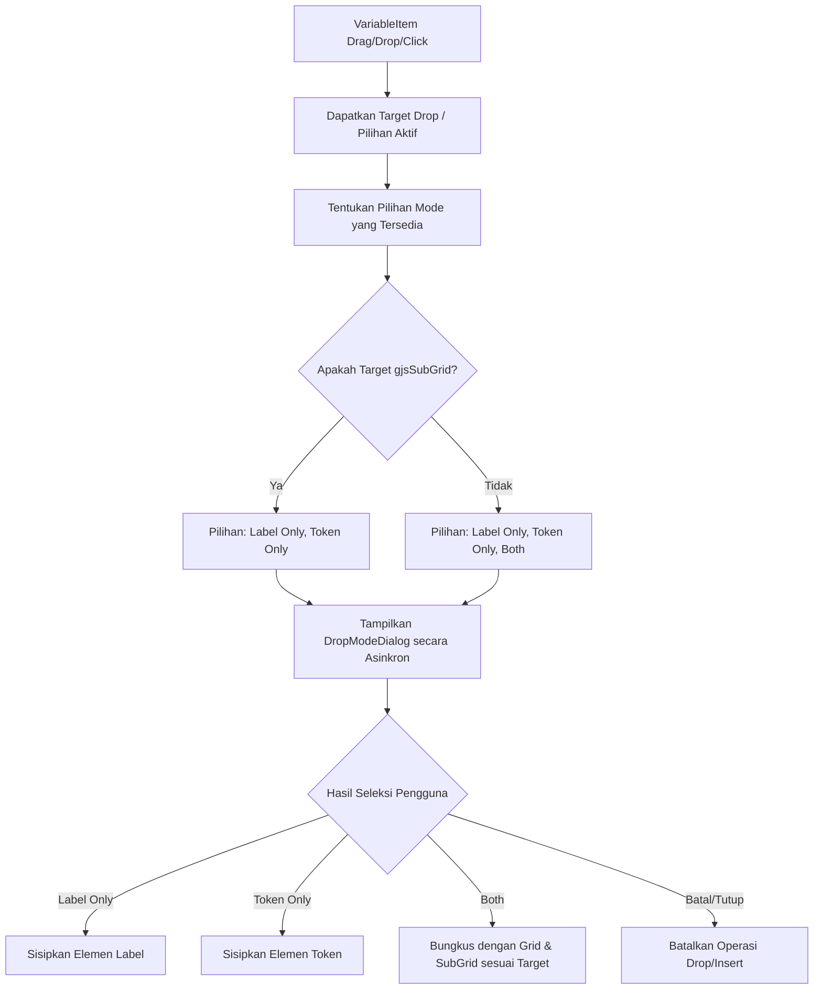

# Design: Variable Drop Mode Selector

## Overview

Saat ini, ketika pengguna men-drag item variabel (`VariableItem`) dan meletakkannya (drop) di canvas editor GrapesJS, atau saat melakukan klik-untuk-sisip (click-to-insert), sistem secara otomatis memasukkan label dan token yang dibungkus dalam komponen `gjsSubGrid`.

Untuk memberikan fleksibilitas layout yang lebih tinggi, fitur ini memperkenalkan dialog pilihan mode drop/insert:

1. **Label Only**: Menyisipkan label variabel saja.
2. **Token Only**: Menyisipkan token Handlebar variabel saja.
3. **Both (Default)**: Menyisipkan label dan token dibungkus dalam grid seperti perilaku saat ini.

---

## Architectural Flow



---

## Component Design: `DropModeDialog`

Komponen UI dialog berbasis Radix UI (shadcn `Dialog`) yang ringan dan asinkron.

### Props

- `open` (boolean): Menentukan visibilitas dialog.
- `onClose` (function): Dipanggil ketika dialog ditutup tanpa memilih.
- `onSelect` (function): Menerima pilihan mode (`'label' | 'token' | 'both'`).
- `modes` (array of strings): Daftar mode yang diizinkan (misalnya `['label', 'token']` untuk drop di subgrid).
- `variableName` (string): Nama variabel yang sedang di-drop untuk kontekstual judul dialog.

### UI Specs

- Menggunakan `DialogContent` compact (`max-w-sm` atau `max-w-md`).
- Tiga tombol aksi yang jelas dengan shortcut visual/keyboard jika memungkinkan:
  - **Label Only**: Menampilkan nama tampilan variabel.
  - **Token Only**: Menampilkan token Handlebar mentah.
  - **Both**: Menampilkan preview grid/layout gabungan (hanya tampil jika didukung target).
- Menghindari overlay berat yang merusak drag-drop focus.

---

## Integration Strategy

### 1. Drag & Drop Interception (`variableDropUtils.js`)

Ketika `canvas:dragdata` dipicu oleh GrapesJS, kita tidak langsung mengembalikan komponen di `result.content` karena kita memerlukan konfirmasi asinkron dari user.
Namun, GrapesJS membutuhkan `result.content` segera saat dragover untuk merender placeholder garis.

**Solusi:**

- Pada `canvas:dragdata`, tetap set payload placeholder minimal.
- Pada `canvas:drop`, cegah aksi instan standar jika terdeteksi drop variabel.
- Ambil metadata variabel dari payload JSON.
- Tampilkan `DropModeDialog` melalui bridge callback React di `Editor.jsx`.
- Setelah user memilih mode, buat komponen GrapesJS secara dinamis menggunakan API editor:
  ```javascript
  const comp = parent.components().add(definition);
  editor.select(comp);
  ```

### 2. Click Insert Interception (`VariableItem.jsx`)

- Pada fungsi `handleInsert()`, alih-alih langsung menjalankan logika penyisipan, panggil callback React untuk menampilkan `DropModeDialog`.
- Setelah mode terpilih, jalankan potongan kode penyisipan yang sesuai dengan mode yang dipilih.

### 3. Builder Functions (`variableInsertUtils.js`)

Pindahkan dan pecah logika pembentukan komponen menjadi fungsi pembangun terisolasi agar dapat digunakan bersama oleh klik dan drag-drop:

- `buildLabelComponent({ labelKey, displayLabel, titleTrans })`
- `buildTokenComponent({ token, simplifiedToken })`
- `buildBothSubGridComponent({ varPath, parentType, labelKey, displayLabel, titleTrans, token, simplifiedToken })`

---

## Target Matrix & Auto-Wrapping Behavior

| Target Drop                  | Mode Tersedia                | Perilaku "Both"                                                                     | Perilaku "Label Only" / "Token Only"                                         |
| ---------------------------- | ---------------------------- | ----------------------------------------------------------------------------------- | ---------------------------------------------------------------------------- |
| **gjsGrid**                  | `['label', 'token', 'both']` | Ditambahkan sebagai `gjsSubGrid` baru langsung di dalam grid.                       | Ditambahkan sebagai komponen teks biasa (`<p>`/`<span>`) di dalam cell grid. |
| **gjsSubGrid**               | `['label', 'token']`         | _Tidak tersedia_ (mencegah nested subgrid).                                         | Mengganti atau menyisipkan elemen di dalam subgrid target.                   |
| **gjsRelationsTable** cell   | `['label', 'token', 'both']` | Dibungkus otomatis dengan `gjsGrid` baru, lalu dimasukkan `gjsSubGrid` di dalamnya. | Ditambahkan sebagai komponen teks inline/span di dalam cell target.          |
| **Luar Grid** (Body/Wrapper) | `['label', 'token', 'both']` | Dibungkus otomatis dengan `gjsGrid` baru, lalu dimasukkan `gjsSubGrid` di dalamnya. | Ditambahkan sebagai paragraf `<p>` baru.                                     |

---

## Edge Cases

1. **User Menutup Dialog Tanpa Memilih:**
   - Hapus komponen placeholder sementara (jika ada).
   - Rollback transaksi drop agar canvas tetap bersih.
2. **Drop ke dalam Editor Teks Aktif (Inline Insert):**
   - Jika kursor teks aktif, langsung sisipkan mode **Token Only** (inline span) tanpa memunculkan dialog, agar tidak memutus alur mengetik user.
3. **Tipe Variabel Khusus:**
   - Variabel bertipe `relations` (tabel relasi) langsung di-drop sebagai `gjsRelationsTable` tanpa memicu dialog mode (karena tidak masuk akal memisah label/token untuk tabel relasi).
