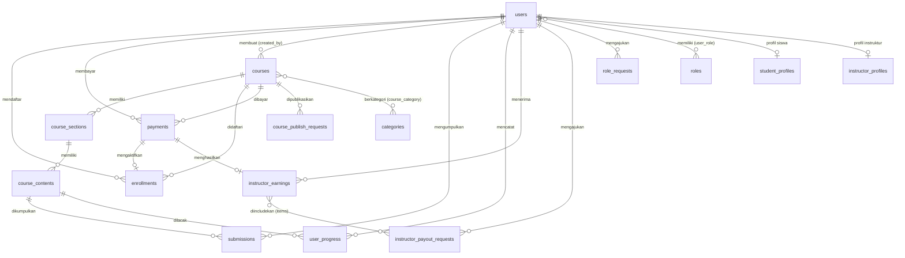

# Database

## Konvensi

- **Primary Key**: Semua tabel menggunakan **ULID** (string 26 karakter), bukan auto-increment integer
- **Soft Delete**: Tabel kritis tidak dihapus permanen — gunakan kolom `deleted_at`
- **Timestamps**: Semua tabel punya `created_at` dan `updated_at` kecuali disebutkan khusus
- **Foreign Key**: Penamaan konsisten: `{tabel_singular}_id` (contoh: `course_id`, `user_id`)

---

## ERD (Entity Relationship Diagram)

---

## Schema Tabel

### `users`

| Kolom | Tipe | Constraint | Keterangan |
|-------|------|------------|------------|
| `id` | ulid | PK | |
| `name` | string | NOT NULL | |
| `username` | string | nullable, unique (soft) | |
| `email` | string | unique (soft) | |
| `email_verified_at` | timestamp | nullable | |
| `password` | string | nullable | Null saat user di-invite |
| `image` | string | nullable | File ID untuk avatar |
| `status` | string | default: 'pending' | `pending`, `active`, `inactive` |
| `inactive_reason` | text | nullable | Alasan dinonaktifkan |
| `inactive_by` | FK users | nullable | Admin yang menonaktifkan |
| `inactive_at` | timestamp | nullable | |
| `gender` | enum | nullable | `male`, `female` |
| `birthdate` | date | nullable | |
| `phone` | string | nullable | Max 20 karakter |
| `deleted_at` | timestamp | nullable | Soft delete |

---

### `roles`

| Kolom | Tipe | Constraint | Keterangan |
|-------|------|------------|------------|
| `id` | ulid | PK | |
| `name` | string | unique (soft) | `student`, `instructor`, `organization`, `admin` |
| `description` | longText | nullable | |
| `is_disabled` | boolean | default: false | Role dinonaktifkan |
| `deleted_at` | timestamp | nullable | |

### `user_role` (pivot)

| Kolom | Constraint |
|-------|------------|
| `user_id` | FK users, cascade |
| `role_id` | FK roles, cascade |
| Unique | `(user_id, role_id)` |

---

### `permissions`

| Kolom | Tipe | Keterangan |
|-------|------|------------|
| `id` | ulid | PK |
| `module` | string | Nama modul |
| `name` | string | `super_admin`, `finance_admin`, `course_admin`, `user_admin`, `content_admin` |
| `model` | text | Model yang dilindungi |
| `route` | string | nullable |
| `permissions` | json | Array aksi: view, write, create, delete, dll |

### `admin_user_permissions` (pivot)

| Kolom | Constraint |
|-------|------------|
| `user_id` | FK users, cascade |
| `permission_id` | FK permissions, cascade |
| `deleted_at` | nullable (soft unique) |
| Unique | `(user_id, permission_id, deleted_at)` |

---

### `courses`

| Kolom | Tipe | Constraint | Keterangan |
|-------|------|------------|------------|
| `id` | ulid | PK | |
| `created_by` | FK users | NOT NULL, cascade | Instruktur pembuat |
| `title` | string | NOT NULL | |
| `description` | text | nullable | |
| `thumbnail` | string | nullable | File ID |
| `price` | decimal(12,2) | default: 0 | |
| `discount_type` | string | default: 'percentage' | `percentage` atau `amount` |
| `discount` | decimal(12,2) | default: 0 | |
| `is_published` | boolean | default: false | |
| `level` | string | nullable | `beginner`, `intermediate`, `advanced` |
| `language` | string | default: 'id' | |
| `certificate_type` | string | nullable | `professional`, `competency`, `attendance` |
| `total_hours` | integer | default: 0 | |
| `total_sessions` | integer | default: 0 | |
| `deleted_at` | timestamp | nullable | |

### `categories`

| Kolom | Tipe | Constraint |
|-------|------|------------|
| `id` | ulid | PK |
| `name` | string | NOT NULL |
| `slug` | string | unique |

### `course_category` (pivot)

| Kolom | Constraint |
|-------|------------|
| `course_id` | FK courses, cascade |
| `category_id` | FK categories, cascade |
| PK | `(course_id, category_id)` |

---

### `course_sections`

| Kolom | Tipe | Constraint | Keterangan |
|-------|------|------------|------------|
| `id` | ulid | PK | |
| `course_id` | FK courses | NOT NULL, cascade | |
| `title` | string | NOT NULL | |
| `order` | integer | default: 0 | Urutan tampil |

### `course_contents`

| Kolom | Tipe | Constraint | Keterangan |
|-------|------|------------|------------|
| `id` | ulid | PK | |
| `section_id` | FK course_sections | NOT NULL, cascade | |
| `title` | string | NOT NULL | |
| `type` | string | NOT NULL | `material`, `assignment`, `pre_assessment` |
| `description` | text | nullable | |
| `url` | string | nullable | URL video/link eksternal |
| `deadline` | datetime | nullable | Batas waktu pengumpulan |
| `is_optional` | boolean | default: false | |
| `is_required` | boolean | default: true | |
| `order` | integer | default: 0 | |

---

### `enrollments`

| Kolom | Tipe | Constraint | Keterangan |
|-------|------|------------|------------|
| `id` | ulid | PK | |
| `user_id` | FK users | NOT NULL, cascade | |
| `course_id` | FK courses | NOT NULL, cascade | |
| `payment_id` | FK payments | nullable, nullOnDelete | |
| `status` | string | default: 'active' | `pending`, `active`, `rejected` |
| `enrolled_at` | timestamp | useCurrent | |
| Unique | | `(user_id, course_id)` | Satu user tidak bisa daftar kursus sama dua kali |

---

### `payments`

| Kolom | Tipe | Constraint | Keterangan |
|-------|------|------------|------------|
| `id` | ulid | PK | |
| `user_id` | FK users | NOT NULL, cascade | |
| `course_id` | FK courses | NOT NULL, cascade | |
| `amount` | decimal(12,2) | NOT NULL | |
| `payment_method` | string | nullable | `tf` (transfer), `va`, `qris` |
| `status` | string | default: 'pending' | `pending`, `approved`, `rejected` |
| `proof_image` | string | nullable | Path file bukti bayar |
| `notes` | string | nullable | Catatan dari siswa |
| `rejection_reason` | text | nullable | |
| `paid_at` | timestamp | nullable | |
| `verified_at` | timestamp | nullable | |
| `verified_by` | FK users | nullable | Admin yang memverifikasi |
| `deleted_at` | timestamp | nullable | |

---

### `instructor_earnings`

| Kolom | Tipe | Constraint | Keterangan |
|-------|------|------------|------------|
| `id` | ulid | PK | |
| `instructor_id` | FK users | NOT NULL, cascade | |
| `payment_id` | FK payments | nullable, unique | Satu earning per payment |
| `course_id` | FK courses | nullable | |
| `gross_amount` | decimal(12,2) | | Total pembayaran siswa |
| `company_amount` | decimal(12,2) | default: 0 | Fee platform |
| `instructor_amount` | decimal(12,2) | | `gross - company` |
| `available_at` | timestamp | nullable | Kapan bisa di-request |
| `released_at` | timestamp | nullable | Kapan sudah dibayar |
| `deleted_at` | timestamp | nullable | |
| Index | | `(instructor_id, available_at)` | Untuk query balance |

---

### `instructor_payout_requests`

| Kolom | Tipe | Constraint | Keterangan |
|-------|------|------------|------------|
| `id` | ulid | PK | |
| `instructor_id` | FK users | NOT NULL, cascade | |
| `requested_by` | FK users | nullable | Admin (batch) atau instruktur sendiri |
| `approved_by` | FK users | nullable | |
| `paid_by` | FK users | nullable | |
| `requested_amount` | decimal(12,2) | | |
| `approved_amount` | decimal(12,2) | nullable | |
| `status` | string | default: 'pending' | `draft`, `pending`, `approved`, `rejected`, `paid` |
| `source` | string | default: 'manual' | `manual` atau `batch` |
| `note` | text | nullable | |
| `rejection_reason` | text | nullable | |
| `transfer_reference` | string | nullable | Nomor referensi transfer |
| `proof_file_path` | string | nullable | Bukti transfer |
| `requested_at` | timestamp | nullable | |
| `approved_at` | timestamp | nullable | |
| `paid_at` | timestamp | nullable | |
| `deleted_at` | timestamp | nullable | |
| Index | | `(instructor_id, status)` | Untuk filter status |

### `instructor_payout_request_items`

| Kolom | Tipe | Keterangan |
|-------|------|------------|
| `payout_request_id` | FK | Request yang bersangkutan |
| `earning_id` | FK | Earning yang di-include |
| `amount` | decimal | Jumlah dari earning ini |

---

### `submissions`

| Kolom | Tipe | Constraint | Keterangan |
|-------|------|------------|------------|
| `id` | ulid | PK | |
| `user_id` | FK users | NOT NULL, cascade | |
| `content_id` | FK course_contents | NOT NULL, cascade | |
| `notes` | text | nullable | Catatan dari siswa |
| `status` | string | default: 'submitted' | `submitted`, `graded` |
| `grade` | integer | nullable | Nilai 0-100 |
| `feedback` | text | nullable | Komentar instruktur |
| `submitted_at` | timestamp | useCurrent | |
| `graded_at` | timestamp | nullable | |
| Unique | | `(user_id, content_id)` | Satu submission per siswa per konten |

---

### `user_progress`

| Kolom | Tipe | Constraint | Keterangan |
|-------|------|------------|------------|
| `id` | ulid | PK | |
| `user_id` | FK users | NOT NULL, cascade | |
| `content_id` | FK course_contents | NOT NULL, cascade | |
| `is_completed` | boolean | default: false | |
| `completed_at` | timestamp | nullable | |
| Unique | | `(user_id, content_id)` | |

> Tabel ini hanya untuk konten bertipe `material`. Untuk `assignment` dan `pre_assessment`, progress dihitung dari tabel `submissions`.

---

### `carts`

| Kolom | Tipe | Constraint |
|-------|------|------------|
| `id` | ulid | PK |
| `user_id` | FK users | cascade |
| `course_id` | FK courses | cascade |
| Unique | | `(user_id, course_id)` |

---

### `course_publish_requests`

| Kolom | Tipe | Keterangan |
|-------|------|------------|
| `id` | ulid | PK |
| `course_id` | FK courses | cascade |
| `requested_by` | FK users | cascade |
| `status` | string | `pending`, `approved`, `rejected` |
| `reviewed_by` | FK users | nullable |
| `reviewed_at` | timestamp | nullable |
| `rejection_reason` | text | nullable |
| `submitted_price` | decimal(12,2) | Harga saat submit |
| `submitted_discount` | decimal(12,2) | Diskon saat submit |
| `submitted_discount_type` | string | `percentage` atau `amount` |
| Index | | `(course_id, status)` |

---

### `role_requests`

| Kolom | Tipe | Keterangan |
|-------|------|------------|
| `id` | ulid | PK |
| `user_id` | FK users | cascade |
| `requested_role` | string | `instructor` atau `organization` |
| `reason` | text | Alasan pengajuan |
| `proof_file_id` | FK files | Bukti pendukung |
| `status` | string | `pending`, `approved`, `rejected` |
| `reviewed_by` | FK users | nullable |
| `reviewed_at` | timestamp | nullable |
| `rejection_reason` | text | nullable |
| `deleted_at` | timestamp | nullable |
| Index | | `(user_id, requested_role, status)` |

---

### `student_profiles` & `instructor_profiles`

**student_profiles:**

| Kolom | Tipe | Keterangan |
|-------|------|------------|
| `user_id` | FK, unique | Satu profil per user |
| `institution` | string | nullable |
| `student_id_number` | string | nullable |
| `bio` | text | nullable |
| `socials` | json | nullable |

**instructor_profiles:**

| Kolom | Tipe | Keterangan |
|-------|------|------------|
| `user_id` | FK, unique | |
| `bank_name` | string | nullable |
| `bank_account_number` | string | nullable |
| `professional_title` | string | nullable |
| `expertise` | string | nullable |
| `bio` | text | nullable |
| `socials` | json | nullable |

---

### `files` & `fileables`

**files** — menyimpan metadata file yang diupload:

| Kolom | Tipe | Keterangan |
|-------|------|------------|
| `id` | ulid | PK |
| `path` | string | Path di storage |
| `original_name` | string | Nama file asli |
| `mime_type` | string | |
| `size` | integer | Bytes |
| `is_public` | boolean | Bisa diakses tanpa auth |
| `created_by_id` | FK users | nullable |

**fileables** — relasi polymorphic antara file dan model apa pun:

| Kolom | Keterangan |
|-------|------------|
| `file_id` | FK files |
| `fileable_id` | ID model yang memiliki file |
| `fileable_type` | Class name model (mis. `App\Models\Submission`) |
| `deleted_at` | Soft delete untuk unlink |

---

## Tabel yang Menggunakan Soft Delete

| Tabel | Keterangan |
|-------|------------|
| `users` | Data user tidak dihapus permanen |
| `courses` | Kursus yang dihapus masih bisa di-restore |
| `payments` | Riwayat pembayaran selalu dijaga |
| `instructor_earnings` | Riwayat keuangan |
| `instructor_payout_requests` | Riwayat payout |
| `role_requests` | Riwayat pengajuan role |
| `course_publish_requests` | Riwayat approval kursus |
| `files` | File tidak dihapus dari storage jika masih punya referensi |
| `roles` | Role kustom |
| `permissions` | Permission kustom |
| `tags` | Tag |
| `fileables` | Unlink file dari model (bukan hapus filenya) |

---

## Dokumen Terkait

- [15 — Database ERD per Modul](./15-database-erd.md) — ERD yang dipecah per modul untuk kemudahan pembacaan
- [14 — State Machines](./14-state-machines.md) — Status transitions untuk setiap entity
- [06-modules/](./06-modules/) — Alur bisnis per modul yang menggunakan tabel-tabel ini
