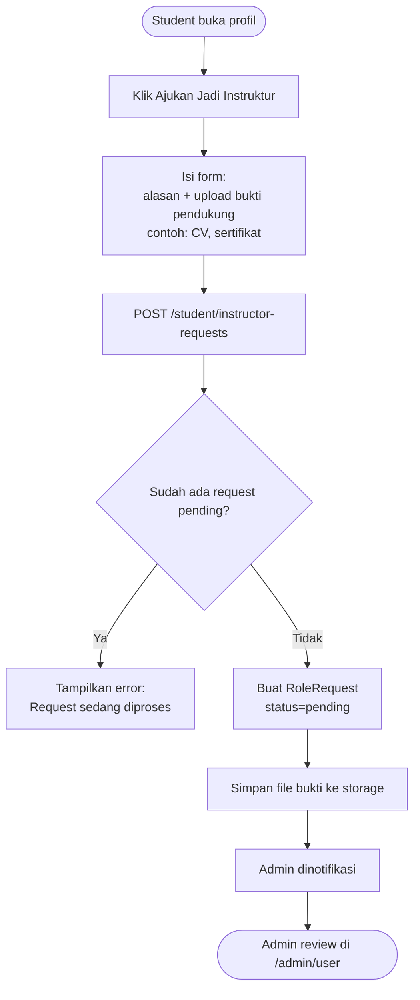
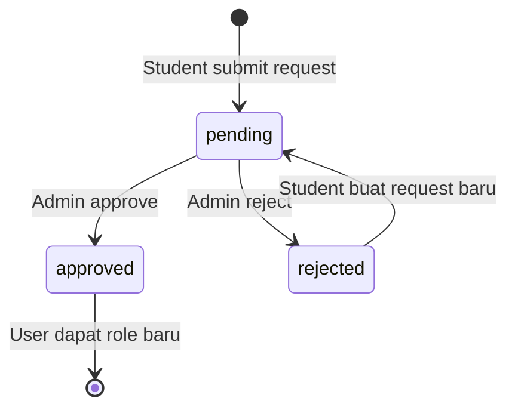
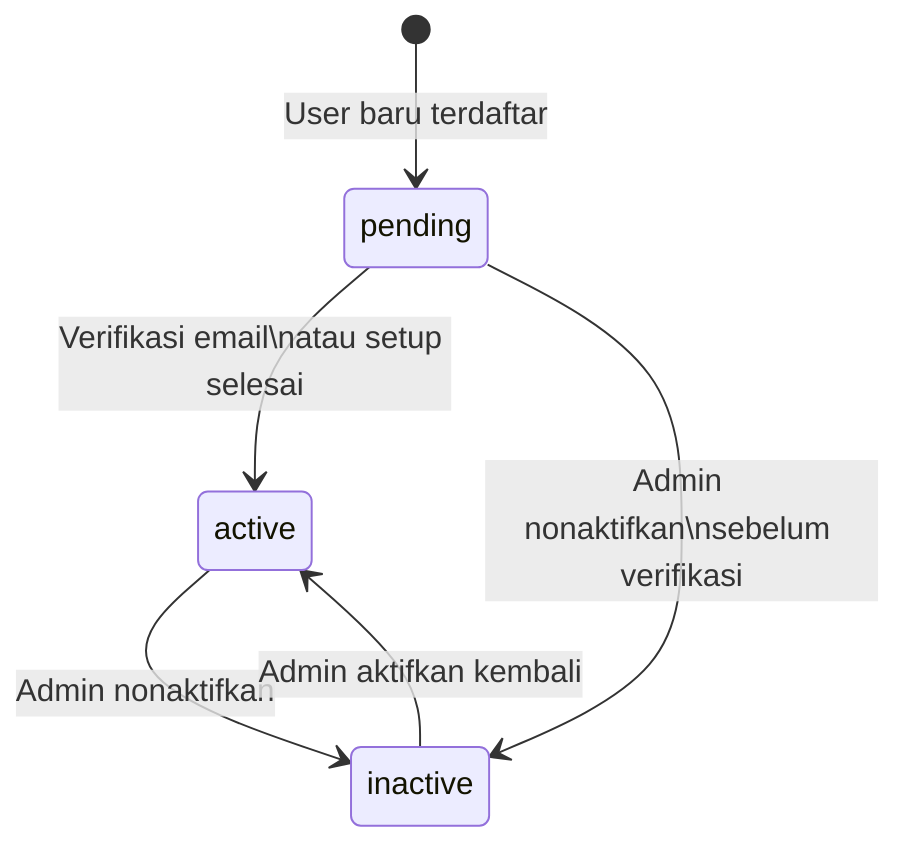

# Modul Admin

## Ringkasan

Modul admin mencakup manajemen user (aktifkan/nonaktifkan), persetujuan role request (student yang ingin jadi instruktur), dan manajemen permission antar admin.

---

## Dashboard Admin

Dashboard admin menampilkan overview sistem:
- Total user aktif, instruktur, dan student
- Total kursus published
- Statistik pendapatan (total payment approved)
- Chart: trend enrollment per periode
- Chart: trend pendapatan per periode

---

## Alur Role Request (Student Minta Jadi Instruktur)



---

## Alur Review Role Request oleh Admin

```mermaid
flowchart TD
    A([Admin buka /admin/user]) --> B[Tab: Role Requests]
    B --> C[Lihat daftar pending requests]
    C --> D[Buka detail request]
    D --> E[Lihat alasan + bukti yang diupload]
    E --> F{Keputusan admin}
    F -->|Approve| G[PATCH /admin/user/requests/{request}/approve]
    F -->|Reject| H[Isi rejection_reason\nPATCH .../reject]
    G --> I[Update RoleRequest: status=approved]
    I --> J[Attach role baru ke user\nmisalnya role instructor]
    J --> K[User sekarang bisa akses\n/instructor/dashboard]
    H --> L[Update RoleRequest: status=rejected]
    L --> M[User dinotifikasi, bisa request ulang]
```

---

## State Machine: Role Request



---

## Alur Manajemen Status User

Admin dapat menonaktifkan atau mengaktifkan kembali user:

```mermaid
flowchart TD
    A([Admin buka /admin/user]) --> B[Cari/filter user]
    B --> C[Klik user yang ingin dikelola]
    C --> D{Aksi}
    D -->|Nonaktifkan| E[Isi inactive_reason]
    E --> F[PATCH /admin/user/users/{user}/status\nbody: status=inactive, reason=...]
    F --> G[Update user:\nstatus=inactive\ninactive_reason\ninactive_by\ninactive_at]
    G --> H[User tidak bisa login\npesan alasan ditampilkan saat login]
    D -->|Aktifkan kembali| I[PATCH .../status\nbody: status=active]
    I --> J[Clear inactive fields\nUser bisa login kembali]
```

---

## State Machine: User Status



---

## Alur Manajemen Permission Admin

Hanya user dengan permission `super_admin` yang bisa assign/revoke permission admin lainnya:

```mermaid
flowchart TD
    A([Super Admin buka halaman detail admin user]) --> B[Lihat permission yang dimiliki saat ini]
    B --> C[Centang/uncentang permission yang diinginkan]
    C --> D[PATCH /admin/user/admins/{user}/permissions\nbody: permissions=[...]]
    D --> E{Validasi: aksi aman?}
    E -->|Mencabut super_admin dari diri sendiri| F[Cek: apakah masih ada super_admin lain?]
    F -->|Tidak ada lagi| G[Tolak: harus ada minimal 1 super_admin]
    F -->|Ada| H[Proses update]
    E -->|Aksi normal| H
    H --> I[Sync permission:\nhapus yang tidak dipilih\ntambah yang baru dipilih]
    I --> J[Perubahan berlaku segera\nrequest berikutnya langsung terkena efek]
```

---

## Perlindungan Super Admin

Sistem memiliki perlindungan terhadap keadaan di mana tidak ada super admin yang tersisa:

```php
// Di AdminPermissionService::updatePermissions()
if ($revokingSuperAdmin) {
    $otherSuperAdmins = $this->countOtherSuperAdmins($userId);
    if ($otherSuperAdmins === 0) {
        throw new \Exception('Harus ada minimal satu super admin');
    }
}
```

---

## Direktori User

Halaman `/admin/user` menampilkan:
- **Tab Users**: Semua user dengan filter status (active/inactive/pending) dan role
- **Tab Role Requests**: Semua request role yang pending/approved/rejected
- **Tab Admins**: Semua user dengan role admin beserta permission mereka (super admin only)

Data ditampilkan menggunakan komponen Datatable yang support pagination dan filter.

---

## Controller yang Terlibat

| Controller | File | Tanggung Jawab |
|-----------|------|---------------|
| `AdminDashboardController` | `app/Http/Controllers/Admin/DashboardController.php` | Dashboard stats & charts |
| `UserDirectoryController` | `app/Http/Controllers/Admin/UserDirectoryController.php` | Direktori user, role requests, admin permissions |
| `AdminPermissionService` | `app/Services/Admin/AdminPermissionService.php` | Logic assign/revoke permissions |
