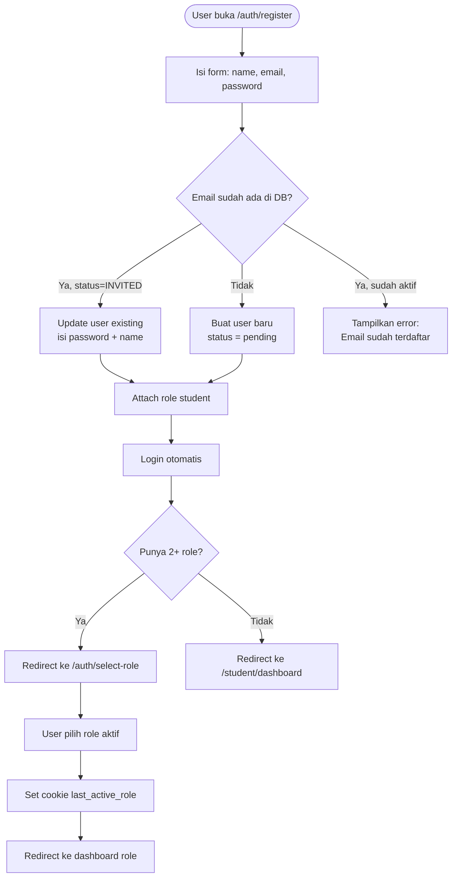
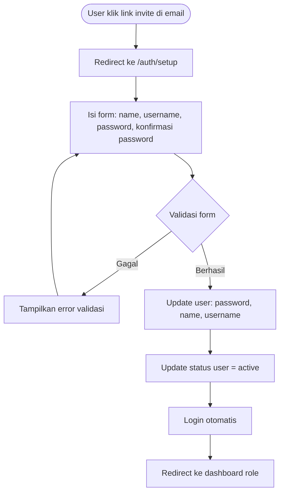
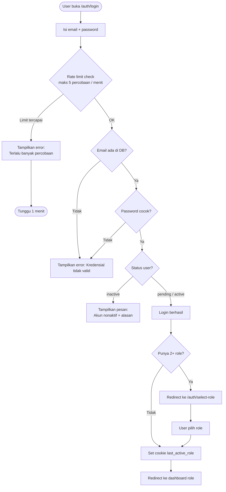
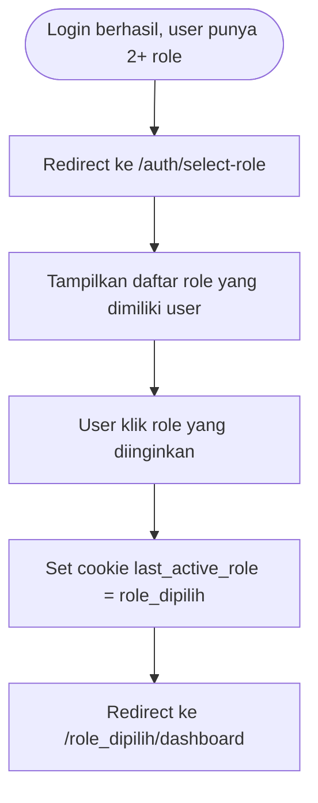
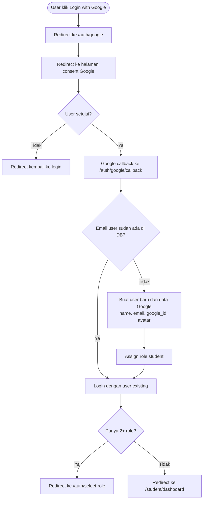

# Modul Autentikasi

## Ringkasan

Autentikasi menangani: registrasi user baru, setup profil untuk user yang diundang, login dengan rate limiting, pemilihan role untuk multi-role user, dan login via Google OAuth.

---

## Alur Registrasi

**Catatan penting:**
- User yang pernah diundang (status `INVITED`) bisa menyelesaikan registrasi mereka dengan mengisi form registrasi normal — sistem otomatis mendeteksi dan mengupdate record yang ada
- Password di-hash dengan `bcrypt` sebelum disimpan
- Email verifikasi tidak wajib untuk dapat mengakses dashboard (bergantung konfigurasi)

---

## Alur Setup User (INVITED)

User yang diundang oleh admin tidak punya password awalnya. Mereka perlu menyelesaikan setup:

---

## Alur Login

**Catatan:**
- Laravel Throttle middleware membatasi 5 percobaan login per 1 menit per IP
- User dengan status `inactive` tidak bisa login; pesan alasan nonaktif ditampilkan
- User dengan status `pending` (belum verify email atau belum setup) bisa login, tapi diarahkan ke halaman setup/verifikasi

---

## Alur Pemilihan Role (Multi-Role)

Halaman ini juga memungkinkan user untuk switch role kapan saja dari dalam aplikasi tanpa perlu logout, melalui menu role switcher di sidebar.

---

## Alur Google OAuth

**Implementasi**: `app/Http/Controllers/Auth/SocialAuthController.php` menggunakan `Laravel Socialite` untuk handle OAuth flow.

---

## Middleware yang Relevan

| Middleware | Kelas | Tujuan |
|-----------|-------|--------|
| `auth` | `Authenticate` | Cek user sudah login |
| `guest` | `RedirectIfAuthenticated` | Redirect ke dashboard jika sudah login |
| `throttle:login` | `ThrottleRequests` | Rate limit login 5x/menit |
| `verified` | `EnsureEmailIsVerified` | Wajib verifikasi email (jika aktif) |
| `EnsureUserIsOnboarded` | Custom | Cek setup sudah selesai |
