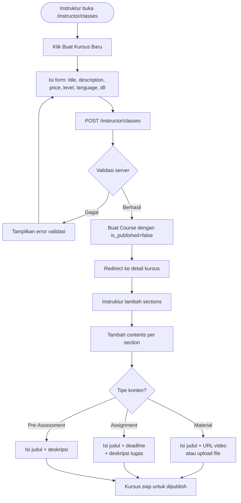
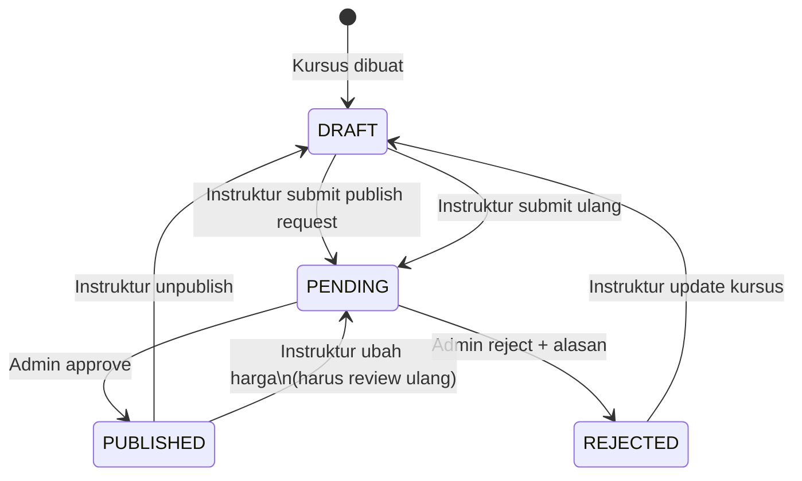
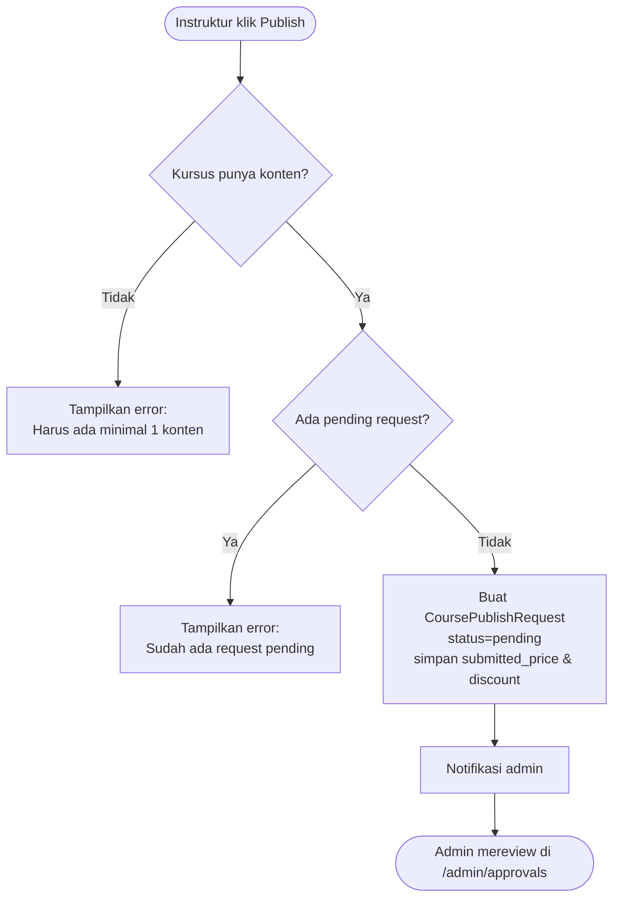
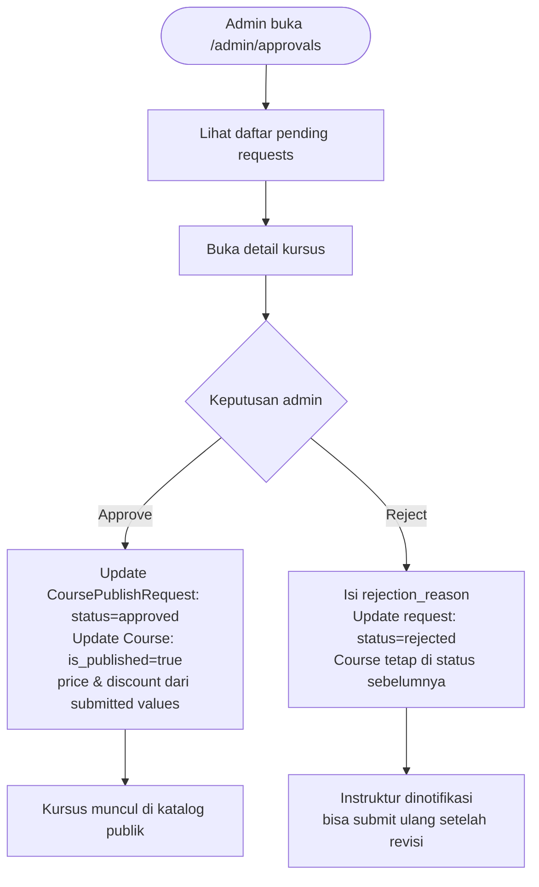
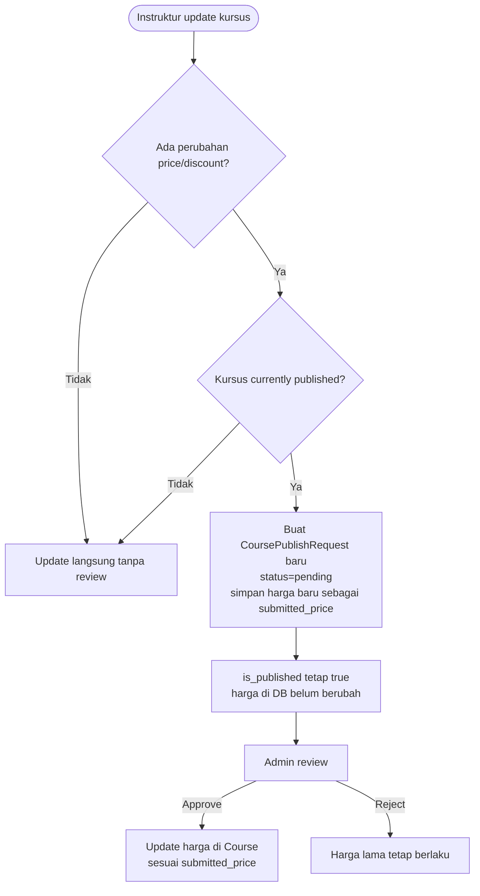

# Modul Manajemen Kursus

## Ringkasan

Modul kursus mencakup pembuatan kursus, pengelolaan konten (sections & contents), dan alur publikasi yang melibatkan review oleh admin.

---

## Struktur Hierarki Kursus

```
Course
├── Section 1
│   ├── Content: Pre-Assessment (opsional)
│   ├── Content: Material (video/file)
│   ├── Content: Material (video/file)
│   └── Content: Assignment (tugas)
└── Section 2
    ├── Content: Material
    └── Content: Assignment
```

**Tipe konten:**

| Tipe | Deskripsi | Progress |
|------|-----------|---------|
| `material` | Materi belajar (video URL, file upload) | Via `UserProgress.is_completed` |
| `assignment` | Tugas yang harus dikumpulkan | Via `Submission` exists |
| `pre_assessment` | Penilaian awal sebelum belajar | Via `Submission` exists |

---

## Alur Membuat Kursus Baru



---

## Alur Publikasi Kursus

Kursus tidak bisa langsung publik — harus melalui review admin.



### Detail State Machine

| State | Kondisi | Aksi tersedia |
|-------|---------|--------------|
| `DRAFT` | `is_published=false`, tidak ada pending request | Submit publish request |
| `PENDING` | Ada `CoursePublishRequest` dengan status=pending | Tidak bisa submit ulang sampai diputuskan |
| `PUBLISHED` | `is_published=true` | Unpublish, atau ubah harga (trigger review ulang) |
| `REJECTED` | Ada request dengan status=rejected | Update kursus, submit ulang |

---

## Alur Submit Publish Request



---

## Alur Review oleh Admin



---

## Alur Perubahan Harga Kursus yang Sudah Published

Instruktur tidak bisa begitu saja mengubah harga kursus yang sudah published — harus review ulang:



---

## Authorization

Setiap endpoint kursus memvalidasi bahwa instruktur hanya bisa mengakses kursus miliknya sendiri:

```php
// Diterapkan di CourseController, CourseSectionController, CourseContentController
if ($course->created_by !== Auth::id()) {
    abort(403);
}
```

Ini **tidak ditangani oleh Policy**, melainkan validasi eksplisit di setiap method controller. Lihat [Roles & Permissions](../04-roles-permissions.md) untuk detail.

---

## File Upload untuk Konten

File materi (PDF, video lokal, dll.) diupload melalui:

1. `POST /instructor/classes/contents/{content}/upload`
2. File disimpan ke `storage/app/private/` (tidak publik langsung)
3. Metadata disimpan di tabel `files`
4. Relasi dibuat di tabel `fileables` (polymorphic): `fileable_type = CourseContent::class`
5. Akses file via `/files/{file}/preview` yang dilindungi auth

---

## Controller & Service

| File | Tanggung Jawab |
|------|---------------|
| `app/Http/Controllers/Instructor/CourseController.php` | CRUD kursus, publish toggle, thumbnail |
| `app/Http/Controllers/Instructor/CourseSectionController.php` | CRUD sections |
| `app/Http/Controllers/Instructor/CourseContentController.php` | CRUD contents, file upload |
| `app/Http/Controllers/Admin/CourseApprovalController.php` | Approve/reject publish requests |
