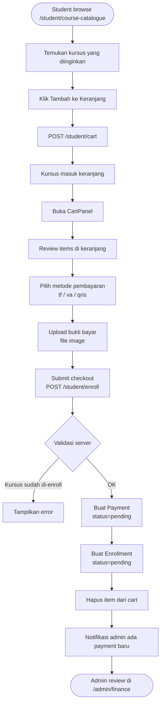
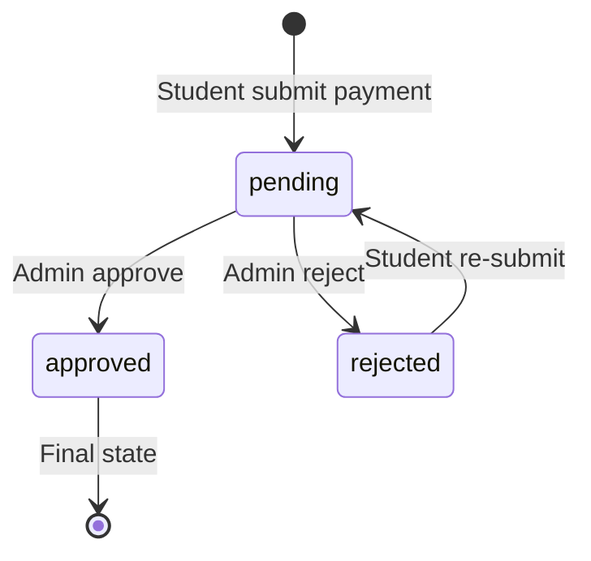
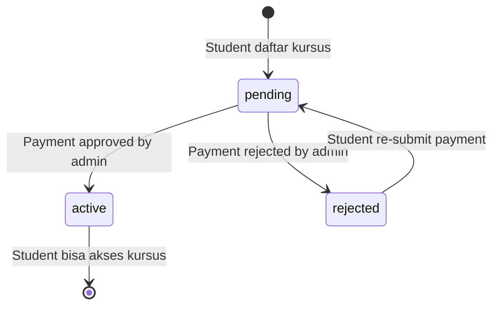

# Modul Enrollment & Payment

## Ringkasan

Modul ini mencakup alur pendaftaran kursus oleh siswa, pembayaran manual (upload bukti bayar), dan state machine untuk Payment dan Enrollment.

---

## Alur Lengkap Enrollment



---

## Alur Review Payment oleh Admin

```mermaid
flowchart TD
    A([Admin buka /admin/finance]) --> B[Lihat daftar payments pending]
    B --> C[Klik payment untuk lihat detail]
    C --> D[Lihat bukti bayar yang diupload]
    D --> E{Keputusan admin}
    E -->|APPROVE| F[PATCH /admin/finance/{payment}/approve]
    E -->|REJECT| G[Isi rejection_reason\nPATCH /admin/finance/{payment}/reject]
    F --> H[Update Payment: status=approved, verified_at, verified_by]
    H --> I[Update Enrollment: status=active]
    I --> J[Buat InstructorEarning:\ncalculate gross, company, instructor amounts]
    J --> K[Set available_at = verified_at + payout_delay_days]
    K --> L[Student dapat akses kursus]
    G --> M[Update Payment: status=rejected, rejection_reason]
    M --> N[Update Enrollment: status=rejected]
    N --> O[Student bisa re-submit payment]
```

---

## State Machine: Payment



| Status | Keterangan |
|--------|------------|
| `pending` | Menunggu verifikasi admin |
| `approved` | Pembayaran disetujui, enrollment diaktifkan |
| `rejected` | Pembayaran ditolak, student bisa re-upload |

---

## State Machine: Enrollment



| Status | Keterangan |
|--------|------------|
| `pending` | Enrollment dibuat, menunggu payment dikonfirmasi |
| `active` | Student bisa mengakses seluruh konten kursus |
| `rejected` | Enrollment ditolak karena payment gagal |

---

## Keranjang (Cart)

Cart bersifat sederhana: satu entry per pasang `(user_id, course_id)`.

| Aksi | Endpoint | Keterangan |
|------|----------|------------|
| Tambah | `POST /student/cart` | Tidak bisa tambah kursus yang sudah di-enroll |
| Hapus | `DELETE /student/cart/{courseId}` | Hapus satu item dari cart |
| Lihat | Di-pass lewat Inertia props di halaman katalog | Tidak ada endpoint GET terpisah |

**Custom hook `useCart`** di frontend (`resources/js/Hooks/useCart.js`) mengelola state cart secara optimistic — UI langsung update tanpa menunggu response server.

---

## Aturan Bisnis

1. **Satu enrollment per user per kursus**: Unique constraint `(user_id, course_id)` di tabel `enrollments`. Sistem cek sebelum membuat enrollment baru.
2. **Kursus gratis**: Jika `course.price = 0`, enrollment langsung `active` tanpa perlu payment.
3. **Re-submit setelah reject**: Student bisa upload ulang bukti bayar. Sistem akan buat `Payment` baru (yang lama tetap tersimpan dengan status rejected).
4. **Soft delete payment**: Payment tidak pernah dihapus permanen dari database untuk keperluan audit.

---

## Perhitungan Earning Instruktur

Saat payment disetujui, sistem otomatis menghitung earning instruktur:

```
gross_amount       = payment.amount
company_percentage = Preference('company_fee_percentage')  // default: 10%
company_amount     = gross_amount × (company_percentage / 100)
instructor_amount  = gross_amount - company_amount

available_at       = now() + Preference('payout_delay_days')  // default: 7 hari
```

Earning ini masuk ke tabel `instructor_earnings` dan baru bisa di-request setelah `available_at`. Lihat [Modul Keuangan](finance.md) untuk alur payout.

---

## Controller yang Terlibat

| Controller | File | Tanggung Jawab |
|-----------|------|---------------|
| `CartController` | `app/Http/Controllers/Student/CartController.php` | Tambah/hapus dari keranjang |
| `EnrollmentController` | `app/Http/Controllers/Student/EnrollmentController.php` | Submit enrollment + payment |
| `SystemFinanceController` | `app/Http/Controllers/Admin/SystemFinanceController.php` | Approve/reject payment |
