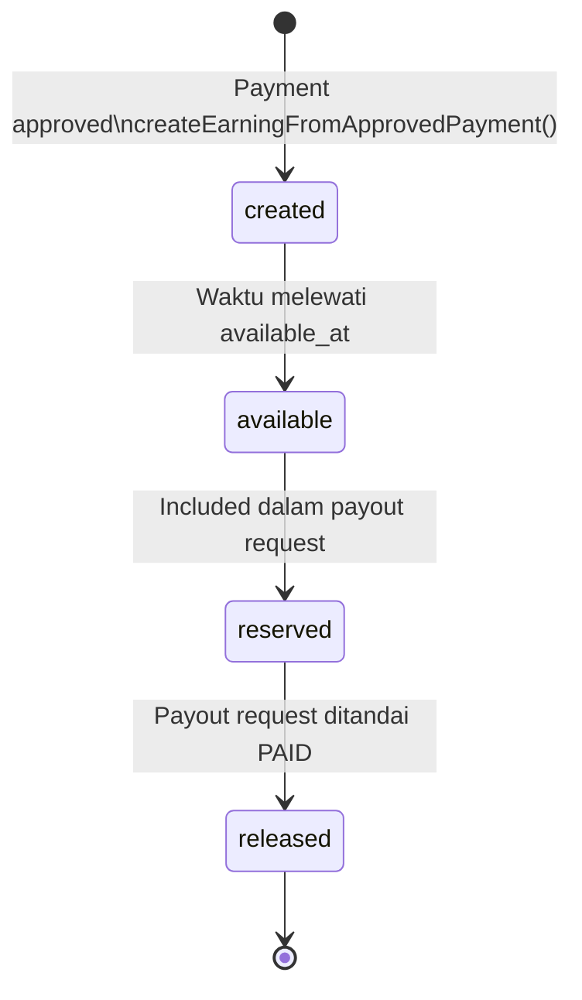
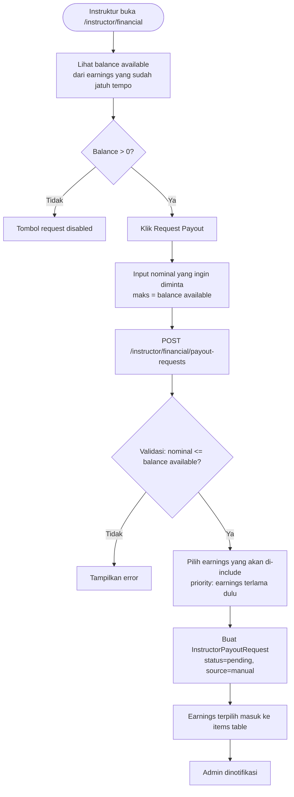
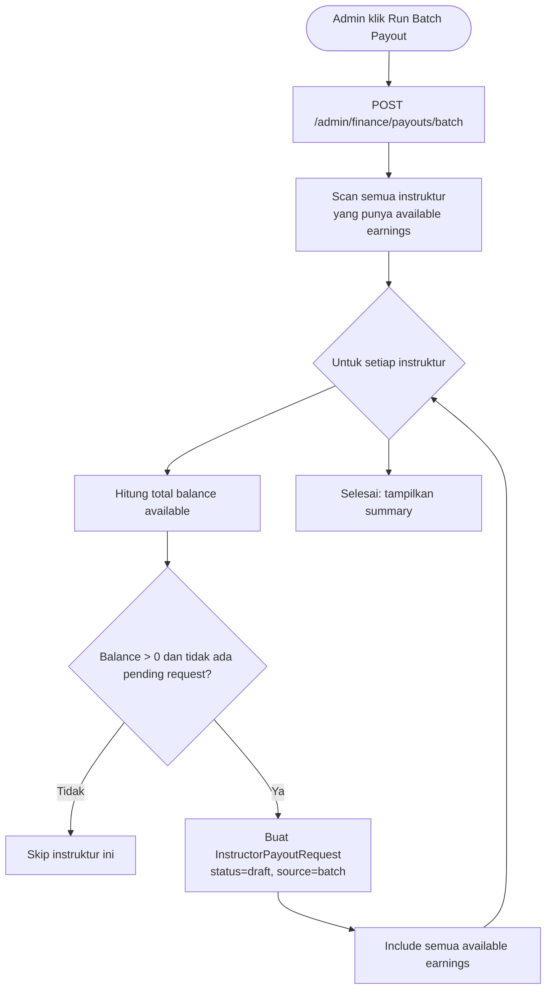
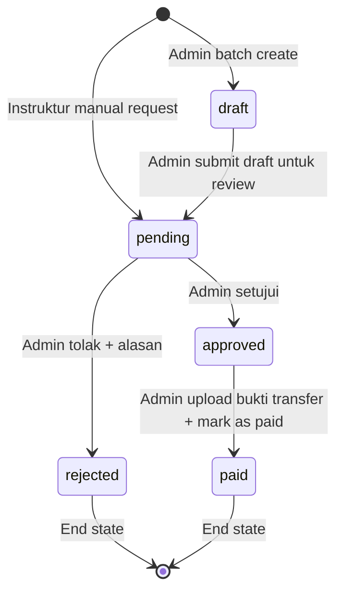

# Modul Keuangan & Payout

## Ringkasan

Modul keuangan mengelola lifecycle earning instruktur setelah payment disetujui, proses pengajuan payout (manual oleh instruktur atau batch oleh admin), dan pembayaran oleh admin.

---

## Rumus Perhitungan Earning

Saat admin menyetujui sebuah payment, sistem langsung menghitung earning:

```
gross_amount       = payment.amount
company_percentage = Preference.get('company_fee_percentage')   // contoh: 10
company_amount     = gross_amount × (company_percentage / 100)
instructor_amount  = gross_amount − company_amount

available_at       = now() + Preference.get('payout_delay_days')  // contoh: 7 hari
released_at        = NULL  // akan diisi saat payout terbayar
```

**Contoh**:
- Payment: Rp 500.000
- Company fee: 10%
- `company_amount` = Rp 50.000
- `instructor_amount` = Rp 450.000
- Jika disetujui hari ini, `available_at` = 7 hari kemudian

---

## State Machine: Earning



> `reserved` dan `released` bukan kolom status di DB, melainkan kondisi logis:
> - **available**: `available_at <= now()` dan `released_at IS NULL` dan tidak ada pending payout request yang include earning ini
> - **reserved**: earning sudah include di payout request yang masih pending/approved
> - **released**: `released_at IS NOT NULL`

---

## Alur Payout Request oleh Instruktur (Manual)



---

## Alur Batch Payout (Admin)

Admin bisa memicu proses payout massal untuk semua instruktur yang memiliki earning tersedia:



---

## State Machine: Payout Request



| Status | Keterangan | Aksi Tersedia |
|--------|------------|--------------|
| `draft` | Dibuat oleh batch, belum di-submit | Admin review/submit |
| `pending` | Menunggu persetujuan admin | Admin approve/reject |
| `approved` | Disetujui, menunggu transfer | Admin mark as paid |
| `rejected` | Ditolak, earnings bebas kembali | Instruktur bisa request ulang |
| `paid` | Transfer sudah dilakukan | Final state |

---

## Alur Review Payout oleh Admin

```mermaid
flowchart TD
    A([Admin buka halaman payout requests]) --> B[Lihat daftar pending/approved requests]
    B --> C[Buka detail request]
    C --> D[Lihat daftar earnings yang di-include]
    D --> E{Keputusan}
    E -->|Approve| F[PATCH /admin/finance/payouts/{request}/approve]
    E -->|Reject| G[Isi rejection_reason\nPATCH .../reject]
    F --> H[Status = approved]
    G --> I[Status = rejected\nEarnings bebas kembali dari reserved]
    H --> J{Admin lakukan transfer ke bank instruktur}
    J --> K[PATCH .../paid + upload bukti transfer]
    K --> L[Status = paid]
    L --> M[Set released_at pada semua earnings terkait]
    M --> N[Balance instruktur berkurang sesuai amount paid]
```

---

## Logika Reserved Amount

Untuk mencegah instruktur double-request (request earning yang sama dua kali), sistem menggunakan konsep "reserved":

```php
// Earning yang sudah include di payout request yang masih aktif
// tidak boleh di-include di request baru

$reservedEarningIds = InstructorPayoutRequestItem::whereHas('payoutRequest', function($q) {
    $q->whereIn('status', ['pending', 'approved']);
})->pluck('earning_id');

$availableBalance = InstructorEarning::where('instructor_id', $id)
    ->where('available_at', '<=', now())
    ->whereNull('released_at')
    ->whereNotIn('id', $reservedEarningIds)
    ->sum('instructor_amount');
```

---

## Konfigurasi

Dua setting yang mempengaruhi kalkulasi keuangan disimpan di tabel `preferences`:

| Key | Default | Deskripsi | Diubah via |
|-----|---------|-----------|-----------|
| `payout_delay_days` | `7` | Hari tunggu sebelum earning bisa di-request | `PATCH /admin/finance/settings/payout-delay` |
| `company_fee_percentage` | `10` | % fee yang dipotong platform | `PATCH /admin/finance/settings/company-fee` |

**Perubahan setting hanya berlaku untuk earning BARU** — earning yang sudah ada tidak berubah.

---

## Service yang Terlibat

| Service | File | Method Utama |
|---------|------|-------------|
| `InstructorPayoutService` | `app/Services/Finance/InstructorPayoutService.php` | `createEarningFromApprovedPayment()`, `runBatchPayout()`, `calculateAvailableBalance()` |

Lihat [07 — Service Layer](../07-services.md) untuk signature method lengkap.
