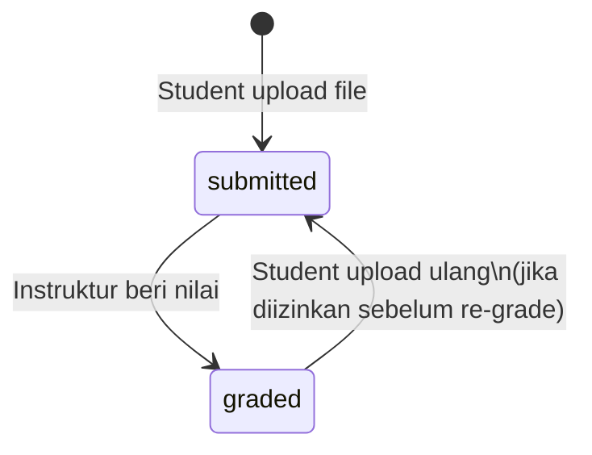

# Modul Progress & Submission

## Ringkasan

Modul ini mengelola bagaimana siswa melacak kemajuan belajarnya, mengumpulkan tugas, dan bagaimana instruktur memberikan nilai dan feedback.

---

## Alur Belajar Siswa

```mermaid
flowchart TD
    A([Student akses kursus yang di-enroll]) --> B[Lihat daftar sections & contents]
    B --> C[Pilih konten untuk dibuka]
    C --> D{Tipe konten?}
    D -->|material| E[Lihat video/baca materi\n/unduh file]
    D -->|assignment| F[Baca instruksi tugas]
    D -->|pre_assessment| G[Baca instruksi penilaian awal]
    E --> H[Klik Tandai Selesai]
    H --> I[POST /student/progress/{content}]
    I --> J[Buat/update UserProgress\nis_completed = true]
    F --> K[Upload file tugas\nPOST /student/submissions/{content}]
    G --> K
    K --> L[Buat Submission\nstatus = submitted]
    J --> M[Hitung ulang progress %]
    L --> M
    M --> N{Progress = 100%?}
    N -->|Ya| O[Status enrollment = COMPLETED]
    N -->|Tidak| P[Tampilkan progress bar terbaru]
```

---

## Rumus Perhitungan Progress

```
required_contents = semua content di course yang is_required = true

completed_materials = UserProgress.count
    WHERE user_id = X
    AND content_id IN (required material contents of this course)
    AND is_completed = true

completed_assignments = Submission.count
    WHERE user_id = X
    AND content_id IN (required assignment/pre_assessment contents)

total_required = count(required_contents)
completed      = completed_materials + completed_assignments

progress%      = (completed / total_required) × 100
```

**Implementasi**: `app/Services/CourseProgressService.php` menangani kalkulasi ini.

---

## Tabel: Pelacak Progress per Tipe Konten

| Tipe | Cara Track Progress | Tabel |
|------|--------------------|-|
| `material` | Klik "Tandai Selesai" → buat UserProgress | `user_progress` |
| `assignment` | Upload file → buat Submission | `submissions` |
| `pre_assessment` | Upload file → buat Submission | `submissions` |

---

## Alur Pengumpulan Tugas

```mermaid
flowchart TD
    A([Student buka halaman assignment]) --> B[Baca deskripsi + deadline]
    B --> C{Sudah melewati deadline?}
    C -->|Ya| D[Tombol upload disabled\ntampilkan pesan deadline lewat]
    C -->|Tidak| E[Pilih file untuk diupload\nbisa lebih dari 1 file]
    E --> F[POST /student/submissions/{content}\ndengan multipart/form-data]
    F --> G{Sudah ada submission sebelumnya?}
    G -->|Ya| H[Update submission existing\ntambah file baru]
    G -->|Tidak| I[Buat Submission baru\nstatus=submitted]
    H --> J[File disimpan di storage]
    I --> J
    J --> K[Metadata di tabel files]
    K --> L[Relasi di tabel fileables\nfileable_type = Submission]
    L --> M[Progress dihitung ulang]
```

**Catatan**: Siswa bisa upload beberapa file ke satu submission, dan bisa menghapus file tertentu dengan `DELETE /student/submissions/{content}/files/{file}`.

---

## State Machine: Submission



| Status | Keterangan |
|--------|------------|
| `submitted` | Sudah dikumpulkan, belum dinilai |
| `graded` | Instruktur sudah memberi nilai + feedback |

---

## Alur Grading oleh Instruktur

```mermaid
flowchart TD
    A([Instruktur buka /instructor/students]) --> B[Lihat daftar kursus yang diajarkan]
    B --> C[Pilih kursus]
    C --> D[Lihat daftar enrollments aktif]
    D --> E[Klik student tertentu]
    E --> F[Lihat daftar submissions student]
    F --> G[Buka submission yang belum dinilai]
    G --> H[Unduh & review file yang dikumpulkan]
    H --> I[Input grade 0-100 + feedback]
    I --> J[PATCH /instructor/enrollments/{enrollment}/submissions/{submission}/grade]
    J --> K[Update Submission:\ngrade, feedback, graded_at, status=graded]
    K --> L[Student bisa melihat nilai di /student/my-courses]
```

---

## Tampilan Nilai untuk Siswa

Setelah dinilai, siswa dapat melihat:
- **Grade**: Nilai numerik 0-100
- **Feedback**: Komentar teks dari instruktur
- **Graded at**: Tanggal penilaian

Data ini ditampilkan di halaman **My Courses** (`/student/my-courses`) di kartu kursus yang bersangkutan.

---

## Deadline Handling

- Kolom `deadline` di `course_contents` (type datetime, nullable)
- Jika `deadline` tidak null dan waktu sekarang > deadline:
  - Frontend menampilkan indikator "Deadline lewat"
  - Tombol upload dinonaktifkan di frontend
  - Backend juga memvalidasi deadline sebelum menerima submission baru

---

## Service yang Terlibat

| Service | File | Tanggung Jawab |
|---------|------|---------------|
| `CourseProgressService` | `app/Services/CourseProgressService.php` | Kalkulasi progress % per enrollment |
| `StudentProgressBuilder` | `app/Services/Instructor/StudentProgressBuilder.php` | Build data progress siswa untuk tampilan instruktur |
