# Semua Diagram (Ringkas)

Halaman ini mengumpulkan diagram ringkas sistem dalam satu tempat untuk referensi cepat. Semua diagram menggunakan format **Mermaid** yang render otomatis di GitHub.

> **Untuk versi lebih detail:** Lihat [`13-feature-flows.md`](./13-feature-flows.md) (flowchart fitur), [`14-state-machines.md`](./14-state-machines.md) (state machine detail), [`15-database-erd.md`](./15-database-erd.md) (ERD per modul), [`16-sequence-diagrams.md`](./16-sequence-diagrams.md) (sequence diagram), [`12-system-architecture.md`](./12-system-architecture.md) (arsitektur teknis).

---

## 1. Arsitektur Sistem

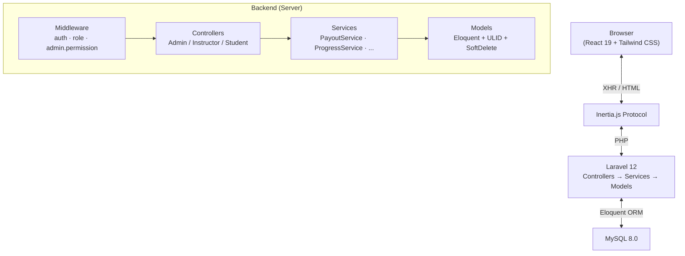

---

## 2. ERD Ringkas

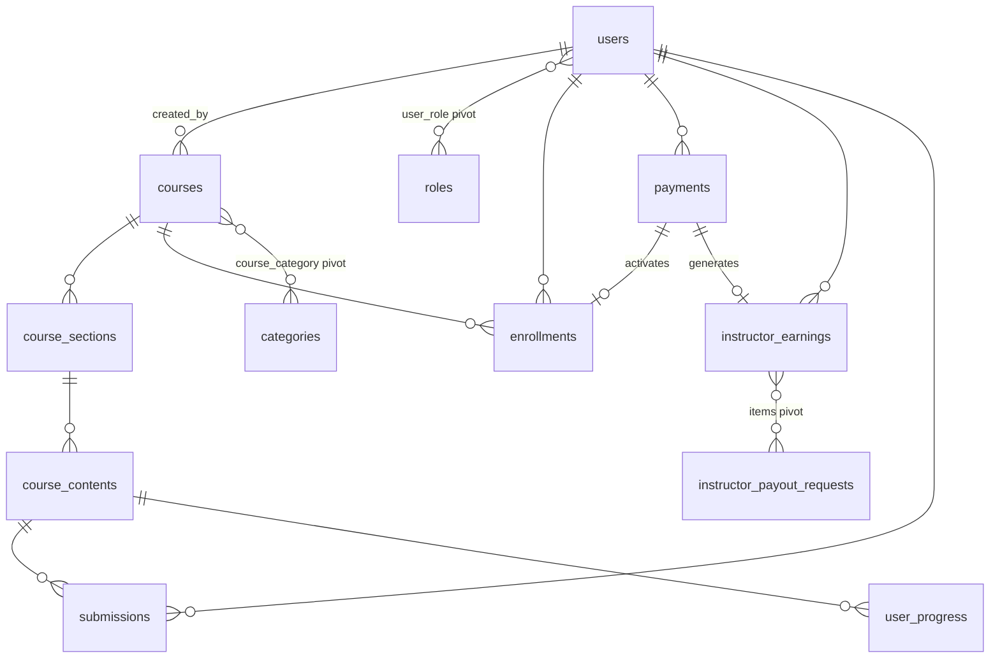

---

## 3. Activity: Registrasi User

```mermaid
flowchart TD
    A([Buka /auth/register]) --> B[Isi name, email, password]
    B --> C{Email di DB?}
    C -->|status=INVITED| D[Update user existing]
    C -->|Tidak ada| E[Buat user baru\nstatus=pending]
    C -->|Sudah aktif| F[Error: Email sudah terdaftar]
    D --> G[Attach role student]
    E --> G
    G --> H[Login otomatis]
    H --> I{2+ role?}
    I -->|Ya| J[/auth/select-role]
    I -->|Tidak| K[/student/dashboard]
```

---

## 4. Activity: Login & Pemilihan Role

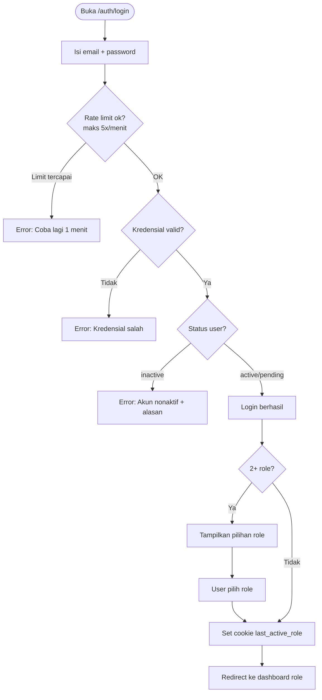

---

## 5. Activity: Enrollment & Payment

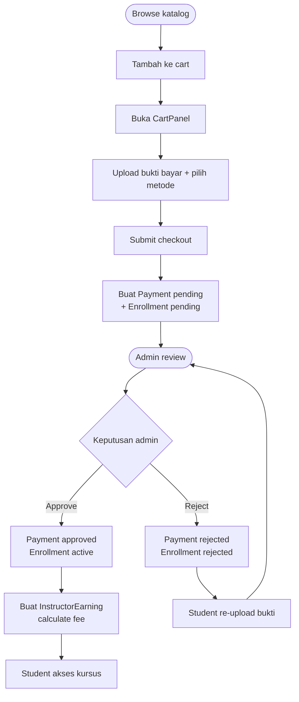

---

## 6. State Machine: Course Status

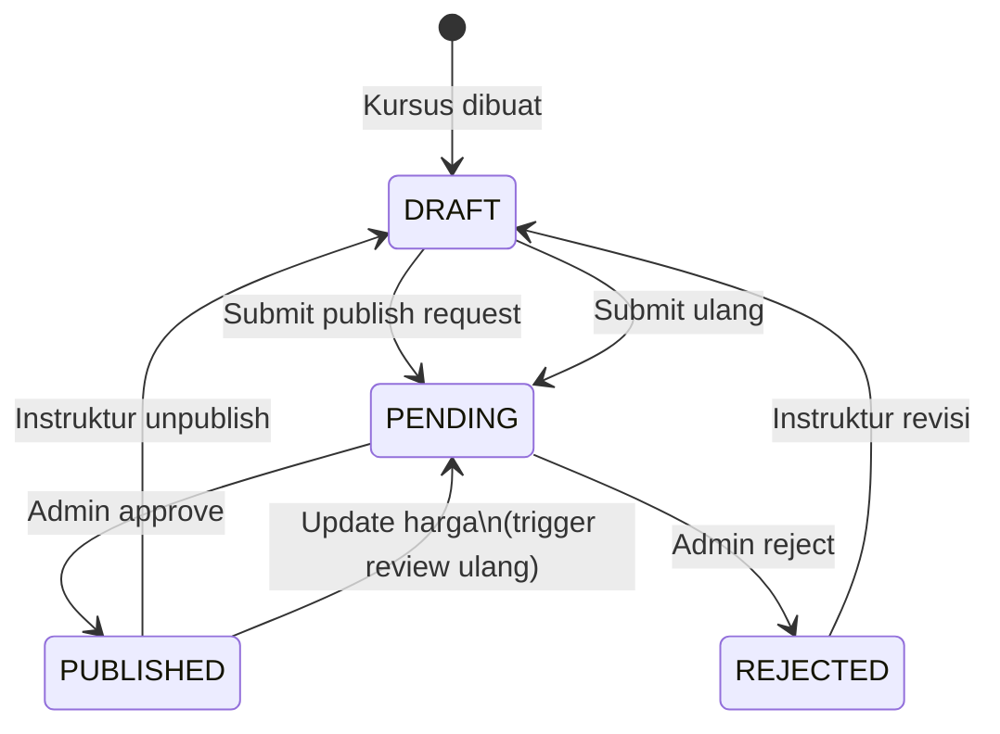

---

## 7. Activity: Course Approval (Admin)

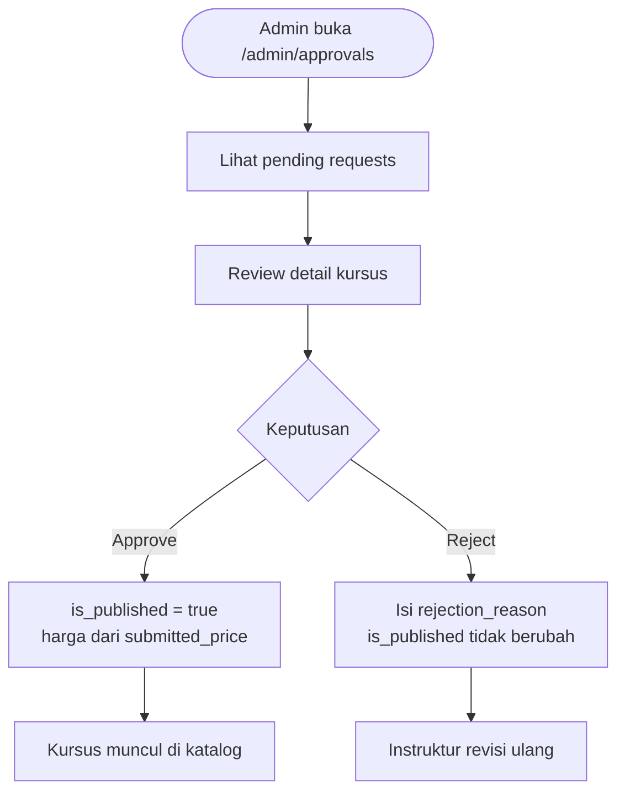

---

## 8. Activity: Student Belajar & Progress

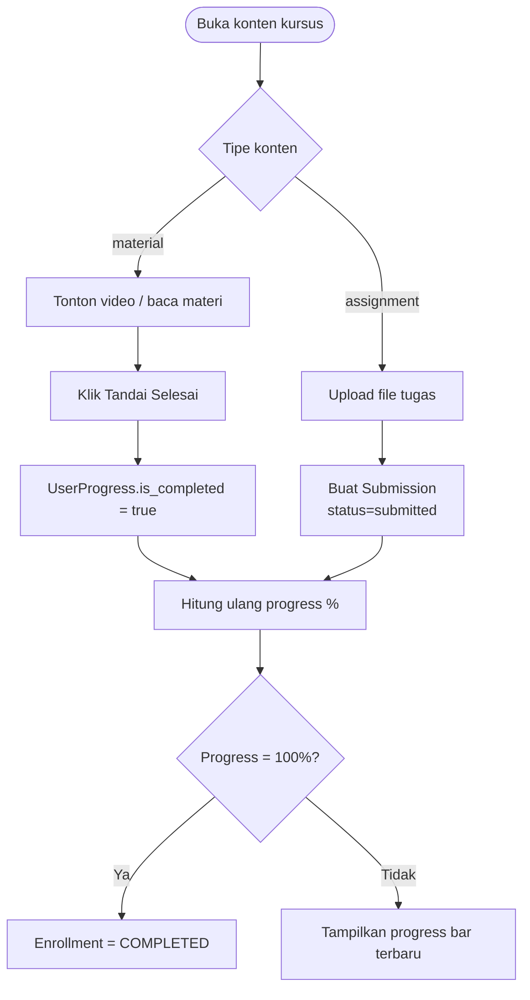

---

## 9. Activity: Grading oleh Instruktur

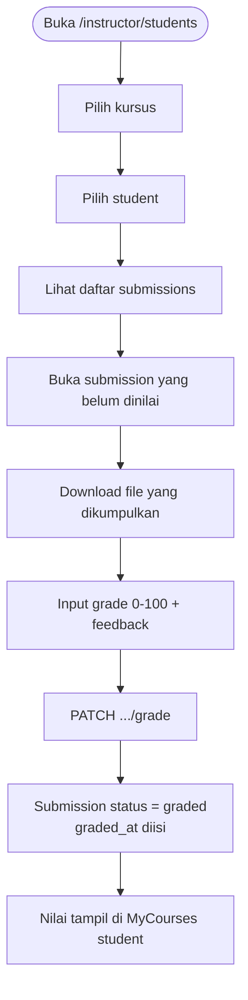

---

## 10. Activity: Payment Verification (Admin)

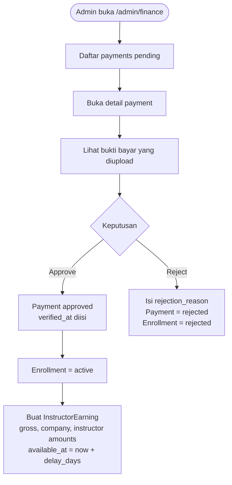

---

## 11. Activity: Payout Request & Release

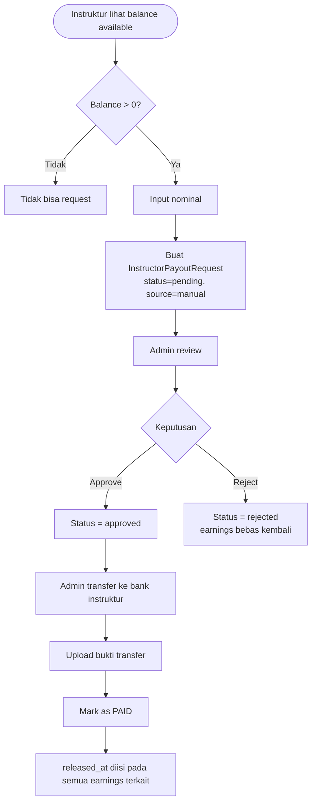

---

## 12. Activity: Role Request (Student → Instructor)

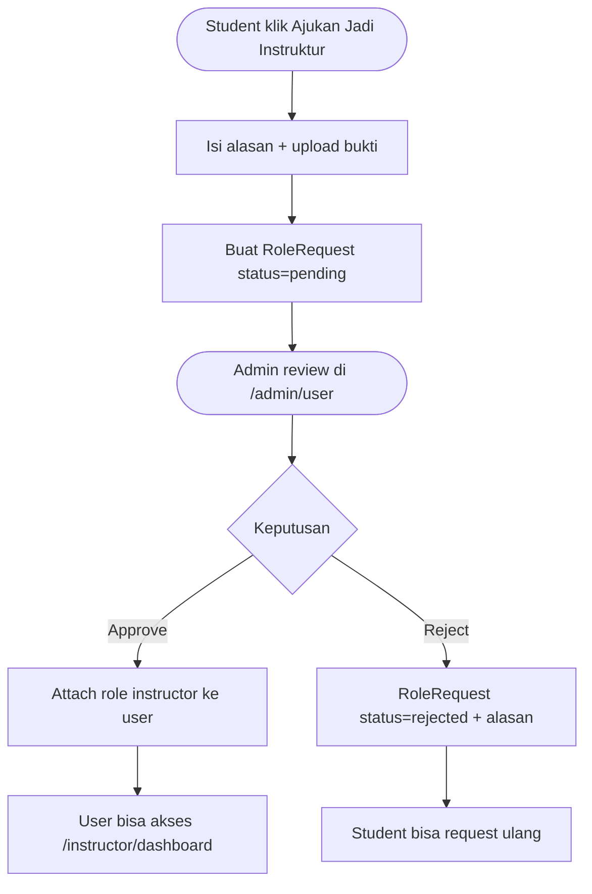

---

## 13. State Machine: User Status

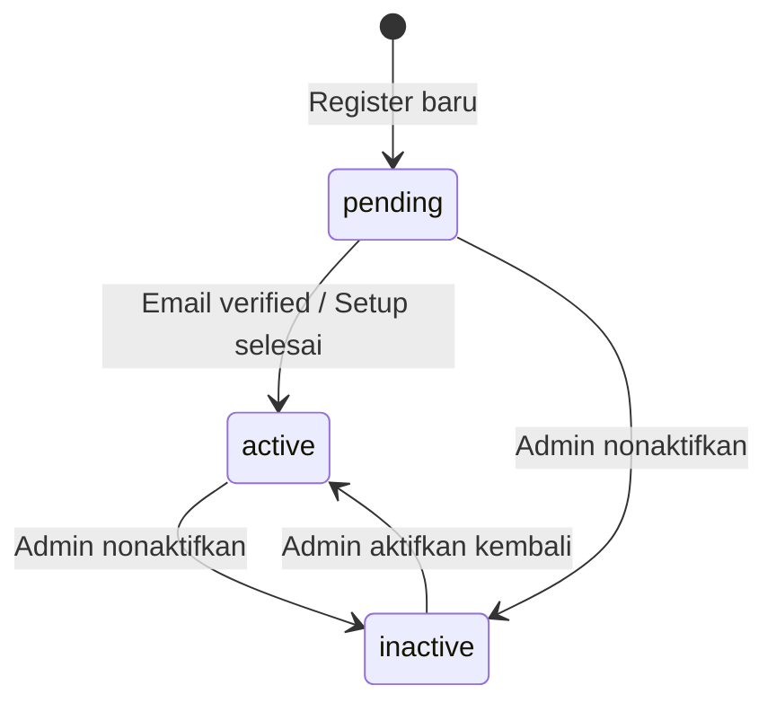

---

## 14. State Machine: Payment Status

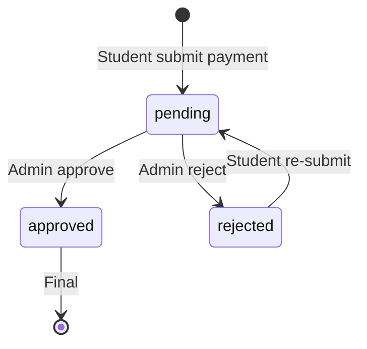

---

## 15. State Machine: Enrollment Status

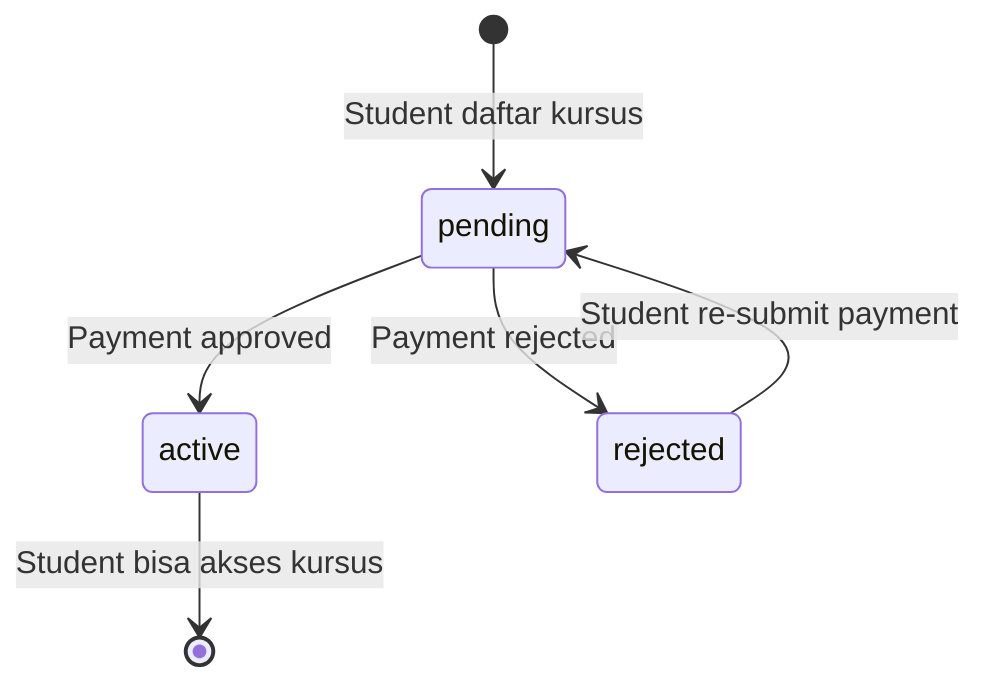

---

## 16. State Machine: Payout Request Status

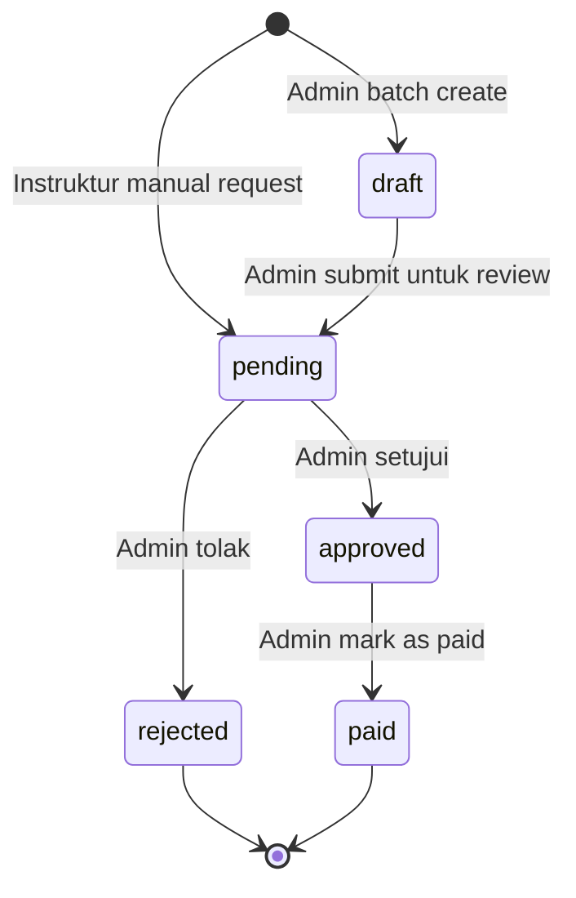

---

## 17. State Machine: Role Request Status

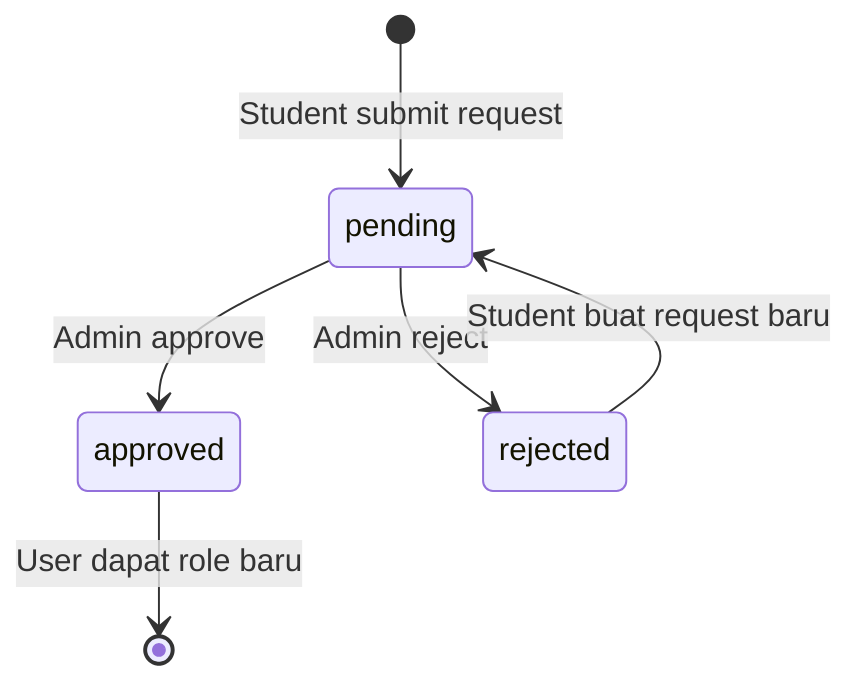

---

## 18. Middleware Chain

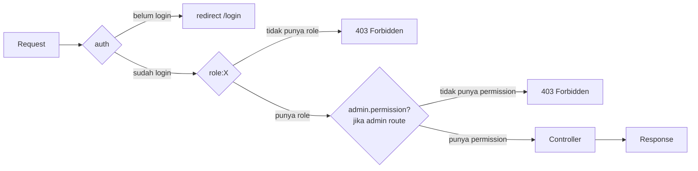
