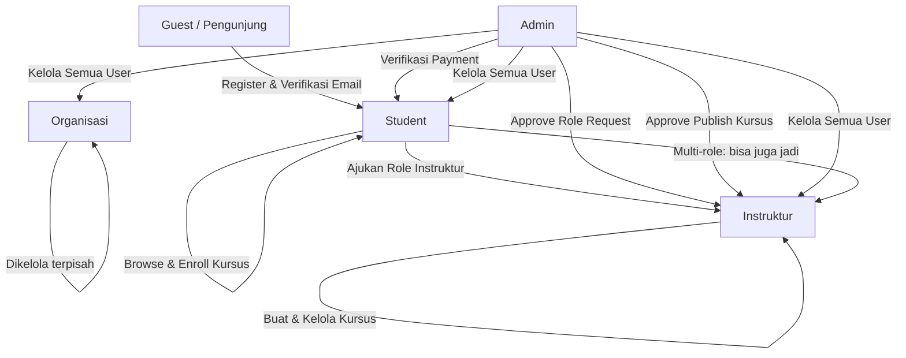
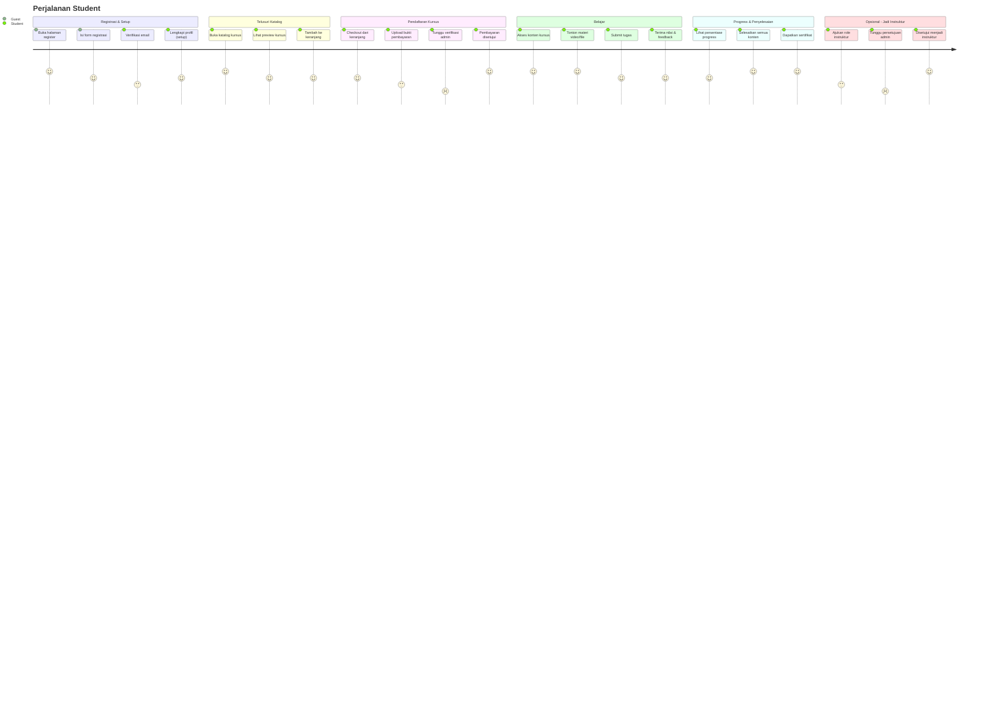
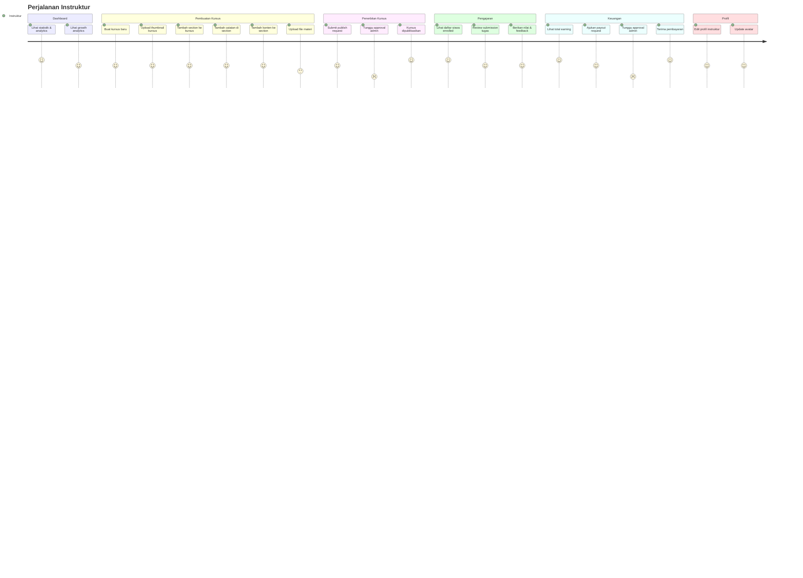
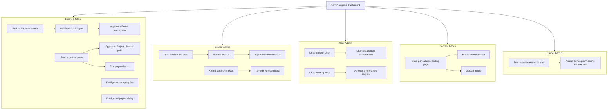
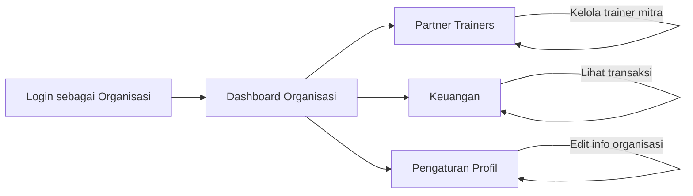
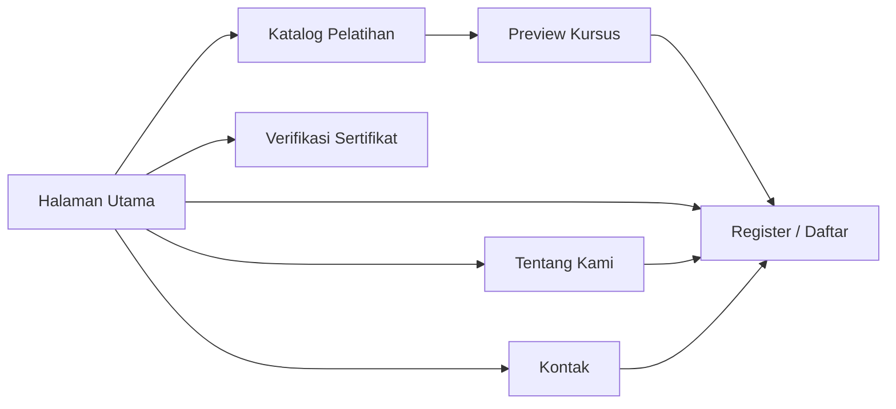

# User Journeys — Peta Perjalanan Pengguna

Dokumen ini menjelaskan alur pengalaman (user journey) untuk setiap role dalam sistem ERP Inkindo, divisualisasikan dengan diagram Mermaid.

---

## 1. Gambaran Umum

Diagram berikut menunjukkan hubungan antar role dan bagaimana seorang pengguna dapat berpindah dari satu role ke role lainnya.

---

## 2. Perjalanan Student (Student Journey)

Student adalah pengguna utama platform yang mendaftar untuk mengikuti kursus/pelatihan. Mereka bisa menelusuri katalog, mendaftar kursus, mengakses materi, mengerjakan tugas, dan pada akhirnya memperoleh sertifikat. Student juga bisa mengajukan diri menjadi Instruktur.

---

## 3. Perjalanan Instruktur (Instructor Journey)

Instruktur adalah pembuat dan pengelola kursus. Mereka membangun konten pembelajaran, memantau siswa yang terdaftar, memberikan penilaian, serta menerima pendapatan dari kursus yang mereka buat.

---

## 4. Perjalanan Admin

Admin memiliki akses ke seluruh sistem dengan permission granular. Setiap sub-permission memiliki tanggung jawab spesifik. Berikut diagram alur kerja setiap modul admin:

---

## 5. Perjalanan Organisasi (Organization Journey)

Role organisasi ditujukan untuk entitas korporat yang mengelola partner trainer dan keuangan pelatihan secara terpusat.

---

## 6. Perjalanan Guest (Public Visitor)

Guest adalah pengunjung yang belum terdaftar. Mereka bisa melihat informasi publik dan katalog pelatihan sebelum memutuskan untuk mendaftar.

---

## Catatan

- Semua diagram di atas berdasarkan route dan permission yang terdaftar di `routes/web.php`, `routes/auth.php`, `routes/guest.php`, dan konfigurasi middleware.
- Untuk detail permission admin, lihat [Roles & Permissions](04-roles-permissions.md).
- User bisa memiliki multi-role (contoh: Student + Instructor sekaligus) dan berpindah antar role tanpa logout.
