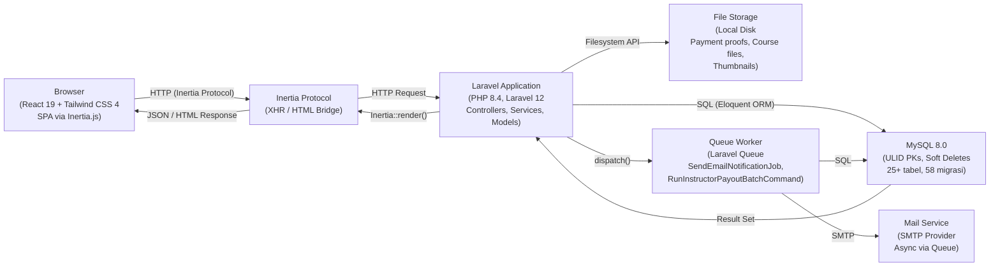
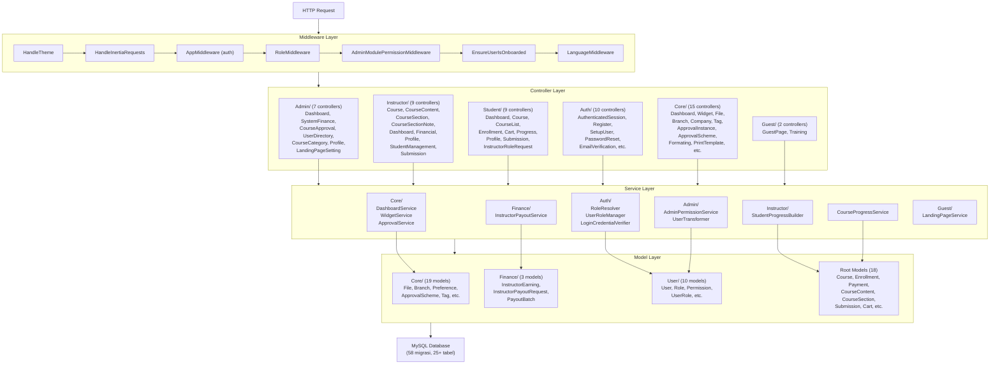
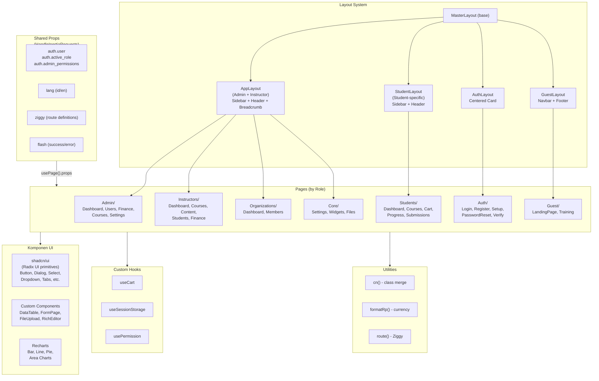
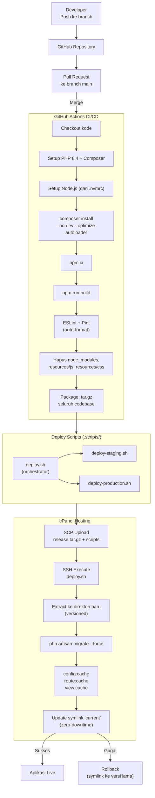
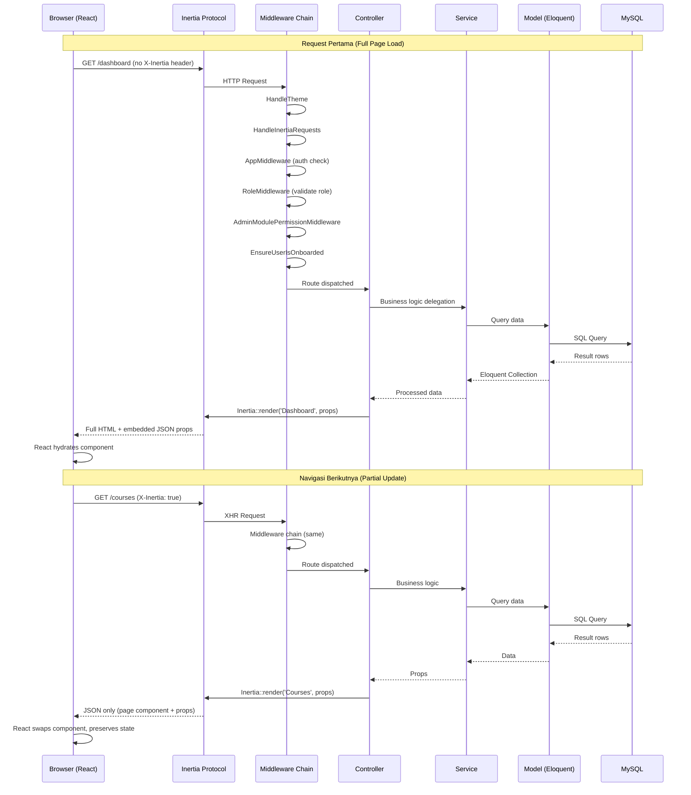
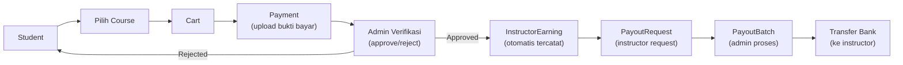
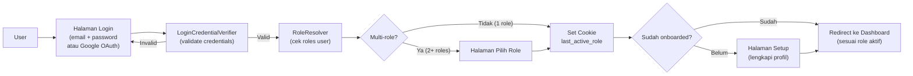

# Arsitektur Sistem — Diagram Teknis

Dokumen ini berisi diagram arsitektur teknis ERP Inkindo dalam format Mermaid. Setiap diagram menggambarkan aspek berbeda dari sistem.

---

## 1. C4 Container Diagram

Diagram ini menunjukkan seluruh container (unit deployable) dalam sistem dan interaksi antar-container.

**Keterangan:**
- **Browser** menjalankan React 19 yang di-render client-side, berkomunikasi dengan server via protokol Inertia.js
- **Inertia Protocol** menjembatani server dan client — request pertama mengembalikan HTML penuh, navigasi berikutnya hanya JSON partial
- **Laravel Application** memproses semua business logic melalui layer Controller → Service → Model
- **MySQL 8.0** menyimpan seluruh data dengan ULID sebagai primary key dan soft deletes untuk data recovery
- **File Storage** menyimpan file upload (bukti pembayaran, file kursus, thumbnail) di local disk
- **Queue Worker** memproses job asinkron seperti pengiriman email dan batch payout instructor

---

## 2. Diagram Komponen Backend

Diagram ini menggambarkan arsitektur layer backend secara detail, dari request masuk hingga database.

**Keterangan:**
- **Middleware Layer** memproses request secara berurutan: tema → Inertia → auth → role → permission → onboarding → bahasa
- **Controller Layer** diorganisir berdasarkan role pengguna, masing-masing bertanggung jawab atas route endpoint-nya
- **Service Layer** mengenkapsulasi business logic kompleks agar controller tetap ringan
- **Model Layer** merepresentasikan tabel database dengan relasi Eloquent, traits, dan scopes

---

## 3. Diagram Komponen Frontend

Diagram ini menunjukkan arsitektur React frontend termasuk layout, pages, dan shared props.

**Keterangan:**
- **Layout System** menggunakan hierarki layout — MasterLayout sebagai base, kemudian layout spesifik per konteks
- **Pages** diorganisir berdasarkan role, setiap folder berisi halaman-halaman untuk role tersebut
- **Components** menggabungkan shadcn/ui (primitif Radix UI) dengan komponen custom seperti DataTable dan FormPage
- **Shared Props** dikirim dari server ke semua halaman via middleware `HandleInertiaRequests`

---

## 4. Arsitektur Deployment

Diagram ini menunjukkan pipeline CI/CD dari repository hingga server produksi.

**Keterangan:**
- Pipeline dipicu saat PR di-merge ke branch `main` atau via manual trigger (`workflow_dispatch`)
- Build step menghasilkan static assets — Node.js **tidak** diperlukan di server produksi
- Deployment menggunakan **blue-green style** dengan symlink untuk zero-downtime
- Rollback otomatis jika deploy gagal, cukup mengubah symlink ke versi sebelumnya
- Lint CI (ESLint + Pint) memastikan kode terformat sebelum deploy

---

## 5. Request Lifecycle (Sequence Diagram)

Diagram ini menunjukkan alur lengkap sebuah request Inertia.js dari browser hingga response kembali.

**Keterangan:**
- **Request pertama**: Server mengembalikan HTML lengkap dengan data JSON ter-embed, React melakukan hydration
- **Navigasi berikutnya**: Browser mengirim XHR dengan header `X-Inertia: true`, server hanya mengembalikan JSON (component name + props)
- **Middleware chain** selalu diproses penuh pada setiap request untuk menjamin keamanan
- React hanya mengganti komponen halaman tanpa full-page reload, menjaga state yang sudah ada

---

## 6. Diagram Alur Data

Tiga alur data utama dalam sistem: pembayaran, konten kursus, dan autentikasi.

### 6a. Alur Pembayaran (Payment Flow)

### 6b. Alur Konten Kursus (Course Content Flow)

```mermaid
graph LR
    Instructor["Instructor"]
    CreateCourse["Buat Course\n(title, description, price)"]
    Sections["Buat Sections\n(modul/bab)"]
    Contents["Tambah Contents\n(video, text, quiz)"]
    Files["Upload Files\n(via FileController)"]
    Publish["PublishRequest\n(submit ke admin)"]
    AdminReview["Admin Review\n(approve/reject)"]
    Live["Course Live\n(visible ke student)"]
    StudentAccess["Student Enroll\n& akses konten"]
    Progress["UserProgress\n(tracking per content)"]

    Instructor --> CreateCourse
    CreateCourse --> Sections
    Sections --> Contents
    Contents --> Files
    Files --> Publish
    Publish --> AdminReview
    AdminReview -->|"Approved"| Live
    AdminReview -->|"Rejected"| Instructor
    Live --> StudentAccess
    StudentAccess --> Progress
```

### 6c. Alur Autentikasi (Authentication Flow)

**Keterangan:**
- **Payment Flow**: Mengikuti pola submit → verify → earn → payout. Admin bertindak sebagai verifikator pembayaran.
- **Course Content Flow**: Instructor membuat konten secara bertahap, lalu submit untuk approval sebelum dipublikasi.
- **Authentication Flow**: Mendukung multi-role — user dengan lebih dari satu role akan diminta memilih role aktif saat login. Cookie `last_active_role` menyimpan pilihan terakhir.

---

## Referensi Terkait

- [02 — Arsitektur Sistem](02-architecture.md) — Gambaran besar dan design patterns
- [04 — Roles & Permissions](04-roles-permissions.md) — Sistem multi-role detail
- [07 — Service Layer](07-services.md) — Dokumentasi service classes
- [09 — Deployment](09-deployment.md) — Konfigurasi deploy dan CI/CD
