# Feature Flows — Diagram Alur Fitur

Dokumen ini berisi diagram aktivitas (flowchart) dan diagram sequence untuk setiap fitur utama dalam sistem ERP Inkindo. Setiap diagram menggambarkan alur langkah demi langkah dari perspektif pengguna dan sistem.

---

## Daftar Isi

1. [Course Management (Instruktur)](#1-course-management-instruktur)
2. [Course Discovery & Enrollment (Student)](#2-course-discovery-enrollment-student)
3. [Learning & Progress (Student)](#3-learning-progress-student)
4. [Grading & Student Management (Instruktur)](#4-grading-student-management-instruktur)
5. [Payment Verification (Admin)](#5-payment-verification-admin)
6. [Payout Pipeline (Lengkap)](#6-payout-pipeline-lengkap)
7. [Course Approval Workflow (Admin)](#7-course-approval-workflow-admin)
8. [Role Request Workflow](#8-role-request-workflow)
9. [Multi-Role Login & Switching](#9-multi-role-login-switching)
10. [User Registration & Onboarding](#10-user-registration-onboarding)
11. [Cart & Checkout System](#11-cart-checkout-system)
12. [Financial Configuration (Admin)](#12-financial-configuration-admin)
13. [Landing Page Management (Admin)](#13-landing-page-management-admin)
14. [User Management (Admin)](#14-user-management-admin)

---

## 1. Course Management (Instruktur)

### 1.1 Pembuatan Course

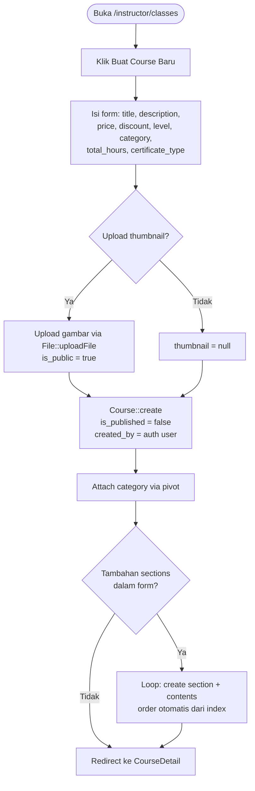

### 1.2 Update Course (Termasuk Perubahan Harga)

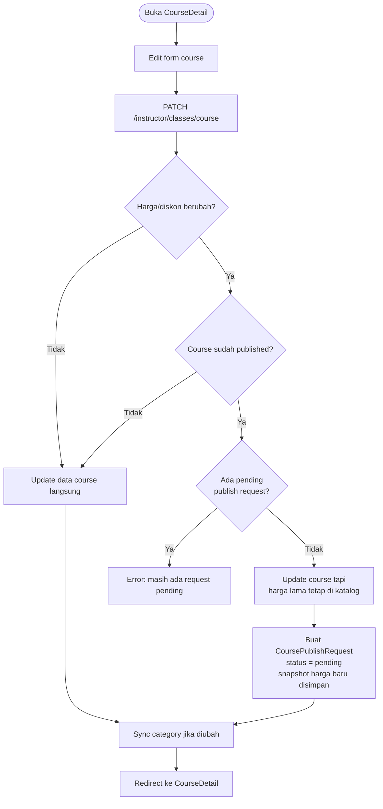

### 1.3 Section Management

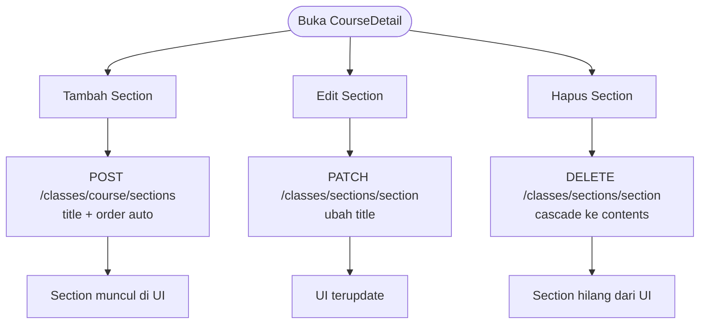

### 1.4 Content Management (Upload File & Materi)

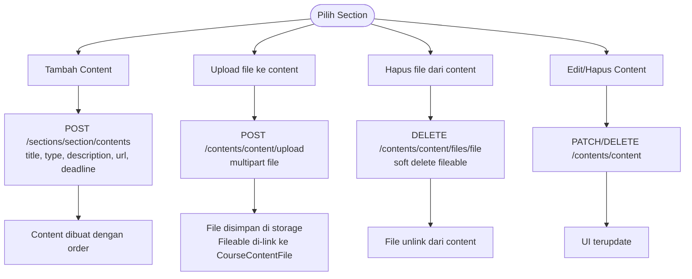

### 1.5 Toggle Publish / Submit Publish Request

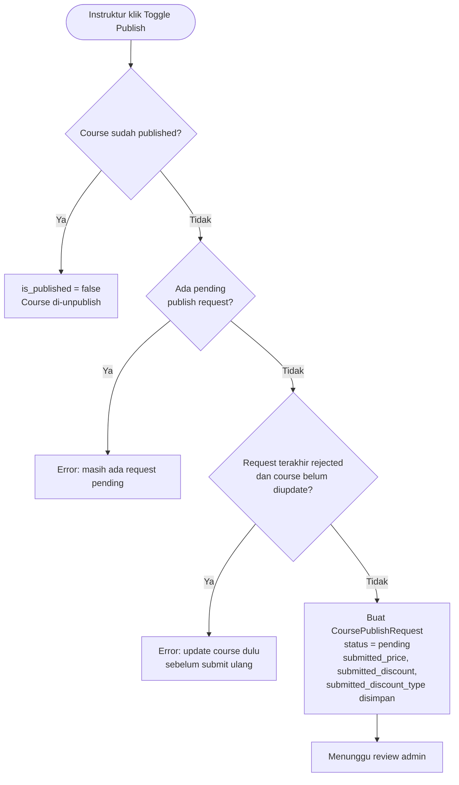

---

## 2. Course Discovery & Enrollment (Student)

### 2.1 Browse Katalog Course

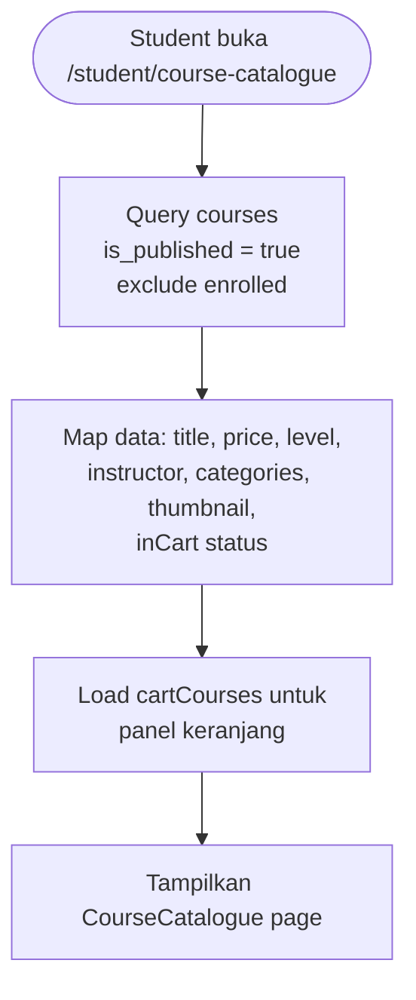

### 2.2 Preview Course

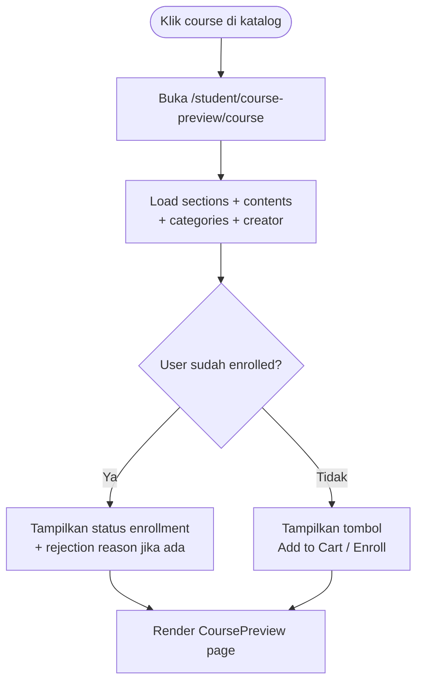

### 2.3 Add to Cart

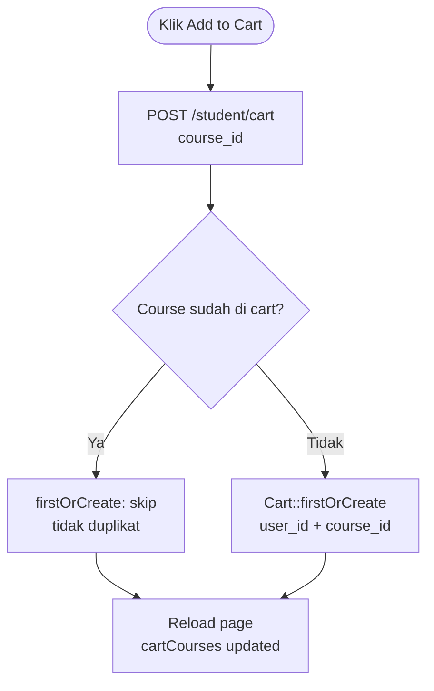

### 2.4 Checkout & Payment

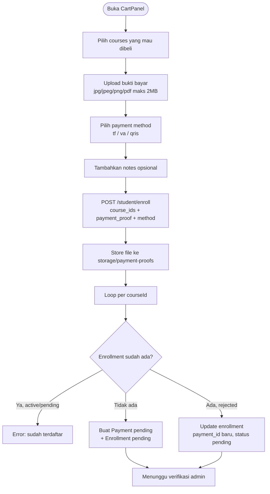

---

## 3. Learning & Progress (Student)

### 3.1 Navigasi Konten Course

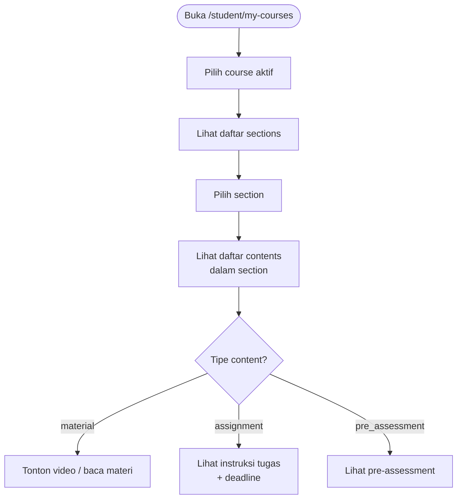

### 3.2 Material Completion (Tandai Selesai)

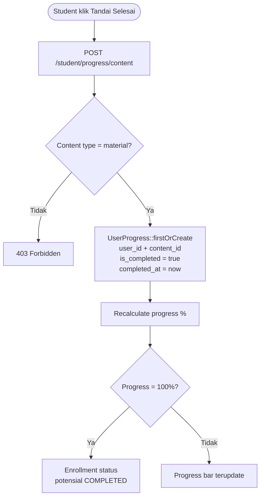

### 3.3 Assignment Submission

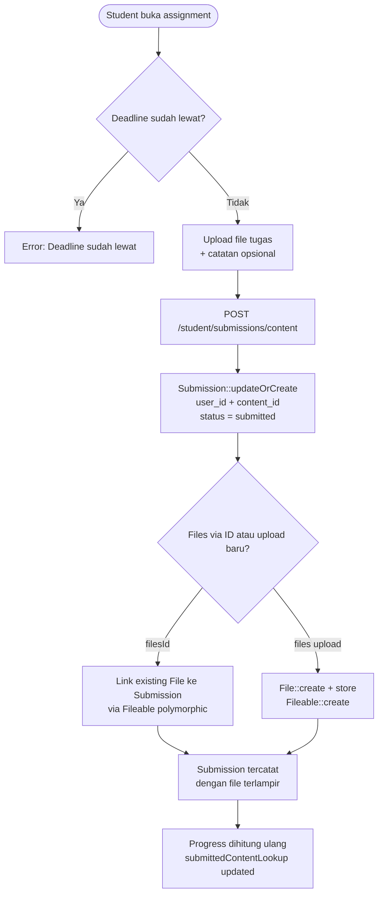

### 3.4 Progress Calculation Formula

```mermaid
flowchart TD
    A[Mulai perhitungan]) --> B[Ambil semua contents\ndari semua sections course]
    B --> C[Hitung totalContents]
    C --> D[Untuk setiap content]
    D --> E{Tipe content?}
    E -->|material| F{Ada di completedContentLookup?\ndari UserProgress is_completed=true}
    E -->|assignment / pre_assessment| G{Ada di submittedContentLookup?\ndari Submission dengan files}
    F -->|Ya| H[completed++]
    F -->|Tidak| I[skip]
    G -->|Ya| H
    G -->|Tidak| I
    H --> J[progress = round\ncompleted / total * 100]
    I --> J
    J --> K[Clamp 0-100]
```

### 3.5 Course Completion Trigger

```mermaid
flowchart TD
    A[Progress mencapai 100%]) --> B[resolveStatusFromProgress\nreturn COMPLETED]
    B --> C[Student melihat course\nsebagai completed di MyCourses]
```

---

## 4. Grading & Student Management (Instruktur)

### 4.1 Lihat Daftar Student

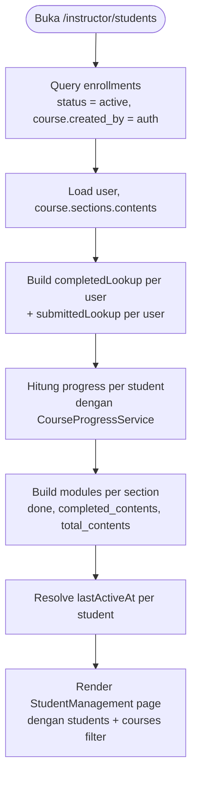

### 4.2 Review & Grading Submission

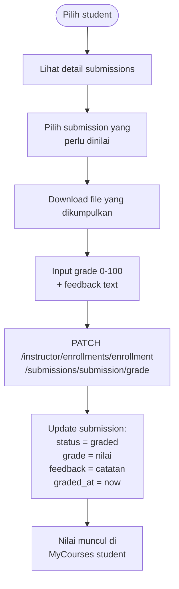

---

## 5. Payment Verification (Admin)

### 5.1 Lihat Daftar Payments Pending

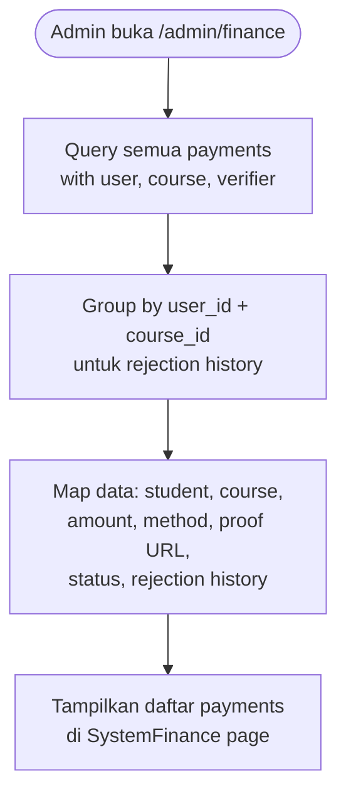

### 5.2 Approve Payment

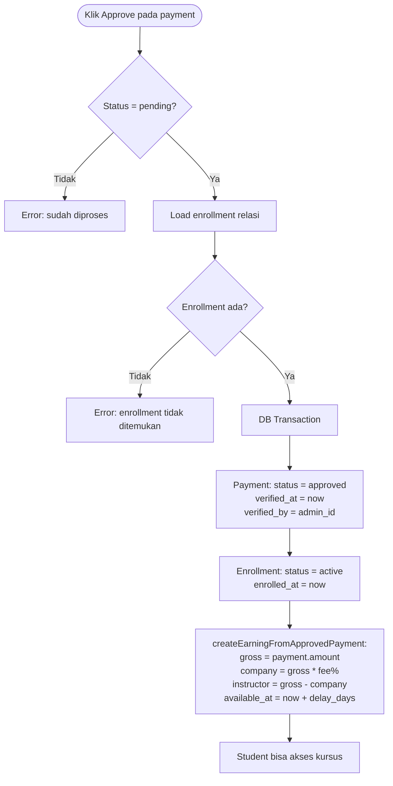

### 5.3 Reject Payment

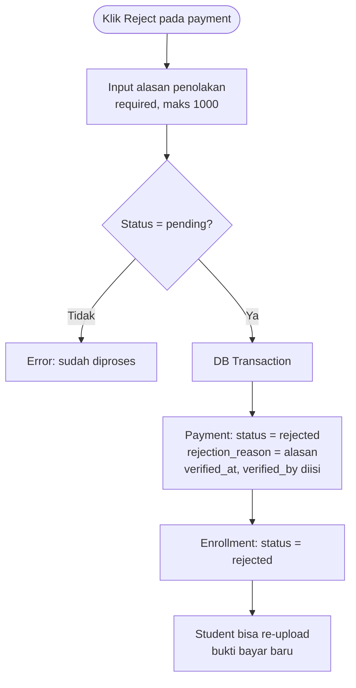

---

## 6. Payout Pipeline (Lengkap)

### 6.1 Earning Creation (dari Approved Payment)

```mermaid
flowchart TD
    A[Payment di-approve]) --> B[Load course.creator = instructor]
    B --> C[Hitung:
grossAmount = payment.amount
companyFee = resolveCompanyFeePercentage
companyAmount = gross * fee / 100
instructorAmount = gross - company]
    C --> D[Hitung available_at:\nverified_at + payout_delay_days]
    D --> E[InstructorEarning::updateOrCreate\npayment_id sebagai unique key]
    E --> F[Earning tercatat\ntapi belum bisa ditarik]
```

### 6.2 Eligible Balance Calculation

```mermaid
flowchart TD
    A[Hitung balance available]) --> B[Query earnings:\navailable_at <= now\nreleased_at IS NULL]
    B --> C[Left join reserved amounts\ndari payout_request_items\nwhere status in draft,pending,approved,paid]
    C --> D[Per earning:\navailable = instructor_amount - reserved]
    D --> E[Filter: available > 0]
    E --> F[Sum semua available amounts\n= eligible balance]
```

### 6.3 Manual Payout Request (Instruktur)

```mermaid
flowchart TD
    A([Instruktur buka /instructor/financial]) --> B[Lihat available balance]
    B --> C{Balance > 0?}
    C -->|Tidak| D[Tidak bisa request]
    C -->|Ya| E[Input nominal + note]
    E --> F[POST /instructor/financial/payout-requests]
    F --> G{Nominal <= eligible balance?}
    G -->|Tidak| H[Error: melebihi saldo]
    G -->|Ya| I[DB Transaction]
    I --> J[Buat InstructorPayoutRequest\nstatus = pending, source = manual]
    J --> K[Loop eligible earnings:\ncreate PayoutRequestItem\ndengan amount dari earning]
    K --> L[remaining amount berkurang\nsampai 0]
    L --> M[Request menunggu review admin]
```

### 6.4 Batch Payout Generation (Admin)

```mermaid
flowchart TD
    A([Admin klik Run Batch]) --> B[POST /admin/finance/payouts/batch]
    B --> C[resolveBatchCandidateInstructorIds:\nsemua instructor dengan\nearning available_at <= now]
    C --> D[Loop per instructor]
    D --> E[Query eligible earnings]
    E --> F{Amount > 0?}
    F -->|Tidak| G[skipped++]
    F -->|Ya| H[DB Transaction:\nBuat PayoutRequest\nstatus = draft, source = batch\nrequested_by = admin]
    H --> I[Create PayoutRequestItem\nuntuk setiap earning\namount = full available]
    I --> J[created++]
    J --> K[Lanjut instructor berikutnya]
    G --> K
    K --> L[Return: created X, skipped Y]
```

### 6.5 Payout Approval & Payment Release

```mermaid
flowchart TD
    A([Admin review payout request]) --> B{Status draft/pending?}
    B -->|Tidak| C[Error: tidak bisa disetujui]
    B -->|Ya| D{Keputusan}
    D -->|Approve| E[status = approved\napproved_by, approved_at diisi\napproved_amount = requested_amount]
    D -->|Reject| F[status = rejected\nrejection_reason diisi\nearnings bebas kembali]

    E --> G([Admin transfer ke bank])
    G --> H[Upload bukti transfer\n+ transfer_reference]
    H --> I[PATCH mark as PAID]
    I --> J[DB Transaction:\nstatus = paid\npaid_by, paid_at diisi]
    J --> K[Check semua earnings terkait:\njika total paid >= instructor_amount\nreleased_at = now]
    K --> L[Earning ditandai released]
```

---

## 7. Course Approval Workflow (Admin)

### 7.1 Review & Approve Course

```mermaid
flowchart TD
    A([Admin buka /admin/approvals]) --> B[Lihat semua CoursePublishRequest\ndengan course, creator, reviewer]
    B --> C[Group by course_id\nuntuk rejection history]
    C --> D[Map data: title, instructor,\nsubmitted price/discount,\nfinal price calculation]
    D --> E{Keputusan}
    E -->|Approve| F[DB Transaction]
    F --> G[Request: status = approved\nreviewed_by, reviewed_at diisi]
    G --> H[Course: price = submitted_price\ndiscount = submitted_discount\ndiscount_type = submitted_discount_type\nis_published = true]
    H --> I[Course muncul di katalog student]
```

### 7.2 Reject Course

```mermaid
flowchart TD
    A([Admin klik Reject]) --> B[Input alasan penolakan]
    B --> C[DB Transaction]
    C --> D[Request: status = rejected\nreviewed_by, reviewed_at diisi\nrejection_reason = alasan]
    D --> E[Course: is_published tidak berubah]
    E --> F[Instruktur lihat rejection reason\ndi ManageClasses]
    F --> G[Instruktur revisi course\ndan submit ulang]
```

---

## 8. Role Request Workflow

### 8.1 Student Ajukan Jadi Instruktur

```mermaid
flowchart TD
    A([Student klik Ajukan Jadi Instruktur]) --> B[Isi alasan + upload bukti pendukung]
    B --> C[POST /student/instructor-requests]
    C --> D[RoleRequest::create\nrequested_role = instructor\nstatus = pending\nproof_file_id dari uploaded file]
    D --> E[Menunggu review admin]
```

### 8.2 Admin Review Role Request

```mermaid
flowchart TD
    A([Admin buka /admin/user tab Requests]) --> B[Lihat daftar role requests\nwith user, reviewer, proofFile]
    B --> C{Keputusan}
    C -->|Approve| D[DB Transaction]
    D --> E[userRoleManager.attachInstructorRole\nuser dapat role instructor]
    E --> F[RoleRequest: status = approved\nreviewed_by, reviewed_at diisi]
    F --> G[User bisa akses /instructor/*]

    C -->|Reject| H[Input alasan penolakan]
    H --> I[RoleRequest: status = rejected\nrejection_reason = alasan]
    I --> J[Student bisa request ulang]
```

---

## 9. Multi-Role Login & Switching

### 9.1 Login Flow dengan Role Detection

```mermaid
flowchart TD
    A([Buka /login]) --> B[Isi email + password]
    B --> C[POST /login/roles\nverify credentials]
    C --> D{Kredensial valid?}
    D -->|Tidak| E[Error: kredensial salah]
    D -->|Ya| F[Normalize roles dari user.roles]
    F --> G{Jumlah role?}
    G -->|0 role| H[Logout + Error: no role access]
    G -->|1 role| I[Return auto_role]
    G -->|2+ roles| J[Return requires_selection = true\n+ daftar roles]
    I --> K[POST /login dengan preferred_role]
    J --> L[Tampilkan halaman SelectRole]
    L --> M[User pilih role]
    M --> K
    K --> N[Auth::login + session regenerate]
    N --> O[Set cookie last_active_role]
    O --> P[Redirect ke dashboard role terpilih]
```

### 9.2 Role Switching Tanpa Logout

```mermaid
flowchart TD
    A([User klik role lain di UI]) --> B[Navigate ke /role/path]
    B --> C{User punya role ini?}
    C -->|Tidak| D[403 Forbidden]
    C -->|Ya| E[Redirect ke dashboard role\n+ set cookie last_active_role]
    E --> F[UI load dashboard baru\ntanpa logout/re-login]
```

### 9.3 Google OAuth Flow

```mermaid
flowchart TD
    A([Klik Login with Google]) --> B[Redirect ke Google OAuth]
    B --> C[Google callback ke /auth/google/callback]
    C --> D{User sudah login?}
    D -->|Ya| E[Link provider ke akun existing\nupdateOrCreate UserProvider]
    D -->|Tidak| F{Provider sudah pernah di-link?}
    F -->|Ya| G[Login via provider existing]
    F -->|Tidak| H{Email ada di DB?}
    H -->|Ya| I[Link ke user existing]
    H -->|Tidak| J[Buat user baru\nstatus = pre_registered\nemail_verified_at = now]
    J --> K[Create UserProvider]
    I --> K
    G --> L[ensureStudentRole]
    K --> L
    L --> M{Status user?}
    M -->|inactive| N[Error: akun nonaktif]
    M -->|pre_registered / invited| O[Redirect ke /setup]
    M -->|active| P[Login + redirect ke dashboard]
```

---

## 10. User Registration & Onboarding

### 10.1 Registrasi Normal

```mermaid
flowchart TD
    A([Buka /register]) --> B[Isi: name, username, email,\nphone, password, gender, birthdate]
    B --> C{Email sudah di DB?}
    C -->|Ya, status = invited| D[Update user existing\nset password, name, dll\nstatus = active]
    C -->|Ya, bukan invited| E[Error: Email already exists]
    C -->|Tidak ada| F[User::create\nstatus = active\npassword = hash]
    D --> G{Request role instructor?}
    F --> G
    G -->|Ya| H[Attach role student + instructor]
    G -->|Tidak| I[Attach role student saja]
    H --> J[Auth::login]
    I --> J
    J --> K{2+ role?}
    K -->|Ya| L[Redirect ke /select-role]
    K -->|Tidak| M[Redirect ke /student/dashboard]
```

### 10.2 Setup User (Invited / OAuth)

```mermaid
flowchart TD
    A([Redirect ke /setup]) --> B{Status user?}
    B -->|active| C[Redirect ke dashboard]
    B -->|pre_registered / invited| D[Tampilkan form setup]
    D --> E[Isi: name, password,\nprofile data]
    E --> F{User ingin role instructor?}
    F -->|Ya| G[Attach instructor role]
    F -->|Tidak| H[Ensure student role saja]
    G --> I[Save data]
    H --> I
    I --> J{Status invited + has password\n+ has branch?}
    J -->|Ya| K[status = active]
    J -->|Tidak| L[status tetap sama]
    K --> M[Redirect ke dashboard]
    L --> M
```

---

## 11. Cart & Checkout System

### 11.1 Cart Panel Flow

```mermaid
flowchart TD
    A([Student klik icon cart]) --> B[Buka CartPanel sidebar]
    B --> C[Load cartCourses\ndari Cart where user_id]
    C --> D[Tampilkan daftar course di cart\ndengan harga + instructor]
    D --> E{Aksi student}
    E -->|Hapus course| F[DELETE /student/cart/courseId]
    F --> G[Cart dihapus\ncartCourses reload]
    E -->|Checkout| H[Pilih courses yang mau dibeli]
    H --> I[Upload bukti bayar]
    I --> J[Pilih payment method]
    J --> K[Submit enrollment\nlihat flow 2.4]
```

### 11.2 Payment Method Options

```mermaid
flowchart LR
    A[Payment Method] --> B[tf = Bank Transfer]
    A --> C[va = Virtual Account]
    A --> D[qris = QRIS]
```

---

## 12. Financial Configuration (Admin)

### 12.1 Company Fee Percentage

```mermaid
flowchart TD
    A([Admin buka /admin/finance tab Settings]) --> B[Lihat company_fee_percentage saat ini]
    B --> C[Input persentase baru 0-100]
    C --> D[PATCH /admin/finance/settings/company-fee]
    D --> E[Normalize: min 0, max 100, round 2 desimal]
    E --> F[Preference::updateOrCreate\nkey = company_fee_percentage]
    F --> G[Setting baru berlaku untuk\nearning yang dibuat SETELAH perubahan\ntidak retroaktif]
```

### 12.2 Payout Delay Days

```mermaid
flowchart TD
    A([Admin buka tab Settings]) --> B[Lihat payout_delay_days saat ini]
    B --> C[Input jumlah hari delay >= 0]
    C --> D[PATCH /admin/finance/settings/payout-delay]
    D --> E[Preference::updateOrCreate\nkey = payout_delay_days]
    E --> F[Delay baru berlaku untuk\nearning yang dibuat SETELAH perubahan]
```

---

## 13. Landing Page Management (Admin)

### 13.1 Content Settings

```mermaid
flowchart TD
    A([Admin buka /admin/landing-page-settings]) --> B[Load settings dari Preferences\nhero, about, features, testimonial, dll]
    B --> C[Edit konten per section]
    C --> D{Upload media?}
    D -->|Ya| E[POST /admin/landing-page-settings/media\nstore ke storage]
    D -->|Tidak| F[Edit text saja]
    E --> G[PATCH /admin/landing-page-settings\nsave all settings]
    F --> G
    G --> H[Guest pages pull dari\nGuestPageContentService]
```

---

## 14. User Management (Admin)

### 14.1 User Directory

```mermaid
flowchart TD
    A([Admin buka /admin/user]) --> B[Query semua users\nwith roles, inactiveByUser]
    B --> C[Transform via UserTransformer:\nname, email, roles, status,\ninactive info]
    C --> D[Load role requests\nwhere requested_role = instructor]
    D --> E[Load admin users\nwith permissions]
    E --> F[Render UserDirectory page\ntabs: Users, Requests, Admins]
```

### 14.2 User Status Management

```mermaid
flowchart TD
    A([Admin klik toggle status user]) --> B{Status target?}
    B -->|inactive| C[Input alasan deaktivasi]
    C --> D[Update user:
status = inactive
inactive_reason = alasan
inactive_by = admin_id
inactive_at = now]
    B -->|active| E[Update user:\nstatus = active\nclear inactive_reason/by/at]
    D --> F[User tidak bisa login\njika inactive]
    E --> G[User bisa login kembali]
```

### 14.3 Admin Permission Management

```mermaid
flowchart TD
    A([Tab Admins - hanya super_admin]) --> B[Pilih admin user]
    B --> C[Pilih permissions:\nfinance_admin, course_admin,\nuser_admin, content_admin]
    C --> D[PATCH /admin/user/admins/user/permissions]
    D --> E[AdminPermissionService.syncAdminPermissions]
    E --> F{Actor = super_admin?}
    F -->|Tidak| G[Error: tidak punya akses]
    F -->|Ya| H[Sync admin_user_permissions pivot\nsoft delete untuk revoke]
    H --> I[Admin bisa akses route\nsesuai permission yang diberikan]
```

### 14.4 Last Super Admin Protection

```mermaid
flowchart TD
    A([Super_admin ingin menghapus\npermission super_admin sendiri]) --> B[AdminPermissionService check]
    B --> C{Ini super_admin terakhir?}
    C -->|Ya| D[Error: tidak bisa menghapus\nsuper_admin terakhir]
    C -->|Tidak| E[Izinkan perubahan]
```
