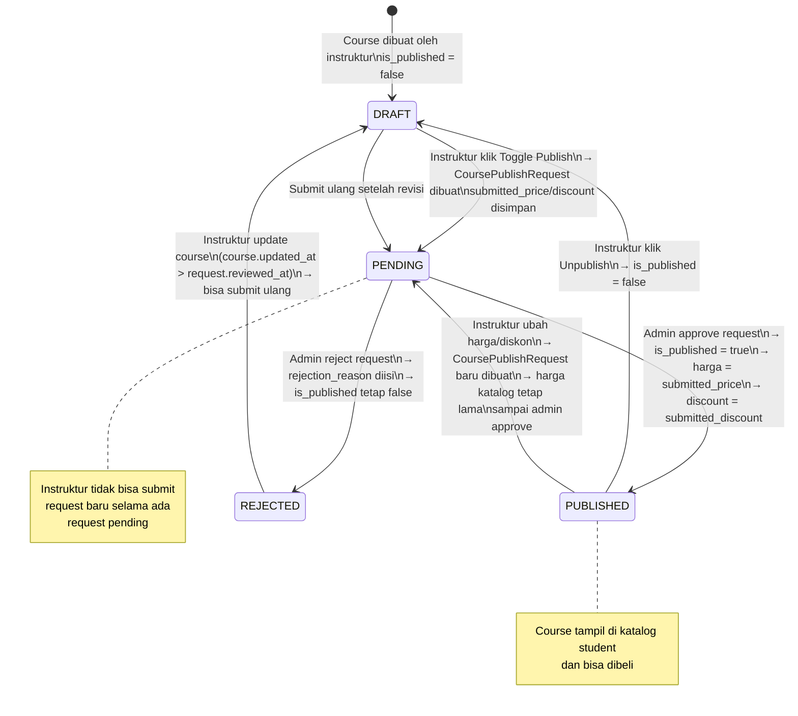
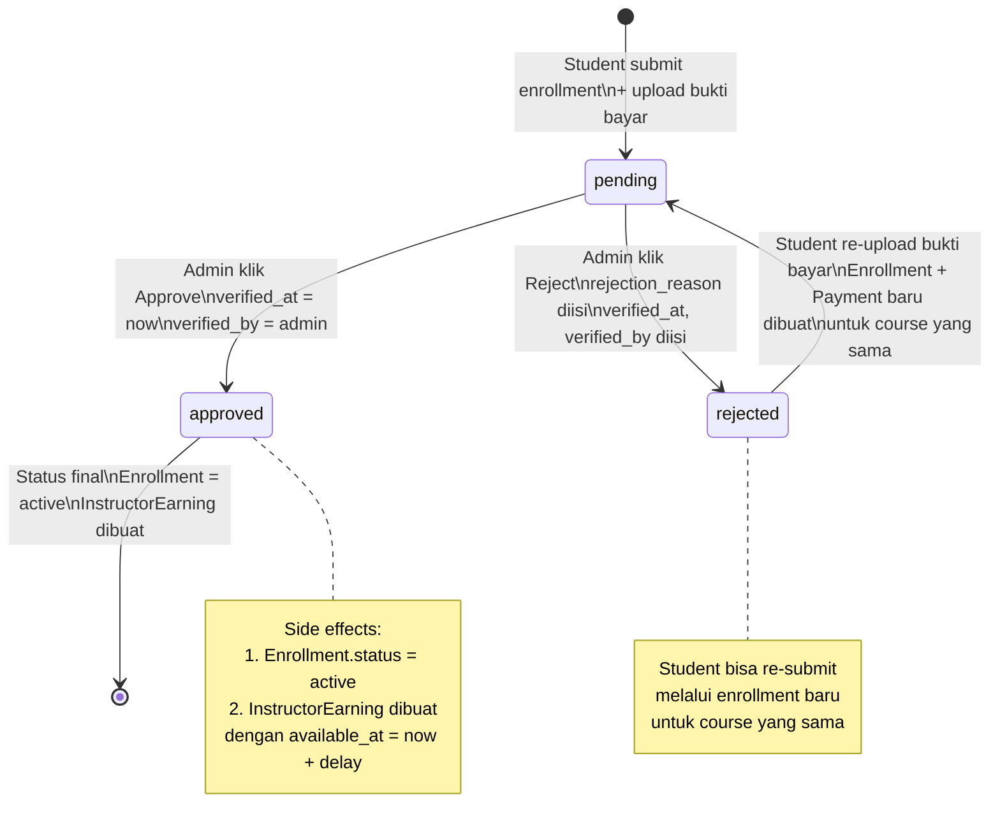
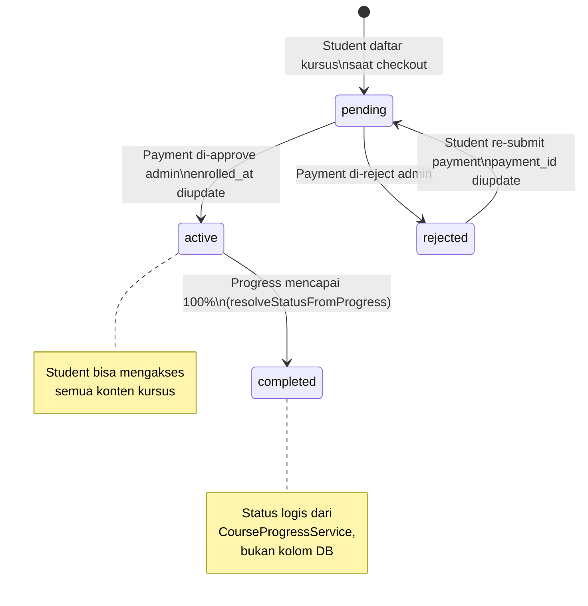
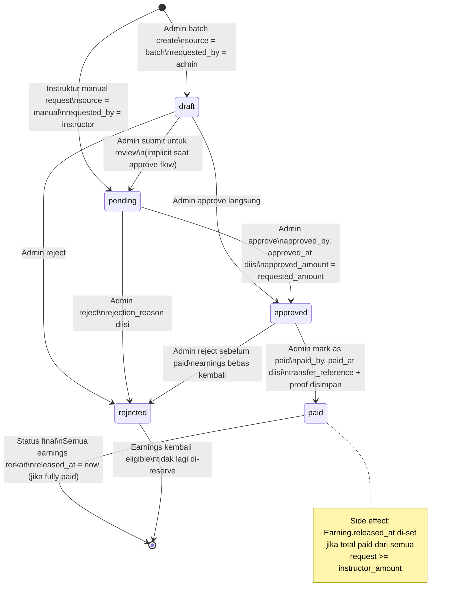
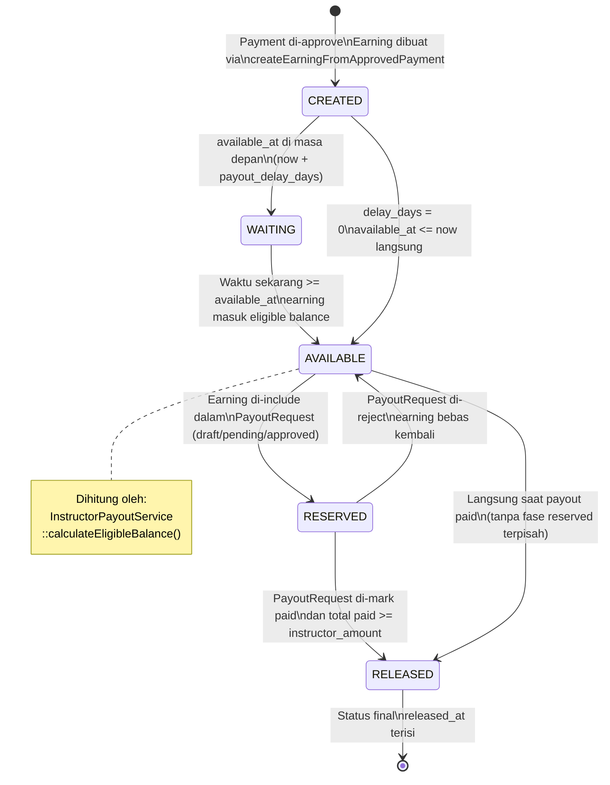
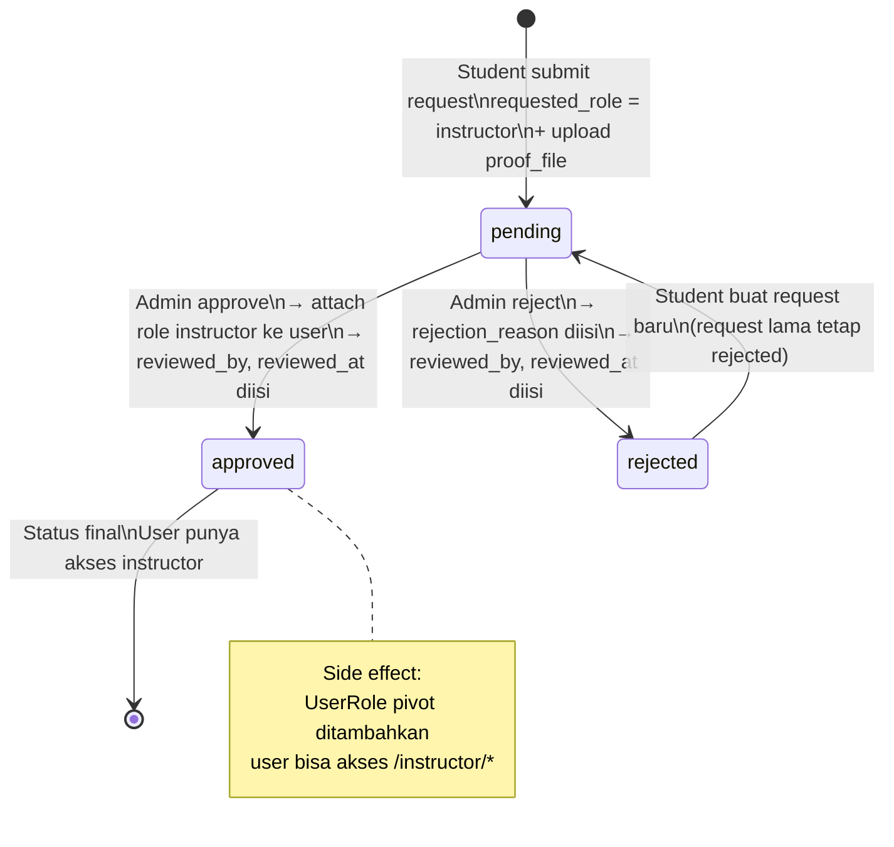
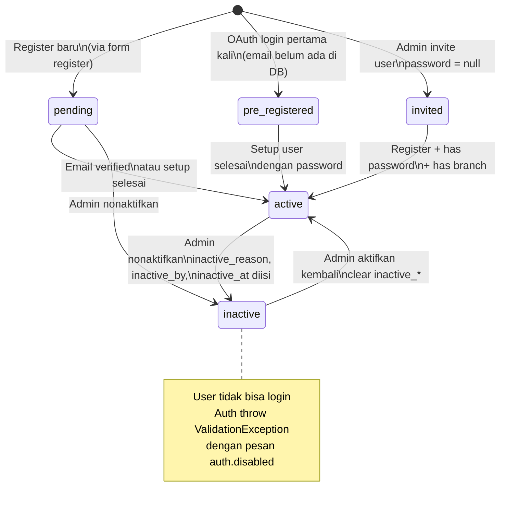
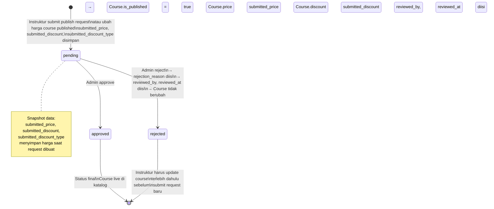

# State Machines — Diagram Mesin Status

Dokumen ini berisi semua state machine diagram untuk entitas dalam sistem ERP Inkindo. Setiap diagram menunjukkan transisi status, trigger, aktor, dan side effect yang terjadi.

> **Catatan:** Diagram ringkas sudah ada di [`10-diagrams.md`](./10-diagrams.md). Dokumen ini memberikan versi yang lebih detail dengan anotasi lengkap.

---

## Daftar Isi

1. [Course Status](#1-course-status)
2. [Payment Status](#2-payment-status)
3. [Enrollment Status](#3-enrollment-status)
4. [Payout Request Status](#4-payout-request-status)
5. [Instructor Earning Lifecycle](#5-instructor-earning-lifecycle)
6. [Role Request Status](#6-role-request-status)
7. [User Status](#7-user-status)
8. [Submission Status](#8-submission-status)
9. [Course Publish Request Status](#9-course-publish-request-status)

---

## 1. Course Status

Status course ditentukan oleh kombinasi kolom `is_published` dan status `CoursePublishRequest` terakhir.



### Trigger & Kondisi

| Transisi | Trigger | Aktor | Kondisi |
|----------|---------|-------|---------|
| `* → DRAFT` | `Course::create` | Instruktur | Selalu saat create |
| `DRAFT → PENDING` | `togglePublish` | Instruktur | Tidak ada pending request; tidak rejected tanpa update |
| `PENDING → PUBLISHED` | `approve` | Admin (course_admin/super_admin) | Request status = pending |
| `PENDING → REJECTED` | `reject` | Admin (course_admin/super_admin) | Request status = pending |
| `REJECTED → DRAFT` | `update` | Instruktur | `course.updated_at > request.reviewed_at` |
| `PUBLISHED → DRAFT` | `togglePublish` | Instruktur | Langsung, tanpa request |
| `PUBLISHED → PENDING` | `update` (harga berubah) | Instruktur | Harga/diskon berubah, tidak ada pending request |

### Status Resolution (Kode)

```php
// Instructor\CourseController::resolveStatus
if ($course->is_published) return 'published';
if ($latestRequest->status === 'pending') return 'pending';
if ($latestRequest->status === 'rejected') return 'rejected';
return 'draft';
```

---

## 2. Payment Status



### Side Effects per Transisi

| Transisi | Side Effects |
|----------|-------------|
| `pending → approved` | Enrollment = active, InstructorEarning dibuat (gross, company, instructor amounts) |
| `pending → rejected` | Enrollment = rejected, rejection_reason tersimpan |
| `rejected → pending` | Payment baru + Enrollment baru (update payment_id) |

---

## 3. Enrollment Status



### Status Determination

| Status | Kolom DB | Logika |
|--------|----------|--------|
| `pending` | `enrollments.status = 'pending'` | Menunggu verifikasi payment |
| `active` | `enrollments.status = 'active'` | Payment sudah di-approve |
| `rejected` | `enrollments.status = 'rejected'` | Payment di-reject |
| `completed` | Bukan kolom DB | `CourseProgressService::resolveStatusFromProgress(100)` |

---

## 4. Payout Request Status



### Reserved Statuses

Earning di-reserve (dikurangi dari eligible balance) saat termasuk dalam payout request dengan status:
`draft`, `pending`, `approved`, `paid`

```php
private const RESERVED_STATUSES = ['draft', 'pending', 'approved', 'paid'];
```

---

## 5. Instructor Earning Lifecycle

Ini bukan state machine dari kolom DB, melainkan **logical states** yang dihitung dari kolom-kolom earning.



### Kriteria Available

```
earning.available_at IS NOT NULL
AND earning.available_at <= now()
AND earning.released_at IS NULL
AND (instructor_amount - reserved_amount) > 0
```

---

## 6. Role Request Status



### Validation Rules

| Transisi | Validasi |
|----------|----------|
| `pending → approved` | `requested_role = 'instructor'` DAN `status = 'pending'` |
| `pending → rejected` | `requested_role = 'instructor'` DAN `status = 'pending'` |
| `rejected → pending` | Buat RoleRequest baru (bukan update yang lama) |

---

## 7. User Status



### Status Values (FormStatus enum)

| Status | Value | Keterangan |
|--------|-------|------------|
| `pending` | `'pending'` | Baru daftar, belum lengkap |
| `pre_registered` | `'pre_registered'` | Dari OAuth, perlu setup |
| `invited` | `'invited'` | Di-invite admin, perlu register |
| `active` | `'active'` | Bisa login dan beraktivitas |
| `inactive` | `'inactive'` | Dinonaktifkan admin |

---

## 8. Submission Status

```mermaid
stateDiagram-v2
    [*] --> submitted : Student upload file tugas\nSubmission::updateOrCreate\nstatus = submitted\nsubmitted_at = now

    submitted --> graded : Instruktur input grade\ngrade 0-100 + feedback\ngraded_at = now

    graded --> [*] : Status final\nNilai tampil di MyCourses student

    submitted --> submitted : Student re-upload file\n(sebelum deadline)\nstatus tetap submitted

    note right of submitted
        Bisa di-update selama
        deadline belum lewat.
        File bisa ditambah/dihapus.
    end note

    note right of graded
        Grade dan feedback
        hanya bisa di-set
        oleh instruktur via
        PATCH .../grade
    end note
```

### Constraints

| Constraint | Keterangan |
|-----------|------------|
| Unique `(user_id, content_id)` | Satu submission per siswa per konten |
| `isSubmissionType()` | Content type = `assignment` atau `pre_assessment` |
| `hasDeadlinePassed()` | Tidak bisa submit/update setelah deadline |

---

## 9. Course Publish Request Status



### Snapshot Data

Saat request dibuat, data berikut di-snapshot:

| Field | Keterangan |
|-------|------------|
| `submitted_price` | Harga course saat submit |
| `submitted_discount` | Diskon saat submit |
| `submitted_discount_type` | `percentage` atau `amount` |

Saat admin approve, snapshot ini di-apply ke course. Jika admin reject, data course tetap tidak berubah.

---

## Ringkasan Semua Status

| Entitas | Status Values | Sumber |
|---------|--------------|--------|
| Course | `draft`, `pending`, `published`, `rejected` | Derived (is_published + latest request) |
| Payment | `pending`, `approved`, `rejected` | `payments.status` |
| Enrollment | `pending`, `active`, `rejected` + `completed` (logis) | `enrollments.status` + progress |
| Payout Request | `draft`, `pending`, `approved`, `rejected`, `paid` | `instructor_payout_requests.status` |
| Earning | `created`, `waiting`, `available`, `reserved`, `released` | Derived (available_at, released_at, reserved) |
| Role Request | `pending`, `approved`, `rejected` | `role_requests.status` |
| User | `pending`, `pre_registered`, `invited`, `active`, `inactive` | `users.status` |
| Submission | `submitted`, `graded` | `submissions.status` |
| Publish Request | `pending`, `approved`, `rejected` | `course_publish_requests.status` |
