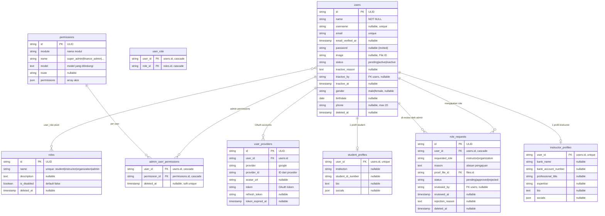
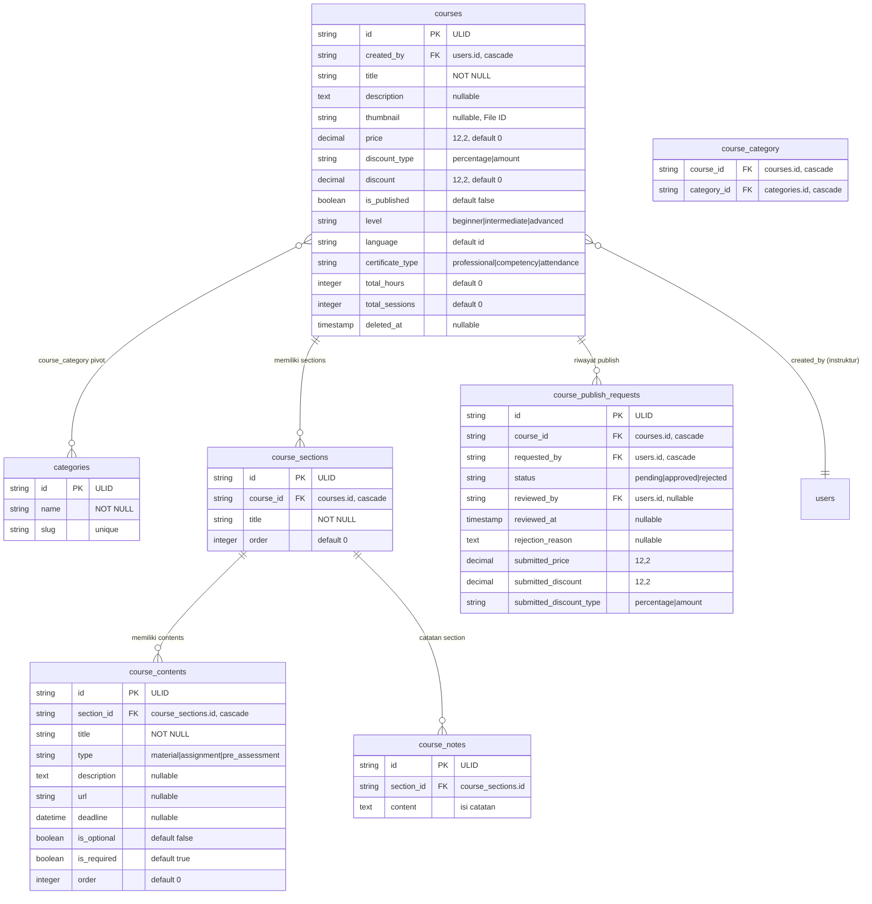
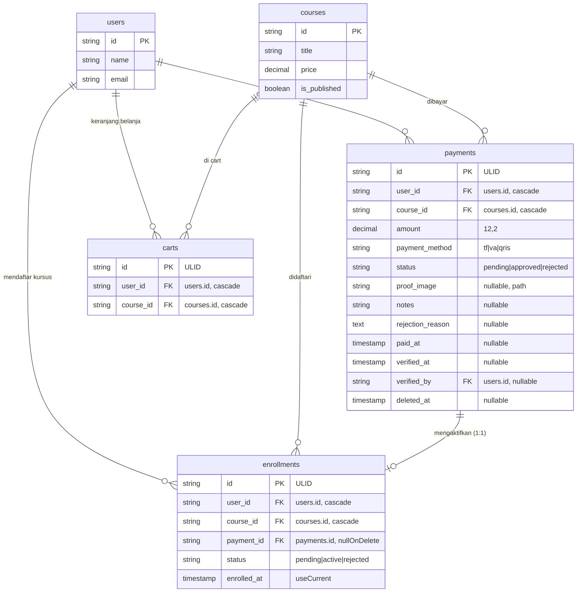
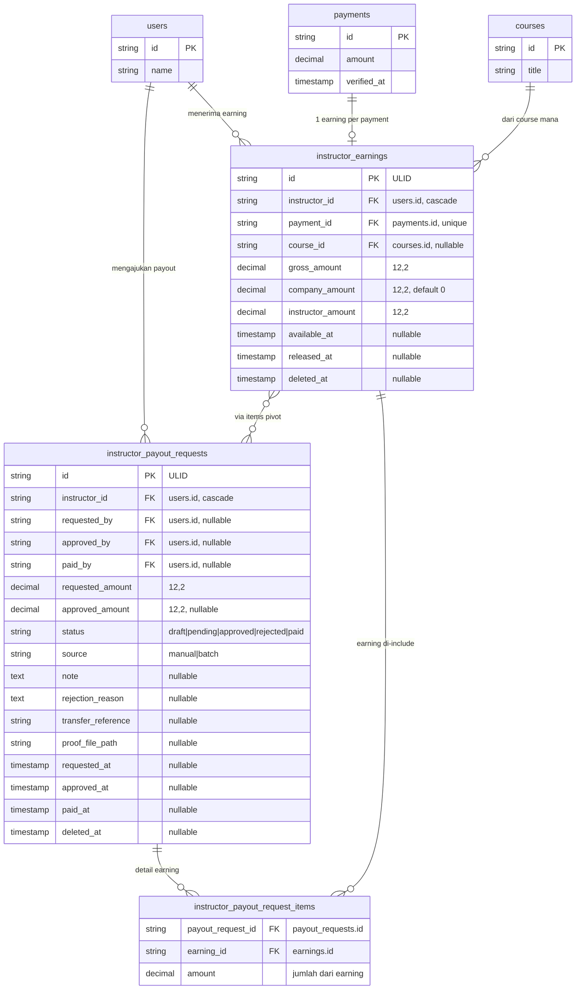
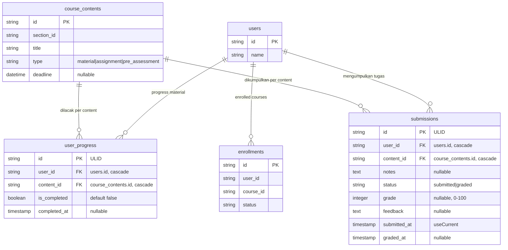
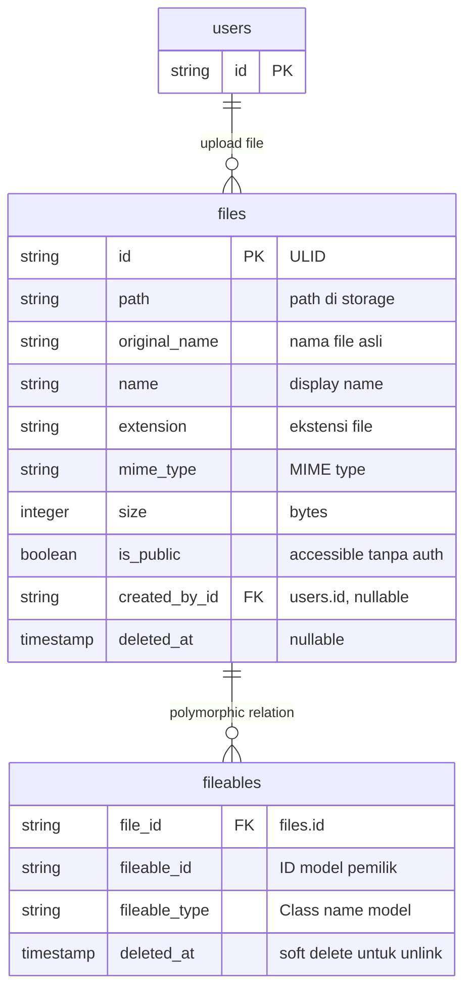
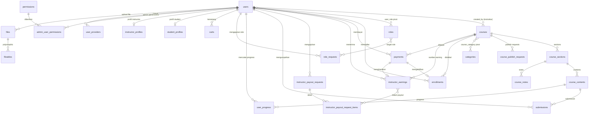

# Database ER Diagrams — Per Modul

Dokumen ini berisi Entity Relationship Diagram (ERD) yang dipecah per modul untuk kemudahan pembacaan. Untuk dokumentasi schema lengkap per tabel, lihat [`03-database.md`](./03-database.md).

> **Konvensi:** Semua tabel menggunakan **ULID** sebagai Primary Key, dan tabel kritis menggunakan **Soft Delete** (`deleted_at`).

---

## Daftar Isi

1. [User & Authentication Module](#1-user-authentication-module)
2. [Course & Content Module](#2-course-content-module)
3. [Enrollment & Payment Module](#3-enrollment-payment-module)
4. [Finance & Payout Module](#4-finance-payout-module)
5. [Learning & Progress Module](#5-learning-progress-module)
6. [Content Management (Files) Module](#6-content-management-files-module)
7. [Full System ERD](#7-full-system-erd)

---

## 1. User & Authentication Module

ERD ini mencakup semua tabel yang berhubungan dengan user, role, permission, dan profil.

**Relasi penting:**
- User bisa punya banyak role (many-to-many via `user_role`)
- Setiap user punya maksimal 1 `student_profile` dan 1 `instructor_profile`
- Admin user punya permission khusus via `admin_user_permissions` pivot

---

## 2. Course & Content Module

ERD ini mencakup course, kategori, section, content, dan publish request.

**Relasi penting:**
- Course dibuat oleh instruktur (`created_by` → `users.id`)
- Course punya banyak section, setiap section punya banyak content
- Content bertipe `assignment` atau `pre_assessment` memiliki deadline
- Publish request menyimpan snapshot harga saat submit

---

## 3. Enrollment & Payment Module

ERD ini mencakup pendaftaran kursus dan pembayaran.

**Constraint penting:**
- `enrollments` UNIQUE `(user_id, course_id)` — satu enrollment per user per course
- `carts` UNIQUE `(user_id, course_id)` — tidak duplikat di cart
- `payments` memiliki soft delete — riwayat pembayaran selalu dijaga
- Saat payment di-approve, enrollment berubah ke `active`

---

## 4. Finance & Payout Module

ERD ini mencakup earning instruktur dan sistem payout.

**Relasi penting:**
- Satu payment menghasilkan maksimal satu earning (`payment_id` unique)
- Payout request bisa berisi banyak earning via `instructor_payout_request_items`
- `available_at` menentukan kapan earning bisa ditarik
- `released_at` di-set saat payout sudah dibayarkan penuh

---

## 5. Learning & Progress Module

ERD ini mencakup progress tracking dan submission.

**Constraint penting:**
- `user_progress` UNIQUE `(user_id, content_id)` — satu progress record per content
- `submissions` UNIQUE `(user_id, content_id)` — satu submission per content
- `user_progress` hanya untuk content bertipe `material`
- `submissions` hanya untuk content bertipe `assignment` atau `pre_assessment`
- Progress dihitung dari **kedua tabel** oleh `CourseProgressService`

---

## 6. Content Management (Files) Module

ERD ini mencakup sistem file polymorphic.

**Model yang menggunakan file (polymorphic):**

| `fileable_type` | Model | Keterangan |
|-----------------|-------|------------|
| `App\Models\Submission` | Submission | File tugas student |
| `App\Models\Course` | Course | Thumbnail course |
| `App\Models\CourseContentFile` | CourseContentFile | File materi course |
| `App\Models\RoleRequest` | RoleRequest | Bukti pendukung |

**Pattern:** Soft delete pada `fileables` untuk unlink file dari model (bukan menghapus file). File baru benar-benar dihapus jika tidak ada referensi tersisa.

---

## 7. Full System ERD

Diagram lengkap yang menunjukkan semua relasi antar modul.

---

## Tabel Soft Delete

Tabel-tabel berikut menggunakan soft delete (`deleted_at`):

| Tabel | Alasan |
|-------|--------|
| `users` | Data user tidak dihapus permanen |
| `courses` | Kursus bisa di-restore |
| `payments` | Riwayat pembayaran dijaga |
| `instructor_earnings` | Riwayat keuangan |
| `instructor_payout_requests` | Riwayat payout |
| `role_requests` | Riwayat pengajuan role |
| `course_publish_requests` | Riwayat approval kursus |
| `files` | File tidak dihapus jika masih ada referensi |
| `roles` | Role kustom |
| `permissions` | Permission kustom |
| `fileables` | Unlink file tanpa hapus fisik |
| `admin_user_permissions` | Revoke tanpa hapus riwayat |
