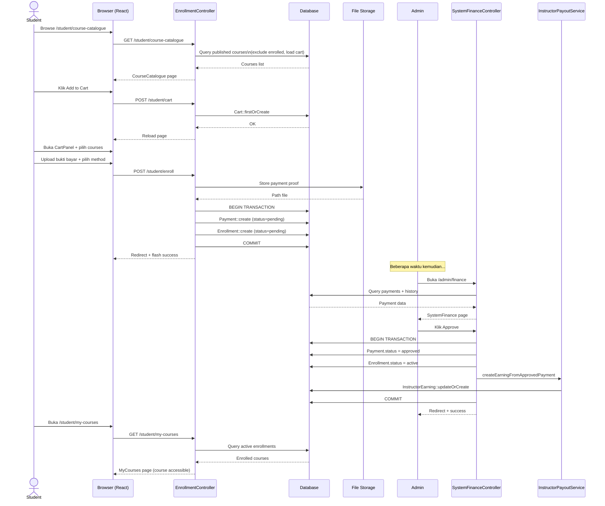
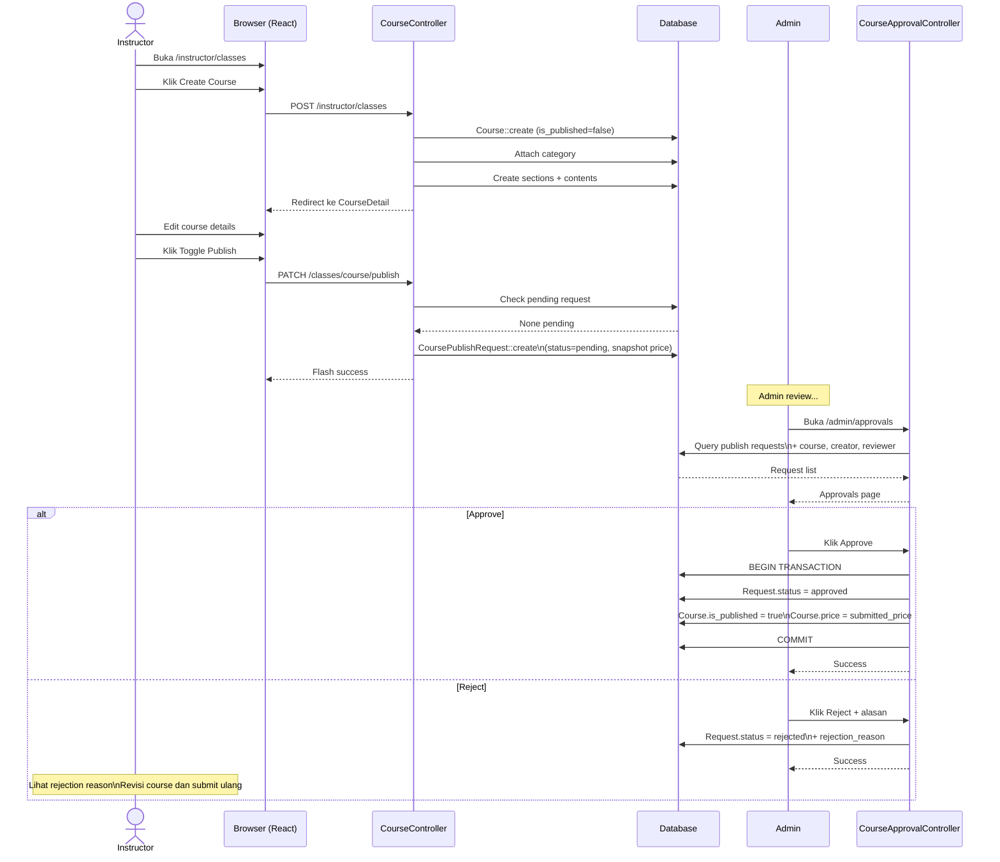
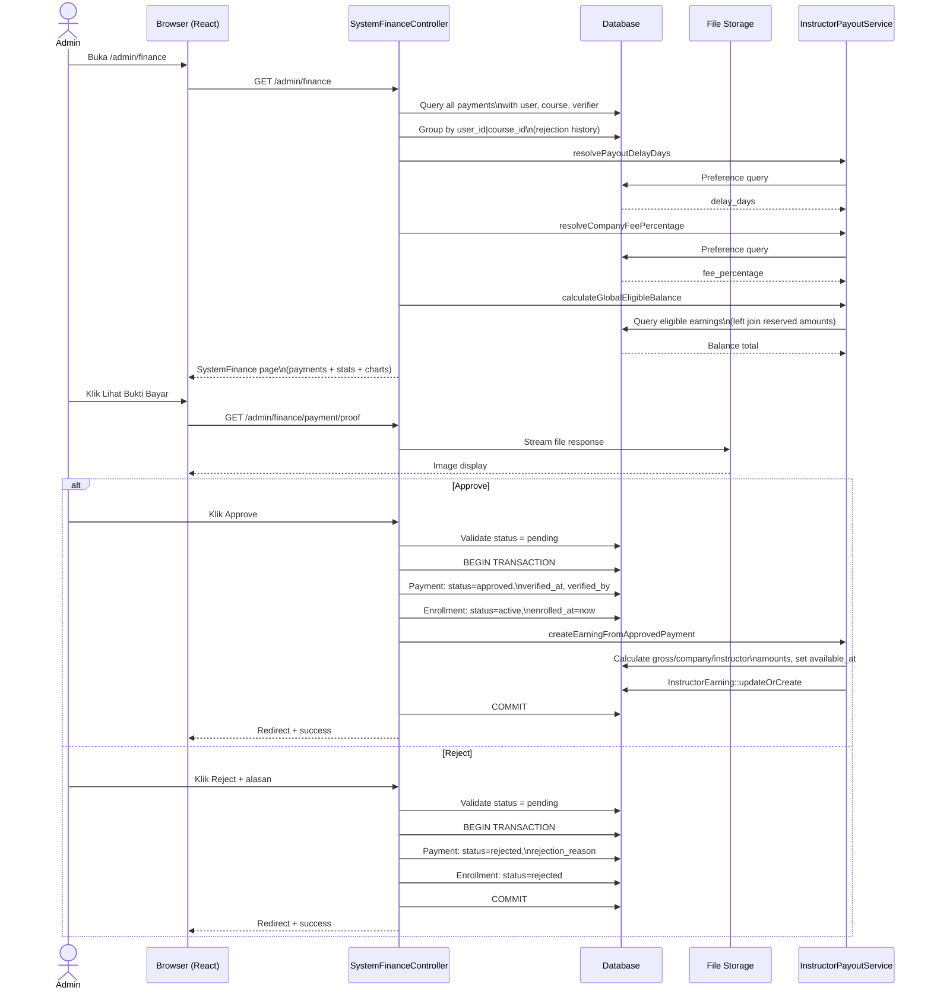
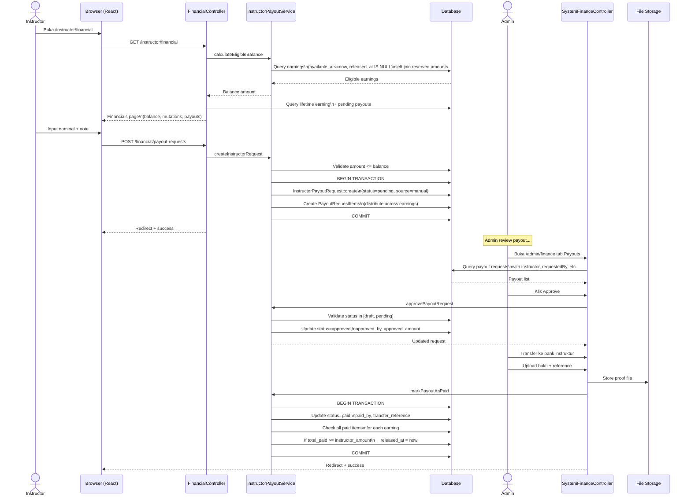
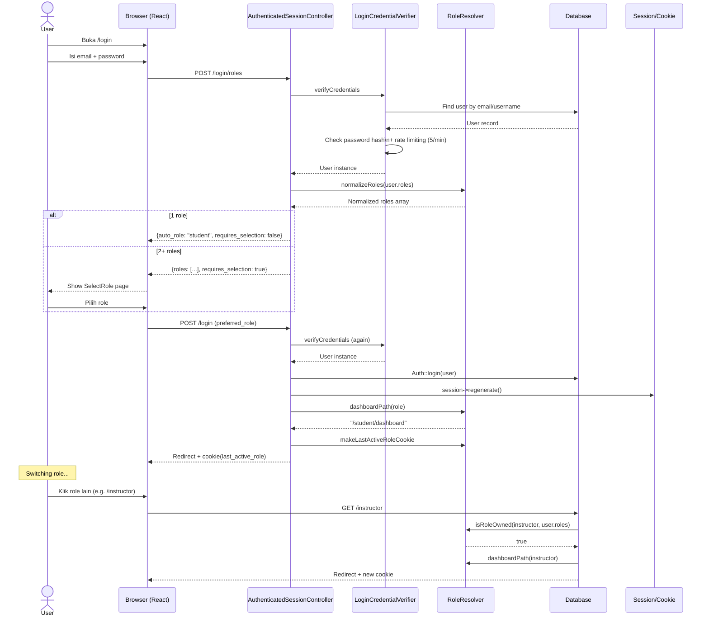
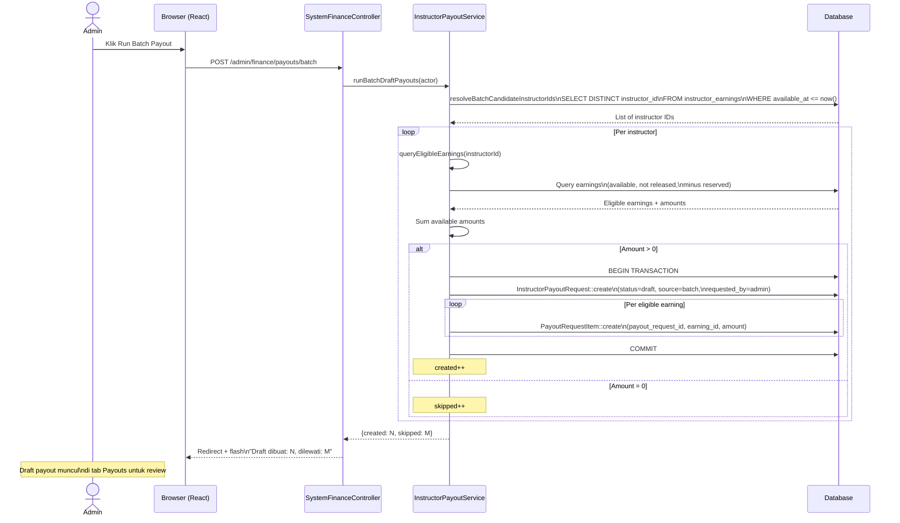

# Sequence Diagrams — Diagram Urutan Interaksi

Dokumen ini berisi diagram urutan (sequence diagram) yang menunjukkan interaksi timeline antar aktor dan komponen sistem untuk operasi-operasi kritis.

---

## Daftar Isi

1. [Student Enrollment (Browse → Access)](#1-student-enrollment)
2. [Instructor Course Publication](#2-instructor-course-publication)
3. [Payment Verification](#3-payment-verification)
4. [Payout Request & Fulfillment](#4-payout-request-fulfillment)
5. [Multi-Role Authentication](#5-multi-role-authentication)
6. [Grading Workflow](#6-grading-workflow)
7. [Batch Payout Generation](#7-batch-payout-generation)

---

## 1. Student Enrollment

Alur lengkap dari browse katalog sampai bisa mengakses kursus.



---

## 2. Instructor Course Publication

Alur dari pembuatan course sampai dipublish ke katalog.



---

## 3. Payment Verification

Alur detail verifikasi pembayaran oleh admin finance.



---

## 4. Payout Request & Fulfillment

Alur lengkap dari instruktur request payout sampai dana dicairkan.



---

## 5. Multi-Role Authentication

Alur login dengan deteksi multiple roles dan pemilihan role.



---

## 6. Grading Workflow

Alur instruktur menilai submission student.

```mermaid
sequenceDiagram
    actor Instructor
    participant Browser as Browser (React)
    participant Student as StudentManagementController
    participant Submission as SubmissionController
    participant DB as Database

    Instructor->>Browser: Buka /instructor/students
    Browser->>Student: GET /instructor/students
    Student->>DB: Query enrollments\n(status=active, course by instructor)
    Student->>DB: Load user, course.sections.contents
    Student->>DB: Build completedLookup per user
    Student->>DB: Build submittedLookup per user
    Student->>DB: Build submissions with files
    Student->>Student: calculateProgress per student
    Student->>Student: buildModules per student
    Student-->>Browser: StudentManagement page

    Instructor->>Browser: Pilih student
    Instructor->>Browser: Lihat submissions list
    Instructor->>Browser: Klik submission belum dinilai
    Instructor->>Browser: Download file tugas
    Browser->>DB: GET /files/file/preview
    DB-->>Browser: File stream

    Instructor->>Browser: Input grade (0-100) + feedback
    Browser->>Submission: PATCH /enrollments/{e}/submissions/{s}/grade
    Submission->>DB: UPDATE submissions
SET status='graded',
grade=value,
feedback=text,
graded_at=now
    DB-->>Submission: OK
    Submission-->>Browser: Redirect + success

    Note over Instructor: Nilai muncul di\nMyCourses student
```

---

## 7. Batch Payout Generation

Alur admin generate payout batch untuk semua instruktur.


