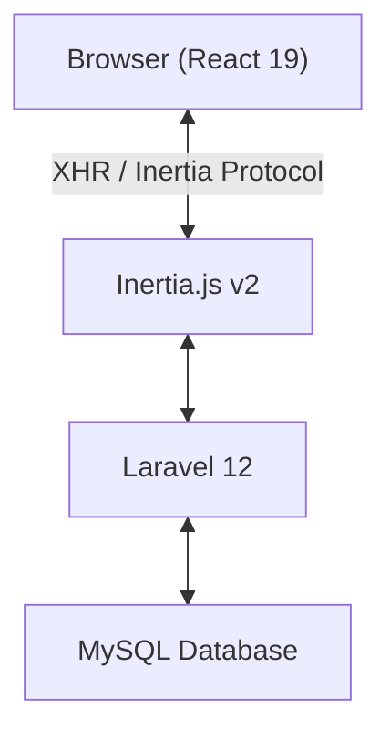
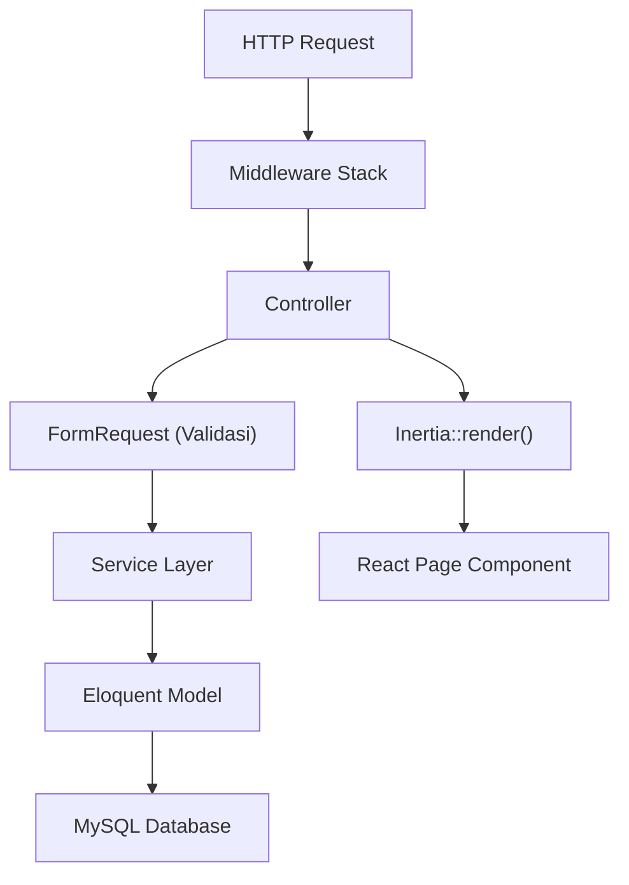
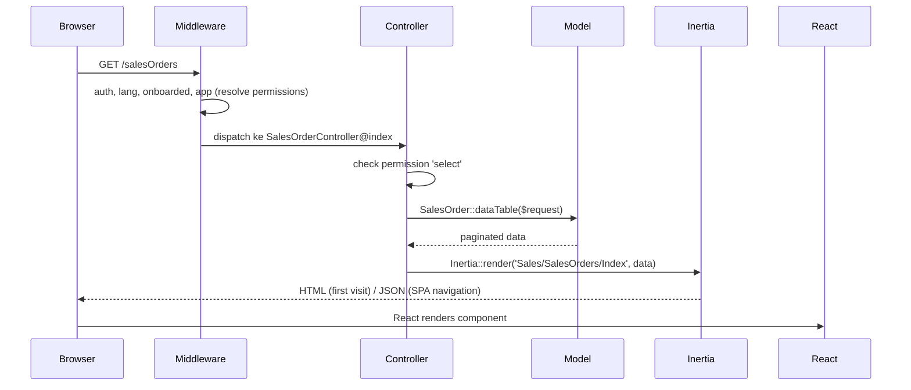
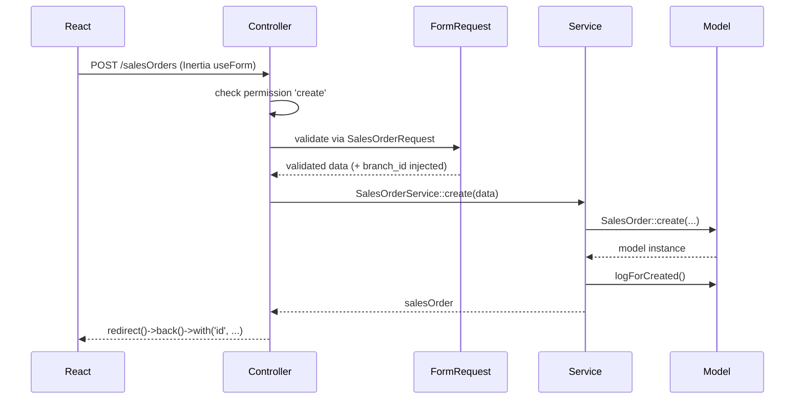
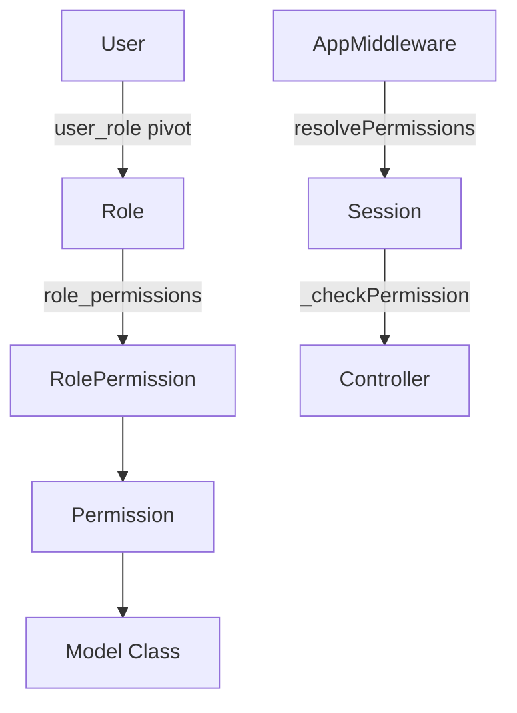
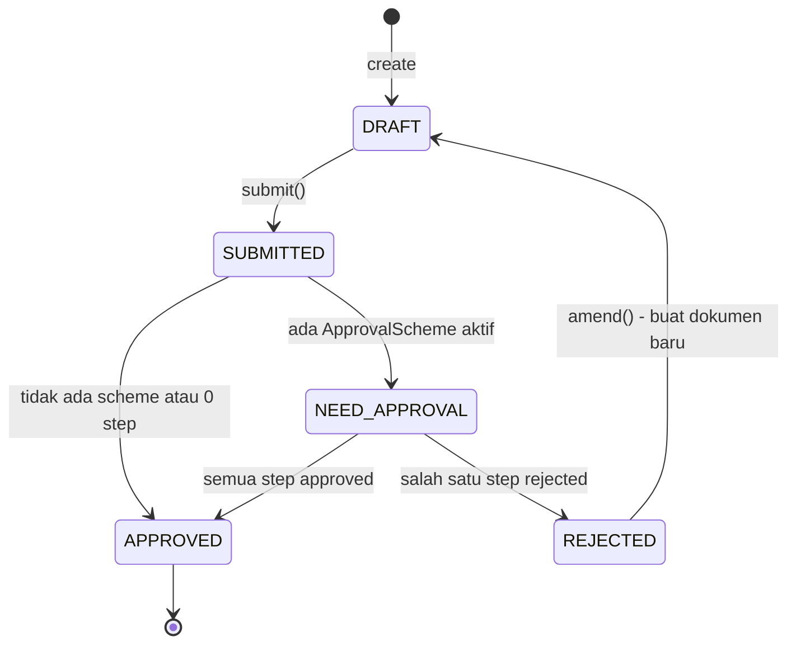

# Arsitektur Sistem ERP

> Dokumentasi arsitektur lengkap: layer aplikasi, design patterns, autentikasi, dan sistem permission.

## Daftar Isi

- [Gambaran Umum](#gambaran-umum)
- [Struktur Direktori](#struktur-direktori)
- [Layer Arsitektur](#layer-arsitektur)
- [Alur Request HTTP](#alur-request-http)
- [Design Patterns](#design-patterns)
- [Sistem Autentikasi](#sistem-autentikasi)
- [Sistem Permission (Role-Based)](#sistem-permission-role-based)
- [Approval Flow](#approval-flow)
- [Document Numbering (FormatingSeries)](#document-numbering-formatingseries)
- [Queue & Jobs](#queue--jobs)

---

## Gambaran Umum

Aplikasi ini adalah ERP berbasis web yang dibangun menggunakan:

- **Backend**: Laravel 12 (PHP 8.4), arsitektur MVC + Service Layer
- **Frontend**: React 19 via Inertia.js v2 (SPA tanpa REST API publik)
- **Styling**: TailwindCSS v4 + shadcn/ui (Radix UI primitives)
- **Autentikasi**: Laravel Breeze v2 + Sanctum v4 + Socialite v5

Aplikasi ini adalah **Inertia-only** — tidak ada REST API publik. Semua interaksi dilakukan via Inertia page props dan form submissions.



---

## Struktur Direktori

Struktur folder mengikuti konvensi Laravel 12 (slim skeleton) dengan pengelompokan per-domain bisnis di `app/` dan `resources/js/Pages/`.

### Root

```
erp/
├── app/                  Kode aplikasi Laravel (lihat detail di bawah)
├── bootstrap/            app.php (middleware, exception, routing), providers.php
├── components/           Komponen Blade/print (di luar resources)
├── config/              File konfigurasi Laravel
├── database/
│   ├── factories/        Model factories untuk testing
│   ├── macros/           Macro Blueprint/Schema kustom
│   ├── migrations/       84 migration files
│   └── seeders/          DatabaseSeeder + seeder per modul
├── docs/                 ← Dokumentasi ini
├── lang/                 File i18n (en/, id/) per modul
├── public/               Entry point (index.php) + asset ter-build
├── resources/
│   ├── css/              Entry Tailwind
│   ├── js/               Aplikasi React/Inertia (lihat detail di bawah)
│   └── views/            Blade root (app.blade.php) + template print
├── routes/
│   ├── web.php           Semua route bisnis (+ macro resourceDetail)
│   ├── auth.php          Route Breeze + Socialite
│   └── console.php       Scheduler & closure command
├── storage/              Log, cache, file upload
├── stubs/                Stub generator kustom
└── tests/                Feature & Unit (PHPUnit)
```

### `app/` — Backend

```
app/
├── Casts/                Custom Eloquent casts (FormStatusesCast, Json, ...)
├── Channels/             Notification channels
├── Console/
│   └── Commands/         Artisan command (lihat artisan-commands.md)
├── Http/
│   ├── Controllers/      Controller per domain (Core, Inventory, Purchase, Sales, Service, Finances, User, Auth)
│   ├── Middleware/       AppMiddleware, LanguageMiddleware, EnsureUserIsOnboarded, HandleInertiaRequests, HandleTheme, ...
│   └── Requests/         FormRequest (extend BaseFormRequest)
├── Jobs/
│   └── Core/             Queued jobs
├── Mail/                 Mailable
├── Models/               Eloquent model per domain (lihat di bawah)
├── Notifications/        Notification classes
├── Providers/            Service providers
├── Rules/                Custom validation rules
├── Services/             Service layer (business logic)
│   ├── Core/  Finances/  Inventory/  Purchase/  Sales/  Service/
│   ├── Handlebar/        Engine render template print
│   └── Migration/        Tooling migrasi data dari sistem lama
└── Traits/               DataTable, Submitable, TreeView, ...
```

```
app/Models/
├── Core/       ApprovalScheme, ApprovalSchemeStep, ApprovalInstance, ApprovalInstanceStep,
│               Branch, FormatingSeries, PrintTemplate, Dashboard, Widget, Tag, File, Currency,
│               Country, Command, ModelConnection, Log, Preference, ...
├── Finances/   Account, GeneralLedger, SalesInvoice(+Item), PurchaseInvoice(+Item),
│               PaymentEntry, PaymentMethod, PaymentSchedule, PaymentTermTemplate(+Item), Tax, AdditionalCost
├── Inventory/  Item, ItemVariant, ItemUnit, ItemAttribute, ItemVariantAttribute, ItemAlternative,
│               ItemBarcode, Attribute, Category, Unit, Warehouse, Stock,
│               StockEntry(+Item), StockLedgerEntry, DeliveryNote(+Item)
├── Purchase/   PurchaseRequest(+Item), PurchaseOrder(+Item), PurchaseReceipt(+Item), Supplier
├── Sales/      SalesOrder(+Item), InternalOrder(+Item), Customer
├── Service/    WorkOrder(+Item), WorkOrderItemAlternative
├── User/       User, Role, Permission, RolePermission, UserRole, UserBranch, UserProvider,
│               RoleProfile(+Detail)
├── Scopes/     DataTableScope
├── Model.php           Base model semua entitas ERP
└── Taggable, Fileable  Pivot polymorphic
```

> Detail field per tabel: [Database](database.md). Trait `Submitable`/`DataTable`: [Core · Trait Submitable](modules/core.md#trait-submitable).

### `resources/js/` — Frontend

```
resources/js/
├── Components/           Komponen reusable
│   ├── ui/               shadcn/ui (Radix-based)
│   ├── Table/            Komponen tabel internal
│   ├── Navbar/  Sidebar/ Navigasi
│   ├── CurrencyInput/    Sub-komponen CurrencyInput
│   └── TimePicker/       Sub-komponen waktu
│   └── (LinkModel, FormInput, FormTable, DatetimePicker, BadgeStatus, Select, MultiSelect, NestedSelect, ...)
├── Hooks/                Custom React hooks (usePermission, useToasts, useDraftForm, ...)
├── Layouts/             AppLayout, MasterLayout, GuestLayout
├── Pages/               Halaman Inertia per modul
│   ├── Core/  Auth/  Profile/  Settings/  Users/
│   ├── Inventory/  Purchase/  Sales/  Services/  Finances/
│   └── ShowGeneral.jsx, Status.jsx
├── Tabs/                Komponen tab
└── lib/                 utils.js, linkModelUtils.js
```

> Katalog halaman lengkap per modul + peta LinkModel: [Frontend](frontend.md).

---

## Layer Arsitektur



### 1. Middleware Stack

Middleware didaftarkan di `bootstrap/app.php`:

| Middleware | Alias | Fungsi |
|---|---|---|
| `HandleTheme` | — | Inject tema (light/dark) ke session |
| `AddLinkHeadersForPreloadedAssets` | — | Preload assets untuk performa |
| `HandleInertiaRequests` | — | Share data global ke semua Inertia pages |
| `AppMiddleware` | `app` | Resolve permissions user ke session, share ke frontend |
| `LanguageMiddleware` | `lang` | Set locale dari cookie `lang` |
| `EnsureUserIsOnboarded` | `onboarded` | Pastikan user sudah setup profil awal |

Route group utama menggunakan middleware: `['auth', 'lang', 'onboarded', 'app']`

### 2. Controller Layer (`app/Http/Controllers/`)

Semua controller business module extend `App\Http\Controllers\Controller` (base class abstrak).

**Constructor wajib**:
```php
public function __construct(Request $request, ItemServices $service) {
    $this->service = $service;
    parent::__construct($request, Item::class); // enforce permission check
}
```

Base controller `__construct` melakukan:
1. Set `$this->model` ke class model
2. Baca permission dari session
3. Map HTTP method ke permission key
4. Abort 403 jika user tidak punya izin

**Method permission mapping**:

| Controller Method | Permission Key |
|---|---|
| `index` | `select` |
| `create` / `store` | `create` |
| `show` | `read` |
| `update` | `write` |
| `destroy` | `delete` |
| `submit` | `submit` |
| `cancel` | `cancel` |
| `amend` | `amend` |
| `print` | `print` |
| `import` | `import` |
| `export` | `export` |

### 3. FormRequest Layer (`app/Http/Requests/`)

Semua FormRequest extend `BaseFormRequest` (bukan `FormRequest` bawaan Laravel).

`BaseFormRequest::validated()` otomatis inject `branch_id` dan array `branch` dari session ke validated data.

### 4. Service Layer (`app/Services/`)

Digunakan untuk business logic kompleks: multi-model transaction, approval callbacks, financial calculations.

Service utama: `SalesOrderService`, `PurchaseOrderService`, `StockEntryService`, `DeliveryNoteService`, `PaymentEntryService`, `SalesInvoiceService`, `PurchaseInvoiceService`, `PurchaseReceiptService`.

### 5. Model Layer (`app/Models/`)

Model dikelompokkan per modul bisnis. Semua model ERP extend `App\Models\Model` dan menggunakan trait `DataTable` + `HasUlids` + `SoftDeletes`.

```
app/Models/
  Core/         ApprovalInstance, Branch, FormatingSeries, PrintTemplate, dll.
  Finances/     Account, GeneralLedger, PaymentEntry, SalesInvoice, PurchaseInvoice, dll.
  Inventory/    Item, ItemVariant, Stock, StockEntry, DeliveryNote, dll.
  Purchase/     PurchaseOrder, PurchaseRequest, PurchaseReceipt, Supplier
  Sales/        SalesOrder, InternalOrder, Customer
  Service/      WorkOrder
  User/         User, Role, Permission, RolePermission
```

---

## Alur Request HTTP

### Alur Membuka Halaman (GET)



### Alur Submit Form (POST/PUT)



---

## Design Patterns

### Route::resourceDetail Macro

Custom macro di `routes/web.php` yang generate routes standar per resource:

```php
Route::resourceDetail('salesOrder', SalesOrderController::class, isSubmmitable: true);
```

Menghasilkan routes: `index`, `store`, `create`, `show`, `update`, `destroy`, `addComment`, `removeComment`, `addTag`, `removeTag`, `addFile`, `removeFile`.

Jika `isSubmmitable: true`, tambahan: `submit`, `cancel`, `amend`, `createPrintTemplate`, `print`.

### DataTable Trait

Trait terpusat untuk semua model ERP yang menyediakan:
- CRUD logging (`logForCreated`, `logForUpdated`, `logForDeleted`)
- Permission initialization (`initPermissions`)
- Column schema definition via `$configColumns`
- Permission checking (`_checkPermission`)

### Submitable Trait

Memperluas `DataTable` untuk model dokumen workflow:
- Status management (`DRAFT` → `SUBMITTED` → `NEED_APPROVAL` → `APPROVED/REJECTED`)
- `checkApproval()` untuk trigger approval flow
- `amend()` untuk replikasi dokumen rejected
- Auto-save `submitted_format` snapshot saat submit

### ModelConnection

Cross-document linking system. Koneksi antar dokumen dibuat di `model_connections` untuk traceability.

---

## Sistem Autentikasi

### Metode Login

1. **Email + Password** via Laravel Breeze v2 (session-based)
2. **Social Login** via Laravel Socialite v5 (OAuth providers)
3. **API Token** via Sanctum v4

### Session & Cookie

| Item | Storage | Keterangan |
|---|---|---|
| Session data | Database (`sessions` table) | Auth session |
| `lang` | Cookie | Locale user |
| `theme` | Cookie (tidak dienkripsi) | Light/dark preference |
| `permissions` | Session | Permission matrix user (di-cache) |
| `currentBranch` | Session | Branch aktif user |

---

## Sistem Permission (Role-Based)

> Sistem permission **custom berbasis session cache** — bukan Laravel Policies, Gates, Spatie, atau `can()` helper.

### Arsitektur Permission



### Tabel Terkait

| Tabel | Fungsi |
|---|---|
| `permissions` | Definisi permission per model (module, name, model class, actions JSON, is_submitable) |
| `roles` | Definisi roles (name, description, is_disabled) |
| `role_permissions` | Assignment: role + permission + level + only_creator + actions JSON |
| `user_role` | Pivot user ↔ role |

### Tiga Dimensi Role Permission

Setiap `role_permissions` record memiliki 3 dimensi:

1. **`permissions`** — JSON object berisi boolean per action key
2. **`level`** — Field-level access control (`0` = standard, `1-9` = 🚧 belum aktif)
3. **`only_creator`** — Jika `true`, user hanya bisa akses dokumen yang dia buat sendiri

### Permission Keys

**Model standard** (tanpa `Submitable`):
`select`, `read`, `write`, `create`, `delete`, `import`, `export`, `share`

**Model submitable** (pakai `Submitable` trait):
Semua di atas plus: `submit`, `cancel`, `amend`, `print`

### Alur Resolve Permission

`AppMiddleware::resolvePermissions(userId)`:
1. Query `role_permissions` JOIN `user_role` JOIN `roles` untuk user
2. Group by: `model` → `level` → `only_creator`
3. Merge semua boolean permission (OR logic)
4. Simpan ke session `permissions`

### Roles yang Ada

| Role | Fungsi Utama |
|---|---|
| System Manager | Full access ke semua modul |
| Master Data Administrator | Kelola master data |
| User & Access Administrator | Kelola user, role, permission |
| Sales Officer | Sales Order, Customer |
| Purchasing Officer | Purchase Request, Purchase Order |
| Finance Officer | Invoice, Payment, Account |
| Warehouse Officer | Stock Entry, Delivery Note |
| Item Master | Data Item dan Variant |
| Approver | Approve/Reject dokumen |
| Auditor | Read-only + export semua modul |

### Permission Definitions per Module

| Module | Model | Submitable | Only Creator |
|---|---|---|---|
| Core | Approval Instance Steps | Tidak | Tidak |
| Core | Approval Schemes | Tidak | Tidak |
| Core | Branches | Tidak | Tidak |
| Core | Files | Tidak | **Ya** |
| Core | Formating Series | Tidak | Tidak |
| Core | Print Templates | Tidak | Tidak |
| Finances | Payment Entries | **Ya** | **Ya** |
| Finances | Purchase Invoices | **Ya** | **Ya** |
| Finances | Sales Invoices | **Ya** | **Ya** |
| Inventory | Delivery Notes | **Ya** | **Ya** |
| Inventory | Stock Entries | **Ya** | **Ya** |
| Purchase | Purchase Orders | **Ya** | **Ya** |
| Purchase | Purchase Receipts | **Ya** | **Ya** |
| Purchase | Purchase Requests | **Ya** | **Ya** |
| Sales | Internal Orders | **Ya** | **Ya** |
| Sales | Sales Orders | **Ya** | **Ya** |
| Service | Work Orders | **Ya** | **Ya** |

---

## Approval Flow



### Per-Module Approval Callbacks

| Module | onApproved | onRejected |
|---|---|---|
| Sales Order | status → `[TO_DELIVER, TO_BILL]` | status → `REJECTED` + rollback item reservations |
| Purchase Order | status → `[TO_RECEIVE, TO_BILL]` + buat ModelConnections | status → `REJECTED` + rollback items |
| Purchase Request | status → approved state | status → `REJECTED` |
| Delivery Note | status → `[DELIVERED/PARTIALLY_DELIVERED]` | status → `REJECTED` + rollback stock |
| Stock Entry | update stock ledger | status → `REJECTED` + reverse stock |
| Sales Invoice | status → billing state | status → `REJECTED` |
| Purchase Invoice | status → billing state | status → `REJECTED` |
| Payment Entry | post ke general ledger | status → `REJECTED` |
| Internal Order | status → approved state | status → `REJECTED` |
| Work Order | status → `IN_PROGRESS` | status → `REJECTED` |

---

## Document Numbering (FormatingSeries)

### Token yang Tersedia

| Token | Deskripsi | Contoh |
|---|---|---|
| `@[i]` | Sequence 1 digit | `1` |
| `@[iiii]` | Sequence 4 digit | `0001` |
| `@[yyyy]` | Tahun 4 digit | `2025` |
| `@[yy]` | Tahun 2 digit | `25` |
| `@[mm]` | Bulan 2 digit | `01` |
| `@[branch_code]` | Kode branch | `HO` |

Format contoh: `@[branch_code]/SO-@[iiii]/@[yy]` → `HO/SO-0001/25`

---

## Queue & Jobs

Queue driver: database. Dijalankan dengan `php artisan queue:listen --tries=1`.

### Scheduled Commands

| Command | Jadwal | Fungsi |
|---|---|---|
| `have-transactions:sync` | Daily 01:00 | Sinkronisasi kolom `have_transactions` di semua tabel |
| `commands:index --rebuild` | Daily 01:20 | Rebuild search index navigasi & dokumen |

---

## Inertia.js Shared Props

Props yang selalu tersedia di semua page via `usePage().props`:

| Prop | Tipe | Deskripsi |
|---|---|---|
| `auth.user` | Object | Data user yang login |
| `permissions` | Object | Permission matrix user |
| `branchSettings.branches` | Array | Semua branch user |
| `branchSettings.currentBranch` | Object | Branch aktif |
| `model` | String | Class model aktif |
| `breadcrumbs` | Array | Breadcrumb navigation |
| `lang` | String | Locale aktif (`en`/`id`) |
| `alerts` | Array | Flash alert messages |

---

*Lihat juga: [Database Schema](database.md) | [Routes](routes.md) | [Auth](auth.md) | [Frontend](frontend.md)*
