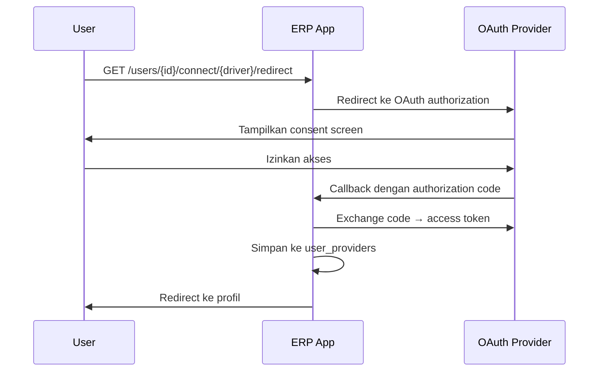
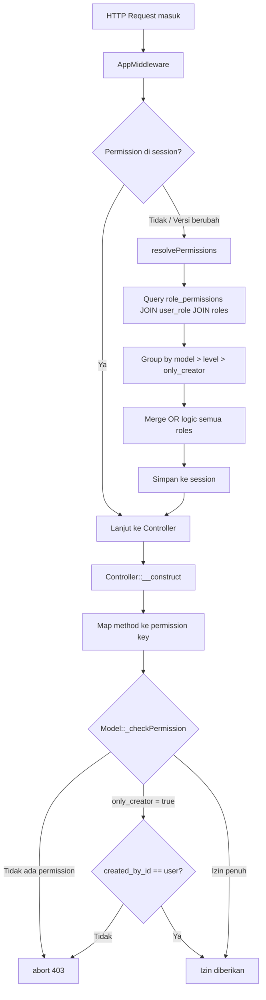
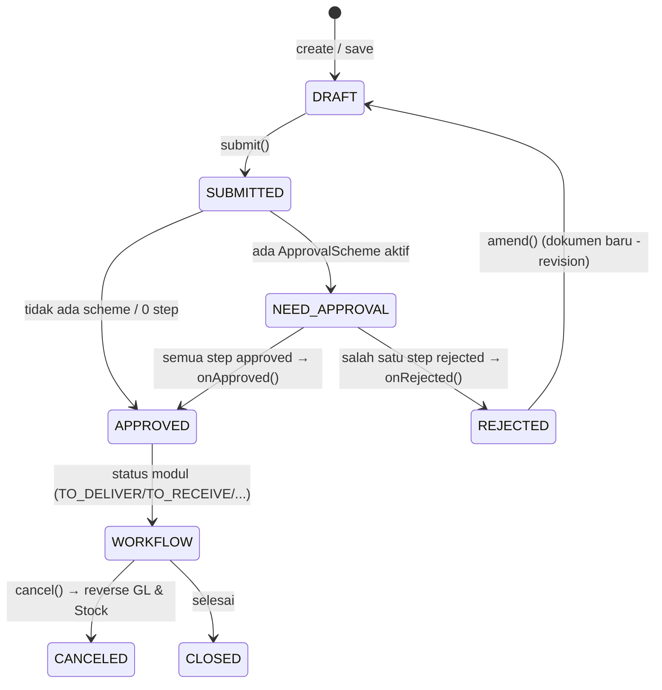
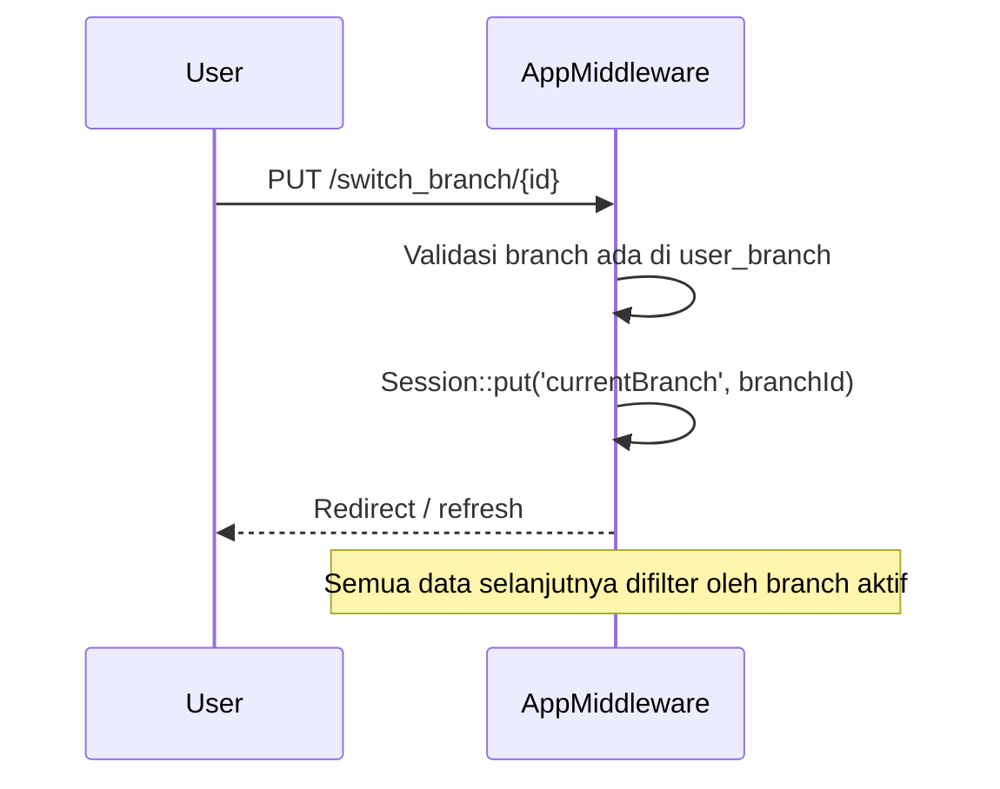

# Autentikasi & Otorisasi

> Dokumentasi sistem autentikasi (login, session, OAuth) dan otorisasi (role, permission, session-based access control).

## Daftar Isi

- [Metode Autentikasi](#metode-autentikasi)
- [Session & Cookie](#session--cookie)
- [Social Login (Socialite)](#social-login-socialite)
- [Roles & Permissions](#roles--permissions)
- [Workflow Dokumen](#workflow-dokumen)
- [Onboarding User Baru](#onboarding-user-baru)
- [Multi-Branch Access](#multi-branch-access)

---

## Metode Autentikasi

### 1. Email + Password

Diimplementasikan menggunakan **Laravel Breeze v2** (session-based authentication).

Route: `POST /login`, `POST /logout`, `GET /register`, dll. (lihat [routes/auth.php](routes.md#auth-routes-breeze))

Fitur bawaan Breeze yang aktif:
- Password reset via email
- Email verification
- Remember me
- Password confirmation untuk aksi sensitif

### 2. OAuth / Social Login (Socialite v5)

User dapat menghubungkan akun social provider ke akun ERP mereka.

Route: `GET /users/{user}/connect/{driver}/redirect`

Data provider disimpan di tabel `user_providers`:
- `provider` — nama provider (google, github, dll.)
- `provider_id` — ID unik dari provider
- `token` / `refresh_token` — OAuth tokens
- `token_expired_at` — waktu kadaluarsa token
- `attributes` — data tambahan dari provider

### 3. API Token (Sanctum v4)

Laravel Sanctum tersedia untuk API authentication jika diperlukan integrasi external. Tidak ada REST API publik di aplikasi ini — semua interaksi via Inertia.

---

## Session & Cookie

| Item | Storage | Keterangan |
|---|---|---|
| Auth session | Database (`sessions` table) | Sesi login user |
| `lang` | Cookie | Locale aktif (`en` / `id`) |
| `theme` | Cookie (tidak dienkripsi) | Tema UI (`light` / `dark`) |
| `permissions` | Session | Permission matrix user (di-cache) |
| `permissions_version` | Session | Hash untuk deteksi perubahan permission |
| `currentBranch` | Session | Branch ID yang sedang aktif |

### Permission Caching

Sistem membandingkan `permissions_version` setiap request. Jika versi berubah (ada perubahan role/permission), cache di-invalidate dan di-rebuild:

```php
// AppMiddleware
$latestVersion = $this->resolvePermissionsVersion($user->id);
if ($permissions === null || $permissionsVersion !== $latestVersion) {
    $permissions = $this->resolvePermissions($user->id);
    $request->session()->put('permissions', $permissions);
}
```

Version hash terdiri dari: jumlah permissions, jumlah roles, timestamp update terakhir.

---

## Social Login (Socialite)

### Alur Koneksi Provider



### Model `UserProvider`

```
user_providers
  id                ULID PK
  user_id           FK ke users
  provider          nama provider (google, dll.)
  provider_id       ID dari provider
  avatar_url        URL foto profil
  token             access token
  refresh_token     refresh token
  token_expired_at  waktu kadaluarsa
  attributes        JSON data tambahan
```

---

## Roles & Permissions

> Sistem otorisasi **custom berbasis session cache** — bukan Laravel Policies, Gates, Spatie, atau `can()` helper standard. (Anchor lama `#sistem-otorisasi-permission` diganti `#roles--permissions`.)

### Struktur Data Permission

```
permissions (definisi)
  id, module, name, model (FQCN), permissions (JSON), is_submitable, allow_only_creator

roles
  id, name, description, is_disabled

role_permissions (assignment)
  id, role_id, permission_id, level, only_creator, permissions (JSON boolean per action)

user_role (pivot)
  user_id, role_id
```

### Alur Pengecekan Permission



### Permission Keys

**Model standard:**

| Key | Controller Method | Deskripsi |
|---|---|---|
| `select` | `index` | Lihat daftar |
| `read` | `show` | Buka detail |
| `write` | `update` | Edit data |
| `create` | `store` / `create` | Buat baru |
| `delete` | `destroy` | Hapus |
| `import` | `import` | Import data |
| `export` | `export` | Export data |
| `share` | `share` | Bagikan |

**Tambahan untuk model Submitable:**

| Key | Controller Method | Deskripsi |
|---|---|---|
| `submit` | `submit` | Submit dokumen |
| `cancel` | `cancel` | Cancel dokumen |
| `amend` | `amend` | Amend dokumen rejected |
| `print` | `print` | Cetak dokumen |

### Menggunakan Permission di Frontend (React)

```jsx
import usePermission from "@/Hooks/usePermission";

// Dalam komponen:
const { can } = usePermission("App\\Models\\Sales\\SalesOrder");

// Cek permission
if (can("create")) { /* tampilkan tombol create */ }
if (can("write", { user_id: record.created_by_id })) { /* edit */ }

// Cek model lain
const { canGlobal } = usePermission("App\\Models\\Sales\\SalesOrder");
canGlobal("App\\Models\\Purchase\\PurchaseOrder", "create")
```

### Daftar Roles

| Role | Deskripsi |
|---|---|
| **System Manager** | Full access ke semua modul dan pengaturan |
| **Master Data Administrator** | Kelola semua master data |
| **User & Access Administrator** | Kelola user, role, permission |
| **Sales Officer** | Buat dan kelola Sales Order, Customer |
| **Purchasing Officer** | Buat dan kelola Purchase Request, Purchase Order |
| **Finance Officer** | Kelola Invoice, Payment, Account, General Ledger |
| **Warehouse Officer** | Kelola Stock Entry, Delivery Note, Warehouse |
| **Item Master** | Kelola data Item, Variant, Category, Attribute |
| **Approver** | Approve/Reject dokumen, read semua modul |
| **Auditor** | Read-only + export semua modul |

---

## Workflow Dokumen

Dokumen transaksi (model ber-[`Submitable`](modules/core.md#trait-submitable)) melewati lifecycle status. Status disimpan sebagai **JSON array** (`FormStatusesCast`) sehingga satu dokumen bisa multi-status (mis. `["to_deliver", "to_bill"]`).



| Aksi | Permission key | Efek |
|---|---|---|
| Save | `create`/`write` | Simpan sebagai `DRAFT` |
| Submit | `submit` | Kunci + generate kode + cek approval + efek (reservasi/GL/stok) |
| Cancel | `cancel` | Status `CANCELED` + **reverse** GeneralLedger & StockLedgerEntry |
| Amend | `amend` | Replikasi dokumen rejected jadi revisi baru (`{code}-{n}`) |
| Print | `print` | Cetak via [Print Template](modules/core.md#print-templates) |

Status spesifik per modul: [Sales](modules/sales.md#status-workflow) · [Purchase](modules/purchase.md) · [Inventory](modules/inventory.md). Mesin approval: [Core · Approval](modules/core.md#approval). Mekanisme trait: [Core · Trait Submitable](modules/core.md#trait-submitable).

> `{level?}` pada route update (`PUT /{plural}/{id}/{level?}`) menandakan level approval saat update di tengah proses. Lihat [Routes · macro submitable](routes.md#route-tambahan-issubmmitable-true).

---

## Onboarding User Baru

Middleware `EnsureUserIsOnboarded` dijalankan pada semua route yang membutuhkan auth.

Pengecekan ini memastikan user sudah melengkapi:
- Profil dasar (nama, dll.)
- Minimal satu branch dikaitkan ke user

Jika belum, user diarahkan ke halaman onboarding.

---

## Multi-Branch Access

User dapat memiliki akses ke satu atau lebih branch. Data branch tersimpan di pivot `user_branch`.

### Alur Branch Switching



Branch aktif disimpan di session `currentBranch` dan di-share ke seluruh frontend via Inertia props `branchSettings.currentBranch`.

### Efek Branch pada Data

- Semua dokumen baru otomatis di-assign ke `branch_id` dari branch aktif (via `BaseFormRequest`)
- Penomoran dokumen bisa berbeda per branch (via `@[branch_code]` token di FormatingSeries)
- Warehouses, user assignments, dan reporting difilter per branch

---

*Lihat juga: [Arsitektur](architecture.md) | [Routes](routes.md) | [Frontend](frontend.md)*
