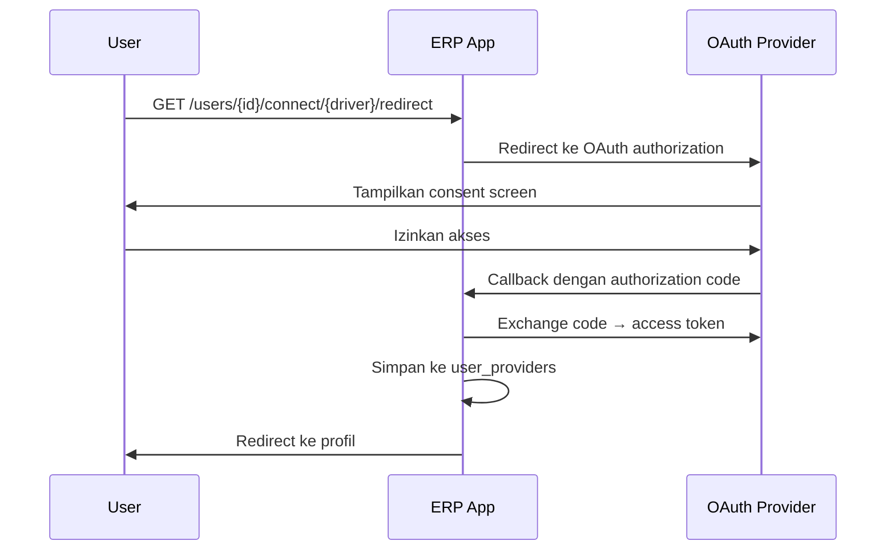
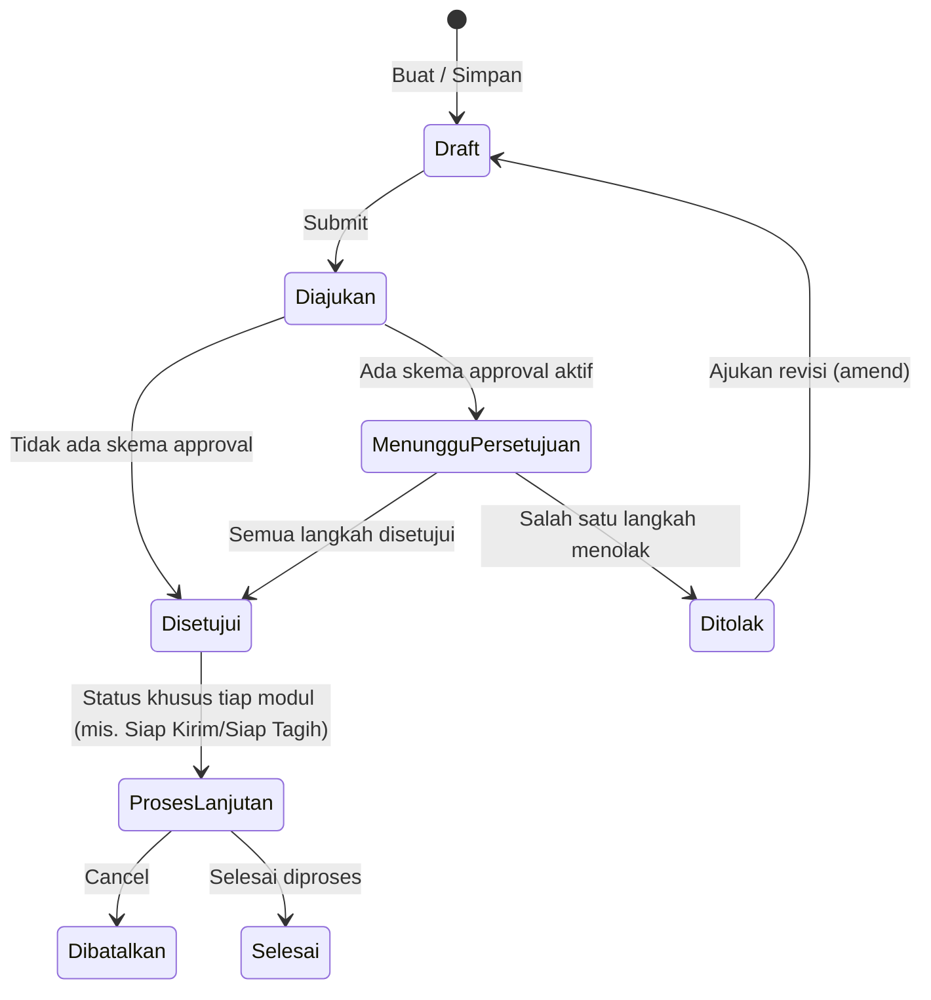
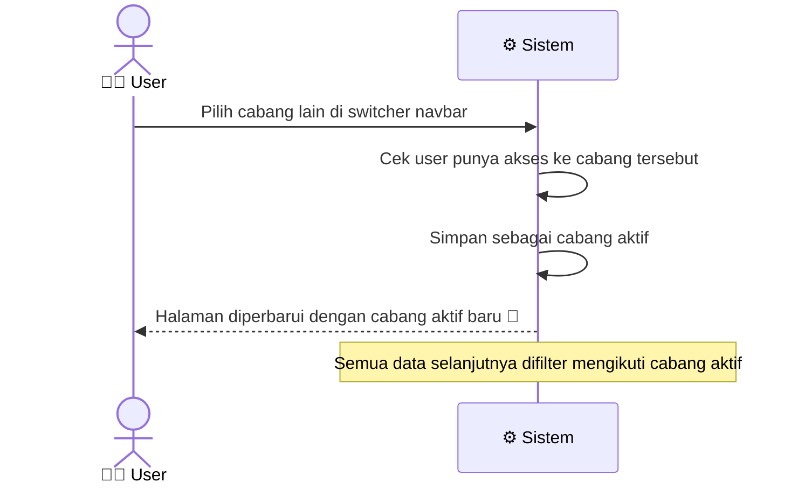

# Autentikasi & Otorisasi

> Dokumentasi sistem autentikasi (login, session, OAuth) dan otorisasi (role, permission, session-based access control).

## Daftar Isi

- [Metode Autentikasi](#metode-autentikasi)
- [Session & Cookie](#session--cookie)
- [Social Login (Socialite)](#social-login-socialite)
- [Roles & Permissions](#roles--permissions)
- [Workflow Dokumen](#workflow-dokumen)
- [Onboarding User Baru](#onboarding-user-baru)
- [Multi-Branch Access](#multi-branch-access)

---

## Metode Autentikasi

### 1. Email + Password

Diimplementasikan menggunakan **Laravel Breeze v2** (session-based authentication).

Route: `POST /login`, `POST /logout`, `GET /register`, dll. (lihat [routes/auth.php](routes.md#auth-routes-breeze))

Fitur bawaan Breeze yang aktif:
- Password reset via email
- Email verification
- Remember me
- Password confirmation untuk aksi sensitif

### 2. OAuth / Social Login (Socialite v5)

User dapat menghubungkan akun social provider ke akun ERP mereka.

Route: `GET /users/{user}/connect/{driver}/redirect`

Data provider disimpan di tabel `user_providers`:
- `provider` — nama provider (google, github, dll.)
- `provider_id` — ID unik dari provider
- `token` / `refresh_token` — OAuth tokens
- `token_expired_at` — waktu kadaluarsa token
- `attributes` — data tambahan dari provider

### 3. API Token (Sanctum v4)

Laravel Sanctum tersedia untuk API authentication jika diperlukan integrasi external. Tidak ada REST API publik di aplikasi ini — semua interaksi via Inertia.

---

## Session & Cookie

| Item | Storage | Keterangan |
|---|---|---|
| Auth session | Database (`sessions` table) | Sesi login user |
| `lang` | Cookie | Locale aktif (`en` / `id`) |
| `theme` | Cookie (tidak dienkripsi) | Tema UI (`light` / `dark`) |
| `permissions` | Session | Permission matrix user (di-cache) |
| `permissions_version` | Session | Hash untuk deteksi perubahan permission |
| `currentBranch` | Session | Branch ID yang sedang aktif |

### Permission Caching

Sistem membandingkan `permissions_version` setiap request. Jika versi berubah (ada perubahan role/permission), cache di-invalidate dan di-rebuild:

```php
// AppMiddleware
$latestVersion = $this->resolvePermissionsVersion($user->id);
if ($permissions === null || $permissionsVersion !== $latestVersion) {
    $permissions = $this->resolvePermissions($user->id);
    $request->session()->put('permissions', $permissions);
}
```

Version hash terdiri dari: jumlah permissions, jumlah roles, timestamp update terakhir.

---

## Social Login (Socialite)

### Alur Koneksi Provider



### Model `UserProvider`

```
user_providers
  id                ULID PK
  user_id           FK ke users
  provider          nama provider (google, dll.)
  provider_id       ID dari provider
  avatar_url        URL foto profil
  token             access token
  refresh_token     refresh token
  token_expired_at  waktu kadaluarsa
  attributes        JSON data tambahan
```

---

## Roles & Permissions

Setiap user diberi satu atau lebih **Role** (peran), dan setiap Role punya daftar **hak akses** ke masing-masing fitur/modul — menentukan siapa boleh melihat, membuat, mengubah, menghapus, atau melakukan aksi khusus (submit, cancel, cetak, dst.) pada suatu jenis dokumen.

### Jenis Hak Akses

**Hak akses dasar** (berlaku untuk semua jenis data):

| Hak Akses | Artinya |
|---|---|
| Lihat Daftar | Bisa melihat daftar/list data |
| Buka Detail | Bisa membuka halaman detail satu data |
| Ubah | Bisa mengedit data |
| Buat Baru | Bisa membuat data baru |
| Hapus | Bisa menghapus data |
| Import | Bisa mengimpor data secara massal |
| Export | Bisa mengekspor data |
| Bagikan | Bisa membagikan data ke pihak lain |

**Hak akses tambahan** (khusus dokumen bisnis seperti Sales Order, Invoice, dst.):

| Hak Akses | Artinya |
|---|---|
| Submit | Bisa mengajukan/mengunci dokumen |
| Cancel | Bisa membatalkan dokumen |
| Amend | Bisa mengajukan revisi dokumen yang ditolak |
| Print | Bisa mencetak dokumen |

> **Pengecualian — Ticket (Helpdesk)**: modul Ticket sengaja dibuat terbuka untuk **semua user yang login**, tanpa dicek terhadap matrix hak akses di atas. Hanya aksi menandai selesai dan memperbarui ticket yang tetap dijaga hak akses "Ubah". Detail: [Helpdesk · Ticket](modules/helpdesk.md#ticket).

### Daftar Role Bawaan

| Role | Cakupan Akses |
|---|---|
| **System Manager** | Akses penuh ke semua modul dan pengaturan |
| **Master Data Administrator** | Kelola semua data master (Item, Customer, Supplier, dll.) |
| **User & Access Administrator** | Kelola user, role, dan hak akses |
| **Sales Officer** | Buat dan kelola Sales Order, Customer |
| **Purchasing Officer** | Buat dan kelola Purchase Request, Purchase Order |
| **Finance Officer** | Kelola Invoice, Payment, Chart of Account, General Ledger |
| **Warehouse Officer** | Kelola Stock Entry, Delivery Note, Warehouse |
| **Item Master** | Kelola data Item, Variant, Kategori, Atribut |
| **Approver** | Menyetujui/menolak dokumen, bisa melihat semua modul |
| **Auditor** | Hanya bisa melihat dan mengekspor data di semua modul, tanpa bisa mengubah |

> Satu user bisa memiliki lebih dari satu Role sekaligus — hak aksesnya adalah gabungan dari semua Role yang dimiliki.

---

## Workflow Dokumen

Setiap dokumen bisnis (Sales Order, Purchase Order, Invoice, Stock Entry, dst.) melewati alur status yang sama secara umum, dari draf sampai selesai:



| Aksi | Butuh Hak Akses | Efek |
|---|---|---|
| Simpan | Buat/Ubah | Disimpan sebagai draf, masih bisa diedit bebas |
| Submit | Submit | Dokumen dikunci, kode resmi dibuat, dicek apakah perlu persetujuan, efek bisnis mulai berjalan (mis. reservasi stok, jurnal akuntansi) |
| Cancel | Cancel | Dokumen dibatalkan — efek stok dan jurnal akuntansi yang sudah tercatat otomatis **dibalik** |
| Amend | Amend | Dokumen yang ditolak bisa diajukan ulang sebagai revisi baru |
| Print | Print | Cetak dokumen sesuai [Print Template](modules/core.md#print-templates) yang berlaku |

> Setiap modul bisnis punya status lanjutan yang lebih spesifik sesuai kebutuhannya — misalnya Sales Order punya status "Siap Dikirim"/"Siap Ditagih", sedangkan Purchase Order punya status "Siap Diterima". Lihat dokumentasi tiap modul untuk detail statusnya masing-masing.

---

## Onboarding User Baru

Middleware `EnsureUserIsOnboarded` dijalankan pada semua route yang membutuhkan auth.

Pengecekan ini memastikan user sudah melengkapi:
- Profil dasar (nama, dll.)
- Minimal satu branch dikaitkan ke user

Jika belum, user diarahkan ke halaman onboarding.

---

## Multi-Branch Access

User bisa memiliki akses ke satu atau lebih cabang (branch) perusahaan.

### Cara Berpindah Cabang



Cabang aktif tersimpan selama sesi login berlangsung dan berlaku di seluruh halaman aplikasi.

### Pengaruh Cabang Aktif pada Data

- Semua dokumen baru yang dibuat otomatis tercatat di bawah cabang yang sedang aktif.
- Penomoran kode dokumen bisa berbeda per cabang (jika formatnya menyertakan kode cabang).
- Data gudang, penugasan user, dan laporan bisa difilter berdasarkan cabang.

---

*Lihat juga: [Arsitektur](architecture.md) | [Routes](routes.md) | [Frontend](frontend.md)*
