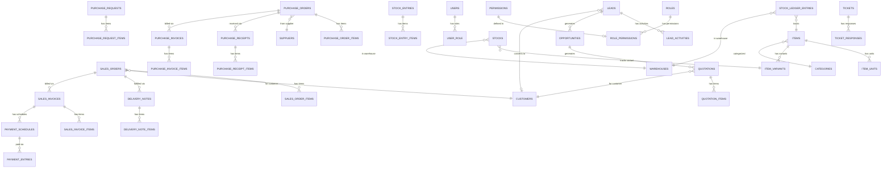

# Database Schema

> Referensi lengkap skema database: tabel, kolom, relasi, dan ERD per domain.

## Daftar Isi

- [Catatan Kolom Auto-Created](#catatan-kolom-auto-created)
- [ERD Umum (Domain)](#erd-umum-domain)
- [Domain: Sales](#domain-sales)
- [Domain: Purchase](#domain-purchase)
- [Domain: Inventory](#domain-inventory)
- [Domain: Finances](#domain-finances)
- [Domain: Service](#domain-service)
- [Domain: CRM](#domain-crm)
- [Domain: Helpdesk](#domain-helpdesk)
- [Domain: Core / Settings](#domain-core--settings)
- [Domain: User & Access](#domain-user--access)
- [Referensi Tabel Lengkap](#referensi-tabel-lengkap)

---

## Catatan Kolom Auto-Created

> Kolom berikut **tidak ada di migration file** — ditambahkan otomatis oleh trait saat `php artisan migrate`:

**Trait `DataTable`** (semua model ERP):
- `is_example` — boolean, menandai data contoh
- `have_transactions` — boolean, sinkronisasi apakah ada relasi aktif

**Trait `Submitable`** (model dokumen workflow):
- `status` — JSON array berisi status aktif (ULID)
- `branch_id` — FK ke `branches`
- `created_by_id` — FK ke `users`
- `submitted_at` — timestamp submit
- `canceled_at` — timestamp cancel
- `revision_number` — counter untuk amend
- `amended_from_id` — FK self-referential untuk amend chain
- `submitted_format` — snapshot format kode saat submit

**Trait `TreeView`** (model hierarki):
- `parent_id` — FK self-referential
- `lft`, `rgt`, `depth` — Nested Set Model fields

---

## ERD Umum (Domain)



---

## Domain: Sales

> Model & relasi domain ini: [Model · Sales](models.md#sales). Tiap tabel di bawah memetakan ke satu model — lihat kolom **Model** di [Referensi Tabel Lengkap](#referensi-tabel-lengkap).

### `sales_orders`

**Model:** [`App\Models\Sales\SalesOrder`](models.md#salesorder) · relasi: `customer`, `items`, `currency`, `referenceable` (morph), `paymentSchedules`.

| Kolom | Tipe | Keterangan |
|---|---|---|
| `id` | char(26) | ULID primary key |
| `code` | varchar(255) | Kode dokumen (FormatingSeries) |
| `customer_id` | char(26) | FK ke `customers` |
| `customer_name` | varchar(255) | Denormalized nama customer |
| `customer_branch_id` | char(26) | FK ke `branches` |
| `customer_branch_name` | varchar(255) | Denormalized nama branch customer |
| `date` | timestamp | Tanggal SO |
| `is_rent` | tinyint(1) | Apakah transaksi rental |
| `start_date` | timestamp | Tanggal mulai (rental) |
| `end_date` | timestamp | Tanggal selesai (rental) |
| `currency_code` | varchar(255) | FK ke `currencies` |
| `base_currency_code` | varchar(255) | Mata uang dasar |
| `exchange_rate` | double | Kurs |
| `discount_on` | varchar(255) | `grand_total` atau `net_total` |
| `discount_rate` | double | Persentase diskon |
| `discount_amount` | double | Nilai diskon |
| `discount_amount_base_currency` | double | Diskon dalam mata uang dasar |
| `amount` | double | Total SO |
| `amount_base_currency` | double | Total dalam mata uang dasar |
| `external_note` | text | Catatan eksternal |
| `referenceable_type` | varchar(255) | Polymorphic: tipe dokumen referensi |
| `referenceable_id` | char(26) | Polymorphic: ID dokumen referensi |
| `reference_so_id` | char(26) | FK ke SO lain (referensi) |
| `status` | json | Array status aktif (auto: Submitable) |
| `branch_id` | char(26) | Branch (auto: Submitable) |
| `created_by_id` | char(26) | Creator (auto: Submitable) |
| `submitted_at` | timestamp | Waktu submit (auto: Submitable) |
| `canceled_at` | timestamp | Waktu cancel (auto: Submitable) |
| `revision_number` | tinyint unsigned | Revision counter (auto: Submitable) |
| `amended_from_id` | char(26) | FK self (auto: Submitable) |
| `submitted_format` | varchar(255) | Snapshot format kode (auto: Submitable) |
| `is_example` | tinyint(1) | Data contoh (auto: DataTable) |

### `sales_order_items`

| Kolom | Tipe | Keterangan |
|---|---|---|
| `id` | char(26) | ULID PK |
| `sales_order_id` | char(26) | FK ke `sales_orders` |
| `item_id` | char(26) | FK ke `items` |
| `item_unit_id` | char(26) | FK ke `item_units` |
| `source_warehouse_id` | char(26) | FK ke `warehouses` |
| `quantity` | double | Jumlah dipesan |
| `delivered_quantity` | double | Sudah dikirim |
| `undelivered_quantity` | double | Belum dikirim |
| `billed_quantity` | double | Sudah ditagih |
| `unbilled_quantity` | double | Belum ditagih |
| `price` | double | Harga satuan |
| `tax_id` | char(26) | FK ke `taxes` |
| `tax_rate` | double | Rate pajak |
| `basic_amount` | double | Subtotal sebelum pajak |
| `tax_amount` | double | Total pajak |
| `amount` | double | Total termasuk pajak |
| `description` | text | Keterangan |
| `referenceable_type` | varchar(255) | Polymorphic reference |
| `referenceable_id` | char(26) | Polymorphic reference |

### `customers`

| Kolom | Tipe | Keterangan |
|---|---|---|
| `id` | char(26) | ULID PK |
| `name` | varchar(255) | Nama customer |
| `email` | varchar(255) | Email |
| `phone` | varchar(255) | Telepon |
| `vat` | varchar(255) | NPWP / Tax ID |
| `is_disabled` | tinyint(1) | Status aktif |
| `street` | varchar(255) | Alamat |
| `city` | varchar(255) | Kota |
| `province` | varchar(255) | Provinsi |
| `zip_code` | varchar(255) | Kode pos |
| `country_id` | char(26) | FK ke `countries` |

### `internal_orders` & `internal_order_items`

Transfer internal antar branch. Struktur serupa dengan Sales Order.

---

## Domain: Purchase

> Model & relasi: [Model · Purchase](models.md#purchase). Mapping tabel→model: [Referensi Tabel](#referensi-tabel-lengkap).

### `purchase_orders`

| Kolom | Tipe | Keterangan |
|---|---|---|
| `id` | char(26) | ULID PK |
| `code` | varchar(255) | Kode dokumen |
| `supplier_id` | char(26) | FK ke `suppliers` |
| `supplier_name` | varchar(255) | Denormalized |
| `date` | timestamp | Tanggal PO |
| `required_date` | timestamp | Tanggal dibutuhkan |
| `currency_code` | varchar(255) | Mata uang |
| `exchange_rate` | double | Kurs |
| `amount` | double | Total PO |
| `discount_on` / `discount_rate` / `discount_amount` | — | Diskon |
| `status`, `branch_id`, dll. | — | Auto: Submitable |

### `purchase_order_items`

| Kolom | Tipe | Keterangan |
|---|---|---|
| `id` | char(26) | ULID PK |
| `purchase_order_id` | char(26) | FK ke `purchase_orders` |
| `item_id` | char(26) | FK ke `items` |
| `item_unit_id` | char(26) | FK ke `item_units` |
| `target_warehouse_id` | char(26) | FK ke `warehouses` |
| `quantity` | double | Jumlah dipesan |
| `received_quantity` | double | Sudah diterima |
| `unreceived_quantity` | double | Belum diterima |
| `billed_quantity` | double | Sudah ditagih |
| `rate` | double | Harga satuan |
| `referenceable_type` / `referenceable_id` | — | Link ke Purchase Request item |

### `purchase_requests` & `purchase_request_items`

Dokumen permintaan pembelian internal. Items di-link ke PO items via polymorphic reference.

### `purchase_receipts` & `purchase_receipt_items`

Penerimaan barang dari supplier. Di-link ke PO.

### `suppliers`

| Kolom | Tipe | Keterangan |
|---|---|---|
| `id` | char(26) | ULID PK |
| `name` | varchar(255) | Nama supplier |
| `phone`, `email` | varchar(255) | Kontak |
| `banks` | json | Informasi rekening bank |
| `country_id` | char(26) | FK ke `countries` |
| `parent_id`, `lft`, `rgt`, `depth` | — | Auto: TreeView (hierarki supplier) |

---

## Domain: Inventory

> Model & relasi: [Model · Inventory](models.md#inventory). Mapping tabel→model: [Referensi Tabel](#referensi-tabel-lengkap).

### `items`

| Kolom | Tipe | Keterangan |
|---|---|---|
| `id` | char(26) | ULID PK |
| `code` | varchar(255) | Kode item |
| `name` | varchar(255) | Nama item |
| `description` | text | Deskripsi |
| `category_id` | char(26) | FK ke `categories` |
| `default_unit_id` | char(26) | FK ke `units` |
| `conversion_factor` | double | Faktor konversi default unit |
| `stock_minimum` | int unsigned | Stok minimum |
| `image_id` | char(26) | FK ke `files` |
| `is_disabled` | tinyint(1) | Status aktif |
| `is_stock_item` | tinyint(1) | Apakah item yang di-track stok |
| `allow_alternative_item` | tinyint(1) | Boleh substitusi |
| `type` | varchar(255) | Tipe item |
| `format_variant` | varchar(255) | Format nama variant |

### `item_variants`

Varian item (kombinasi atribut). Setiap `item` punya **minimal satu** variant. **Variant inilah yang sebenarnya direferensikan oleh semua baris dokumen transaksi** (Sales Order, Purchase Order, Delivery Note, Invoice, dst.) — bukan `items`.

| Kolom | Tipe | Keterangan |
|---|---|---|
| `id` | char(26) | ULID PK |
| `item_id` | char(26) | FK ke `items` (induk) |
| `code` | varchar(255) | Kode variant (SKU) |
| `category_id` | char(26) | FK ke `categories` |
| `default_unit_id` | char(26) | FK ke `units` |
| `image_id` | char(26) | FK ke `files` |
| `is_disabled` / `is_stock_item` | tinyint(1) | Flag |

#### Item & ItemVariant — relasi & pemakaian

> Dipakai oleh cross-link `database.md#item--itemvariant` dari [Routes](routes.md#10-inventory), [Frontend](frontend.md#peta-linkmodel-relasi-ui), [Sales](modules/sales.md#item--variant), [Purchase](modules/purchase.md).

```
items (1) ───< item_variants (N) ───< stocks (per warehouse)
                      │
                      └──< [dokumen].item_id   ← SO/PO/DN/SI/PI item lines
```

- `Item` = master produk (kode, nama, kategori, unit default).
- `ItemVariant` = SKU konkret turunan `Item`. Stok (`stocks`), barcode (`item_barcodes`), dan baris transaksi menempel ke **variant**.
- Di kode: `SalesOrderItem::item()`, `PurchaseOrderItem::item()`, `DeliveryNoteItem::item()` semuanya `belongsTo(ItemVariant::class, 'item_id')`. Jadi kolom `item_id` pada `*_items` → tabel **`item_variants`**.
- Di UI, selector item memakai [`ItemVariantLinkModel`](frontend.md#peta-linkmodel-relasi-ui).

> Catatan: `stock_ledger_entries.item_id` → `items` (level master untuk valuasi), sedangkan `stocks.item_variant_id` → `item_variants` (posisi per variant). Perbedaan ini disengaja.

### `item_units`

Konversi unit per item. Satu item bisa memiliki banyak unit dengan faktor konversi berbeda.

### `categories`

| Kolom | Tipe | Keterangan |
|---|---|---|
| `id` | char(26) | ULID PK |
| `name` | varchar(255) | Nama kategori |
| `type` | varchar(255) | Tipe kategori |
| `default_unit_id` | varchar(255) | Unit default |
| `parent_id`, `lft`, `rgt`, `depth` | — | Auto: TreeView |

### `warehouses`

| Kolom | Tipe | Keterangan |
|---|---|---|
| `id` | char(26) | ULID PK |
| `branch_id` | char(26) | FK ke `branches` |
| `name` | varchar(255) | Nama warehouse |
| `code` | varchar(255) | Kode warehouse |
| `user_id` | char(26) | Penanggung jawab |

### `stocks`

Posisi stok real-time per item variant per warehouse.

| Kolom | Tipe | Keterangan |
|---|---|---|
| `item_variant_id` | char(26) | FK ke `item_variants` |
| `warehouse_id` | char(26) | FK ke `warehouses` |
| `quantity` | double | Stok saat ini |
| `reserved_quantity` | double | Direservasi |
| `actual_quantity` | double | Stok aktual |
| `valuation_rate` | double | Harga pokok rata-rata |
| `stock_queue` | json | FIFO queue untuk valuation |

### `stock_ledger_entries`

Log setiap perubahan stok. Setiap transaksi stok menghasilkan minimal satu entry.

| Kolom | Tipe | Keterangan |
|---|---|---|
| `referenceable_type` / `_id` | — | Dokumen sumber (polymorphic) |
| `item_id` | char(26) | FK ke `items` |
| `warehouse_id` | char(26) | FK ke `warehouses` |
| `quantity_change` | double | Perubahan stok (+/-) |
| `quantity_after_transaction` | double | Stok setelah transaksi |
| `valuation_rate` | double | Harga pokok saat ini |
| `stock_queue` | json | FIFO queue snapshot |

### `stock_entries` & `stock_entry_items`

Dokumen pergerakan stok manual (penerimaan, transfer antar gudang, pengeluaran, penyesuaian).

### `delivery_notes` & `delivery_note_items`

Dokumen pengiriman barang ke customer. Di-link ke Sales Order via polymorphic.

### `item_barcodes`

Barcode per item variant dan unit.

### `item_alternatives`

Substitusi item — link antara item dengan alternatifnya.

### `attributes` & `item_attributes`

Atribut kustom untuk item (ukuran, warna, dll.). Values disimpan sebagai JSON array.

---

## Domain: Finances

> Model & relasi: [Model · Finances](models.md#finances). Mapping tabel→model: [Referensi Tabel](#referensi-tabel-lengkap).

### `accounts`

Chart of Accounts (COA). Hierarki via TreeView trait.

| Kolom | Tipe | Keterangan |
|---|---|---|
| `id` | char(26) | ULID PK |
| `account_name` | varchar(255) | Nama akun |
| `account_number` | varchar(255) | Nomor akun |
| `is_group` | tinyint(1) | Apakah grup |
| `root_type` | varchar(255) | Asset, Liability, Equity, Income, Expense |
| `report_type` | varchar(255) | Tipe laporan |
| `balance_type` | varchar(255) | Debit / Credit |
| `account_type` | varchar(255) | Tipe detail |
| `tax_rate` | double | Rate pajak (untuk akun pajak) |
| `balance_amount` | double | Saldo saat ini |
| `parent_id`, `lft`, `rgt`, `depth` | — | Auto: TreeView |

### `general_ledgers`

Buku besar. Setiap submit dokumen keuangan menghasilkan entri GL.

| Kolom | Tipe | Keterangan |
|---|---|---|
| `referenceable_type` / `_id` | — | Dokumen sumber (polymorphic) |
| `account_id` | char(26) | FK ke `accounts` |
| `against_account_id` | char(26) | FK ke `accounts` (lawan) |
| `branch_id` | char(26) | FK ke `branches` |
| `partyable_type` / `_id` | — | Customer/Supplier (polymorphic) |
| `debit` | double | Nilai debit |
| `credit` | double | Nilai kredit |
| `description` | text | Keterangan |

### `sales_invoices` & `sales_invoice_items`

Tagihan ke customer. Di-link ke Sales Order.

Kolom penting: `customer_id`, `sales_order_id`, `amount`, `paid_amount`, `outstanding_amount`, `discount_on`, `currency_code`, `exchange_rate`. Item: `basic_amount`, `dpp_amount` (**stored generated**: `basic_amount × 11/12`), `tax_amount` (**stored generated**: `dpp_amount × tax_rate/100`) — detail formula DPP: [Finances · SI Item Fields](modules/finances.md#si-item-fields).

### `purchase_invoices` & `purchase_invoice_items`

Tagihan dari supplier. Di-link ke Purchase Order.

Item: `basic_amount`, `dpp_amount` (**stored generated**: `basic_amount × 11/12`), `tax_amount`, `amount` (**stored generated**: `basic_amount + tax_amount`) — detail formula: [Finances · PI Item Fields](modules/finances.md#pi-item-fields).

### `payment_entries`

Pembayaran invoice (sales maupun purchase).

| Kolom | Tipe | Keterangan |
|---|---|---|
| `payment_type` | varchar(255) | `receive` atau `pay` |
| `party_type` | varchar(255) | Customer atau Supplier |
| `paymentable_type` / `_id` | — | Invoice yang dibayar (polymorphic) |
| `partyable_type` / `_id` | — | Customer/Supplier (polymorphic) |
| `paid_amount` | double | Nilai pembayaran |
| `account_paid_to_id` | char(26) | FK ke `accounts` |
| `account_paid_from_id` | char(26) | FK ke `accounts` |
| `payment_method_id` | char(26) | FK ke `payment_methods` |

### `payment_schedules`

Jadwal pembayaran invoice (terms). Dibuat dari `payment_term_templates`.

### `payment_methods`

Metode pembayaran (transfer, tunai, dll.) dengan akun default.

### `taxes`

Daftar pajak dengan rate. Digunakan di line items dokumen transaksi.

### `additional_costs`

Biaya tambahan pada dokumen (ongkir, handling fee, dll.).

---

## Domain: Service

> Model & relasi: [Model · Service](models.md#service). Mapping tabel→model: [Referensi Tabel](#referensi-tabel-lengkap).

### `work_orders`

Work order / service order untuk customer.

| Kolom | Tipe | Keterangan |
|---|---|---|
| `customer_id` | char(26) | FK ke `customers` |
| `item_service_id` | char(26) | FK ke `items` (jenis service) |
| `date` | timestamp | Tanggal WO |
| `started_at` | timestamp | Mulai dikerjakan |
| `completed_at` | timestamp | Selesai |

### `work_order_items`

Komponen/bahan yang digunakan dalam work order.

---

## Domain: CRM

> Model & relasi: [Model · CRM](models.md#crm). Detail bisnis: [Modul CRM](modules/crm.md). Mapping tabel→model: [Referensi Tabel](#referensi-tabel-lengkap).

### `lead_sources`

Master sumber lead (Website, Referral, dll.). **Primary key bisnisnya `code`** — direferensikan oleh `leads.lead_source_id`.

### `leads`

| Kolom | Tipe | Keterangan |
|---|---|---|
| `company_name` | string | Nama perusahaan |
| `contact_name`, `email`, `phone` | string, nullable | Kontak |
| `lead_source_id` | char(26), nullable | FK ke `lead_sources.code` |
| `status` | string | `new`/`contacted`/`qualified`/`unqualified`/`converted` — bebas, bukan FormStatus |
| `assigned_to_id` | char(26), nullable | FK ke `users` |
| `street`, `city`, `province`, `zip_code` | string, nullable | Alamat |
| `country_id` | char(26), nullable | FK ke `countries.code` |
| `converted_customer_id` | char(26), nullable | FK ke `customers` — terisi otomatis saat convert |
| `converted_at` | timestamp, nullable | Waktu konversi |

### `lead_activities`

Riwayat kontak per Lead (`type`: task/call/meeting/email; `status`: open/closed; `scheduled_at`, `assigned_to_id`).

### `opportunities`

| Kolom | Tipe | Keterangan |
|---|---|---|
| `lead_id` | char(26), nullable | FK ke `leads` |
| `customer_id` | char(26), nullable | FK ke `customers` (repeat business) |
| `title` | string | Judul peluang |
| `stage` | string | `identified`/`qualified`/`negotiation`/`won`/`lost` |
| `expected_value` | double | Estimasi nilai |
| `probability` | tinyint unsigned | 0-100 |
| `expected_close_date` | date, nullable | Estimasi closing |
| `assigned_to_id` | char(26), nullable | FK ke `users` |

### `quotations`

| Kolom | Tipe | Keterangan |
|---|---|---|
| `referenceable_type/id` | polymorphic, nullable | Dokumen sumber opsional |
| `opportunity_id` | char(26), nullable | FK ke `opportunities` |
| `customer_id` | char(26) | FK ke `customers` |
| `date` | timestamp | Tanggal quotation |
| `valid_until` | date, nullable | Batas berlaku |
| `amount` | double | Total nilai |
| `status` | json | FormStatus (Submitable — satu-satunya di modul CRM) |

### `quotation_items`

| Kolom | Tipe | Keterangan |
|---|---|---|
| `quotation_id` | char(26) | FK ke `quotations` |
| `item_id` | char(26) | FK ke `item_variants` |
| `description` | text, nullable | Deskripsi baris |
| `quantity` | double | Jumlah |
| `price` | double | Harga satuan |
| `amount` | double | **Stored generated**: `quantity * price` |

---

## Domain: Helpdesk

> Model & relasi: [Model · Helpdesk](models.md#helpdesk). Detail bisnis: [Modul Helpdesk](modules/helpdesk.md). Mapping tabel→model: [Referensi Tabel](#referensi-tabel-lengkap).

### `tickets`

| Kolom | Tipe | Keterangan |
|---|---|---|
| `code` | string, unique | Kode ticket (`#@[yy]/@[iiii]`) |
| `type` | string | `bug_problem`/`task`/`question`/`other` |
| `priority` | string | `low`/`medium`/`high`/`critical` (default `medium`) |
| `subject` | string | Judul ticket |
| `status` | string | `new`/`in_progress`/`on_hold`/`resolved`/`done` — **status tunggal, bukan FormStatus array** |
| `progress` | tinyint | 0-100 |
| `assign_to_id` | char(26), nullable | FK ke `users` |
| `created_by_id` | char(26) | FK ke `users` |
| `branch_id` | char(26), nullable | FK ke `branches` |
| `start_date`, `due_date`, `end_date` | datetime, nullable | Tanggal siklus ticket |

### `ticket_responses`

| Kolom | Tipe | Keterangan |
|---|---|---|
| `ticket_id` | char(26) | FK ke `tickets` |
| `user_id` | char(26), nullable | Pembuat respons (kosong jika otomatis dari deploy webhook) |
| `assign_to_id` | char(26), nullable | Assignee pada saat snapshot |
| `type`, `priority`, `subject`, `status`, `progress` | — | Salinan kondisi Ticket saat snapshot |
| `content` | longtext, nullable | Isi balasan (HTML, disanitasi) |
| `content_json` | longtext, nullable | Isi balasan format rich-text editor |

---

## Domain: Core / Settings

> Model & relasi: [Model · Core](models.md#core). Mapping tabel→model: [Referensi Tabel](#referensi-tabel-lengkap).

### `branches`

Unit bisnis / cabang perusahaan.

| Kolom | Tipe | Keterangan |
|---|---|---|
| `code` | varchar(255) | Kode cabang |
| `name` | varchar(255) | Nama cabang |
| `branchable_type` / `_id` | — | Polymorphic: entitas terkait |
| `is_main_branch` | tinyint(1) | Apakah kantor pusat |
| `shipping_street`, `shipping_city`, dll. | — | Alamat pengiriman |
| `billing_address` | enum | same_main, same_shipping, separate |

### `formating_series`

Konfigurasi penomoran dokumen.

| Kolom | Tipe | Keterangan |
|---|---|---|
| `model` | varchar(255) | Class model (FQCN) |
| `name` | varchar(255) | Nama seri |
| `format` | varchar(255) | Template format dengan token `@[...]` |
| `logs` | json | Counter per periode (bulan/tahun/global) |

### `approval_schemes` & `approval_scheme_steps`

Konfigurasi skema approval per model.

### `approval_instances` & `approval_instance_steps`

Runtime instance approval per dokumen yang disubmit.

### `print_templates`

Template cetak HTML/CSS per model dokumen.

| Kolom | Tipe | Keterangan |
|---|---|---|
| `model` | varchar(255) | Class model |
| `html` | longtext | Template HTML |
| `css` | longtext | Style CSS |
| `template` | json | Konfigurasi template |
| `is_default` | tinyint(1) | Template default |
| `paper` | varchar(255) | Ukuran kertas |
| `orientation` | varchar(255) | Portrait/Landscape |

### `todos`

Tugas generik yang bisa ditugaskan ke User atau Role. Lihat [Core · Todo](modules/core.md#todo).

| Kolom | Tipe | Keterangan |
|---|---|---|
| `code` | varchar(255) | Kode todo (`TODO/@[yy]-@[mm]/@[iiii]`) |
| `description` | text, nullable | Deskripsi tugas |
| `reference_type` / `reference_id` | polymorphic, nullable | Dokumen konteks (opsional) |
| `allocated_to_type` / `allocated_to_id` | polymorphic | `user` atau `role` — penerima tugas |
| `assigned_by_id` | char(26) | FK ke `users` — pemberi tugas |
| `priority` | varchar(255) | Prioritas todo |
| `date` | date, nullable | Tanggal todo |
| `due_date` | datetime, nullable | Batas waktu |
| `status` | varchar(255) | Status todo |

### `saved_filters`

Filter DataTable yang disimpan per user per model.

| Kolom | Tipe | Keterangan |
|---|---|---|
| `user_id` | char(26) | FK ke `users` |
| `model` | varchar(255) | FQCN model target filter |
| `name` | varchar(255), nullable | Nama filter (hanya jika `is_saved`) |
| `filter` | json | Kondisi filter |
| `is_saved` | tinyint(1) | `true` = filter tersimpan bernama; `false` = filter transient (dibersihkan job `saved-filters:prune`) |

### `email_templates`

Template email per model, dengan mekanisme `is_default` eksklusif (mirip `print_templates`).

| Kolom | Tipe | Keterangan |
|---|---|---|
| `name` | varchar(255) | Nama template |
| `name_model` | varchar(255) | Label model tujuan |
| `model` | varchar(255) | FQCN model target |
| `permission_id` | char(26), nullable | FK ke `permissions` |
| `is_default` | tinyint(1) | Default untuk model ini (otomatis eksklusif per model) |
| `body_json` | json, nullable | Isi template (rich-text editor) |

### `changelogs`

Catatan rilis aplikasi, dibuat otomatis dari webhook deploy CI/CD. Lihat [Helpdesk · Integrasi Deploy](modules/helpdesk.md#integrasi-deploy---changelog---ticket).

| Kolom | Tipe | Keterangan |
|---|---|---|
| `version` | varchar(255), unique | Versi rilis |
| `environment` | varchar(255) | Environment tujuan deploy |
| `content_raw` | text | Teks changelog asli (Markdown) |
| `content_html` | text | Hasil konversi HTML (disanitasi) |
| `deployed_at` | timestamp | Waktu deploy tercatat |

### `changelog_reads`

Pivot tracking siapa sudah membaca changelog mana.

| Kolom | Tipe | Keterangan |
|---|---|---|
| `changelog_id` | char(26) | FK ke `changelogs` |
| `user_id` | char(26) | FK ke `users` |
| `read_at` | timestamp | Waktu dibaca |

### `model_connections`

Cross-document links untuk traceability. Dibuat saat dokumen disubmit.

| Kolom | Tipe | Keterangan |
|---|---|---|
| `model_type` / `model_id` | — | Dokumen sumber |
| `reference_type` / `reference_id` | — | Dokumen referensi |
| `model_display` | varchar(255) | Label dokumen sumber |
| `reference_display` | varchar(255) | Label dokumen referensi |
| `is_manual` | tinyint(1) | Koneksi manual atau otomatis |
| `data` | json | Data tambahan (misal `ordered_quantity`) |

### `logs`

Activity log semua model.

| Kolom | Tipe | Keterangan |
|---|---|---|
| `loggable_type` / `_id` | — | Model yang dilog |
| `user_id` | char(26) | FK ke `users` |
| `type` | varchar(255) | `created`, `updated`, `deleted`, `comment` |
| `activity` | longtext | Pesan log (bisa JSON multi-language) |
| `data_before` | json | Data sebelum perubahan |
| `data_after` | json | Data setelah perubahan |

### `tags` & `taggables`

Sistem tagging polimorfik. Semua model bisa di-tag.

### `files` & `fileables`

Sistem upload file polimorfik. Mendukung hierarki folder (TreeView trait).

### `commands`

Search index untuk Command Palette (navigasi + record search).

### `preferences`

Key-value store untuk pengaturan aplikasi global.

---

## Domain: User & Access

> Model & relasi: [Model · User & Access](models.md#user--access). Mapping tabel→model: [Referensi Tabel](#referensi-tabel-lengkap).

### `users`

| Kolom | Tipe | Keterangan |
|---|---|---|
| `id` | char(26) | ULID PK |
| `name` | varchar(255) | Nama lengkap |
| `username` | varchar(255) | Username unik |
| `email` | varchar(255) | Email |
| `status` | varchar(255) | Status akun |
| `gender` | enum | `male` / `female` |
| `default_branch_id` | char(26) | FK ke `branches` |
| `image` | char(26) | FK ke `files` |

### `roles`

| Kolom | Tipe | Keterangan |
|---|---|---|
| `id` | char(26) | ULID PK |
| `name` | varchar(255) | Nama role |
| `description` | longtext | Deskripsi |
| `is_disabled` | tinyint(1) | Status aktif |

### `permissions`

| Kolom | Tipe | Keterangan |
|---|---|---|
| `id` | char(26) | ULID PK |
| `module` | varchar(255) | Nama modul |
| `name` | varchar(255) | Nama permission |
| `model` | text | FQCN model |
| `permissions` | json | Daftar action yang tersedia |
| `is_submitable` | tinyint(1) | Apakah model submitable |
| `allow_only_creator` | tinyint(1) | Default only_creator |

### `role_permissions`

| Kolom | Tipe | Keterangan |
|---|---|---|
| `id` | char(26) | ULID PK |
| `role_id` | char(26) | FK ke `roles` |
| `permission_id` | char(26) | FK ke `permissions` |
| `level` | tinyint unsigned | Level akses (0=standard) |
| `only_creator` | tinyint(1) | Batasi ke dokumen sendiri |
| `permissions` | json | JSON boolean per action key |

### `user_role`

Pivot user ↔ role (many-to-many).

### `user_providers`

OAuth provider credentials (Socialite).

### `user_branch`

Pivot user ↔ branch — branch mana saja yang bisa diakses user.

---

## Referensi Tabel Lengkap

> Kolom **Model** = Eloquent model yang memetakan tabel (namespace `App\Models\` dihilangkan). Link mengarah ke [Referensi Model & Relasi](models.md). Tabel pivot/sistem yang tidak punya model khusus ditandai `—`.

| Tabel | Domain | Model | Keterangan |
|---|---|---|---|
| `accounts` | Finances | [`Finances\Account`](models.md#account-coa) | Chart of Accounts |
| `additional_costs` | Finances | [`Finances\AdditionalCost`](models.md#finances) | Biaya tambahan dokumen |
| `approval_instance_steps` | Core | [`Core\ApprovalInstanceStep`](models.md#approvalinstancestep) | Runtime approval step |
| `approval_instances` | Core | [`Core\ApprovalInstance`](models.md#approvalinstance) | Runtime approval instance |
| `approval_scheme_steps` | Core | [`Core\ApprovalSchemeStep`](models.md#approvalschemestep) | Konfigurasi step approval |
| `approval_schemes` | Core | [`Core\ApprovalScheme`](models.md#approvalscheme) | Konfigurasi skema approval |
| `attributes` | Inventory | [`Inventory\Attribute`](models.md#pendukung-item) | Atribut item |
| `branches` | Core | [`Core\Branch`](models.md#branch) | Cabang/unit bisnis |
| `categories` | Inventory | [`Inventory\Category`](models.md#pendukung-item) | Kategori item |
| `changelog_reads` | Core | [`Core\ChangelogRead`](models.md#changelog) | Pivot tracking pembaca changelog |
| `changelogs` | Core | [`Core\Changelog`](models.md#changelog) | Catatan rilis aplikasi |
| `commands` | Core | [`Core\Command`](models.md#core) | Search index Command Palette |
| `command_recents` | Core | [`Core\CommandRecent`](models.md#lainnya) | Riwayat command palette user |
| `countries` | Core | [`Core\Country`](models.md#core) | Master negara |
| `currencies` | Core | [`Core\Currency`](models.md#core) | Master mata uang |
| `customers` | Sales | [`Sales\Customer`](models.md#customer) | Master customer |
| `dashboard_widgets` | Core | [`DashboardWidget`](models.md#lainnya) | Widget di dashboard |
| `dashboards` | Core | [`Core\Dashboard`](models.md#lainnya) | Konfigurasi dashboard |
| `delivery_note_items` | Inventory | [`Inventory\DeliveryNoteItem`](models.md#deliverynoteitem) | Item surat jalan |
| `delivery_notes` | Inventory | [`Inventory\DeliveryNote`](models.md#deliverynote) | Surat jalan |
| `email_templates` | Core | [`Core\EmailTemplate`](models.md#emailtemplate) | Template email per model |
| `error_logs` | Core | [`Core\Log`](models.md#lainnya) | Log error aplikasi |
| `fileables` | Core | [`Core\Fileable`](models.md#lainnya) | Pivot file polimorfik |
| `files` | Core | [`Core\File`](models.md#lainnya) | File upload |
| `formating_series` | Core | [`Core\FormatingSeries`](models.md#core) | Penomoran dokumen |
| `general_ledgers` | Finances | [`Finances\GeneralLedger`](models.md#finances) | Buku besar |
| `internal_order_items` | Sales | [`Sales\InternalOrderItem`](models.md#sales) | Item order internal |
| `internal_orders` | Sales | [`Sales\InternalOrder`](models.md#internalorder) | Order transfer internal |
| `item_alternatives` | Inventory | [`Inventory\ItemAlternative`](models.md#pendukung-item) | Alternatif item |
| `item_attributes` | Inventory | [`Inventory\ItemAttribute`](models.md#pendukung-item) | Nilai atribut per item |
| `item_barcodes` | Inventory | [`Inventory\ItemBarcode`](models.md#pendukung-item) | Barcode item |
| `item_units` | Inventory | [`Inventory\ItemUnit`](models.md#pendukung-item) | Konversi unit item |
| `item_variant_attributes` | Inventory | [`Inventory\ItemVariantAttribute`](models.md#pendukung-item) | Atribut per variant |
| `item_variants` | Inventory | [`Inventory\ItemVariant`](models.md#itemvariant) | Variant item (SKU) |
| `items` | Inventory | [`Inventory\Item`](models.md#item) | Master item |
| `lead_activities` | CRM | [`CRM\LeadActivity`](models.md#leadactivity) | Riwayat kontak lead |
| `lead_sources` | CRM | [`CRM\LeadSource`](models.md#leadsource) | Master sumber lead |
| `leads` | CRM | [`CRM\Lead`](models.md#lead) | Calon pelanggan |
| `logs` | Core | [`Core\Log`](models.md#lainnya) | Activity log |
| `model_connections` | Core | [`Core\ModelConnection`](models.md#lainnya) | Cross-document links |
| `opportunities` | CRM | [`CRM\Opportunity`](models.md#opportunity) | Peluang bisnis |
| `payment_entries` | Finances | [`Finances\PaymentEntry`](models.md#paymententry) | Pembayaran invoice |
| `payment_methods` | Finances | [`Finances\PaymentMethod`](models.md#item--pendukung) | Metode pembayaran |
| `payment_schedules` | Finances | [`Finances\PaymentSchedule`](models.md#item--pendukung) | Jadwal pembayaran |
| `payment_term_template_items` | Finances | [`Finances\PaymentTermTemplateItem`](models.md#item--pendukung) | Item template terms |
| `payment_term_templates` | Finances | [`Finances\PaymentTermTemplate`](models.md#item--pendukung) | Template terms pembayaran |
| `payment_terms` | Finances | — | Terms pembayaran (legacy) |
| `permissions` | User | [`User\Permission`](models.md#user--access) | Definisi permission |
| `preferences` | Core | [`Core\Preference`](models.md#core) | Pengaturan aplikasi |
| `print_templates` | Core | [`Core\PrintTemplate`](models.md#lainnya) | Template cetak |
| `purchase_invoice_items` | Finances | [`Finances\PurchaseInvoiceItem`](models.md#item--pendukung) | Item invoice pembelian |
| `purchase_invoices` | Finances | [`Finances\PurchaseInvoice`](models.md#purchaseinvoice) | Invoice pembelian |
| `purchase_order_items` | Purchase | [`Purchase\PurchaseOrderItem`](models.md#purchaseorderitem) | Item purchase order |
| `purchase_orders` | Purchase | [`Purchase\PurchaseOrder`](models.md#purchaseorder) | Purchase order |
| `purchase_receipt_items` | Purchase | [`Purchase\PurchaseReceiptItem`](models.md#purchasereceiptitem) | Item penerimaan barang |
| `purchase_receipts` | Purchase | [`Purchase\PurchaseReceipt`](models.md#purchasereceipt) | Penerimaan barang |
| `purchase_request_items` | Purchase | [`Purchase\PurchaseRequestItem`](models.md#purchase) | Item purchase request |
| `purchase_requests` | Purchase | [`Purchase\PurchaseRequest`](models.md#purchaserequest) | Purchase request |
| `quotation_items` | CRM | [`CRM\QuotationItem`](models.md#quotationitem) | Item quotation |
| `quotations` | CRM | [`CRM\Quotation`](models.md#quotation) | Penawaran harga (Submitable) |
| `role_permissions` | User | [`User\RolePermission`](models.md#rolepermission) | Assignment permission ke role |
| `role_profile_details` | User | [`User\RoleProfileDetail`](models.md#user--access) | Detail profil role |
| `role_profiles` | User | [`User\RoleProfile`](models.md#roleprofile) | Profil role |
| `roles` | User | [`User\Role`](models.md#role) | Definisi role |
| `sales_invoice_items` | Finances | [`Finances\SalesInvoiceItem`](models.md#item--pendukung) | Item invoice penjualan |
| `sales_invoices` | Finances | [`Finances\SalesInvoice`](models.md#salesinvoice) | Invoice penjualan |
| `sales_order_items` | Sales | [`Sales\SalesOrderItem`](models.md#salesorderitem) | Item sales order |
| `sales_orders` | Sales | [`Sales\SalesOrder`](models.md#salesorder) | Sales order |
| `saved_filters` | Core | [`Core\SavedFilter`](models.md#savedfilter) | Filter DataTable tersimpan/transient per user |
| `sessions` | Core | — | Laravel sessions |
| `stock_entries` | Inventory | [`Inventory\StockEntry`](models.md#stockentry) | Pergerakan stok |
| `stock_entry_items` | Inventory | [`Inventory\StockEntryItem`](models.md#stockentryitem) | Item pergerakan stok |
| `stock_ledger_entries` | Inventory | [`Inventory\StockLedgerEntry`](models.md#stockledgerentry) | Ledger stok |
| `stocks` | Inventory | [`Inventory\Stock`](models.md#stock) | Posisi stok real-time |
| `suppliers` | Purchase | [`Purchase\Supplier`](models.md#supplier) | Master supplier |
| `taggables` | Core | [`Core\Taggable`](models.md#lainnya) | Pivot tag polimorfik |
| `tags` | Core | [`Core\Tag`](models.md#lainnya) | Master tag |
| `taxes` | Finances | [`Finances\Tax`](models.md#finances) | Master pajak |
| `ticket_responses` | Helpdesk | [`Helpdesk\TicketResponse`](models.md#ticketresponse) | Riwayat/respons ticket |
| `tickets` | Helpdesk | [`Helpdesk\Ticket`](models.md#ticket) | Tiket dukungan internal |
| `todos` | Core | [`Core\Todo`](models.md#todo) | Tugas generik (assign ke User/Role) |
| `units` | Inventory | [`Inventory\Unit`](models.md#pendukung-item) | Master satuan |
| `user_branch` | User | [`User\UserBranch`](models.md#user--access) | Pivot user-branch |
| `user_providers` | User | [`User\UserProvider`](models.md#userprovider) | OAuth providers |
| `user_role` | User | [`User\UserRole`](models.md#user--access) | Pivot user-role |
| `users` | User | [`User\User`](models.md#user) | Master user |
| `warehouses` | Inventory | [`Inventory\Warehouse`](models.md#warehouse) | Master gudang |
| `widgets` | Core | [`Core\Widget`](models.md#lainnya) | Konfigurasi widget dashboard |
| `work_order_items` | Service | [`Service\WorkOrderItem`](models.md#workorderitem) | Item work order |
| `work_orders` | Service | [`Service\WorkOrder`](models.md#workorder) | Work order / service order |

> Relasi antar tabel/model (belongsTo, hasMany, morphTo, dst.) didokumentasikan lengkap di [Referensi Model & Relasi](models.md).

---

*Lihat juga: [Arsitektur](architecture.md) · [Model & Relasi](models.md) · [Routes](routes.md) · Modul: [Sales](modules/sales.md) · [Purchase](modules/purchase.md) · [Inventory](modules/inventory.md) · [Finances](modules/finances.md) · [CRM](modules/crm.md) · [Helpdesk](modules/helpdesk.md)*
