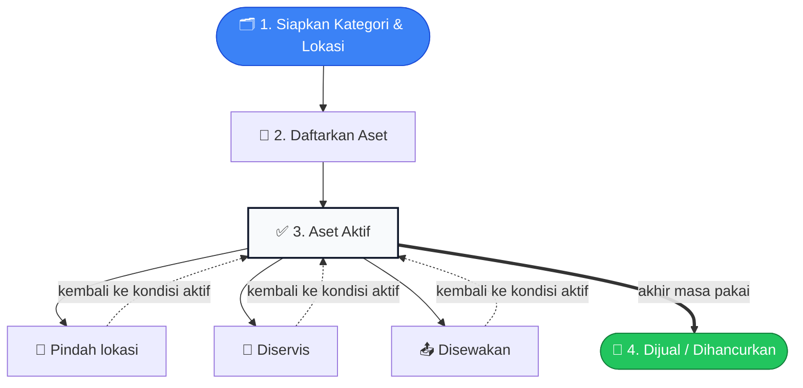
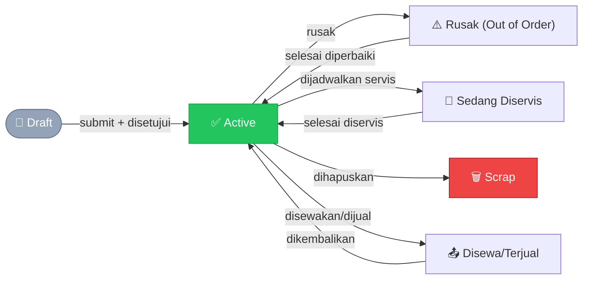
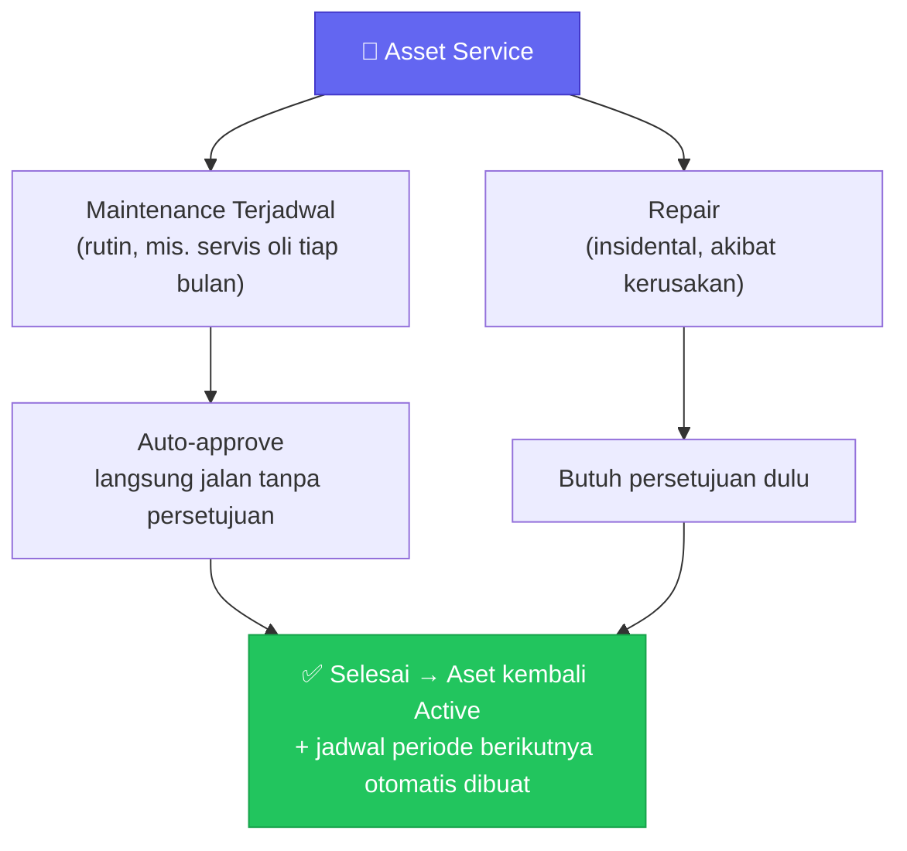

# Aset

Bagian ini menjelaskan cara mengelola aset tetap perusahaan — kendaraan,
mesin, peralatan kantor, dan barang sejenis yang dimiliki/dikuasai
perusahaan dalam jangka panjang. Mulai dari mendaftarkan aset, memindahkan
lokasinya, menjadwalkan servis, sampai menyewakan atau menjualnya. Kalau
kamu bertugas mengurus aset perusahaan (admin aset, staf gudang, teknisi
maintenance, atau finance), panduan ini untuk kamu.

## Istilah yang Perlu Kamu Tahu

- **Asset** — satu unit fisik aset tetap, misalnya "Mobil Box B 1234 CD"
  atau satu kelompok unit identik (misalnya 50 kursi kantor yang sama
  persis, dicatat sebagai satu Asset dengan kuantitas 50).
- **Asset Category** — kelompok aset (misalnya "Kendaraan", "Peralatan
  Kantor") yang menentukan aturan default seperti metode penyusutan dan
  apakah boleh disewakan.
- **Asset Location** — lokasi fisik penempatan aset, bisa bertingkat
  (misalnya "Gedung A > Lantai 2 > Ruang IT").
- **Ownership (Kepemilikan)** — siapa pemilik sah aset ini: perusahaan
  sendiri, atau dititipkan dari Supplier/Customer.
- **Custodian (Penanggung Jawab)** — staf yang bertanggung jawab
  memegang/memakai aset sehari-hari, beda dari pemilik.
- **Nilai Buku (Book Value)** — nilai aset saat ini di pembukuan, yaitu
  nilai beli dikurangi akumulasi penyusutan sampai sekarang.
- **Asset Movement** — dokumen resmi yang mencatat perpindahan aset (lokasi
  atau penanggung jawabnya berubah).
- **Asset Service** — dokumen pekerjaan servis aset, bisa berupa
  maintenance terjadwal (rutin) atau repair (perbaikan mendadak).

## Alur Besarnya Seperti Apa?

Satu aset biasanya melewati perjalanan seperti ini, dari didaftarkan
sampai akhirnya tidak dipakai lagi:

Sepanjang aset itu aktif dipakai, tiga kejadian berikut bisa terjadi
berkali-kali, urutan dan jumlahnya bebas tergantung kebutuhan:

- **Pindah** — lokasi atau penanggung jawabnya berubah (lihat **Asset
  Movement**).
- **Diservis** — perawatan rutin atau perbaikan mendadak (lihat **Asset
  Service**).
- **Disewakan** — dipinjamkan sementara ke pelanggan, lalu dikembalikan
  lagi.

Selama nilainya masih disusutkan, pengurangan nilai buku aset (depresiasi)
berjalan otomatis di belakang layar tanpa perlu kamu lakukan apa-apa —
lihat bagian **Susut Nilai Aset**. Perjalanan aset berakhir saat dijual ke
pelanggan (jual putus) atau dihapuskan permanen (scrap) karena sudah tidak
bisa/perlu dipakai lagi.

## Menyiapkan Data Master: Kategori & Lokasi

Sebelum mendaftarkan aset, siapkan dulu dua data dasarnya.

**Kategori Aset** — buka menu **Assets → Asset Categories → Tambah**.
Isi nama kategori, lalu tentukan pengaturannya:

- **Boleh Disewakan** — aktifkan kalau aset dalam kategori ini nantinya
  bisa disewakan ke pelanggan (misalnya kategori "Kendaraan Sewa").
- **Boleh Kuantitas Lebih dari 1** — aktifkan kalau satu Asset dalam
  kategori ini boleh mewakili banyak unit identik sekaligus (misalnya
  "Kursi Kantor" isi 50). Kalau tidak diaktifkan, tiap Asset di kategori
  itu wajib kuantitas 1 (satu unit per Asset).
- **Tidak Disusutkan** — aktifkan kalau aset dalam kategori ini memang
  tidak perlu dihitung penyusutan nilainya (misalnya tanah).

**Lokasi Aset** — buka menu **Assets → Asset Locations → Tambah**. Isi
nama lokasi, dan pilih lokasi induknya kalau ini sub-lokasi (misalnya
"Ruang IT" induknya "Lantai 2").

## Mendaftarkan Aset Baru

Ada dua cara aset masuk ke sistem: didaftarkan manual, atau otomatis dari
pembelian.

### Cara 1 — Mendaftarkan Manual

Buka menu **Assets → Assets → Tambah**.

1. Isi nama aset, pilih Asset Category dan Asset Location.
2. Tentukan kepemilikan (Ownership) — perusahaan sendiri, atau dititipkan
   dari Supplier/Customer tertentu.
3. Isi tanggal beli dan nilai perolehannya.
4. Kalau aset ini perlu dihitung penyusutan, aktifkan opsi hitung
   penyusutan dan isi metode serta jangka waktunya (lihat bagian
   **Susut Nilai Aset**).
5. Klik **Save**, lalu **Submit**. Aset masuk ke **langkah persetujuan**
   dulu — begitu **disetujui**, statusnya berubah jadi Active.

### Cara 2 — Otomatis dari Pembelian

Kalau barang yang kamu beli sudah ditandai sebagai "aset tetap" di data
produknya, begitu Purchase Receipt (bukti terima barang) atau Purchase
Invoice (tagihan pembelian) disetujui, sistem **otomatis membuat Asset
baru** — kamu tidak perlu input ulang nama, tanggal beli, atau nilainya.

Asset yang dibuat otomatis ini masih berstatus **draft** dan belum punya
Kategori/Lokasi (sistem tidak bisa menebak itu). Kamu perlu melengkapinya:

1. Buka halaman detail Purchase Receipt/Purchase Invoice yang barusan
   disetujui — baris barang aset akan ditandai butuh dilengkapi.
2. Klik tombol **Lengkapi Data Aset** pada baris tersebut.
3. Pilih Asset Category dan Asset Location.
4. Kalau barang yang dibeli lebih dari 1 unit dan tiap unit perlu dilacak
   terpisah (misalnya beda penanggung jawab), pakai opsi **Pecah Unit**
   untuk membagi Asset ini jadi beberapa Asset terpisah.
5. Klik **Simpan**.

> 💡 Aset hasil pemecahan unit tetap tertaut ke dokumen pembelian yang
> sama, jadi riwayat pembeliannya tidak hilang.

## Siklus Status Aset

Setelah didaftarkan dan disetujui, status Asset berubah mengikuti kejadian
yang menimpanya:

Begitu Asset disetujui (status Active), aset itu bisa dipakai normal
sampai salah satu dari hal berikut terjadi: dipindahkan lokasinya,
dijadwalkan servis, disewakan/dijual, rusak, atau dihapuskan permanen
(scrap). Setiap perubahan ini tercatat sebagai riwayat resmi, bukan
sekadar ubah data begitu saja.

> 💡 Aset yang sudah **submitted** tidak bisa dibatalkan (cancel) seperti
> dokumen transaksi lain — begitu aktif, satu-satunya jalan keluar adalah
> lewat aksi status eksplisit (scrap, jual, dsb), bukan pembatalan
> dokumen.

## Memindahkan Lokasi atau Penanggung Jawab Aset (Asset Movement)

Kalau aset perlu dipindahkan — baik lokasinya, penanggung jawabnya, atau
keduanya — jangan ubah langsung data Asset-nya. Catat lewat dokumen
**Asset Movement** supaya ada jejak audit siapa memindahkan, kapan, dari
mana ke mana.

Buka menu **Assets → Asset Movements → Tambah**.

1. Pilih tujuan perpindahan:
   - **Transfer** — pindah lokasi internal biasa (mis. dari Gudang A ke
     Gudang B).
   - **Keluar (Issue)** — aset keluar sementara (mis. dipinjamkan ke
     lokasi/pihak luar).
   - **Kembali (Receipt)** — aset yang sebelumnya keluar, kembali lagi.
2. Tambahkan aset yang mau dipindahkan, satu per satu — untuk tiap aset,
   isi lokasi asal, lokasi tujuan, dan penanggung jawab barunya (kalau
   berubah).
3. Klik **Save**, lalu **Submit**.

Perubahan lokasi/penanggung jawab pada data Asset **baru benar-benar
terjadi setelah dokumen ini disetujui** — selama masih menunggu
persetujuan, data Asset yang sebenarnya belum berubah.

> 💡 Sistem otomatis mengarahkan kamu ke draft Asset Movement yang sudah
> kamu buat sebelumnya untuk aset yang sama, supaya tidak sengaja membuat
> dua dokumen perpindahan yang bertabrakan.

## Servis Aset: Maintenance Terjadwal & Perbaikan (Asset Service)

Ada dua jalur untuk mencatat pekerjaan servis pada aset — **Asset
Service** dipakai untuk keduanya, dibedakan lewat jenisnya:

### Jalur Maintenance Terjadwal (Rutin)

Cocok untuk perawatan berkala, misalnya ganti oli tiap bulan atau servis
AC tiap 3 bulan.

1. Buka menu **Assets → Maintenance Teams → Tambah** untuk mendaftarkan
   tim teknisi kalau belum ada (nama tim dan anggotanya).
2. Buka menu **Assets → Asset Maintenance**, pilih aset yang mau
   dijadwalkan servisnya.
3. Di halaman detail, tambahkan jadwal (task) baru: nama pekerjaan, jenis
   maintenance, tim yang mengerjakan, dan seberapa sering diulang
   (misalnya tiap 1 bulan).
4. Begitu jadwal dibuat, sistem langsung membuat pekerjaan Asset Service
   pertamanya secara otomatis — **tidak perlu persetujuan**, langsung
   berjalan.

### Jalur Repair (Perbaikan Mendadak)

Cocok untuk kerusakan tak terduga yang perlu diperbaiki segera.

1. Buka menu **Assets → Asset Services → Tambah**.
2. Pilih jenis **Repair**, pilih asetnya, isi tanggal kerusakan ditemukan.
3. Kalau biaya perbaikan ini mau ditambahkan ke nilai aset (kapitalisasi),
   aktifkan opsi tersebut.
4. Klik **Save**, lalu **Submit** — pekerjaan repair **butuh persetujuan**
   atasan dulu sebelum bisa dikerjakan (beda dari maintenance terjadwal
   yang langsung jalan).

### Mengerjakan dan Menyelesaikan Servis

Setelah Asset Service disetujui (baik maintenance yang auto-approve
maupun repair yang sudah disetujui manual), aset otomatis berstatus
"Sedang Diservis"/"Rusak", dan kamu bisa mulai mencatat pekerjaan:

1. Tambahkan **aktivitas** — tanggal, siapa yang mengerjakan, dan
   deskripsi pekerjaan, satu per satu sebagai checklist.
2. Tandai tiap aktivitas selesai (centang) begitu benar-benar sudah
   dikerjakan.
3. Kalau ada part/bahan yang dipakai, tambahkan di daftar **Part yang
   Dipakai** beserta jumlah dan biayanya (ini pencatatan biaya saja,
   belum mengurangi stok gudang).
4. Begitu **semua** aktivitas tercentang selesai, sistem menampilkan
   dialog konfirmasi — klik **Selesaikan** untuk menutup pekerjaan ini.

Begitu dikonfirmasi selesai, aset otomatis kembali ke status Active. Kalau
ini pekerjaan maintenance terjadwal, jadwal periode berikutnya otomatis
terbentuk (dihitung dari tanggal selesai sekarang ditambah periodenya) —
kamu tidak perlu membuat Asset Service berikutnya secara manual.

> 💡 **Servis aset company-owned yang sedang disewakan** bisa ditagihkan
> ke penyewa yang sedang memakainya (bukan cuma ke pemilik aset) — aktifkan
> opsi **Tagih ke Penyewa** saat membuat Asset Service, kalau aset itu
> memang sedang berstatus disewa. Sistem akan mengingat siapa penyewanya
> saat itu, lalu proses penagihannya mengikuti alur Sales Order biasa
> (Sales Order → Delivery Note → Sales Invoice) — lihat panduan
> **Penjualan** untuk detail alur tersebut.

> 💡 Untuk kebutuhan servis internal (bukan untuk ditagih ke pelanggan),
> permintaan part bisa dibuat lewat Internal Order yang menunjuk ke Asset
> Service terkait — sistem otomatis mengurangi stok part yang dipakai
> tanpa proses tagihan.

## Menyewakan atau Menjual Aset

Aset yang kategorinya ditandai **Boleh Disewakan** bisa disewakan atau
dijual putus ke pelanggan, lewat alur penjualan yang sama seperti barang
biasa — Sales Order → Delivery Note → Sales Invoice (lihat panduan
**Penjualan** untuk alur lengkapnya). Bedanya, saat membuat Delivery Note,
kamu perlu memilih unit Asset spesifik mana yang benar-benar dikirim.

1. Buat Sales Order seperti biasa, pilih barang yang merupakan aset
   tetap, isi kuantitasnya.
2. Saat membuat Delivery Note dari Sales Order tersebut, pilih Asset
   spesifik mana yang dikirim (bisa lebih dari satu Asset kalau
   kuantitasnya lebih dari 1 dan kategorinya mengizinkan kuantitas
   banyak).
3. Ajukan Delivery Note, lalu tunggu **disetujui** — begitu disetujui,
   sistem otomatis menandai Asset tersebut sedang disewa/terjual dan
   mengurangi sisa kuantitas yang masih tersedia.

**Kalau ini penyewaan** (bukan jual putus), aset perlu dikembalikan nanti
lewat Delivery Note retur — pilih Delivery Note pengiriman asalnya, sistem
otomatis menyalin daftar Asset yang perlu dikembalikan (bisa dikembalikan
sebagian dulu kalau belum semuanya siap).

**Kalau ini jual putus**, begitu Sales Invoice-nya disetujui, sistem
otomatis menghitung untung/rugi penjualan aset itu (selisih harga jual
dengan nilai bukunya saat itu) dan mencatatnya ke pembukuan — kamu tidak
perlu menghitung manual.

> 💡 Misalnya sebuah aset nilai bukunya saat ini Rp8.000.000, lalu dijual
> Rp10.000.000 — sistem otomatis mencatat untung Rp2.000.000 dari
> penjualan aset tersebut. Kalau dijual di bawah nilai bukunya, tercatat
> sebagai rugi.

## Susut Nilai Aset (Depresiasi)

Sebagian besar aset tetap (kecuali tanah atau aset yang sengaja ditandai
"tidak disusutkan") nilainya berkurang bertahap seiring waktu — ini
disebut **penyusutan (depresiasi)**. Sistem menghitung dan mencatatnya
otomatis ke pembukuan sesuai jadwal, kamu tidak perlu hitung manual tiap
periode.

Saat mendaftarkan aset yang perlu disusutkan, kamu memilih salah satu
metode penghitungan:

- **Garis Lurus** — nilai berkurang sama besar tiap periode. Contoh: aset
  senilai Rp120.000.000, disusutkan selama 5 tahun (60 bulan), tanpa nilai
  sisa — tiap bulan nilainya berkurang Rp2.000.000, sampai habis di bulan
  ke-60.
- **Saldo Menurun Ganda** dan **Written Down Value** — nilai berkurang
  lebih besar di periode-periode awal, makin kecil seiring waktu (mirip
  nilai kendaraan yang turun cepat di tahun-tahun pertama).
- **Manual** — kamu isi sendiri jumlah penyusutan tiap periode, sistem
  tidak menghitung otomatis.

Begitu aset disetujui, sistem langsung membuat jadwal penyusutan lengkap
untuk seluruh periode ke depan. Tiap kali jatuh tempo, sistem otomatis
memposting jumlah penyusutan periode itu ke pembukuan — kamu bisa melihat
jadwal ini dan progresnya di halaman detail Asset.

> 💡 Kalau aset dihapuskan (scrap) sebelum masa penyusutannya selesai,
> sisa nilai buku yang belum disusutkan otomatis dihapuskan sekaligus dari
> pembukuan (write-off) saat itu juga.

### Revaluasi Nilai Aset (Asset Value Adjustment)

Kalau nilai aset perlu dikoreksi di luar jadwal penyusutan normal —
misalnya hasil appraisal ulang, atau kerusakan mendadak yang menurunkan
nilainya — buat dokumen **Asset Value Adjustment**.

Buka menu **Assets → Asset Value Adjustments → Tambah**.

1. Pilih aset yang nilainya mau dikoreksi — nilai sekarang ditampilkan
   otomatis (tidak bisa diedit langsung).
2. Isi nilai baru yang benar.
3. Klik **Submit** — selisih antara nilai lama dan nilai baru otomatis
   tercatat ke pembukuan, dan nilai buku aset diperbarui sesuai nilai
   baru tersebut.

## Pertanyaan Umum

**Kenapa Asset yang baru dibuat dari pembelian belum bisa disubmit?**
Karena Kategori dan Lokasinya belum diisi — sistem menolak menyetujui
Asset yang datanya belum lengkap. Lengkapi dulu lewat tombol **Lengkapi
Data Aset** di halaman dokumen pembeliannya.

**Apa bedanya Asset Movement dengan alur sewa/jual aset?**
Asset Movement dipakai untuk perpindahan **internal** (lokasi gudang,
penanggung jawab) yang tidak melibatkan pelanggan. Sewa/jual aset ke
pelanggan memakai alur Sales Order/Delivery Note biasa, bukan Asset
Movement.

**Kapan pakai Maintenance Terjadwal, kapan pakai Repair?**
Pakai Maintenance Terjadwal kalau ini perawatan rutin yang memang
dijadwalkan berulang (servis oli, ganti filter). Pakai Repair kalau ini
perbaikan mendadak akibat kerusakan yang tidak terjadwal.

**Kenapa saya tidak bisa membatalkan (cancel) Asset yang sudah aktif?**
Aset yang sudah disetujui memang tidak bisa dibatalkan seperti dokumen
transaksi biasa — kalau asetnya sudah tidak dipakai/rusak permanen,
gunakan aksi **Scrap** (hapuskan), bukan pembatalan dokumen.
