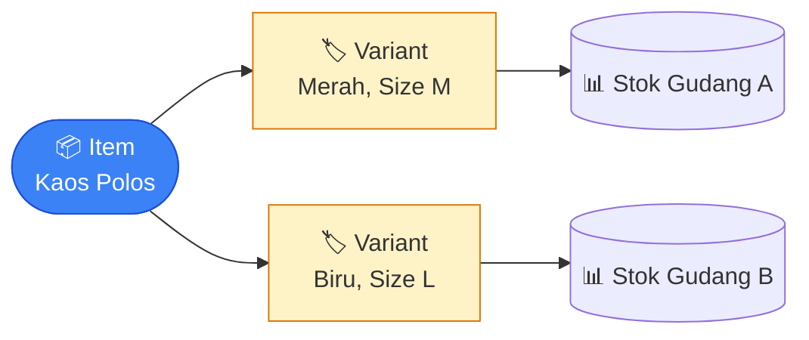

# Inventory & Gudang

Bagian ini menjelaskan cara mengelola data barang (produk), gudang, dan
stoknya — mulai dari mendaftarkan produk baru sampai memantau berapa
stoknya di tiap gudang. Kalau kamu bertugas mengurus data produk atau
stok gudang, panduan ini untuk kamu.

## Istilah yang Perlu Kamu Tahu

- **Item** — produk induk, mis. "Kaos Polos".
- **Variant** — versi konkret dari suatu Item yang benar-benar disimpan
  stoknya, mis. "Kaos Polos - Merah, Size L". Satu Item bisa punya banyak
  Variant.
- **Delivery Note (DN)** — surat jalan pengiriman barang ke pelanggan.
- **Stock Entry** — dokumen untuk mencatat pergerakan stok yang bukan dari
  penjualan/pembelian biasa (transfer antar gudang, penyesuaian stok, dll).
- **Kartu Stok** — riwayat lengkap dan permanen semua perubahan stok suatu
  barang, dari waktu ke waktu.

## Konsep Penting: Item vs Variant

Setiap kali kamu membuat transaksi (pesanan penjualan, pesanan pembelian,
pengiriman, dll.), kamu **tidak memilih Item secara langsung** — kamu
memilih **Variant**-nya. Ini karena stok, kode SKU, dan barcode itu
menempel ke Variant, bukan ke Item induknya.

Contoh: "Kaos Polos" adalah satu Item, tapi kalau tersedia dalam 3 warna
dan 2 ukuran, itu artinya ada sampai 6 Variant berbeda di bawahnya —
masing-masing punya stoknya sendiri per gudang.

## Langkah 1 — Mendaftarkan Produk Baru (Item)

Buka menu **Inventory → Items** untuk melihat daftar produk, lalu klik
**Tambah Barang**.

1. Di tab **Detail**, isi **No. Part** dan **Nama** produk, pilih
   **Kategori**, dan tentukan **Unit Bawaan** (satuan dasar — misalnya
   pcs, kg, atau box).
2. Kalau produk ini jasa yang tidak punya stok, centang sesuai kebutuhan
   (mis. **Merupakan Aset Tetap** untuk barang modal). Untuk barang fisik
   biasa, biarkan default.
3. Klik **Simpan**.

### Menambah Satuan Lain (opsional)

Kalau produk kamu dijual dalam beberapa satuan berbeda (misalnya bisa
dijual per pcs atau per box isi 12), isi tabel **Satuan Ukur** di tab
Detail dengan satuan tambahan beserta faktor konversinya (mis. 1 Box = 12
Pcs). Kalau unit bawaannya termasuk satu grup satuan yang bisa
dikonversi, tabel ini terisi otomatis. Sistem akan mengonversi jumlahnya
kapan pun satuan yang berbeda dipakai dalam transaksi.

## Langkah 2 — Membuat Variant

Atribut pembeda (Warna, Ukuran, dll.) disiapkan lebih dulu di menu
**Inventory → Attributes**. Isi **Nama** atribut dan daftar **Nilai**-nya.

Setelah itu, buka detail produk lalu masuk tab **Varian**.

1. Pilih **Atribut** (mis. Warna), lalu centang **Nilai** yang berlaku
   (mis. Merah, Biru). Isi juga **Format Varian** — pola nama untuk tiap
   varian, memakai `{NamaAtribut}` sebagai placeholder dan wajib memuat
   kode produk. Sistem otomatis membuatkan satu Variant untuk setiap
   kombinasi nilai.
2. Setiap Variant yang terbentuk punya kode (SKU), stok, dan barcode
   sendiri-sendiri — terpisah satu sama lain meski berasal dari produk
   induk yang sama.

### Menambahkan Barcode (opsional)

Buka tab **Barcode** untuk mendaftarkan barcode per Variant dan per
satuan — berguna untuk mempercepat pencarian barang saat input transaksi
(misalnya lewat pemindai barcode).

## Langkah 3 — Mengisi Stok Awal

Stok **tidak diisi langsung** di form produk. Untuk mencatat stok awal,
kamu perlu membuat dokumen **Stock Entry** bertipe penerimaan:

Buka menu **Inventory → Stock Entries**, klik **Tambah Entri Stok**,
pilih tipe **Penerimaan Item**, lalu isi barang, jumlah, dan gudang
tujuan yang mau dicatat sebagai stok awal.

Dokumen ini juga melewati **langkah persetujuan** setelah diajukan.
Setelah disetujui, barang tersebut siap dipilih sebagai pilihan di
transaksi penjualan maupun pembelian.

## Mendaftarkan Gudang

Sebelum bisa mencatat stok, pastikan gudangnya sudah terdaftar. Buka menu
**Inventory → Warehouses**, klik **Tambah Gudang**, isi nama gudang dan
tentukan siapa penanggung jawabnya.

## Memindahkan Barang Antar Gudang atau Menyesuaikan Stok

Selain dari pembelian dan penjualan, stok juga bisa berubah lewat
**Stock Entry** untuk kebutuhan lain:

- **Transfer** — memindahkan barang dari satu gudang ke gudang lain.
- **Penyesuaian (stock opname)** — mengoreksi jumlah stok di sistem supaya
  sesuai dengan hasil hitung fisik di gudang.
- **Pengeluaran** — mengeluarkan barang untuk kebutuhan internal di luar
  penjualan.

Buka menu **Inventory → Stock Entries**, klik **Tambah Entri Stok**,
pilih tipe yang sesuai kebutuhan (**Transfer Item**, **Penerimaan Item**,
atau **Pengeluaran Item**), isi barang dan jumlahnya, lalu **Ajukan**.
Kalau ini transfer antar gudang, isi **Gudang Asal** dan **Gudang
Tujuan** per baris.

Setelah diajukan, dokumen masuk ke **langkah persetujuan** dengan status
**Butuh Persetujuan** — stok belum bergerak. Begitu approver
menyetujuinya, stok otomatis berkurang di gudang asal dan bertambah di
gudang tujuan.

> 💡 Kalau dokumen Stock Entry-nya ditolak atau dibatalkan, semua
> perubahan stok yang sudah sempat terjadi akan otomatis dikembalikan —
> kamu tidak perlu membenarkannya secara manual.

## Bagaimana Barang Dikirim ke Pelanggan (Delivery Note)

Pengiriman barang ke pelanggan dicatat lewat **Delivery Note**, yang
biasanya dibuat dari sebuah pesanan penjualan (Sales Order) — lihat
panduan **Penjualan** untuk alur lengkapnya. Begitu Delivery Note
disetujui (setelah melewati langkah persetujuan), stok otomatis berkurang
dari gudang asal.

## Melihat Riwayat Pergerakan Stok (Kartu Stok)

Setiap kali stok berubah — baik dari pembelian, penjualan, maupun
transfer/penyesuaian — perubahannya otomatis tercatat di **Kartu Stok**.
Ini adalah riwayat permanen yang tidak bisa diubah atau dihapus, jadi kamu
selalu bisa menelusuri kembali dari mana asal setiap perubahan stok suatu
barang.

Halaman Kartu Stok (menu **Inventory → Stock Ledgers**) hanya untuk
dilihat — tidak ada input manual di sana, karena semua catatannya dibuat
otomatis oleh sistem setiap kali dokumen terkait disetujui.

> 💡 **Bagaimana harga pokok dihitung?** Sistem memakai metode
> "masuk pertama, keluar pertama" — artinya stok yang masuk lebih dulu
> dianggap sebagai stok yang dipakai/dijual lebih dulu. Ini menentukan
> berapa nilai harga pokok yang tercatat setiap kali barang keluar.

## Mengatur Kategori, Satuan, dan Atribut

Sebelum mendaftarkan produk, ada beberapa data pendukung yang biasanya
disiapkan lebih dulu:

- **Kategori** (menu **Inventory → Categories**) — untuk mengelompokkan
  produk, bisa disusun bertingkat (kategori besar dengan sub-kategori di
  dalamnya).
- **Satuan** (menu **Inventory → Units**) — satuan pengukuran seperti pcs,
  kg, box. Satuan yang bisa saling dikonversi (misalnya Kg, Gram, Ton)
  dikelompokkan dalam satu **Grup** supaya konversinya otomatis.
- **Atribut** (menu **Inventory → Attributes**) — atribut pembeda Variant
  seperti warna atau ukuran, yang nanti dipakai saat membuat kombinasi
  Variant di Langkah 2.

## Kalau Ada Barang yang Dikembalikan

Kalau barang yang sudah dikirim ke pelanggan dikembalikan, atau barang
yang sudah diterima dari pemasok perlu dikembalikan, penjelasan lengkapnya
ada di panduan **Retur**.

## Pertanyaan Umum

**Kenapa saya tidak bisa memilih produk saat membuat pesanan, hanya
variannya saja?**
Karena stok dan kode barang menempel ke Variant, bukan ke Item induknya.
Kalau produk kamu belum punya Variant sama sekali, buat dulu minimal satu
Variant di tab Variant sebelum bisa dipakai dalam transaksi.

**Kenapa stok awal tidak bisa langsung diisi di form produk?**
Supaya semua perubahan stok — termasuk stok awal — tetap tercatat lewat
satu jalur yang sama (Stock Entry) dan bisa ditelusuri riwayatnya lewat
Kartu Stok. Ini menjaga supaya angka stok selalu bisa dipertanggungjawabkan
asal-usulnya.

**Bagaimana cara memantau stok yang tersisa di suatu gudang?**
Buka halaman detail produk yang ingin dicek, lalu buka tab **Level Stok**
— di sana ada rincian Kuantitas Nyata, Masuk, Disewa, dan Dipesan per
gudang.

