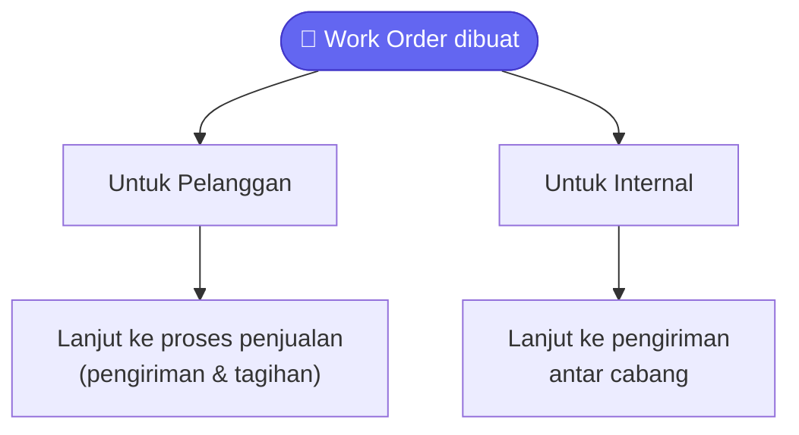

# Layanan / Work Order

Bagian ini menjelaskan cara mencatat pekerjaan atau layanan yang
diberikan — baik untuk pelanggan (misalnya jasa servis) maupun untuk
kebutuhan internal perusahaan sendiri. Kalau kamu bertugas mengelola
pekerjaan servis atau tim teknisi, panduan ini untuk kamu.

## Istilah yang Perlu Kamu Tahu

- **Work Order (WO)** — dokumen pekerjaan/layanan yang mencatat pekerjaan
  apa yang harus dikerjakan, untuk siapa, dan bahan/komponen apa yang
  dipakai.

## Kapan Memakai Work Order?

Work Order dipakai untuk dua situasi:

- **Untuk pelanggan** — kamu memberikan jasa/servis ke pelanggan tertentu.
  Isi kolom pelanggan saat membuat Work Order.
- **Untuk kebutuhan internal** — pekerjaan untuk kebutuhan perusahaan
  sendiri, tidak melibatkan pelanggan luar. Kosongkan kolom pelanggan.

> 💡 Work Order sendiri **tidak langsung** memengaruhi stok atau
> pembukuan. Begitu Work Order dibuat untuk pelanggan, ia akan berlanjut
> ke proses penjualan seperti biasa (lihat panduan **Penjualan**) — di
> sanalah stok dan pembukuan baru benar-benar berubah, tepatnya saat
> barang/jasanya dikirim dan ditagih.

## Langkah 1 — Membuat Work Order

Buka menu **Service → Work Orders → Tambah**.

1. Kalau ini pekerjaan untuk pelanggan, pilih pelanggannya. Kalau untuk
   kebutuhan internal, biarkan kosong.
2. Pilih jenis pekerjaan/layanan yang akan dikerjakan.
3. Tambahkan komponen atau bahan yang dibutuhkan untuk mengerjakan
   pekerjaan ini — isi jenis barang dan jumlah yang diperlukan.

   
4. Klik **Save**, lalu **Submit** kalau sudah siap diproses.

Setelah disubmit, sistem membuat nomor dokumen resmi dan mengecek apakah
perlu persetujuan atasan dulu. Kalau perusahaan kamu tidak memakai alur
persetujuan, Work Order langsung berstatus "Menunggu Dikerjakan".

## Langkah 2 — Mengerjakan Pekerjaan

Setelah Work Order disetujui (atau langsung siap kalau tidak ada alur
persetujuan), teknisi yang ditugaskan bisa memulai pekerjaan:

1. Klik tombol **Mulai Kerjakan** — status berubah jadi "Sedang
   Dikerjakan" dan waktu mulainya tercatat otomatis.
2. Setelah selesai, klik tombol **Selesaikan** — status berubah jadi
   "Selesai" dan waktu selesainya tercatat otomatis.

## Melacak Kebutuhan Komponen/Bahan

Setiap komponen yang kamu daftarkan di Work Order punya progres yang
dilacak bertahap: mulai dari diminta, dipesan, diterima, siap dipakai,
sampai sudah dipindahkan ke lokasi kerja. Kamu bisa memantau sisa
kebutuhan yang belum terpenuhi lewat halaman detail Work Order.

> 💡 Kalau bahan utama sedang tidak tersedia, kamu bisa memakai bahan
> alternatif penggantinya, kalau memang sudah didaftarkan sebagai
> substitusi untuk barang tersebut.

## Apa yang Terjadi Setelah Work Order Selesai?

Tergantung jenisnya:

- **Work Order untuk pelanggan** akan berlanjut menjadi pesanan penjualan
  (Sales Order), lalu mengikuti alur penjualan biasa — pengiriman barang,
  pembuatan tagihan, sampai pembayaran diterima. Lihat panduan
  **Penjualan** untuk detail langkah-langkahnya.
- **Work Order internal** akan berlanjut menjadi permintaan pindah barang
  antar cabang (Internal Order), lalu diproses pengirimannya seperti
  biasa. Lihat panduan **Penjualan**, bagian "Mengirim Barang ke Cabang
  Sendiri".

## Pertanyaan Umum

**Kenapa stok tidak berkurang begitu saya submit Work Order?**
Karena Work Order hanya mencatat rencana pekerjaan dan kebutuhan
komponennya — efek ke stok dan pembukuan baru terjadi belakangan, saat
dokumen turunannya (pengiriman barang, tagihan) benar-benar dibuat dan
disubmit.

**Apa bedanya "Jenis Service" dan "Komponen/Bahan" di Work Order?**
Jenis Service adalah pekerjaan yang dikerjakan (misalnya "Servis AC"),
sedangkan Komponen/Bahan adalah barang fisik yang dipakai untuk
mengerjakannya (misalnya "Freon", "Filter AC").
