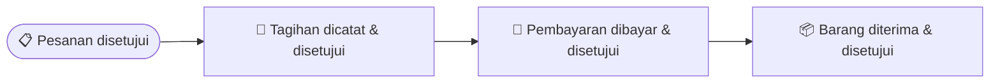

# Pembelian

Bagian ini menjelaskan cara mencatat pembelian barang dari pemasok — mulai
dari mengajukan permintaan, memesan, menerima barang, sampai membayar
tagihannya. Kalau kamu bertugas sebagai bagian pembelian (purchasing),
admin gudang, atau keuangan yang menangani pembayaran ke pemasok, panduan
ini untuk kamu.

## Istilah yang Perlu Kamu Tahu

- **Purchase Request (PR)** — permintaan pembelian dari internal
  perusahaan, sebelum benar-benar memesan ke pemasok. Sifatnya opsional.
- **Purchase Order (PO)** — surat pesanan resmi yang dikirim ke pemasok.
- **Purchase Receipt (GR)** — bukti penerimaan barang dari pemasok.
- **Purchase Invoice (PI)** — tagihan yang diterima dari pemasok.
- **Payment Entry** — catatan pembayaran yang dikirim ke pemasok.

## Alur Besarnya Seperti Apa?

Satu proses pembelian biasanya melewati tahap-tahap ini:

Setiap dokumen di alur ini — permintaan, pesanan, penerimaan barang,
tagihan, sampai pembayaran — melewati **langkah persetujuan** setelah
kamu ajukan. Begitu kamu klik **Ajukan**, dokumen tidak langsung
berlaku: ia menunggu disetujui approver dulu (statusnya jadi **Butuh
Persetujuan**). Efek dokumen — barang bertambah, hutang tercatat, kas
berkurang — baru terjadi **setelah dokumen itu disetujui**. Cara
menyetujui dijelaskan di panduan **Pengaturan Umum**, bagian *Memproses
Persetujuan Sebagai Approver*.

Langkah pertama (mengajukan permintaan) sifatnya opsional — kamu boleh
langsung membuat pesanan resmi tanpa mengajukan permintaan dulu, kalau
memang tidak diperlukan persetujuan kebutuhan/anggaran terpisah di
perusahaanmu.

Sama seperti alur penjualan, **menerima barang** dan **mencatat tagihan**
adalah dua hal terpisah yang boleh dilakukan dalam urutan bebas — terima
barang dulu baru dapat tagihan (paling umum), atau tagihan datang dulu
sebelum barang tiba (misalnya kamu bayar di muka).

## Langkah 1 — Mengajukan Permintaan Pembelian (opsional)

Kalau perusahaan kamu perlu persetujuan kebutuhan sebelum memesan barang,
buka menu **Purchase → Purchase Requests**, klik **Tambah Purchase
Request**, isi barang apa saja yang dibutuhkan dan kapan dibutuhkannya,
lalu **Ajukan**. Permintaan masuk ke **langkah persetujuan** dengan
status **Butuh Persetujuan**. Setelah disetujui, statusnya berubah jadi
siap dipesan.

Kalau perusahaan kamu tidak memerlukan langkah ini, langsung saja lanjut ke
Langkah 2.

## Langkah 2 — Membuat Pesanan Pembelian (Purchase Order)

Buka menu **Purchase → Purchase Orders**, klik **Tambah Purchase Order**.

1. Pilih pemasok tujuan pemesanan.
2. Tambahkan barang yang mau dipesan satu per satu: jenis/varian barang,
   jumlah, satuan, harga, pajak, dan gudang tujuan penyimpanannya. Net
   Total, Jumlah Pajak, dan Total Jumlah dihitung otomatis di bawah
   tabel.
3. Klik **Simpan** untuk menyimpan sebagai draf, lalu **Ajukan** dari
   halaman detail. Nomor dokumen resmi dibuat otomatis, dan pesanan masuk
   ke **langkah persetujuan** dengan status **Butuh Persetujuan** —
   belum bisa diterima atau ditagih sampai atasan menyetujuinya. Setelah
   disetujui, statusnya berubah jadi siap diproses (siap diterima & siap
   ditagih).

Di halaman detail pesanan yang sudah diajukan, tombol **Sync Items**
menarik ulang baris barang dari Purchase Request terkait (kalau pesanan
ini dibuat dari sebuah PR), dan tombol **Mark Done** menutup pesanan
secara manual.

> 💡 Kalau pemasok ternyata tidak bisa memenuhi seluruh pesanan, kamu bisa
> menutup pesanan itu secara manual lewat tombol **Mark Done** — tidak
> perlu menunggu semua barang diterima penuh.

## Langkah 3 — Menerima Barang (Purchase Receipt)

Setelah pesanan **disetujui** dan barang tiba dari pemasok, catat
penerimaannya. Cara paling cepat: buka detail Purchase Order, klik
**Aksi → Buat Purchase Receipt** — baris barang, pemasok, dan gudang
langsung terisi dari pesanannya.

1. Klik **Simpan** untuk menyimpan sebagai draf.

   

2. Klik **Ajukan**, lalu konfirmasi pada dialog yang muncul.

   

   Penerimaan masuk ke **langkah persetujuan** dengan status **Butuh
   Persetujuan** — belum ada stok yang bertambah. Begitu approver
   menyetujuinya:
   - Stok barang otomatis bertambah di gudang tujuan.
   - Jumlah "sudah diterima" pada pesanan aslinya bertambah. Kalau seluruh
     barang di pesanan sudah diterima, statusnya berubah jadi "Diterima".
     Kalau baru sebagian, statusnya "Sebagian Diterima".

   

Satu pesanan boleh diterima bertahap lewat beberapa kali penerimaan,
misalnya kalau pemasok mengirim barangnya secara bertahap.

## Langkah 4 — Mencatat Tagihan dari Pemasok (Purchase Invoice)

1. Buka detail Purchase Order (yang sudah disetujui), klik **Aksi → Buat
   Purchase Invoice** (atau menu **Finances → Purchase Invoices →
   Purchase Invoice Baru** lalu pilih pesanannya).
2. Klik **Simpan**, lalu **Ajukan** dari halaman detail. Tagihan masuk
   ke **langkah persetujuan** dengan status **Butuh Persetujuan** —
   belum ada catatan hutang yang dibuat. Begitu approver menyetujuinya,
   tagihan dari pemasok resmi tercatat sebagai hutang perusahaan, dan
   jumlah "sudah ditagih" pada pesanan aslinya ikut bertambah.

Detail perhitungan pajak (DPP dan Jumlah Pajak) dijelaskan di panduan
**Keuangan**.

## Langkah 5 — Membayar Pemasok (Payment Entry)

1. Buka detail Purchase Invoice, klik **Aksi → Buat Entri Pembayaran**.
2. Pastikan tipe pembayarannya **Bayar** (uang keluar ke pemasok), dan
   pemasoknya benar sebagai penerima.
3. Klik **Simpan**, lalu **Ajukan**. Entri pembayaran masuk ke **langkah
   persetujuan** dengan status **Butuh Persetujuan** — saldo kas dan
   hutang belum bergerak. Begitu approver menyetujuinya, saldo kas/bank
   perusahaan berkurang dan hutang ke pemasok itu ikut berkurang. Kalau
   pembayarannya melunasi seluruh tagihan, statusnya berubah jadi
   "Lunas".

> 💡 Sama seperti pembayaran dari pelanggan, kalau ada beberapa tagihan
> dengan jatuh tempo berbeda, pembayaran akan otomatis dialokasikan ke
> tagihan yang jatuh temponya paling dekat lebih dulu.

## Langkah 6 — Pesanan Selesai

Begitu seluruh barang di satu pesanan sudah diterima **dan** seluruh
tagihannya sudah dicatat dan lunas, status pesanan otomatis berubah
menjadi **Selesai**.

## Contoh: Bayar di Muka Dulu, Baru Barang Diterima

Kalau kamu perlu membayar pemasok lebih dulu sebelum barang dikirim,
urutannya boleh dibalik:

1. Buat pesanan seperti biasa (Langkah 2) sampai **disetujui**.
2. Catat tagihannya lebih dulu (Langkah 4), ajukan, tunggu **disetujui**
   — sebelum barang tiba.
3. Bayar pemasoknya (Langkah 5), ajukan, tunggu **disetujui**.
4. Setelah pembayaran disetujui dan barang benar-benar tiba, baru catat
   penerimaannya (Langkah 3), ajukan, dan tunggu **disetujui** juga.

Hasil akhirnya sama saja — begitu keduanya (terima & tagih) tuntas, pesanan
berstatus Selesai.

## Membatalkan Dokumen

Kalau ada dokumen yang perlu dibatalkan (permintaan, pesanan, penerimaan
barang, atau tagihan), gunakan tombol **Cancel** pada dokumen tersebut.
Semua efeknya otomatis dibalikkan — stok yang tadinya bertambah akan
dikurangi lagi, dan catatan hutang di pembukuan ikut dikoreksi.

Dokumen yang masih berstatus **Butuh Persetujuan** juga bisa dibatalkan —
begitu di-Cancel, langkah persetujuan yang sedang menunggu ikut dihentikan
dan approver diberi tahu bahwa dokumen itu tak perlu ditinjau lagi.

## Mencatat Data Pemasok

Sebelum membuat pesanan, pastikan data pemasoknya sudah ada. Buka menu
**Purchase → Suppliers**, klik **Tambah Pemasok** — isi nama, Email,
Telepon, rekening bank untuk pembayaran (tabel **Bank**), dan alamatnya.

## Kalau Ada Barang yang Dikembalikan ke Pemasok

Kalau barang yang sudah diterima perlu dikembalikan ke pemasok, atau
tagihannya perlu dikoreksi, kamu tidak membuat dokumen jenis baru — cukup
buat penerimaan barang atau tagihan seperti biasa, tapi tandai bahwa
dokumen itu adalah **retur** dari dokumen aslinya. Penjelasan lengkapnya
ada di panduan **Retur**.

## Pertanyaan Umum

**Apakah saya wajib membuat Purchase Request sebelum memesan?**
Tidak wajib. Purchase Request hanya diperlukan kalau perusahaan kamu
memang menerapkan alur persetujuan kebutuhan sebelum barang dipesan. Kamu
tetap bisa langsung membuat Purchase Order tanpa permintaan sebelumnya.

**Bolehkah satu pesanan diterima beberapa kali secara bertahap?**
Boleh. Kamu bisa mencatat beberapa kali penerimaan untuk satu pesanan yang
sama sampai seluruh jumlah barangnya diterima.

**Kenapa ada tombol "Tandai Selesai" di pesanan?**
Untuk menutup pesanan secara manual kalau pemasok ternyata tidak bisa
mengirim seluruh barang yang dipesan — supaya pesanan tidak menggantung
selamanya menunggu sisa barang yang tidak akan pernah datang.
