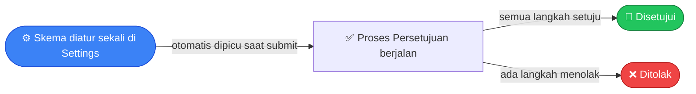
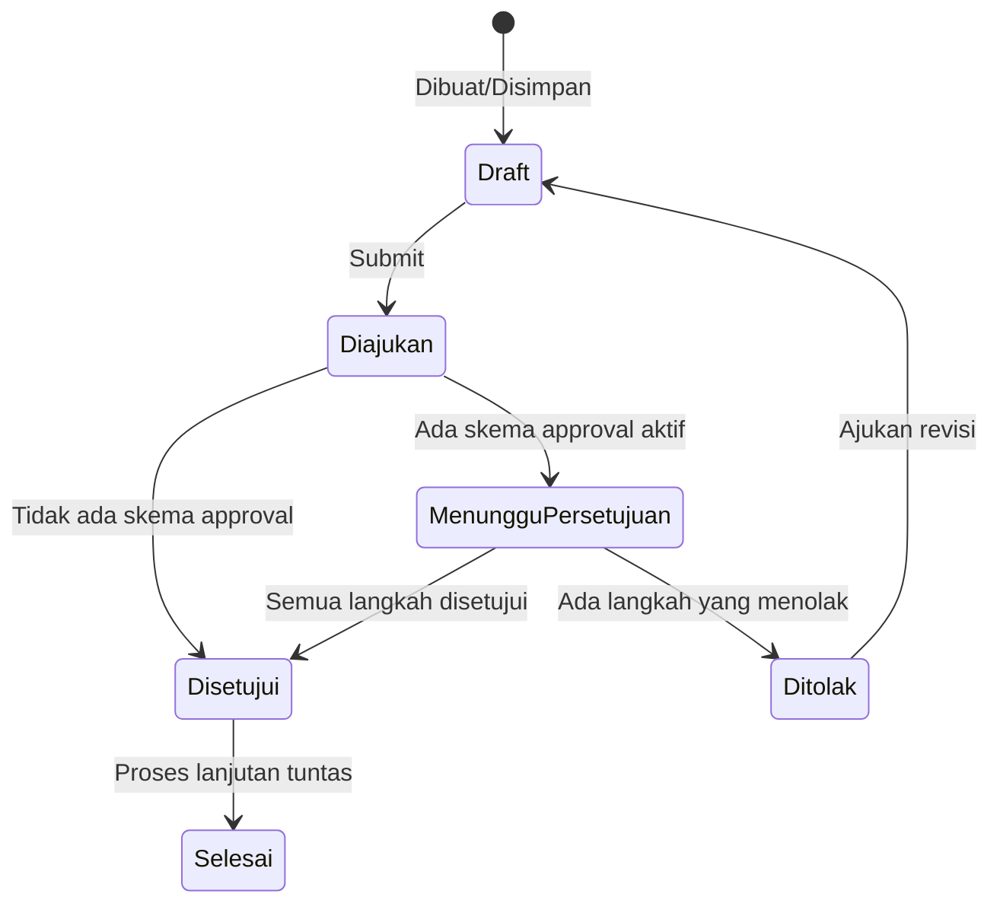

# Pengaturan Umum

Bagian ini menjelaskan berbagai pengaturan dasar aplikasi yang biasanya
disiapkan lebih dulu sebelum mulai bertransaksi, plus fitur-fitur umum
yang dipakai di hampir semua halaman (pencarian cepat, notifikasi, tugas,
dll). Kalau kamu bertugas mengatur konfigurasi awal perusahaan atau
mengelola hak akses user, panduan ini untuk kamu.

## Menyiapkan Perusahaan & Cabang

### Profil Perusahaan

Buka menu **Settings → Company** untuk mengisi nama, alamat, dan
mengunggah logo perusahaan. Logo ini nanti otomatis dipakai di dokumen
cetak yang menyertakan kop surat.

### Cabang (Branch)

Setiap dokumen yang kamu buat (pesanan, tagihan, dll.) selalu tercatat di
bawah satu cabang tertentu. Buka menu **Settings → Branches → Tambah**
untuk mendaftarkan cabang — minimal satu cabang utama harus ada sebelum
aplikasi bisa dipakai bertransaksi.

Setiap cabang punya kode singkat (misalnya "HO" untuk kantor pusat) yang
bisa dipakai dalam penomoran dokumen otomatis, dan alamat pengiriman/
penagihan sendiri.

### Berpindah Cabang Aktif

Kalau kamu punya akses ke lebih dari satu cabang, kamu bisa berpindah
cabang aktif lewat tombol pemilih cabang di pojok atas aplikasi (navbar).
Cabang aktif ini menentukan:

- Cabang yang otomatis dipakai untuk dokumen baru yang kamu buat.
- Nomor urut kode dokumen (kalau formatnya menyertakan kode cabang).
- Data apa saja yang ditampilkan di beberapa laporan.

> 💡 Cabang aktif tersimpan selama kamu masih login. Begitu logout dan
> login lagi, cabang aktif kembali ke pengaturan default kamu.

## Mengatur Penomoran Dokumen Otomatis

Setiap dokumen (pesanan, tagihan, dll.) mendapat nomor kode secara
otomatis, jadi kamu tidak perlu mengetiknya manual. Buka menu
**Settings → Formating Series → Tambah** untuk mengatur pola nomornya per
jenis dokumen.

Pola disusun dari teks bebas ditambah kode-kode berikut yang otomatis
digantikan sistem:

| Kode | Diganti dengan | Contoh |
|---|---|---|
| Nomor urut | Angka urut, bisa diatur jumlah digitnya | `1`, `01`, `0001` |
| Tahun | Tahun (4 digit atau 2 digit) | `2025` atau `25` |
| Bulan | Nama atau angka bulan | `Januari`, `Jan`, `01` |
| Kode Cabang | Kode cabang yang sedang aktif | `HO` |

Contoh pola `[Kode Cabang]/SO-[Nomor Urut 4 digit]/[Tahun 2 digit]` akan
menghasilkan kode seperti `HO/SO-0001/25`.

> 💡 Kalau pola kamu menyertakan kode bulan **dan** tahun, nomor urutnya
> otomatis mulai dari 1 lagi setiap bulan. Kalau hanya menyertakan tahun
> (tanpa bulan), resetnya per tahun. Kalau tidak menyertakan keduanya,
> nomor urut terus bertambah tanpa pernah reset.

## Mengatur Alur Persetujuan (Approval)

Kalau perusahaan kamu perlu persetujuan atasan sebelum sebuah dokumen
(pesanan penjualan, pesanan pembelian, tagihan, dll.) resmi berjalan,
kamu bisa mengatur alurnya di sini — sekali diatur, berlaku otomatis
setiap kali dokumen jenis itu diajukan (submit).

### Langkah 1 — Membuat Skema Persetujuan

Buka menu **Settings → Approval Schemes → Tambah**.

1. Beri nama skema ini dan pilih jenis dokumen yang dikenai skema
   (misalnya "Sales Order").
2. Aktifkan skemanya. Perlu diingat, hanya boleh ada **satu skema aktif**
   untuk satu jenis dokumen — mengaktifkan skema baru untuk jenis dokumen
   yang sama akan otomatis menonaktifkan skema lama.

### Langkah 2 — Menambahkan Langkah Persetujuan

Setiap skema bisa terdiri dari satu atau lebih langkah berurutan. Untuk
tiap langkah, tentukan:

- **Urutan** — langkah ke berapa dalam alur (langkah 1, 2, 3, dst.)
- **Penyetuju** — siapa yang harus menyetujui di langkah ini, bisa berupa
  satu Role tertentu (siapa pun yang punya role itu bisa menyetujui) atau
  satu user spesifik.

### Bagaimana Persetujuan Berjalan

Begitu dokumen yang terkait skema ini di-submit:

- Kalau **tidak ada skema aktif** untuk jenis dokumen itu, dokumen
  langsung dianggap disetujui.
- Kalau **ada skema aktif**, dokumen menunggu persetujuan sesuai urutan
  langkah yang sudah diatur. Setiap langkah harus disetujui dulu sebelum
  lanjut ke langkah berikutnya.
- Kalau **semua langkah disetujui**, dokumen lanjut ke tahap proses
  berikutnya.
- Kalau **salah satu langkah menolak**, dokumen berstatus "Ditolak" dan
  bisa direvisi (diajukan ulang) oleh pembuatnya.

### Memproses Persetujuan Sebagai Approver

Kalau kamu ditugaskan sebagai penyetuju, buka menu **Approvals** untuk
melihat daftar dokumen yang menunggu persetujuanmu. Buka detail
dokumennya, lalu klik **Approve** untuk menyetujui atau **Reject** untuk
menolak.

## Alur Status Dokumen Secara Umum

Hampir semua dokumen transaksi di aplikasi ini (pesanan, tagihan, surat
jalan, dll.) mengikuti pola alur status yang sama:

- **Draft** — dokumen masih bisa diedit bebas, belum berlaku resmi.
- **Submit** — dokumen dikunci, nomor kode resmi dibuat, dan mulai
  diproses (termasuk dicek apakah perlu persetujuan).
- **Cancel** — dokumen dibatalkan; semua efek yang sudah terjadi
  (perubahan stok, pencatatan keuangan) otomatis dibalikkan.
- **Amend (ajukan revisi)** — dokumen yang ditolak bisa diperbaiki dan
  diajukan ulang sebagai dokumen baru.

Tiap modul punya status lanjutan yang lebih spesifik sesuai kebutuhannya
sendiri — misalnya pesanan penjualan punya status "Siap Dikirim"/"Siap
Ditagih", sementara pesanan pembelian punya status "Siap Diterima".
Detailnya dijelaskan di panduan masing-masing modul.

## Mengatur Hak Akses (Roles & Permissions)

Setiap user diberi satu atau lebih **Role** (peran), dan tiap Role
menentukan apa saja yang boleh dilakukan user tersebut — melihat,
membuat, mengubah, menghapus, atau melakukan aksi khusus (submit,
cancel, cetak) pada suatu jenis data.

### Role Bawaan yang Tersedia

| Role | Cakupan Akses |
|---|---|
| System Manager | Akses penuh ke semua modul dan pengaturan |
| Master Data Administrator | Mengelola semua data master (produk, pelanggan, pemasok, dll.) |
| User & Access Administrator | Mengelola user, role, dan hak akses |
| Sales Officer | Membuat dan mengelola pesanan penjualan, data pelanggan |
| Purchasing Officer | Membuat dan mengelola permintaan & pesanan pembelian |
| Finance Officer | Mengelola tagihan, pembayaran, dan pembukuan |
| Warehouse Officer | Mengelola pergerakan stok, surat jalan, gudang |
| Item Master | Mengelola data produk, varian, kategori, atribut |
| Approver | Menyetujui/menolak dokumen, bisa melihat semua modul |
| Auditor | Hanya bisa melihat dan mengekspor data di semua modul, tanpa bisa mengubah |

> 💡 Satu user boleh punya lebih dari satu Role sekaligus — hak aksesnya
> adalah gabungan dari semua Role yang dimiliki.

> **Pengecualian**: modul Ticket (Helpdesk) sengaja dibuat terbuka untuk
> semua user yang login, tidak mengikuti aturan hak akses di atas. Lihat
> panduan **Helpdesk** untuk detailnya.

## Mendesain Tampilan Cetak Dokumen (Print Template)

Buka menu **Settings → Print Templates** untuk mendesain tampilan cetak
(PDF) dokumen bisnis seperti pesanan atau tagihan — memakai editor
visual seret-lepas, tidak perlu menulis kode.

1. Buka editor template, susun tampilannya dengan menyeret elemen (teks,
   tabel barang, logo, dll.) ke posisi yang diinginkan.
2. Gunakan tombol **Preview** untuk melihat hasil cetaknya dengan data
   contoh sebelum disimpan.
3. Tandai satu template sebagai **default** — ini yang otomatis dipakai
   setiap kali dokumen dicetak, kecuali kamu pilih template lain secara
   manual saat mencetak.

Kamu bisa membuat lebih dari satu template untuk jenis dokumen yang sama
(misalnya versi ringkas dan versi lengkap) dan memilih salah satunya saat
akan mencetak.

## Menyusun Dashboard

Setiap user bisa menyusun dashboard sendiri berisi widget (grafik, tabel,
atau angka ringkasan) yang menampilkan data yang relevan buat mereka.

1. Buka halaman **Dashboard**, klik tombol tambah widget.
2. Pilih sumber datanya (misalnya pesanan penjualan atau tagihan), tipe
   tampilan (grafik/tabel/angka), dan filter data yang diinginkan
   (misalnya hanya data bulan ini).
3. Widget bisa disusun ulang urutannya dengan cara diseret.

> 💡 Dashboard bersifat personal — susunan widget milik satu user tidak
> memengaruhi tampilan dashboard user lain.

## Menambahkan Label & Lampiran File

- **Tags** — label bebas yang bisa ditempelkan ke data atau dokumen apa
  pun untuk memudahkan pengelompokan dan pencarian. Bisa ditambahkan
  langsung dari halaman detail dokumen mana pun yang mendukungnya.
- **Files** — lampiran file yang tersusun dalam folder bertingkat seperti
  manajer file pada umumnya. File bisa dilampirkan langsung dari halaman
  detail dokumen, dan pratinjaunya bisa dilihat tanpa perlu diunduh dulu.

## Mencatat Tugas (Todo)

Todo dipakai untuk mencatat pekerjaan yang tidak terikat pada satu
dokumen transaksi tertentu — misalnya "follow up pelanggan X" atau
"siapkan laporan bulanan".

Buka menu **Todo → Tambah**, isi uraian tugasnya, lalu tugaskan ke:

- **User tertentu** — hanya orang itu yang menerima tugasnya.
- **Role tertentu** — berlaku untuk **semua** user yang memegang role
  tersebut, siapa pun di antara mereka bisa menindaklanjuti dan
  menyelesaikannya.

Begitu tugas dibuat, sistem otomatis mengirim notifikasi ke semua
penerimanya. Halaman daftar Todo terbagi dua tampilan: **Ditugaskan ke
Saya** dan **Saya yang Menugaskan**.

## Notifikasi

Notifikasi dalam aplikasi memberi tahu kamu soal kejadian penting —
misalnya saat menerima tugas Todo baru. Buka ikon lonceng di pojok atas
aplikasi untuk melihatnya, dan tandai sebagai sudah dibaca satu per satu
atau sekaligus semua.

## Pencarian Cepat (Command Palette)

Untuk berpindah ke halaman atau dokumen mana pun tanpa perlu klik menu
satu per satu, gunakan pencarian cepat global — cukup ketik kata kunci
seperti nama halaman ("Sales Order", "Dashboard") atau kode dokumen
spesifik yang kamu cari. Riwayat pencarian terakhir ikut tersimpan supaya
navigasi berikutnya lebih cepat, dan bisa dihapus kapan saja.

## Pengaturan Umum Lainnya (Preferences)

Buka menu **Settings → Preferences** untuk mengatur hal-hal yang berlaku
untuk seluruh perusahaan, seperti mata uang default dan zona waktu acuan
untuk penomoran dokumen dan pencatatan tanggal.

## Urutan yang Disarankan Saat Pertama Kali Setup

Kalau kamu baru pertama kali menyiapkan aplikasi ini, urutan berikut akan
memudahkan:

1. Lengkapi **profil perusahaan** dan daftarkan minimal satu **cabang**.
2. Atur **penomoran dokumen** untuk tiap jenis dokumen yang akan dipakai.
3. Siapkan data master gudang, kategori, satuan, dan atribut produk —
   lihat panduan **Inventory & Gudang**.
4. Siapkan bagan akun dan tarif pajak — lihat panduan **Keuangan**.
5. Daftarkan data pelanggan dan pemasok — lihat panduan **Penjualan** dan
   **Pembelian**.
6. Kalau perlu, atur **skema persetujuan** untuk dokumen-dokumen yang
   memerlukan approval berjenjang.

## Pertanyaan Umum

**Saya tidak menemukan menu tertentu — kenapa?**
Kemungkinan role/hak akses kamu belum mencakup modul tersebut. Hubungi
user dengan role "User & Access Administrator" atau "System Manager" di
perusahaanmu untuk memeriksa dan menyesuaikan hak akses.

**Bagaimana kalau saya butuh lebih dari satu tahap persetujuan?**
Tambahkan beberapa langkah persetujuan berurutan saat membuat skema —
setiap langkah harus disetujui dulu sebelum lanjut ke langkah berikutnya.

**Apakah cabang aktif memengaruhi data yang saya lihat di laporan?**
Ya, beberapa laporan dan filter data mengikuti cabang yang sedang aktif.
Pastikan kamu memilih cabang yang benar sebelum memeriksa laporan.
