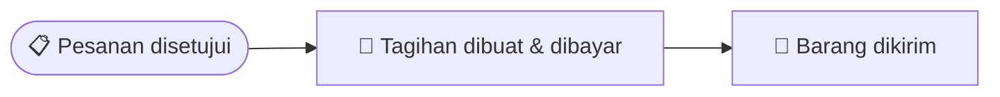

# Penjualan

Bagian ini menjelaskan cara mencatat penjualan ke pelanggan — mulai dari
menerima pesanan, mengirim barang, membuat tagihan, sampai uangnya diterima.
Kalau kamu bertugas sebagai sales, admin gudang, atau bagian keuangan yang
menangani penjualan, panduan ini untuk kamu.

## Istilah yang Perlu Kamu Tahu

- **Sales Order (SO)** — surat pesanan penjualan. Ini dokumen pertama yang
  dibuat setiap ada pelanggan memesan barang.
- **Delivery Note (DN)** — surat jalan / bukti pengiriman barang.
- **Sales Invoice (SI)** — tagihan/faktur penjualan.
- **Payment Entry** — catatan penerimaan pembayaran dari pelanggan.
- **Internal Order (IO)** — permintaan pindah barang antar cabang milik
  perusahaan sendiri (bukan penjualan ke pelanggan luar).

## Alur Besarnya Seperti Apa?

Satu pesanan pelanggan biasanya melewati 4 tahap ini:

Yang menarik: **mengirim barang** dan **membuat tagihan** adalah dua hal
yang terpisah dan boleh dilakukan dalam urutan bebas. Kamu boleh kirim
barang dulu baru tagih belakangan (paling umum), atau tagih dulu (misalnya
pelanggan bayar di muka) baru kirim barangnya. Aplikasi mencatat progres
"sudah dikirim berapa" dan "sudah ditagih berapa" secara terpisah, jadi
kedua cara sama-sama valid.

## Langkah 1 — Membuat Pesanan Penjualan (Sales Order)

Buka menu **Sales → Sales Orders → Tambah**.

1. Pilih pelanggan yang memesan.
2. Tambahkan barang yang dipesan satu per satu: pilih jenis/varian
   barangnya, jumlah, satuan (misalnya pcs atau box), harga, pajak (kalau
   ada), dan gudang mana barang akan diambil.
3. Klik **Save** — pesanan tersimpan sebagai Draft, artinya masih bisa
   diedit bebas dan belum berlaku resmi.
4. Kalau sudah yakin, klik **Submit**. Begitu di-submit, tiga hal terjadi
   otomatis:
   - Nomor dokumen resmi dibuatkan oleh sistem.
   - Barang yang dipesan langsung "diamankan" di gudang asal, supaya tidak
     kepakai untuk pesanan lain sebelum sempat dikirim.
   - Kalau perusahaan kamu mengaktifkan alur persetujuan, pesanan ini akan
     menunggu disetujui atasan dulu. Kalau tidak ada alur persetujuan,
     pesanan langsung siap diproses (siap dikirim & siap ditagih).

> 💡 **Kenapa barangnya "diamankan"?** Supaya barang yang sudah dijanjikan
> ke satu pelanggan tidak tiba-tiba habis diambil untuk pesanan pelanggan
> lain sebelum kamu sempat mengirimnya.

Kalau pesanan ditolak atasan, kamu bisa merevisinya dan mengirim ulang
untuk disetujui.

## Langkah 2 — Mengirim Barang (Delivery Note)

Setelah pesanan siap diproses, buat surat jalan pengirimannya.

1. Buka menu **Sales** atau **Inventory → Delivery Notes → Tambah**, lalu
   pilih pesanan (Sales Order) yang barangnya mau dikirim. Cara lebih
   cepat: buka pesanannya langsung, lalu klik tombol untuk membuat surat
   jalan dari sana.
2. Klik **Submit** pada surat jalan. Setelah itu:
   - Stok barang di gudang otomatis berkurang.
   - Jumlah "sudah terkirim" pada pesanan aslinya bertambah.
   - Kalau seluruh barang di pesanan sudah terkirim, statusnya berubah
     jadi "Terkirim". Kalau baru sebagian, statusnya "Sebagian Terkirim".

Satu pesanan boleh dikirim bertahap lewat beberapa surat jalan, misalnya
kalau barangnya belum siap semua sekaligus.

## Langkah 3 — Membuat Tagihan (Sales Invoice)

1. Buka menu **Finances → Sales Invoices → Tambah**, lalu pilih pesanan
   (Sales Order) yang mau ditagih.
2. Klik **Submit**. Setelah itu:
   - Tagihan ke pelanggan resmi tercatat sebagai piutang, dan pendapatan
     penjualan ikut tercatat di pembukuan perusahaan.
   - Jumlah "sudah ditagih" pada pesanan aslinya bertambah. Kalau seluruh
     nilai pesanan sudah ditagih, statusnya berubah jadi "Ditagih".

## Langkah 4 — Menerima Pembayaran (Payment Entry)

1. Buka menu **Finances → Payment Entries → Tambah**, pilih tipe
   **"Terima"** (karena ini uang masuk dari pelanggan).
2. Pilih tagihan (Sales Invoice) mana yang dibayar, dan pastikan
   pelanggannya benar.
3. Klik **Submit**. Setelah itu:
   - Saldo kas/bank perusahaan bertambah, dan piutang ke pelanggan itu
     berkurang.
   - Kalau pembayarannya melunasi seluruh tagihan, status tagihan berubah
     jadi "Lunas". Kalau baru sebagian, sisanya tetap tercatat sebagai
     piutang yang belum dibayar.

> 💡 Kalau pelanggan punya beberapa tagihan dengan jatuh tempo berbeda,
> pembayaran yang masuk akan otomatis dialokasikan ke tagihan yang jatuh
> temponya paling dekat lebih dulu.

## Langkah 5 — Pesanan Selesai

Begitu seluruh barang di satu pesanan sudah terkirim **dan** seluruh
nilainya sudah tertagih (dan lunas), status pesanan otomatis berubah
menjadi **Selesai**. Kamu tidak perlu menutupnya secara manual.

## Contoh: Bayar di Muka Dulu, Baru Kirim Barang

Kalau pelanggan kamu harus bayar dulu sebelum barang dikirim (misalnya DP
atau lunas di muka), urutannya boleh dibalik:

1. Buat pesanan seperti biasa (Langkah 1) sampai disetujui.
2. Langsung buat tagihannya (Langkah 3) sebelum barang dikirim.
3. Terima pembayarannya (Langkah 4).
4. Setelah uang diterima, baru buat surat jalan pengirimannya (Langkah 2).

Hasil akhirnya sama saja — begitu keduanya (kirim & tagih) tuntas, pesanan
berstatus Selesai. Yang membedakan cuma urutan mana yang kamu kerjakan
lebih dulu.

## Membatalkan Dokumen

Kalau ada dokumen yang perlu dibatalkan (pesanan, surat jalan, atau
tagihan), gunakan tombol **Cancel** pada dokumen tersebut. Semua efeknya
akan otomatis dibalikkan — misalnya stok yang tadinya berkurang akan
dikembalikan lagi, dan catatan piutang/pendapatan di pembukuan ikut
dikoreksi. Kamu tidak perlu membenarkannya secara manual.

## Mengirim Barang ke Cabang Sendiri (Internal Order)

Kalau kamu perlu memindahkan barang antar gudang atau cabang milik
perusahaan sendiri (bukan menjual ke pelanggan luar), gunakan **Internal
Order** di menu **Sales → Internal Orders**. Cara pakainya mirip persis
dengan Sales Order — buat, submit, lalu diproses pengirimannya — hanya saja
tidak melibatkan pelanggan eksternal dan biasanya dipakai untuk mengisi
stok cabang lain.

## Mencatat Data Pelanggan

Sebelum membuat pesanan, pastikan data pelanggannya sudah ada. Buka menu
**Sales → Customers → Tambah** untuk mendaftarkan pelanggan baru — isi
nama, kontak, NPWP (kalau ada), dan alamatnya. Data ini akan otomatis
muncul sebagai pilihan setiap kali membuat pesanan baru.

## Kalau Ada Barang yang Dikembalikan

Kalau pelanggan mengembalikan barang atau tagihannya perlu dikoreksi,
kamu tidak membuat dokumen jenis baru — cukup buat surat jalan atau
tagihan seperti biasa, tapi tandai bahwa dokumen itu adalah **retur** dari
dokumen aslinya. Penjelasan lengkapnya ada di panduan **Retur**.

## Pertanyaan Umum

**Kenapa saya tidak bisa mengirim barang padahal pesanan sudah dibuat?**
Pastikan pesanannya sudah di-submit (bukan masih Draft) dan sudah disetujui
kalau perusahaan kamu memakai alur persetujuan. Pesanan yang masih Draft
atau masih menunggu persetujuan belum bisa diproses ke tahap pengiriman.

**Bolehkah satu pesanan dikirim beberapa kali secara bertahap?**
Boleh. Kamu bisa membuat beberapa surat jalan untuk satu pesanan yang sama
sampai seluruh jumlah barangnya terkirim.

**Kenapa pajak tidak wajib diisi di setiap baris pesanan?**
Karena tidak semua barang atau pelanggan kena pajak. Kalau baris pesanan
tidak diisi pajak, nilai pajaknya otomatis dianggap nol — tagihan tetap
bisa dibuat seperti biasa.
