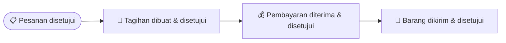

# Penjualan

Bagian ini menjelaskan cara mencatat penjualan ke pelanggan — mulai dari
menerima pesanan, mengirim barang, membuat tagihan, sampai uangnya diterima.
Kalau kamu bertugas sebagai sales, admin gudang, atau bagian keuangan yang
menangani penjualan, panduan ini untuk kamu.

## Istilah yang Perlu Kamu Tahu

- **Sales Order (SO)** — surat pesanan penjualan. Ini dokumen pertama yang
  dibuat setiap ada pelanggan memesan barang.
- **Delivery Note (DN)** — surat jalan / bukti pengiriman barang.
- **Sales Invoice (SI)** — tagihan/faktur penjualan.
- **Payment Entry** — catatan penerimaan pembayaran dari pelanggan.
- **Internal Order (IO)** — permintaan pindah barang antar cabang milik
  perusahaan sendiri (bukan penjualan ke pelanggan luar).

## Alur Besarnya Seperti Apa?

Satu pesanan pelanggan biasanya melewati tahap-tahap ini:

Setiap dokumen di alur ini — pesanan, surat jalan, tagihan, sampai
penerimaan pembayaran — melewati **langkah persetujuan** setelah kamu
ajukan. Begitu kamu klik **Ajukan**, dokumen tidak langsung berlaku: ia
menunggu disetujui approver dulu (statusnya jadi **Butuh Persetujuan**).
Efek dokumen — barang berkurang, piutang tercatat, kas bertambah — baru
terjadi **setelah dokumen itu disetujui**. Cara menyetujui dijelaskan di
panduan **Pengaturan Umum**, bagian _Memproses Persetujuan Sebagai
Approver_.

Yang menarik: **mengirim barang** dan **membuat tagihan** adalah dua hal
yang terpisah dan boleh dilakukan dalam urutan bebas. Kamu boleh kirim
barang dulu baru tagih belakangan (paling umum), atau tagih dulu (misalnya
pelanggan bayar di muka) baru kirim barangnya. Aplikasi mencatat progres
"sudah dikirim berapa" dan "sudah ditagih berapa" secara terpisah, jadi
kedua cara sama-sama valid.

## Langkah 1 — Membuat Pesanan Penjualan (Sales Order)

Buka menu **Sales → Sales Orders**, klik **Sales Order Baru**.

1. Pilih **Pelanggan** yang memesan (Cabang Pelanggan terisi otomatis).
   Centang **Untuk Disewa?** kalau ini transaksi sewa, bukan jual putus.
2. Tambahkan barang yang dipesan satu per satu: pilih jenis/varian
   barangnya, gudang asal, jumlah, dan harga. Total Bersih, Jumlah Pajak,
   dan Total Keseluruhan dihitung otomatis.
3. Klik **Simpan** — pesanan tersimpan sebagai Draf, artinya masih bisa
   diedit bebas dan belum berlaku resmi.
4. Kalau sudah yakin, klik **Ajukan** dari halaman detail. Begitu
   di-submit, tiga hal terjadi otomatis:
   - Nomor dokumen resmi dibuatkan oleh sistem.
   - Barang yang dipesan langsung "diamankan" di gudang asal, supaya tidak
     kepakai untuk pesanan lain sebelum sempat dikirim.
   - Pesanan masuk ke **langkah persetujuan** dan statusnya menjadi
     **Butuh Persetujuan**. Pesanan belum bisa dikirim atau ditagih sampai
     atasan menyetujuinya. Setelah disetujui, statusnya berubah jadi siap
     diproses (siap dikirim & siap ditagih).

> 💡 **Kenapa barangnya "diamankan"?** Supaya barang yang sudah dijanjikan
> ke satu pelanggan tidak tiba-tiba habis diambil untuk pesanan pelanggan
> lain sebelum kamu sempat mengirimnya.

Kalau pesanan ditolak atasan, statusnya menjadi **Ditolak** dan barang
yang tadi diamankan dilepas kembali. Kamu bisa merevisi pesanan itu
(Amend) lalu mengajukannya ulang untuk disetujui.

## Langkah 2 — Mengirim Barang (Delivery Note)

Surat jalan baru bisa dibuat setelah pesanannya **disetujui**. Cara
tercepat: buka detail Sales Order, klik **Aksi → Buat Delivery Note**.

1. Baris barang dan gudang asal terisi otomatis dari pesanannya.
2. Klik **Simpan**, lalu **Ajukan** dari halaman detail. Surat jalan masuk
   ke **langkah persetujuan** dengan status **Butuh Persetujuan** — belum
   ada stok yang dipotong. Begitu approver menyetujuinya:
   - Stok barang di gudang otomatis berkurang.
   - Jumlah "sudah terkirim" pada pesanan aslinya bertambah.
   - Kalau seluruh barang di pesanan sudah terkirim, statusnya berubah
     jadi "Terkirim". Kalau baru sebagian, statusnya "Sebagian Terkirim".

Satu pesanan boleh dikirim bertahap lewat beberapa surat jalan, misalnya
kalau barangnya belum siap semua sekaligus.

## Langkah 3 — Membuat Tagihan (Sales Invoice)

1. Buka detail Sales Order (yang sudah disetujui), klik **Aksi → Buat
   Sales Invoice**.
2. Klik **Simpan**, lalu **Ajukan** dari halaman detail. Tagihan masuk ke
   **langkah persetujuan** dengan status **Butuh Persetujuan** — belum ada
   catatan piutang atau pendapatan yang dibuat. Begitu approver
   menyetujuinya:
   - Tagihan ke pelanggan resmi tercatat sebagai piutang, dan pendapatan
     penjualan ikut tercatat di pembukuan perusahaan.
   - Jumlah "sudah ditagih" pada pesanan aslinya bertambah. Kalau seluruh
     nilai pesanan sudah ditagih, statusnya berubah jadi "Ditagih".

Detail perhitungan pajak (DPP dan Jumlah Pajak) dijelaskan di panduan
**Keuangan**.

## Langkah 4 — Menerima Pembayaran (Payment Entry)

1. Buka detail Sales Invoice, klik **Aksi → Buat Entri Pembayaran**.
   
2. Pastikan tipe pembayarannya **Terima** (uang masuk dari pelanggan),
   dan pelanggannya benar.
   
3. Klik **Simpan**, lalu **Ajukan**. Entri pembayaran masuk ke **langkah
   persetujuan** dengan status **Butuh Persetujuan** — saldo kas dan
   piutang belum bergerak. Begitu approver menyetujuinya:
   
   - Saldo kas/bank perusahaan bertambah, dan piutang ke pelanggan itu
     berkurang.
   - Kalau pembayarannya melunasi seluruh tagihan, status tagihan berubah
     jadi "Lunas". Kalau baru sebagian, sisanya tetap tercatat sebagai
     piutang yang belum dibayar.

> 💡 Kalau pelanggan punya beberapa tagihan dengan jatuh tempo berbeda,
> pembayaran yang masuk akan otomatis dialokasikan ke tagihan yang jatuh
> temponya paling dekat lebih dulu.

## Langkah 5 — Pesanan Selesai

Begitu seluruh barang di satu pesanan sudah terkirim **dan** seluruh
nilainya sudah tertagih (dan lunas), status pesanan otomatis berubah
menjadi **Selesai**. Kamu tidak perlu menutupnya secara manual.

## Contoh: Bayar di Muka Dulu, Baru Kirim Barang

Kalau pelanggan kamu harus bayar dulu sebelum barang dikirim (misalnya DP
atau lunas di muka), urutannya boleh dibalik:

1. Buat pesanan seperti biasa (Langkah 1) sampai **disetujui**.
2. Langsung buat tagihannya (Langkah 3), ajukan, tunggu **disetujui** —
   sebelum barang dikirim.
3. Buat entri pembayarannya (Langkah 4), ajukan, tunggu **disetujui**.
4. Setelah pembayaran disetujui, baru buat surat jalan pengirimannya
   (Langkah 2), ajukan, dan tunggu **disetujui** juga.

Hasil akhirnya sama saja — begitu keduanya (kirim & tagih) tuntas, pesanan
berstatus Selesai. Yang membedakan cuma urutan mana yang kamu kerjakan
lebih dulu.

## Membatalkan Dokumen

Kalau ada dokumen yang perlu dibatalkan (pesanan, surat jalan, atau
tagihan), gunakan tombol **Cancel** pada dokumen tersebut. Semua efeknya
akan otomatis dibalikkan — misalnya stok yang tadinya berkurang akan
dikembalikan lagi, dan catatan piutang/pendapatan di pembukuan ikut
dikoreksi. Kamu tidak perlu membenarkannya secara manual.

Dokumen yang masih berstatus **Butuh Persetujuan** juga bisa dibatalkan —
begitu di-Cancel, langkah persetujuan yang sedang menunggu ikut dihentikan
dan approver diberi tahu bahwa dokumen itu tak perlu ditinjau lagi.

## Mengirim Barang ke Cabang Sendiri (Internal Order)

Kalau kamu perlu memindahkan barang antar gudang atau cabang milik
perusahaan sendiri (bukan menjual ke pelanggan luar), gunakan **Internal
Order** di menu **Sales → Internal Orders**. Cara pakainya mirip persis
dengan Sales Order — buat, ajukan, tunggu **disetujui**, lalu diproses
pengirimannya — hanya saja tidak melibatkan pelanggan eksternal dan
biasanya dipakai untuk mengisi stok cabang lain.

Surat jalannya juga bisa dilihat di menu **Inventory → Delivery Notes**.

## Mencatat Data Pelanggan

Sebelum membuat pesanan, pastikan data pelanggannya sudah ada. Buka menu
**Sales → Customers**, klik **Tambah Pelanggan** — isi Nama, **Nomor PPN
(VAT)** (NPWP, kalau ada), Email, Telepon, dan alamatnya. Data ini akan
otomatis muncul sebagai pilihan setiap kali membuat pesanan baru.

## Kalau Ada Barang yang Dikembalikan

Kalau pelanggan mengembalikan barang atau tagihannya perlu dikoreksi,
kamu tidak membuat dokumen jenis baru — cukup buat surat jalan atau
tagihan seperti biasa, tapi tandai bahwa dokumen itu adalah **retur** dari
dokumen aslinya. Penjelasan lengkapnya ada di panduan **Retur**.

## Pertanyaan Umum

**Kenapa saya tidak bisa mengirim barang padahal pesanan sudah dibuat?**
Pastikan pesanannya sudah di-submit (bukan masih Draft) **dan sudah
disetujui** approver. Pesanan yang masih Draft atau masih berstatus Butuh
Persetujuan belum bisa diproses ke tahap pengiriman.

**Bolehkah satu pesanan dikirim beberapa kali secara bertahap?**
Boleh. Kamu bisa membuat beberapa surat jalan untuk satu pesanan yang sama
sampai seluruh jumlah barangnya terkirim.

**Kenapa pajak tidak wajib diisi di setiap baris pesanan?**
Karena tidak semua barang atau pelanggan kena pajak. Kalau baris pesanan
tidak diisi pajak, nilai pajaknya otomatis dianggap nol — tagihan tetap
bisa dibuat seperti biasa.
