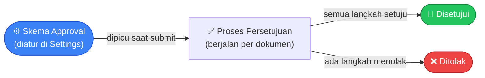

# Modul Core / Settings

> Dokumentasi modul inti: Branches, Approval Schemes, FormatingSeries, Print Templates, Dashboard, Tags, Files, Todo, Notification, Email Template, Image Uploader, SavedFilter, Changelog.

## Daftar Isi

- [Gambaran Modul](#gambaran-modul)
- [Branch & Multi-Branch](#branch--multi-branch)
- [Approval](#approval)
- [Trait Submitable](#trait-submitable)
- [FormatingSeries (Penomoran Dokumen)](#formatingseries-penomoran-dokumen)
- [Print Templates](#print-templates)
- [Dashboard & Widgets](#dashboard--widgets)
- [Tags & Files](#tags--files)
- [Todo](#todo)
- [Notification System](#notification-system)
- [Email Template](#email-template)
- [Image Uploader (Generik)](#image-uploader-generik)
- [SavedFilter](#savedfilter)
- [Changelog](#changelog)
- [Backup (Belum Diimplementasikan)](#backup-belum-diimplementasikan)
- [Preferences](#preferences)
- [Company Settings](#company-settings)
- [Model Connections](#model-connections)
- [Command Palette](#command-palette)

---

## Gambaran Modul

Modul Core berisi konfigurasi dan utilitas yang digunakan di seluruh sistem.

**Routes prefix:** `/settings/` untuk konfigurasi, `/` untuk utilitas

---

## Branch & Multi-Branch

Branch adalah unit bisnis atau cabang perusahaan. Setiap dokumen transaksi (Sales Order, Invoice, Stock Entry, dst.) selalu tercatat di bawah satu branch.

### Fields

| Field | Deskripsi |
|---|---|
| Kode | Kode singkat cabang, dipakai di penomoran dokumen (mis. `HO` untuk kantor pusat) |
| Nama | Nama cabang |
| Kantor Pusat | Menandai apakah cabang ini adalah kantor pusat |
| Status Aktif | Cabang bisa dinonaktifkan tanpa dihapus |
| Alamat Pengiriman | Jalan, kota, provinsi, kode pos |
| Alamat Penagihan | Sama dengan kantor pusat / sama dengan alamat pengiriman / alamat terpisah |

### Ganti Cabang Aktif

User bisa berpindah cabang aktif lewat switcher di pojok navbar. Cabang aktif ini menentukan:

- Cabang yang otomatis dipakai untuk dokumen baru yang dibuat
- Penomoran kode dokumen (jika formatnya menyertakan kode cabang)
- Data yang ditampilkan di beberapa laporan/filter

> Cabang aktif tersimpan selama sesi login berlangsung — begitu logout dan login lagi, cabang aktif kembali ke default.

---

## Approval

Fitur untuk mengatur alur persetujuan berjenjang sebelum sebuah dokumen (Sales Order, Purchase Order, Invoice, dst.) resmi berjalan.

### Skema Approval

Skema adalah "cetakan aturan" yang diatur sekali di Settings, lalu berlaku otomatis setiap kali dokumen jenis tersebut disubmit.

| Field | Deskripsi |
|---|---|
| Nama Skema | Nama skema approval |
| Jenis Dokumen | Dokumen mana yang memakai skema ini (mis. Sales Order, Purchase Order) |
| Status Aktif | Hanya skema yang aktif yang benar-benar dijalankan |
| Langkah Persetujuan | Daftar tahapan approval berurutan (lihat di bawah) |

### Langkah Persetujuan

Setiap skema terdiri dari satu atau lebih langkah berurutan. Tiap langkah menentukan siapa yang harus menyetujui pada tahap itu.

| Field | Deskripsi |
|---|---|
| Urutan | Posisi langkah ini dalam alur (langkah 1, 2, 3, dst.) |
| Penyetuju | Bisa berupa satu Role tertentu (siapa pun yang punya role itu bisa menyetujui) atau satu User spesifik |

> **Catatan**: hanya boleh ada **satu skema aktif** untuk satu jenis dokumen. Mengaktifkan skema baru untuk jenis dokumen yang sama akan otomatis menonaktifkan skema lama.

### Bagaimana Approval Berjalan

Saat dokumen disubmit, sistem mengecek apakah ada skema aktif untuk jenis dokumen tersebut:

- **Tidak ada skema aktif** → dokumen langsung dianggap disetujui, lanjut ke tahap berikutnya.
- **Ada skema aktif** → dokumen menunggu persetujuan sesuai urutan langkah yang diatur. Setiap langkah harus disetujui oleh penyetuju yang berwenang sebelum lanjut ke langkah berikutnya.
- Jika **semua langkah disetujui** → dokumen lanjut ke tahap proses berikutnya (mis. Siap Dikirim, Siap Ditagih).
- Jika **salah satu langkah ditolak** → dokumen berstatus Ditolak. Dokumen yang ditolak bisa **diajukan ulang (revisi)** — sistem membuat salinan baru dokumen tersebut dengan kode baru untuk diperbaiki dan disubmit kembali.

---

## Trait Submitable

`app/Traits/Submitable.php` — di-`use` oleh semua model dokumen transaksi (SalesOrder, PurchaseOrder, StockEntry, DeliveryNote, Invoice, PaymentEntry, WorkOrder, dll). Menyediakan workflow status & lifecycle dokumen.

### Yang ditambahkan trait ini

| Elemen | Fungsi |
|---|---|
| Cast `status` | `FormStatusesCast` — status sebagai array (multi-status) |
| `creating` event | Set status awal `DRAFT` + `created_by_id` |
| `saving` event | Set `submitted_at`; saat **CANCELED → soft-delete `GeneralLedger` & `StockLedgerEntry` terkait** (reversal jurnal & stok otomatis) |
| `checkApproval()` | Trigger pembuatan [ApprovalInstance](#approval-instance-runtime) |
| `amend()` | Replikasi dokumen + relasi dengan kode baru `{code}-{revision}`; relasi `amendedFrom` |
| `approvalable()` | morphOne ke `ApprovalInstance` |
| `attachConnections()` | Bangun [`model_connections`](#model-connections) rekursif antar dokumen |

### Arti `{level?}` pada route update

Route `PUT /{plural}/{id}/{level?}` (lihat [Routes · macro submitable](../routes.md#route-tambahan-issubmmitable-true)) — `{level?}` opsional menandakan level approval saat update terjadi di tengah proses approval.

### Status (FormStatus enum)

`app/FormStatus.php` — enum semua status dokumen (DRAFT, SUBMITTED, NEED_APPROVAL, APPROVED, REJECTED, CANCELED, TO_DELIVER, DELIVERED, TO_BILL, BILLED, CLOSED, IN_RENT, RETURNED, dll). Status disimpan sebagai **JSON array** sehingga satu dokumen bisa multi-status (mis. `["to_deliver", "to_bill"]`). Lihat [Auth · Workflow Dokumen](../auth.md#workflow-dokumen).

---

## FormatingSeries (Penomoran Dokumen)

Pengaturan format penomoran kode otomatis untuk setiap jenis dokumen (Sales Order, Purchase Order, Invoice, dst.) — jadi user tidak perlu mengetik kode dokumen secara manual.

### Fields

| Field | Deskripsi |
|---|---|
| Jenis Dokumen | Dokumen mana yang memakai format penomoran ini |
| Nama Seri | Nama pengenal format ini |
| Format | Pola penomoran, tersusun dari teks bebas + token yang otomatis terisi (lihat tabel Token) |

### Token yang Tersedia

Token adalah kode singkat yang otomatis digantikan sistem dengan nilai aktual saat dokumen dibuat.

| Token | Diganti dengan | Contoh |
|---|---|---|
| `@[i]`, `@[ii]`, `@[iiii]` | Nomor urut (dengan padding angka 0 di depan sesuai jumlah `i`) | `1`, `01`, `0001` |
| `@[yyyy]` | Tahun 4 digit | `2025` |
| `@[yy]` | Tahun 2 digit | `25` |
| `@[mmmm]` | Nama bulan lengkap | `Januari` |
| `@[mmm]` | Nama bulan singkat | `Jan` |
| `@[mm]` | Bulan 2 digit | `01` |
| `@[branch_code]` | Kode cabang aktif | `HO` |

### Kapan Nomor Urut Direset

- Jika format menyertakan token bulan **dan** tahun → nomor urut reset tiap bulan.
- Jika format hanya menyertakan token tahun → nomor urut reset tiap tahun.
- Jika format tidak menyertakan token waktu sama sekali → nomor urut terus bertambah tanpa reset.

### Contoh

Format `@[branch_code]/SO-@[iiii]/@[yy]` pada cabang berkode `HO`, bulan Januari, tahun 2025, dokumen pertama → menghasilkan kode `HO/SO-0001/25`.

---

## Print Templates

Desain tampilan cetak (PDF/print) untuk dokumen bisnis seperti Sales Order, Invoice, atau Delivery Note — dibuat dan diedit lewat editor visual seret-lepas, tanpa perlu menulis kode.

### Fields

| Field | Deskripsi |
|---|---|
| Nama Template | Nama pengenal template |
| Jenis Dokumen | Dokumen mana yang bisa memakai template ini |
| Default | Menandai template ini sebagai pilihan utama untuk jenis dokumen tersebut |
| Ukuran Kertas | A4, Letter, dll. |
| Orientasi | Potret atau Lanskap |
| Margin | Jarak tepi atas/bawah/kiri/kanan |
| Menggunakan Kop Surat | Aktifkan jika template memakai kop surat perusahaan |

### Cara Kerja

1. Buka editor template, susun tampilan dengan seret-lepas elemen (teks, tabel item, logo, dsb.).
2. Gunakan tombol **Preview** untuk melihat hasil cetak dengan data contoh sebelum disimpan.
3. Tandai satu template sebagai **default** — ini yang otomatis dipakai saat user mencetak dokumen dari halaman manapun, kecuali user memilih template lain secara manual.

> Bisa membuat lebih dari satu template untuk jenis dokumen yang sama (mis. versi ringkas dan versi lengkap) — user tinggal memilih saat akan mencetak.

---

## Dashboard & Widgets

Setiap user bisa menyusun dashboard sendiri dengan widget (grafik, tabel, angka ringkasan) yang menampilkan data yang relevan buat mereka.

### Dashboard

| Field | Deskripsi |
|---|---|
| Judul | Nama dashboard |
| Widget | Daftar widget yang ditampilkan di dashboard ini |

### Widget

| Field | Deskripsi |
|---|---|
| Judul | Nama widget |
| Tipe Tampilan | Grafik, tabel, atau angka ringkasan |
| Sumber Data | Data apa yang ditampilkan (mis. Sales Order, Invoice) |
| Filter | Batasan data yang ditampilkan (mis. hanya bulan ini) |

### Cara Kerja

1. Buka halaman Dashboard, klik tombol tambah widget.
2. Pilih sumber data, tipe tampilan (grafik/tabel/angka), dan filter yang diinginkan.
3. Widget bisa disusun ulang urutannya dengan seret-lepas.

> Dashboard bersifat personal — susunan widget milik satu user tidak memengaruhi tampilan dashboard user lain.

---

## Tags & Files

### Tags

Label bebas yang bisa ditempelkan ke data atau dokumen apa pun (Item, Customer, Sales Order, dst.) untuk memudahkan pengelompokan dan pencarian.

| Field | Deskripsi |
|---|---|
| Nama Tag | Nama tag yang tampil |
| Deskripsi | Keterangan tambahan tentang tag ini |

Tag bisa ditambahkan langsung dari halaman detail dokumen mana pun yang mendukungnya.

### Files

Upload dan kelola file lampiran, tersusun dalam folder bertingkat seperti manajer file pada umumnya.

| Field | Deskripsi |
|---|---|
| Nama File | Nama file yang tampil |
| Jenis File | Ekstensi/tipe file (PDF, gambar, dll.) |
| Akses Publik | Menandai apakah file bisa diakses tanpa login (mis. untuk dibagikan lewat link) |
| Diunggah Oleh | User yang mengunggah file |
| Folder | Lokasi file dalam struktur folder bertingkat |

File bisa dilampirkan langsung dari halaman detail dokumen mana pun yang mendukungnya, dan bisa dilihat pratinjaunya tanpa perlu diunduh terlebih dahulu.

---

## Todo

Tugas umum yang bisa ditugaskan ke satu **User** tertentu atau ke seluruh anggota satu **Role** — dipakai untuk mencatat pekerjaan yang tidak terikat pada satu dokumen transaksi tertentu (mis. "follow up customer X", "siapkan laporan bulanan").

### Fields

| Field | Deskripsi |
|---|---|
| Kode | Kode todo (dibuat otomatis) |
| Deskripsi | Uraian tugas |
| Dokumen Terkait | Dokumen konteks, jika ada (mis. todo terkait sebuah Sales Order) |
| Ditugaskan Kepada | Satu User tertentu, atau satu Role (berlaku untuk semua pemegang role itu) |
| Ditugaskan Oleh | User pemberi tugas |
| Prioritas | Tingkat prioritas todo |
| Tanggal | Tanggal todo dibuat |
| Batas Waktu | Tenggat penyelesaian |
| Status | Status penyelesaian todo |

### Cara Kerja Penugasan

Jika tugas ditugaskan ke **Role** (bukan ke User tertentu), tugas itu berlaku untuk **semua user yang memegang role tersebut** — bukan hanya satu penerima tunggal. Siapa pun di antara mereka bisa menindaklanjuti dan menyelesaikannya.

Saat todo dibuat, sistem otomatis mengirim notifikasi ke semua penerima tugas.

Halaman daftar todo terbagi dua tampilan: **Ditugaskan ke Saya** (todo yang ditujukan langsung ke user tersebut, atau ke salah satu role yang dimilikinya) dan **Saya yang Menugaskan** (todo yang dibuat oleh user tersebut untuk orang lain).

---

## Notification System

Notifikasi dalam aplikasi untuk memberi tahu user soal kejadian penting — misalnya saat menerima tugas Todo baru.

Notifikasi ditampilkan lewat ikon lonceng di navbar, lengkap dengan tombol untuk menandai sudah dibaca (satu per satu atau sekaligus semua).

---

## Email Template

Template isi email otomatis per jenis dokumen (mis. email pengiriman Sales Order ke customer) — dibuat dan diedit dengan editor rich-text, tanpa perlu menulis kode.

### Fields

| Field | Deskripsi |
|---|---|
| Nama Template | Nama pengenal template |
| Jenis Dokumen | Dokumen tujuan template ini (mis. Sales Order, Invoice) |
| Default | Menandai template ini sebagai pilihan utama untuk jenis dokumen tersebut |
| Isi Email | Konten email, mendukung penyisipan data dokumen secara otomatis |

### Cara Kerja

- Hanya boleh ada **satu template default** per jenis dokumen — menyimpan template baru sebagai default otomatis menonaktifkan status default template lama untuk jenis dokumen yang sama.
- Jika ini adalah template pertama untuk suatu jenis dokumen, otomatis dijadikan default meski tidak dicentang manual.
- Saat menyusun isi email, tersedia daftar data yang bisa disisipkan otomatis (mis. nomor dokumen, nama customer, total nilai) sesuai jenis dokumen yang dipilih.
- Tombol **Test Send** mengirim email uji ke alamat email user yang sedang login, memakai data contoh — berguna untuk mengecek tampilan sebelum dipakai sungguhan.
- Dari halaman detail dokumen (mis. Sales Order), tersedia tombol kirim email manual yang memakai template ini.

---

## Image Uploader (Generik)

Pola upload/preview/hapus gambar yang konsisten dipakai di beberapa halaman: User, Item, ItemVariant, dan Company — bisa upload gambar baru atau menghapus gambar yang sudah ada.

### Foto Profil (khusus User)

Foto profil user bisa berasal dari dua sumber: upload manual, atau otomatis dari akun social login (Google, dll.) jika user belum upload foto sendiri. Foto upload manual selalu diprioritaskan.

### Komponen UI

Preview foto berbentuk bulat (avatar) + dialog pilih & upload file — pola yang sama dipakai di semua halaman di atas.

---

## SavedFilter

Filter DataTable yang bisa disimpan per user per model — mendukung dua mode: filter **tersimpan bernama** dan filter **transient** (sementara).

### Fields

| Field | Tipe | Deskripsi |
|---|---|---|
| `user` | relation | Pemilik filter |
| `model` | string | FQCN model target filter |
| `name` | string | Nama filter (hanya relevan jika `is_saved`) |
| `filter` | json | Kondisi filter |
| `is_saved` | boolean | `true` = filter tersimpan bernama; `false` = filter transient |

> Filter transient (`is_saved = false`) dibersihkan otomatis oleh scheduled command `saved-filters:prune` — lihat [Artisan Commands](../artisan-commands.md).

### Routes — SavedFilter

Route manual di luar macro `resourceDetail` (murni JSON API, tanpa Inertia): `GET/POST/PATCH/DELETE /saved-filters/*`.

---

## Changelog

Catatan rilis aplikasi — dibuat **otomatis** dari webhook deploy CI/CD, bukan diinput manual lewat form. Terintegrasi erat dengan modul [Helpdesk](helpdesk.md) untuk auto-resolve ticket saat rilis.

### Fields

| Field | Tipe | Deskripsi |
|---|---|---|
| `version` | string | Versi rilis (unik) |
| `environment` | string | Environment tujuan deploy |
| `content_raw` | text | Teks changelog asli (Markdown) |
| `content_html` | text | Hasil konversi HTML (disanitasi, `html_input: strip` mencegah XSS) |
| `deployed_at` | datetime | Waktu deploy tercatat |
| `readers` | belongsToMany | User yang sudah membaca (pivot `changelog_reads`, kolom `read_at`) |

### Business Logic

- Format `[#KODE-TICKET]` di dalam teks changelog otomatis dikonversi jadi link menuju halaman ticket terkait saat di-render ke HTML.
- Halaman `/changelogs` otomatis menandai semua changelog sebagai "sudah dibaca" oleh user yang membukanya (`markAllRead`).
- Detail lengkap alur webhook deploy → Changelog → auto-resolve Ticket: [Helpdesk · Integrasi Deploy](helpdesk.md#integrasi-deploy---changelog---ticket).

### Routes — Changelog

| Method | URI | Route Name | Controller@method |
|---|---|---|---|
| GET | `/changelogs` | `changelogs.index` | `Core\ChangelogController@index` |

---

## Backup (Belum Diimplementasikan)

`Core\BackupController` terdaftar di codebase, namun **seluruh method-nya masih stub kosong** — tidak ada logic backup database/file yang aktif saat ini. Disebutkan di sini agar maintainer tidak salah asumsi bahwa fitur backup otomatis sudah berjalan.

---

## Preferences

Pengaturan aplikasi yang berlaku secara global untuk seluruh perusahaan, dikelola dari satu halaman.

| Pengaturan | Deskripsi |
|---|---|
| Mata Uang Default | Mata uang yang dipakai jika tidak ditentukan lain |
| Zona Waktu | Zona waktu acuan untuk penomoran dokumen dan pencatatan tanggal |
| Nama Perusahaan | Nama perusahaan yang tampil di dokumen |
| Lainnya | Berbagai pengaturan aplikasi lain sesuai kebutuhan |

---

## Company Settings

Profil perusahaan yang tampil di dokumen cetak dan header aplikasi — nama, alamat, dan logo perusahaan.

Halaman ini juga menyediakan upload logo perusahaan, yang otomatis dipakai di template cetak yang menyertakan kop surat.

---

## Model Connections

System cross-document linking untuk traceability. Dibuat otomatis saat dokumen disubmit/approved.

| Field | Tipe | Deskripsi |
|---|---|---|
| `model_type/id` | polymorphic | Dokumen sumber |
| `reference_type/id` | polymorphic | Dokumen referensi |
| `model_display` | string | Label tampilan dokumen sumber |
| `reference_display` | string | Label tampilan dokumen referensi |
| `is_manual` | boolean | Manual atau otomatis |
| `data` | json | Data tambahan |

---

## Command Palette

Pencarian cepat global untuk berpindah ke halaman atau dokumen mana pun tanpa perlu klik menu satu per satu — cukup ketik kata kunci.

### Yang Bisa Dicari

| Jenis Hasil | Contoh |
|---|---|
| Halaman/Menu | "Sales Order", "Settings", "Dashboard" |
| Dokumen Spesifik | Kode Sales Order, nama Item, kode Invoice, dst. |

> Riwayat pencarian terakhir ikut tersimpan agar navigasi berikutnya lebih cepat, dan bisa dihapus kapan saja.

---

## Related Documents

| Topik | Dokumen |
|---|---|
| Workflow dokumen & status | [Auth · Workflow Dokumen](../auth.md#workflow-dokumen) |
| Roles, permissions, branches | [Auth · Roles & Permissions](../auth.md#roles--permissions) |
| ModelConnection antar dokumen | [Database · model_connections](../database.md#model_connections) |
| Print template engine | (lihat [Print Templates](#print-templates)) |
| Tabel database | [Database · Domain Core/Settings](../database.md#domain-core--settings) |
| Route Settings + Controller@method | [Routes · Settings](../routes.md#6-settings) · [Approval](../routes.md#8-approval) |
| Halaman React | [Frontend · Settings](../frontend.md#settings) · [Core](../frontend.md#core--shared) |
| Dipakai oleh semua modul transaksi | [Sales](sales.md) · [Purchase](purchase.md) · [Inventory](inventory.md) · [Finances](finances.md) · [Service](service.md) |
| Changelog ↔ integrasi deploy Ticket | [Helpdesk · Integrasi Deploy](helpdesk.md#integrasi-deploy---changelog---ticket) |
| Image Uploader dipakai di Item/ItemVariant | [Inventory · Image Uploader](inventory.md#image-uploader) |
