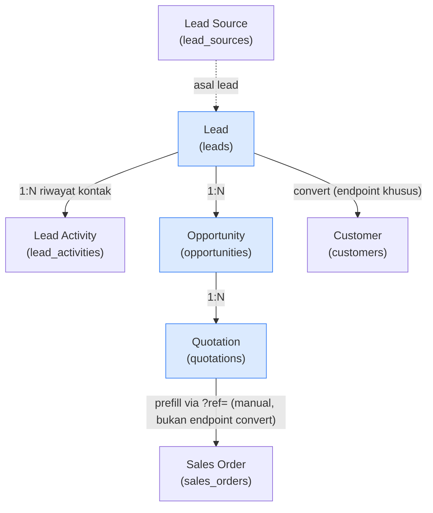
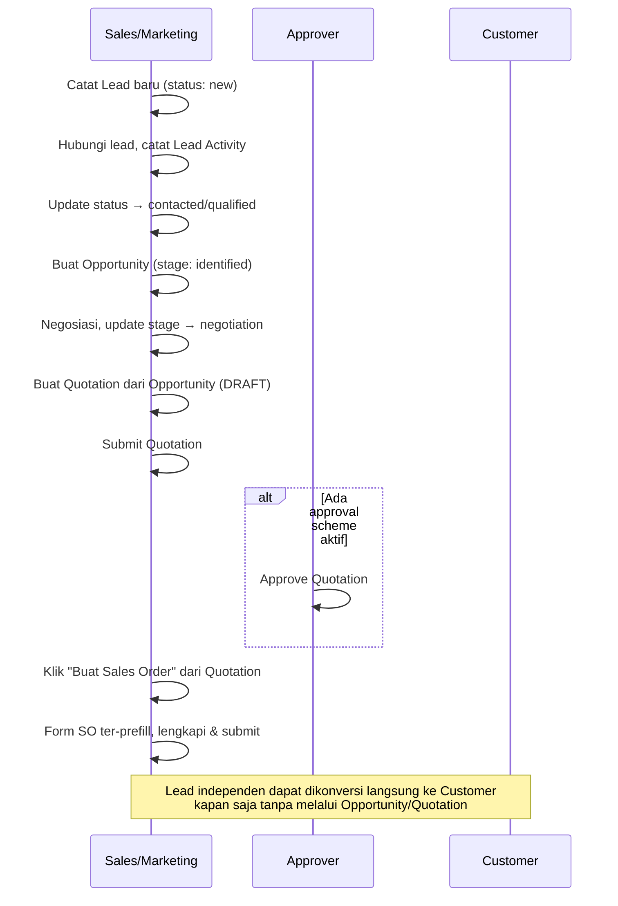

# Modul CRM

> Dokumentasi modul manajemen prospek penjualan (pre-sales): Lead, Opportunity, Quotation.

## Daftar Isi

- [Gambaran Modul](#gambaran-modul)
- [Korelasi Antar-Feature](#korelasi-antar-feature)
- [Lead](#lead)
- [Lead Activity](#lead-activity)
- [Lead Source](#lead-source)
- [Opportunity](#opportunity)
- [Quotation](#quotation)
- [Business Flow End-to-End](#business-flow-end-to-end)

---

## Gambaran Modul

Modul CRM menangani tahap **sebelum** penjualan resmi terjadi: menangkap calon pelanggan (Lead), menilai peluang bisnisnya (Opportunity), lalu menyusun penawaran harga (Quotation) yang bisa dilanjutkan menjadi Sales Order.

**Model utama:**

| Model | Tabel | Submitable |
|---|---|---|
| `Lead` | `leads` | Tidak |
| `LeadActivity` | `lead_activities` | Tidak |
| `LeadSource` | `lead_sources` | Tidak |
| `Opportunity` | `opportunities` | Tidak |
| `Quotation` | `quotations` | **Ya** |
| `QuotationItem` | `quotation_items` | — |

> Perhatikan: hanya **Quotation** yang memakai trait [`Submitable`](core.md#trait-submitable) (workflow DRAFT → SUBMITTED → APPROVED seperti dokumen bisnis lain). Lead dan Opportunity adalah data pipeline sederhana dengan `status`/`stage` bebas — **tidak** melalui alur approval.

**Services:** `LeadService`, `OpportunityService`, `QuotationService`

---

## Korelasi Antar-Feature

Alur CRM bersifat **linier dan opsional di tiap tahap** — Quotation bisa dibuat langsung tanpa Lead/Opportunity (field `lead_id`/`opportunity_id` semuanya nullable).

| Dari | Ke | Mekanisme | Catatan |
|---|---|---|---|
| Lead | Customer | `PUT /leads/{lead}/convert` → `LeadService::convertToCustomer()` | Endpoint konversi eksplisit — membuat `Customer` baru dari data Lead dan mencatat `converted_customer_id` + `converted_at` di Lead |
| Lead | Opportunity | `opportunities.lead_id` (nullable) | Satu Lead bisa punya banyak Opportunity |
| Opportunity | Quotation | `quotations.opportunity_id` (nullable) | Satu Opportunity bisa punya banyak Quotation |
| Quotation | Sales Order | Tombol **"Buat Sales Order"** (muncul saat status `submitted`) → redirect `salesOrders.create?ref=quotation/{id}` | **Bukan** endpoint convert seperti Lead — ini prefill form SO dari data Quotation, memakai mekanisme `{ref}` yang sama seperti Lead→Opportunity→Quotation (`create(Request $request, ?string $ref)` di controller masing-masing). SO yang terbentuk adalah dokumen baru dan independen, tidak otomatis tertaut balik ke Quotation. |

> Related: [Sales · Sales Order](sales.md#sales-order), [Sales · Customer](sales.md#customer).

---

## Lead

Lead adalah calon pelanggan yang belum tentu jadi transaksi — data kontak awal + status pipeline.

### Fields

| Field | Tipe | Deskripsi |
|---|---|---|
| `company_name` | string | Nama perusahaan (wajib, min. 3 karakter) |
| `contact_name` | string | Nama kontak person |
| `email` | string | Email kontak |
| `phone` | string | Telepon kontak |
| `lead_source` | relation | Sumber lead (lihat [Lead Source](#lead-source)) |
| `status` | enum | Lihat tabel status di bawah |
| `notes` | text | Catatan bebas |
| `assigned_to` | relation | User penanggung jawab lead |
| `street`, `city`, `province`, `zip_code` | string | Alamat |
| `country` | relation | Negara |
| `converted_customer` | relation | Customer hasil konversi (terisi otomatis) |
| `converted_at` | datetime | Waktu konversi (terisi otomatis) |
| `activities` | hasMany | Riwayat kontak — lihat [Lead Activity](#lead-activity) |
| `opportunities` | hasMany | Opportunity yang berasal dari lead ini |

### Status (`status`)

| Value | Label UI |
|---|---|
| `new` | Baru |
| `contacted` | Dihubungi |
| `qualified` | Qualified |
| `unqualified` | Tidak Qualified |
| `converted` | Terkonversi |

> Status ini **bukan** `FormStatus` seperti dokumen submitable — murni string bebas tanpa alur approval. Perubahan status dilakukan manual oleh user, kecuali `converted` yang biasanya mengikuti aksi convert ke Customer (tidak di-set otomatis oleh sistem — user tetap perlu mengubahnya manual bila ingin konsisten).

### Business Logic — Convert ke Customer

1. User membuka Lead, klik **"Konversi ke Customer"**.
2. `PUT /leads/{lead}/convert` dipanggil → `LeadController@convert` → `LeadService::convertToCustomer()`.
3. Service membuat record `Customer` baru dari data Lead (nama, kontak, alamat).
4. Lead di-update: `converted_customer_id` diisi ID Customer baru, `converted_at` diisi waktu sekarang.
5. Aktivitas ini tercatat di activity log (`logForUpdated()`).

> Lead yang sudah dikonversi tetap ada sebagai record historis — tidak dihapus, cukup ditandai lewat `converted_customer_id`.

### Routes — Lead

`CRM\LeadController` — 12 route dasar `leads.*` ([macro `resourceDetail`](../routes.md#konvensi-macro-routeresourcedetail), non-submitable) → prefix `/leads`, + tambahan:

| Method | URI | Route Name | Controller@method |
|---|---|---|---|
| PUT | `/leads/{lead}/convert` | `leads.convert` | `LeadController@convert` |

---

## Lead Activity

Riwayat kontak/interaksi dengan Lead (telepon, email, meeting, tugas) — dikelola sebagai baris nested di dalam form Lead (bukan halaman terpisah).

### Fields

| Field | Tipe | Deskripsi |
|---|---|---|
| `lead` | relation | Lead induk |
| `type` | enum | `task`, `call`, `meeting`, `email` |
| `subject` | string | Judul aktivitas (wajib) |
| `description` | text | Detail aktivitas |
| `scheduled_at` | datetime | Waktu terjadwal |
| `status` | enum | `open` / `closed` |
| `assigned_to` | relation | User penanggung jawab aktivitas |

> Aktivitas diurutkan berdasarkan `scheduled_at` saat ditampilkan (`activities()` relation di-`orderBy('scheduled_at')`).

---

## Lead Source

Master data sumber lead (mis. Website, Referral, Pameran, Cold Call). Model lookup sederhana — **primary key bisnisnya adalah `code`**, bukan ULID biasa (`leads.lead_source_id` mereferensikan `lead_sources.code`).

### Routes — Lead Source

`CRM\LeadSourceController` — 12 route dasar `leadSources.*` (macro `resourceDetail`, non-submitable).

---

## Opportunity

Opportunity merepresentasikan peluang bisnis konkret yang sedang dinegosiasikan — bisa berasal dari Lead, atau langsung dari Customer existing (`lead_id` dan `customer_id` sama-sama nullable, minimal salah satu diisi sesuai konteks bisnis).

### Fields

| Field | Tipe | Deskripsi |
|---|---|---|
| `title` | string | Judul peluang (wajib, min. 3 karakter) |
| `lead` | relation | Lead asal (opsional) |
| `customer` | relation | Customer terkait (opsional — untuk repeat business) |
| `stage` | enum | Lihat tabel tahap di bawah |
| `expected_value` | double | Estimasi nilai transaksi |
| `probability` | tinyint (0-100) | Persentase probabilitas closing |
| `expected_close_date` | date | Estimasi tanggal closing |
| `assigned_to` | relation | User penanggung jawab |
| `notes` | text | Catatan bebas |

### Tahap (`stage`)

| Value | Label UI |
|---|---|
| `identified` | Teridentifikasi |
| `qualified` | Qualified |
| `negotiation` | Negosiasi |
| `won` | Menang |
| `lost` | Kalah |

> Sama seperti `Lead.status`, `stage` adalah string bebas tanpa alur approval — perubahan tahap murni manual oleh user berdasarkan progres negosiasi riil.

### Routes — Opportunity

`CRM\OpportunityController` — 12 route dasar `opportunities.*` (macro `resourceDetail`, non-submitable) → prefix `/opportunities`.

---

## Quotation

Quotation (penawaran harga) adalah **satu-satunya dokumen Submitable** di modul CRM — mengikuti alur DRAFT → SUBMITTED → APPROVED seperti dokumen bisnis lain (lihat [Auth · Workflow Dokumen](../auth.md#workflow-dokumen)).

### Fields

| Field | Tipe | Deskripsi |
|---|---|---|
| `code` | string | Kode Quotation (auto: FormatingSeries) |
| `referenceable` | morphTo | Dokumen sumber (opsional, nullable) |
| `opportunity` | relation | Opportunity asal (opsional) |
| `customer` | relation | Customer tujuan penawaran (wajib) |
| `date` | datetime | Tanggal quotation |
| `valid_until` | date | Batas berlaku penawaran (harus ≥ `date`) |
| `amount` | double | Total nilai quotation |
| `status` | json | Status workflow (multi-status, seperti dokumen submitable lain) |
| `items` | hasMany | Baris item — lihat [QuotationItem](#quotationitem) |

### Default Format Kode

`@[branch_code]/QTN-@[iiii]/@[yy]` → contoh: `HO/QTN-0001/25`

### QuotationItem

| Field | Tipe | Deskripsi |
|---|---|---|
| `item` | relation | → **`item_variants`** (bukan `Item` master — konsisten dengan pola SO/PO, lihat [Sales · Item & Variant](sales.md#item--variant)) |
| `description` | text | Deskripsi baris (opsional) |
| `quantity` | double | Jumlah (min. 0.01) |
| `price` | double | Harga satuan |
| `amount` | double | Total baris — **stored generated column** (`quantity * price`), tidak bisa diedit manual |

> **Catatan keamanan/UX**: harga (`price`, `amount`) pada baris Quotation hanya tampil di UI untuk user yang punya permission **Write/Create** di modul Quotation. User dengan akses read-only (mis. Approver, Auditor) tidak melihat kolom harga — ini bukan bug tampilan, melainkan pembatasan sengaja.

### Business Logic

- Submit Quotation mengikuti alur [Submitable](core.md#trait-submitable) standar — generate kode final, cek [ApprovalScheme](core.md#approval) jika ada, dan jika disetujui status menjadi siap ditindaklanjuti ke Sales Order.
- Quotation **tidak otomatis** membuat Sales Order. User harus klik tombol "Buat Sales Order" secara manual dari halaman detail Quotation (hanya muncul saat status `submitted`), yang akan membuka form SO baru dengan data ter-prefill dari Quotation.

### Routes — Quotation (submitable)

`CRM\QuotationController`, prefix `/quotations`. 12 route dasar + 6 submitable ([lihat pola lengkap](../routes.md#route-tambahan-issubmmitable-true)):

| Method | URI | Route Name | Controller@method |
|---|---|---|---|
| GET | `/quotations` | `quotations.index` | `QuotationController@index` |
| POST | `/quotations` | `quotations.store` | `QuotationController@store` |
| GET | `/quotations/create/{ref?}` | `quotations.create` | `QuotationController@create` |
| GET | `/quotations/create-print-template` | `quotations.createPrintTemplate` | `QuotationController@createPrintTemplate` |
| GET | `/quotations/{quotation}` | `quotations.show` | `QuotationController@show` |
| PUT | `/quotations/{quotation}/{level?}` | `quotations.update` | `QuotationController@update` |
| DELETE | `/quotations/{quotation}` | `quotations.destroy` | `QuotationController@destroy` |
| PUT | `/quotations/{quotation}/submit` | `quotations.submit` | `QuotationController@submit` |
| PUT | `/quotations/{quotation}/cancel` | `quotations.cancel` | `QuotationController@cancel` |
| PUT | `/quotations/{quotation}/amend` | `quotations.amend` | `QuotationController@amend` |
| GET | `/quotations/{quotation}/print/{printTemplate?}` | `quotations.print` | `QuotationController@print` |
| POST | `/quotations/{quotation}/comment` | `quotations.addComment` | `QuotationController@addComment` |
| DELETE | `/quotations/{quotation}/comment/{id}` | `quotations.removeComment` | `QuotationController@removeComment` |
| POST | `/quotations/{quotation}/tag` | `quotations.addTag` | `QuotationController@addTag` |
| DELETE | `/quotations/{quotation}/tag/{id}` | `quotations.removeTag` | `QuotationController@removeTag` |
| POST | `/quotations/{quotation}/file` | `quotations.addFile` | `QuotationController@addFile` |
| DELETE | `/quotations/{quotation}/file/{id}` | `quotations.removeFile` | `QuotationController@removeFile` |

### Frontend Pages

| Entitas | File |
|---|---|
| Lead | `Pages/CRM/Leads/` — `Index`, `Form`, `Show`, `LeadActivities`, `LeadLinkModel` |
| Opportunity | `Pages/CRM/Opportunities/` — `Index`, `Form`, `Show`, `OpportunityLinkModel` |
| Quotation | `Pages/CRM/Quotations/` — `Index`, `Form`, `Show`, `QuotationItems`, `QuotationLinkModel` |

Lihat juga [Frontend · CRM](../frontend.md#crm).

---

## Business Flow End-to-End

---

## Related Documents

| Topik | Dokumen |
|---|---|
| Quotation → Sales Order | [Sales · Sales Order](sales.md#sales-order) |
| Lead → Customer | [Sales · Customer](sales.md#customer) |
| Item line Quotation → ItemVariant | [Sales · Item & Variant](sales.md#item--variant) |
| Sistem approval (Quotation) | [Core · Approval](core.md#approval) |
| Workflow status dokumen submitable | [Auth · Workflow Dokumen](../auth.md#workflow-dokumen) |
| Penomoran kode Quotation | [Core · FormatingSeries](core.md#formatingseries-penomoran-dokumen) |
| Tabel database | [Database · Domain CRM](../database.md#domain-crm) |
| Daftar route + Controller@method | [Routes · CRM](../routes.md#15-crm) |
| Halaman React | [Frontend · CRM](../frontend.md#crm) |
