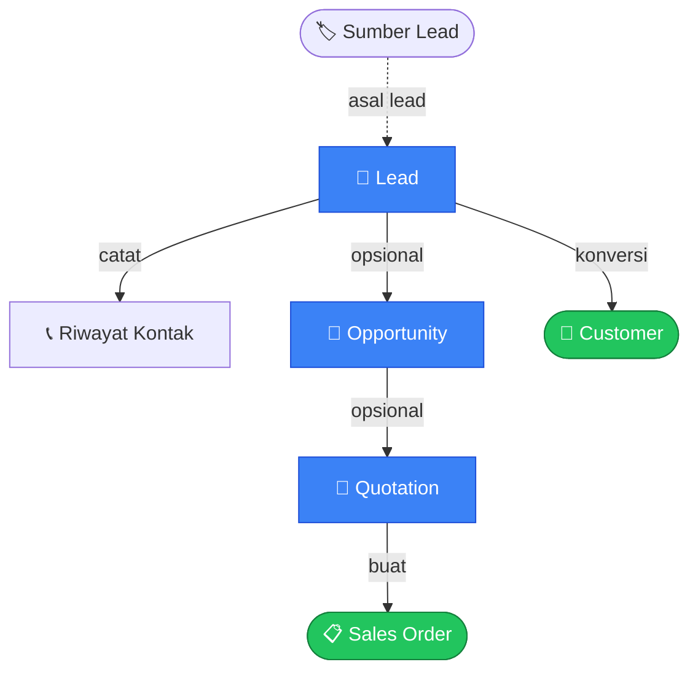
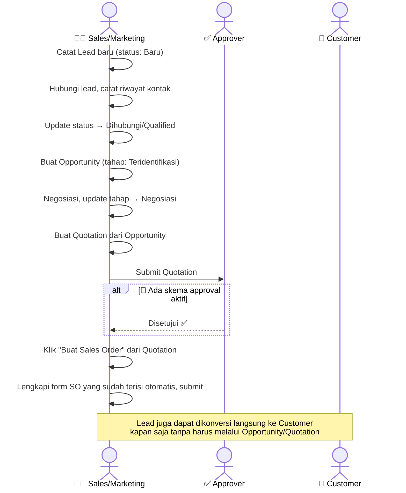

# Modul CRM

> Dokumentasi modul manajemen prospek penjualan (pre-sales): Lead, Opportunity, Quotation.

## Daftar Isi

- [Gambaran Modul](#gambaran-modul)
- [Korelasi Antar-Feature](#korelasi-antar-feature)
- [Lead](#lead)
- [Lead Activity](#lead-activity)
- [Lead Source](#lead-source)
- [Opportunity](#opportunity)
- [Quotation](#quotation)
- [Business Flow End-to-End](#business-flow-end-to-end)

---

## Gambaran Modul

Modul CRM menangani tahap **sebelum** penjualan resmi terjadi: menangkap calon pelanggan (Lead), menilai peluang bisnisnya (Opportunity), lalu menyusun penawaran harga (Quotation) yang bisa dilanjutkan menjadi Sales Order.

> Hanya **Quotation** yang melalui alur persetujuan berjenjang seperti dokumen bisnis lainnya. Lead dan Opportunity adalah data pipeline sederhana — statusnya diubah manual oleh user, **tidak** melalui alur approval.

---

## Korelasi Antar-Feature

Alur CRM bersifat **fleksibel di tiap tahap** — Quotation bisa dibuat langsung tanpa Lead/Opportunity terlebih dahulu.

| Dari | Ke | Cara |
|---|---|---|
| Lead | Customer | Tombol **"Konversi ke Customer"** — membuat Customer baru dari data Lead |
| Lead | Opportunity | Pilih Lead saat membuat Opportunity (opsional) — satu Lead bisa punya banyak Opportunity |
| Opportunity | Quotation | Pilih Opportunity saat membuat Quotation (opsional) — satu Opportunity bisa punya banyak Quotation |
| Quotation | Sales Order | Tombol **"Buat Sales Order"** (muncul setelah Quotation disubmit) |

> **Catatan tentang tombol "Buat Sales Order"**: ini **bukan** konversi otomatis, melainkan membuka form Sales Order baru dengan data yang sudah terisi otomatis dari Quotation. SO yang terbentuk adalah dokumen terpisah dan mandiri.

> Related: [Sales · Sales Order](sales.md#sales-order), [Sales · Customer](sales.md#customer).

---

## Lead

Lead adalah calon pelanggan yang belum tentu jadi transaksi — data kontak awal beserta status pipeline-nya.

### Fields

| Field | Deskripsi |
|---|---|
| Nama Perusahaan | Wajib diisi |
| Nama Kontak | Nama orang yang dihubungi |
| Email, Telepon | Kontak |
| Sumber Lead | Dari mana lead ini berasal (lihat [Lead Source](#lead-source)) |
| Status | Lihat tabel status di bawah |
| Catatan | Catatan bebas |
| Ditugaskan Kepada | User penanggung jawab lead |
| Alamat | Jalan, kota, provinsi, kode pos |
| Negara | Negara asal lead |
| Dikonversi Menjadi | Customer hasil konversi (terisi otomatis) |
| Waktu Konversi | Kapan lead dikonversi (terisi otomatis) |

### Status

| Value | Label |
|---|---|
| `new` | Baru |
| `contacted` | Dihubungi |
| `qualified` | Qualified |
| `unqualified` | Tidak Qualified |
| `converted` | Terkonversi |

> Status ini murni pipeline manual — user yang mengatur perpindahannya sendiri, tidak ada alur persetujuan otomatis.

### Cara Konversi ke Customer

1. Buka Lead, klik **"Konversi ke Customer"**.
2. Sistem membuat Customer baru dari data Lead (nama, kontak, alamat).
3. Lead ditandai sudah dikonversi — tercatat jadi Customer mana dan kapan waktunya.

> Lead yang sudah dikonversi tetap tersimpan sebagai catatan historis — tidak dihapus, cukup ditandai sudah terkonversi.

---

## Lead Activity

Riwayat kontak/interaksi dengan Lead (telepon, email, meeting, tugas) — dikelola langsung di dalam form Lead.

### Fields

| Field | Deskripsi |
|---|---|
| Tipe | Tugas, Telepon, Meeting, atau Email |
| Judul | Judul aktivitas (wajib) |
| Deskripsi | Detail aktivitas |
| Waktu Terjadwal | Kapan aktivitas dijadwalkan |
| Status | Terbuka atau Selesai |
| Ditugaskan Kepada | User penanggung jawab aktivitas |

---

## Lead Source

Master data sumber lead (mis. Website, Referral, Pameran, Cold Call).

---

## Opportunity

Opportunity merepresentasikan peluang bisnis konkret yang sedang dinegosiasikan — bisa berasal dari Lead, atau langsung dari Customer yang sudah ada.

### Fields

| Field | Deskripsi |
|---|---|
| Judul | Judul peluang (wajib) |
| Lead Asal | Lead sumber peluang ini (opsional) |
| Customer | Customer terkait, untuk repeat business (opsional) |
| Tahap | Lihat tabel tahap di bawah |
| Estimasi Nilai | Perkiraan nilai transaksi |
| Probabilitas | Persentase kemungkinan closing (0-100) |
| Estimasi Tanggal Closing | Perkiraan kapan closing terjadi |
| Ditugaskan Kepada | User penanggung jawab |
| Catatan | Catatan bebas |

### Tahap

| Value | Label |
|---|---|
| `identified` | Teridentifikasi |
| `qualified` | Qualified |
| `negotiation` | Negosiasi |
| `won` | Menang |
| `lost` | Kalah |

> Sama seperti status Lead, tahap ini murni diatur manual oleh user berdasarkan progres negosiasi riil — bukan alur persetujuan otomatis.

---

## Quotation

Quotation (penawaran harga) adalah **satu-satunya dokumen di modul CRM** yang melalui alur persetujuan berjenjang seperti dokumen bisnis lainnya.

### Fields

| Field | Deskripsi |
|---|---|
| Kode | Kode Quotation (dibuat otomatis, contoh format: `HO/QTN-0001/25`) |
| Opportunity Asal | Opportunity yang menjadi dasar penawaran (opsional) |
| Customer | Customer tujuan penawaran (wajib) |
| Tanggal | Tanggal quotation dibuat |
| Berlaku Hingga | Batas waktu berlakunya penawaran |
| Total | Total nilai quotation |
| Baris Item | Lihat [Baris Item Quotation](#quotation) |

### Baris Item Quotation

| Field | Deskripsi |
|---|---|
| Item (Variant) | Barang yang ditawarkan |
| Deskripsi | Deskripsi baris (opsional) |
| Jumlah | Jumlah barang |
| Harga Satuan | Harga per unit |
| Total Baris | Jumlah × harga satuan (dihitung otomatis) |

> **Catatan**: harga dan total baris pada Quotation hanya tampil untuk user yang punya izin **mengubah/membuat** Quotation. User dengan akses lihat-saja (mis. Approver, Auditor) tidak melihat kolom harga — ini sengaja dibatasi untuk kerahasiaan harga.

### Business Logic

- Submit Quotation mengikuti alur approval standar — kode final dibuat, sistem mengecek skema approval jika ada, dan jika disetujui, Quotation siap ditindaklanjuti ke Sales Order.
- Quotation **tidak otomatis** membuat Sales Order. User harus klik tombol "Buat Sales Order" secara manual dari halaman detail Quotation (hanya muncul setelah Quotation disubmit).

---

## Business Flow End-to-End

---

## Related Documents

| Topik | Dokumen |
|---|---|
| Quotation → Sales Order | [Sales · Sales Order](sales.md#sales-order) |
| Lead → Customer | [Sales · Customer](sales.md#customer) |
| Sistem approval (Quotation) | [Core · Approval](core.md#approval) |
| Penomoran kode Quotation | [Core · FormatingSeries](core.md#formatingseries-penomoran-dokumen) |
