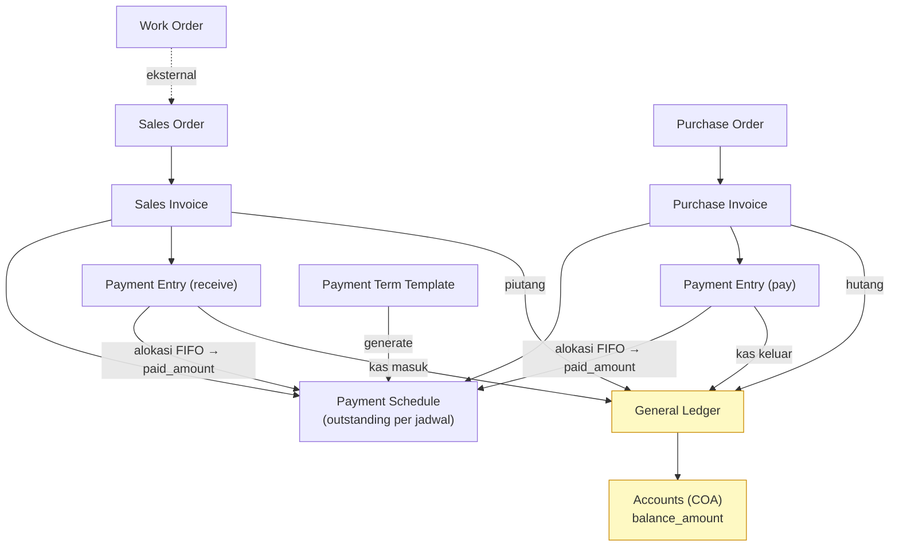
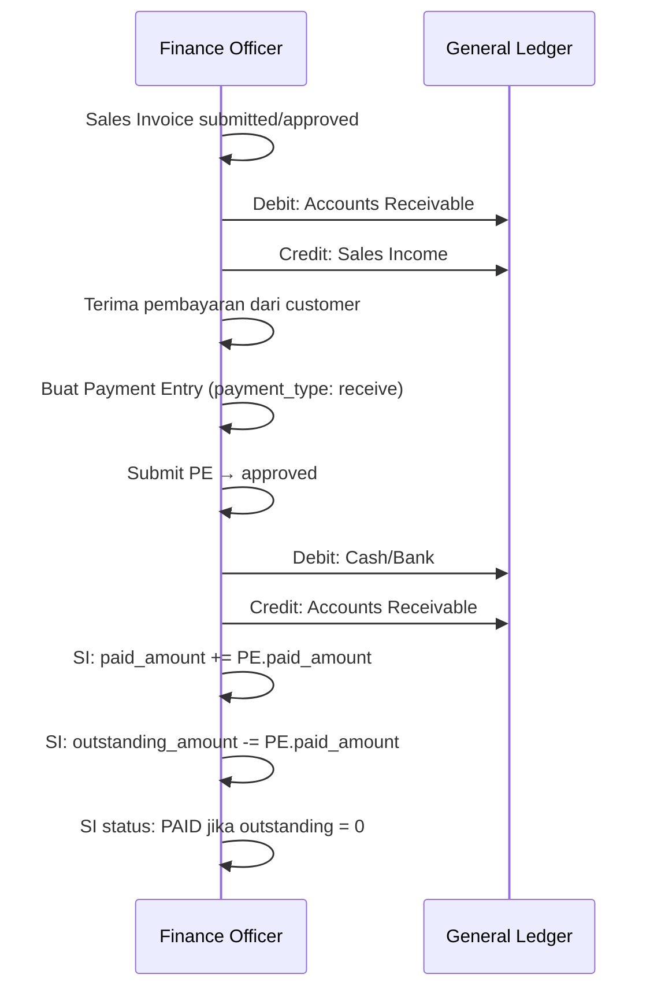
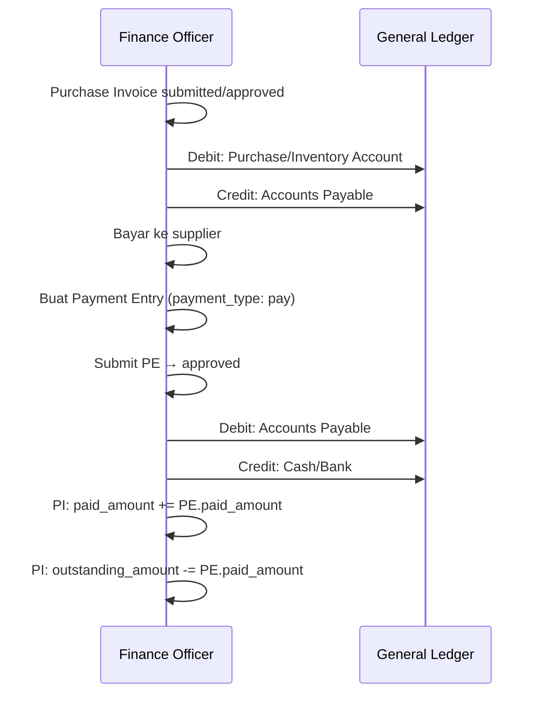

# Modul Finances

> Dokumentasi modul keuangan: Accounts, General Ledger, Invoices, Payment Entries, Taxes.

## Daftar Isi

- [Gambaran Modul](#gambaran-modul)
- [Korelasi Antar-Feature](#korelasi-antar-feature)
- [Chart of Accounts](#chart-of-accounts)
- [General Ledger](#general-ledger)
- [Sales Invoice](#sales-invoice)
- [Purchase Invoice](#purchase-invoice)
- [Payment Entry](#payment-entry)
- [Payment Methods & Terms](#payment-methods--terms)
- [Taxes](#taxes)
- [Business Flow Keuangan](#business-flow-keuangan)

---

## Gambaran Modul

Modul Finances mengelola semua aspek keuangan: buku besar, tagihan, pembayaran, dan akuntansi.

**Model utama:**

| Model | Tabel | Submitable |
|---|---|---|
| `Account` | `accounts` | Tidak |
| `GeneralLedger` | `general_ledgers` | Tidak |
| `SalesInvoice` | `sales_invoices` | Ya |
| `SalesInvoiceItem` | `sales_invoice_items` | — |
| `PurchaseInvoice` | `purchase_invoices` | Ya |
| `PurchaseInvoiceItem` | `purchase_invoice_items` | — |
| `PaymentEntry` | `payment_entries` | Ya |
| `PaymentMethod` | `payment_methods` | Tidak |
| `PaymentSchedule` | `payment_schedules` | Tidak |
| `PaymentTermTemplate` | `payment_term_templates` | Tidak |
| `Tax` | `taxes` | Tidak |
| `AdditionalCost` | `additional_costs` | — |

**Services:** `SalesInvoiceService`, `PurchaseInvoiceService`, `PaymentEntryService`, `PaymentTermTemplateService`

---

## Korelasi Antar-Feature

Modul Finances adalah **muara akuntansi**: setiap invoice & payment yang di-submit menghasilkan entri di **`general_ledgers`** (double-entry). Invoice berasal dari dokumen operasional: Sales Invoice dari [SO](sales.md), Purchase Invoice dari [PO](purchase.md). Work Order menagih lewat SO (WO → SO → SI), bukan langsung.



| Dari | Ke | Penghubung | Efek |
|---|---|---|---|
| [SO](sales.md) | Sales Invoice | `sales_order_id` | Debit Piutang / Credit Pendapatan di GL |
| [PO](purchase.md) | Purchase Invoice | `purchase_order_id` | Debit Persediaan/Beban / Credit Hutang di GL |
| Invoice | Payment Entry | `paymentable_*` | Update `paid_amount`/`outstanding_amount` invoice + GL kas |
| **Payment Entry** | **Payment Schedule** | `paymentable.paymentSchedules` | **Alokasi FIFO** ke `paid_amount` tiap jadwal → `outstanding_amount` jadwal turun |
| Payment Term Template | Payment Schedule | `payment_scheduleable_*` | Jadwal jatuh tempo invoice |
| Semua submit | General Ledger | `referenceable_*` | Saldo `accounts` (COA) ter-update |

> Korelasi operasional: [Sales](sales.md#korelasi-antar-feature) · [Purchase](purchase.md#korelasi-antar-feature).

---

## Chart of Accounts

Akun keuangan dengan struktur hierarki (TreeView trait). Merupakan dasar dari sistem double-entry accounting.

### Fields

| Field | Tipe | Deskripsi |
|---|---|---|
| `account_name` | string | Nama akun |
| `account_number` | string | Nomor akun |
| `is_group` | boolean | Apakah akun grup |
| `root_type` | string | Asset, Liability, Equity, Income, Expense |
| `report_type` | string | Tipe laporan |
| `balance_type` | string | Debit / Credit |
| `account_type` | string | Tipe detail (receivable, payable, bank, dll.) |
| `tax_rate` | double | Rate pajak (untuk akun pajak) |
| `balance_amount` | double | Saldo saat ini |
| `is_contra` | boolean | Akun contra |
| `currency_code` | FK | Mata uang default |
| `parent_id`, `lft`, `rgt`, `depth` | — | Hierarki TreeView |

**Routes — Account** (`Finances\AccountController`): 12 route dasar `accounts.*` ([macro](../routes.md#konvensi-macro-routeresourcedetail)) → prefix `/accounts`. Pola: `index`, `store`, `create`, `show`, `update`, `destroy`, `addComment`/`removeComment`, `addTag`/`removeTag`, `addFile`/`removeFile` — semua → `AccountController@<method>`.

---

## General Ledger

Buku besar otomatis yang dibuat saat dokumen keuangan di-submit.

### Fields

| Field | Tipe | Deskripsi |
|---|---|---|
| `referenceable_type/id` | polymorphic | Dokumen sumber |
| `account_id` | FK | Akun utama |
| `against_account_id` | FK | Akun lawan |
| `branch_id` | FK | Branch |
| `partyable_type/id` | polymorphic | Customer atau Supplier |
| `debit` | double | Nilai debit |
| `credit` | double | Nilai kredit |
| `description` | text | Keterangan |
| `code` | string | Kode referensi |

**Read-only** — tidak ada manual entry (meski macro generate route CRUD).

**Routes — GeneralLedger** (`Finances\GeneralLedgerController`): 12 route dasar `generalLedgers.*` → prefix `/generalLedgers`. Dalam praktik hanya `index` dipakai.

---

## Sales Invoice

Tagihan ke customer. Dibuat dari Sales Order setelah barang dikirim atau bersamaan.

### Fields Utama

| Field | Tipe | Deskripsi |
|---|---|---|
| `code` | string | Kode SI |
| `date` | datetime | Tanggal invoice |
| `customer` | relation | Customer |
| `customer_branch` | relation | Cabang customer |
| `sales_order` | relation | SO yang ditagih |
| `debit_account` | relation | Akun piutang dagang |
| `income_account` | relation | Akun pendapatan |
| `amount` | double | Total invoice |
| `paid_amount` | double | Sudah dibayar |
| `outstanding_amount` | double | Sisa tagihan |
| `discount_on/rate/amount` | — | Diskon |
| `currency_code` / `exchange_rate` | — | Multi-currency |
| `items` | hasMany | Line items |
| `return_against` | relation | SI yang di-return |

### SI Item Fields

| Field | Tipe | Deskripsi |
|---|---|---|
| `sales_order_item_id` | FK | Link ke [SO item](sales.md#sales-order) |
| `item_id` | FK | → **`item_variants`** ([Item & Variant](inventory.md#item--variant)) |
| `quantity` | double | Jumlah ditagih |
| `price` | double | Harga satuan |
| `tax_rate` | double | Rate pajak ([Tax](#taxes)) — opsional, baris tanpa pajak valid |
| `basic_amount` | double | Subtotal sebelum pajak (`quantity × price`) |
| `dpp_amount` | double | **Stored generated column**: `basic_amount × 11 / 12` — Dasar Pengenaan Pajak (lihat catatan DPP di bawah) |
| `tax_amount` | double | **Stored generated column**: `dpp_amount × tax_rate / 100` (dihitung dari `dpp_amount`, bukan langsung dari `basic_amount`) |

> **Catatan DPP (Dasar Pengenaan Pajak)**: `dpp_amount` dan `tax_amount` adalah kolom *generated* di database — nilainya dihitung otomatis oleh MySQL berdasarkan `basic_amount` dan `tax_rate`, **tidak bisa di-UPDATE manual**. Formula `× 11/12` merefleksikan aturan **DPP Nilai Lain PPN Indonesia** — DPP dihitung sebagai 11/12 dari nilai transaksi (`basic_amount`), bukan nilai transaksi itu sendiri, sebelum dikalikan tarif pajak. Jika butuh mengubah `tax_amount`, ubah `basic_amount` atau `tax_rate` pada baris terkait — nilai akhir akan menyesuaikan otomatis.
>
> **Tax opsional**: sejak validasi form SO/SI diperbarui, baris item **valid tanpa memilih pajak** — jika `tax_rate` kosong/0, `dpp_amount` dan `tax_amount` bernilai 0. Ini perubahan validasi form (`SalesOrderRequest`), bukan perubahan skema database (`tax_id` sudah nullable sejak awal).

### Submit Flow SI

Saat SI di-submit dan di-approve:
1. `GeneralLedger` entry dibuat: debit piutang dagang, credit pendapatan
2. SO item `billed_quantity` di-update
3. SO status di-recalculate

### Status Workflow SI

DRAFT → SUBMITTED → NEED_APPROVAL → APPROVED (piutang masuk GL)
- outstanding_amount berkurang setiap Payment Entry ditambahkan
- status: UNPAID → PARTIALLY_PAID → PAID

### Routes — Sales Invoice (submitable)

`Finances\SalesInvoiceController`, prefix `/salesInvoices`. 12 route dasar + 6 submitable:

| Method | URI | Route Name | Controller@method |
|---|---|---|---|
| GET | `/salesInvoices` | `salesInvoices.index` | `SalesInvoiceController@index` |
| POST | `/salesInvoices` | `salesInvoices.store` | `SalesInvoiceController@store` |
| GET | `/salesInvoices/create/{ref?}` | `salesInvoices.create` | `SalesInvoiceController@create` |
| GET | `/salesInvoices/create-print-template` | `salesInvoices.createPrintTemplate` | `SalesInvoiceController@createPrintTemplate` |
| GET | `/salesInvoices/{salesInvoice}` | `salesInvoices.show` | `SalesInvoiceController@show` |
| PUT | `/salesInvoices/{salesInvoice}/{level?}` | `salesInvoices.update` | `SalesInvoiceController@update` |
| DELETE | `/salesInvoices/{salesInvoice}` | `salesInvoices.destroy` | `SalesInvoiceController@destroy` |
| PUT | `/salesInvoices/{salesInvoice}/submit` | `salesInvoices.submit` | `SalesInvoiceController@submit` |
| PUT | `/salesInvoices/{salesInvoice}/cancel` | `salesInvoices.cancel` | `SalesInvoiceController@cancel` |
| PUT | `/salesInvoices/{salesInvoice}/amend` | `salesInvoices.amend` | `SalesInvoiceController@amend` |
| GET | `/salesInvoices/{salesInvoice}/print/{printTemplate?}` | `salesInvoices.print` | `SalesInvoiceController@print` |
| POST/DELETE | `/salesInvoices/{salesInvoice}/comment[/{id}]` | `salesInvoices.addComment` / `removeComment` | `@addComment` / `@removeComment` |
| POST/DELETE | `/salesInvoices/{salesInvoice}/tag[/{id}]` | `salesInvoices.addTag` / `removeTag` | `@addTag` / `@removeTag` |
| POST/DELETE | `/salesInvoices/{salesInvoice}/file[/{id}]` | `salesInvoices.addFile` / `removeFile` | `@addFile` / `@removeFile` |

---

## Purchase Invoice

Tagihan dari supplier. Dibuat dari Purchase Order setelah barang diterima atau bersamaan.

### Fields Utama

| Field | Tipe | Deskripsi |
|---|---|---|
| `code` | string | Kode PI |
| `supplier` | relation | Supplier |
| `purchase_order` | relation | PO yang ditagih |
| `credit_account` | relation | Akun hutang dagang |
| `expanse_head_account` | relation | Akun beban/persediaan |
| `amount` | double | Total invoice |
| `paid_amount` | double | Sudah dibayar |
| `outstanding_amount` | double | Sisa hutang |

### PI Item Fields

| Field | Tipe | Deskripsi |
|---|---|---|
| `purchase_order_item_id` | FK | Link ke [PO item](purchase.md#purchase-order) |
| `item_id` | FK | → **`item_variants`** ([Item & Variant](inventory.md#item--variant)) |
| `quantity` | double | Jumlah ditagih |
| `rate` | double | Harga satuan |
| `tax_rate` | double | Rate pajak ([Tax](#taxes)) — opsional |
| `basic_amount` | double | Subtotal sebelum pajak (`quantity × rate`) — **stored generated column** |
| `dpp_amount` | double | **Stored generated column**: `basic_amount × 11 / 12` — sama seperti [DPP di Sales Invoice](#si-item-fields) |
| `tax_amount` | double | **Stored generated column**: `dpp_amount × tax_rate / 100` |
| `amount` | double | **Stored generated column**: `basic_amount + tax_amount` — total baris |

> Formula dan sifat *generated column* identik dengan Sales Invoice — lihat catatan DPP di [SI Item Fields](#si-item-fields) untuk penjelasan lengkap.

### Submit Flow PI

Saat PI di-submit dan di-approve:
1. `GeneralLedger` entry: debit beban/persediaan, credit hutang dagang
2. PO item `billed_quantity` di-update
3. PO status di-recalculate

### Routes — Purchase Invoice (submitable)

`Finances\PurchaseInvoiceController`, prefix `/purchaseInvoices`. 12 route dasar + 6 submitable:

| Method | URI | Route Name | Controller@method |
|---|---|---|---|
| GET | `/purchaseInvoices` | `purchaseInvoices.index` | `PurchaseInvoiceController@index` |
| POST | `/purchaseInvoices` | `purchaseInvoices.store` | `PurchaseInvoiceController@store` |
| GET | `/purchaseInvoices/create/{ref?}` | `purchaseInvoices.create` | `PurchaseInvoiceController@create` |
| GET | `/purchaseInvoices/create-print-template` | `purchaseInvoices.createPrintTemplate` | `PurchaseInvoiceController@createPrintTemplate` |
| GET | `/purchaseInvoices/{purchaseInvoice}` | `purchaseInvoices.show` | `PurchaseInvoiceController@show` |
| PUT | `/purchaseInvoices/{purchaseInvoice}/{level?}` | `purchaseInvoices.update` | `PurchaseInvoiceController@update` |
| DELETE | `/purchaseInvoices/{purchaseInvoice}` | `purchaseInvoices.destroy` | `PurchaseInvoiceController@destroy` |
| PUT | `/purchaseInvoices/{purchaseInvoice}/submit` | `purchaseInvoices.submit` | `PurchaseInvoiceController@submit` |
| PUT | `/purchaseInvoices/{purchaseInvoice}/cancel` | `purchaseInvoices.cancel` | `PurchaseInvoiceController@cancel` |
| PUT | `/purchaseInvoices/{purchaseInvoice}/amend` | `purchaseInvoices.amend` | `PurchaseInvoiceController@amend` |
| GET | `/purchaseInvoices/{purchaseInvoice}/print/{printTemplate?}` | `purchaseInvoices.print` | `PurchaseInvoiceController@print` |
| POST/DELETE | `/purchaseInvoices/{purchaseInvoice}/comment[/{id}]` | `purchaseInvoices.addComment` / `removeComment` | `@addComment` / `@removeComment` |
| POST/DELETE | `/purchaseInvoices/{purchaseInvoice}/tag[/{id}]` | `purchaseInvoices.addTag` / `removeTag` | `@addTag` / `@removeTag` |
| POST/DELETE | `/purchaseInvoices/{purchaseInvoice}/file[/{id}]` | `purchaseInvoices.addFile` / `removeFile` | `@addFile` / `@removeFile` |

---

## Payment Entry

Transaksi pembayaran invoice (penerimaan dari customer atau pembayaran ke supplier).

### Fields Utama

| Field | Tipe | Deskripsi |
|---|---|---|
| `code` | string | Kode PE |
| `date` | datetime | Tanggal pembayaran |
| `payment_type` | string | `receive` (dari customer) / `pay` (ke supplier) |
| `party_type` | string | `customer` / `supplier` |
| `paymentable_type/id` | polymorphic | Invoice yang dibayar |
| `partyable_type/id` | polymorphic | Customer/Supplier |
| `paid_amount` | double | Nilai pembayaran |
| `exchange_rate` | double | Kurs |
| `account_paid_to` | relation | Akun penerima |
| `account_paid_from` | relation | Akun pengirim |
| `payment_method` | relation | Metode pembayaran |
| `notes` | text | Catatan |

### Submit Flow PE

Saat PE di-submit → `ModelConnection` ke invoice dibuat → cek approval. Saat **approved** (`PaymentEntryService::onApproved()`):

1. **Alokasi ke Payment Schedules (FIFO)** — `paid_amount` dialokasikan ke `paymentable.paymentSchedules` urut jatuh tempo: tiap schedule diisi sampai `outstanding_amount`-nya penuh, sisa lanjut ke schedule berikutnya.
   ```
   sisa = paymentEntry.paid_amount
   foreach schedule (urut due_date):
       if sisa >= schedule.outstanding_amount:
           schedule.paid_amount = schedule.outstanding_amount; sisa -= itu
       else:
           schedule.paid_amount = sisa; sisa = 0
   ```
2. **Invoice** `paid_amount` di-update → status:
   - lunas (`paid_amount >= amount`) → `PAID`
   - sebagian → `PARTIALLY_PAID`
3. **GeneralLedger** — 2 entri:
   - Receive: debit kas/bank (`account_paid_from`), credit piutang (`account_paid_to`)
   - Pay: debit hutang, credit kas/bank
4. PaymentEntry status → `PAID`.

> Jadi satu submit PE meng-update **tiga** entitas: [PaymentSchedule](#payment-schedules) (outstanding per jadwal), invoice (`paymentable`), dan [GeneralLedger](#general-ledger). Lihat diagram [Korelasi](#korelasi-antar-feature).

### Routes — Payment Entry (submitable)

`Finances\PaymentEntryController`, prefix `/paymentEntries`. 12 route dasar + 6 submitable:

| Method | URI | Route Name | Controller@method |
|---|---|---|---|
| GET | `/paymentEntries` | `paymentEntries.index` | `PaymentEntryController@index` |
| POST | `/paymentEntries` | `paymentEntries.store` | `PaymentEntryController@store` |
| GET | `/paymentEntries/create/{ref?}` | `paymentEntries.create` | `PaymentEntryController@create` |
| GET | `/paymentEntries/create-print-template` | `paymentEntries.createPrintTemplate` | `PaymentEntryController@createPrintTemplate` |
| GET | `/paymentEntries/{paymentEntry}` | `paymentEntries.show` | `PaymentEntryController@show` |
| PUT | `/paymentEntries/{paymentEntry}/{level?}` | `paymentEntries.update` | `PaymentEntryController@update` |
| DELETE | `/paymentEntries/{paymentEntry}` | `paymentEntries.destroy` | `PaymentEntryController@destroy` |
| PUT | `/paymentEntries/{paymentEntry}/submit` | `paymentEntries.submit` | `PaymentEntryController@submit` |
| PUT | `/paymentEntries/{paymentEntry}/cancel` | `paymentEntries.cancel` | `PaymentEntryController@cancel` |
| PUT | `/paymentEntries/{paymentEntry}/amend` | `paymentEntries.amend` | `PaymentEntryController@amend` |
| GET | `/paymentEntries/{paymentEntry}/print/{printTemplate?}` | `paymentEntries.print` | `PaymentEntryController@print` |
| POST/DELETE | `/paymentEntries/{paymentEntry}/comment[/{id}]` | `paymentEntries.addComment` / `removeComment` | `@addComment` / `@removeComment` |
| POST/DELETE | `/paymentEntries/{paymentEntry}/tag[/{id}]` | `paymentEntries.addTag` / `removeTag` | `@addTag` / `@removeTag` |
| POST/DELETE | `/paymentEntries/{paymentEntry}/file[/{id}]` | `paymentEntries.addFile` / `removeFile` | `@addFile` / `@removeFile` |

---

## Payment Methods & Terms

### Payment Methods

Metode pembayaran (transfer, tunai, kartu kredit, dll.) dengan akun default.

| Field | Tipe | Deskripsi |
|---|---|---|
| `name` | string | Nama metode |
| `description` | text | Deskripsi |
| `default_account` | relation | Akun kas/bank default |

**Routes — PaymentMethod** (`Finances\PaymentMethodController`): 12 route dasar `paymentMethods.*` ([macro](../routes.md#konvensi-macro-routeresourcedetail)) → prefix `/paymentMethods`.

### Payment Schedules

Jadwal pembayaran invoice (cicilan/termin). Auto-generated dari `payment_term_templates`. Relasi polymorphic `payment_scheduleable` ke invoice/order ([Model · PaymentSchedule](../models.md#item--pendukung)).

| Field | Tipe | Deskripsi |
|---|---|---|
| `payment_scheduleable_type/id` | polymorphic | Invoice (atau SO/PO) |
| `invoice_portion` | double | Persentase dari total invoice |
| `due_date` | datetime | Tanggal jatuh tempo |
| `payment_amount` | double | Nilai yang harus dibayar |
| `paid_amount` | double | Sudah dibayar |
| `outstanding_amount` | double | Sisa belum dibayar |
| `discount_type/discount/discount_date` | — | Early payment discount |

> **Diupdate oleh Payment Entry:** saat PE di-approve, `paid_amount` dialokasikan **FIFO** (urut `due_date`) ke schedule-schedule invoice — mengisi `paid_amount` tiap jadwal hingga `outstanding_amount`-nya nol sebelum lanjut ke jadwal berikutnya. Lihat [Submit Flow PE](#submit-flow-pe).

### Payment Term Templates

Template jadwal pembayaran yang bisa di-assign ke customer/supplier.

**Routes — PaymentTermTemplate** (`Finances\PaymentTermTemplateController`): 12 route dasar `paymentTermTemplates.*` → prefix `/paymentTermTemplates`.

---

## Taxes

Daftar pajak dengan rate yang digunakan di line items semua dokumen transaksi.

| Field | Tipe | Deskripsi |
|---|---|---|
| `name` | string | Nama pajak (PPN 11%, PPh 23%, dll.) |
| `rate` | double | Rate pajak (%) |

**Routes — Tax** (`Finances\TaxesController`): 12 route dasar `taxes.*` → prefix `/taxes`.

---

## Business Flow Keuangan

### Flow Pembayaran Piutang (Sales)



### Flow Pembayaran Hutang (Purchase)



---

## Frontend Pages

| Entitas | File |
|---|---|
| Account (COA) | `Pages/Finances/Accounts/` — `Index`, `Form`, `Show`, `AccountLinkModel` |
| General Ledger | `Pages/Finances/GeneralLedger.jsx` |
| Sales Invoice | `Pages/Finances/SalesInvoice/` — `Index`, `Show`, `ItemForm`, `SalesInvoiceLinkModel` |
| Purchase Invoice | `Pages/Finances/PurchaseInvoice/` — `Index`, `Show`, `ItemForm`, `PurchaseInvoiceLinkModel` |
| Payment Entry | `Pages/Finances/PaymentEntries/` — `Index`, `Show` |
| Payment Method | `Pages/Finances/PaymentMethods/` — `Index`, `Form`, `PaymentMethodLinkModel` |
| Payment Term Template | `Pages/Finances/PaymentTermTemplate/` — `Index`, `Form`, `PaymentTermTemplateLinkModel` |
| Tax | `Pages/Finances/Taxes/` — `Index`, `Form`, `TaxLinkModel` |

Lihat [Frontend · Finances](../frontend.md#finances) dan [Peta LinkModel](../frontend.md#peta-linkmodel-relasi-ui).

---

## Related Documents

| Topik | Dokumen |
|---|---|
| Sumber Sales Invoice | [Sales · Sales Order](sales.md#sales-order) |
| Sumber Purchase Invoice | [Purchase · Purchase Order](purchase.md#purchase-order) |
| Item line → ItemVariant | [Inventory · Item & Variant](inventory.md#item--variant) · [Database](../database.md#item--itemvariant) |
| Approval invoice & payment | [Core · Approval](core.md#approval) · [Auth · Workflow](../auth.md#workflow-dokumen) |
| Tabel database | [Database · Domain Finances](../database.md#domain-finances) |
| Daftar route + Controller@method | [Routes · Finances](../routes.md#14-finances) |
| Halaman React | [Frontend · Finances](../frontend.md#finances) |
