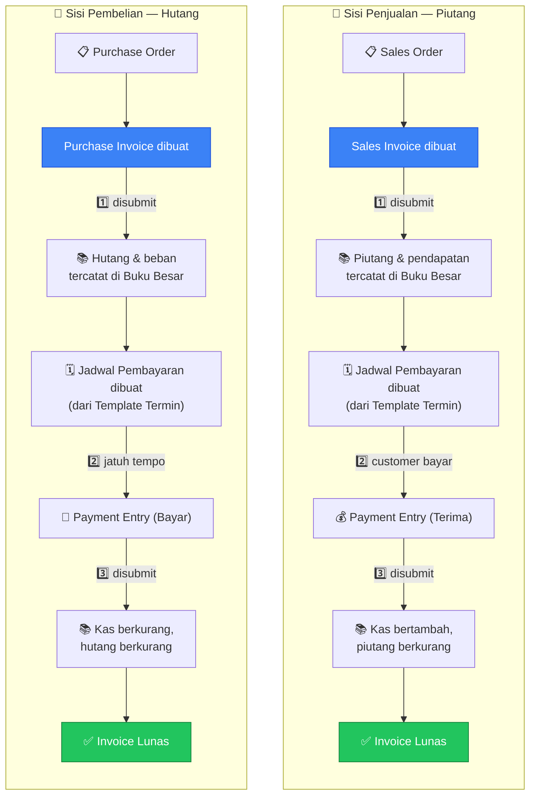
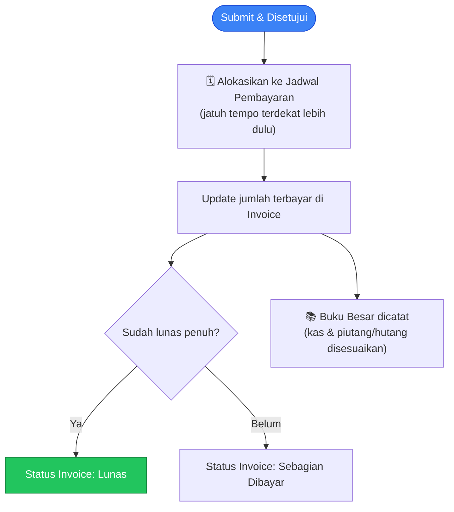
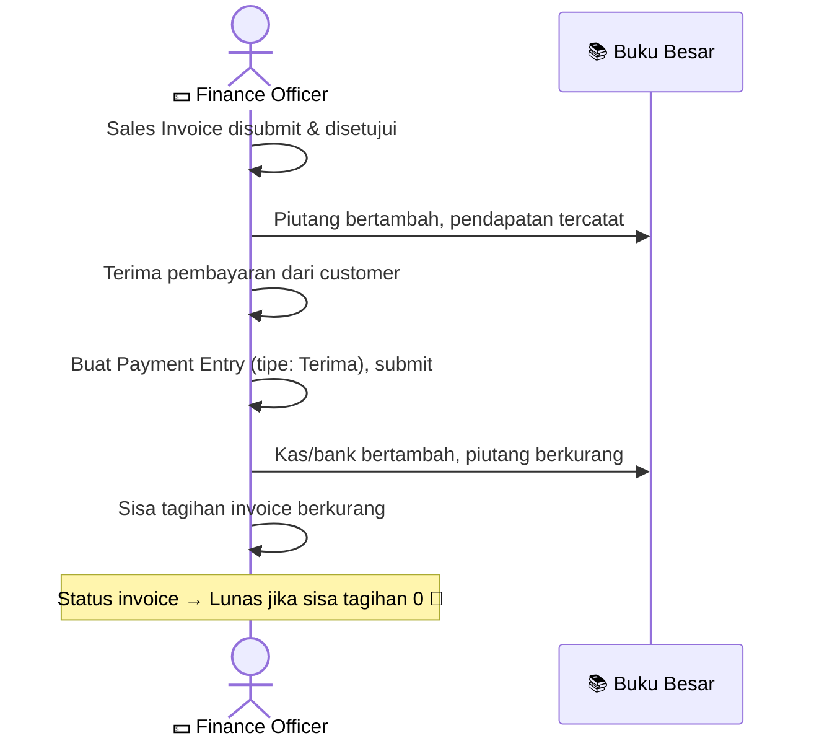
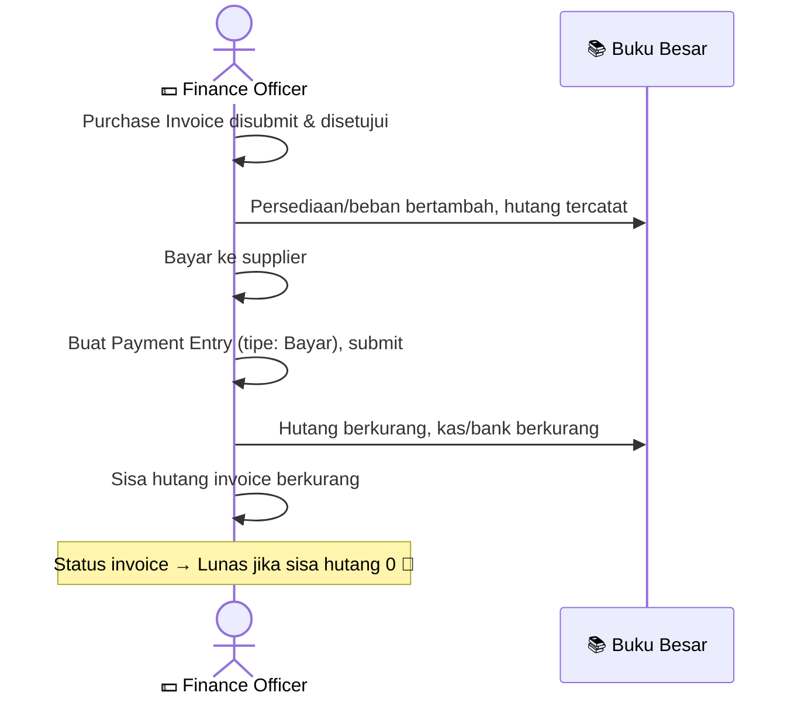

# Modul Finances

> Dokumentasi modul keuangan: Accounts, General Ledger, Invoices, Payment Entries, Taxes.

## Daftar Isi

- [Gambaran Modul](#gambaran-modul)
- [Korelasi Antar-Feature](#korelasi-antar-feature)
- [Chart of Accounts](#chart-of-accounts)
- [General Ledger](#general-ledger)
- [Sales Invoice](#sales-invoice)
- [Purchase Invoice](#purchase-invoice)
- [Payment Entry](#payment-entry)
- [Payment Methods & Terms](#payment-methods--terms)
- [Taxes](#taxes)
- [Business Flow Keuangan](#business-flow-keuangan)

---

## Gambaran Modul

Modul Finances mengelola semua aspek keuangan: buku besar, tagihan, pembayaran, dan akuntansi.

**Dokumen utama yang terlibat:**

| Dokumen | Fungsi |
|---|---|
| Chart of Accounts | Daftar akun keuangan perusahaan |
| General Ledger | Buku besar (dibuat otomatis) |
| Sales Invoice | Tagihan ke customer |
| Purchase Invoice | Tagihan dari supplier |
| Payment Entry | Transaksi pembayaran (terima/bayar) |
| Tax | Daftar tarif pajak |

---

## Korelasi Antar-Feature

Modul Finances adalah **muara akuntansi** — setiap invoice & pembayaran yang disubmit otomatis tercatat di buku besar. Sales Invoice berasal dari Sales Order, Purchase Invoice berasal dari Purchase Order. Kedua alur (piutang dari penjualan, hutang dari pembelian) berjalan dengan pola yang sama persis, hanya arah uangnya yang berbeda.

Kedua alur di atas sama-sama bermuara ke **Chart of Accounts** — setiap pencatatan di Buku Besar otomatis memperbarui saldo akun terkait (Kas, Piutang, Hutang, Pendapatan, Beban, dst.).

| Langkah | Efek |
|---|---|
| 1️⃣ Invoice disubmit | Piutang/hutang bertambah, pendapatan/beban tercatat di buku besar; jadwal pembayaran otomatis dibuat dari Template Termin |
| 2️⃣ Pembayaran terjadi | Payment Entry dibuat — dialokasikan ke jadwal yang **jatuh tempo paling dekat** terlebih dahulu |
| 3️⃣ Payment Entry disubmit | Kas/bank berubah, piutang/hutang berkurang; status invoice ikut diperbarui (Belum Dibayar → Sebagian Dibayar → Lunas) |

> Korelasi operasional: [Sales](sales.md#korelasi-antar-feature) · [Purchase](purchase.md#korelasi-antar-feature).

---

## Chart of Accounts

Daftar akun keuangan perusahaan, bisa disusun berjenjang. Ini adalah dasar dari seluruh pencatatan akuntansi.

### Fields

| Field | Deskripsi |
|---|---|
| Nama Akun | Nama akun (mis. "Kas", "Piutang Dagang") |
| Nomor Akun | Nomor identifikasi akun |
| Akun Grup | Apakah ini akun induk (bukan akun transaksi langsung) |
| Kategori Utama | Aset, Kewajiban, Modal, Pendapatan, atau Beban |
| Tipe Laporan | Tipe untuk keperluan laporan keuangan |
| Posisi Normal | Debit atau Kredit |
| Tipe Detail | Piutang, hutang, kas/bank, dll. |
| Rate Pajak | Khusus akun pajak |
| Saldo Saat Ini | Saldo akun terkini |
| Akun Kontra | Apakah akun ini pengurang dari akun lain |
| Mata Uang Default | Mata uang default akun |

---

## General Ledger

Buku besar otomatis yang dibuat setiap kali dokumen keuangan disubmit — tidak pernah diinput manual.

### Fields

| Field | Deskripsi |
|---|---|
| Dokumen Sumber | Dokumen yang menyebabkan entri ini |
| Akun Utama | Akun yang tercatat |
| Akun Lawan | Akun pasangan transaksi |
| Branch | Cabang terkait |
| Pihak Terkait | Customer atau Supplier |
| Debit | Nilai debit |
| Kredit | Nilai kredit |
| Keterangan | Deskripsi transaksi |

> **Read-only** — buku besar tidak pernah diinput atau diubah manual, semuanya tercatat otomatis dari dokumen yang disubmit.

---

## Sales Invoice

Tagihan ke customer. Dibuat dari Sales Order setelah barang dikirim atau bersamaan.

### Fields Utama

| Field | Deskripsi |
|---|---|
| Kode | Kode invoice (dibuat otomatis) |
| Tanggal | Tanggal invoice |
| Customer | Pelanggan yang ditagih |
| Cabang Customer | Cabang tujuan tagihan |
| Sales Order | SO yang menjadi dasar tagihan |
| Akun Piutang | Akun pembukuan untuk piutang |
| Akun Pendapatan | Akun pembukuan untuk pendapatan |
| Total | Total nilai invoice |
| Sudah Dibayar | Jumlah yang sudah diterima |
| Sisa Tagihan | Sisa yang belum dibayar |
| Diskon | Diskon invoice |
| Mata Uang & Kurs | Untuk transaksi mata uang asing |
| Baris Item | Daftar barang yang ditagih |

### SI Item Fields

| Field | Deskripsi |
|---|---|
| Baris SO Terkait | Baris Sales Order asal |
| Item (Variant) | Barang yang ditagih |
| Jumlah | Jumlah ditagih |
| Harga Satuan | Harga per unit |
| Tarif Pajak | Rate pajak — **opsional**, baris tanpa pajak tetap valid |
| Subtotal | Jumlah × harga satuan, sebelum pajak |
| **DPP** | Dasar Pengenaan Pajak — dihitung otomatis dari Subtotal |
| **Nilai Pajak** | Dihitung otomatis dari DPP × tarif pajak |

> **Bagaimana pajak dihitung:** Sistem menghitung **DPP (Dasar Pengenaan Pajak)** sebagai **11/12 dari Subtotal** — ini mengikuti aturan PPN Indonesia untuk "DPP Nilai Lain". Nilai Pajak kemudian dihitung dari DPP dikali tarif pajak, bukan langsung dari Subtotal. Kedua nilai ini **dihitung otomatis oleh sistem** — Anda tidak perlu (dan tidak bisa) mengisinya manual; cukup isi Subtotal dan pilih tarif pajaknya, sisanya otomatis.
>
> **Pajak bersifat opsional** — baris item tetap bisa disimpan tanpa memilih pajak. Jika tidak ada pajak dipilih, DPP dan Nilai Pajak otomatis bernilai 0.

### Alur Setelah Disubmit

Saat Sales Invoice disubmit dan disetujui:
1. Piutang bertambah, pendapatan tercatat di buku besar.
2. Jumlah tertagih pada Sales Order diperbarui.
3. Status Sales Order ikut disesuaikan.

### Alur Status SI

Draft → Diajukan → Menunggu Persetujuan → Disetujui (piutang tercatat)
- Sisa tagihan berkurang setiap ada Payment Entry baru.
- Status berubah: Belum Dibayar → Sebagian Dibayar → Lunas.

---

## Purchase Invoice

Tagihan dari supplier. Dibuat dari Purchase Order setelah barang diterima atau bersamaan.

### Fields Utama

| Field | Deskripsi |
|---|---|
| Kode | Kode invoice (dibuat otomatis) |
| Supplier | Pemasok yang menagih |
| Purchase Order | PO yang menjadi dasar tagihan |
| Akun Hutang | Akun pembukuan untuk hutang |
| Akun Beban/Persediaan | Akun pembukuan untuk beban atau persediaan |
| Total | Total nilai invoice |
| Sudah Dibayar | Jumlah yang sudah dibayarkan |
| Sisa Hutang | Sisa yang belum dibayar |

### PI Item Fields

| Field | Deskripsi |
|---|---|
| Baris PO Terkait | Baris Purchase Order asal |
| Item (Variant) | Barang yang ditagih |
| Jumlah | Jumlah ditagih |
| Harga Satuan | Harga per unit |
| Tarif Pajak | Rate pajak — opsional |
| Subtotal | Jumlah × harga satuan, sebelum pajak |
| **DPP** | Dasar Pengenaan Pajak — dihitung otomatis |
| **Nilai Pajak** | Dihitung otomatis dari DPP |
| **Total Baris** | Subtotal + Nilai Pajak |

> Formula dan cara hitungnya identik dengan Sales Invoice — lihat penjelasan lengkap di [SI Item Fields](#si-item-fields).

### Alur Setelah Disubmit

Saat Purchase Invoice disubmit dan disetujui:
1. Beban/persediaan bertambah, hutang tercatat di buku besar.
2. Jumlah tertagih pada Purchase Order diperbarui.
3. Status Purchase Order ikut disesuaikan.

---

## Payment Entry

Transaksi pembayaran invoice — bisa berupa penerimaan dari customer atau pembayaran ke supplier.

### Fields Utama

| Field | Deskripsi |
|---|---|
| Kode | Kode dokumen (dibuat otomatis) |
| Tanggal | Tanggal pembayaran |
| Tipe | Terima (dari customer) atau Bayar (ke supplier) |
| Pihak | Customer atau Supplier |
| Invoice yang Dibayar | Invoice yang menjadi tujuan pembayaran |
| Nilai Pembayaran | Jumlah uang yang diterima/dibayarkan |
| Kurs | Untuk pembayaran mata uang asing |
| Akun Penerima / Pengirim | Akun kas/bank terkait |
| Metode Pembayaran | Transfer, tunai, dll. |
| Catatan | Catatan tambahan |

### Apa yang Terjadi Saat Payment Entry Disubmit

> **Alokasi jadwal pembayaran**: jika invoice punya beberapa jadwal cicilan, pembayaran otomatis diisikan ke jadwal yang **jatuh tempo paling dekat** terlebih dahulu, sampai jadwal itu lunas, baru lanjut ke jadwal berikutnya.

---

## Payment Methods & Terms

### Payment Methods

Metode pembayaran (transfer, tunai, kartu kredit, dll.) dengan akun kas/bank default masing-masing.

### Payment Schedules (Jadwal Pembayaran)

Jadwal pembayaran invoice (cicilan/termin) — dibuat otomatis dari Template Termin yang dipilih.

| Field | Deskripsi |
|---|---|
| Persentase | Porsi dari total invoice untuk jadwal ini |
| Jatuh Tempo | Tanggal harus dibayar |
| Nilai Tagihan | Nilai yang harus dibayar di jadwal ini |
| Sudah Dibayar | Jumlah yang sudah dibayarkan untuk jadwal ini |
| Sisa | Sisa yang belum dibayar |
| Diskon Bayar Cepat | Diskon jika dibayar sebelum tanggal tertentu |

> **Diperbarui oleh Payment Entry**: saat pembayaran disetujui, nilainya dialokasikan ke jadwal-jadwal invoice secara berurutan berdasarkan tanggal jatuh tempo terdekat.

### Payment Term Templates

Template jadwal pembayaran yang bisa dipakai berulang untuk customer/supplier (mis. "Net 30" — jatuh tempo 30 hari, atau "50% DP, 50% Pelunasan").

---

## Taxes

Daftar tarif pajak yang dipakai di baris item semua dokumen transaksi.

| Field | Deskripsi |
|---|---|
| Nama | Nama pajak (mis. PPN 11%, PPh 23%) |
| Rate | Tarif pajak dalam persen |

---

## Business Flow Keuangan

### Flow Pembayaran Piutang (Sales)

### Flow Pembayaran Hutang (Purchase)

---

## Related Documents

| Topik | Dokumen |
|---|---|
| Sumber Sales Invoice | [Sales · Sales Order](sales.md#sales-order) |
| Sumber Purchase Invoice | [Purchase · Purchase Order](purchase.md#purchase-order) |
| Item line → ItemVariant | [Inventory · Item & Variant](inventory.md#item--variant) |
| Approval invoice & payment | [Core · Approval](core.md#approval) |
