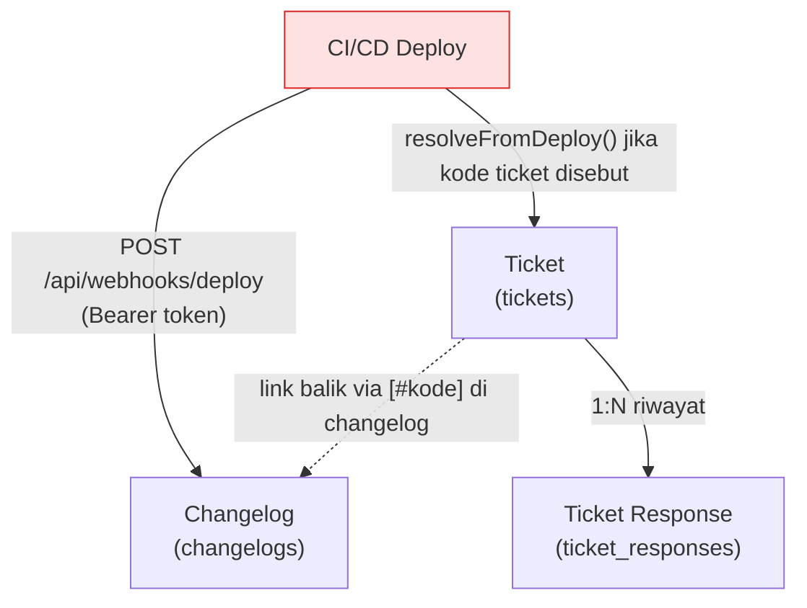
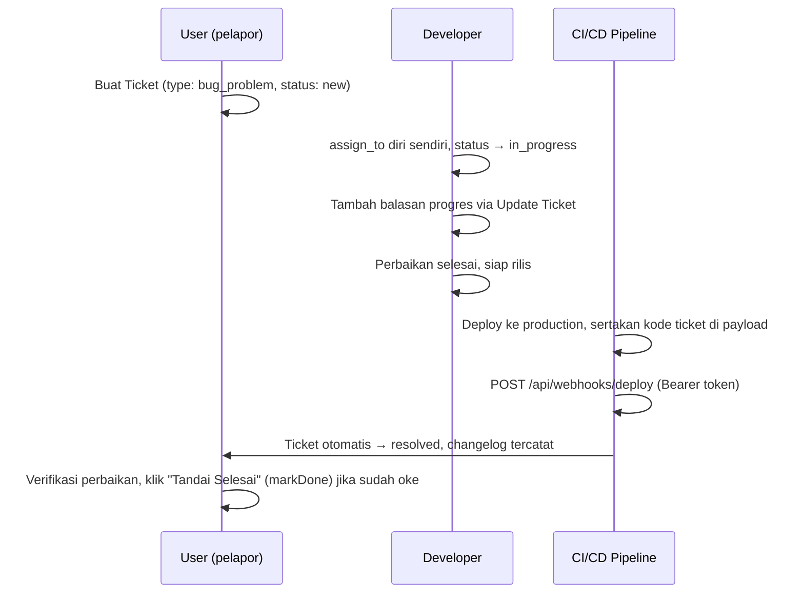

# Modul Helpdesk

> Dokumentasi modul tiket dukungan internal: Ticket, riwayat respons, dan integrasi otomatis dengan Changelog rilis.

## Daftar Isi

- [Gambaran Modul](#gambaran-modul)
- [Korelasi Antar-Feature](#korelasi-antar-feature)
- [Ticket](#ticket)
- [Ticket Response](#ticket-response)
- [Integrasi Deploy - Changelog - Ticket](#integrasi-deploy---changelog---ticket)
- [Business Flow End-to-End](#business-flow-end-to-end)

---

## Gambaran Modul

Modul Helpdesk adalah sistem tiket dukungan **internal** (bug report, permintaan tugas, pertanyaan) — bukan portal customer-facing. Dipakai tim untuk melacak masalah/permintaan dan otomatis terhubung ke rilis aplikasi lewat mekanisme deploy webhook.

**Model utama:**

| Model | Tabel | Submitable |
|---|---|---|
| `Ticket` | `tickets` | **Tidak** |
| `TicketResponse` | `ticket_responses` | — |

> **Penting — beda dari dokumen bisnis lain**: `Ticket` **bukan** model [Submitable](core.md#trait-submitable). Statusnya memakai `FormStatusCast` (nilai tunggal), bukan `FormStatusesCast` (array multi-status yang dipakai SO/PO/Invoice/dst). Artinya Ticket **tidak** melalui alur DRAFT → SUBMITTED → APPROVED, tidak dicek terhadap [ApprovalScheme](core.md#approval), dan tidak menghasilkan entri di General Ledger atau Stock Ledger.

**Service:** `TicketService`

### Catatan Permission — Ticket di luar sistem RBAC standar

`Helpdesk\TicketController` men-set `protected bool $ignorePermission = true`. Ini berarti **semua user yang login bisa membuka dan membuat Ticket**, tanpa dicek terhadap matrix Role/Permission yang dijelaskan di [Auth · Roles & Permissions](../auth.md#roles--permissions). Pengecualian: dua aksi berikut tetap dijaga permission `write` secara eksplisit lewat override `enforcePermission()`:

| Action | Permission yang dicek |
|---|---|
| `markDone` | `write` |
| `updateTicket` | `write` |

> Untuk maintainer: jika Ticket tidak muncul di daftar konfigurasi Role/Permission pada halaman Settings → Roles, ini **bukan bug** — modul ini memang didesain terbuka untuk semua user, kecuali dua aksi update di atas.

---

## Korelasi Antar-Feature



| Dari | Ke | Mekanisme |
|---|---|---|
| Ticket | TicketResponse | Setiap perubahan signifikan pada Ticket (create, markDone, updateTicket, resolve otomatis dari deploy) **selalu** membuat baris `TicketResponse` baru sebagai snapshot riwayat — bukan cuma komentar |
| CI/CD Deploy | Changelog | Webhook eksternal mencatat rilis versi baru |
| CI/CD Deploy | Ticket | Webhook bisa menyertakan daftar kode ticket yang "selesai" pada rilis tersebut → auto-resolve |
| Changelog | Ticket | Teks changelog format `[#KODE-TICKET]` otomatis dikonversi jadi link ke halaman ticket terkait |

---

## Ticket

Ticket adalah unit kerja/laporan tunggal — bug, tugas, atau pertanyaan yang perlu ditindaklanjuti.

### Fields

| Field | Tipe | Deskripsi |
|---|---|---|
| `code` | string | Kode unik ticket (auto: FormatingSeries, format `#@[yy]/@[iiii]`) |
| `type` | enum | Lihat tabel Tipe di bawah |
| `priority` | enum | Lihat tabel Prioritas di bawah |
| `subject` | string | Judul/ringkasan ticket |
| `status` | enum | Lihat tabel Status di bawah |
| `progress` | tinyint (0-100) | Persentase progres penyelesaian |
| `assign_to` | relation | User yang ditugaskan |
| `created_by` | relation | User pembuat ticket |
| `branch` | relation | Cabang terkait (opsional) |
| `start_date` | datetime | Tanggal mulai dikerjakan |
| `due_date` | datetime | Batas waktu (opsional) |
| `end_date` | datetime | Tanggal selesai (terisi otomatis saat `markDone`/resolve) |
| `responses` | hasMany | Riwayat respons — lihat [Ticket Response](#ticket-response) |

> `canDelete = false` pada model — Ticket **tidak bisa dihapus** dari UI (menjaga riwayat/audit trail tetap utuh).

### Tipe (`type`)

| Value | Label UI |
|---|---|
| `bug_problem` | Bug / Masalah |
| `task` | Tugas |
| `question` | Pertanyaan |
| `other` | Lainnya |

### Prioritas (`priority`)

| Value | Label UI |
|---|---|
| `low` | Rendah |
| `medium` | Sedang (default) |
| `high` | Tinggi |
| `critical` | Kritis |

### Status (`status`)

| Value | Label UI |
|---|---|
| `new` | Baru (default) |
| `in_progress` | Sedang Dikerjakan |
| `on_hold` | Ditunda |
| `resolved` | Terselesaikan |
| `done` | Selesai |

### Business Logic

- **Create**: saat Ticket dibuat, `TicketService::create()` otomatis membuat kode via FormatingSeries dan membuat baris `TicketResponse` pertama sebagai snapshot kondisi awal. Jika `status` diisi `done` tapi `progress` < 100, progress otomatis dipaksa ke 100.
- **Update biasa** (`update`): mengubah field Ticket tanpa membuat TicketResponse baru — ini beda dari `updateTicket` di bawah.
- **Mark Done** (`PUT /tickets/{ticket}/markDone`): set `status=done`, `progress=100`, `end_date=sekarang`, sekaligus mencatat `TicketResponse` baru. Aksi ini **tidak dapat dibatalkan** (sesuai pesan konfirmasi di UI).
- **Update Ticket** (`PUT /tickets/{ticket}/updateTicket`): dipakai untuk menambah balasan/pembaruan sekaligus mengubah `assign_to`, `status`, dan `progress` — selalu menghasilkan `TicketResponse` baru berisi `content`/`content_json` (rich text).
- **Resolve dari deploy** (otomatis, lihat [Integrasi Deploy](#integrasi-deploy---changelog---ticket)): jika ticket belum `resolved`/`done`, status di-set `resolved`, progress `90`, `assign_to` dialihkan kembali ke `created_by`, dan tercatat `TicketResponse` otomatis berisi catatan versi deploy.

> **Sanitasi konten**: field `content` pada respons (rich text dari editor) selalu di-sanitasi lewat `HTMLSanitizerService` sebelum disimpan — mencegah XSS dari HTML berbahaya yang mungkin ter-paste ke editor.

### Routes — Ticket

`Helpdesk\TicketController` — 12 route dasar `tickets.*` ([macro `resourceDetail`](../routes.md#konvensi-macro-routeresourcedetail), non-submitable) → prefix `/tickets`, + tambahan:

| Method | URI | Route Name | Controller@method |
|---|---|---|---|
| PUT | `/tickets/{ticket}/markDone` | `tickets.markDone` | `TicketController@markDone` |
| PUT | `/tickets/{ticket}/updateTicket` | `tickets.updateTicket` | `TicketController@updateTicket` |

### Frontend Pages

| Entitas | File |
|---|---|
| Ticket | `Pages/Helpdesk/Tickets/` — `Index`, `Form`, `Show`, `ResponseForm` |

Lihat juga [Frontend · Helpdesk](../frontend.md#helpdesk).

---

## Ticket Response

Baris riwayat/log Ticket — berfungsi ganda sebagai **snapshot status** (dibuat otomatis tiap perubahan signifikan) dan **thread balasan** (saat user menambah catatan manual via Update Ticket).

### Fields

| Field | Tipe | Deskripsi |
|---|---|---|
| `ticket` | relation | Ticket induk |
| `user` | relation | Pembuat respons (nullable — kosong bila dibuat otomatis dari deploy webhook) |
| `assign_to` | relation | Assignee pada saat snapshot dibuat |
| `type`, `priority`, `subject`, `status`, `progress` | — | Salinan kondisi Ticket pada saat snapshot |
| `start_date`, `due_date`, `end_date` | datetime | Salinan tanggal Ticket pada saat snapshot |
| `content` | longtext | Isi balasan (HTML, sudah disanitasi) |
| `content_json` | longtext (json) | Isi balasan dalam format rich-text editor (Tiptap) |

> Karena tiap baris menyimpan salinan penuh kondisi Ticket, tabel ini berfungsi sebagai **audit trail lengkap** — histori status/prioritas/assignee Ticket dari waktu ke waktu bisa direkonstruksi tanpa perlu tabel log terpisah.

---

## Integrasi Deploy - Changelog - Ticket

Fitur ini menghubungkan proses rilis aplikasi (CI/CD) dengan tiket yang diselesaikan pada rilis tersebut, sekaligus mencatat changelog untuk dilihat user di aplikasi.

### Alur

1. Pipeline CI/CD memanggil `POST /api/webhooks/deploy` dengan header `Authorization: Bearer <token>` (token dikonfigurasi di `config('services.deploy.webhook_token')` — **bukan** otentikasi Sanctum/session biasa, murni untuk sistem eksternal).
2. Payload berisi: `environment`, `version`, `changelog` (teks, mendukung format Markdown), dan opsional `tickets` (array kode ticket, maks. 50).
3. `ChangelogService::store()` menyimpan/update entri `Changelog` (unik per `version`) — teks mentah (`content_raw`) dikonversi ke HTML (`content_html`) via Markdown parser dengan `html_input: strip` (mencegah HTML mentah/berbahaya dieksekusi).
4. Format `[#KODE-TICKET]` di dalam teks changelog otomatis dikonversi jadi link menuju halaman ticket terkait.
5. Untuk tiap kode ticket yang disertakan, `TicketService::resolveFromDeploy()` dipanggil — ticket yang belum `resolved`/`done` akan di-set `resolved` otomatis; ticket yang sudah selesai dilaporkan sebagai `already_resolved` di response, dan kode yang tidak ditemukan dilaporkan di `not_found`.

### Response API

```json
{
  "resolved": ["TICKET-001"],
  "not_found": ["TICKET-999"],
  "already_resolved": ["TICKET-002"],
  "changelog_id": "01..."
}
```

### Model Changelog terkait

| Field | Tipe | Deskripsi |
|---|---|---|
| `version` | string | Versi rilis (unik) |
| `environment` | string | Environment tujuan deploy |
| `content_raw` | text | Teks changelog asli (Markdown) |
| `content_html` | text | Hasil konversi HTML (sudah disanitasi) |
| `deployed_at` | datetime | Waktu deploy tercatat |
| `readers` | belongsToMany | User yang sudah membaca (via pivot `changelog_reads`, kolom `read_at`) |

> Detail lengkap model Changelog & halaman `/changelogs`: [Core · Changelog](core.md#changelog).

---

## Business Flow End-to-End



---

## Related Documents

| Topik | Dokumen |
|---|---|
| Changelog & halaman `/changelogs` | [Core · Changelog](core.md#changelog) |
| Sistem permission RBAC standar (tidak berlaku penuh di modul ini) | [Auth · Roles & Permissions](../auth.md#roles--permissions) |
| Penomoran kode Ticket | [Core · FormatingSeries](core.md#formatingseries-penomoran-dokumen) |
| Tabel database | [Database · Domain Helpdesk](../database.md#domain-helpdesk) |
| Daftar route + Controller@method | [Routes · Helpdesk](../routes.md#16-helpdesk) |
| Halaman React | [Frontend · Helpdesk](../frontend.md#helpdesk) |
