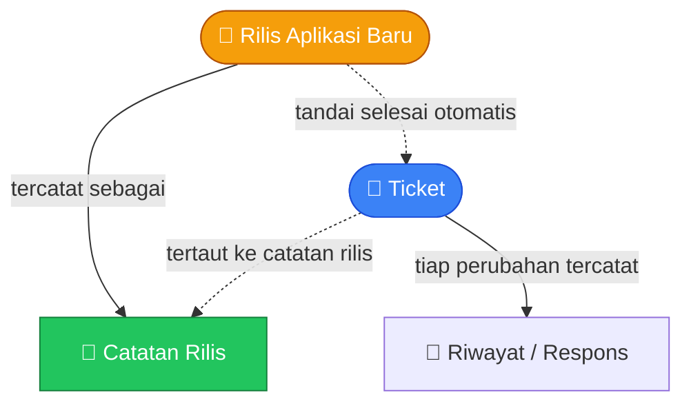
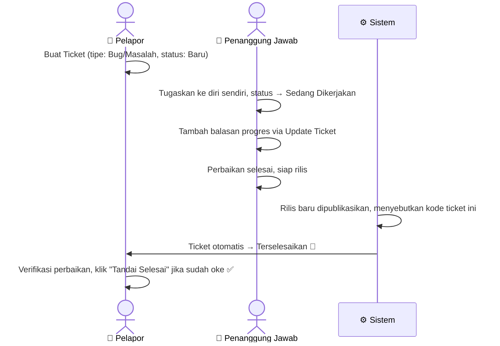

# Modul Helpdesk

> Dokumentasi modul tiket dukungan internal: Ticket dan riwayat respons.

## Daftar Isi

- [Gambaran Modul](#gambaran-modul)
- [Korelasi Antar-Feature](#korelasi-antar-feature)
- [Ticket](#ticket)
- [Ticket Response](#ticket-response)
- [Integrasi Deploy - Changelog - Ticket](#integrasi-deploy---changelog---ticket)
- [Business Flow End-to-End](#business-flow-end-to-end)

---

## Gambaran Modul

Modul Helpdesk adalah sistem tiket dukungan **internal** — dipakai tim untuk melacak bug, tugas, atau pertanyaan yang perlu ditindaklanjuti. Ini bukan portal untuk customer, melainkan alat bantu internal.

> **Beda dari dokumen bisnis lain**: Ticket **tidak** melalui alur persetujuan berjenjang seperti Sales Order/Purchase Order/Invoice. Statusnya diubah langsung oleh user yang menangani, tanpa proses approval.

### Siapa yang Bisa Membuka Ticket

Semua user yang login bisa membuka dan membuat Ticket — modul ini sengaja dibuat terbuka untuk semua orang, bukan dibatasi lewat pengaturan hak akses seperti modul bisnis lainnya. Hanya dua aksi yang tetap dijaga izin akses tertentu: **menandai selesai** dan **memperbarui/membalas ticket**.

---

## Korelasi Antar-Feature

| Dari | Ke | Mekanisme |
|---|---|---|
| Ticket | Riwayat/Respons | Setiap perubahan berarti pada Ticket (dibuat, ditandai selesai, dibalas, atau diselesaikan otomatis) selalu menambah satu baris riwayat baru — bukan sekadar komentar, tapi snapshot kondisi lengkap saat itu |
| Rilis Aplikasi | Catatan Rilis | Setiap rilis aplikasi baru otomatis tercatat sebagai catatan rilis yang bisa dilihat semua user |
| Rilis Aplikasi | Ticket | Rilis bisa menyebutkan kode ticket yang sudah selesai dikerjakan pada rilis tersebut — ticket itu otomatis ditandai selesai |
| Catatan Rilis | Ticket | Kode ticket yang disebut di teks catatan rilis otomatis menjadi tautan menuju halaman ticket terkait |

---

## Ticket

Ticket adalah satu laporan atau permintaan kerja — bug, tugas, atau pertanyaan yang perlu ditindaklanjuti.

### Fields

| Field | Deskripsi |
|---|---|
| Kode | Kode unik ticket (dibuat otomatis) |
| Tipe | Lihat tabel Tipe di bawah |
| Prioritas | Lihat tabel Prioritas di bawah |
| Judul | Ringkasan singkat masalah/permintaan |
| Status | Lihat tabel Status di bawah |
| Progres | Persentase penyelesaian (0-100) |
| Ditugaskan Kepada | User yang menangani |
| Dibuat Oleh | User pelapor |
| Cabang | Cabang terkait (opsional) |
| Tanggal Mulai | Kapan mulai dikerjakan |
| Batas Waktu | Tenggat penyelesaian (opsional) |
| Tanggal Selesai | Terisi otomatis saat ticket ditandai selesai |

> Ticket **tidak bisa dihapus** dari tampilan — ini disengaja agar riwayat penanganan tetap utuh dan bisa ditelusuri kapan pun.

### Tipe

| Value | Label |
|---|---|
| `bug_problem` | Bug / Masalah |
| `task` | Tugas |
| `question` | Pertanyaan |
| `other` | Lainnya |

### Prioritas

| Value | Label |
|---|---|
| `low` | Rendah |
| `medium` | Sedang (default) |
| `high` | Tinggi |
| `critical` | Kritis |

### Status

| Value | Label |
|---|---|
| `new` | Baru (default) |
| `in_progress` | Sedang Dikerjakan |
| `on_hold` | Ditunda |
| `resolved` | Terselesaikan |
| `done` | Selesai |

### Business Logic

- **Buat Ticket baru**: sistem otomatis membuat kode ticket dan mencatat baris riwayat pertama sebagai snapshot kondisi awal. Jika status langsung diisi "Selesai" tapi progres belum 100%, progres otomatis disesuaikan jadi 100%.
- **Tandai Selesai**: status berubah jadi "Selesai", progres otomatis 100%, tanggal selesai tercatat, dan menambah satu baris riwayat baru. Aksi ini **tidak dapat dibatalkan**.
- **Update/Balas Ticket**: dipakai untuk menambah balasan atau catatan progres, sekaligus bisa mengubah penerima tugas, status, dan progres — selalu menghasilkan baris riwayat baru berisi teks balasan.
- **Diselesaikan otomatis dari rilis** (lihat [Integrasi Deploy](#integrasi-deploy---changelog---ticket)): jika ticket disebutkan dalam sebuah rilis dan belum selesai, statusnya otomatis berubah jadi "Terselesaikan", progres 90%, dan tugas dialihkan kembali ke pelapor untuk verifikasi.

---

## Ticket Response

Baris riwayat pada Ticket — berfungsi ganda sebagai **snapshot status** (dibuat otomatis tiap ada perubahan penting) dan **thread balasan** (saat user menambah catatan manual).

### Fields

| Field | Deskripsi |
|---|---|
| Ticket | Ticket induk |
| User | Pembuat respons (kosong bila dibuat otomatis oleh sistem) |
| Ditugaskan Kepada | Penanggung jawab pada saat snapshot dibuat |
| Tipe, Prioritas, Judul, Status, Progres | Salinan kondisi Ticket pada saat snapshot diambil |
| Tanggal Mulai, Batas Waktu, Tanggal Selesai | Salinan tanggal Ticket pada saat snapshot |
| Isi Balasan | Teks balasan (mendukung format kaya seperti bold, list, dsb.) |

> Karena setiap baris menyimpan salinan penuh kondisi Ticket, riwayat ini berfungsi sebagai jejak audit lengkap — histori status/prioritas/penanggung jawab dari waktu ke waktu bisa ditelusuri kembali tanpa perlu tempat penyimpanan log terpisah.

---

## Integrasi Deploy - Changelog - Ticket

Fitur ini menghubungkan proses rilis aplikasi dengan tiket yang sudah selesai dikerjakan pada rilis tersebut, sekaligus mencatat catatan rilis (changelog) untuk dilihat user di aplikasi.

### Alur

1. Setiap kali ada rilis aplikasi baru, sistem mencatat versi, environment tujuan, dan teks catatan rilis (mendukung format Markdown yang otomatis dikonversi jadi tampilan rapi).
2. Rilis bisa menyertakan daftar kode ticket yang sudah selesai dikerjakan pada rilis tersebut.
3. Format `[#KODE-TICKET]` di dalam teks catatan rilis otomatis dikonversi jadi tautan menuju halaman ticket terkait.
4. Untuk tiap kode ticket yang disertakan: ticket yang belum selesai akan otomatis ditandai "Terselesaikan"; ticket yang sudah selesai sebelumnya tetap dilaporkan sebagai sudah selesai; kode yang tidak ditemukan akan dilaporkan sebagai tidak ditemukan.

### Catatan Rilis (Changelog) Terkait

| Field | Deskripsi |
|---|---|
| Versi | Versi rilis (unik) |
| Environment | Tujuan deploy |
| Isi Catatan | Teks catatan rilis, ditampilkan dalam format rapi |
| Waktu Deploy | Kapan rilis tercatat |
| Sudah Dibaca Oleh | Daftar user yang sudah membaca catatan rilis ini |

> Detail lengkap halaman catatan rilis: [Core · Changelog](core.md#changelog).

---

## Business Flow End-to-End

---

## Related Documents

| Topik | Dokumen |
|---|---|
| Catatan rilis & halaman changelog | [Core · Changelog](core.md#changelog) |
| Penomoran kode Ticket | [Core · FormatingSeries](core.md#formatingseries-penomoran-dokumen) |
